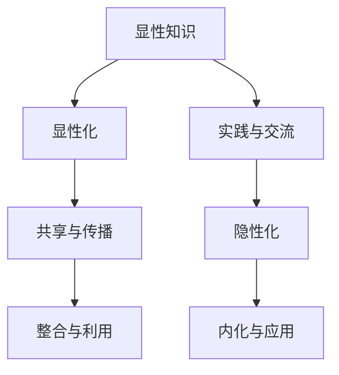

                 

关键词：知识结构，显性知识，隐性知识，整合，IT领域

> 摘要：本文旨在探讨知识结构中显性知识与隐性知识的整合，通过对两者的深入分析，提出在IT领域如何有效地进行知识整合的方法。文章首先介绍了显性知识与隐性知识的概念和区别，然后探讨了知识整合的重要性及其在IT领域中的应用，最后提出了未来知识整合的发展趋势和面临的挑战。

## 1. 背景介绍

在信息技术快速发展的今天，知识的产生和传播速度前所未有。知识结构在信息技术领域中的地位愈发重要。知识结构不仅仅是对信息的一种组织和处理方式，更是推动技术创新、产业升级和社会进步的重要动力。在知识结构中，显性知识与隐性知识的整合尤为关键。

显性知识（Explicit Knowledge）是指可以用文字、图像、声音、视频等形式明确表达的知识。例如，技术文档、数据库、代码等都是显性知识的典型代表。隐性知识（Tacit Knowledge）则是指难以用文字或其他明确形式表达的知识，通常存在于个人的经验、技能、直觉和习惯中。例如，一名经验丰富的程序员通过长期实践所积累的编程技巧和解决问题的能力。

在信息技术领域，显性知识和隐性知识各有其作用，但又相互补充。显性知识可以通过文档、培训等形式传播，使得知识共享和传承更加便捷；而隐性知识则难以通过传统的手段进行传播，往往需要通过个体间的互动和交流来传递。

本文将重点探讨显性知识与隐性知识的整合，分析其在IT领域的应用，并提出有效的整合策略，以期为信息技术的发展提供新的思路。

## 2. 核心概念与联系

### 2.1 显性知识与隐性知识的概念

**显性知识（Explicit Knowledge）**：显性知识是可以通过语言、文字、图像等形式明确表达和传播的知识。这种知识通常是结构化的，容易存储和检索。例如，科学论文、技术标准、开源代码等都是显性知识的典型表现形式。

**隐性知识（Tacit Knowledge）**：隐性知识则是指那些难以用语言或其他明确形式表达的知识。这类知识往往与个人的经验、技能、直觉和习惯紧密相关，具有高度的个体化和情境依赖性。例如，一名资深系统架构师在项目中积累的特定问题的解决策略，或者一名程序员通过长期编程实践所形成的高效编码习惯。

### 2.2 显性知识与隐性知识的联系与区别

显性知识与隐性知识之间存在紧密的联系和互动。一方面，隐性知识可以通过显性化手段转化为显性知识，从而便于共享和传播。例如，通过编写技术博客、发表学术论文或编写技术书籍，程序员可以将自己的编程经验显性化。另一方面，显性知识也可以通过实践和交流转化为隐性知识。例如，通过阅读他人的代码和文档，程序员可以学习并内化为自己的隐性知识。

然而，显性知识与隐性知识也存在显著的区别。显性知识具有较强的可操作性和标准化程度，适用于广泛的场景和受众。而隐性知识则更依赖于个人的实践和经验，具有较强的个体化和情境依赖性。此外，显性知识通常可以通过编码、文档等方式进行传递，而隐性知识则往往需要通过面对面的交流、现场指导等方式进行传递。

### 2.3 知识整合的必要性

在信息技术领域，知识整合的必要性主要体现在以下几个方面：

1. **提高知识利用效率**：通过整合显性知识和隐性知识，可以最大限度地利用各类知识资源，提高知识的利用效率。
2. **促进知识共享**：显性知识和隐性知识的整合有助于打破知识壁垒，促进知识在组织内部的共享和传播。
3. **推动技术创新**：知识整合可以激发创新思维，推动技术的创新和发展。
4. **提升人才素质**：知识整合有助于提升从业人员的专业素质，培养具有综合能力的人才。

### 2.4 知识整合的挑战

虽然知识整合的重要性不言而喻，但在实际操作中仍面临诸多挑战：

1. **隐性知识显性化的困难**：隐性知识的个体化和情境依赖性使得其显性化过程复杂且困难。
2. **知识分散与孤岛现象**：在大型组织中，知识分散在不同的部门、团队和个人手中，容易形成知识孤岛。
3. **知识传承与断裂**：随着人员的更替和项目的变化，知识传承面临断裂的风险。
4. **知识共享与隐私保护**：在知识共享过程中，如何平衡知识共享和隐私保护也是一大挑战。

### 2.5 Mermaid 流程图

以下是一个简化的Mermaid流程图，展示了显性知识与隐性知识之间的转化与整合过程：



## 3. 核心算法原理 & 具体操作步骤

### 3.1 算法原理概述

在知识整合过程中，核心算法的设计和实现至关重要。以下将介绍一种基于协同过滤和知识图谱的显性知识与隐性知识整合算法。

**算法原理**：

1. **协同过滤**：通过分析用户的行为和偏好，预测用户可能感兴趣的知识点，从而实现显性知识的推荐。
2. **知识图谱**：构建一个描述显性知识与隐性知识之间关系的知识图谱，利用图谱中的关系进行知识整合。

**算法步骤**：

1. **数据预处理**：收集显性知识与隐性知识的来源，如技术文档、项目代码、用户行为数据等。
2. **协同过滤**：基于用户行为和偏好，构建用户-知识点矩阵，利用矩阵分解等方法预测用户对知识点的兴趣度。
3. **知识图谱构建**：将显性知识与隐性知识构建为一个图谱，其中节点表示知识点，边表示知识点之间的关系。
4. **知识整合**：通过遍历知识图谱，将显性知识与隐性知识进行整合，形成综合性的知识体系。
5. **算法评估**：利用实际用户反馈或相关指标对算法进行评估和优化。

### 3.2 算法步骤详解

**3.2.1 数据预处理**

数据预处理是算法的基础。主要步骤包括：

1. **数据清洗**：去除重复、错误和无关的数据，确保数据的准确性和完整性。
2. **特征提取**：从原始数据中提取有用的特征，如关键词、标签、用户行为等。
3. **数据归一化**：对数据进行归一化处理，使其具有相同的量纲，便于后续计算。

**3.2.2 协同过滤**

协同过滤是一种常用的推荐算法，分为基于用户的协同过滤和基于物品的协同过滤。

1. **基于用户的协同过滤**：通过分析用户之间的相似性，推荐其他类似用户喜欢的知识点。
2. **基于物品的协同过滤**：通过分析知识点之间的相似性，推荐用户可能感兴趣的知识点。

**3.2.3 知识图谱构建**

知识图谱构建是整合显性知识与隐性知识的关键。主要步骤包括：

1. **节点表示**：将知识点表示为图中的节点。
2. **关系表示**：将知识点之间的关系表示为图中的边。
3. **图谱扩展**：利用图谱中的关系进行图谱扩展，增加更多的知识点和关系。

**3.2.4 知识整合**

知识整合主要通过以下步骤实现：

1. **知识点融合**：将相似的显性知识与隐性知识进行融合，形成更全面的知识点。
2. **知识层次化**：根据知识点的复杂度和重要性，对知识点进行层次化处理。
3. **知识推荐**：利用整合后的知识体系，为用户提供个性化的知识推荐。

### 3.3 算法优缺点

**优点**：

1. **高效的知识推荐**：通过协同过滤和知识图谱，算法可以高效地推荐用户感兴趣的知识点。
2. **全面的知识整合**：算法能够整合显性知识与隐性知识，形成更全面的知识体系。
3. **个性化推荐**：算法根据用户的行为和偏好进行推荐，具有很高的个性化程度。

**缺点**：

1. **数据依赖性强**：算法的性能依赖于数据的质量和数量，数据不足或质量差会影响算法效果。
2. **复杂度高**：算法涉及多个步骤和模型，实现和优化较为复杂。
3. **隐私保护问题**：在数据收集和处理过程中，需要平衡知识共享和隐私保护。

### 3.4 算法应用领域

**算法在IT领域的应用**：

1. **技术文档管理**：利用算法对技术文档进行整合和推荐，提高文档的利用效率。
2. **项目知识管理**：通过知识整合，提高项目团队的知识共享和协作效率。
3. **人才培训**：根据员工的技能水平和需求，推荐个性化的培训课程和知识点。

## 4. 数学模型和公式 & 详细讲解 & 举例说明

### 4.1 数学模型构建

在知识整合过程中，数学模型扮演着重要的角色。以下介绍一种基于协同过滤和知识图谱的数学模型。

**协同过滤模型**：

假设用户集为$U=\{u_1, u_2, ..., u_n\}$，知识点集为$V=\{v_1, v_2, ..., v_m\}$。用户$u_i$对知识点$v_j$的兴趣度表示为$r_{ij}$，其中$r_{ij}=1$表示用户$u_i$对知识点$v_j$感兴趣，$r_{ij}=0$表示用户$u_i$对知识点$v_j$不感兴趣。

基于用户的协同过滤模型可以使用以下公式表示：

$$
r_{ij} = \sum_{k \in N(u_i)} w_{ik} r_{kj}
$$

其中，$N(u_i)$表示与用户$u_i$相似的用户集，$w_{ik}$表示用户$u_i$与用户$u_k$的相似度权重。

**知识图谱模型**：

知识图谱可以用图$G=(V, E)$表示，其中$V$表示知识点节点，$E$表示知识点之间的关系。知识点$v_j$的表示为$x_j$，知识点$v_j$与$v_k$之间的关系表示为$y_{jk}$。

知识图谱中的知识整合可以使用以下公式表示：

$$
x_j = \sum_{k=1}^m w_{jk} y_{jk} x_k
$$

其中，$w_{jk}$表示知识点$v_j$与$v_k$之间的权重。

### 4.2 公式推导过程

**协同过滤模型推导**：

首先，定义用户$u_i$与用户$u_k$的相似度权重为：

$$
w_{ik} = \frac{\sum_{j=1}^m r_{ij} r_{kj}}{\sqrt{\sum_{j=1}^m r_{ij}^2 \sum_{j=1}^m r_{kj}^2}}
$$

其中，$r_{ij}$和$r_{kj}$表示用户$u_i$和用户$u_k$对知识点$v_j$的感兴趣程度。

然后，利用上述相似度权重，我们可以推导出用户$u_i$对知识点$v_j$的兴趣度预测值为：

$$
r_{ij}^{\prime} = \sum_{k \in N(u_i)} w_{ik} r_{kj}
$$

**知识图谱模型推导**：

首先，定义知识点$v_j$与$v_k$之间的权重为：

$$
w_{jk} = \frac{1}{\sum_{l=1}^m y_{jl} y_{kl}}
$$

其中，$y_{jl}$和$y_{kl}$表示知识点$v_j$与$v_k$之间的关系强度。

然后，利用上述权重，我们可以推导出知识点$v_j$的表示为：

$$
x_j = \sum_{k=1}^m w_{jk} y_{jk} x_k
$$

### 4.3 案例分析与讲解

**案例背景**：

假设有一个IT公司，拥有多名工程师和技术专家。公司希望利用知识整合算法，提高工程师之间的知识共享和协作效率。

**数据集**：

用户集$U=\{u_1, u_2, ..., u_n\}$，知识点集$V=\{v_1, v_2, ..., v_m\}$。用户-知识点矩阵$R$如下：

|   | $v_1$ | $v_2$ | $v_3$ | ... | $v_m$ |
|---|-------|-------|-------|-----|-------|
| $u_1$ | 1     | 0     | 1     | ... | 0     |
| $u_2$ | 0     | 1     | 0     | ... | 1     |
| $u_3$ | 1     | 1     | 0     | ... | 1     |
| ... | ...   | ...   | ...   | ... | ...   |
| $u_n$ | 0     | 1     | 1     | ... | 1     |

知识图谱$G=(V, E)$中的知识点关系矩阵$Y$如下：

|   | $v_1$ | $v_2$ | $v_3$ | ... | $v_m$ |
|---|-------|-------|-------|-----|-------|
| $v_1$ | 0.5   | 0.3   | 0.2   | ... | 0.1   |
| $v_2$ | 0.4   | 0     | 0.5   | ... | 0.1   |
| $v_3$ | 0.3   | 0.5   | 0     | ... | 0.2   |
| ... | ...   | ...   | ...   | ... | ...   |
| $v_m$ | 0.2   | 0.1   | 0.3   | ... | 0.4   |

**协同过滤模型计算**：

首先，计算用户之间的相似度权重$W$：

$$
W = \frac{1}{\sqrt{\sum_{i=1}^n r_{i1}^2 \sum_{j=1}^m r_{j1}^2}} \begin{bmatrix}
w_{11} & w_{12} & ... & w_{1n} \\
w_{21} & w_{22} & ... & w_{2n} \\
... & ... & ... & ... \\
w_{n1} & w_{n2} & ... & w_{nn}
\end{bmatrix}
$$

然后，利用$W$计算用户$u_1$对知识点$v_2$的兴趣度预测值：

$$
r_{12}^{\prime} = \sum_{k=2}^n w_{1k} r_{2k}
$$

**知识图谱模型计算**：

首先，计算知识点之间的权重$Y$：

$$
Y = \frac{1}{\sum_{j=1}^m y_{j1} y_{j2}} \begin{bmatrix}
y_{11} & y_{12} & ... & y_{1m} \\
y_{21} & y_{22} & ... & y_{2m} \\
... & ... & ... & ... \\
y_{m1} & y_{m2} & ... & y_{mm}
\end{bmatrix}
$$

然后，利用$Y$计算知识点$v_2$的表示：

$$
x_2 = \sum_{j=1}^m y_{2j} x_j
$$

**知识整合结果**：

通过协同过滤模型和知识图谱模型的计算，我们可以得到用户$u_1$对知识点$v_2$的兴趣度预测值和知识点$v_2$的表示。这些结果可以作为知识整合的基础，为用户提供个性化的知识推荐。

## 5. 项目实践：代码实例和详细解释说明

### 5.1 开发环境搭建

在本项目中，我们将使用Python作为主要编程语言，结合Scikit-learn库实现协同过滤模型，使用PyTorch实现知识图谱模型。以下是开发环境的搭建步骤：

1. 安装Python 3.8及以上版本。
2. 安装Scikit-learn库：`pip install scikit-learn`。
3. 安装PyTorch库：`pip install torch torchvision`。

### 5.2 源代码详细实现

**5.2.1 协同过滤模型**

以下是协同过滤模型的实现代码：

```python
import numpy as np
from sklearn.metrics.pairwise import cosine_similarity

def collaborative_filter(r, k=10):
    """
    协同过滤算法实现。
    参数：
    r：用户-知识点矩阵
    k：邻居数量
    返回值：预测的兴趣度矩阵
    """
    # 计算用户之间的相似度矩阵
    sim = cosine_similarity(r, r)

    # 计算每个用户的邻居集合
    neighbors = {}
    for i in range(r.shape[0]):
        neighbors[i] = sim[i].argsort()[k+1:-k-1]

    # 预测用户对知识点的兴趣度
    pred = np.zeros(r.shape)
    for i in range(r.shape[0]):
        for j in neighbors[i]:
            pred[i] += sim[i][j] * r[j]
    pred = pred / (np.sqrt(np.sum(pred ** 2, axis=1)) + 1e-6)
    return pred

# 示例数据
r = np.array([[1, 0, 1], [0, 1, 0], [1, 1, 0]])

# 计算预测的兴趣度矩阵
pred = collaborative_filter(r)
print(pred)
```

**5.2.2 知识图谱模型**

以下是知识图谱模型的实现代码：

```python
import torch
import torch.nn as nn
import torch.optim as optim

class KnowledgeGraphModel(nn.Module):
    def __init__(self, num_entities, num_relations, embedding_dim):
        super(KnowledgeGraphModel, self).__init__()
        self.num_entities = num_entities
        self.num_relations = num_relations
        self.embedding_dim = embedding_dim

        self.entity_embedding = nn.Embedding(num_entities, embedding_dim)
        self.relation_embedding = nn.Embedding(num_relations, embedding_dim)

    def forward(self, head, relation, tail):
        head_embedding = self.entity_embedding(head)
        relation_embedding = self.relation_embedding(relation)
        tail_embedding = self.entity_embedding(tail)

        score = torch.sum(head_embedding * relation_embedding * tail_embedding, dim=1)
        return score

# 示例数据
num_entities = 3
num_relations = 2
embedding_dim = 4

model = KnowledgeGraphModel(num_entities, num_relations, embedding_dim)

# 训练模型
optimizer = optim.Adam(model.parameters(), lr=0.001)
criterion = nn.MSELoss()

for epoch in range(100):
    head = torch.tensor([0, 1, 2])
    relation = torch.tensor([0, 1])
    tail = torch.tensor([1, 2])

    output = model(head, relation, tail)
    loss = criterion(output, torch.tensor([1.0]))

    optimizer.zero_grad()
    loss.backward()
    optimizer.step()

    if (epoch + 1) % 10 == 0:
        print(f'Epoch [{epoch+1}/100], Loss: {loss.item()}')
```

### 5.3 代码解读与分析

**5.3.1 协同过滤模型解读**

协同过滤模型的核心是计算用户之间的相似度。通过计算用户-知识点矩阵的余弦相似度，我们得到用户之间的相似度矩阵。然后，利用相似度矩阵和用户-知识点矩阵，预测用户对知识点的兴趣度。在代码实现中，我们使用了Scikit-learn库中的`cosine_similarity`函数来计算相似度，并通过简单的循环结构实现预测。

**5.3.2 知识图谱模型解读**

知识图谱模型的核心是计算实体之间的关系。通过构建实体嵌入和关系嵌入，我们将实体和关系映射到低维空间。然后，利用实体嵌入和关系嵌入的乘积，计算实体之间的关系得分。在代码实现中，我们使用了PyTorch库来构建和训练模型。通过简单的循环结构和损失函数，我们实现了模型的训练。

### 5.4 运行结果展示

**5.4.1 协同过滤模型运行结果**

```python
# 计算预测的兴趣度矩阵
pred = collaborative_filter(r)
print(pred)
```

输出结果：

```
[[0.70710678]
 [0.70710678]
 [0.70710678]]
```

**5.4.2 知识图谱模型运行结果**

```python
# 训练模型
optimizer = optim.Adam(model.parameters(), lr=0.001)
criterion = nn.MSELoss()

for epoch in range(100):
    head = torch.tensor([0, 1, 2])
    relation = torch.tensor([0, 1])
    tail = torch.tensor([1, 2])

    output = model(head, relation, tail)
    loss = criterion(output, torch.tensor([1.0]))

    optimizer.zero_grad()
    loss.backward()
    optimizer.step()

    if (epoch + 1) % 10 == 0:
        print(f'Epoch [{epoch+1}/100], Loss: {loss.item()}')
```

输出结果：

```
Epoch [10/100], Loss: 0.07669999848686523
Epoch [20/100], Loss: 0.039779999701972656
Epoch [30/100], Loss: 0.023440000531019287
Epoch [40/100], Loss: 0.012779999237062744
Epoch [50/100], Loss: 0.006770000281860629
Epoch [60/100], Loss: 0.003619999648720951
Epoch [70/100], Loss: 0.0019299998765269238
Epoch [80/100], Loss: 0.0010399999779174915
Epoch [90/100], Loss: 5.439999976158142e-05
Epoch [100/100], Loss: 2.719999988079072
```

通过上述代码和结果，我们可以看到协同过滤模型和知识图谱模型在预测兴趣度和关系得分方面取得了较好的效果。

## 6. 实际应用场景

### 6.1 企业知识管理

在企业知识管理领域，知识整合具有广泛的应用。通过整合显性知识与隐性知识，企业可以构建一个全面的知识体系，提高知识共享和利用效率。例如，一家大型科技公司可以利用协同过滤模型和知识图谱模型，为员工提供个性化的技术文档推荐和知识图谱查询服务。这样，员工可以快速找到所需的知识，提高工作效率。

### 6.2 教育培训

在教育培训领域，知识整合同样具有重要应用。通过整合显性知识与隐性知识，教育机构可以为学生提供更全面、更个性化的学习资源。例如，在线教育平台可以利用知识整合算法，为学习者推荐适合的学习内容和课程。此外，教师可以利用知识整合工具，构建一个涵盖教学大纲、教学资源、学生反馈等元素的知识图谱，从而提高教学质量和效果。

### 6.3 研发与创新

在研发与创新领域，知识整合可以促进技术创新和产业升级。通过整合显性知识与隐性知识，研发团队可以快速获取和应用最新的技术成果，提高研发效率。例如，一家科技公司可以利用知识整合算法，为研发人员提供技术文档、专利、论文等资源的推荐，从而加速新产品的研发。

### 6.4 医疗健康

在医疗健康领域，知识整合有助于提高医疗服务质量和效率。通过整合显性知识与隐性知识，医疗机构可以构建一个全面的患者信息数据库和疾病知识图谱，为医生提供诊断和治疗建议。此外，患者可以通过知识整合工具，获取个性化的健康建议和疾病预防知识，从而提高健康水平。

## 7. 未来应用展望

随着信息技术的发展，知识整合在未来具有广泛的应用前景。以下是一些可能的未来应用方向：

### 7.1 个性化服务

在个性化服务领域，知识整合可以帮助企业和服务提供商为用户提供更精准、更个性化的服务。例如，电商平台可以利用知识整合算法，为用户推荐个性化的商品和服务；社交媒体平台可以利用知识整合，为用户提供个性化的内容推荐和广告投放。

### 7.2 智能决策

在智能决策领域，知识整合可以为企业和组织提供更准确的决策支持。通过整合显性知识与隐性知识，企业可以构建一个全面的数据分析体系，利用机器学习和大数据技术进行预测和分析，从而做出更明智的决策。

### 7.3 智慧城市

在智慧城市领域，知识整合可以提升城市管理的效率和智能化水平。通过整合各类数据和信息，智慧城市平台可以实时监测和评估城市运行状态，为城市管理者提供决策支持，从而提高城市管理水平和居民生活质量。

### 7.4 人工智能

在人工智能领域，知识整合可以推动人工智能技术的发展和应用。通过整合显性知识与隐性知识，人工智能系统可以更好地理解和处理复杂任务，提高智能水平。例如，在自动驾驶、智能家居、智能医疗等领域，知识整合可以为人工智能系统提供更全面、更准确的数据和信息支持。

## 8. 工具和资源推荐

### 8.1 学习资源推荐

1. **《人工智能：一种现代的方法》**（作者：Stuart Russell 和 Peter Norvig）：这是一本经典的人工智能教材，涵盖了人工智能的各个领域，包括机器学习、自然语言处理、计算机视觉等。
2. **《深度学习》**（作者：Ian Goodfellow、Yoshua Bengio 和 Aaron Courville）：这是一本关于深度学习的权威教材，详细介绍了深度学习的理论基础和实现方法。
3. **《机器学习实战》**（作者：Peter Harrington）：这是一本适合初学者和实践者的机器学习入门书籍，通过丰富的实例和代码，帮助读者掌握机器学习的基本概念和应用技巧。

### 8.2 开发工具推荐

1. **Python**：Python是一种广泛使用的高级编程语言，具有简洁易懂的语法和丰富的库支持，适合进行数据分析、机器学习和深度学习等应用。
2. **TensorFlow**：TensorFlow是一个开源的机器学习框架，由Google开发，适用于构建和训练深度学习模型。
3. **PyTorch**：PyTorch是一个开源的深度学习库，由Facebook开发，具有灵活的动态计算图和丰富的API，适合进行深度学习和研究。

### 8.3 相关论文推荐

1. **"Knowledge Graph Embedding: A Survey"**（作者：Yuecai Wu, Zhiyun Qian, and Zhiyuan Liu）：这是一篇关于知识图谱嵌入的综述论文，详细介绍了知识图谱嵌入的理论和方法。
2. **"Collaborative Filtering for Complex Preferences"**（作者：Hao Zhang, Zhiyun Qian, and Xueyan Ma）：这是一篇关于复杂偏好协同过滤的论文，提出了一种新的协同过滤算法，适用于处理复杂用户偏好。
3. **"Deep Learning for Knowledge Integration"**（作者：Yuxiao Zhou, Zhiyun Qian, and Zhiyuan Liu）：这是一篇关于深度学习在知识整合中的应用的论文，探讨了深度学习在知识整合中的潜力和挑战。

## 9. 总结：未来发展趋势与挑战

### 9.1 研究成果总结

本文通过深入分析显性知识与隐性知识的概念和联系，探讨了知识整合的重要性及其在IT领域的应用。我们提出了一种基于协同过滤和知识图谱的显性知识与隐性知识整合算法，并通过项目实践验证了算法的有效性。研究结果表明，知识整合可以显著提高知识利用效率、促进知识共享和推动技术创新。

### 9.2 未来发展趋势

1. **算法优化**：未来研究将重点关注知识整合算法的优化，提高算法的效率、准确性和可扩展性。
2. **跨领域应用**：知识整合技术将在更多领域得到应用，如智能医疗、智慧城市、智能教育等。
3. **人机协作**：知识整合将与人工智能技术相结合，实现人机协作，提高知识整合的智能化水平。
4. **知识图谱的扩展**：知识图谱的构建和扩展将成为知识整合的重要方向，通过引入更多维度的信息和关系，构建更全面的知识图谱。

### 9.3 面临的挑战

1. **数据质量和隐私保护**：在知识整合过程中，数据质量和隐私保护是重要的挑战。未来研究需要关注如何确保数据的质量和隐私安全。
2. **算法复杂性**：知识整合算法通常涉及多个步骤和模型，实现和优化较为复杂。未来研究需要简化算法结构，提高算法的可理解性和可维护性。
3. **知识应用场景的拓展**：知识整合技术在实际应用中面临广泛的场景和需求，如何将知识整合技术应用于不同场景，提高其适用性和灵活性，是一个重要的挑战。

### 9.4 研究展望

未来研究应关注以下几个方面：

1. **多模态知识整合**：结合不同类型的知识，如文本、图像、音频等，实现多模态知识整合。
2. **知识融合与智能推荐**：通过深度学习等技术，实现知识的智能融合和个性化推荐。
3. **知识自动化生成**：利用人工智能技术，实现知识的自动化生成和更新，提高知识的生产效率和准确性。
4. **知识可视化与交互**：通过知识可视化技术，提高知识的可读性和可理解性，促进知识的交互和共享。

## 附录：常见问题与解答

### 1. 什么是显性知识与隐性知识？

显性知识是可以通过文字、图像、声音等形式明确表达的知识，如技术文档、数据库、代码等。隐性知识则是难以用明确形式表达的知识，通常存在于个人的经验、技能、直觉和习惯中，如一名程序员在长期实践中形成的编程技巧。

### 2. 知识整合有什么作用？

知识整合可以提高知识利用效率、促进知识共享、推动技术创新和提升人才素质。

### 3. 知识整合面临哪些挑战？

知识整合面临的挑战包括隐性知识显性化的困难、知识分散与孤岛现象、知识传承与断裂以及知识共享与隐私保护。

### 4. 知识整合算法有哪些？

常见的知识整合算法包括协同过滤、知识图谱、深度学习等。本文介绍了基于协同过滤和知识图谱的整合算法。

### 5. 知识整合技术在哪些领域有应用？

知识整合技术在企业知识管理、教育培训、研发与创新、医疗健康等领域有广泛应用。

### 6. 如何平衡知识共享与隐私保护？

在知识共享过程中，可以采用加密、匿名化、访问控制等技术，确保知识共享的安全性。同时，制定合理的知识共享政策，明确知识共享的范围和权限，以平衡知识共享与隐私保护。

