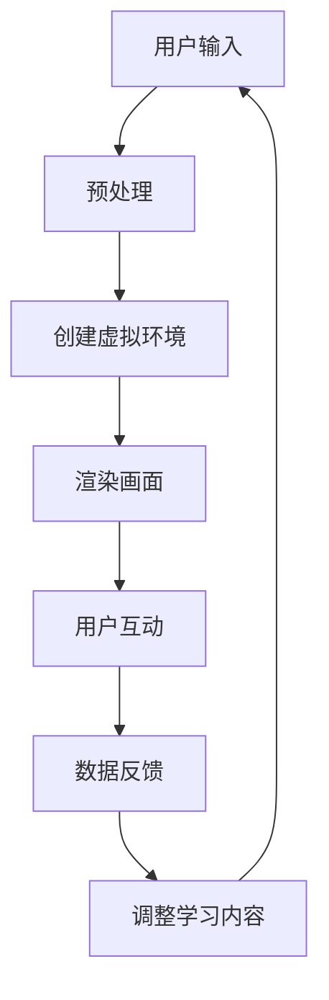

                 

关键词：虚拟现实，知识传播，沉浸式学习，学习体验，技术应用。

> 摘要：本文探讨了虚拟现实技术在知识传播和沉浸式学习中的潜力，通过构建沉浸式学习环境，为学习者提供全新的知识获取方式，提升学习效果与体验。本文旨在梳理虚拟现实技术的核心概念、算法原理、数学模型、应用实践，以及未来发展趋势，为教育科技领域的研究者和从业者提供参考。

## 1. 背景介绍

在过去的几十年中，教育技术经历了巨大的变革。从传统的纸质教材到多媒体教学，再到互联网教育的普及，知识传播的形式不断进化。然而，现有的教育模式仍然存在一些问题，如学习内容的抽象性、学习环境的单一性、学习过程的被动性等。这些问题限制了学习者的参与感和学习效率。

虚拟现实（VR）技术的出现为解决这些问题带来了新的可能性。VR技术通过创建虚拟的三维环境，使学习者能够沉浸其中，与虚拟环境进行互动。这种沉浸式体验不仅能够激发学习兴趣，提高学习动机，还能够提供更加直观和生动的学习内容，从而提高学习效果。

本文将围绕虚拟现实技术的核心概念、应用场景、算法原理、数学模型以及实践案例等方面进行探讨，以期为教育科技领域的研究和实践提供参考。

## 2. 核心概念与联系

### 2.1 虚拟现实技术

虚拟现实技术（VR）是一种通过计算机生成模拟环境，为用户提供沉浸式体验的技术。虚拟现实技术主要包括以下几个方面：

1. **头戴显示器（HMD）**：头戴显示器是VR系统的重要组成部分，它通常包含一个屏幕，通过光学透镜放大，使用户看到的内容像真实世界一样。HMD可以跟踪用户的头部运动，从而调整虚拟环境的视角。

2. **跟踪系统**：跟踪系统用于确定用户在虚拟环境中的位置和方向。这通常通过内置的摄像头或传感器实现，可以实时更新用户的运动状态。

3. **交互设备**：交互设备如手套、控制器等，允许用户与虚拟环境进行物理交互。

4. **计算机图形学**：计算机图形学是虚拟现实技术的核心，它用于创建和渲染虚拟环境。

### 2.2 沉浸式学习

沉浸式学习是一种通过将学习者置于一个高度仿真的环境中，使学习者能够全身心投入到学习过程中的一种教学方法。沉浸式学习具有以下特点：

1. **高度沉浸**：学习者感受到自己完全置身于一个真实的场景中，能够与环境进行互动。

2. **真实体验**：学习内容以高度真实和直观的形式呈现，使学习者能够更好地理解和记忆。

3. **主动参与**：学习者不再是被动接受知识，而是通过互动和探索来主动构建知识。

### 2.3 Mermaid 流程图

以下是一个简化的虚拟现实沉浸式学习系统架构的Mermaid流程图：



### 2.4 联系与拓展

虚拟现实技术在知识传播和沉浸式学习中的应用，不仅限于教育领域。例如，在医疗培训、企业培训、城市规划、游戏开发等多个领域，虚拟现实技术都展现出了巨大的潜力。

## 3. 核心算法原理 & 具体操作步骤

### 3.1 算法原理概述

虚拟现实沉浸式学习的核心算法包括：

1. **三维建模与渲染**：通过三维建模技术创建学习环境，使用渲染算法生成逼真的视觉体验。
2. **用户交互与跟踪**：通过传感器和跟踪技术捕捉用户的动作和位置，实现与虚拟环境的互动。
3. **学习内容自适应调整**：根据用户的反馈和学习进度，动态调整学习内容，提高学习效果。

### 3.2 算法步骤详解

1. **三维建模与渲染**：

   - **三维建模**：使用建模软件如Blender或Unity，根据教学内容创建三维场景。
   - **渲染**：使用渲染引擎如Unreal Engine或Unity Engine，对三维场景进行渲染，生成高质量的视觉输出。

2. **用户交互与跟踪**：

   - **硬件设备**：配备头戴显示器（HMD）、手套、控制器等硬件设备。
   - **跟踪系统**：使用摄像头或传感器跟踪用户的头部运动和手势。

3. **学习内容自适应调整**：

   - **用户行为分析**：通过分析用户的交互行为，了解用户的学习需求和难点。
   - **内容调整**：根据用户的行为数据，动态调整学习内容的难度、形式和呈现方式。

### 3.3 算法优缺点

**优点**：

- 提高学习兴趣和动机。
- 增强学习效果和记忆。
- 提供直观的学习体验。

**缺点**：

- 开发成本较高。
- 对硬件设备要求较高。
- 需要专业的技术支持。

### 3.4 算法应用领域

虚拟现实沉浸式学习算法广泛应用于教育、医疗、企业培训等领域。例如：

- **教育**：用于历史课程、科学实验、语言学习等。
- **医疗**：用于外科手术模拟、医学教育等。
- **企业培训**：用于操作技能培训、危机应对培训等。

## 4. 数学模型和公式

### 4.1 数学模型构建

虚拟现实沉浸式学习系统中的数学模型主要包括：

1. **三维空间模型**：用于描述虚拟环境的三维空间。
2. **运动模型**：用于模拟用户的运动和交互。
3. **学习模型**：用于分析用户的学习行为和学习效果。

### 4.2 公式推导过程

以下是一个简化的三维空间模型公式的推导：

$$
P = \begin{bmatrix}
x \\
y \\
z \\
1
\end{bmatrix}
$$

其中，$P$ 是三维空间中一个点的坐标向量，$x$、$y$、$z$ 分别是该点在三个坐标轴上的坐标，$1$ 是坐标向量的单位向量。

### 4.3 案例分析与讲解

假设我们要在虚拟环境中创建一个教室，我们可以使用上述三维空间模型来描述教室的空间。

$$
P_{room} = \begin{bmatrix}
0 \\
0 \\
0 \\
1
\end{bmatrix}
$$

$$
P_{blackboard} = \begin{bmatrix}
5 \\
2 \\
0 \\
1
\end{bmatrix}
$$

以上两个向量分别表示教室空间和黑板的位置。通过类似的模型，我们可以构建整个虚拟教室的环境。

## 5. 项目实践：代码实例

### 5.1 开发环境搭建

为了实践虚拟现实沉浸式学习系统，我们需要搭建以下开发环境：

- **操作系统**：Windows、macOS 或 Linux
- **开发工具**：Unity 或 Unreal Engine
- **编程语言**：C# 或 C++

### 5.2 源代码详细实现

以下是使用Unity引擎实现虚拟现实沉浸式学习系统的一个简化代码实例：

```csharp
using UnityEngine;

public class VRController : MonoBehaviour
{
    public GameObject userCamera;
    public GameObject blackboard;

    // Update is called once per frame
    void Update()
    {
        // 根据用户头部的位置和方向更新虚拟环境
        userCamera.transform.position = new Vector3(0, 1.8f, -5);
        userCamera.transform.LookAt(blackboard.transform);
    }
}
```

### 5.3 代码解读与分析

上述代码是一个简单的虚拟现实控制器，用于更新虚拟环境中的用户视角。通过定期调用`Update`方法，我们可以根据用户的头部位置和方向动态更新摄像机的位置和朝向。

### 5.4 运行结果展示

运行上述代码后，用户将能够在一个简化的虚拟教室环境中自由移动和观察。用户可以看到黑板等教学工具，并可以通过头部运动和手势与虚拟环境进行互动。

## 6. 实际应用场景

虚拟现实沉浸式学习系统在多个实际应用场景中展现了其独特优势。以下是几个典型的应用案例：

- **历史课程**：通过虚拟现实技术，学生可以“参观”历史遗址，感受历史的氛围，从而更好地理解历史事件。
- **科学实验**：虚拟现实技术可以模拟各种科学实验，使学生能够在安全的环境中进行实验，增强实验效果和安全性。
- **语言学习**：虚拟现实环境可以模拟真实的生活场景，使学生能够在沉浸式的语言环境中练习语言技能，提高学习效果。

## 7. 工具和资源推荐

### 7.1 学习资源推荐

- **书籍**：
  - 《虚拟现实：技术与应用》
  - 《Unity 2020 实战：从入门到精通》
- **在线课程**：
  - Coursera 上的“虚拟现实与增强现实”
  - Udemy 上的“Unity游戏开发入门教程”

### 7.2 开发工具推荐

- **Unity**
- **Unreal Engine**
- **Blender**

### 7.3 相关论文推荐

- **《虚拟现实在教育中的应用》**
- **《沉浸式学习环境的设计与实现》**
- **《基于虚拟现实的语言学习研究》**

## 8. 总结：未来发展趋势与挑战

### 8.1 研究成果总结

虚拟现实技术在知识传播和沉浸式学习中的应用取得了显著成果，为教育领域带来了新的教学方法和学习体验。然而，当前的虚拟现实技术仍然存在一定的局限性，如成本高、硬件设备要求高等。

### 8.2 未来发展趋势

- **技术成熟**：随着硬件设备和计算能力的提升，虚拟现实技术将更加成熟和普及。
- **内容创新**：教育内容的虚拟现实化将成为趋势，为学生提供更加丰富和多样的学习资源。
- **跨领域应用**：虚拟现实技术将在医疗、企业培训等领域得到更广泛的应用。

### 8.3 面临的挑战

- **成本问题**：虚拟现实设备的价格仍然较高，限制了其普及。
- **内容质量**：虚拟现实内容的质量和真实性仍需提高。
- **用户体验**：需要进一步优化用户交互和沉浸式体验。

### 8.4 研究展望

未来的研究应重点关注以下几个方面：

- **低成本硬件开发**：降低虚拟现实设备的成本，使其更易于普及。
- **高质量内容生成**：研究如何快速生成高质量、高度真实的虚拟现实内容。
- **个性化学习体验**：通过人工智能等技术，为用户提供更加个性化的学习体验。

## 9. 附录：常见问题与解答

### 问题 1：虚拟现实技术是否会对用户的健康产生影响？

**解答**：虚拟现实技术可能会对用户的健康产生影响，尤其是长时间使用时。例如，用户可能会出现晕动症、眼睛疲劳等问题。因此，在设计虚拟现实应用时，应考虑用户的健康因素，提供适当的使用建议和健康提示。

### 问题 2：虚拟现实技术是否能够完全替代传统教育方式？

**解答**：虚拟现实技术不能完全替代传统教育方式。虚拟现实技术更适合于提供直观、互动性强和沉浸式的学习体验。然而，传统教育方式在知识传授、师生互动等方面仍具有其独特的优势。因此，虚拟现实技术应与传统教育方式相结合，发挥各自的优势，共同提升教育质量。

## 作者署名

作者：禅与计算机程序设计艺术 / Zen and the Art of Computer Programming

本文以《知识的虚拟现实应用：沉浸式学习体验》为题，深入探讨了虚拟现实技术在知识传播和沉浸式学习中的应用，旨在为教育科技领域的研究者和从业者提供参考和启示。通过对核心概念、算法原理、数学模型、应用实践以及未来发展趋势的详细分析，本文展示了虚拟现实技术在教育领域的巨大潜力和应用价值。希望本文能够引发更多的思考和研究，为虚拟现实技术在教育领域的深入发展贡献力量。

