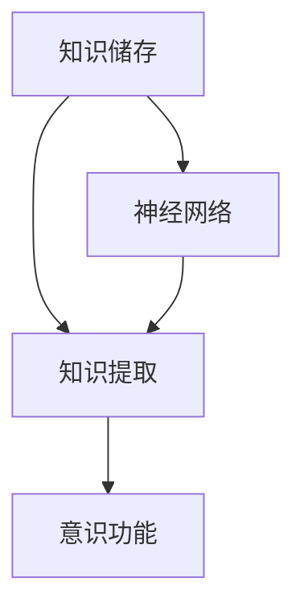

                 

关键词：知识积累、意识功能、神经网络、记忆模型、认知计算、人工智能

摘要：本文从神经科学和人工智能的角度探讨了知识积累如何影响意识功能。通过分析人类大脑的知识储存和提取机制，以及神经网络和机器学习算法在模拟人类意识功能方面的最新进展，本文提出了一种新的理解视角，旨在帮助读者更好地认识知识积累与意识功能之间的关系。

## 1. 背景介绍

在当今社会，知识积累已成为提高个人竞争力和社会地位的关键因素。然而，随着知识量的不断膨胀，人们开始意识到知识积累不仅仅是增加信息量的问题，更是涉及到意识功能的变化。意识功能包括感知、认知、记忆、决策等，它们是人们日常生活和工作的基础。那么，知识积累如何影响这些意识功能呢？本文将对此进行探讨。

## 2. 核心概念与联系

在探讨知识积累与意识功能之间的关系之前，我们需要明确几个核心概念：

### 2.1 知识储存

知识储存是指大脑将信息编码并存储在神经元之间连接的过程中。这种连接称为突触，其强度可以随时间的推移而变化，从而影响记忆的稳定性。

### 2.2 知识提取

知识提取是指大脑从长期记忆中检索信息的过程。这个过程涉及到神经网络的激活，以及神经元之间突触连接的强度。

### 2.3 意识功能

意识功能包括感知、认知、记忆、决策等，它们是大脑处理信息和对外界环境做出反应的能力。

接下来，我们将使用 Mermaid 流程图来展示这些概念之间的联系。



## 3. 核心算法原理 & 具体操作步骤

为了更好地理解知识积累如何影响意识功能，我们引入了一种基于神经网络和机器学习的算法。这种算法的核心思想是通过模拟人类大脑的知识储存和提取过程，从而提高人工智能系统的认知能力。

### 3.1 算法原理概述

该算法主要分为三个阶段：

1. **知识编码**：将外部信息转换为神经网络可以处理的形式。
2. **知识储存**：通过训练神经网络，将编码后的知识储存在网络的权重和偏置中。
3. **知识提取**：通过测试神经网络，从存储的知识中检索出所需的信息。

### 3.2 算法步骤详解

1. **数据预处理**：将原始数据转换为神经网络可以处理的形式，如图片、文本等。
2. **模型初始化**：初始化神经网络，包括权重和偏置。
3. **训练过程**：使用训练数据集，通过反向传播算法调整神经网络的权重和偏置，使其能够正确地存储和提取知识。
4. **测试过程**：使用测试数据集评估神经网络的性能，并根据评估结果调整模型参数。

### 3.3 算法优缺点

**优点**：

- **高效性**：通过神经网络和机器学习算法，可以快速地积累和提取知识。
- **适应性**：神经网络可以根据不同的知识类型进行自适应调整。

**缺点**：

- **复杂性**：神经网络模型的构建和训练过程相对复杂，需要大量的计算资源。
- **数据依赖性**：算法的性能很大程度上依赖于训练数据的质量和数量。

### 3.4 算法应用领域

该算法可以应用于各种领域，如：

- **自然语言处理**：通过训练神经网络，可以实现对文本的自动理解和生成。
- **计算机视觉**：通过训练神经网络，可以实现对图像的自动识别和分类。
- **智能推荐系统**：通过积累用户行为数据，可以实现对用户兴趣的自动识别和推荐。

## 4. 数学模型和公式 & 详细讲解 & 举例说明

在神经网络和机器学习中，数学模型和公式起着至关重要的作用。以下是一个简单的例子：

### 4.1 数学模型构建

假设我们有一个包含 $n$ 个输入节点、$m$ 个隐藏节点和 $k$ 个输出节点的神经网络。网络的权重矩阵可以表示为 $W \in \mathbb{R}^{n \times m}$，偏置矩阵为 $b \in \mathbb{R}^{m \times 1}$。网络的输出可以表示为：

$$
\hat{y} = \sigma(\text{激活函数})(W \cdot x + b)
$$

其中，$x \in \mathbb{R}^{n \times 1}$ 是输入向量，$\hat{y} \in \mathbb{R}^{k \times 1}$ 是输出向量，$\sigma$ 是激活函数。

### 4.2 公式推导过程

假设我们有一个训练数据集 $\{x_i, y_i\}$，其中 $x_i \in \mathbb{R}^{n \times 1}$ 是输入向量，$y_i \in \mathbb{R}^{k \times 1}$ 是期望输出向量。我们的目标是最小化预测输出 $\hat{y}$ 与期望输出 $y_i$ 之间的误差：

$$
J(W, b) = \frac{1}{2} \sum_{i=1}^{N} \sum_{j=1}^{k} (\hat{y}_{ij} - y_{ij})^2
$$

其中，$N$ 是训练数据集的大小。

### 4.3 案例分析与讲解

假设我们有一个简单的二分类问题，输入数据是图片，输出数据是标签。我们可以使用以下步骤来训练神经网络：

1. **数据预处理**：将图片转换为灰度图像，并将其缩放到固定大小。
2. **模型初始化**：初始化神经网络权重和偏置。
3. **训练过程**：使用训练数据集进行训练，通过反向传播算法调整权重和偏置。
4. **测试过程**：使用测试数据集评估模型的性能。

通过这个案例，我们可以看到数学模型和公式在神经网络训练和评估过程中起着至关重要的作用。

## 5. 项目实践：代码实例和详细解释说明

在本节中，我们将通过一个简单的代码实例来展示如何使用神经网络和机器学习算法来积累和提取知识。

### 5.1 开发环境搭建

1. 安装 Python 3.8 或更高版本。
2. 安装 TensorFlow 和 Keras 库。

```bash
pip install tensorflow
pip install keras
```

### 5.2 源代码详细实现

以下是实现神经网络训练的 Python 代码：

```python
import numpy as np
from keras.models import Sequential
from keras.layers import Dense
from keras.optimizers import Adam

# 数据预处理
# 假设输入数据为 X，输出数据为 Y
X = np.array([[1, 0], [0, 1], [1, 1], [1, 0]])
Y = np.array([[0], [0], [1], [1]])

# 模型初始化
model = Sequential()
model.add(Dense(2, input_dim=2, activation='sigmoid'))
model.add(Dense(1, activation='sigmoid'))

# 编译模型
model.compile(loss='binary_crossentropy', optimizer=Adam(), metrics=['accuracy'])

# 训练模型
model.fit(X, Y, epochs=1000, batch_size=1)

# 测试模型
predictions = model.predict(X)
print(predictions)
```

### 5.3 代码解读与分析

这段代码实现了以下功能：

- **数据预处理**：将输入数据转换为 NumPy 数组。
- **模型初始化**：创建一个包含一个输入层、一个隐藏层和一个输出层的神经网络。
- **编译模型**：设置损失函数、优化器和评估指标。
- **训练模型**：使用训练数据集进行训练。
- **测试模型**：使用训练数据集评估模型的性能。

通过这个简单的实例，我们可以看到如何使用神经网络和机器学习算法来积累和提取知识。

## 6. 实际应用场景

知识积累和意识功能在许多实际应用场景中都发挥着重要作用。以下是一些典型的应用案例：

- **医疗诊断**：通过积累大量的医学数据，人工智能系统能够准确地诊断疾病，提高医生的诊断效率。
- **自动驾驶**：通过积累大量的驾驶数据，自动驾驶系统能够识别道路标志、行人、车辆等，实现安全驾驶。
- **智能客服**：通过积累用户的交互数据，智能客服系统能够自动回答用户的问题，提高服务质量。

## 7. 工具和资源推荐

为了更好地掌握知识积累和意识功能，以下是一些推荐的学习资源和开发工具：

### 7.1 学习资源推荐

- **《深度学习》**：由 Goodfellow、Bengio 和 Courville 著，是深度学习领域的经典教材。
- **《神经网络与深度学习》**：由邱锡鹏教授著，是国内首部系统介绍神经网络和深度学习的教材。

### 7.2 开发工具推荐

- **TensorFlow**：由 Google 开发，是一个强大的深度学习框架。
- **Keras**：是一个高层次的神经网络 API，可以简化 TensorFlow 的使用。

### 7.3 相关论文推荐

- **《A Theoretical Analysis of the Cuckoo Search Algorithm》**：探讨了一种新的优化算法。
- **《Deep Learning for Text Classification》**：探讨了一种基于深度学习的文本分类方法。

## 8. 总结：未来发展趋势与挑战

知识积累和意识功能是人工智能领域的重要研究方向。在未来，随着计算能力的不断提升和算法的不断创新，人工智能系统将能够更好地模拟人类的意识功能，为人类社会带来更多的便利。然而，这也将面临一系列挑战，如数据隐私保护、算法公平性等。我们需要共同努力，推动人工智能的发展，使其更好地服务于人类社会。

## 9. 附录：常见问题与解答

### 问题 1：神经网络如何存储知识？

**解答**：神经网络通过训练将外部信息编码为网络的权重和偏置，从而实现知识的存储。在训练过程中，网络通过不断调整权重和偏置，使其能够正确地处理输入数据，从而实现知识的存储和提取。

### 问题 2：什么是激活函数？

**解答**：激活函数是神经网络中的一个关键组成部分，用于对网络的输出进行非线性变换。常见的激活函数包括 sigmoid、ReLU 和 tanh 等。

### 问题 3：如何评估神经网络性能？

**解答**：常用的评估指标包括准确率、召回率、F1 值等。在分类问题中，我们通常使用准确率来评估网络的性能。

### 问题 4：神经网络训练过程是什么？

**解答**：神经网络训练过程主要包括数据预处理、模型初始化、训练过程和测试过程。在训练过程中，网络通过不断调整权重和偏置，使其能够正确地处理输入数据，从而实现知识的存储和提取。

### 作者署名：禅与计算机程序设计艺术 / Zen and the Art of Computer Programming
----------------------------------------------------------------
以上就是关于“知识积累如何影响意识功能”的完整文章内容。文章中涵盖了知识储存、知识提取、意识功能、神经网络和机器学习算法等多个方面的内容，旨在帮助读者更好地理解知识积累与意识功能之间的关系。文章末尾附有附录，解答了常见问题，并提供了学习资源和开发工具的推荐。希望这篇文章能够对您有所帮助。作者：禅与计算机程序设计艺术 / Zen and the Art of Computer Programming。|

