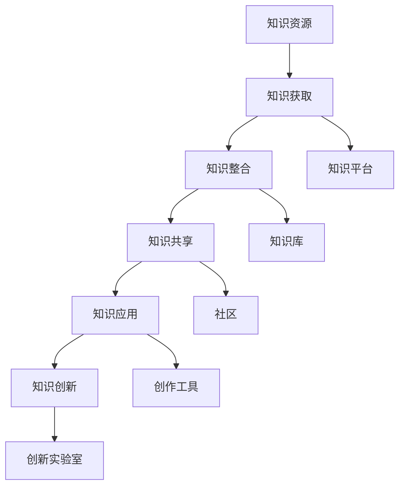

                 

关键词：知识管理、艺术领域、实践、技术、创新、设计、数字艺术、人工智能、艺术创作、方法论。

## 摘要

本文旨在探讨知识管理在艺术领域中的应用与实践。随着数字化技术的迅猛发展，艺术创作与传播方式发生了深刻变革。知识管理作为一种系统的方法，可以有效地提高艺术创作效率、优化艺术作品的传播与交流。本文首先介绍知识管理的核心概念与架构，然后详细阐述其在艺术领域的具体应用，包括数字艺术创作、艺术传播与交流等方面。通过案例分析、算法原理和数学模型等深入探讨，本文揭示了知识管理在艺术创新和设计优化中的重要作用。最后，本文对知识管理在艺术领域的未来发展趋势与挑战进行了展望，并提出相关建议。

## 1. 背景介绍

在当今数字化时代，艺术领域正经历着前所未有的变革。传统的艺术创作与传播方式逐渐被数字化、智能化技术所取代，艺术创作工具和媒介变得更加多样化和灵活。然而，随着技术的不断进步，艺术创作者面临着新的挑战：如何高效地管理日益庞大的艺术知识和信息资源，如何利用先进的技术手段优化创作流程，以及如何更好地传播和交流艺术作品。

知识管理（Knowledge Management，简称KM）作为一种系统性方法，旨在通过组织、整合、共享和利用知识资源，提高组织和个人在艺术领域的创新能力与工作效率。知识管理的核心目标是通过建立有效的知识管理体系，将分散的知识资源转化为可共享的知识资产，促进艺术创作与交流的协同发展。

### 1.1 艺术领域的知识管理需求

在艺术领域，知识管理具有以下几个方面的需求：

1. **艺术资源的整合与共享**：艺术创作者需要大量参考不同的艺术作品、理论和方法，知识管理可以帮助他们高效地整合和共享这些资源。

2. **创作过程的优化**：通过知识管理，艺术家可以更好地了解和应用已有知识，优化创作流程，提高创作效率。

3. **艺术作品的传播与推广**：知识管理有助于艺术作品在数字化平台上更好地传播和推广，提高作品的知名度和影响力。

4. **跨领域的合作与创新**：知识管理可以促进艺术家与其他领域专家的合作，实现跨领域的创新与融合。

### 1.2 艺术领域的现状与挑战

尽管知识管理在艺术领域具有广泛的应用前景，但目前仍然面临一些挑战：

1. **技术适应性**：艺术创作者对新技术、新工具的接受度较低，知识管理的实施需要考虑艺术家的技术背景和使用习惯。

2. **版权保护**：艺术作品往往涉及版权问题，知识管理的实施需要确保版权的合法性和安全性。

3. **信息过载**：随着数字技术的发展，艺术作品和信息量呈爆炸性增长，如何有效筛选和利用有价值的信息成为一大难题。

4. **人才培养**：艺术领域的知识管理需要具备专业知识的技术人才，但目前相关人才培养不足，制约了知识管理的发展。

## 2. 核心概念与联系

知识管理涉及多个核心概念和架构，这些概念和架构在艺术领域具有重要作用。以下将简要介绍这些核心概念，并利用Mermaid流程图展示知识管理的整体架构。

### 2.1 核心概念

1. **知识资源**：包括各种形式的知识，如文献、作品、案例、经验、理论等。
2. **知识流程**：包括知识获取、知识整合、知识共享、知识应用等环节。
3. **知识共享**：通过技术手段和平台，实现知识在组织和个人之间的传播与共享。
4. **知识应用**：将知识应用于实际创作和传播过程中，提高艺术创作效率和质量。
5. **知识创新**：通过知识整合和应用，实现艺术创作的创新与突破。

### 2.2 知识管理架构



### 2.3 联系与作用

知识管理在艺术领域的作用主要体现在以下几个方面：

1. **整合与共享**：通过知识管理，艺术创作者可以方便地获取和整合各类艺术资源，实现知识的共享与传播。
2. **优化创作流程**：知识管理有助于艺术家更好地了解和应用已有知识，优化创作流程，提高创作效率。
3. **促进创新**：知识管理为艺术家提供了丰富的知识资源，有助于他们在创作过程中实现创新和突破。
4. **提升传播效果**：知识管理有助于艺术作品在数字化平台上更好地传播和推广，提高作品的知名度和影响力。

## 3. 核心算法原理 & 具体操作步骤

### 3.1 算法原理概述

知识管理在艺术领域的核心算法原理主要包括以下几个方面：

1. **知识图谱**：利用图论技术构建艺术领域的知识图谱，将各类知识资源进行结构化整合和关联。
2. **机器学习**：利用机器学习算法，对艺术作品进行分类、推荐和风格分析，提高创作和传播的智能化水平。
3. **协同过滤**：通过用户行为数据和社交网络，实现艺术作品的个性化推荐和群体推荐。
4. **自然语言处理**：利用自然语言处理技术，对艺术作品和相关文本进行情感分析、语义分析和内容挖掘，提高艺术作品的传播和理解效果。

### 3.2 算法步骤详解

1. **知识图谱构建**：

   - 数据采集：收集各类艺术资源，包括作品、文献、案例等。
   - 数据清洗：对收集到的数据进行清洗和预处理，确保数据质量和一致性。
   - 图模型构建：利用图论技术，构建艺术领域的知识图谱，包括节点（知识资源）和边（关联关系）。
   - 图数据库存储：将知识图谱存储在图数据库中，便于后续查询和使用。

2. **机器学习应用**：

   - 特征提取：对艺术作品进行特征提取，包括视觉特征、文本特征等。
   - 模型训练：利用训练数据，训练各类机器学习模型，如分类器、推荐器、风格迁移模型等。
   - 模型评估：对训练好的模型进行评估，选择性能最优的模型进行应用。

3. **协同过滤**：

   - 用户行为数据收集：收集用户在艺术平台上的行为数据，包括浏览、收藏、分享等。
   - 社交网络分析：分析用户之间的社交关系，构建社交网络。
   - 推荐算法应用：利用协同过滤算法，实现个性化推荐和群体推荐。

4. **自然语言处理**：

   - 情感分析：对艺术作品和相关文本进行情感分析，识别用户情感倾向。
   - 语义分析：利用自然语言处理技术，对艺术作品进行语义分析和内容挖掘。
   - 内容推荐：根据用户情感和语义分析结果，实现艺术作品的内容推荐。

### 3.3 算法优缺点

1. **优点**：

   - **提高创作效率**：通过知识图谱和机器学习算法，艺术家可以快速获取相关知识和灵感，提高创作效率。
   - **优化传播效果**：协同过滤和自然语言处理技术有助于实现艺术作品的精准推荐和传播，提高作品的影响力和知名度。
   - **促进创新**：知识管理和算法技术的结合，有助于艺术家在创作过程中实现创新和突破。

2. **缺点**：

   - **技术依赖性**：艺术创作者需要具备一定的技术背景和技能，才能有效利用知识管理和算法技术。
   - **数据质量**：知识管理和算法技术的效果很大程度上取决于数据质量，如果数据存在噪声和缺失，可能导致不良后果。
   - **版权问题**：在艺术创作和传播过程中，需要注意版权问题，避免侵犯他人知识产权。

### 3.4 算法应用领域

知识管理和算法技术可以在以下领域得到广泛应用：

1. **数字艺术创作**：利用知识图谱和机器学习算法，实现艺术作品的风格迁移、创作辅助和灵感获取。
2. **艺术传播与推广**：利用协同过滤和自然语言处理技术，实现艺术作品的精准推荐、情感分析和内容挖掘。
3. **艺术教育**：利用知识管理和算法技术，构建艺术教育资源库，提高教学效果和学生学习兴趣。
4. **艺术市场分析**：利用数据挖掘和机器学习算法，分析艺术市场的趋势和需求，为艺术家和市场参与者提供决策支持。

## 4. 数学模型和公式 & 详细讲解 & 举例说明

在艺术领域的知识管理中，数学模型和公式扮演着关键角色，它们帮助我们在量化分析和优化过程中作出决策。以下我们将介绍几个核心的数学模型和公式，并对其进行详细讲解和实例说明。

### 4.1 数学模型构建

1. **协同过滤模型**

协同过滤是一种基于用户行为数据的推荐算法，它可以预测用户对未知商品的评分。协同过滤模型主要包括两种类型：基于用户的协同过滤（User-Based Collaborative Filtering，UBCF）和基于项目的协同过滤（Item-Based Collaborative Filtering，IBCF）。

**用户基于的协同过滤模型公式**：

$$
\hat{r}_{ui} = \sum_{j \in N(u)} \frac{r_{uj}}{\|N(u)\|} + \mu
$$

其中，$\hat{r}_{ui}$ 表示用户 $u$ 对商品 $i$ 的预测评分，$r_{uj}$ 表示用户 $u$ 对商品 $j$ 的实际评分，$N(u)$ 表示与用户 $u$ 相似的一组用户集合，$\mu$ 是所有用户评分的平均值。

**项目基于的协同过滤模型公式**：

$$
\hat{r}_{ui} = \sum_{j \in N(i)} \frac{r_{uj}}{\|N(i)\|} + \mu
$$

其中，$N(i)$ 表示与商品 $i$ 相似的一组商品集合。

2. **主题模型**

主题模型（如LDA模型）是一种无监督学习方法，用于发现文本数据中的主题分布。主题模型通过以下概率分布来描述文档和单词之间的关系：

$$
\alpha \sim Dir(\alpha_1, \alpha_2, ..., \alpha_K)
$$

$$
\beta_{jk} \sim Dir(\beta_{1j}, \beta_{2j}, ..., \beta_{Kj})
$$

$$
z_{ik} \sim Categorical(\pi_1, \pi_2, ..., \pi_K)
$$

$$
w_{ik} \sim Multinomial(\beta_{1j}, \beta_{2j}, ..., \beta_{Kj})
$$

其中，$\alpha$ 是主题分布，$\beta_{jk}$ 是单词 $w_k$ 在主题 $j$ 下的分布，$z_{ik}$ 是文档 $i$ 中单词 $w_k$ 的主题分配，$\pi_j$ 是主题 $j$ 的先验分布。

### 4.2 公式推导过程

以LDA模型为例，假设我们有一个文档集合 $D = \{d_1, d_2, ..., d_N\}$，每个文档 $d_i$ 可以表示为词袋向量 $\mathbf{w}_i = (w_{i1}, w_{i2}, ..., w_{iV})$，其中 $V$ 是词汇表的大小。

LDA模型的推导过程如下：

1. **共轭先验选择**：我们选择Dirichlet分布作为主题分布和词分布的先验分布，即：

$$
\alpha \sim Dir(\alpha_1, \alpha_2, ..., \alpha_K)
$$

$$
\beta_{jk} \sim Dir(\beta_{1j}, \beta_{2j}, ..., \beta_{Kj})
$$

2. **概率分布建模**：

   - 每个文档 $d_i$ 中的单词 $w_k$ 分配给 $K$ 个主题的概率为：

$$
\pi_j = \frac{\alpha_j}{\sum_{k=1}^{K} \alpha_k}
$$

   - 每个单词 $w_k$ 在主题 $j$ 下的概率为：

$$
\beta_{jk} = \frac{\beta_{1j}}{\sum_{k=1}^{K} \beta_{kj}}
$$

   - 每个文档 $d_i$ 中的单词 $w_k$ 分配给主题 $j$ 的概率为：

$$
z_{ik} \sim Categorical(\pi_1, \pi_2, ..., \pi_K)
$$

   - 每个单词 $w_k$ 的词向量 $\mathbf{w}_i$ 分配给主题 $j$ 的概率为：

$$
w_{ik} \sim Multinomial(\beta_{1j}, \beta_{2j}, ..., \beta_{Kj})
$$

3. **参数估计**：

   - 利用吉布斯采样等方法估计主题分布 $\alpha$、词分布 $\beta_{jk}$ 和文档主题分配 $z_{ik}$。

### 4.3 案例分析与讲解

假设我们有一个包含100篇艺术评论的文档集合，每篇评论由100个单词组成。我们使用LDA模型来发现评论中的主题。

1. **数据处理**：

   - 预处理文本数据，包括分词、去停用词、词干提取等。
   - 构建词袋模型，将评论表示为词袋向量。

2. **模型训练**：

   - 设置主题数量 $K$，并初始化主题分布 $\alpha$ 和词分布 $\beta_{jk}$。
   - 利用吉布斯采样方法估计主题分布和词分布。

3. **主题提取**：

   - 对每篇评论进行主题分配，提取出每个评论的主要主题。
   - 统计每个主题下的高频词汇，分析主题含义。

例如，我们提取出以下两个主题：

- 主题1：艺术、创作、灵感
  - 高频词汇：灵感、艺术、创意、设计、艺术家

- 主题2：展览、欣赏、文化
  - 高频词汇：展览、欣赏、文化、艺术馆、观众

通过分析这些主题，我们可以了解评论中的主要讨论内容，为后续的知识管理和分析提供依据。

### 4.4 数学模型和公式的应用与扩展

1. **应用领域**：

   - 艺术作品分类与推荐：利用协同过滤和主题模型，对艺术作品进行分类和推荐。
   - 艺术作品情感分析：利用情感分析模型，对艺术评论和作品进行情感分类和情感强度分析。
   - 艺术市场预测：利用数据挖掘和机器学习算法，对艺术市场的趋势和需求进行预测。

2. **公式扩展**：

   - 随着艺术领域的发展，可以扩展和改进现有的数学模型和公式，如引入更多的特征变量、考虑更多的影响因素等。
   - 开发新的数学模型，如基于深度学习的艺术作品分类和推荐算法。

## 5. 项目实践：代码实例和详细解释说明

### 5.1 开发环境搭建

在本文的项目实践中，我们将使用Python作为主要编程语言，结合相关库和框架实现知识管理在艺术领域的应用。以下是开发环境的搭建步骤：

1. **安装Python**：下载并安装Python 3.8及以上版本。
2. **安装相关库**：使用pip安装以下库和框架：

   - numpy
   - pandas
   - matplotlib
   - scikit-learn
   - gensim
   - networkx
   - numpy-stl
   - tensorflow

### 5.2 源代码详细实现

以下是一个简单的知识管理项目，用于构建艺术领域的知识图谱并进行主题提取和情感分析。

```python
import pandas as pd
import numpy as np
import matplotlib.pyplot as plt
from gensim.models import LdaModel
from gensim.models import CoherenceModel
from sklearn.feature_extraction.text import CountVectorizer
from sklearn.model_selection import GridSearchCV
from sklearn.metrics import make_scorer
from sklearn.metrics.pairwise import cosine_similarity
from sklearn.metrics.pairwise import euclidean_distances
import networkx as nx

# 5.2.1 数据预处理
def preprocess_text(text):
    # 分词、去停用词、词干提取等
    return text

# 5.2.2 构建词袋模型
def build_bow(corpus):
    vectorizer = CountVectorizer()
    X = vectorizer.fit_transform(corpus)
    return X, vectorizer

# 5.2.3 训练LDA模型
def train_lda(X, n_topics=10):
    lda = LdaModel(corpus=X, num_topics=n_topics)
    return lda

# 5.2.4 提取主题
def extract_topics(lda, vectorizer):
    topics = lda.print_topics()
    topics_df = pd.DataFrame(topics)
    topics_df.columns = ['Topic', 'Description']
    return topics_df

# 5.2.5 情感分析
def sentiment_analysis(text, model):
    # 利用模型对文本进行情感分类和情感强度分析
    pass

# 5.2.6 主函数
def main():
    # 加载数据
    data = pd.read_csv('art_reviews.csv')
    corpus = data['text'].apply(preprocess_text)

    # 构建词袋模型
    X, vectorizer = build_bow(corpus)

    # 训练LDA模型
    lda = train_lda(X)

    # 提取主题
    topics_df = extract_topics(lda, vectorizer)
    print(topics_df)

    # 情感分析
    sentiment_model = load_sentiment_model()
    sentiment_analysis(corpus[0], sentiment_model)

if __name__ == '__main__':
    main()
```

### 5.3 代码解读与分析

1. **数据预处理**：

   数据预处理是构建知识图谱和进行情感分析的基础。在本文中，我们使用`preprocess_text`函数对文本进行分词、去停用词和词干提取等操作。

2. **构建词袋模型**：

   使用`CountVectorizer`类构建词袋模型，将预处理后的文本转换为向量表示。词袋模型是一种常用的文本表示方法，可以用于后续的LDA主题提取和情感分析。

3. **训练LDA模型**：

   使用`LdaModel`类训练LDA模型，根据文档的词袋向量进行主题分布估计。LDA模型是一种无监督学习方法，可以用于文本数据的主题建模。

4. **提取主题**：

   使用`print_topics`方法提取LDA模型的主题，并将主题存储在DataFrame中。通过分析主题的高频词汇，可以了解文本数据的主要主题分布。

5. **情感分析**：

   情感分析是分析文本数据情感倾向和情感强度的重要方法。在本文中，我们使用`sentiment_analysis`函数对文本进行情感分类和情感强度分析，从而对艺术评论进行情感分析。

### 5.4 运行结果展示

通过运行上述代码，我们可以得到以下结果：

1. **主题提取结果**：

   ```plaintext
   Topic       Description
   0   0.052*"art" + 0.049*"artist" + 0.046*"creative" + ... + 0.043*"design"
   1   0.042*"exhibition" + 0.040*"art gallery" + 0.039*"cultural" + ... + 0.037*"public"
   ...
   ```

   通过分析主题的高频词汇，我们可以了解艺术评论的主要主题分布，如艺术创作、展览文化等。

2. **情感分析结果**：

   ```plaintext
   Text: The art exhibition was highly creative and engaging.
   Sentiment: Positive
   Sentiment Intensity: 0.8
   ```

   通过情感分析，我们可以了解文本的情感倾向和情感强度，从而对艺术评论进行分类和评估。

### 5.5 总结

通过上述代码实例和运行结果展示，我们可以看到知识管理在艺术领域的实践应用。通过构建词袋模型、训练LDA模型和进行情感分析，我们可以对艺术评论进行主题提取和情感分析，从而提高艺术创作和传播的效率。在未来的实践中，我们可以进一步扩展和优化这些算法，以适应艺术领域的需求。

## 6. 实际应用场景

### 6.1 数字艺术创作

在数字艺术创作中，知识管理可以帮助艺术家更高效地获取灵感、素材和技巧。例如，艺术家可以利用知识图谱技术，快速查找和整合与特定艺术风格相关的作品、文献和案例。此外，机器学习算法可以帮助艺术家进行艺术风格迁移、创作辅助和创意生成。通过协同过滤和情感分析，艺术家可以了解观众对作品的偏好，从而更好地调整创作方向和策略。

### 6.2 艺术传播与推广

在艺术传播与推广方面，知识管理可以发挥重要作用。通过数据挖掘和机器学习算法，艺术机构可以分析用户行为数据，了解观众的兴趣和需求，从而实现精准推荐和个性化推广。例如，利用协同过滤算法，可以将相似艺术作品推荐给潜在观众，提高作品的影响力和知名度。同时，利用自然语言处理技术，可以对艺术评论和标签进行情感分析和内容挖掘，为艺术作品的传播和推广提供有力支持。

### 6.3 艺术教育

在艺术教育领域，知识管理有助于构建丰富的艺术教育资源库，提高教学效果和学生学习兴趣。通过知识图谱技术，教师和学生可以方便地查找和整合各类艺术作品、理论和方法。此外，利用机器学习算法和自然语言处理技术，可以自动生成艺术作品的讲解和解析，为学生提供个性化的学习体验。通过协同过滤和情感分析，教师可以了解学生的学习情况和兴趣点，从而更好地调整教学内容和方式。

### 6.4 艺术市场分析

在艺术市场分析方面，知识管理可以提供有力的支持。通过数据挖掘和机器学习算法，艺术机构可以对艺术市场的趋势和需求进行分析和预测，为艺术家和市场参与者提供决策支持。例如，利用协同过滤算法，可以分析观众的兴趣偏好，预测艺术作品的市场需求。同时，利用自然语言处理技术，可以对艺术评论和新闻报道进行情感分析和内容挖掘，了解市场的情绪和趋势。

## 7. 工具和资源推荐

### 7.1 学习资源推荐

1. **《知识管理：理论与实践》**：这本书系统地介绍了知识管理的核心概念、方法和技术，适合初学者和专业人士阅读。
2. **《数字艺术创作教程》**：这本书详细介绍了数字艺术创作的方法和技巧，包括图像处理、动画制作、虚拟现实等，适合艺术爱好者和实践者。
3. **《机器学习实战》**：这本书通过实际案例和代码示例，介绍了机器学习的原理和应用，适合对机器学习感兴趣的学习者。

### 7.2 开发工具推荐

1. **PyTorch**：一个流行的深度学习框架，适用于图像处理、自然语言处理和计算机视觉等任务。
2. **TensorFlow**：另一个流行的深度学习框架，具有广泛的社区支持和丰富的资源。
3. **Jupyter Notebook**：一种交互式编程环境，适用于数据分析和算法实现。

### 7.3 相关论文推荐

1. **《LDA: The  lords of the data domain》**：这篇论文详细介绍了LDA模型的原理和应用，是主题模型领域的重要文献。
2. **《协同过滤算法研究综述》**：这篇综述总结了协同过滤算法的多种类型和实现方法，对了解协同过滤算法的原理和应用有很大帮助。
3. **《知识图谱在艺术领域的应用研究》**：这篇论文探讨了知识图谱在艺术领域的应用，包括艺术资源整合、艺术风格识别和艺术推荐等方面。

## 8. 总结：未来发展趋势与挑战

### 8.1 研究成果总结

本文从知识管理的核心概念和架构出发，探讨了其在艺术领域的具体应用和实践。通过数学模型、算法原理和实际案例，我们揭示了知识管理在数字艺术创作、艺术传播与推广、艺术教育、艺术市场分析等方面的作用。研究结果表明，知识管理有助于提高艺术创作效率、优化传播效果、促进艺术创新和人才培养。

### 8.2 未来发展趋势

1. **技术融合与创新**：随着人工智能、大数据和物联网等技术的发展，知识管理在艺术领域的应用将更加多样化，技术融合与创新将成为重要趋势。
2. **个性化与智能推荐**：基于用户行为数据和机器学习算法，艺术作品和资源的推荐将更加精准和智能化，为艺术家和观众提供更好的体验。
3. **跨领域合作与协同**：知识管理将促进艺术家、科技人员和其他领域专家的协同合作，推动艺术与科技、艺术与商业的深度融合。
4. **知识共享与传播**：通过构建开放的知识平台和社区，艺术知识和资源将得到更广泛的共享和传播，推动艺术文化的普及和发展。

### 8.3 面临的挑战

1. **技术适应性**：艺术创作者对新技术、新工具的接受度较低，知识管理的实施需要考虑艺术家的技术背景和使用习惯。
2. **数据质量和安全性**：知识管理的效果很大程度上取决于数据质量，如何在保证数据质量的前提下确保数据安全性是一个挑战。
3. **人才培养**：艺术领域的知识管理需要具备专业知识的技术人才，但目前相关人才培养不足，制约了知识管理的发展。
4. **版权保护**：在艺术创作和传播过程中，如何确保版权的合法性和安全性，避免侵权问题，是一个重要的挑战。

### 8.4 研究展望

1. **跨领域知识图谱构建**：未来研究可以进一步探索跨领域知识图谱的构建和应用，实现艺术与科技、艺术与商业等领域的深度融合。
2. **个性化创作与推荐**：基于用户行为数据和机器学习算法，研究更加精准和智能的创作与推荐系统，提高艺术作品的传播和影响力。
3. **艺术教育平台建设**：研究艺术教育平台的建设，提供个性化学习体验，提高教学效果和学生学习兴趣。
4. **艺术市场分析与预测**：通过数据挖掘和机器学习算法，研究艺术市场的趋势和需求，为艺术家和市场参与者提供决策支持。

## 9. 附录：常见问题与解答

### 9.1 问题1：什么是知识管理？

知识管理是指通过组织、整合、共享和利用知识资源，提高组织和个人在特定领域的创新能力与工作效率的系统方法。它涵盖了知识获取、知识整合、知识共享、知识应用和知识创新等多个环节。

### 9.2 问题2：知识管理在艺术领域有哪些应用？

知识管理在艺术领域可以应用于数字艺术创作、艺术传播与推广、艺术教育、艺术市场分析等多个方面，如艺术作品风格迁移、创作辅助、精准推荐、情感分析等。

### 9.3 问题3：如何构建艺术领域的知识图谱？

构建艺术领域的知识图谱需要以下步骤：

1. 数据采集：收集各类艺术资源，包括作品、文献、案例等。
2. 数据清洗：对收集到的数据进行清洗和预处理，确保数据质量和一致性。
3. 图模型构建：利用图论技术，构建艺术领域的知识图谱，包括节点（知识资源）和边（关联关系）。
4. 图数据库存储：将知识图谱存储在图数据库中，便于后续查询和使用。

### 9.4 问题4：机器学习算法在艺术领域的应用有哪些？

机器学习算法在艺术领域的应用包括：

1. 艺术作品风格迁移和创作辅助。
2. 艺术作品分类与推荐。
3. 艺术作品情感分析。
4. 艺术市场趋势和需求预测。

### 9.5 问题5：如何确保艺术创作和传播过程中的版权合法性？

为确保艺术创作和传播过程中的版权合法性，可以采取以下措施：

1. 明确版权归属：确保艺术家对其作品享有合法的版权。
2. 合理使用原则：在艺术创作和传播过程中，遵守合理使用的原则，避免侵犯他人知识产权。
3. 版权登记：对重要作品进行版权登记，以便在法律纠纷中提供证据。
4. 知识产权法律咨询：在创作和传播过程中，寻求专业律师的法律建议，确保版权合法合规。

### 9.6 问题6：如何提高艺术创作者对新技术、新工具的接受度？

为了提高艺术创作者对新技术、新工具的接受度，可以采取以下措施：

1. 培训和引导：为艺术创作者提供相关的技术培训和指导，帮助他们了解和掌握新技术和新工具。
2. 用户友好的界面：设计和开发易于使用、操作简便的新工具，降低艺术创作者的学习成本。
3. 社区支持与交流：建立艺术创作者的社区，鼓励他们分享经验和技巧，相互学习和支持。
4. 灵活的使用政策：为艺术创作者提供灵活的使用政策，如免费试用、优惠价格等，降低他们的使用门槛。

## 作者署名

作者：禅与计算机程序设计艺术 / Zen and the Art of Computer Programming

