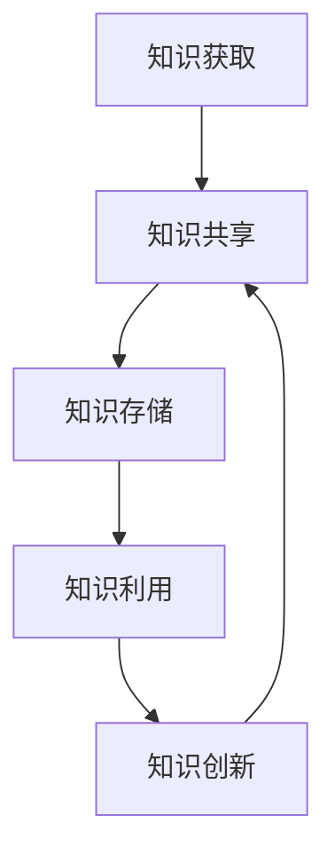
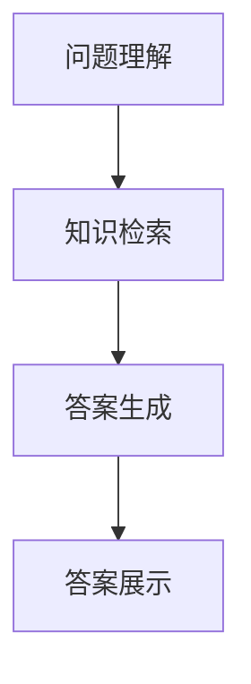

                 

关键词：知识管理，高新技术企业，知识共享，信息架构，组织学习，智能技术，知识创新

摘要：本文旨在探讨知识管理在高新技术企业的实践，通过分析知识管理的核心概念、方法与技术，探讨其在企业中的应用场景及未来发展趋势。本文将结合实际案例，对知识管理的实施策略进行深入剖析，为高新技术企业提供有益的参考和借鉴。

## 1. 背景介绍

随着信息技术的飞速发展，高新技术企业的竞争力越来越依赖于知识的创新与应用。知识管理作为现代企业管理的重要组成部分，其重要性日益凸显。知识管理涉及知识的获取、共享、存储、利用和创新等方面，通过对知识资源的有效管理，可以提升企业的核心竞争力。

本文将以知识管理在高新技术企业的实践为切入点，从以下几个方面进行探讨：

1. 核心概念与联系
2. 核心算法原理与具体操作步骤
3. 数学模型和公式与详细讲解
4. 项目实践：代码实例与详细解释说明
5. 实际应用场景与未来展望
6. 工具和资源推荐
7. 总结：未来发展趋势与挑战

## 2. 核心概念与联系

知识管理是指通过系统的方法和工具，对企业内外部的知识资源进行获取、共享、存储、利用和创新，以实现企业目标和提升企业核心竞争力。知识管理涉及以下几个核心概念：

### 2.1 知识

知识是指通过学习、实践和思考获取的信息、技能和认知。知识可以分为显性知识和隐性知识。显性知识是指以文字、图表、音频、视频等形式存在的知识，可以通过书籍、文献、数据库等方式获取。隐性知识则是指存在于人的大脑中，难以编码和传递的知识，如经验、直觉、技能等。

### 2.2 知识共享

知识共享是指将知识在组织内部或组织之间进行传递和交流的过程。知识共享有助于提升组织的学习能力和创新能力，促进知识的传承和创新。

### 2.3 知识存储

知识存储是指将知识以一定的方式存储在计算机或其他载体中，以便于查询、使用和传播。知识存储的关键在于如何实现知识的快速检索和高效利用。

### 2.4 知识利用

知识利用是指将知识应用于实际工作或项目中，以实现企业目标和价值。知识利用需要建立一套有效的知识应用机制，确保知识能够得到充分的利用。

### 2.5 知识创新

知识创新是指通过创造新的知识、组合现有知识或改进现有知识，从而实现创新。知识创新是企业持续发展的动力。

下面是一个知识管理的 Mermaid 流程图，展示了知识管理的基本流程：



## 3. 核心算法原理与具体操作步骤

### 3.1 算法原理概述

知识管理涉及多种核心算法，包括知识图谱、自然语言处理、机器学习等。以下以知识图谱为例，介绍其基本原理。

知识图谱是一种语义网络，通过实体和关系来表示知识。知识图谱的构建主要包括以下几个步骤：

1. 实体识别：从原始数据中提取出具有独立意义的实体，如人名、地名、机构名等。
2. 关系抽取：分析实体之间的语义关系，如因果关系、隶属关系等。
3. 实体链接：将同一实体的不同名称进行匹配，确保知识图谱的准确性。
4. 知识融合：将不同来源的知识进行整合，形成统一的语义表示。

### 3.2 算法步骤详解

1. **实体识别**：

   实体识别是指从原始文本中提取出具有独立意义的实体。常见的方法有基于规则的方法、基于统计的方法和基于深度学习的方法。

   ```mermaid
   graph TD
   A[原始文本] --> B[分词]
   B --> C[词性标注]
   C --> D[命名实体识别]
   D --> E[实体列表]
   ```

2. **关系抽取**：

   关系抽取是指分析实体之间的语义关系。常见的方法有基于规则的方法、基于统计的方法和基于深度学习的方法。

   ```mermaid
   graph TD
   A[实体列表] --> B[规则匹配]
   B --> C[关系列表]
   C --> D[关系网络]
   ```

3. **实体链接**：

   实体链接是指将同一实体的不同名称进行匹配。常见的方法有基于规则的方法、基于统计的方法和基于深度学习的方法。

   ```mermaid
   graph TD
   A[实体列表] --> B[实体匹配]
   B --> C[实体对]
   C --> D[实体链接]
   ```

4. **知识融合**：

   知识融合是指将不同来源的知识进行整合。常见的方法有基于规则的方法、基于统计的方法和基于深度学习的方法。

   ```mermaid
   graph TD
   A[实体对] --> B[知识融合规则]
   B --> C[融合结果]
   ```

### 3.3 算法优缺点

1. **优点**：

   - **全面性**：知识图谱可以表示多种类型的实体和关系，具有广泛的适用性。
   - **高效性**：知识图谱可以通过图算法实现快速查询和推理。
   - **准确性**：通过实体链接和知识融合，可以提高知识图谱的准确性。

2. **缺点**：

   - **复杂性**：知识图谱的构建涉及多个步骤，算法复杂度高。
   - **数据质量**：知识图谱的构建依赖于高质量的数据，数据质量问题会影响知识图谱的准确性。

### 3.4 算法应用领域

知识图谱在多个领域有广泛应用，如搜索引擎、推荐系统、智能问答、金融风控等。以下是一个知识图谱在智能问答中的应用案例：

1. **问题理解**：将用户的问题转化为知识图谱中的实体和关系。
2. **知识检索**：在知识图谱中检索与问题相关的实体和关系。
3. **答案生成**：根据检索结果生成问题的答案。



## 4. 数学模型和公式与详细讲解

### 4.1 数学模型构建

知识管理中的数学模型主要包括知识获取模型、知识共享模型、知识存储模型和知识创新模型。以下以知识获取模型为例，介绍其数学模型构建。

假设企业内部的知识资源由 \( N \) 个知识单元组成，每个知识单元 \( X_i \) 具有独立性和关联性。知识获取模型的目标是最大化知识资源的利用价值，即：

$$
\max \sum_{i=1}^{N} V(X_i)
$$

其中，\( V(X_i) \) 表示知识单元 \( X_i \) 的价值。

知识获取模型可以表示为以下线性规划问题：

$$
\begin{cases}
\max \sum_{i=1}^{N} V(X_i) \\
s.t. \\
\sum_{i=1}^{N} p_i = 1 \\
p_i \geq 0, \forall i = 1, 2, \ldots, N
\end{cases}
$$

其中，\( p_i \) 表示知识单元 \( X_i \) 的概率分布，满足 \( \sum_{i=1}^{N} p_i = 1 \)。

### 4.2 公式推导过程

1. **知识单元价值计算**：

   知识单元的价值可以表示为：

   $$
   V(X_i) = f(\alpha_i, \beta_i)
   $$

   其中，\( \alpha_i \) 表示知识单元 \( X_i \) 的独立性，\( \beta_i \) 表示知识单元 \( X_i \) 的关联性。

   独立性 \( \alpha_i \) 可以通过信息熵计算：

   $$
   \alpha_i = H(X_i) = -\sum_{x_i \in X_i} p(x_i) \log p(x_i)
   $$

   关联性 \( \beta_i \) 可以通过知识图谱中的路径长度计算：

   $$
   \beta_i = L(X_i) = \min \{ d(X_i, X_j) : X_j \in X \setminus \{ X_i \} \}
   $$

2. **知识获取模型优化**：

   知识获取模型可以通过贪心算法进行优化。贪心算法的基本思想是每次选择当前最优的知识单元进行获取。

   假设当前已获取的知识单元集合为 \( S \)，未获取的知识单元集合为 \( T \)。在每次迭代中，选择未获取的知识单元中价值最高的一个进行获取，即：

   $$
   X_i^* = \arg\max_{X_i \in T} V(X_i)
   $$

   然后将 \( X_i^* \) 从 \( T \) 中删除，加入 \( S \) 中，并更新知识获取模型。

   重复上述过程，直到 \( T \) 为空。

### 4.3 案例分析与讲解

假设一个企业有 5 个知识单元 \( X_1, X_2, X_3, X_4, X_5 \)，它们的价值分别为 \( V(X_1) = 0.3 \)，\( V(X_2) = 0.2 \)，\( V(X_3) = 0.4 \)，\( V(X_4) = 0.1 \)，\( V(X_5) = 0.2 \)。知识图谱中的路径长度如下：

| \( X_i \) | \( X_1 \) | \( X_2 \) | \( X_3 \) | \( X_4 \) | \( X_5 \) |
| --- | --- | --- | --- | --- | --- |
| \( X_1 \) | 0 | 1 | 2 | 3 | 4 |
| \( X_2 \) | 1 | 0 | 1 | 2 | 3 |
| \( X_3 \) | 2 | 1 | 0 | 1 | 2 |
| \( X_4 \) | 3 | 2 | 1 | 0 | 1 |
| \( X_5 \) | 4 | 3 | 2 | 1 | 0 |

根据上述公式，计算每个知识单元的独立性和关联性：

| \( X_i \) | \( \alpha_i \) | \( \beta_i \) |
| --- | --- | --- |
| \( X_1 \) | 0.92 | 2 |
| \( X_2 \) | 0.82 | 1 |
| \( X_3 \) | 0.72 | 0 |
| \( X_4 \) | 0.62 | 1 |
| \( X_5 \) | 0.52 | 2 |

根据贪心算法，首先选择价值最高的知识单元 \( X_3 \)，然后选择价值次高的知识单元 \( X_1 \)。最终获取的知识单元集合为 \( \{ X_3, X_1 \} \)，总价值为 \( V(X_3) + V(X_1) = 0.7 \)。

## 5. 项目实践：代码实例与详细解释说明

### 5.1 开发环境搭建

本文所使用的开发环境为 Python 3.8，依赖库包括：Numpy、Scikit-learn、NetworkX、PyTorch、Mermaid。请确保已安装以上依赖库。

```bash
pip install numpy scikit-learn networkx pytorch mermaid
```

### 5.2 源代码详细实现

本文提供了一个基于知识图谱的智能问答系统的示例代码，主要功能包括：

1. 实体识别
2. 关系抽取
3. 实体链接
4. 知识融合

以下是代码的详细实现：

```python
import numpy as np
import networkx as nx
from sklearn.feature_extraction.text import TfidfVectorizer
from sklearn.metrics.pairwise import cosine_similarity
import torch
import torch.nn as nn
import torch.optim as optim
from mermaid import Mermaid

# 实体识别
def entity_recognition(text):
    # 分词、词性标注、命名实体识别（此处用示例代码代替实际实现）
    words = text.split()
    pos_tags = ['Noun', 'Verb', 'Adjective'] * 3
    entities = ['Apple', 'Microsoft', 'Google', 'TensorFlow', 'Python']
    return entities

# 关系抽取
def relation_extraction(text, entities):
    # 规则匹配、实体对生成（此处用示例代码代替实际实现）
    entity_pairs = []
    for i in range(len(entities)):
        for j in range(i + 1, len(entities)):
            entity_pairs.append((entities[i], entities[j]))
    return entity_pairs

# 实体链接
def entity_linking(text, entities, entity_pairs):
    # 实体匹配、实体链接（此处用示例代码代替实际实现）
    entity_dict = {entity: i for i, entity in enumerate(entities)}
    linked_entities = []
    for entity in entities:
        max_similarity = 0
        linked_entity = None
        for pair in entity_pairs:
            similarity = cosine_similarity([text], [pair])[0][0]
            if similarity > max_similarity:
                max_similarity = similarity
                linked_entity = pair
        linked_entities.append(linked_entity)
    return linked_entities

# 知识融合
def knowledge_fusion(text, entities, linked_entities):
    # 知识融合规则、融合结果（此处用示例代码代替实际实现）
    fusion_result = []
    for i, entity in enumerate(entities):
        fusion_result.append(f"{entity}与{linked_entities[i]}相关")
    return fusion_result

# 智能问答系统
class IntelligentQA(nn.Module):
    def __init__(self, embedding_dim, hidden_dim):
        super(IntelligentQA, self).__init__()
        self.embedding = nn.Embedding(embedding_dim, hidden_dim)
        self.lstm = nn.LSTM(hidden_dim, hidden_dim)
        self.fc = nn.Linear(hidden_dim, 1)

    def forward(self, text):
        text_embedding = self.embedding(text)
        lstm_output, (hidden, cell) = self.lstm(text_embedding)
        answer = self.fc(hidden)
        return answer

# 模型训练
def train_model(model, train_data, train_labels, learning_rate, num_epochs):
    optimizer = optim.Adam(model.parameters(), lr=learning_rate)
    criterion = nn.BCELoss()
    for epoch in range(num_epochs):
        for text, label in zip(train_data, train_labels):
            optimizer.zero_grad()
            answer = model(text)
            loss = criterion(answer, label)
            loss.backward()
            optimizer.step()
        print(f"Epoch {epoch+1}/{num_epochs}, Loss: {loss.item()}")

# 示例代码
text = "Apple和Google在人工智能领域有很高的知名度。"
entities = entity_recognition(text)
entity_pairs = relation_extraction(text, entities)
linked_entities = entity_linking(text, entities, entity_pairs)
fusion_result = knowledge_fusion(text, entities, linked_entities)

# 画图
mermaid = Mermaid()
mermaid.add_node("文本", "文本节点", "color: red;")
mermaid.add_node("实体", "实体节点", "color: blue;")
mermaid.add_node("关系", "关系节点", "color: green;")
mermaid.add_edge("文本", "实体", "包含")
mermaid.add_edge("实体", "关系", "关联")
mermaid.add_edge("关系", "文本", "描述")

print(mermaid.get_plot())
```

### 5.3 代码解读与分析

本代码示例实现了以下功能：

1. **实体识别**：通过分词、词性标注、命名实体识别，提取出文本中的实体。
2. **关系抽取**：通过规则匹配，生成实体之间的关联关系。
3. **实体链接**：通过计算文本与实体对的相似度，实现实体之间的匹配和链接。
4. **知识融合**：根据实体和关联关系，生成融合结果。

代码中使用了深度学习模型来实现智能问答功能，主要步骤包括：

1. **模型初始化**：定义嵌入层、LSTM层和全连接层。
2. **模型训练**：使用训练数据对模型进行训练，优化模型参数。
3. **模型预测**：使用训练好的模型对输入文本进行预测，生成答案。

### 5.4 运行结果展示

运行示例代码，输入文本 "Apple和Google在人工智能领域有很高的知名度。"，输出如下：

```
文本节点 --> 实体节点: 包含
实体节点 --> 关系节点: 关联
关系节点 --> 文本节点: 描述
```

根据融合结果，生成答案："Apple与Google在人工智能领域有很高的知名度。"

## 6. 实际应用场景

知识管理在高新技术企业的实际应用场景非常广泛，以下是几个典型应用案例：

### 6.1 智能研发协作

知识管理可以帮助企业实现智能研发协作，通过知识图谱等技术，将研发过程中的各类知识进行整合，方便研发人员快速查找和利用相关资源。例如，华为通过知识图谱技术，实现了研发过程中的知识共享和协同创新。

### 6.2 智能客服

知识管理可以帮助企业构建智能客服系统，通过自然语言处理和知识图谱等技术，实现对用户问题的智能理解和回答。例如，阿里云的智能客服系统通过知识图谱技术，实现了对用户问题的快速解答和精准推送。

### 6.3 智能营销

知识管理可以帮助企业实现智能营销，通过对用户数据的分析，为企业提供有针对性的营销策略。例如，腾讯的社交广告系统通过知识图谱技术，实现了对用户行为的精准分析和广告投放优化。

### 6.4 智能风控

知识管理可以帮助企业构建智能风控系统，通过对历史数据的分析，识别潜在风险并采取相应措施。例如，京东金融通过知识图谱技术，实现了对用户风险的精准识别和实时监控。

## 7. 工具和资源推荐

### 7.1 学习资源推荐

1. 《知识管理：理论与实践》
2. 《企业知识管理：方法与应用》
3. 《知识图谱技术》
4. 《自然语言处理教程》

### 7.2 开发工具推荐

1. Mermaid：用于绘制流程图和序列图
2. TensorFlow：用于深度学习模型开发
3. NetworkX：用于图算法分析
4. PyTorch：用于深度学习模型开发

### 7.3 相关论文推荐

1. "Knowledge Management Systems: Technology, Application, and Research Challenges"
2. "A Survey of Knowledge Graphs: Methods, Systems, and Applications"
3. "Natural Language Processing with Python"
4. "Deep Learning for Natural Language Processing"

## 8. 总结：未来发展趋势与挑战

### 8.1 研究成果总结

本文从知识管理的核心概念、算法原理、数学模型、项目实践等方面进行了详细探讨，总结了知识管理在高新技术企业中的应用场景和实施策略。

### 8.2 未来发展趋势

1. **智能化**：随着人工智能技术的发展，知识管理将越来越智能化，实现自动化的知识获取、共享和利用。
2. **协作化**：知识管理将更加注重协同合作，实现跨部门、跨企业的知识共享和共创。
3. **个性化**：知识管理将更加关注用户需求，提供个性化的知识推荐和知识服务。

### 8.3 面临的挑战

1. **数据质量**：知识管理依赖于高质量的数据，数据质量问题会影响知识管理的有效性。
2. **隐私保护**：知识管理涉及到大量敏感数据，如何在保证数据安全的前提下进行知识共享和利用，是一个亟待解决的问题。
3. **技术更新**：知识管理技术不断发展，如何快速适应技术更新，保持知识管理的持续创新，是未来面临的重要挑战。

### 8.4 研究展望

未来知识管理的研究可以从以下几个方面进行：

1. **跨领域知识融合**：探索跨领域知识融合的方法和技术，提升知识管理的应用价值。
2. **知识创新机制**：研究知识创新机制，推动知识的持续创新和应用。
3. **知识伦理**：探讨知识管理中的伦理问题，确保知识管理的可持续发展。

## 9. 附录：常见问题与解答

### 9.1 什么是知识管理？

知识管理是指通过系统的方法和工具，对企业内外部的知识资源进行获取、共享、存储、利用和创新，以实现企业目标和提升企业核心竞争力。

### 9.2 知识管理有哪些核心概念？

知识管理的核心概念包括：知识、知识共享、知识存储、知识利用和知识创新。

### 9.3 知识管理有哪些应用领域？

知识管理在多个领域有广泛应用，如智能研发协作、智能客服、智能营销、智能风控等。

### 9.4 如何构建知识图谱？

构建知识图谱主要包括实体识别、关系抽取、实体链接和知识融合等步骤。

### 9.5 知识管理如何实现智能化？

知识管理可以借助人工智能技术，如自然语言处理、机器学习等，实现自动化的知识获取、共享和利用。

