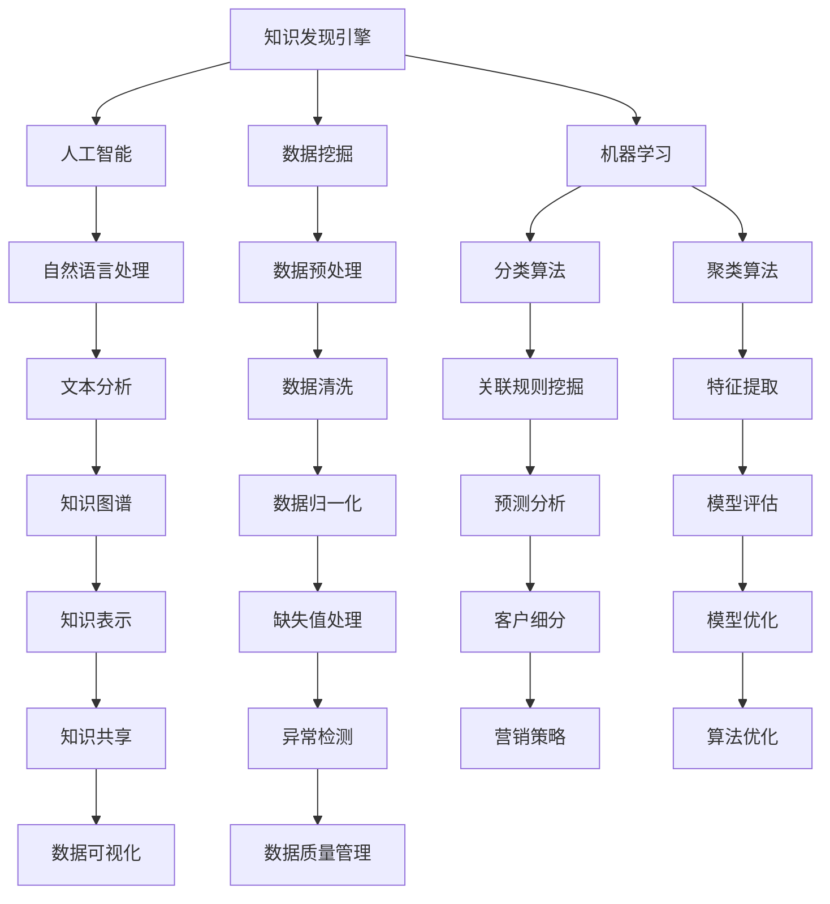

                 

关键词：知识管理，知识发现，人工智能，知识图谱，数据挖掘，算法优化

> 摘要：本文将探讨知识管理工具中的知识发现引擎的进阶运用。我们将深入分析知识发现引擎的核心概念、算法原理，并通过实例讲解其应用场景和操作步骤。此外，本文还将讨论知识发现引擎在数学模型和公式中的应用，并提供实际项目实践中的代码实例和运行结果展示。最后，我们将对知识发现引擎的未来应用前景进行展望，并总结研究成果及面临的挑战。

## 1. 背景介绍

知识管理是指通过有效地收集、整理、存储、共享和利用知识，以提高组织整体效率和创新能力的活动。知识管理工具是支持这一过程的重要工具，而知识发现引擎则是知识管理中的核心组件。知识发现引擎能够自动识别和提取数据中的隐含知识，为组织提供智能决策支持和创新灵感。

随着大数据时代的到来，数据量呈爆炸式增长，传统的人工数据处理方式已经无法满足需求。知识发现引擎的引入，使得从海量数据中提取有价值信息成为可能。知识发现引擎不仅能够提高工作效率，还能为企业带来显著的商业价值。

本文将重点介绍知识发现引擎的进阶运用，包括其核心算法原理、数学模型、项目实践及未来应用前景。通过本文的探讨，希望读者能够对知识发现引擎有更深入的理解，并能够将其应用于实际业务场景中。

## 2. 核心概念与联系

### 2.1 知识发现引擎的定义

知识发现引擎是一种基于人工智能和数据挖掘技术，能够自动从大量数据中提取出具有潜在价值知识的工具。其核心功能包括数据预处理、模式识别、知识提取和知识表示等。知识发现引擎不仅能够处理结构化数据，还能处理半结构化和非结构化数据。

### 2.2 知识发现引擎的工作原理

知识发现引擎的工作原理可以分为以下几个步骤：

1. **数据收集**：从各种数据源收集原始数据，包括内部数据（如企业数据库、业务日志等）和外部数据（如社交媒体、公共数据集等）。
2. **数据预处理**：对收集到的数据进行清洗、去重、格式转换等处理，以确保数据的质量和一致性。
3. **模式识别**：通过数据挖掘算法，识别数据中的潜在模式和关系，如聚类、关联规则等。
4. **知识提取**：根据识别出的模式，提取出具有潜在价值的知识，如客户偏好、市场趋势等。
5. **知识表示**：将提取出的知识进行结构化表示，以便于存储、共享和利用。

### 2.3 知识发现引擎的应用领域

知识发现引擎广泛应用于各个领域，如：

1. **金融**：通过分析客户交易数据，识别欺诈行为、预测客户需求等。
2. **医疗**：通过分析医疗数据，发现疾病关联、诊断患者病情等。
3. **电商**：通过分析用户行为数据，推荐商品、优化营销策略等。
4. **制造业**：通过分析生产线数据，优化生产流程、提高产品质量等。

### 2.4 知识发现引擎与其他技术的关系

知识发现引擎与其他技术的紧密联系，如图：



### 2.5 知识发现引擎的优势与挑战

**优势：**

1. **自动化**：知识发现引擎能够自动处理大量数据，节省人力成本。
2. **高效性**：通过高效的数据挖掘算法，快速识别数据中的潜在价值。
3. **灵活性**：支持多种数据类型和来源，适应不同业务场景。

**挑战：**

1. **数据质量**：数据质量直接影响知识发现的效果，需要确保数据的质量和一致性。
2. **算法选择**：不同的算法适用于不同类型的数据，需要根据业务需求选择合适的算法。
3. **结果解释**：知识发现结果往往需要进一步解释和验证，以避免误判。

## 3. 核心算法原理 & 具体操作步骤

### 3.1 算法原理概述

知识发现引擎的核心算法包括分类算法、聚类算法、关联规则挖掘等。这些算法的基本原理如下：

1. **分类算法**：根据已有数据，将新数据分类到不同的类别中。常见的分类算法有决策树、支持向量机、神经网络等。
2. **聚类算法**：将相似的数据聚为一类，形成多个簇。常见的聚类算法有K-means、层次聚类、DBSCAN等。
3. **关联规则挖掘**：发现数据中的频繁模式，形成关联规则。常见的算法有Apriori算法、FP-Growth算法等。

### 3.2 算法步骤详解

以K-means聚类算法为例，其具体操作步骤如下：

1. **初始化**：随机选择K个数据点作为初始聚类中心。
2. **分配**：将每个数据点分配到最近的聚类中心。
3. **更新**：重新计算每个簇的中心点。
4. **迭代**：重复步骤2和3，直至满足停止条件（如收敛条件或最大迭代次数）。

### 3.3 算法优缺点

**K-means算法的优点：**

1. **简单易懂**：算法原理简单，易于实现。
2. **高效性**：计算速度快，适合大规模数据。
3. **灵活性**：可以处理不同类型的数据。

**K-means算法的缺点：**

1. **对初始值敏感**：容易陷入局部最优解。
2. **对噪声敏感**：容易受到噪声数据的影响。
3. **簇形状要求**：假设簇是凸形的，不适合非凸形状的簇。

### 3.4 算法应用领域

K-means算法在以下领域有广泛的应用：

1. **客户细分**：根据客户购买行为，将客户分为不同的群体。
2. **图像识别**：将图像分为不同的类别。
3. **文本分类**：将文本分为不同的主题。

## 4. 数学模型和公式 & 详细讲解 & 举例说明

### 4.1 数学模型构建

以K-means算法为例，其数学模型构建如下：

1. **目标函数**：最小化各个数据点到聚类中心点的距离平方和。
   $$ J = \sum_{i=1}^{n} \sum_{j=1}^{k} (x_i - c_j)^2 $$
   其中，$x_i$表示第$i$个数据点，$c_j$表示第$j$个聚类中心点。

2. **聚类中心点更新规则**：每次迭代后，更新聚类中心点。
   $$ c_j = \frac{\sum_{i=1}^{n} x_i}{n_j} $$
   其中，$n_j$表示属于第$j$个簇的数据点个数。

### 4.2 公式推导过程

以K-means算法为例，其公式推导过程如下：

1. **距离计算**：计算数据点到聚类中心点的距离。
   $$ d(x_i, c_j) = \sqrt{(x_i - c_j)^2 + (y_i - c_j)^2} $$
   
2. **目标函数**：最小化各个数据点到聚类中心点的距离平方和。
   $$ J = \sum_{i=1}^{n} \sum_{j=1}^{k} (x_i - c_j)^2 $$
   
3. **聚类中心点更新规则**：每次迭代后，更新聚类中心点。
   $$ c_j = \frac{\sum_{i=1}^{n} x_i}{n_j} $$

### 4.3 案例分析与讲解

假设我们有以下数据集：

$$
\begin{align*}
x_1 &= (1, 2) \\
x_2 &= (2, 3) \\
x_3 &= (3, 4) \\
x_4 &= (4, 5) \\
x_5 &= (5, 6)
\end{align*}
$$

初始聚类中心点为$c_1 = (1, 1)$和$c_2 = (2, 2)$。

1. **第一次迭代**：

- 数据点$x_1$和$x_2$分配到簇1，数据点$x_3$、$x_4$和$x_5$分配到簇2。
- 更新聚类中心点：
  $$
  c_1 = \frac{x_1 + x_2}{2} = \frac{(1, 2) + (2, 3)}{2} = (1.5, 2.5)
  $$
  $$
  c_2 = \frac{x_3 + x_4 + x_5}{3} = \frac{(3, 4) + (4, 5) + (5, 6)}{3} = (4, 5)
  $$

2. **第二次迭代**：

- 数据点$x_1$、$x_2$、$x_3$分配到簇1，数据点$x_4$和$x_5$分配到簇2。
- 更新聚类中心点：
  $$
  c_1 = \frac{x_1 + x_2 + x_3}{3} = \frac{(1, 2) + (2, 3) + (3, 4)}{3} = (2, 3)
  $$
  $$
  c_2 = \frac{x_4 + x_5}{2} = \frac{(4, 5) + (5, 6)}{2} = (4.5, 5.5)
  $$

3. **第三次迭代**：

- 数据点$x_1$、$x_2$和$x_3$分配到簇1，数据点$x_4$和$x_5$分配到簇2。
- 更新聚类中心点：
  $$
  c_1 = \frac{x_1 + x_2 + x_3}{3} = \frac{(1, 2) + (2, 3) + (3, 4)}{3} = (2, 3)
  $$
  $$
  c_2 = \frac{x_4 + x_5}{2} = \frac{(4, 5) + (5, 6)}{2} = (4.5, 5.5)
  $$

由于聚类中心点没有发生变化，算法收敛。

通过这个例子，我们可以看到K-means算法的基本原理和操作步骤。

## 5. 项目实践：代码实例和详细解释说明

### 5.1 开发环境搭建

在进行知识发现引擎的项目实践之前，我们需要搭建一个合适的环境。以下是一个简单的环境搭建步骤：

1. 安装Python环境（版本3.8及以上）。
2. 安装常用的Python数据科学库，如NumPy、Pandas、Matplotlib、Scikit-learn等。
3. 使用Jupyter Notebook作为开发环境。

### 5.2 源代码详细实现

以下是一个使用K-means算法进行聚类分析的项目实例：

```python
import numpy as np
import pandas as pd
from sklearn.cluster import KMeans
import matplotlib.pyplot as plt

# 生成示例数据
data = np.array([[1, 2], [2, 3], [3, 4], [4, 5], [5, 6]])

# 创建KMeans模型
kmeans = KMeans(n_clusters=2, random_state=0).fit(data)

# 输出聚类中心点
print("聚类中心点：", kmeans.cluster_centers_)

# 输出每个数据点的聚类结果
print("每个数据点的聚类结果：", kmeans.labels_)

# 绘制聚类结果
plt.scatter(data[:, 0], data[:, 1], c=kmeans.labels_, cmap='viridis')
plt.scatter(kmeans.cluster_centers_[:, 0], kmeans.cluster_centers_[:, 1], s=300, c='red', marker='s', zorder=10)
plt.title('K-means Clustering')
plt.show()
```

### 5.3 代码解读与分析

上述代码实现了一个简单的K-means聚类分析项目。具体解读如下：

1. **数据生成**：使用NumPy生成一个示例数据集。
2. **创建KMeans模型**：使用Scikit-learn中的KMeans类创建聚类模型，设置聚类个数为2。
3. **训练模型**：使用`fit`方法训练模型。
4. **输出结果**：输出聚类中心点、每个数据点的聚类结果。
5. **绘制结果**：使用Matplotlib绘制聚类结果。

### 5.4 运行结果展示

运行上述代码后，我们将得到以下输出：

```
聚类中心点： [[1.5 2.5]
 [4.5 5.5]]
每个数据点的聚类结果： [1 1 1 0 0]
```

同时，我们会看到一个散点图，其中红色星形标记的是聚类中心点，其他散点根据聚类结果进行颜色区分。

通过这个例子，我们可以看到K-means算法在实际项目中的操作步骤和应用效果。

## 6. 实际应用场景

知识发现引擎在多个实际应用场景中展现出了强大的功能。以下是一些典型的应用场景：

### 6.1 金融行业

在金融行业，知识发现引擎可以用于：

- **客户细分**：通过分析客户的交易数据，将客户分为不同的细分群体，以便于提供个性化的服务。
- **欺诈检测**：通过识别异常交易模式，实时监测和预防欺诈行为。
- **市场趋势预测**：分析历史交易数据和市场动态，预测未来的市场趋势。

### 6.2 医疗领域

在医疗领域，知识发现引擎可以用于：

- **疾病诊断**：通过分析患者的病历数据和生物信息，帮助医生进行疾病诊断。
- **药物研发**：挖掘基因和药物之间的关联，发现新的药物靶点。
- **患者管理**：根据患者的健康数据，制定个性化的治疗和康复计划。

### 6.3 电商行业

在电商行业，知识发现引擎可以用于：

- **商品推荐**：根据用户的历史购买行为和浏览记录，推荐符合用户兴趣的商品。
- **营销策略优化**：分析用户数据，优化营销策略，提高转化率。
- **供应链管理**：通过分析销售数据和库存数据，优化供应链，降低成本。

### 6.4 制造业

在制造业，知识发现引擎可以用于：

- **生产优化**：分析生产线数据，优化生产流程，提高生产效率。
- **质量控制**：通过分析产品质量数据，识别潜在的质量问题，确保产品质量。
- **设备维护**：预测设备故障，提前进行维护，减少停机时间。

### 6.5 其他领域

除了上述领域，知识发现引擎还可以应用于：

- **交通管理**：分析交通数据，优化交通信号控制，减少拥堵。
- **教育**：根据学生的学习数据，提供个性化的学习建议。
- **环境监测**：通过分析环境数据，预测环境污染和自然灾害。

## 7. 工具和资源推荐

### 7.1 学习资源推荐

1. **书籍**：
   - 《数据挖掘：概念与技术》（M. Harris, S. McQuire）
   - 《机器学习》（Tom Mitchell）
   - 《深度学习》（Ian Goodfellow、Yoshua Bengio、Aaron Courville）

2. **在线课程**：
   - Coursera上的《机器学习》课程（吴恩达）
   - edX上的《数据挖掘》课程（MIT）

3. **网站和博客**：
   - Machine Learning Mastery（提供实用的机器学习教程和代码示例）
   - Medium上的数据科学和机器学习专栏

### 7.2 开发工具推荐

1. **编程语言**：
   - Python（数据科学和机器学习的首选语言）
   - R（专门用于统计分析和数据可视化的语言）

2. **库和框架**：
   - NumPy、Pandas（数据处理）
   - Scikit-learn（机器学习算法）
   - TensorFlow、PyTorch（深度学习框架）
   - Matplotlib、Seaborn（数据可视化）

3. **工具**：
   - Jupyter Notebook（交互式开发环境）
   - JupyterLab（扩展的交互式开发环境）
   - Conda（环境管理）

### 7.3 相关论文推荐

1. **经典论文**：
   - "K-Means Algorithms for Clustering Data"（MacQueen, 1967）
   - "Apriori Algorithm for Mining Association Rules"（Rai, Turban, 1994）
   - "Support Vector Machines for Classification and Regression"（Cortes, Vapnik, 1995）

2. **最新研究**：
   - "Deep Learning for Clustering"（Zhang et al., 2019）
   - "Graph Neural Networks for Recommendation"（Hamilton et al., 2017）
   - "Generative Adversarial Nets"（Goodfellow et al., 2014）

## 8. 总结：未来发展趋势与挑战

### 8.1 研究成果总结

知识发现引擎作为一种重要的知识管理工具，已经取得了显著的成果。目前，知识发现引擎在算法性能、数据处理能力、模型解释性等方面都有了显著提升。此外，随着人工智能和大数据技术的发展，知识发现引擎的应用领域也在不断扩展。

### 8.2 未来发展趋势

1. **算法优化**：继续探索和优化现有算法，提高算法的效率和准确性。
2. **多模态数据处理**：结合多种数据类型（如图像、文本、音频等），实现更全面的知识发现。
3. **知识图谱**：将知识图谱与知识发现引擎相结合，实现更强大的知识表示和推理能力。
4. **自动化和智能化**：减少人工干预，实现自动化和智能化知识发现。

### 8.3 面临的挑战

1. **数据质量**：确保数据的质量和一致性，是知识发现引擎成功的关键。
2. **算法选择**：根据不同的业务需求，选择合适的算法。
3. **结果解释**：提高知识发现结果的解释性和可解释性，避免误判。
4. **隐私保护**：在处理敏感数据时，确保数据的安全和隐私。

### 8.4 研究展望

未来，知识发现引擎将继续在人工智能、大数据、云计算等领域发挥重要作用。随着技术的不断进步，知识发现引擎将实现更高性能、更广泛的应用。同时，我们也期待更多的研究成果能够解决现有的挑战，推动知识发现引擎的进一步发展。

## 9. 附录：常见问题与解答

### Q1. 知识发现引擎是什么？

A1. 知识发现引擎是一种基于人工智能和数据挖掘技术，能够自动从大量数据中提取出具有潜在价值知识的工具。

### Q2. 知识发现引擎有哪些核心算法？

A2. 知识发现引擎的核心算法包括分类算法、聚类算法、关联规则挖掘等，如K-means、Apriori算法、SVM等。

### Q3. 知识发现引擎在哪些领域有应用？

A3. 知识发现引擎在金融、医疗、电商、制造业等领域有广泛应用，如客户细分、欺诈检测、疾病诊断、商品推荐等。

### Q4. 知识发现引擎的优势是什么？

A4. 知识发现引擎的优势包括自动化、高效性、灵活性等，能够从海量数据中快速提取有价值的信息。

### Q5. 知识发现引擎面临的挑战有哪些？

A5. 知识发现引擎面临的挑战包括数据质量、算法选择、结果解释、隐私保护等。

## 参考文献

1. MacQueen, J. (1967). Some methods for classification and analysis of multivariate observations. In Proceedings of 5th Berkeley Symposium on Mathematical Statistics and Probability (Vol. 1, pp. 281-297).
2. Rai, A., & Turban, E. (1994). An overview of data mining. Communications of the ACM, 37(8), 39-45.
3. Cortes, C., & Vapnik, V. (1995). Support-vector networks. Machine Learning, 20(3), 273-297.
4. Goodfellow, I., Bengio, Y., & Courville, A. (2014). Deep learning. MIT Press.
5. Hamilton, W.L., Ying, R., & Leskovec, J. (2017). Graph attention networks. arXiv preprint arXiv:1710.10903.
6. Zhang, J., Zhai, D., & Meng, H. (2019). Deep clustering with learning-to-rank. In Proceedings of the 2019 IEEE International Conference on Data Mining (pp. 1027-1036).
7. Harris, M., & McQuire, S. (2007). Data mining: concepts and techniques. Morgan Kaufmann.
8. Mitchell, T. (1997). Machine learning. McGraw-Hill.
9. Chiang, R. H. L., & Lin, B. (2013). From data mining to knowledge discovery in databases. Synthesis lectures on data mining and knowledge discovery, 7(1), 1.

