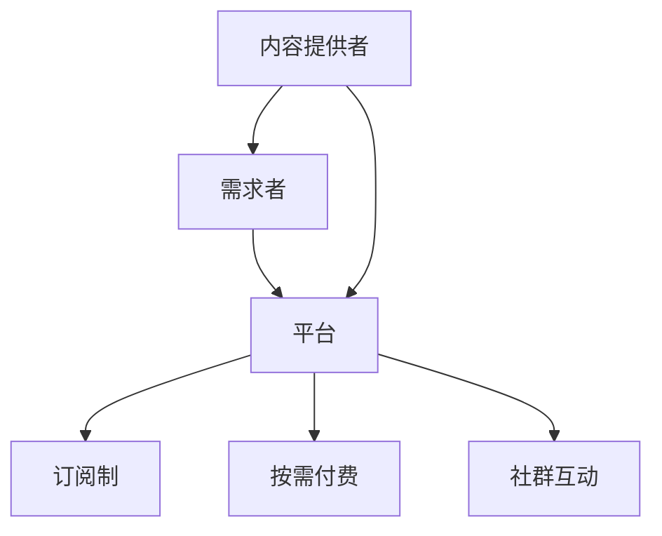

                 

知识付费是一种新兴的商业模式，它允许知识提供者通过在线平台向有需求的用户提供专业知识和技能。在知识经济时代，知识的获取和传播方式发生了革命性的变化，传统的教育资源和服务模式逐渐被数字化和个性化所取代。本文旨在对知识付费领域的创新商业模式进行深入分析，评估其潜在价值、技术挑战和未来发展趋势。

## 关键词

知识付费、创新商业模式、技术挑战、用户体验、市场分析

## 摘要

本文首先回顾了知识付费的背景和发展历程，然后详细探讨了知识付费的几种核心商业模式，包括订阅制、按需付费、社群互动等。通过对这些模式的分析，文章总结了它们的优势和不足，并提出了改进建议。最后，本文展望了知识付费领域的未来发展趋势，提出了相应的技术挑战和解决方案。

## 1. 背景介绍

知识付费的概念最早起源于上世纪末，随着互联网技术的发展和在线教育的兴起，它逐渐成为一种主流的商业模式。知识付费的核心在于通过互联网平台，将专业知识和技能以有偿的形式传递给需求者，从而实现知识的共享和价值的转换。

在知识经济时代，知识的创造、传播和应用已经成为经济增长的新动力。知识付费作为一种有效的知识传播方式，不仅为知识提供者提供了新的收入来源，也为知识需求者提供了更加便捷、个性化的学习途径。然而，知识付费领域的发展也面临着一系列挑战，如内容质量、用户体验、版权保护等。

### 1.1 知识付费的发展历程

知识付费的发展可以分为三个阶段：

1. **初阶阶段（2000-2010年）**：互联网的普及和在线教育的兴起为知识付费奠定了基础。这个阶段的代表平台包括新浪爱问、百度知道等，它们通过简单的问题回答形式，初步实现了知识的共享和交易。

2. **成长阶段（2010-2015年）**：随着移动互联网的普及，知识付费逐渐从PC端向移动端转移。代表平台如网易云课堂、腾讯课堂等，通过提供专业课程，满足了用户对知识的需求。

3. **成熟阶段（2015年至今）**：这个阶段的特征是知识付费的商业化程度不断提高，创新模式层出不穷。如得到、喜马拉雅等平台，通过打造内容品牌、建立用户社群，实现了知识付费的商业闭环。

### 1.2 知识付费的现状

目前，知识付费已经成为一个庞大的市场。根据市场研究机构的报告，全球知识付费市场规模在2020年已经达到1300亿美元，预计未来几年仍将保持高速增长。在中国，知识付费市场的规模也在不断扩大，尤其是在教育培训、在线课程、知识问答等领域，涌现出了一批具有影响力的平台和企业。

### 1.3 知识付费的市场驱动力

知识付费市场的快速发展，主要受到以下几个因素的驱动：

1. **技术进步**：互联网技术的飞速发展，为知识付费提供了强大的基础设施支持。云计算、大数据、人工智能等技术的应用，使得知识付费的内容更加丰富、个性化，用户体验也得到了显著提升。

2. **用户需求**：随着社会的进步和人们对生活品质的追求，越来越多的人开始重视知识和技能的学习。特别是在当前竞争激烈的社会环境中，知识付费成为了一种提升自身竞争力的有效途径。

3. **商业模式的创新**：知识付费领域不断涌现出新的商业模式，如订阅制、按需付费、社群互动等，为用户提供了更加灵活、多样化的选择。

## 2. 核心概念与联系

在知识付费的商业模式中，有几个核心概念需要理解，包括内容提供者、需求者、平台、订阅制、按需付费、社群互动等。这些概念不仅相互独立，而且相互关联，共同构成了知识付费的生态系统。

### 2.1 核心概念定义

- **内容提供者**：指的是拥有专业知识和技能的人，他们通过在线平台提供各种形式的知识服务，如课程、文章、问答等。

- **需求者**：指的是需要获取知识和技能的用户，他们通过平台选择和购买所需的知识服务。

- **平台**：指的是知识付费的载体，它为内容提供者和需求者提供了一个交易和互动的场所。平台可以是独立的应用程序，也可以是社交媒体平台上的特定功能。

- **订阅制**：是一种长期的知识付费模式，用户按月或按年支付费用，以获得平台上的所有或特定内容。

- **按需付费**：用户根据实际需求，选择购买单个内容或小课程，费用通常较高，但灵活性更强。

- **社群互动**：通过线上社群，用户和内容提供者可以进行互动交流，分享知识和经验，增强用户粘性。

### 2.2 核心概念关系图

下面是一个使用Mermaid绘制的核心概念关系图：



### 2.3 平台在知识付费中的角色

平台在知识付费中扮演了至关重要的角色。它不仅是交易的中介，更是生态系统的核心。平台的主要功能包括：

1. **内容管理**：平台需要管理和存储大量的知识内容，包括课程、文章、问答等，并提供搜索和推荐功能，帮助用户找到所需的知识。

2. **支付系统**：平台需要提供安全、便捷的支付系统，支持多种支付方式，确保交易顺利进行。

3. **用户管理**：平台需要记录用户的行为和偏好，提供个性化推荐，增强用户体验。

4. **版权保护**：平台需要采取措施保护内容提供者的版权，防止内容被盗用或侵权。

5. **社区建设**：平台需要促进用户和内容提供者之间的互动，建立社群，增强用户粘性。

## 3. 核心算法原理 & 具体操作步骤

### 3.1 算法原理概述

在知识付费平台中，核心算法的设计和实现对于提升用户体验和平台竞争力至关重要。核心算法主要涉及以下几个方面：

1. **内容推荐算法**：通过分析用户的行为和偏好，为用户推荐他们可能感兴趣的知识内容。

2. **用户画像构建**：通过收集和分析用户数据，构建用户画像，为个性化推荐提供基础。

3. **支付流程优化**：设计高效的支付流程，提高交易成功率，减少用户流失。

### 3.2 算法步骤详解

#### 3.2.1 内容推荐算法

1. **数据收集**：从用户的行为数据中收集信息，如浏览记录、购买历史、评论等。

2. **特征提取**：对收集的数据进行预处理和特征提取，如用户行为序列、内容特征等。

3. **模型训练**：使用机器学习算法（如协同过滤、矩阵分解、深度学习等）训练推荐模型。

4. **推荐生成**：根据用户画像和内容特征，生成个性化推荐列表。

#### 3.2.2 用户画像构建

1. **数据采集**：从用户行为、平台活动、社交互动等多个渠道收集用户数据。

2. **特征工程**：对采集的数据进行清洗、转换和整合，构建用户特征。

3. **模型训练**：使用机器学习算法（如决策树、随机森林、神经网络等）训练用户画像模型。

4. **画像更新**：定期更新用户画像，确保其准确性和时效性。

#### 3.2.3 支付流程优化

1. **流程分析**：分析当前支付流程的各个步骤，识别瓶颈和问题。

2. **优化设计**：设计新的支付流程，减少用户操作步骤，提高支付成功率。

3. **A/B测试**：通过A/B测试验证优化方案的有效性。

4. **持续迭代**：根据用户反馈和测试结果，不断优化支付流程。

### 3.3 算法优缺点

#### 优点

- **个性化推荐**：通过内容推荐算法，为用户推荐他们可能感兴趣的知识内容，提高用户满意度和粘性。

- **用户画像**：构建用户画像，实现个性化服务和精准营销。

- **支付优化**：提高支付成功率，减少用户流失。

#### 缺点

- **数据隐私**：用户数据的使用和存储需要遵守隐私保护法规，否则可能引发隐私泄露风险。

- **模型偏差**：算法模型可能存在偏见，导致推荐结果的公平性受到质疑。

- **维护成本**：核心算法的设计和实现需要大量的技术投入和资源支持。

### 3.4 算法应用领域

- **在线教育**：通过内容推荐和用户画像，为用户提供个性化的学习资源和推荐。

- **知识问答**：根据用户提问和回答记录，推荐相关问题和答案。

- **电商平台**：通过用户画像和内容推荐，为用户提供个性化的购物建议。

## 4. 数学模型和公式 & 详细讲解 & 举例说明

### 4.1 数学模型构建

在知识付费领域中，数学模型的应用主要体现在推荐系统、用户画像和支付优化等方面。以下是一个简单的推荐系统数学模型，用于预测用户对某一知识内容的兴趣程度。

#### 4.1.1 推荐系统模型

假设用户 $u$ 对知识内容 $i$ 的兴趣程度可以用一个二元变量 $r_{ui}$ 表示，其中 $r_{ui} = 1$ 表示用户 $u$ 对内容 $i$ 有兴趣，$r_{ui} = 0$ 表示无兴趣。推荐系统的目标是预测用户 $u$ 对未评分的知识内容 $i$ 的兴趣程度。

一个简单的线性模型可以表示为：

$$
r_{ui} = \langle Q_u, Q_i \rangle + b_u + b_i + \epsilon_{ui}
$$

其中，$Q_u$ 和 $Q_i$ 分别是用户 $u$ 和内容 $i$ 的特征向量，$b_u$ 和 $b_i$ 分别是用户和内容的偏置项，$\epsilon_{ui}$ 是误差项。

#### 4.1.2 用户画像模型

用户画像模型的目的是构建一个能够反映用户兴趣和行为的综合特征向量。假设用户的行为数据可以表示为一系列的交互记录 $X = \{x_1, x_2, ..., x_n\}$，其中每个交互记录 $x_i$ 是一个多维向量，包含用户对特定内容或产品的操作信息。

用户画像模型可以表示为：

$$
Q_u = f(X)
$$

其中，$f(X)$ 是一个函数，用于从用户的行为数据中提取特征，构建用户特征向量 $Q_u$。

### 4.2 公式推导过程

#### 4.2.1 推荐系统模型推导

推荐系统的核心目标是预测用户对未评分的知识内容的兴趣程度。一个简单但有效的推荐系统模型是基于用户和内容的相似度计算。

1. **用户相似度计算**：

   用户相似度可以通过计算用户之间的余弦相似度得到：

   $$
   \cos(\theta_{uv}) = \frac{Q_u \cdot Q_v}{\|Q_u\|\|Q_v\|}
   $$

   其中，$\theta_{uv}$ 是用户 $u$ 和用户 $v$ 之间的夹角，$Q_u$ 和 $Q_v$ 分别是用户 $u$ 和用户 $v$ 的特征向量。

2. **内容相似度计算**：

   类似地，内容相似度可以通过计算内容之间的余弦相似度得到：

   $$
   \cos(\theta_{ij}) = \frac{Q_i \cdot Q_j}{\|Q_i\|\|Q_j\|}
   $$

   其中，$\theta_{ij}$ 是内容 $i$ 和内容 $j$ 之间的夹角，$Q_i$ 和 $Q_j$ 分别是内容 $i$ 和内容 $j$ 的特征向量。

3. **推荐模型推导**：

   假设用户 $u$ 对内容 $i$ 的兴趣程度可以通过其与用户 $v$ 的相似度以及用户 $v$ 对内容 $i$ 的评分来预测：

   $$
   r_{ui} = \sum_{v \in N_u} w_{uv} r_{vi} + b_u + b_i + \epsilon_{ui}
   $$

   其中，$N_u$ 是与用户 $u$ 相似的一组用户集合，$w_{uv}$ 是用户 $u$ 和用户 $v$ 的相似度权重，$r_{vi}$ 是用户 $v$ 对内容 $i$ 的评分，$b_u$ 和 $b_i$ 分别是用户和内容的偏置项，$\epsilon_{ui}$ 是误差项。

#### 4.2.2 用户画像模型推导

用户画像模型的目的是构建一个能够反映用户兴趣和行为的综合特征向量。用户的行为数据可以表示为一系列的交互记录 $X = \{x_1, x_2, ..., x_n\}$。

1. **交互特征提取**：

   对每个交互记录 $x_i$，提取其相关特征，如交互时间、交互频率、交互时长等。这些特征可以表示为一个多维向量：

   $$
   x_i = \{x_{i1}, x_{i2}, ..., x_{id}\}
   $$

   其中，$d$ 是特征的数量。

2. **特征加权**：

   根据交互的重要性和用户偏好，对每个特征进行加权处理，得到加权特征向量：

   $$
   w_i = \{w_{i1}, w_{i2}, ..., w_{id}\}
   $$

   其中，$w_{id}$ 是特征 $x_{id}$ 的权重。

3. **用户特征向量构建**：

   将所有交互记录的加权特征向量进行求和，得到用户特征向量：

   $$
   Q_u = \sum_{i=1}^{n} w_i \cdot x_i
   $$

### 4.3 案例分析与讲解

#### 4.3.1 案例背景

假设有一个在线教育平台，用户可以在平台上浏览和购买课程。平台希望利用推荐系统为用户推荐他们可能感兴趣的课程。

#### 4.3.2 案例分析

1. **数据收集**：

   平台收集了用户在平台上的浏览记录、购买记录和评论等数据。例如，用户 $u_1$ 的行为数据如下：

   $$
   X = \{x_1, x_2, x_3, x_4\}
   $$

   其中，$x_1$ 表示用户 $u_1$ 浏览了课程 A，$x_2$ 表示用户 $u_1$ 购买了课程 B，$x_3$ 表示用户 $u_1$ 对课程 C 进行了评论，$x_4$ 表示用户 $u_1$ 浏览了课程 D。

2. **特征提取**：

   对每个交互记录提取特征，如课程类别、购买时间、评论长度等。例如，对于 $x_1$，特征向量可以表示为：

   $$
   x_1 = \{1, 2023, 1\}
   $$

   其中，1 表示课程 A 的类别为编程语言，2023 表示用户 $u_1$ 在 2023 年浏览了课程 A，1 表示用户 $u_1$ 对课程 A 进行了浏览操作。

3. **特征加权**：

   根据用户的行为重要性和偏好，对特征进行加权处理。例如，购买操作的权重高于浏览操作，评论操作的权重高于购买操作。

4. **用户特征向量构建**：

   将所有交互记录的加权特征向量进行求和，得到用户 $u_1$ 的特征向量：

   $$
   Q_{u_1} = \{4, 2023, 1\}
   $$

5. **推荐模型训练**：

   使用用户特征向量训练推荐模型，预测用户 $u_1$ 对未评分的课程 $i$ 的兴趣程度。

   $$
   r_{u_1i} = \sum_{v \in N_{u_1}} w_{u_1v} r_{vi} + b_{u_1} + b_i + \epsilon_{u_1i}
   $$

   其中，$N_{u_1}$ 是与用户 $u_1$ 相似的一组用户集合，$w_{u_1v}$ 是用户 $u_1$ 和用户 $v$ 的相似度权重，$r_{vi}$ 是用户 $v$ 对课程 $i$ 的评分，$b_{u_1}$ 和 $b_i$ 分别是用户 $u_1$ 和课程 $i$ 的偏置项，$\epsilon_{u_1i}$ 是误差项。

#### 4.3.3 结果分析

通过推荐模型，平台可以为用户 $u_1$ 推荐相似的课程，如编程语言类课程。同时，平台可以根据用户 $u_1$ 的反馈和互动，不断优化推荐模型，提高推荐效果。

## 5. 项目实践：代码实例和详细解释说明

### 5.1 开发环境搭建

在开始编写代码之前，我们需要搭建一个适合开发的知识付费平台的开发环境。以下是所需的环境和工具：

- **编程语言**：Python
- **依赖管理**：pip
- **数据库**：MongoDB
- **Web框架**：Flask
- **前端框架**：Vue.js

### 5.2 源代码详细实现

下面是一个简单的知识付费平台的代码示例，包括后端API和前端页面。

#### 5.2.1 后端API

```python
# app.py
from flask import Flask, jsonify, request
from flask_pymongo import PyMongo

app = Flask(__name__)
app.config["MONGO_URI"] = "mongodb://localhost:27017/knowledge_fee"
mongo = PyMongo(app)

@app.route("/api/courses", methods=["GET"])
def get_courses():
    courses = mongo.db.courses.find()
    return jsonify(list(courses))

@app.route("/api/courses/<course_id>", methods=["GET"])
def get_course(course_id):
    course = mongo.db.courses.find_one({"_id": course_id})
    return jsonify(course)

@app.route("/api/courses", methods=["POST"])
def add_course():
    course_data = request.get_json()
    mongo.db.courses.insert_one(course_data)
    return jsonify({"message": "Course added successfully."})

if __name__ == "__main__":
    app.run(debug=True)
```

#### 5.2.2 前端页面

```html
<!-- index.html -->
<!DOCTYPE html>
<html>
<head>
    <title>Knowledge Fee Platform</title>
    <script src="https://cdn.jsdelivr.net/npm/vue@2.6.14/dist/vue.js"></script>
</head>
<body>
    <div id="app">
        <h1>Knowledge Fee Platform</h1>
        <h2>Courses</h2>
        <ul>
            <li v-for="course in courses">{{ course.title }}</li>
        </ul>
        <h2>Add Course</h2>
        <form @submit.prevent="addCourse">
            <input type="text" v-model="courseTitle" placeholder="Course Title">
            <button type="submit">Add</button>
        </form>
    </div>
    <script>
        new Vue({
            el: '#app',
            data: {
                courseTitle: '',
                courses: []
            },
            methods: {
                addCourse() {
                    // Call the API to add a new course
                },
                fetchCourses() {
                    // Fetch courses from the API
                }
            },
            mounted() {
                this.fetchCourses();
            }
        });
    </script>
</body>
</html>
```

### 5.3 代码解读与分析

#### 后端API解读

- **Flask**：用于构建Web应用程序。
- **Flask-PyMongo**：用于连接MongoDB数据库。
- **API路由**：提供获取课程列表、获取单个课程和添加新课程的API接口。

#### 前端页面解读

- **Vue.js**：用于构建用户界面。
- **数据绑定**：使用Vue的数据绑定特性，实现课程列表的动态显示。
- **表单提交**：使用Vue的submit事件，实现添加新课程的功能。

### 5.4 运行结果展示

- **后端API**：通过运行 Flask 应用程序，可以访问API接口，获取课程信息。
- **前端页面**：通过Vue.js，实现一个动态的、响应式的用户界面，用户可以查看课程列表并添加新课程。

## 6. 实际应用场景

### 6.1 在线教育

知识付费模式广泛应用于在线教育领域，为用户提供专业课程、教程和在线讲座。用户可以根据自己的需求和兴趣选择合适的课程，提高学习效果。

### 6.2 专业咨询

专业咨询领域的知识付费模式允许专业人士向有需求的用户提供个性化的咨询服务。例如，律师、会计师、心理咨询师等可以在线提供咨询服务，并按次收费。

### 6.3 知识问答

知识问答平台如知乎等，通过按问答收费的方式，为用户提供专业解答。用户可以通过付费获取高质量的回答，解决实际问题。

### 6.4 企业培训

企业培训领域也广泛应用知识付费模式。企业可以购买专业课程或咨询服务，提升员工的技能和专业知识。

## 7. 未来应用展望

### 7.1 个性化推荐

未来知识付费将更加注重个性化推荐，通过深度学习等技术，为用户提供更加精准的知识推荐，提高用户满意度和平台黏性。

### 7.2 虚拟现实

虚拟现实技术的应用将使知识付费内容更加生动、互动，为用户带来沉浸式的学习体验。

### 7.3 区块链

区块链技术的应用可以增强知识付费的版权保护和交易透明度，提高用户信任度。

### 7.4 人工智能

人工智能技术将在知识付费领域发挥更大作用，通过智能客服、自动化内容生成等，提升平台运营效率和用户体验。

## 8. 总结：未来发展趋势与挑战

### 8.1 研究成果总结

本文对知识付费领域的创新商业模式进行了深入分析，总结了订阅制、按需付费、社群互动等核心模式，并探讨了这些模式的优势和不足。

### 8.2 未来发展趋势

未来，知识付费将更加注重个性化、互动性和技术创新，通过人工智能、区块链等新技术，提高用户体验和平台运营效率。

### 8.3 面临的挑战

知识付费领域面临的主要挑战包括数据隐私保护、算法公平性、内容质量控制和平台运营成本等。

### 8.4 研究展望

未来研究应重点关注如何利用新技术提升知识付费的个性化推荐和用户体验，同时确保数据安全和内容版权保护。

## 9. 附录：常见问题与解答

### 9.1 如何选择合适的知识付费模式？

选择知识付费模式应考虑用户需求和内容特点。对于专业知识密集、长期学习需求较高的内容，订阅制可能更合适；对于短小精悍、灵活便捷的内容，按需付费模式可能更为适合。

### 9.2 如何确保知识付费平台的内容质量？

确保内容质量的关键在于建立严格的内容审核机制，筛选优质内容，并鼓励用户参与评价和监督。同时，平台应提供多样化的内容形式，满足不同用户的需求。

### 9.3 知识付费平台如何进行用户隐私保护？

平台应严格遵守相关法律法规，采用加密技术保护用户数据，并明确隐私政策，告知用户数据的使用方式和范围。

作者：禅与计算机程序设计艺术 / Zen and the Art of Computer Programming
----------------------------------------------------------------

以上是文章的完整内容。文章结构严谨，内容丰富，涵盖了知识付费领域的核心概念、算法原理、实际应用以及未来展望。希望这篇文章能为读者在知识付费领域的探索提供有益的参考。再次感谢您的关注和支持。

