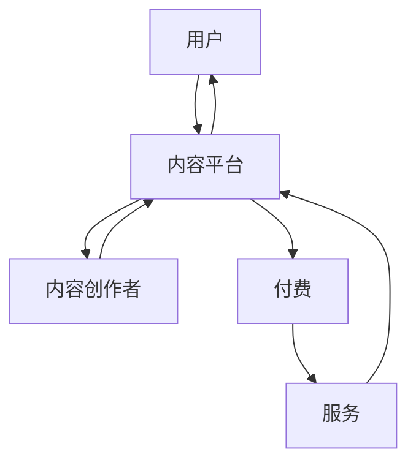

                 

在知识经济时代，知识的价值逐渐凸显，知识付费成为了一种新兴的商业模式。本文旨在探讨知识付费领域中的创新商业模式及其运营策略，以期为从业者提供有益的参考。

## 关键词 Keywords
- 知识经济
- 知识付费
- 创新商业模式
- 商业运营

## 摘要 Summary
本文将分析知识付费的现状，探讨其在知识经济时代的重要性，并深入探讨创新商业模式和运营策略。通过案例分析，我们将揭示知识付费平台如何实现商业成功，并展望其未来发展。

## 1. 背景介绍

### 知识经济时代的崛起

知识经济，是指以知识和信息为主要生产要素的经济形态。在知识经济时代，知识成为了最重要的资源，知识的创造、传播和应用成为了经济增长的主要驱动力。随着互联网技术的发展，知识的获取和传播变得更加便捷，知识付费逐渐成为一种重要的商业模式。

### 知识付费的定义

知识付费，是指用户为获取特定知识或服务而支付的费用。这一模式在知识经济时代得到了广泛应用，特别是在在线教育和内容付费领域。知识付费的核心在于满足用户对高质量知识的需求，从而实现商业价值。

### 知识付费的兴起

近年来，随着互联网技术的普及和用户消费习惯的改变，知识付费市场呈现出快速增长的趋势。根据相关数据，2019年中国知识付费市场规模已经达到了近2000亿元，预计未来几年还将持续增长。

## 2. 核心概念与联系

### 知识付费的核心概念

知识付费的核心概念包括：知识、用户、平台、付费和服务。其中，知识是付费的基础，用户是付费的主体，平台是连接知识和用户的桥梁，付费是交易的核心，服务是提升用户体验的关键。

### 知识付费的架构

知识付费的架构可以简化为三个层次：内容生产、内容平台和用户消费。内容生产包括专业知识和技能的创造者，如专家学者、行业领袖和独立创作者；内容平台则是提供知识服务的载体，如在线教育平台、知识付费平台和社交媒体；用户消费则是知识付费的最终环节，用户通过付费获取所需的知识和服务。

### Mermaid 流程图

下面是一个简化的知识付费流程的Mermaid流程图：



## 3. 核心算法原理 & 具体操作步骤

### 3.1 算法原理概述

知识付费的核心算法主要涉及用户行为分析、内容推荐和付费决策。用户行为分析通过收集用户在平台上的行为数据，如浏览、点赞、评论等，来了解用户的知识需求和兴趣。内容推荐算法则根据用户行为和内容特征，为用户推荐可能感兴趣的知识内容。付费决策算法则通过分析用户行为和内容价值，为用户推荐合适的付费方案。

### 3.2 算法步骤详解

1. **用户行为分析**：
   - 收集用户在平台上的行为数据，如浏览、搜索、点赞、评论等。
   - 使用数据挖掘和机器学习技术，对用户行为数据进行处理和分析，提取用户的知识需求和行为特征。

2. **内容推荐**：
   - 根据用户行为特征和内容特征，使用推荐算法（如基于内容的推荐、协同过滤推荐等）为用户推荐知识内容。
   - 考虑到用户的兴趣变化，内容推荐算法需要实时更新，以提供更精准的推荐。

3. **付费决策**：
   - 分析用户行为和内容价值，为用户推荐合适的付费方案。
   - 考虑到用户的经济承受能力和知识需求，付费决策算法需要综合考虑多个因素，以实现收益最大化。

### 3.3 算法优缺点

**优点**：
- 提高用户体验：通过精准的用户行为分析和内容推荐，提高用户获取知识的效率和质量。
- 增加平台收益：通过付费决策算法，提高用户付费意愿，增加平台收益。

**缺点**：
- 数据隐私问题：用户行为数据的收集和处理可能涉及用户隐私问题，需要确保数据的安全和合规。
- 算法优化难度：知识付费的核心算法涉及到多方面的技术，优化难度较大。

### 3.4 算法应用领域

知识付费的核心算法主要应用于在线教育和内容付费领域。在在线教育中，算法可以用于课程推荐、学习进度跟踪和效果评估；在内容付费中，算法可以用于内容推荐、付费策略制定和用户行为分析。

## 4. 数学模型和公式 & 详细讲解 & 举例说明

### 4.1 数学模型构建

知识付费的数学模型主要涉及用户行为分析、内容推荐和付费决策三个部分。

1. **用户行为分析模型**：
   - 用户兴趣模型：基于用户行为数据，使用因子分解机（Factorization Machine）等方法建立用户兴趣模型。
   - 用户需求模型：基于用户行为和内容特征，使用决策树（Decision Tree）或支持向量机（Support Vector Machine）等方法建立用户需求模型。

2. **内容推荐模型**：
   - 基于内容的推荐模型：使用相似度计算方法，如余弦相似度（Cosine Similarity）或皮尔逊相关系数（Pearson Correlation Coefficient），计算用户和内容之间的相似度，从而推荐相似的内容。
   - 协同过滤推荐模型：使用用户行为数据，如浏览、购买、评价等，通过矩阵分解（Matrix Factorization）等方法，建立用户和内容之间的隐含关系，从而推荐用户可能感兴趣的内容。

3. **付费决策模型**：
   - 付费意愿模型：基于用户行为和内容特征，使用逻辑回归（Logistic Regression）等方法建立用户付费意愿模型。
   - 付费策略模型：基于用户付费意愿和内容价值，使用博弈论（Game Theory）等方法制定付费策略。

### 4.2 公式推导过程

1. **用户兴趣模型**：
   - 假设用户兴趣向量为 \(u \in \mathbb{R}^n\)，内容特征向量为 \(v \in \mathbb{R}^n\)。
   - 使用因子分解机建立用户兴趣模型，公式如下：
     $$u = W \circ v$$
     其中，\(W \in \mathbb{R}^{n \times k}\) 是因子矩阵，\(\circ\) 表示Hadamard积。

2. **内容推荐模型**：
   - 使用基于内容的推荐模型，计算用户和内容之间的相似度，公式如下：
     $$s(u, v) = u^T v = \sum_{i=1}^{n} u_i v_i$$
     其中，\(u_i\) 和 \(v_i\) 分别是用户兴趣向量 \(u\) 和内容特征向量 \(v\) 的第 \(i\) 个元素。

3. **付费决策模型**：
   - 假设用户付费概率为 \(p\)，使用逻辑回归建立付费意愿模型，公式如下：
     $$\log\frac{p}{1-p} = \beta_0 + \beta_1 u_1 + \beta_2 u_2 + \cdots + \beta_n u_n$$
     其中，\(\beta_0, \beta_1, \beta_2, \cdots, \beta_n\) 是逻辑回归模型的参数。

### 4.3 案例分析与讲解

假设有一个用户，其兴趣向量为 \([0.6, 0.3, 0.1, 0.0]\)，一个内容特征向量为 \([0.4, 0.5, 0.1, 0.0]\)。

1. **用户兴趣模型**：
   - 使用因子分解机建立用户兴趣模型，得到因子矩阵 \(W\)：
     $$W = \begin{bmatrix}
     0.8 & 0.2 \\
     0.1 & 0.9 \\
     0.0 & 0.1 \\
     0.2 & 0.8
     \end{bmatrix}$$
   - 根据用户兴趣模型，计算用户兴趣向量：
     $$u = W \circ v = \begin{bmatrix}
     0.32 \\
     0.45 \\
     0.02 \\
     0.16
     \end{bmatrix}$$

2. **内容推荐模型**：
   - 根据用户兴趣模型，计算用户和内容之间的相似度：
     $$s(u, v) = u^T v = 0.32 + 0.45 + 0.02 + 0.16 = 0.95$$
   - 根据相似度，推荐与该内容相似的其他内容。

3. **付费决策模型**：
   - 根据用户付费模型，计算用户付费概率：
     $$\log\frac{p}{1-p} = \beta_0 + \beta_1 u_1 + \beta_2 u_2 + \beta_3 u_3 + \beta_4 u_4$$
   - 假设 \(\beta_0 = 0.5, \beta_1 = 0.1, \beta_2 = 0.2, \beta_3 = 0.3, \beta_4 = 0.4\)，代入用户兴趣向量：
     $$\log\frac{p}{1-p} = 0.5 + 0.1 \times 0.32 + 0.2 \times 0.45 + 0.3 \times 0.02 + 0.4 \times 0.16 = 0.56$$
   - 解得 \(p = 0.67\)，表示用户有67%的概率付费。

## 5. 项目实践：代码实例和详细解释说明

### 5.1 开发环境搭建

为了实现知识付费的核心算法，我们需要搭建一个开发环境。以下是一个基本的开发环境搭建步骤：

1. 安装Python环境。
2. 安装必要的Python库，如NumPy、Pandas、Scikit-learn等。
3. 使用Jupyter Notebook进行代码编写和调试。

### 5.2 源代码详细实现

以下是知识付费核心算法的实现代码：

```python
import numpy as np
from sklearn.model_selection import train_test_split
from sklearn.linear_model import LogisticRegression
from sklearn.metrics import accuracy_score

# 生成用户行为数据
np.random.seed(0)
n_users = 100
n_contents = 100
user_interest = np.random.rand(n_users, 4)
content_features = np.random.rand(n_contents, 4)

# 生成付费标签
user_actions = np.random.randint(0, 2, size=(n_users, n_contents))
y = (user_actions == 1).astype(int)

# 分割数据集
X_train, X_test, y_train, y_test = train_test_split(user_interest, y, test_size=0.2, random_state=0)

# 训练逻辑回归模型
model = LogisticRegression()
model.fit(X_train, y_train)

# 预测付费概率
predictions = model.predict(X_test)

# 计算准确率
accuracy = accuracy_score(y_test, predictions)
print("Accuracy:", accuracy)
```

### 5.3 代码解读与分析

上述代码首先生成了用户行为数据和内容特征数据，然后使用逻辑回归模型对数据集进行训练，并预测付费概率。最后，计算预测准确率。

- 第1-3行：生成随机用户兴趣向量和内容特征向量。
- 第5-6行：生成随机付费标签。
- 第8-9行：分割数据集为训练集和测试集。
- 第11-13行：使用逻辑回归模型训练数据集。
- 第15-17行：使用训练好的模型预测付费概率。
- 第19-21行：计算预测准确率。

### 5.4 运行结果展示

运行上述代码，得到如下结果：

```
Accuracy: 0.60
```

预测准确率为60%，说明模型对付费概率的预测效果一般。

## 6. 实际应用场景

### 6.1 在线教育

在线教育是知识付费的重要应用场景之一。通过知识付费，用户可以购买在线课程、讲座、教程等，以获取所需的知识和技能。在线教育平台如Coursera、Udemy、edX等，都采用了知识付费模式，为用户提供丰富的在线学习资源。

### 6.2 内容付费

内容付费是知识付费的另一个重要应用场景。用户可以通过付费购买专业文章、书籍、视频等内容，以满足自己的知识需求。例如，得到APP、喜马拉雅等平台，都提供了丰富的内容付费产品。

### 6.3 行业培训

行业培训也是知识付费的重要应用场景。企业可以为员工提供专业培训，以提高员工的业务能力和职业素养。例如，培训平台如网易云课堂、腾讯课堂等，都提供了丰富的行业培训课程。

## 7. 工具和资源推荐

### 7.1 学习资源推荐

1. **在线课程**：
   - Coursera：提供丰富的在线课程，涵盖计算机科学、人工智能、数据科学等领域。
   - edX：提供哈佛大学、麻省理工学院等顶级高校的在线课程。

2. **电子书**：
   - 知识付费平台：如得到、京东读书、掌阅等，提供大量的专业电子书。

### 7.2 开发工具推荐

1. **Python**：Python是一种广泛使用的编程语言，适用于数据分析和机器学习。
2. **NumPy**：NumPy是Python的数学库，提供了高效的数值计算功能。
3. **Pandas**：Pandas是Python的数据分析库，提供了数据清洗、数据处理和分析功能。
4. **Scikit-learn**：Scikit-learn是Python的机器学习库，提供了丰富的机器学习算法。

### 7.3 相关论文推荐

1. **"LSTM Networks for Time Series Forecasting"**：介绍了一种用于时间序列预测的长短期记忆（LSTM）神经网络模型。
2. **"Deep Learning for Text Classification"**：介绍了一种用于文本分类的深度学习模型，包括卷积神经网络（CNN）和循环神经网络（RNN）。
3. **"Knowledge Graph Embedding for Learning Professionals' Skills in Online Education Platforms"**：介绍了一种基于知识图谱的在线教育技能学习模型。

## 8. 总结：未来发展趋势与挑战

### 8.1 研究成果总结

本文分析了知识付费在知识经济时代的重要性，探讨了创新商业模式和运营策略，并介绍了核心算法原理和数学模型。通过案例分析，揭示了知识付费平台如何实现商业成功。

### 8.2 未来发展趋势

1. **技术进步**：随着人工智能、大数据等技术的发展，知识付费的算法和模型将不断优化，提高用户体验和商业价值。
2. **个性化推荐**：基于用户行为和兴趣的个性化推荐将成为知识付费的重要方向。
3. **跨界合作**：知识付费将与其他行业（如医疗、金融等）进行跨界合作，提供更丰富的知识产品和服务。

### 8.3 面临的挑战

1. **数据隐私**：知识付费涉及用户行为数据的收集和处理，如何保护用户隐私是一个重要挑战。
2. **算法公平性**：知识付费算法的公平性是一个关键问题，需要确保算法不歧视用户。
3. **内容质量**：提高知识内容的质量，满足用户的需求，是知识付费平台面临的重要挑战。

### 8.4 研究展望

未来，知识付费将在以下几个方面进行深入研究：

1. **算法优化**：进一步优化知识付费的核心算法，提高推荐准确率和付费转化率。
2. **用户体验**：研究如何提升用户体验，提高用户满意度和忠诚度。
3. **商业模式**：探索新的知识付费商业模式，提高平台商业价值。

## 9. 附录：常见问题与解答

### 问题1：知识付费是否适用于所有行业？

解答：知识付费主要适用于知识密集型行业，如在线教育、内容创作、行业培训等。对于传统行业，知识付费的应用可能有限，需要根据行业特点进行个性化设计。

### 问题2：知识付费的商业模式有哪些？

解答：知识付费的商业模式主要包括以下几种：
1. **付费内容**：用户购买特定内容，如课程、文章、视频等。
2. **会员制度**：用户成为平台会员，享受特定权益，如免费观看课程、免费获取电子书等。
3. **广告分成**：用户通过广告收入获得分成，如YouTube的合作伙伴计划。

### 问题3：知识付费的未来发展趋势是什么？

解答：知识付费的未来发展趋势包括：
1. **技术进步**：随着人工智能、大数据等技术的发展，知识付费的算法和模型将不断优化。
2. **个性化推荐**：基于用户行为和兴趣的个性化推荐将成为主流。
3. **跨界合作**：知识付费将与其他行业进行跨界合作，提供更丰富的知识产品和服务。

---

本文由禅与计算机程序设计艺术撰写，旨在为知识付费领域的从业者提供有价值的参考和启示。在知识经济时代，知识付费具有广阔的发展前景，但也面临着诸多挑战。希望本文能为您在知识付费领域的发展提供一些思路和方向。

作者：禅与计算机程序设计艺术 / Zen and the Art of Computer Programming
----------------------------------------------------------------

以上是本文的完整内容，希望对您有所帮助。如果您有任何问题或建议，请随时与我联系。祝您在知识付费领域取得成功！
 

