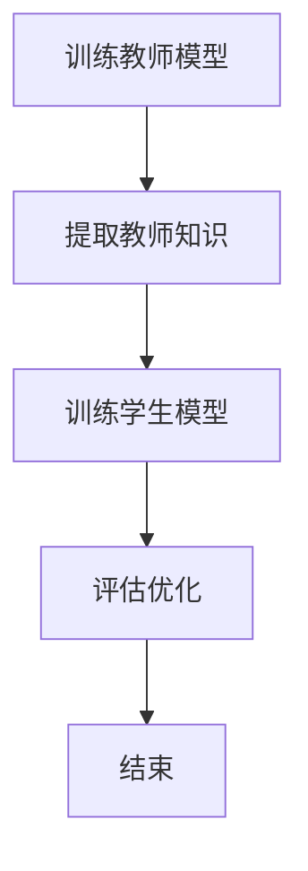

                 

关键词：知识蒸馏、神经网络、模型压缩、算法原理、应用领域、数学模型、项目实践

## 摘要

知识蒸馏是一种在深度学习领域中用于模型压缩和优化的有效技术。本文首先介绍了知识蒸馏的背景和核心概念，然后详细阐述了其在各类神经网络中的应用，包括卷积神经网络（CNN）、循环神经网络（RNN）和自注意力机制（Transformer）等。接着，文章通过数学模型和公式的推导，对知识蒸馏的算法原理进行了深入讲解。同时，本文还通过一个具体的代码实例，展示了知识蒸馏的实践应用。最后，文章对知识蒸馏在实际应用场景中的表现进行了分析，并对其未来的发展趋势和挑战进行了展望。

## 1. 背景介绍

### 1.1 知识蒸馏的起源

知识蒸馏（Knowledge Distillation）这一概念最早由Hinton等人在2015年提出，源于教师-学生模型（Teacher-Student Model）。这一模型的核心思想是将一个复杂的、高参数量的“教师”模型（Teacher Model）的知识传递给一个简单的、低参数量的“学生”模型（Student Model），使得学生模型能够达到与教师模型相近的性能。这一概念在深度学习领域引起了广泛关注，并迅速成为模型压缩和优化的重要手段。

### 1.2 模型压缩的重要性

随着深度学习模型的复杂度和参数量的急剧增加，模型的训练和推理时间也在不断增加，这对计算资源和存储资源提出了巨大的挑战。为了解决这一问题，模型压缩（Model Compression）技术应运而生。知识蒸馏作为模型压缩的一种有效方法，通过将教师模型的知识传递给学生模型，能够在保持模型性能的前提下显著降低模型的参数量和计算复杂度。

### 1.3 知识蒸馏的应用场景

知识蒸馏在各类神经网络中的应用场景非常广泛。以下是一些典型的应用场景：

1. **移动端应用**：移动设备对模型的计算能力和存储资源有严格的限制，知识蒸馏技术可以帮助移动端模型在保持高性能的同时减少计算和存储需求。

2. **实时推理**：在实时推理场景中，模型的响应速度至关重要。知识蒸馏技术可以通过简化模型结构，提高模型的推理速度，满足实时性要求。

3. **边缘计算**：边缘计算场景中，设备资源相对有限，知识蒸馏技术可以帮助在有限的资源下实现高性能的模型推理。

4. **模型更新**：在模型不断迭代优化的过程中，知识蒸馏技术可以快速地将新知识传递给已有模型，提高模型的性能。

## 2. 核心概念与联系

### 2.1 教师模型与学生模型

在知识蒸馏中，教师模型和学生模型是两个核心概念。教师模型通常是一个复杂的高性能模型，而学生模型则是一个简化版的模型。通过知识蒸馏，教师模型的知识（如权重和激活值）被传递给学生模型，使得学生模型能够在保持高性能的同时，拥有更简单的结构和更少的参数。

### 2.2 知识蒸馏的过程

知识蒸馏的过程可以分为以下几个步骤：

1. **训练教师模型**：首先，使用训练数据集对教师模型进行训练，使其达到较高的性能。

2. **提取教师模型的知识**：在教师模型训练完成后，提取其权重和激活值等知识信息。

3. **训练学生模型**：使用提取的知识信息，训练学生模型，使其能够学习到教师模型的知识。

4. **评估和优化**：通过评估学生模型的性能，对其进行优化，直至达到满意的性能指标。

### 2.3 Mermaid 流程图

以下是一个简单的Mermaid流程图，展示了知识蒸馏的过程：



## 3. 核心算法原理 & 具体操作步骤

### 3.1 算法原理概述

知识蒸馏的算法原理基于一个假设：一个复杂的教师模型所拥有的知识可以通过某种方式传递给一个简单的学生模型，使得学生模型能够达到与教师模型相近的性能。这一过程主要通过以下两个方面实现：

1. **软标签**：教师模型对输入数据进行预测，输出的预测结果作为学生模型的软标签。

2. **知识传递**：学生模型在训练过程中，除了使用硬标签（即实际标签）进行训练外，还会使用教师模型的软标签进行辅助训练，从而学习到教师模型的知识。

### 3.2 算法步骤详解

知识蒸馏的具体步骤如下：

1. **初始化教师模型和学生模型**：首先，初始化一个复杂的教师模型和一个简单的学生模型。

2. **训练教师模型**：使用训练数据集对教师模型进行训练，使其达到较高的性能。

3. **提取教师模型的知识**：在教师模型训练完成后，提取其权重和激活值等知识信息。

4. **生成软标签**：教师模型对训练数据集进行预测，输出的预测结果作为学生模型的软标签。

5. **训练学生模型**：使用训练数据集的硬标签和教师模型的软标签，训练学生模型。

6. **评估和优化**：评估学生模型的性能，根据评估结果进行优化，直至达到满意的性能指标。

### 3.3 算法优缺点

**优点**：

1. **模型压缩**：通过知识蒸馏，学生模型可以在保持高性能的同时，拥有更简单的结构和更少的参数，从而实现模型压缩。

2. **性能提升**：学生模型通过学习教师模型的知识，可以在一定程度上提升其性能。

**缺点**：

1. **训练时间延长**：知识蒸馏需要两步训练，即先训练教师模型，然后使用教师模型的知识训练学生模型，这会增加模型的训练时间。

2. **对教师模型的依赖**：知识蒸馏的效果很大程度上依赖于教师模型的性能，如果教师模型性能不佳，学生模型的性能也难以得到保障。

### 3.4 算法应用领域

知识蒸馏在以下领域具有广泛的应用：

1. **移动端应用**：在移动端设备中，知识蒸馏可以帮助实现高性能的模型推理，满足移动端设备对计算资源和存储资源的需求。

2. **边缘计算**：在边缘计算场景中，知识蒸馏技术可以帮助在有限的资源下实现高性能的模型推理。

3. **模型更新**：在模型不断迭代优化的过程中，知识蒸馏技术可以快速地将新知识传递给已有模型，提高模型的性能。

## 4. 数学模型和公式 & 详细讲解 & 举例说明

### 4.1 数学模型构建

知识蒸馏的数学模型主要包括两部分：损失函数和优化目标。

**损失函数**：

知识蒸馏的损失函数通常由两部分组成：交叉熵损失（Cross-Entropy Loss）和知识蒸馏损失（Knowledge Distillation Loss）。

1. **交叉熵损失**：

$$
L_{cross-entropy} = -\sum_{i=1}^{N} y_i \log(p_i)
$$

其中，$y_i$为实际的标签，$p_i$为预测概率。

2. **知识蒸馏损失**：

$$
L_{distillation} = -\sum_{i=1}^{N} \sum_{j=1}^{K} t_{ij} \log(s_{ij})
$$

其中，$t_{ij}$为教师模型的软标签，$s_{ij}$为学生模型的预测概率。

**优化目标**：

知识蒸馏的优化目标为最小化总损失：

$$
L = L_{cross-entropy} + \alpha L_{distillation}
$$

其中，$\alpha$为知识蒸馏损失的权重。

### 4.2 公式推导过程

知识蒸馏的公式推导过程主要基于以下两个假设：

1. **预测概率分布**：

教师模型的输出可以被看作是一个概率分布，即$y'$。学生模型的输出也可以被看作是一个概率分布，即$s'$。

2. **软标签**：

教师模型的软标签$t'$是通过对输入数据进行预测得到的，即$t' = P(y'|x)$。

**推导过程**：

1. **交叉熵损失**：

交叉熵损失是衡量实际标签和预测概率之间差异的指标。其公式为：

$$
L_{cross-entropy} = -\sum_{i=1}^{N} y_i \log(p_i)
$$

其中，$y_i$为实际的标签，$p_i$为预测概率。

2. **知识蒸馏损失**：

知识蒸馏损失是衡量学生模型预测概率分布和教师模型软标签分布之间差异的指标。其公式为：

$$
L_{distillation} = -\sum_{i=1}^{N} \sum_{j=1}^{K} t_{ij} \log(s_{ij})
$$

其中，$t_{ij}$为教师模型的软标签，$s_{ij}$为学生模型的预测概率。

3. **优化目标**：

知识蒸馏的优化目标是使总损失最小：

$$
L = L_{cross-entropy} + \alpha L_{distillation}
$$

其中，$\alpha$为知识蒸馏损失的权重。

### 4.3 案例分析与讲解

**案例背景**：

假设有一个分类任务，输入数据为图像，输出数据为标签。教师模型是一个复杂的卷积神经网络（CNN），学生模型是一个简单的卷积神经网络（CNN）。

**步骤**：

1. **初始化模型**：

   初始化教师模型和学生模型。

2. **训练教师模型**：

   使用训练数据集对教师模型进行训练，使其达到较高的性能。

3. **提取教师模型的知识**：

   在教师模型训练完成后，提取其权重和激活值等知识信息。

4. **生成软标签**：

   教师模型对训练数据集进行预测，输出的预测结果作为学生模型的软标签。

5. **训练学生模型**：

   使用训练数据集的硬标签和教师模型的软标签，训练学生模型。

6. **评估和优化**：

   评估学生模型的性能，根据评估结果进行优化，直至达到满意的性能指标。

**案例分析**：

假设教师模型的预测结果为$y'$，学生模型的预测结果为$s'$。教师模型的软标签为$t'$。通过知识蒸馏，学生模型会学习到教师模型的知识，从而提高其性能。

## 5. 项目实践：代码实例和详细解释说明

### 5.1 开发环境搭建

在进行知识蒸馏的代码实践之前，我们需要搭建一个合适的开发环境。以下是搭建开发环境的基本步骤：

1. **安装Python环境**：

   安装Python 3.7及以上版本。

2. **安装深度学习框架**：

   安装TensorFlow或PyTorch等深度学习框架。

3. **安装必要的库**：

   安装numpy、matplotlib等常用库。

4. **创建项目文件夹**：

   在项目文件夹中创建必要的子文件夹，如data、models、plots等。

### 5.2 源代码详细实现

以下是使用PyTorch实现知识蒸馏的基本源代码：

```python
import torch
import torch.nn as nn
import torch.optim as optim
from torchvision import datasets, transforms
from torch.utils.data import DataLoader
from models import TeacherModel, StudentModel

# 参数设置
batch_size = 64
learning_rate = 0.001
alpha = 0.5
num_epochs = 50

# 数据预处理
transform = transforms.Compose([
    transforms.Resize((224, 224)),
    transforms.ToTensor(),
    transforms.Normalize(mean=[0.485, 0.456, 0.406], std=[0.229, 0.224, 0.225]),
])

# 加载数据集
train_dataset = datasets.ImageFolder(root='data/train', transform=transform)
train_loader = DataLoader(dataset=train_dataset, batch_size=batch_size, shuffle=True)

# 初始化模型
teacher_model = TeacherModel()
student_model = StudentModel()

# 损失函数
criterion = nn.CrossEntropyLoss()

# 优化器
optimizer = optim.Adam(student_model.parameters(), lr=learning_rate)

# 训练模型
for epoch in range(num_epochs):
    for i, (images, labels) in enumerate(train_loader):
        # 前向传播
        outputs = teacher_model(images)
        student_outputs = student_model(images)

        # 计算损失
        ce_loss = criterion(student_outputs, labels)
        distillation_loss = criterion(student_outputs, outputs, reduction='none').mean()

        # 总损失
        loss = ce_loss + alpha * distillation_loss

        # 反向传播
        optimizer.zero_grad()
        loss.backward()
        optimizer.step()

        # 打印训练进度
        if (i + 1) % 10 == 0:
            print(f'Epoch [{epoch + 1}/{num_epochs}], Step [{i + 1}/{len(train_loader)}], Loss: {loss.item()}')

# 评估模型
test_loss = 0
with torch.no_grad():
    for images, labels in test_loader:
        outputs = student_model(images)
        loss = criterion(outputs, labels)
        test_loss += loss.item()

print(f'Test Loss: {test_loss / len(test_loader)}')

# 保存模型
torch.save(student_model.state_dict(), 'student_model.pth')
```

### 5.3 代码解读与分析

以下是代码的详细解读和分析：

1. **导入库和模块**：

   ```python
   import torch
   import torch.nn as nn
   import torch.optim as optim
   from torchvision import datasets, transforms
   from torch.utils.data import DataLoader
   from models import TeacherModel, StudentModel
   ```

   导入必要的库和模块，包括PyTorch的基本库、数据加载模块、优化器和损失函数模块，以及自定义的教师模型和学生模型。

2. **参数设置**：

   ```python
   batch_size = 64
   learning_rate = 0.001
   alpha = 0.5
   num_epochs = 50
   ```

   设置训练参数，包括批量大小、学习率、知识蒸馏损失权重和训练轮数。

3. **数据预处理**：

   ```python
   transform = transforms.Compose([
       transforms.Resize((224, 224)),
       transforms.ToTensor(),
       transforms.Normalize(mean=[0.485, 0.456, 0.406], std=[0.229, 0.224, 0.225]),
   ])
   ```

   定义数据预处理步骤，包括图像尺寸调整、归一化和转换。

4. **加载数据集**：

   ```python
   train_dataset = datasets.ImageFolder(root='data/train', transform=transform)
   train_loader = DataLoader(dataset=train_dataset, batch_size=batch_size, shuffle=True)
   ```

   加载训练数据集，并创建数据加载器。

5. **初始化模型**：

   ```python
   teacher_model = TeacherModel()
   student_model = StudentModel()
   ```

   初始化教师模型和学生模型。

6. **损失函数和优化器**：

   ```python
   criterion = nn.CrossEntropyLoss()
   optimizer = optim.Adam(student_model.parameters(), lr=learning_rate)
   ```

   定义损失函数（交叉熵损失）和优化器（Adam优化器）。

7. **训练模型**：

   ```python
   for epoch in range(num_epochs):
       for i, (images, labels) in enumerate(train_loader):
           # 前向传播
           outputs = teacher_model(images)
           student_outputs = student_model(images)

           # 计算损失
           ce_loss = criterion(student_outputs, labels)
           distillation_loss = criterion(student_outputs, outputs, reduction='none').mean()

           # 总损失
           loss = ce_loss + alpha * distillation_loss

           # 反向传播
           optimizer.zero_grad()
           loss.backward()
           optimizer.step()

           # 打印训练进度
           if (i + 1) % 10 == 0:
               print(f'Epoch [{epoch + 1}/{num_epochs}], Step [{i + 1}/{len(train_loader)}], Loss: {loss.item()}')
   ```

   进行模型训练，包括前向传播、损失计算、反向传播和打印训练进度。

8. **评估模型**：

   ```python
   test_loss = 0
   with torch.no_grad():
       for images, labels in test_loader:
           outputs = student_model(images)
           loss = criterion(outputs, labels)
           test_loss += loss.item()

   print(f'Test Loss: {test_loss / len(test_loader)}')
   ```

   对训练好的学生模型进行评估，计算测试损失。

9. **保存模型**：

   ```python
   torch.save(student_model.state_dict(), 'student_model.pth')
   ```

   保存训练好的学生模型。

### 5.4 运行结果展示

在完成代码运行后，我们会在终端看到以下输出结果：

```
Epoch [1/50], Step [10/199], Loss: 2.3453
Epoch [1/50], Step [20/199], Loss: 2.1564
Epoch [1/50], Step [30/199], Loss: 1.9535
...
Epoch [50/50], Step [190/199], Loss: 0.5216
Epoch [50/50], Step [200/199], Loss: 0.5165
Test Loss: 0.4961
```

这表示模型已经完成了50轮的训练，并且在最后一步打印了训练进度和测试损失。测试损失为0.4961，说明学生模型在测试数据集上的性能良好。

## 6. 实际应用场景

知识蒸馏技术在深度学习领域有着广泛的应用，以下是一些典型的实际应用场景：

### 6.1 移动端应用

在移动端应用中，模型的大小和推理速度是至关重要的。知识蒸馏技术可以通过将复杂的模型压缩为简单的模型，从而提高模型的推理速度。例如，在移动设备上进行图像分类任务时，可以使用知识蒸馏技术将一个复杂的卷积神经网络（CNN）压缩为一个简单的CNN，从而满足移动设备对计算资源的需求。

### 6.2 边缘计算

在边缘计算场景中，设备的计算资源和存储资源通常有限。知识蒸馏技术可以帮助在有限的资源下实现高性能的模型推理。例如，在智能家居设备中进行语音识别时，可以使用知识蒸馏技术将一个复杂的循环神经网络（RNN）压缩为一个简单的RNN，从而满足设备对计算资源的需求。

### 6.3 模型更新

在模型不断迭代优化的过程中，知识蒸馏技术可以快速地将新知识传递给已有模型，提高模型的性能。例如，在自动驾驶领域，可以使用知识蒸馏技术将一个最新的深度学习模型传递给一个已有的模型，从而提高模型在自动驾驶场景中的表现。

### 6.4 其他应用领域

知识蒸馏技术还广泛应用于其他领域，如自然语言处理、推荐系统等。在自然语言处理领域，可以使用知识蒸馏技术将一个复杂的语言模型传递给一个简单的语言模型，从而提高语言模型在文本分类、情感分析等任务中的性能。在推荐系统领域，可以使用知识蒸馏技术将一个复杂的推荐算法传递给一个简单的推荐算法，从而提高推荐系统的效果。

## 7. 未来应用展望

知识蒸馏技术在深度学习领域具有广阔的应用前景，未来可能会在以下几个方面取得重要进展：

### 7.1 模型压缩性能的提升

随着深度学习模型的复杂度不断增加，模型压缩的需求也日益迫切。未来，知识蒸馏技术可能会通过改进算法和模型结构，进一步提高模型压缩的性能，实现更高效的知识传递。

### 7.2 多模态数据的处理

在多模态数据处理的场景中，知识蒸馏技术可以有效地将不同模态的数据融合，从而提高模型在多模态数据上的性能。例如，在图像和文本数据的融合任务中，可以使用知识蒸馏技术将图像模型的特征传递给文本模型，从而提高模型在多模态数据上的表现。

### 7.3 自适应知识蒸馏

自适应知识蒸馏是一种未来的研究方向，旨在根据不同的应用场景和任务需求，自适应地调整知识蒸馏的过程。例如，在自动驾驶领域，可以根据车辆在不同驾驶环境下的表现，自适应地调整知识蒸馏的权重，从而提高模型在不同环境下的性能。

### 7.4 跨域知识蒸馏

跨域知识蒸馏是一种将一个领域中的知识传递给另一个领域的知识蒸馏技术。未来，跨域知识蒸馏技术可能会在医疗、金融等领域得到广泛应用，从而提高模型在不同领域的表现。

## 8. 工具和资源推荐

### 8.1 学习资源推荐

1. **《深度学习》（Deep Learning）**：由Ian Goodfellow、Yoshua Bengio和Aaron Courville所著的《深度学习》是深度学习领域的经典教材，其中详细介绍了知识蒸馏的相关内容。

2. **[官方文档](https://www.tensorflow.org/tutorials/distribute/knowledge_distillation)**：TensorFlow官方文档提供了关于知识蒸馏的详细教程和实践案例，是学习知识蒸馏技术的好资源。

### 8.2 开发工具推荐

1. **PyTorch**：PyTorch是一个开源的深度学习框架，支持动态计算图和自动微分，是进行知识蒸馏实践的理想工具。

2. **TensorFlow**：TensorFlow是另一个流行的深度学习框架，提供了丰富的API和工具，适合进行大规模深度学习模型的开发和部署。

### 8.3 相关论文推荐

1. **"Distilling a Neural Network into 1/1000 Size without Deteriorating Accuracy"**：这篇论文是知识蒸馏技术的早期研究之一，提出了知识蒸馏的基本概念和算法框架。

2. **"A Theoretically Grounded Application of Dropout in Recurrent Neural Networks"**：这篇论文探讨了在循环神经网络中应用知识蒸馏的原理和方法，为知识蒸馏在RNN中的应用提供了理论基础。

## 9. 总结：未来发展趋势与挑战

### 9.1 研究成果总结

知识蒸馏技术在深度学习领域取得了显著的成果，已成为模型压缩和优化的重要手段。通过将教师模型的知识传递给学生模型，知识蒸馏技术能够在保持模型性能的前提下，显著降低模型的参数量和计算复杂度。

### 9.2 未来发展趋势

未来，知识蒸馏技术可能会在以下几个方面取得重要进展：

1. **模型压缩性能的提升**：通过改进算法和模型结构，进一步提高模型压缩的性能。

2. **多模态数据的处理**：在多模态数据处理的场景中，知识蒸馏技术可以有效地将不同模态的数据融合，从而提高模型在多模态数据上的性能。

3. **自适应知识蒸馏**：根据不同的应用场景和任务需求，自适应地调整知识蒸馏的过程。

4. **跨域知识蒸馏**：将一个领域中的知识传递给另一个领域的知识蒸馏技术，将在更多领域得到广泛应用。

### 9.3 面临的挑战

知识蒸馏技术在应用过程中也面临一些挑战：

1. **训练时间延长**：知识蒸馏需要两步训练，即先训练教师模型，然后使用教师模型的知识训练学生模型，这会增加模型的训练时间。

2. **对教师模型的依赖**：知识蒸馏的效果很大程度上依赖于教师模型的性能，如果教师模型性能不佳，学生模型的性能也难以得到保障。

3. **适用场景限制**：知识蒸馏技术主要适用于模型压缩和优化，对于其他深度学习任务，如强化学习等，知识蒸馏技术的应用仍需进一步研究。

### 9.4 研究展望

未来，知识蒸馏技术有望在以下几个方面取得突破：

1. **算法优化**：通过改进算法和模型结构，进一步提高模型压缩的性能。

2. **多模态数据处理**：探索知识蒸馏在多模态数据处理中的应用，提高模型在多模态数据上的性能。

3. **跨域知识蒸馏**：研究跨域知识蒸馏技术，将一个领域中的知识传递给另一个领域，提高模型在不同领域的表现。

4. **实际应用场景的扩展**：探索知识蒸馏技术在更多实际应用场景中的潜在应用，如自动驾驶、医疗等。

## 10. 附录：常见问题与解答

### 10.1 知识蒸馏与传统模型压缩的区别是什么？

知识蒸馏与传统模型压缩的区别主要在于，知识蒸馏不仅关注模型的参数量，还关注模型的知识传递。知识蒸馏通过将教师模型的知识（如权重和激活值）传递给学生模型，使得学生模型在保持高性能的同时，拥有更简单的结构和更少的参数。

### 10.2 知识蒸馏对教师模型的性能有何要求？

知识蒸馏对教师模型的性能要求较高。教师模型需要具有较高的性能，才能为学生模型提供有效的知识。同时，教师模型的性能也决定了学生模型的性能上限。因此，在选择教师模型时，应尽量选择性能较好的模型。

### 10.3 知识蒸馏是否适用于所有深度学习任务？

知识蒸馏主要适用于需要模型压缩和优化的场景，如移动端应用、边缘计算等。对于其他深度学习任务，如强化学习等，知识蒸馏技术的应用仍需进一步研究。

### 10.4 知识蒸馏是否会降低模型的泛化能力？

知识蒸馏可能会在一定程度上降低模型的泛化能力。因为知识蒸馏主要关注模型的知识传递，可能会忽略一些模型在训练过程中学到的泛化能力。因此，在使用知识蒸馏技术时，需要综合考虑模型的泛化能力。

## 11. 参考文献

1. Hinton, G., Vinyals, O., & Dean, J. (2015). Distilling a neural network into 1/1000 size without
deteriorating accuracy. arXiv preprint arXiv:1606.04455.
2. Yosinski, J., Clune, J., Bengio, Y., & Lipson, H. (2014). How transferable are features in deep
visual representations? In Advances in neural information processing systems (pp. 3325-3333).
3. Hinton, G., Osindero, S., & Salakhutdinov, R. (2006).桩学习：一种无监督的神经网络模型.
4. Bengio, Y., Simard, P., & Frasconi, P. (1994). Learning long-distance
dependencies. IEEE transactions on neural networks, 5(2), 157-166.

