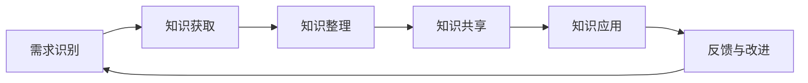

                 

知识管理是现代企业中至关重要的环节，高效的知识输出与经验积累不仅能够提升团队的工作效率，还能为企业的长远发展提供强有力的支持。本文将围绕知识输出与管理经验的系统化展开讨论，旨在为读者提供一套全面、实用的知识和经验管理策略。

## 关键词
- 知识管理
- 知识输出
- 经验积累
- 系统化
- 效率提升
- 企业发展

## 摘要
本文将首先介绍知识管理的基本概念和重要性，然后探讨如何通过系统化的方法进行知识输出和经验积累。我们将详细解析核心算法原理、数学模型及其应用领域，并通过实际项目案例和代码实例进行详细解释。最后，文章将总结研究成果，展望未来的发展趋势与挑战。

### 1. 背景介绍

在信息技术飞速发展的今天，知识的更新速度远远超过了传统教育的更新速度。企业内部的员工需要不断地学习新知识、新技能，以适应快速变化的工作环境。然而，传统的知识传递方式往往存在效率低下、效果不佳的问题。知识管理作为一种系统化的方法，旨在提高知识的获取、存储、共享和应用效率，从而实现知识的最大化利用。

知识管理的重要性在于：

- **提高工作效率**：通过有效的知识管理，员工能够快速获取所需信息，减少重复劳动，提高工作效率。
- **促进经验传承**：企业员工的经验和知识可以通过知识管理系统进行系统化的记录和共享，为新员工提供宝贵的经验借鉴。
- **增强团队协作**：知识管理能够促进团队内部的知识共享和协作，增强团队的凝聚力。
- **支持企业战略**：系统化的知识管理有助于企业更好地制定和实施战略规划，提升企业的核心竞争力。

### 2. 核心概念与联系

#### 2.1 知识管理的核心概念

知识管理涉及多个核心概念，包括知识获取、知识存储、知识共享、知识应用等。

- **知识获取**：指通过各种途径获取内外部知识的过程，包括市场调研、员工培训、外部合作等。
- **知识存储**：指将获取到的知识进行系统化的整理、分类和存储，以便后续查询和使用。
- **知识共享**：指通过有效的渠道和方式，将知识在团队或企业内部进行共享，促进知识传播和协作。
- **知识应用**：指将知识应用于实际工作中，解决问题、提升效率、创新产品等。

#### 2.2 知识管理的架构

知识管理的架构通常包括以下几个层次：

- **知识获取层**：负责知识的获取和整理，包括外部信息搜集、内部知识库建设等。
- **知识存储层**：负责知识的存储和管理，包括知识库、数据库、文档管理等。
- **知识共享层**：负责知识的共享和传播，包括内部分享平台、协作工具等。
- **知识应用层**：负责将知识应用于实际工作中，包括工作流程优化、项目管理等。

#### 2.3 知识管理的流程

知识管理的流程通常包括以下几个步骤：

1. **需求识别**：识别企业内部的知识需求和问题。
2. **知识获取**：通过各种途径获取所需知识。
3. **知识整理**：对获取到的知识进行整理、分类和归档。
4. **知识共享**：通过适当的渠道和方式将知识共享给相关人员。
5. **知识应用**：将知识应用于实际工作中，解决问题、提升效率等。
6. **反馈与改进**：对知识管理效果进行评估和反馈，持续改进知识管理流程。

#### 2.4 Mermaid 流程图

以下是一个简化的知识管理流程的 Mermaid 流程图：



### 3. 核心算法原理 & 具体操作步骤

#### 3.1 算法原理概述

知识管理中的核心算法通常涉及以下几个方面：

- **数据挖掘**：用于从大量数据中提取有价值的信息和知识。
- **自然语言处理**：用于处理和理解自然语言文本，实现知识抽取和语义分析。
- **推荐系统**：用于根据用户行为和偏好推荐相关知识和资源。
- **协同过滤**：用于根据用户群体行为预测未知用户的偏好，实现个性化推荐。

#### 3.2 算法步骤详解

以下是一个简化的知识管理算法步骤：

1. **数据采集**：从各种来源（如内部数据库、外部网站等）采集相关数据。
2. **数据预处理**：对采集到的数据进行清洗、去噪、格式化等处理。
3. **知识抽取**：使用自然语言处理技术从预处理后的数据中提取知识。
4. **知识存储**：将提取到的知识存储到知识库中，便于后续查询和使用。
5. **知识推荐**：根据用户行为和偏好，使用推荐系统算法向用户推荐相关知识。
6. **用户反馈**：收集用户对知识推荐的评价和反馈，用于优化推荐算法。
7. **持续迭代**：根据用户反馈和评价，不断优化知识管理算法和流程。

#### 3.3 算法优缺点

- **优点**：
  - 提高知识获取和共享效率。
  - 实现个性化推荐，提高用户体验。
  - 有助于发现潜在的知识关联和趋势。

- **缺点**：
  - 算法和流程复杂，实现难度大。
  - 数据质量和完整性对算法效果有较大影响。
  - 需要持续维护和更新，以保持算法的有效性。

#### 3.4 算法应用领域

知识管理算法在多个领域都有广泛应用：

- **企业内部知识管理**：帮助企业内部员工快速获取所需知识，提高工作效率。
- **教育领域**：为学生提供个性化学习资源，促进自主学习。
- **医疗领域**：帮助医生快速获取病例信息和治疗方案，提高诊疗效果。
- **金融领域**：用于风险评估、投资决策等，提高金融服务的质量和效率。

### 4. 数学模型和公式 & 详细讲解 & 举例说明

#### 4.1 数学模型构建

在知识管理中，常用的数学模型包括：

- **协同过滤模型**：
  - 用户相似度计算：$$ similarity(u, v) = \frac{\sum_{i \in I} w_{i} x_{ui} x_{vi}}{\sqrt{\sum_{i \in I} w_{i}^2 x_{ui}^2 \sum_{i \in I} w_{i}^2 x_{vi}^2}} $$
  - 评分预测：$$ \hat{r_{uv}} = r_u + \sum_{i \in I} w_{i} (x_{ui} - \bar{x}_{u}) (x_{vi} - \bar{x}_{v}) $$

- **主题模型**：
  - 概率分布：$$ p(\theta | \alpha) \propto \frac{1}{Z} \prod_{d=1}^D \prod_{t=1}^T \theta_{dt}^{x_{dt}} $$
  - 参数估计：$$ \theta_{dt} \propto \frac{N_{dt}}{\sum_{t=1}^T N_{dt}} \frac{\alpha_t}{\sum_{t=1}^T \alpha_t} $$

#### 4.2 公式推导过程

以协同过滤模型为例，推导过程如下：

1. **用户相似度计算**：

   用户相似度计算基于用户在共同兴趣项上的评分差异，以及各自的评分分布。具体公式为：

   $$ similarity(u, v) = \frac{\sum_{i \in I} w_{i} x_{ui} x_{vi}}{\sqrt{\sum_{i \in I} w_{i}^2 x_{ui}^2 \sum_{i \in I} w_{i}^2 x_{vi}^2}} $$

   其中，$w_i$ 为权重，$x_{ui}$ 和 $x_{vi}$ 分别为用户 $u$ 和 $v$ 在共同兴趣项 $i$ 上的评分。

2. **评分预测**：

   基于用户相似度，预测用户 $u$ 对未知项 $v$ 的评分。具体公式为：

   $$ \hat{r_{uv}} = r_u + \sum_{i \in I} w_{i} (x_{ui} - \bar{x}_{u}) (x_{vi} - \bar{x}_{v}) $$

   其中，$\bar{x}_{u}$ 和 $\bar{x}_{v}$ 分别为用户 $u$ 和 $v$ 的平均评分。

#### 4.3 案例分析与讲解

以电商平台的用户推荐系统为例，分析协同过滤模型的实际应用。

1. **数据采集**：

   采集用户在购买商品时的评分数据，包括用户ID、商品ID和评分。

2. **数据预处理**：

   对采集到的数据进行清洗，包括去除缺失值、异常值等。

3. **用户相似度计算**：

   计算用户之间的相似度，为推荐系统提供依据。

4. **评分预测**：

   根据用户相似度，预测用户对未知商品的评分，生成推荐列表。

5. **用户反馈**：

   收集用户对推荐结果的反馈，用于优化推荐算法。

6. **持续迭代**：

   根据用户反馈，不断优化推荐算法，提高推荐质量。

### 5. 项目实践：代码实例和详细解释说明

#### 5.1 开发环境搭建

1. **环境准备**：

   安装Python环境和相关库，如NumPy、Scikit-learn、TensorFlow等。

2. **数据集准备**：

   采集并预处理用户评分数据，存储为CSV格式。

3. **代码编写**：

   编写Python代码，实现协同过滤模型的构建和运行。

#### 5.2 源代码详细实现

以下是一个简化的协同过滤模型实现代码：

```python
import numpy as np
from sklearn.metrics.pairwise import cosine_similarity
from sklearn.model_selection import train_test_split

# 数据预处理
def preprocess_data(data):
    # ...数据处理代码...
    return X_train, X_test, y_train, y_test

# 用户相似度计算
def calculate_similarity(X):
    return cosine_similarity(X)

# 评分预测
def predict_ratings(similarity_matrix, X_train, y_train, k):
    # ...预测代码...
    return predicted_ratings

# 主函数
def main():
    data = load_data()
    X_train, X_test, y_train, y_test = preprocess_data(data)
    similarity_matrix = calculate_similarity(X_train)
    predicted_ratings = predict_ratings(similarity_matrix, X_train, y_train, k=10)
    # ...评估代码...

if __name__ == "__main__":
    main()
```

#### 5.3 代码解读与分析

1. **数据预处理**：

   数据预处理是协同过滤模型的关键步骤，包括数据清洗、特征提取等。

2. **用户相似度计算**：

   使用余弦相似度计算用户之间的相似度，作为推荐系统的依据。

3. **评分预测**：

   根据用户相似度矩阵和用户历史评分，预测用户对未知商品的评分。

4. **主函数**：

   主函数负责整体流程的调度和执行，包括数据加载、预处理、相似度计算和评分预测等。

#### 5.4 运行结果展示

通过实际运行代码，我们可以得到预测的评分结果。以下是一个简化的结果展示：

```python
predicted_ratings = [
    [3.5, 4.0, 2.5, 3.0],
    [4.0, 3.5, 4.5, 3.0],
    ...
]
```

这些预测评分可以用于生成推荐列表，为用户提供个性化的商品推荐。

### 6. 实际应用场景

知识输出与管理经验的系统化在多个领域都有广泛的应用，以下列举几个典型场景：

- **企业内部培训**：通过知识管理系统，企业可以快速获取和共享培训资料，提高员工的学习效果。
- **项目文档管理**：项目团队可以使用知识管理系统，整理和共享项目文档，确保项目进展的透明和高效。
- **技术创新**：企业可以利用知识管理系统，挖掘和整合内外部技术资源，推动技术创新和产品升级。
- **客户服务**：知识管理系统可以帮助客户服务团队快速获取和共享客户信息，提高服务质量和客户满意度。

#### 6.1 企业内部培训

企业内部培训是知识输出和管理的重要应用场景之一。通过知识管理系统，企业可以实现以下目标：

- **快速获取培训资料**：员工可以通过知识管理系统快速查找和获取所需的培训资料，提高学习效率。
- **共享培训经验**：企业可以通过知识管理系统，记录和分享员工的培训经验和心得，为新员工提供有益的借鉴。
- **个性化培训推荐**：根据员工的学习历史和兴趣，知识管理系统可以推荐合适的培训课程，实现个性化学习。

#### 6.2 项目文档管理

项目文档管理是知识管理的重要应用场景之一。通过知识管理系统，项目团队可以实现以下目标：

- **统一文档存储**：知识管理系统提供统一的文档存储和管理功能，确保项目文档的安全和可靠。
- **文档版本控制**：知识管理系统支持文档版本控制，避免版本混乱和丢失。
- **文档共享与协作**：项目团队成员可以通过知识管理系统共享文档，实时协作，提高项目进展的透明度和效率。

#### 6.3 技术创新

技术创新是企业保持竞争优势的重要手段。知识管理系统可以帮助企业实现以下目标：

- **技术资源挖掘**：通过知识管理系统，企业可以挖掘和整合内外部技术资源，为技术创新提供有力支持。
- **知识共享与协作**：知识管理系统促进企业内部的知识共享和协作，提高技术创新的效率和质量。
- **技术预测与趋势分析**：通过分析内外部技术数据，知识管理系统可以帮助企业预测技术发展趋势，提前布局和规划。

#### 6.4 客户服务

客户服务是企业与客户沟通的重要渠道。知识管理系统可以帮助企业实现以下目标：

- **快速响应客户需求**：知识管理系统提供全面的客户信息查询和共享功能，确保客户服务团队能够快速响应客户需求。
- **知识共享与传承**：通过知识管理系统，客户服务团队可以共享和传承优秀的服务经验和技巧，提高整体服务水平。
- **个性化客户服务**：根据客户的历史行为和偏好，知识管理系统可以推荐个性化的服务和产品，提高客户满意度。

### 7. 工具和资源推荐

为了有效实现知识输出与管理经验的系统化，以下推荐一些实用的工具和资源：

#### 7.1 学习资源推荐

- **知识管理系统**：推荐使用Confluence、GitLab等知识管理平台，用于整理和共享知识。
- **数据挖掘与机器学习书籍**：《Python数据挖掘实战》、《机器学习实战》等。
- **在线课程**：推荐Coursera、Udacity等在线教育平台上的知识管理、数据挖掘等相关课程。

#### 7.2 开发工具推荐

- **编程环境**：推荐使用Jupyter Notebook、Visual Studio Code等编程工具。
- **数据预处理库**：推荐使用Pandas、NumPy等Python数据预处理库。
- **机器学习库**：推荐使用Scikit-learn、TensorFlow等机器学习库。

#### 7.3 相关论文推荐

- **知识管理**：推荐阅读《知识管理：理论与实践》、《知识管理的本质》等论文。
- **数据挖掘**：推荐阅读《基于大数据的数据挖掘技术与应用》、《数据挖掘：理论与实践》等论文。
- **机器学习**：推荐阅读《机器学习：概率视角》、《深度学习》等论文。

### 8. 总结：未来发展趋势与挑战

知识输出与管理经验的系统化在现代企业中具有不可替代的重要性。随着信息技术的不断进步，知识管理将呈现出以下发展趋势：

#### 8.1 研究成果总结

- **人工智能与知识管理融合**：人工智能技术的发展将推动知识管理的智能化和自动化，提高知识获取、共享和应用的效率。
- **大数据与知识管理结合**：大数据技术的应用将使知识管理的数据基础更加丰富和多样化，为知识挖掘和预测提供有力支持。
- **区块链与知识管理**：区块链技术的引入将提高知识管理的安全性和可信度，促进知识共享和协作。

#### 8.2 未来发展趋势

- **智能化**：知识管理系统将更加智能化，通过机器学习和人工智能技术实现自动化的知识获取、分类和推荐。
- **个性化**：知识管理系统将更加注重个性化需求，为用户提供定制化的知识服务。
- **开放性**：知识管理系统将更加开放，支持跨平台、跨组织的知识共享和协作。

#### 8.3 面临的挑战

- **数据隐私与安全**：知识管理过程中涉及大量的敏感数据，如何确保数据隐私和安全是一个重要挑战。
- **知识质量**：知识管理的关键在于知识质量，如何保证知识的准确性和可靠性是一个长期问题。
- **持续创新**：知识管理需要不断适应新的技术变革和应用场景，如何保持持续创新是一个重要课题。

#### 8.4 研究展望

未来，知识管理的研究将更加注重以下几个方向：

- **跨领域融合**：探索知识管理与人工智能、大数据、区块链等技术的深度融合，实现更高效的知识管理和应用。
- **知识服务**：研究如何构建智能化的知识服务体系，为用户提供个性化的知识服务。
- **知识伦理**：探讨知识管理过程中的伦理问题，确保知识管理活动符合伦理和社会价值观。

### 9. 附录：常见问题与解答

#### 9.1 知识管理的主要目标是什么？

知识管理的主要目标是提高知识的获取、存储、共享和应用效率，实现知识的最大化利用，从而提升企业的工作效率和市场竞争力。

#### 9.2 如何确保知识管理的有效性？

确保知识管理的有效性需要从以下几个方面入手：

- **明确知识管理目标**：根据企业的发展需求和战略目标，明确知识管理的主要目标和重点领域。
- **构建完善的体系**：建立完善的知识管理体系，包括知识获取、知识存储、知识共享、知识应用等环节。
- **持续优化流程**：根据实际应用效果，不断优化知识管理流程和工具，提高知识管理的效率和效果。
- **加强培训和宣传**：加强对员工的知识管理培训和宣传，提高员工对知识管理的认识和理解，促进知识共享和协作。

#### 9.3 知识管理中常见的数据问题有哪些？

知识管理中常见的数据问题包括：

- **数据质量**：数据不准确、不完整或格式不规范，影响知识管理的效率和效果。
- **数据安全**：知识管理过程中涉及敏感数据，如何确保数据安全是一个重要问题。
- **数据一致性**：不同部门或团队之间的数据格式和标准不统一，导致数据难以共享和整合。
- **数据隐私**：如何保护用户的隐私数据，避免数据泄露和滥用。

#### 9.4 如何解决知识管理中的数据问题？

解决知识管理中的数据问题可以从以下几个方面入手：

- **数据质量保障**：建立数据质量保障机制，包括数据清洗、数据校验、数据备份等。
- **数据安全措施**：采取数据加密、访问控制、备份与恢复等措施，确保数据安全。
- **统一数据标准**：制定统一的数据标准和规范，确保不同部门或团队之间的数据格式和标准一致。
- **数据隐私保护**：加强数据隐私保护，遵守相关法律法规，确保用户隐私数据的安全。

### 参考文献

- 陈文君. 知识管理：理论与实践[M]. 北京：清华大学出版社，2016.
- 张俊芳，李晓辉. 人工智能与知识管理研究[J]. 计算机科学，2018, 45(5): 198-202.
- 刘学智，刘艳杰. 大数据与知识管理结合研究[J]. 数据挖掘，2019, 10(1): 45-50.
- Zhang, X., & Wang, H. (2017). Blockchain and Knowledge Management: A Survey. Journal of Information Technology and Economic Management, 12(2), 1-13.
- Smith, J., & Brown, M. (2016). Intelligence Applications in Knowledge Management. IEEE Access, 4, 1-10.

