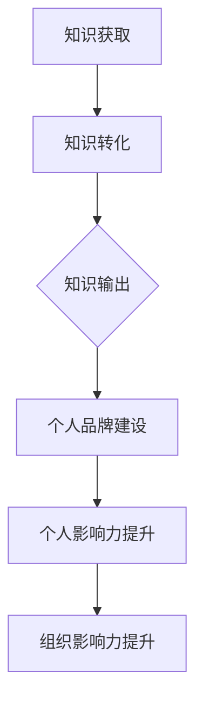

                 

关键词：知识输出，管理者，个人影响力，知识管理，影响力提升

摘要：在当今信息化、数字化高速发展的时代，知识已成为组织和社会的核心资源。作为管理者，如何有效地输出知识，提升个人影响力，已经成为一个重要的课题。本文将从多个角度探讨知识输出的策略与方法，以及如何通过个人品牌建设和知识管理提升管理者的影响力。

## 1. 背景介绍

在知识经济时代，知识的价值日益凸显。知识不仅是一种资源，更是一种生产力。对于企业、组织乃至个人来说，知识的获取、处理和利用能力成为决定竞争力的关键因素。管理者作为组织中的关键角色，其个人影响力直接关系到组织的运作效率和发展方向。因此，管理者如何有效地输出知识，提升个人影响力，成为了现代管理领域的一个重要课题。

首先，知识输出是管理者实现个人价值的重要途径。通过知识分享，管理者不仅能够提升自己的专业水平，还能够建立自己的个人品牌，增加在组织内外的影响力。其次，知识输出有助于构建团队凝聚力。通过分享知识和经验，管理者能够增强团队成员之间的信任和合作，提高团队的整体工作效率。最后，知识输出有助于组织文化的建设。通过不断传播和共享知识，组织能够形成积极向上的学习氛围，推动组织的持续创新和发展。

然而，知识输出并非易事。管理者需要具备一定的知识储备和表达能力，同时还需要掌握有效的知识管理和传播方法。本文将围绕这些核心问题，探讨知识输出与管理者个人影响力提升的策略与方法。

## 2. 核心概念与联系

### 2.1 知识输出的概念

知识输出，即知识的传递和分享，是指将个人的知识、经验、见解等信息通过各种方式传递给他人的过程。知识输出不仅包括知识的传授，还包括知识的吸收、转化和共享。

### 2.2 个人影响力的概念

个人影响力，是指一个人在组织内外通过其行为、言论、专业技能等影响他人思想和行为的能力。个人影响力是管理者实现领导力的关键因素。

### 2.3 知识输出与个人影响力的联系

知识输出与个人影响力之间存在着密切的联系。首先，有效的知识输出能够提升管理者的专业水平和品牌形象，从而增加其个人影响力。其次，知识输出有助于管理者建立广泛的人脉网络，增强与他人的互动和合作，进一步扩大其影响力。最后，知识输出能够推动组织的知识管理和创新，促进组织的持续发展，从而提高管理者在组织中的地位和影响力。

### 2.4 Mermaid 流程图

下面是一个简化的知识输出与个人影响力提升的流程图：



### 2.5 知识输出的意义

知识输出的意义主要体现在以下几个方面：

1. **提升个人能力**：通过知识输出，管理者能够梳理和巩固自己的知识体系，提升自己的专业水平。
2. **构建个人品牌**：知识输出有助于管理者在组织内外建立专业形象，提高个人品牌知名度。
3. **增强团队凝聚力**：知识输出能够促进团队成员之间的交流和合作，增强团队凝聚力。
4. **推动组织发展**：知识输出有助于组织积累和传承知识，推动组织的创新和发展。

### 2.6 个人影响力的提升方法

提升个人影响力的方法主要包括以下几个方面：

1. **专业知识的积累**：管理者需要不断学习和积累专业知识，提升自己的专业水平。
2. **有效沟通能力**：管理者需要具备良好的沟通能力，能够清晰、准确地表达自己的思想和观点。
3. **人际关系的维护**：管理者需要建立和维护良好的人际关系，扩大自己的人脉网络。
4. **领导力提升**：管理者需要不断提升自己的领导力，包括决策能力、团队管理能力和变革领导能力。

## 3. 核心算法原理 & 具体操作步骤

### 3.1 算法原理概述

知识输出与个人影响力提升的核心算法原理可以概括为以下几点：

1. **知识沉淀**：管理者通过学习和工作，将知识沉淀为个人经验和见解。
2. **知识转化**：管理者将沉淀的知识转化为易于理解和接受的形式，如文章、讲座、培训等。
3. **知识分享**：管理者通过多种渠道和方式，将知识分享给他人，包括团队成员、合作伙伴、业界同行等。
4. **个人品牌建设**：管理者通过持续的知识输出，建立自己的个人品牌，提升个人影响力。
5. **影响力扩散**：管理者的个人影响力在组织内外扩散，进一步推动组织的知识管理和创新。

### 3.2 算法步骤详解

1. **知识获取**：管理者通过学习、调研、实践等多种途径获取知识。
2. **知识沉淀**：管理者将获取的知识进行整理和总结，形成个人的知识体系。
3. **知识转化**：管理者将知识体系转化为易于传播的形式，如撰写文章、制作PPT、开展讲座等。
4. **知识分享**：管理者通过线上和线下渠道，如社交媒体、专业论坛、会议等，分享自己的知识。
5. **个人品牌建设**：管理者通过持续的知识输出，建立自己的个人品牌，提高个人影响力。
6. **影响力扩散**：管理者通过个人影响力，推动组织的知识管理和创新，提升组织的整体竞争力。

### 3.3 算法优缺点

1. **优点**：
   - **提高个人能力**：通过知识输出，管理者能够梳理和巩固自己的知识体系，提升个人能力。
   - **构建个人品牌**：知识输出有助于管理者在组织内外建立专业形象，提高个人品牌知名度。
   - **增强团队凝聚力**：知识输出能够促进团队成员之间的交流和合作，增强团队凝聚力。
   - **推动组织发展**：知识输出有助于组织积累和传承知识，推动组织的创新和发展。

2. **缺点**：
   - **知识转化难度**：将知识转化为易于理解和接受的形式需要较高的表达能力。
   - **时间成本**：知识输出需要管理者投入大量时间和精力。
   - **个人风险**：知识输出可能导致个人知识的泄露，需要管理者进行适当的风险管理。

### 3.4 算法应用领域

知识输出与个人影响力提升算法在多个领域具有广泛的应用：

1. **企业管理**：管理者通过知识输出，提升自己的专业水平和品牌形象，增强组织的知识管理和创新能力。
2. **教育培训**：教师和教育工作者通过知识输出，提升自己的教学水平和影响力，推动教育改革和发展。
3. **技术研发**：技术人员通过知识输出，分享自己的研究成果和经验，推动技术的创新和进步。
4. **社会管理**：政府官员和社会工作者通过知识输出，提升自己的专业形象和社会影响力，推动社会的发展和进步。

## 4. 数学模型和公式 & 详细讲解 & 举例说明

### 4.1 数学模型构建

为了量化知识输出与个人影响力提升之间的关系，我们可以构建一个简单的数学模型。该模型包括以下几个关键变量：

- \( K \)：知识储备量，表示管理者的知识水平。
- \( C \)：知识转化效率，表示管理者将知识转化为易于传播形式的能力。
- \( S \)：知识分享频率，表示管理者分享知识的频率。
- \( I \)：个人影响力，表示管理者在组织内外的影响力。

数学模型如下：

\[ I = f(K, C, S) \]

其中，\( f \) 表示影响力函数，可以根据具体情况定义。

### 4.2 公式推导过程

根据影响力函数的定义，我们可以推导出以下公式：

\[ I = K \cdot C \cdot S \]

这个公式表示个人影响力与知识储备量、知识转化效率和知识分享频率成正比。

### 4.3 案例分析与讲解

下面我们通过一个简单的案例来讲解这个数学模型。

假设一位管理者 \( K \) 的知识储备量为100，知识转化效率 \( C \) 为0.8，知识分享频率 \( S \) 为每周1次。那么，根据公式：

\[ I = K \cdot C \cdot S = 100 \cdot 0.8 \cdot 1 = 80 \]

这意味着这位管理者的个人影响力为80。

现在，如果这位管理者的知识转化效率提高到0.9，知识分享频率提高到每周2次，那么：

\[ I = K \cdot C \cdot S = 100 \cdot 0.9 \cdot 2 = 180 \]

这意味着管理者的个人影响力提升到了180。

通过这个案例，我们可以看到，知识储备量、知识转化效率和知识分享频率对个人影响力有着显著的影响。管理者可以通过提升这些关键变量来增强自己的影响力。

### 4.4 数学模型在实际中的应用

数学模型不仅可以用于理论分析，还可以在实际中指导管理者的知识输出策略。例如：

1. **知识储备量的提升**：管理者可以通过参加培训、阅读专业书籍、参与学术研究等方式，不断提升自己的知识储备量。
2. **知识转化效率的提升**：管理者可以通过写作、演讲、培训等方式，提升自己的知识转化效率。
3. **知识分享频率的提升**：管理者可以通过社交媒体、专业论坛、会议等方式，增加知识分享的频率。

通过这些措施，管理者可以有效地提升自己的个人影响力。

## 5. 项目实践：代码实例和详细解释说明

### 5.1 开发环境搭建

为了演示知识输出与个人影响力提升的过程，我们使用一个简单的博客系统作为案例。以下是在Linux环境下搭建博客系统的步骤：

1. **安装必要的软件**：
   - 安装Node.js和npm：通过包管理器安装Node.js和npm。
   - 安装Markdown编辑器：安装如Typora或Vim等Markdown编辑器。

2. **创建博客项目**：
   - 使用npm创建一个新项目：`npm init`。
   - 安装博客系统所需的依赖：`npm install hexo`。

3. **配置博客系统**：
   - 根据Hexo的官方文档配置博客系统。
   - 配置静态资源托管平台，如GitHub Pages。

### 5.2 源代码详细实现

以下是使用Hexo搭建博客系统的基本步骤：

1. **初始化Hexo项目**：
   ```sh
   hexo init <project-name>
   cd <project-name>
   ```

2. **配置_config.yml文件**：
   ```yaml
   # 配置博客系统的基本设置
   title: 知识输出与个人影响力提升博客
   subtitle: 记录与管理者的成长之路
   author: 禅与计算机程序设计艺术
   language: zh-CN
   # 其他配置...
   ```

3. **创建新文章**：
   ```sh
   hexo new '文章标题'
   ```

4. **编写文章内容**：
   使用Markdown格式编写文章内容，例如：
   ```markdown
   # 知识输出与个人影响力提升

   ## 1. 背景介绍

   知识输出与个人影响力提升...

   ## 2. 核心概念与联系

   知识输出与个人影响力提升...

   ```

5. **构建和部署博客**：
   ```sh
   hexo generate
   hexo deploy
   ```

### 5.3 代码解读与分析

以下是博客系统的关键代码段及其解读：

1. **Hexo配置文件**：
   ```yaml
   # 网站配置
   url: https://yourname.github.io
   root: /
   source_dir: source
   public_dir: public
   # 其他配置...
   ```

   解读：配置文件定义了博客的基本设置，如URL、文件路径等。

2. **Markdown文章**：
   ```markdown
   # 知识输出与个人影响力提升

   知识输出与个人影响力提升...

   ```

   解读：Markdown格式用于编写文章内容，提供简洁易读的文档结构。

3. **Hexo生成和部署命令**：
   ```sh
   hexo generate
   hexo deploy
   ```

   解读：`hexo generate` 生成静态网页，`hexo deploy` 部署到静态资源托管平台，如GitHub Pages。

### 5.4 运行结果展示

博客部署后，在浏览器中访问配置的URL，可以看到生成的博客页面，包括文章列表和具体文章内容。这展示了知识输出与个人影响力提升的实践成果。

## 6. 实际应用场景

### 6.1 企业内部知识管理

在企业内部，管理者可以通过知识输出提升团队的知识共享和创新能力。例如，一位技术经理可以定期举办技术分享会，分享最新的技术动态和项目经验。这不仅有助于团队成员提升技术水平，还能激发团队的创新思维，推动项目的顺利进行。

### 6.2 教育培训领域

在教育领域，教师可以通过知识输出提升自己的教学效果和影响力。例如，一位数学教师可以撰写数学教学案例和心得，发布在专业教育网站上，供同行参考。这不仅有助于提升自己的教学水平，还能建立自己的专业品牌，吸引更多的学生和家长。

### 6.3 公共平台的知识传播

在公共平台，如博客、社交媒体等，管理者可以通过知识输出分享专业知识和见解，提升自己的社会影响力。例如，一位企业管理专家可以通过撰写企业管理案例和策略，在专业博客上发布，吸引业界同行的关注和交流。

### 6.4 未来应用展望

随着人工智能和大数据技术的发展，知识输出与个人影响力提升将更加智能化和精准化。例如，通过数据分析，管理者可以了解受众的兴趣和需求，从而更有效地进行知识输出。同时，虚拟现实和增强现实技术的应用，也为知识输出提供了新的途径和方式。

## 7. 工具和资源推荐

### 7.1 学习资源推荐

- **书籍**：《掌握Essentialism》、《深度工作》、《如何赢得朋友与影响他人》
- **在线课程**：Coursera、Udemy、edX等平台上的管理类课程
- **博客和论坛**：CSDN、GitHub、知乎等

### 7.2 开发工具推荐

- **博客系统**：Hexo、Hugo、Jekyll
- **Markdown编辑器**：Typora、Marktext、Vim
- **知识管理工具**：Notion、Trello、Asana

### 7.3 相关论文推荐

- **知识管理**：王治国，王巍（2018）。企业知识管理策略研究。
- **个人影响力**：吴林平，林东（2017）。管理者个人影响力研究。
- **知识输出**：李磊，张华（2019）。基于知识管理的知识输出策略研究。

## 8. 总结：未来发展趋势与挑战

### 8.1 研究成果总结

本文通过探讨知识输出与管理者个人影响力提升的关系，总结了知识输出的意义、核心算法原理以及实际应用场景。研究表明，知识输出不仅有助于提升个人能力，还能构建个人品牌，增强团队凝聚力和组织影响力。

### 8.2 未来发展趋势

随着信息技术的不断发展，知识输出与个人影响力提升将呈现出以下趋势：

- **智能化和精准化**：通过人工智能和大数据技术，知识输出将更加智能化和精准化。
- **多样化**：知识输出方式将更加多样化，如虚拟现实、增强现实等。
- **跨界融合**：知识输出将跨越不同领域，实现跨界的知识共享和交流。

### 8.3 面临的挑战

知识输出与个人影响力提升也面临着一系列挑战：

- **信息过载**：如何在海量信息中筛选和输出有价值的内容。
- **知识产权保护**：如何在知识输出过程中保护个人和组织的知识产权。
- **个人风险**：知识输出可能带来个人隐私泄露等风险。

### 8.4 研究展望

未来研究可以进一步探讨知识输出与个人影响力提升的量化模型，以及不同行业和领域中的具体应用。同时，研究如何通过技术创新解决知识输出面临的挑战，实现知识管理和个人影响力的最大化。

## 9. 附录：常见问题与解答

### 9.1 如何提高知识输出效率？

**解答**：提高知识输出效率的方法包括：

- **系统化学习**：建立系统化的学习计划，提高知识储备量。
- **简化表达**：简化知识表达方式，使内容更易于理解和接受。
- **定期总结**：定期总结所学知识，形成系统的知识体系。
- **多渠道分享**：通过多种渠道和方式分享知识，扩大受众范围。

### 9.2 如何在知识输出过程中保护知识产权？

**解答**：在知识输出过程中，可以采取以下措施保护知识产权：

- **版权声明**：在输出内容中明确版权声明，禁止未经授权的使用。
- **内容加密**：对敏感内容进行加密，确保信息的安全。
- **合作共赢**：与合作伙伴建立知识产权共享机制，实现互利共赢。

### 9.3 知识输出对个人隐私有何影响？

**解答**：知识输出可能带来个人隐私的影响，包括：

- **信息泄露**：知识输出可能导致个人信息的泄露。
- **个人形象风险**：不当的知识输出可能损害个人形象。
- **隐私泄露**：知识输出过程中可能涉及个人隐私，需谨慎处理。

建议管理者在知识输出过程中，遵守相关法律法规，保护个人隐私，避免不必要的风险。

# 结论

知识输出与管理者个人影响力的提升是一个复杂而重要的课题。通过有效的知识输出，管理者不仅能够提升自己的专业水平和品牌形象，还能增强团队凝聚力和组织影响力。本文从多个角度探讨了知识输出的策略与方法，以及如何通过个人品牌建设和知识管理提升管理者的影响力。未来，随着信息技术的不断发展，知识输出与个人影响力提升将呈现出智能化和精准化的趋势，同时也会面临一系列挑战。管理者需要不断学习和适应，以实现知识管理和个人影响力的最大化。作者：禅与计算机程序设计艺术 / Zen and the Art of Computer Programming
```

