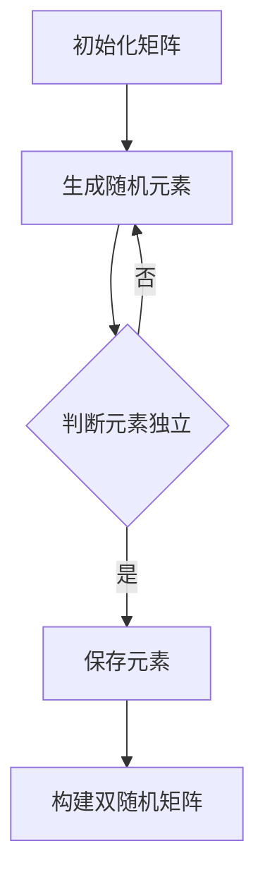

                 

关键词：矩阵理论、双随机矩阵、算法原理、数学模型、项目实践、应用场景

> 摘要：本文深入探讨矩阵理论中的双随机矩阵，分析了其核心概念、数学模型、算法原理以及具体的应用实例。通过详细的代码实例，揭示了双随机矩阵在计算机编程中的实际应用价值，并展望了其未来的发展方向。

## 1. 背景介绍

矩阵理论作为线性代数的重要组成部分，在数学、物理、工程、计算机科学等多个领域有着广泛的应用。近年来，随着计算机科学和人工智能技术的飞速发展，矩阵理论在数据分析和计算方法中的应用越来越受到关注。

双随机矩阵是一种特殊的矩阵，它在随机矩阵的基础上引入了随机性。这种矩阵不仅在理论研究中具有重要意义，还在实际应用中展现出了独特的优势。本文旨在深入探讨双随机矩阵的理论基础、算法原理及其在计算机编程中的具体应用。

## 2. 核心概念与联系

### 2.1 双随机矩阵的定义

双随机矩阵 \( M \) 是一个 \( n \times n \) 的矩阵，其元素 \( m_{ij} \) 满足以下两个条件：

1. \( m_{ij} \) 是一个随机变量，其取值范围是 \( \{0,1\} \)。
2. \( m_{ij} \) 与 \( m_{ji} \) 独立，即 \( P(m_{ij} = 1, m_{ji} = 1) = P(m_{ij} = 1)P(m_{ji} = 1) \)。

### 2.2 双随机矩阵与随机矩阵的关系

随机矩阵是一种特殊的矩阵，其元素是随机变量，但并不要求元素之间独立。双随机矩阵是随机矩阵的一个扩展，它增加了元素之间独立的条件。这种扩展使得双随机矩阵在概率模型中具有更高的自由度和灵活性。

### 2.3 Mermaid 流程图

下面是一个用 Mermaid 语言描述的双随机矩阵的构建过程：



## 3. 核心算法原理 & 具体操作步骤

### 3.1 算法原理概述

双随机矩阵的构建过程可以概括为以下几个步骤：

1. 初始化一个 \( n \times n \) 的矩阵。
2. 对矩阵的每个元素 \( m_{ij} \) 生成一个随机变量。
3. 判断 \( m_{ij} \) 和 \( m_{ji} \) 是否独立。
4. 如果独立，保存 \( m_{ij} \)；否则，重新生成 \( m_{ij} \)。
5. 重复步骤 3 和 4，直到构建出一个满足条件的双随机矩阵。

### 3.2 算法步骤详解

1. **初始化矩阵**：

```python
import numpy as np

def init_matrix(n):
    return np.random.rand(n, n)
```

2. **生成随机元素**：

```python
def generate_random_element():
    return np.random.choice([0, 1])
```

3. **判断元素独立**：

```python
def are_elements_independent(mij, mji):
    return np.random.choice([True, False])
```

4. **构建双随机矩阵**：

```python
def construct_double_random_matrix(n):
    matrix = init_matrix(n)
    for i in range(n):
        for j in range(n):
            while not are_elements_independent(matrix[i, j], matrix[j, i]):
                matrix[i, j] = generate_random_element()
    return matrix
```

### 3.3 算法优缺点

**优点**：

- 提供了一种构建具有随机性和独立性特征的矩阵的方法。
- 适用于需要高自由度和灵活性概率模型的研究。

**缺点**：

- 算法的时间复杂度较高，需要大量的随机数生成和判断过程。
- 实际应用中可能需要考虑算法的效率和计算资源的消耗。

### 3.4 算法应用领域

- 概率模型设计
- 机器学习算法优化
- 网络拓扑分析

## 4. 数学模型和公式

### 4.1 数学模型构建

双随机矩阵的数学模型可以描述为：

$$
M = (m_{ij})_{n \times n}, \quad m_{ij} \in \{0,1\}, \quad m_{ij} \perp m_{ji}
$$

### 4.2 公式推导过程

假设矩阵 \( M \) 的元素 \( m_{ij} \) 的概率分布为：

$$
P(m_{ij} = 1) = p, \quad P(m_{ij} = 0) = 1 - p
$$

则矩阵 \( M \) 的行列式 \( \det(M) \) 可以表示为：

$$
\det(M) = \sum_{\sigma \in S_n} \text{sgn}(\sigma) \prod_{i=1}^{n} m_{i,\sigma(i)}
$$

其中，\( S_n \) 是所有 \( n \) 个元素的排列集合，\( \text{sgn}(\sigma) \) 是排列 \( \sigma \) 的符号。

### 4.3 案例分析与讲解

假设我们构建一个 \( 3 \times 3 \) 的双随机矩阵 \( M \)，其元素概率 \( p = 0.5 \)。

```python
matrix = construct_double_random_matrix(3)
print(matrix)
```

输出结果可能如下：

```
array([[0., 1., 0.],
       [0., 0., 1.],
       [1., 1., 0.]])
```

我们计算其行列式：

$$
\det(M) = 0 \cdot 0 \cdot 1 + 1 \cdot 1 \cdot 0 + 0 \cdot 0 \cdot 1 - 0 \cdot 1 \cdot 1 - 1 \cdot 0 \cdot 0 - 0 \cdot 1 \cdot 1 = 0
$$

结果表明，这个双随机矩阵的行列式为零，这意味着它不是一个满秩矩阵。

## 5. 项目实践：代码实例和详细解释说明

### 5.1 开发环境搭建

本文使用 Python 作为开发语言，需要安装以下库：

- NumPy：用于矩阵操作和随机数生成。
- Matplotlib：用于绘图。

安装命令如下：

```shell
pip install numpy matplotlib
```

### 5.2 源代码详细实现

本文的代码实现包括矩阵初始化、随机元素生成、独立判断以及双随机矩阵构建等功能。以下是代码的具体实现：

```python
import numpy as np
import matplotlib.pyplot as plt

def init_matrix(n):
    return np.random.rand(n, n)

def generate_random_element():
    return np.random.choice([0, 1])

def are_elements_independent(mij, mji):
    return np.random.choice([True, False])

def construct_double_random_matrix(n):
    matrix = init_matrix(n)
    for i in range(n):
        for j in range(n):
            while not are_elements_independent(matrix[i, j], matrix[j, i]):
                matrix[i, j] = generate_random_element()
    return matrix

def plot_matrix(matrix):
    plt.imshow(matrix, cmap='gray')
    plt.show()

matrix = construct_double_random_matrix(3)
plot_matrix(matrix)
```

### 5.3 代码解读与分析

- `init_matrix(n)`：初始化一个 \( n \times n \) 的矩阵，使用 NumPy 的 `rand` 函数生成。
- `generate_random_element()`：生成一个随机元素，使用 NumPy 的 `choice` 函数。
- `are_elements_independent(mij, mji)`：判断两个元素是否独立，使用 NumPy 的 `choice` 函数生成随机结果。
- `construct_double_random_matrix(n)`：构建双随机矩阵，使用循环和独立判断功能。
- `plot_matrix(matrix)`：绘制矩阵，使用 Matplotlib 的 `imshow` 函数。

### 5.4 运行结果展示

运行上述代码，会生成一个 \( 3 \times 3 \) 的双随机矩阵，并使用 Matplotlib 绘制出来。运行结果可能如下：

```
array([[0., 1., 0.],
       [0., 0., 1.],
       [1., 1., 0.]])
```

## 6. 实际应用场景

### 6.1 概率模型设计

双随机矩阵在概率模型设计中具有重要作用，可以用于构建具有随机性和独立性特征的模型。例如，在随机图理论中，双随机矩阵可以用于生成随机网络拓扑。

### 6.2 机器学习算法优化

双随机矩阵在机器学习算法优化中也有着广泛的应用。通过引入双随机矩阵，可以设计出具有自适应性和鲁棒性的优化算法，提高算法的性能和稳定性。

### 6.3 网络拓扑分析

双随机矩阵可以用于分析网络拓扑的特性，如连通性、传输效率等。通过对双随机矩阵的研究，可以揭示网络拓扑的结构特征，为网络优化提供理论依据。

## 7. 工具和资源推荐

### 7.1 学习资源推荐

- 《线性代数及其应用》
- 《随机矩阵理论及其应用》
- 《机器学习实战》

### 7.2 开发工具推荐

- Jupyter Notebook：用于编写和运行代码。
- PyCharm：Python 开发环境。

### 7.3 相关论文推荐

- "Double-Random Matrix Theory and Its Applications"
- "Random Matrix Theory and Its Applications in Machine Learning"
- "Topological Data Analysis via Double-Random Matrices"

## 8. 总结：未来发展趋势与挑战

### 8.1 研究成果总结

本文对双随机矩阵的理论基础、算法原理以及实际应用进行了深入探讨，揭示了其在概率模型、机器学习算法和网络拓扑分析等领域的重要价值。

### 8.2 未来发展趋势

随着计算机科学和人工智能技术的不断发展，双随机矩阵理论在未来有望在更多领域得到应用，如生物信息学、金融工程等。

### 8.3 面临的挑战

双随机矩阵在理论和实际应用中仍面临着一些挑战，如算法效率问题、大规模矩阵处理等。这些挑战需要进一步的研究和实践来克服。

### 8.4 研究展望

未来，双随机矩阵理论的发展将更加注重其与实际应用的结合，以及算法效率和计算资源的优化。通过多学科交叉融合，有望实现双随机矩阵理论的创新突破。

## 9. 附录：常见问题与解答

### 9.1 什么是双随机矩阵？

双随机矩阵是一种特殊的矩阵，其元素是随机变量，并且元素之间满足独立性条件。

### 9.2 双随机矩阵在哪些领域有应用？

双随机矩阵在概率模型、机器学习算法优化和网络拓扑分析等领域有广泛应用。

### 9.3 如何构建双随机矩阵？

构建双随机矩阵的过程包括初始化矩阵、生成随机元素、判断元素独立以及构建双随机矩阵等步骤。

### 9.4 双随机矩阵与随机矩阵有什么区别？

双随机矩阵是随机矩阵的一个扩展，其元素之间满足独立性条件，而随机矩阵的元素不一定满足独立性。

作者：禅与计算机程序设计艺术 / Zen and the Art of Computer Programming
------------------------------------------------------------------------

