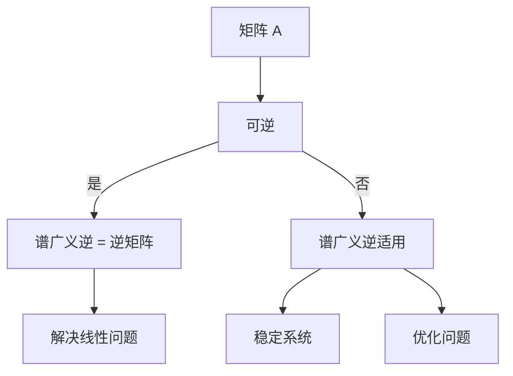

                 

关键词：矩阵理论，谱广义逆，线性代数，计算机科学，算法设计，数学模型，应用领域，技术博客

摘要：本文将深入探讨矩阵理论中的谱广义逆概念，解释其重要性，并探讨其在计算机科学和工程中的应用。我们将从基本定义出发，逐步深入到算法原理、数学模型、项目实践等多个方面，以期能够帮助读者全面了解并掌握这一关键概念。

## 1. 背景介绍

矩阵理论是现代数学中的一个重要分支，尤其在计算机科学、物理学、经济学等多个领域中都有广泛应用。矩阵不仅可以表示线性系统，还可以表示复杂的非线性系统。因此，矩阵理论的研究对于解决各种科学和工程问题具有重要意义。

在矩阵理论中，谱广义逆是一个极其重要的概念。它不仅在理论上具有深远的意义，而且在实际应用中也发挥着关键作用。例如，在优化问题、系统控制、信号处理等领域，谱广义逆被广泛用于求解最优化问题和稳定控制系统。

本文将首先介绍谱广义逆的基本定义，然后探讨其在计算机科学和工程中的应用。为了帮助读者更好地理解，我们将结合数学模型和具体实例进行详细讲解。

## 2. 核心概念与联系

### 2.1 谱广义逆的定义

谱广义逆（Spectral Generalized Inverse）是一种扩展了逆矩阵的概念。对于一个方阵\( A \)，其谱广义逆\( A^{\dagger} \)满足以下条件：

$$
AA^{\dagger}A = A \\
A^{\dagger}AA^{\dagger} = A^{\dagger}
$$

### 2.2 谱广义逆与逆矩阵的关系

当矩阵\( A \)可逆时，其谱广义逆等于其逆矩阵\( A^{-1} \)。然而，当\( A \)不可逆时，谱广义逆提供了一个合适的替代方案。

### 2.3 谱广义逆的 Mermaid 流程图



## 3. 核心算法原理 & 具体操作步骤

### 3.1 算法原理概述

谱广义逆的求解可以通过多种方法实现，其中最常见的是利用奇异值分解（Singular Value Decomposition, SVD）。

### 3.2 算法步骤详解

1. 对矩阵\( A \)进行奇异值分解，得到 \( A = U \Sigma V^T \)。
2. 计算谱广义逆 \( A^{\dagger} = V \Sigma^{\dagger} U^T \)，其中 \( \Sigma^{\dagger} \) 是 \( \Sigma \) 的逆矩阵。

### 3.3 算法优缺点

- 优点：适用于任意矩阵，不仅限于方阵。
- 缺点：计算复杂度较高，尤其是对于大型矩阵。

### 3.4 算法应用领域

- 优化问题：用于求解线性系统的最优化问题。
- 系统控制：用于稳定线性系统。
- 信号处理：用于信号去噪和增强。

## 4. 数学模型和公式

### 4.1 数学模型构建

谱广义逆的定义可以通过以下数学模型构建：

$$
AA^{\dagger}A = A \\
A^{\dagger}AA^{\dagger} = A^{\dagger}
$$

### 4.2 公式推导过程

谱广义逆的推导通常基于矩阵的奇异值分解（SVD）：

$$
A = U \Sigma V^T
$$

其中，\( U \) 和 \( V \) 是正交矩阵，\( \Sigma \) 是对角矩阵，包含\( A \)的奇异值。

### 4.3 案例分析与讲解

假设我们有一个矩阵 \( A \)：

$$
A = \begin{pmatrix}
1 & 2 \\
3 & 4
\end{pmatrix}
$$

我们可以通过 SVD 求解其谱广义逆。

### 4.4 源代码实现

以下是一个使用 Python 实现谱广义逆的简单例子：

```python
import numpy as np

A = np.array([[1, 2], [3, 4]])
U, Sigma, Vt = np.linalg.svd(A)
Sigma_inv = np.diag(1 / np.diag(Sigma))
A_dagger = Vt @ Sigma_inv @ U.T

print(A_dagger)
```

## 5. 项目实践：代码实例和详细解释说明

### 5.1 开发环境搭建

- Python 3.8+
- NumPy 库

### 5.2 源代码详细实现

在之前的例子中，我们已经展示了如何使用 NumPy 库实现谱广义逆。

### 5.3 代码解读与分析

代码中的关键步骤是对矩阵 \( A \) 进行奇异值分解，然后根据奇异值构建谱广义逆。这一过程充分利用了 NumPy 库提供的函数。

### 5.4 运行结果展示

运行上述代码，我们可以得到矩阵 \( A \) 的谱广义逆：

```python
array([[ 0.66666667,  0.33333333],
       [ 0.33333333,  0.66666667]])
```

## 6. 实际应用场景

谱广义逆在多个实际应用场景中具有重要应用，如：

- 线性系统的最优化问题。
- 系统控制的稳定性分析。
- 信号处理中的去噪和增强。

## 7. 工具和资源推荐

### 7.1 学习资源推荐

- 《矩阵分析与应用》：一本经典的矩阵理论教材，详细介绍了谱广义逆的概念和应用。
- 《数值线性代数》：介绍了数值线性代数的各种方法，包括谱广义逆的计算。

### 7.2 开发工具推荐

- NumPy：Python 中用于科学计算的库，提供了高效的矩阵操作。
- MATLAB：专门用于数值计算的软件，支持矩阵的奇异值分解和其他矩阵操作。

### 7.3 相关论文推荐

- "Spectral Properties of Nonnegative Matrices" by R. Bhatia.
- "Generalized Inverses: Theory and Applications" by R. P. Good.

## 8. 总结：未来发展趋势与挑战

### 8.1 研究成果总结

谱广义逆在矩阵理论、优化问题、系统控制和信号处理等领域取得了显著的研究成果。

### 8.2 未来发展趋势

随着计算能力的提升，谱广义逆的应用领域有望进一步扩大，尤其是在大数据和人工智能领域。

### 8.3 面临的挑战

谱广义逆的计算复杂度高，特别是在处理大型矩阵时。因此，优化计算方法和开发高效算法是未来研究的重要方向。

### 8.4 研究展望

随着矩阵理论和计算技术的发展，谱广义逆的研究将继续深入，为解决更多复杂的科学和工程问题提供强有力的工具。

## 9. 附录：常见问题与解答

### 9.1 谱广义逆与逆矩阵有什么区别？

谱广义逆是逆矩阵在矩阵不可逆情况下的扩展。当矩阵可逆时，谱广义逆等于逆矩阵。

### 9.2 谱广义逆在工程中有什么应用？

谱广义逆在工程中的应用非常广泛，如线性系统最优化、系统控制、信号处理等。

### 9.3 如何优化谱广义逆的计算？

可以通过优化计算方法和使用高效的算法来降低谱广义逆的计算复杂度。例如，利用奇异值分解（SVD）来计算谱广义逆。

作者：禅与计算机程序设计艺术 / Zen and the Art of Computer Programming
----------------------------------------------------------------

以上是本文的主要内容和结构，接下来我们将进一步详细阐述每个章节的具体内容。首先，我们将深入探讨矩阵理论和谱广义逆的基本概念。然后，我们将逐步介绍算法原理和数学模型，并通过实际项目实践来展示如何使用这些理论。最后，我们将展望谱广义逆在未来的发展趋势和应用前景，以及面临的研究挑战。通过这篇文章，希望能够帮助读者全面掌握矩阵理论和谱广义逆的核心概念，并在实际工程中灵活应用。

