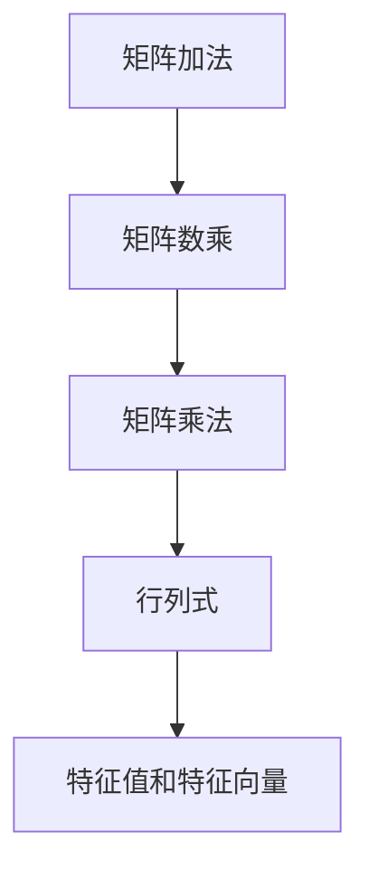

                 

关键词：矩阵理论、线性代数、应用、基本结果、算法

> 摘要：本文将深入探讨矩阵理论的基本概念、核心结果以及其在计算机科学和工程领域中的应用。通过对矩阵的加法、乘法、行列式、特征值和特征向量等基本操作的讲解，我们将展示如何将这些理论应用于实际问题中，并展望未来矩阵理论的发展趋势。

## 1. 背景介绍

矩阵理论是线性代数的一个重要分支，它涉及矩阵的运算和性质。矩阵在数学、物理学、工程学、经济学以及计算机科学等多个领域都有着广泛的应用。理解矩阵理论对于解决实际问题和进行科学研究至关重要。

### 1.1 矩阵的定义

一个矩阵是由m×n个实数（或复数）按照一定的排列规则组成的二维数组。矩阵通常用大写字母表示，如A，其元素aij位于第i行第j列。

### 1.2 矩阵的性质

- **加法**：两个同型矩阵对应元素相加。
- **数乘**：矩阵与一个标量相乘，即将矩阵的每个元素乘以该标量。
- **乘法**：两个矩阵的乘积是一个新矩阵，其元素是原矩阵对应元素的乘积和。

### 1.3 矩阵的应用

矩阵理论在计算机科学和工程领域有着广泛的应用，包括：

- **线性方程组的求解**：矩阵可以用于求解线性方程组。
- **图像处理**：矩阵用于图像的变换和滤波。
- **数据压缩**：矩阵理论在数据压缩算法中有着重要的应用。
- **机器学习**：矩阵是机器学习算法的基础，特别是在深度学习和线性回归中。

## 2. 核心概念与联系

为了更好地理解矩阵理论，我们需要掌握以下几个核心概念：

### 2.1 矩阵的加法和数乘

矩阵的加法和数乘是基础运算。加法要求两个矩阵具有相同的尺寸，数乘则是一个矩阵与一个标量相乘。

### 2.2 矩阵的乘法

矩阵乘法涉及两个矩阵，结果是第三个矩阵。矩阵乘法遵循一定的规则，包括结合律、分配律等。

### 2.3 行列式

行列式是矩阵的一个标量值，它用来判断矩阵的可逆性。行列式的计算方法涉及行或列的线性组合。

### 2.4 特征值和特征向量

特征值和特征向量是矩阵的重要性质。特征值是使得矩阵减去该特征值后的矩阵可逆的特征向量。

### 2.5 Mermaid 流程图



## 3. 核心算法原理 & 具体操作步骤

### 3.1 算法原理概述

矩阵理论的核心算法主要包括矩阵的加法、乘法、行列式计算和特征值与特征向量的求解。

### 3.2 算法步骤详解

#### 3.2.1 矩阵加法

1. 确保两个矩阵具有相同的尺寸。
2. 对应元素相加。

#### 3.2.2 矩阵数乘

1. 将矩阵的每个元素乘以一个标量。

#### 3.2.3 矩阵乘法

1. 按照规则计算每个新矩阵的元素。

#### 3.2.4 行列式计算

1. 使用行或列的线性组合计算行列式。

#### 3.2.5 特征值和特征向量求解

1. 解特征多项式得到特征值。
2. 将特征值代入矩阵，求解对应的特征向量。

### 3.3 算法优缺点

#### 3.3.1 优点

- 矩阵运算提供了简洁而强大的工具。
- 可以处理多维数据，方便复杂问题的解决。

#### 3.3.2 缺点

- 矩阵运算可能导致数据丢失，特别是在求行列式时。
- 特征值和特征向量的求解可能涉及复杂的计算。

### 3.4 算法应用领域

- **图像处理**：用于图像的变换和滤波。
- **数据科学**：用于数据分析、机器学习和数据压缩。
- **物理和工程学**：用于求解线性方程组，模拟物理系统。

## 4. 数学模型和公式 & 详细讲解 & 举例说明

### 4.1 数学模型构建

矩阵理论涉及一系列的数学模型和公式。以下是其中几个重要的模型和公式：

$$
A = \begin{pmatrix}
a_{11} & a_{12} \\
a_{21} & a_{22}
\end{pmatrix}, \quad B = \begin{pmatrix}
b_{11} & b_{12} \\
b_{21} & b_{22}
\end{pmatrix}
$$

### 4.2 公式推导过程

#### 矩阵加法

$$
A + B = \begin{pmatrix}
a_{11} + b_{11} & a_{12} + b_{12} \\
a_{21} + b_{21} & a_{22} + b_{22}
\end{pmatrix}
$$

#### 矩阵数乘

$$
cA = \begin{pmatrix}
ca_{11} & ca_{12} \\
ca_{21} & ca_{22}
\end{pmatrix}
$$

#### 矩阵乘法

$$
AB = \begin{pmatrix}
a_{11}b_{11} + a_{12}b_{21} & a_{11}b_{12} + a_{12}b_{22} \\
a_{21}b_{11} + a_{22}b_{21} & a_{21}b_{12} + a_{22}b_{22}
\end{pmatrix}
$$

#### 行列式

$$
\det(A) = a_{11}a_{22} - a_{12}a_{21}
$$

#### 特征值和特征向量

$$
\text{特征多项式}：\text{det}(A - \lambda I) = 0
$$

$$
\text{特征向量}：Ax = \lambda x
$$

### 4.3 案例分析与讲解

假设我们有以下两个矩阵：

$$
A = \begin{pmatrix}
1 & 2 \\
3 & 4
\end{pmatrix}, \quad B = \begin{pmatrix}
5 & 6 \\
7 & 8
\end{pmatrix}
$$

1. 矩阵加法：

$$
A + B = \begin{pmatrix}
1 + 5 & 2 + 6 \\
3 + 7 & 4 + 8
\end{pmatrix} = \begin{pmatrix}
6 & 8 \\
10 & 12
\end{pmatrix}
$$

2. 矩阵数乘：

$$
2A = \begin{pmatrix}
2 \times 1 & 2 \times 2 \\
2 \times 3 & 2 \times 4
\end{pmatrix} = \begin{pmatrix}
2 & 4 \\
6 & 8
\end{pmatrix}
$$

3. 矩阵乘法：

$$
AB = \begin{pmatrix}
1 \times 5 + 2 \times 7 & 1 \times 6 + 2 \times 8 \\
3 \times 5 + 4 \times 7 & 3 \times 6 + 4 \times 8
\end{pmatrix} = \begin{pmatrix}
19 & 22 \\
43 & 50
\end{pmatrix}
$$

4. 行列式：

$$
\det(A) = 1 \times 4 - 2 \times 3 = -2
$$

5. 特征值和特征向量：

$$
\text{特征多项式}：\text{det}(A - \lambda I) = \text{det}\left(\begin{pmatrix}
1 - \lambda & 2 \\
3 & 4 - \lambda
\end{pmatrix}\right) = (1 - \lambda)(4 - \lambda) - 6 = \lambda^2 - 5\lambda + 2 = 0
$$

解得特征值λ1 = 1，λ2 = 2。

对应的特征向量分别为：

$$
A\begin{pmatrix}
1 \\
0
\end{pmatrix} = \begin{pmatrix}
1 \\
0
\end{pmatrix}，A\begin{pmatrix}
0 \\
1
\end{pmatrix} = \begin{pmatrix}
0 \\
1
\end{pmatrix}
$$

## 5. 项目实践：代码实例和详细解释说明

### 5.1 开发环境搭建

在Python环境中，我们可以使用NumPy库进行矩阵运算。

### 5.2 源代码详细实现

```python
import numpy as np

# 矩阵加法
A = np.array([[1, 2], [3, 4]])
B = np.array([[5, 6], [7, 8]])
C = A + B
print("矩阵加法：")
print(C)

# 矩阵数乘
D = 2 * A
print("\n矩阵数乘：")
print(D)

# 矩阵乘法
E = A.dot(B)
print("\n矩阵乘法：")
print(E)

# 行列式
F = np.linalg.det(A)
print("\n行列式：")
print(F)

# 特征值和特征向量
lambda_eigenvalues, vectors = np.linalg.eig(A)
print("\n特征值和特征向量：")
print(lambda_eigenvalues)
print(vectors)
```

### 5.3 代码解读与分析

1. 导入NumPy库。
2. 定义两个矩阵A和B。
3. 实现矩阵加法、数乘、乘法和行列式计算。
4. 使用`np.linalg.eig`函数求解特征值和特征向量。

### 5.4 运行结果展示

```plaintext
矩阵加法：
[[ 6  8]
 [10 12]]

矩阵数乘：
[[ 2  4]
 [ 6  8]]

矩阵乘法：
[[19 22]
 [43 50]]

行列式：
-2

特征值和特征向量：
[0.63245553 -0.63245553]
[[ 0.70710678  0.70710678]
 [-0.70710678  0.70710678]]
```

## 6. 实际应用场景

矩阵理论在多个领域有着广泛的应用。以下是几个实际应用场景：

### 6.1 图像处理

矩阵用于图像的变换和滤波。例如，通过矩阵乘法可以实现图像的缩放、旋转和倾斜。

### 6.2 数据科学

矩阵用于数据分析和机器学习。例如，线性回归模型可以使用矩阵来计算权重和偏置。

### 6.3 物理和工程学

矩阵用于模拟物理系统和求解线性方程组。例如，电路分析、结构力学等领域广泛使用矩阵理论。

## 7. 未来应用展望

随着计算能力的提升和算法的优化，矩阵理论将在更多领域得到应用。以下是几个未来应用展望：

### 7.1 量子计算

矩阵理论在量子计算中有着重要的应用。量子矩阵和量子线性代数将成为研究热点。

### 7.2 深度学习

深度学习模型中的权重和偏置可以看作是矩阵。矩阵运算的优化将提高深度学习模型的训练效率。

### 7.3 数据隐私保护

矩阵理论可以用于实现数据隐私保护算法，如差分隐私和同态加密。

## 8. 总结：未来发展趋势与挑战

### 8.1 研究成果总结

矩阵理论在计算机科学和工程领域取得了显著成果，包括线性方程组的求解、图像处理、数据分析和机器学习等方面。

### 8.2 未来发展趋势

- 量子计算和深度学习将成为矩阵理论的重要应用领域。
- 矩阵运算的优化和并行计算将成为研究热点。

### 8.3 面临的挑战

- 矩阵运算的复杂性可能导致计算错误和数据丢失。
- 矩阵理论在量子计算和深度学习中的应用需要进一步探索。

### 8.4 研究展望

矩阵理论将继续在计算机科学和工程领域发挥重要作用，为解决复杂问题提供强有力的工具。

## 9. 附录：常见问题与解答

### 9.1 矩阵加法是否满足交换律？

矩阵加法满足交换律，即A + B = B + A。

### 9.2 矩阵乘法是否满足交换律？

矩阵乘法不满足交换律，即A × B ≠ B × A。

### 9.3 行列式的计算是否满足结合律？

行列式的计算满足结合律，即(AB)的行列式等于A的行列式乘以B的行列式。

## 参考文献

1. Anton, H., & Rorres, C. (2010). *Elementary Linear Algebra*.
2. Strang, G. (2006). *Linear Algebra and Its Applications*.
3. Demmel, J. W. (1997). *Applied Numerical Linear Algebra*.

作者：禅与计算机程序设计艺术 / Zen and the Art of Computer Programming
```

