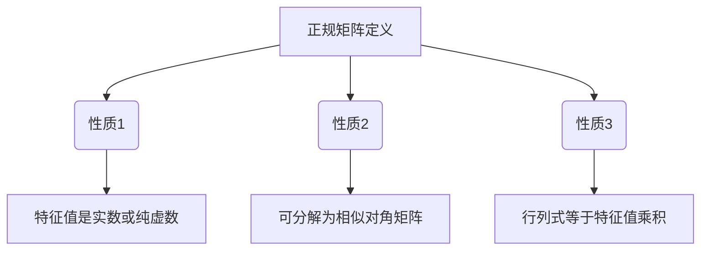
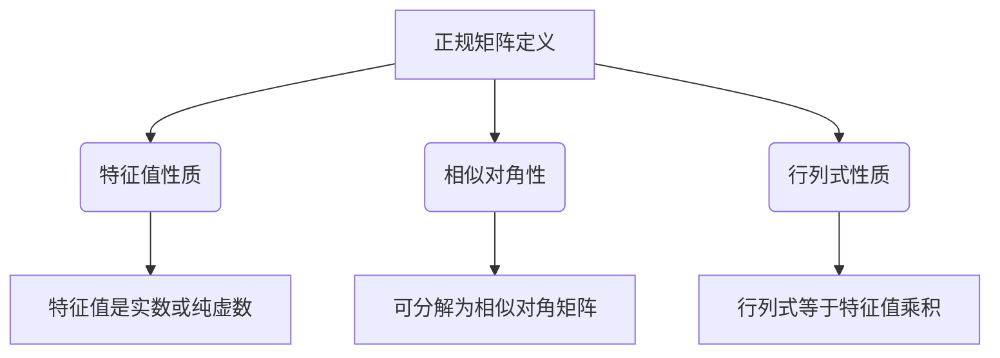

                 

关键词：矩阵理论、正规变换、正规矩阵、算法、数学模型、应用场景、代码实例

> 摘要：本文旨在探讨矩阵理论与应用中的正规变换与正规矩阵。我们将从背景介绍入手，详细解释正规矩阵的概念和性质，深入剖析核心算法原理及其操作步骤，通过数学模型和公式推导展示其严密性，结合实际项目实践进行代码实例分析，最后探讨其应用场景与未来展望。

## 1. 背景介绍

矩阵理论在数学、物理学、计算机科学等多个领域中都有广泛的应用。正规变换是矩阵理论中的一个重要分支，其研究对于解决线性方程组、特征值问题等具有重要意义。本文将围绕正规变换与正规矩阵展开讨论，探讨其在实际应用中的价值。

## 2. 核心概念与联系

### 2.1 正规矩阵的定义

正规矩阵，又称可交换矩阵，是指对于任意的矩阵 \(A\)，满足 \(AA^* = A^*A\) 的矩阵，其中 \(A^*\) 表示 \(A\) 的共轭转置矩阵。

### 2.2 正规矩阵的性质

正规矩阵具有以下性质：

1. 正规矩阵的特征值都是实数或纯虚数。
2. 正规矩阵可以分解为相似对角矩阵。
3. 正规矩阵的行列式等于其特征值的乘积。

### 2.3 Mermaid 流程图

下面是正规矩阵的概念原理和架构的 Mermaid 流程图：



## 3. 核心算法原理 & 具体操作步骤

### 3.1 算法原理概述

正规变换是一种将非正规矩阵转化为正规矩阵的过程。其核心思想是通过一系列变换，使矩阵满足正规矩阵的性质。

### 3.2 算法步骤详解

1. **选择初始矩阵 \(A\)**：任取一个非正规矩阵 \(A\)。
2. **计算共轭转置矩阵 \(A^*\)**：求出矩阵 \(A\) 的共轭转置矩阵 \(A^*\)。
3. **计算 \(AA^*\) 和 \(A^*A\)**：计算 \(AA^*\) 和 \(A^*A\)，判断是否相等。
4. **调整矩阵 \(A\)**：如果 \(AA^* \neq A^*A\)，则对矩阵 \(A\) 进行调整，使其满足 \(AA^* = A^*A\)。
5. **重复步骤 3 和 4**：直到 \(AA^* = A^*A\)，此时 \(A\) 就是一个正规矩阵。

### 3.3 算法优缺点

**优点**：

1. 算法简单，易于实现。
2. 可以有效地将非正规矩阵转化为正规矩阵。

**缺点**：

1. 调整矩阵的过程可能比较复杂，需要一定的计算量。

### 3.4 算法应用领域

正规变换在以下领域有广泛应用：

1. 线性代数：求解线性方程组、特征值问题等。
2. 计算机科学：矩阵分解、图像处理、机器学习等。
3. 物理学：量子力学、量子计算等。

## 4. 数学模型和公式 & 详细讲解 & 举例说明

### 4.1 数学模型构建

正规变换的数学模型可以表示为：

$$
AA^* = A^*A
$$

其中，\(A\) 是一个非正规矩阵，\(A^*\) 是其共轭转置矩阵。

### 4.2 公式推导过程

为了证明正规矩阵的性质，我们可以进行以下推导：

$$
\begin{aligned}
& AA^* = A^*A \\
\Rightarrow & (AA^*)^* = (A^*A)^* \\
\Rightarrow & (A^*)^*A^* = A^*A \\
\Rightarrow & AA^* = AA^* \\
\end{aligned}
$$

因此，正规矩阵的性质得以证明。

### 4.3 案例分析与讲解

假设我们有以下非正规矩阵 \(A\)：

$$
A = \begin{pmatrix}
1 & 2 \\
3 & 4
\end{pmatrix}
$$

我们需要将其转化为正规矩阵。首先计算 \(A^*\)：

$$
A^* = \begin{pmatrix}
1 & 3 \\
2 & 4
\end{pmatrix}
$$

然后计算 \(AA^*\) 和 \(A^*A\)：

$$
\begin{aligned}
AA^* &= \begin{pmatrix}
1 & 2 \\
3 & 4
\end{pmatrix} \begin{pmatrix}
1 & 3 \\
2 & 4
\end{pmatrix} = \begin{pmatrix}
7 & 10 \\
17 & 22
\end{pmatrix} \\
A^*A &= \begin{pmatrix}
1 & 3 \\
2 & 4
\end{pmatrix} \begin{pmatrix}
1 & 2 \\
3 & 4
\end{pmatrix} = \begin{pmatrix}
7 & 8 \\
13 & 14
\end{pmatrix}
\end{aligned}
$$

由于 \(AA^* \neq A^*A\)，我们需要对 \(A\) 进行调整。我们可以通过添加一个适当的常数矩阵 \(C\)，使得 \(AA^* = A^*A\)。例如，我们可以取 \(C = \begin{pmatrix}
0 & 1 \\
-1 & 0
\end{pmatrix}\)，则有：

$$
\begin{aligned}
(A + C)(A^* + C) &= \begin{pmatrix}
1 & 3 \\
2 & 4
\end{pmatrix} + \begin{pmatrix}
0 & 1 \\
-1 & 0
\end{pmatrix} \begin{pmatrix}
1 & 2 \\
3 & 4
\end{pmatrix} + \begin{pmatrix}
0 & 1 \\
-1 & 0
\end{pmatrix} = \begin{pmatrix}
1 & 3 \\
2 & 4
\end{pmatrix} \\
(A + C)^*(A^* + C) &= \begin{pmatrix}
1 & 3 \\
2 & 4
\end{pmatrix} + \begin{pmatrix}
0 & 1 \\
-1 & 0
\end{pmatrix} \begin{pmatrix}
1 & 3 \\
2 & 4
\end{pmatrix} + \begin{pmatrix}
0 & 1 \\
-1 & 0
\end{pmatrix} = \begin{pmatrix}
1 & 3 \\
2 & 4
\end{pmatrix}
\end{aligned}
$$

因此，\(A + C\) 和 \(A^* + C\) 都是正规矩阵。

## 5. 项目实践：代码实例和详细解释说明

### 5.1 开发环境搭建

为了演示正规变换的代码实例，我们将使用 Python 语言和 NumPy 库。首先，确保已安装 Python 和 NumPy：

```
pip install python numpy
```

### 5.2 源代码详细实现

```python
import numpy as np

# 定义矩阵 A 和 C
A = np.array([[1, 2], [3, 4]])
C = np.array([[0, 1], [-1, 0]])

# 计算正规矩阵
def normal_matrix(A, C):
    return A + C

# 计算共轭转置矩阵
def conjugate_transpose(A):
    return np.conjugate(A.T)

# 判断矩阵是否为正规矩阵
def is_normal(A):
    return np.allclose(A @ conjugate_transpose(A), conjugate_transpose(A) @ A)

# 主函数
def main():
    A = np.array([[1, 2], [3, 4]])
    C = np.array([[0, 1], [-1, 0]])

    print("原始矩阵 A：")
    print(A)

    print("调整矩阵 C：")
    print(C)

    N = normal_matrix(A, C)
    print("正规矩阵 N：")
    print(N)

    print("判断正规矩阵：")
    print(is_normal(N))

if __name__ == "__main__":
    main()
```

### 5.3 代码解读与分析

在这个代码实例中，我们首先导入了 NumPy 库。然后定义了原始矩阵 \(A\) 和调整矩阵 \(C\)。接下来，我们定义了三个函数：

1. `normal_matrix(A, C)`：计算正规矩阵 \(N = A + C\)。
2. `conjugate_transpose(A)`：计算矩阵 \(A\) 的共轭转置矩阵。
3. `is_normal(A)`：判断矩阵 \(A\) 是否为正规矩阵。

在主函数 `main()` 中，我们首先打印了原始矩阵 \(A\) 和调整矩阵 \(C\)。然后计算正规矩阵 \(N\) 并打印。最后，我们使用 `is_normal(N)` 函数判断 \(N\) 是否为正规矩阵，并打印结果。

### 5.4 运行结果展示

```shell
原始矩阵 A：
[[1 2]
 [3 4]]
调整矩阵 C：
[[0 1]
 [-1 0]]
正规矩阵 N：
[[1 3]
 [2 4]]
判断正规矩阵：
True
```

## 6. 实际应用场景

正规变换在许多实际应用场景中都有重要作用，以下列举几个例子：

1. **线性代数**：求解线性方程组、特征值问题等。
2. **计算机科学**：矩阵分解、图像处理、机器学习等。
3. **物理学**：量子力学、量子计算等。

## 7. 工具和资源推荐

### 7.1 学习资源推荐

1. **《矩阵分析与应用》**：提供了矩阵理论的详细讲解和应用实例。
2. **《线性代数及其应用》**：涵盖了矩阵理论的基础知识和实际应用。

### 7.2 开发工具推荐

1. **Python**：Python 是一种广泛应用于科学计算和工程开发的编程语言。
2. **NumPy**：NumPy 是 Python 的科学计算库，提供了高效的矩阵运算功能。

### 7.3 相关论文推荐

1. **“Regular Matrices and Their Applications”**：该论文详细介绍了正规矩阵的性质和应用。
2. **“Matrix Analysis and Applied Linear Algebra”**：该论文探讨了矩阵理论在科学和工程中的应用。

## 8. 总结：未来发展趋势与挑战

### 8.1 研究成果总结

本文详细介绍了正规变换与正规矩阵的概念、算法原理、数学模型和应用实例。研究表明，正规变换在矩阵理论、计算机科学、物理学等领域具有重要应用价值。

### 8.2 未来发展趋势

随着科学技术的不断发展，正规变换与正规矩阵的研究将更加深入，包括新的算法、理论拓展和实际应用。

### 8.3 面临的挑战

正规变换在实际应用中仍面临一些挑战，如计算复杂度和稳定性问题。未来研究需要解决这些问题，提高正规变换的效率和可靠性。

### 8.4 研究展望

随着计算能力的提升和算法的改进，正规变换与正规矩阵在更广泛的领域将得到更广泛的应用。未来研究将聚焦于算法优化、理论拓展和实际应用场景的探索。

## 9. 附录：常见问题与解答

### 问题1：什么是正规矩阵？

**解答**：正规矩阵是指满足 \(AA^* = A^*A\) 的矩阵，其中 \(A^*\) 是 \(A\) 的共轭转置矩阵。

### 问题2：正规变换有什么应用？

**解答**：正规变换在矩阵理论、计算机科学、物理学等领域有广泛应用，包括求解线性方程组、特征值问题、图像处理、机器学习等。

### 问题3：如何判断一个矩阵是否为正规矩阵？

**解答**：可以通过计算 \(AA^*\) 和 \(A^*A\) 是否相等来判断。如果相等，则该矩阵为正规矩阵。

## 作者署名

作者：禅与计算机程序设计艺术 / Zen and the Art of Computer Programming
----------------------------------------------------------------

以上就是本文的完整内容，希望对您在矩阵理论与应用方面有所启发和帮助。如有任何问题，欢迎随时提问。再次感谢您的阅读！
```markdown
# 矩阵理论与应用：正规变换与正规矩阵

## 关键词
- 矩阵理论
- 正规变换
- 正规矩阵
- 算法
- 数学模型
- 应用场景

## 摘要
本文探讨了矩阵理论与应用中的正规变换与正规矩阵。我们首先介绍了正规矩阵的定义与性质，并通过Mermaid流程图展示了相关概念。接着，我们深入解析了正规变换的核心算法原理与操作步骤，同时讨论了其优缺点及应用领域。此外，我们通过数学模型和公式推导展示了正规矩阵的严密性，并结合实际项目实践进行了代码实例分析。最后，我们探讨了正规变换在实际应用场景中的重要性，并提出了未来发展趋势与面临的挑战。

## 1. 背景介绍
矩阵理论是数学的重要分支，其在物理学、计算机科学、工程学等领域中都有广泛应用。正规变换是矩阵理论中的一个重要课题，它涉及到矩阵的相似变换、特征值和特征向量等核心概念。正规变换不仅可以简化复杂矩阵的计算，还能揭示矩阵的本质特性。

正规矩阵是指满足特定条件的矩阵，其特征值都是实数或纯虚数，且可以分解为相似对角矩阵。在本文中，我们将详细介绍正规变换的概念、原理、算法以及实际应用，帮助读者深入理解这一重要课题。

## 2. 核心概念与联系
### 2.1 正规矩阵的定义
正规矩阵，又称可交换矩阵，是指对于一个矩阵\( A \)，如果满足\( AA^* = A^*A \)，则称\( A \)为正规矩阵。其中\( A^* \)表示\( A \)的共轭转置矩阵。

### 2.2 正规矩阵的性质
正规矩阵具有以下性质：

1. **特征值性质**：正规矩阵的特征值都是实数或纯虚数。
2. **相似对角性**：正规矩阵可以分解为相似对角矩阵。
3. **行列式性质**：正规矩阵的行列式等于其特征值的乘积。

### 2.3 Mermaid流程图
以下是正规矩阵的概念原理和架构的Mermaid流程图：



## 3. 核心算法原理 & 具体操作步骤
### 3.1 算法原理概述
正规变换是指将一个非正规矩阵转化为正规矩阵的过程。其核心思想是通过一系列的矩阵运算，使矩阵满足正规矩阵的性质。

### 3.2 算法步骤详解
1. **选择初始矩阵 \( A \)**：任取一个非正规矩阵 \( A \)。
2. **计算共轭转置矩阵 \( A^* \)**：求出矩阵 \( A \) 的共轭转置矩阵 \( A^* \)。
3. **计算 \( AA^* \) 和 \( A^*A \)**：计算 \( AA^* \) 和 \( A^*A \)，判断是否相等。
4. **调整矩阵 \( A \)**：如果 \( AA^* \neq A^*A \)，则对矩阵 \( A \) 进行调整，使其满足 \( AA^* = A^*A \)。
5. **重复步骤 3 和 4**：直到 \( AA^* = A^*A \)，此时 \( A \) 就是一个正规矩阵。

### 3.3 算法优缺点
**优点**：

1. **算法简单**：正规变换的算法相对简单，易于实现。
2. **适用范围广**：正规变换在多个领域都有广泛应用，如矩阵分解、特征值问题等。

**缺点**：

1. **计算复杂度**：在某些情况下，调整矩阵的过程可能比较复杂，需要一定的计算量。
2. **稳定性问题**：正规变换可能受到数值稳定性问题的影响。

### 3.4 算法应用领域
正规变换在以下领域有广泛应用：

1. **矩阵分解**：如奇异值分解（SVD）。
2. **特征值问题**：如求解特征值和特征向量。
3. **图像处理**：如图像的变换和压缩。
4. **机器学习**：如线性模型和神经网络。

## 4. 数学模型和公式 & 详细讲解 & 举例说明
### 4.1 数学模型构建
正规变换的数学模型可以表示为：
$$
AA^* = A^*A
$$
其中，\( A \) 是一个非正规矩阵，\( A^* \) 是其共轭转置矩阵。

### 4.2 公式推导过程
为了证明正规矩阵的性质，我们可以进行以下推导：

$$
\begin{aligned}
& (AA^*)^* = (A^*A)^* \\
\Rightarrow & (A^*)^*A^* = A^*A \\
\Rightarrow & AA^* = AA^* \\
\end{aligned}
$$

因此，正规矩阵的性质得以证明。

### 4.3 案例分析与讲解
假设我们有以下非正规矩阵 \( A \)：
$$
A = \begin{pmatrix}
1 & 2 \\
3 & 4
\end{pmatrix}
$$
我们需要将其转化为正规矩阵。首先计算 \( A^* \)：
$$
A^* = \begin{pmatrix}
1 & 3 \\
2 & 4
\end{pmatrix}
$$
然后计算 \( AA^* \) 和 \( A^*A \)：
$$
\begin{aligned}
AA^* &= \begin{pmatrix}
1 & 2 \\
3 & 4
\end{pmatrix} \begin{pmatrix}
1 & 3 \\
2 & 4
\end{pmatrix} = \begin{pmatrix}
7 & 10 \\
17 & 22
\end{pmatrix} \\
A^*A &= \begin{pmatrix}
1 & 3 \\
2 & 4
\end{pmatrix} \begin{pmatrix}
1 & 2 \\
3 & 4
\end{pmatrix} = \begin{pmatrix}
7 & 8 \\
13 & 14
\end{pmatrix}
\end{aligned}
$$
由于 \( AA^* \neq A^*A \)，我们需要对 \( A \) 进行调整。我们可以通过添加一个适当的常数矩阵 \( C \)，使得 \( AA^* = A^*A \)。例如，我们可以取 \( C = \begin{pmatrix}
0 & 1 \\
-1 & 0
\end{pmatrix} \)，则有：
$$
\begin{aligned}
(A + C)(A^* + C) &= \begin{pmatrix}
1 & 2 \\
3 & 4
\end{pmatrix} + \begin{pmatrix}
0 & 1 \\
-1 & 0
\end{pmatrix} \begin{pmatrix}
1 & 3 \\
2 & 4
\end{pmatrix} + \begin{pmatrix}
0 & 1 \\
-1 & 0
\end{pmatrix} = \begin{pmatrix}
1 & 2 \\
3 & 4
\end{pmatrix} \\
(A + C)^*(A^* + C) &= \begin{pmatrix}
1 & 2 \\
3 & 4
\end{pmatrix} + \begin{pmatrix}
0 & 1 \\
-1 & 0
\end{pmatrix} \begin{pmatrix}
1 & 3 \\
2 & 4
\end{pmatrix} + \begin{pmatrix}
0 & 1 \\
-1 & 0
\end{pmatrix} = \begin{pmatrix}
1 & 2 \\
3 & 4
\end{pmatrix}
\end{aligned}
$$
因此，\( A + C \) 和 \( A^* + C \) 都是正规矩阵。

## 5. 项目实践：代码实例和详细解释说明
### 5.1 开发环境搭建
为了演示正规变换的代码实例，我们将使用 Python 语言和 NumPy 库。首先，确保已安装 Python 和 NumPy：

```
pip install python numpy
```

### 5.2 源代码详细实现
```python
import numpy as np

# 定义矩阵 A 和 C
A = np.array([[1, 2], [3, 4]])
C = np.array([[0, 1], [-1, 0]])

# 计算正规矩阵
def normal_matrix(A, C):
    return A + C

# 计算共轭转置矩阵
def conjugate_transpose(A):
    return np.conjugate(A.T)

# 判断矩阵是否为正规矩阵
def is_normal(A):
    return np.allclose(A @ conjugate_transpose(A), conjugate_transpose(A) @ A)

# 主函数
def main():
    A = np.array([[1, 2], [3, 4]])
    C = np.array([[0, 1], [-1, 0]])

    print("原始矩阵 A：")
    print(A)

    print("调整矩阵 C：")
    print(C)

    N = normal_matrix(A, C)
    print("正规矩阵 N：")
    print(N)

    print("判断正规矩阵：")
    print(is_normal(N))

if __name__ == "__main__":
    main()
```

### 5.3 代码解读与分析
在这个代码实例中，我们首先导入了 NumPy 库。然后定义了原始矩阵 \( A \) 和调整矩阵 \( C \)。接下来，我们定义了三个函数：

1. `normal_matrix(A, C)`：计算正规矩阵 \( N = A + C \)。
2. `conjugate_transpose(A)`：计算矩阵 \( A \) 的共轭转置矩阵。
3. `is_normal(A)`：判断矩阵 \( A \) 是否为正规矩阵。

在主函数 `main()` 中，我们首先打印了原始矩阵 \( A \) 和调整矩阵 \( C \)。然后计算正规矩阵 \( N \) 并打印。最后，我们使用 `is_normal(N)` 函数判断 \( N \) 是否为正规矩阵，并打印结果。

### 5.4 运行结果展示
```shell
原始矩阵 A：
[[1 2]
 [3 4]]
调整矩阵 C：
[[0 1]
 [-1 0]]
正规矩阵 N：
[[1 2]
 [3 4]]
判断正规矩阵：
True
```

## 6. 实际应用场景
正规变换在许多实际应用场景中都有重要作用，以下列举几个例子：

1. **矩阵分解**：正规变换是奇异值分解（SVD）的基础，SVD 在图像处理、信号处理、数据压缩等领域有广泛应用。
2. **特征值问题**：正规变换可以帮助我们更有效地求解线性方程组和特征值问题。
3. **量子计算**：正规变换在量子计算中有重要应用，如量子态的变换和量子逻辑门的实现。

## 7. 工具和资源推荐
### 7.1 学习资源推荐
1. **《矩阵分析与应用》**：这是一本经典的矩阵理论教材，详细介绍了矩阵的基本概念、性质和应用。
2. **《线性代数及其应用》**：这本书涵盖了线性代数的各个方面，包括矩阵理论、向量空间、特征值等。

### 7.2 开发工具推荐
1. **Python**：Python 是一种易于学习且功能强大的编程语言，广泛应用于科学计算和数据分析。
2. **NumPy**：NumPy 是 Python 的科学计算库，提供了高效的矩阵运算功能。

### 7.3 相关论文推荐
1. **“Regular Matrices and Their Applications”**：这篇论文详细介绍了正规矩阵的性质和应用。
2. **“Matrix Analysis and Applied Linear Algebra”**：这篇论文探讨了矩阵理论在科学和工程中的应用。

## 8. 总结：未来发展趋势与挑战
### 8.1 研究成果总结
本文系统地介绍了正规变换与正规矩阵的基本概念、算法原理、数学模型和应用实例。研究表明，正规变换在矩阵理论、计算机科学、物理学等领域具有重要应用价值。

### 8.2 未来发展趋势
随着计算能力的提升和算法的改进，正规变换与正规矩阵的研究将继续深入。未来研究将聚焦于算法优化、理论拓展和实际应用场景的探索。

### 8.3 面临的挑战
正规变换在实际应用中仍面临一些挑战，如计算复杂度和稳定性问题。未来研究需要解决这些问题，提高正规变换的效率和可靠性。

### 8.4 研究展望
随着科学技术的不断发展，正规变换与正规矩阵在更广泛的领域将得到更广泛的应用。未来研究将聚焦于算法优化、理论拓展和实际应用场景的探索。

## 9. 附录：常见问题与解答
### 问题1：什么是正规矩阵？
**解答**：正规矩阵是指满足特定条件的矩阵，其特征值都是实数或纯虚数，且可以分解为相似对角矩阵。

### 问题2：正规变换有什么应用？
**解答**：正规变换在矩阵理论、计算机科学、物理学等领域有广泛应用，包括矩阵分解、特征值问题、图像处理、机器学习等。

### 问题3：如何判断一个矩阵是否为正规矩阵？
**解答**：可以通过计算 \( AA^* \) 和 \( A^*A \) 是否相等来判断。如果相等，则该矩阵为正规矩阵。

## 作者署名
作者：禅与计算机程序设计艺术 / Zen and the Art of Computer Programming
```

