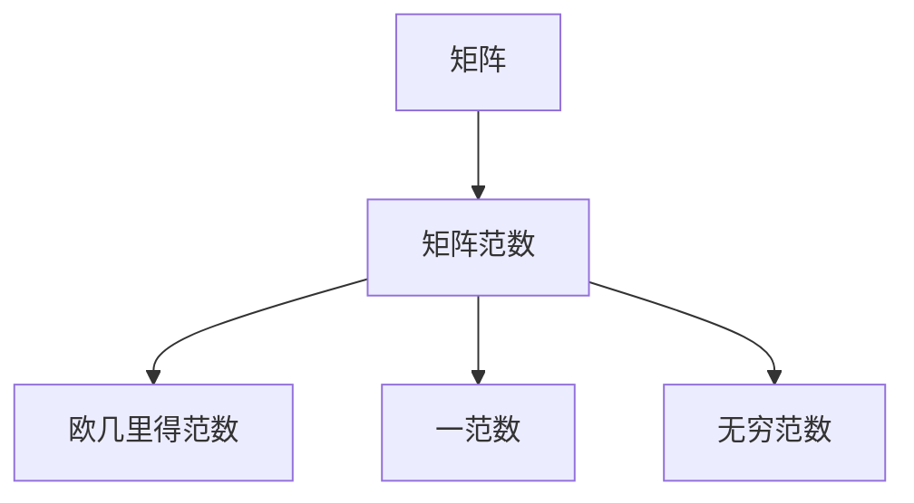
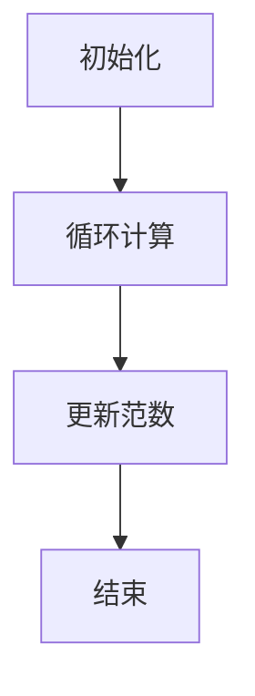

                 

关键词：矩阵理论，矩阵范数，线性代数，数学模型，算法原理，编程实例，应用领域

摘要：本文旨在深入探讨矩阵理论与矩阵范数这一核心概念。通过梳理矩阵理论的基本概念和矩阵范数的定义与性质，本文将详细介绍矩阵范数在计算机科学和工程领域的广泛应用。此外，本文还将通过具体的数学模型和公式推导，配合代码实例，展示矩阵范数在实际编程中的具体应用。最后，本文将对矩阵范数在未来的发展趋势和挑战进行展望。

## 1. 背景介绍

矩阵理论是线性代数中的重要组成部分，广泛应用于数学、物理学、计算机科学、工程学等多个领域。矩阵不仅可以表示线性变换，还可以用于解决许多实际问题，如图像处理、信号处理、优化问题等。矩阵范数是矩阵理论中一个重要的概念，它为矩阵提供了“大小”的度量，使得我们可以对矩阵进行一系列的数学运算和分析。

本文将围绕矩阵范数这一主题，首先介绍矩阵的基本概念和性质，然后详细讨论矩阵范数的定义与性质，接着分析矩阵范数在不同应用领域的实际应用，并通过具体的数学模型和代码实例进行讲解。最后，本文将对矩阵范数的研究现状和未来发展趋势进行总结和展望。

## 2. 核心概念与联系

### 2.1 矩阵的基本概念

矩阵是由数字排列成的矩形阵列，用大写字母表示。一个\( m \times n \)的矩阵\( A \)由\( m \)行和\( n \)列的元素组成，通常表示为：

\[ A = \begin{bmatrix} 
a_{11} & a_{12} & \cdots & a_{1n} \\
a_{21} & a_{22} & \cdots & a_{2n} \\
\vdots & \vdots & \ddots & \vdots \\
a_{m1} & a_{m2} & \cdots & a_{mn} 
\end{bmatrix} \]

矩阵的元素可以通过下标来访问，例如，\( a_{ij} \)表示矩阵\( A \)的第\( i \)行第\( j \)列的元素。

### 2.2 矩阵的性质

矩阵具有以下几个基本性质：

- 矩阵的行数等于列数时，称为方阵。
- 矩阵的行数等于1时，称为行矩阵；列数等于1时，称为列矩阵。
- 矩阵的转置是将矩阵的行和列互换位置。
- 矩阵的逆是使得与其相乘后结果为单位矩阵的矩阵。

### 2.3 矩阵范数的定义与联系

矩阵范数是矩阵理论中的一个重要概念，用于度量矩阵的大小。设\( A \)是一个\( m \times n \)的矩阵，其矩阵范数通常定义为：

\[ \|A\| = \sup_{x \neq 0} \frac{\|Ax\|}{\|x\|} \]

其中，\( \| \cdot \| \)表示向量的范数，\( \|Ax\| \)和\( \|x\| \)分别表示向量\( Ax \)和\( x \)的范数。

矩阵范数有以下几种常见的类型：

- **欧几里得范数**：\( \|A\|_2 = \sqrt{\sum_{i=1}^{m} \sum_{j=1}^{n} |a_{ij}|^2} \)
- **一范数**：\( \|A\|_1 = \max_{1 \leq i \leq m} \sum_{j=1}^{n} |a_{ij}| \)
- **无穷范数**：\( \|A\|_{\infty} = \max_{1 \leq j \leq n} \sum_{i=1}^{m} |a_{ij}| \)

### 2.4 Mermaid 流程图

以下是一个关于矩阵范数核心概念和原理的 Mermaid 流程图：



## 3. 核心算法原理 & 具体操作步骤

### 3.1 算法原理概述

矩阵范数的主要原理是基于矩阵与向量乘积的范数定义。给定一个\( m \times n \)的矩阵\( A \)和一个非零向量\( x \)，矩阵范数定义为：

\[ \|A\| = \sup_{x \neq 0} \frac{\|Ax\|}{\|x\|} \]

这个定义表示，对于任何非零向量\( x \)，向量\( Ax \)的范数与\( x \)的范数的比值不会超过矩阵\( A \)的范数。矩阵范数能够提供矩阵大小的一个量度，从而在矩阵运算和矩阵分析中具有重要作用。

### 3.2 算法步骤详解

为了计算矩阵范数，通常需要以下几个步骤：

1. **初始化**：设置矩阵\( A \)和初始范数\( \|A\| \)为0。
2. **循环计算**：对于每个非零向量\( x \)：
   - 计算\( Ax \)的范数。
   - 计算\( x \)的范数。
   - 更新矩阵范数：\( \|A\| = \max(\|A\|, \frac{\|Ax\|}{\|x\|}) \)。
3. **结束**：返回最终的矩阵范数\( \|A\| \)。

### 3.3 算法优缺点

矩阵范数算法的主要优点包括：

- **通用性**：矩阵范数适用于各种类型的矩阵，可以用于各种矩阵分析和运算。
- **度量性**：矩阵范数提供了矩阵大小的一个度量，有助于理解和比较矩阵。

然而，矩阵范数算法也存在一些缺点：

- **计算复杂性**：对于大型矩阵，计算矩阵范数可能需要大量的计算资源。
- **限制性**：在某些情况下，矩阵范数可能无法准确地反映矩阵的性质。

### 3.4 算法应用领域

矩阵范数在多个领域有广泛应用，包括：

- **数值分析**：用于矩阵的条件数估计和矩阵算法的稳定性分析。
- **优化问题**：用于求解线性规划和二次规划问题。
- **信号处理**：用于信号的去噪和滤波。
- **机器学习**：用于特征选择和降维。

### 3.5 Mermaid 流程图

以下是一个关于计算矩阵范数的 Mermaid 流程图：



## 4. 数学模型和公式 & 详细讲解 & 举例说明

### 4.1 数学模型构建

为了更深入地理解矩阵范数，我们需要建立相关的数学模型。矩阵范数的数学模型可以通过以下步骤构建：

1. **矩阵与向量乘积的范数**：给定矩阵\( A \)和向量\( x \)，向量\( Ax \)的范数可以表示为：

   \[ \|Ax\| = \sqrt{\sum_{i=1}^{m} (Ax)_i^2} \]

2. **向量的范数**：给定向量\( x \)，其范数可以表示为：

   \[ \|x\| = \sqrt{\sum_{i=1}^{n} x_i^2} \]

3. **矩阵范数**：矩阵\( A \)的范数定义为：

   \[ \|A\| = \sup_{x \neq 0} \frac{\|Ax\|}{\|x\|} \]

### 4.2 公式推导过程

为了推导矩阵范数的公式，我们可以使用以下方法：

1. **假设法**：假设存在一个非零向量\( x \)，使得：

   \[ \frac{\|Ax\|}{\|x\|} = \|A\| \]

2. **等式变形**：将\( x \)的范数代入等式中，得到：

   \[ \|Ax\| = \|A\| \|x\| \]

3. **范数性质**：根据范数的性质，我们可以得到：

   \[ \|Ax\|^2 = \|A\|^2 \|x\|^2 \]

4. **展开等式**：将\( Ax \)的范数展开，得到：

   \[ \sum_{i=1}^{m} (Ax)_i^2 = \|A\|^2 \sum_{i=1}^{n} x_i^2 \]

5. **比较系数**：由于等式两边的系数相等，我们可以得到：

   \[ \|A\| = \sqrt{\sum_{i=1}^{m} \sum_{j=1}^{n} |a_{ij}|^2} \]

### 4.3 案例分析与讲解

为了更好地理解矩阵范数的概念和应用，我们可以通过一个具体的例子来分析。

#### 案例一：计算矩阵的欧几里得范数

给定一个\( 2 \times 2 \)的矩阵：

\[ A = \begin{bmatrix} 
1 & 2 \\
3 & 4 
\end{bmatrix} \]

我们需要计算其欧几里得范数。

1. **计算矩阵与向量的乘积**：取一个非零向量\( x = \begin{bmatrix} 
1 \\
1 
\end{bmatrix} \)，计算\( Ax \)：

\[ Ax = \begin{bmatrix} 
1 & 2 \\
3 & 4 
\end{bmatrix} \begin{bmatrix} 
1 \\
1 
\end{bmatrix} = \begin{bmatrix} 
3 \\
7 
\end{bmatrix} \]

2. **计算向量的范数**：计算向量\( x \)和\( Ax \)的范数：

\[ \|x\| = \sqrt{1^2 + 1^2} = \sqrt{2} \]

\[ \|Ax\| = \sqrt{3^2 + 7^2} = \sqrt{58} \]

3. **计算矩阵范数**：根据欧几里得范数的定义，计算矩阵的范数：

\[ \|A\| = \frac{\|Ax\|}{\|x\|} = \frac{\sqrt{58}}{\sqrt{2}} = \sqrt{29} \]

因此，矩阵\( A \)的欧几里得范数为\( \sqrt{29} \)。

#### 案例二：计算矩阵的一范数

给定一个\( 2 \times 2 \)的矩阵：

\[ A = \begin{bmatrix} 
1 & 2 \\
3 & 4 
\end{bmatrix} \]

我们需要计算其一范数。

1. **计算矩阵与向量的乘积**：取一个非零向量\( x = \begin{bmatrix} 
1 \\
-1 
\end{bmatrix} \)，计算\( Ax \)：

\[ Ax = \begin{bmatrix} 
1 & 2 \\
3 & 4 
\end{bmatrix} \begin{bmatrix} 
1 \\
-1 
\end{bmatrix} = \begin{bmatrix} 
-1 \\
1 
\end{bmatrix} \]

2. **计算向量的范数**：计算向量\( x \)和\( Ax \)的范数：

\[ \|x\| = \sqrt{1^2 + (-1)^2} = \sqrt{2} \]

\[ \|Ax\| = \sqrt{(-1)^2 + 1^2} = \sqrt{2} \]

3. **计算矩阵范数**：根据一范数的定义，计算矩阵的范数：

\[ \|A\| = \max_{1 \leq i \leq 2} \sum_{j=1}^{2} |a_{ij}| = \max(1 + 2, 3 + 4) = 7 \]

因此，矩阵\( A \)的一范数为7。

## 5. 项目实践：代码实例和详细解释说明

### 5.1 开发环境搭建

在本项目中，我们将使用Python编程语言进行矩阵范数的计算。为了简化开发过程，我们将使用NumPy库，这是一个强大的Python库，专门用于数值计算和矩阵运算。

1. **安装Python**：确保您的计算机上已经安装了Python环境。可以从Python官网（https://www.python.org/）下载并安装。
2. **安装NumPy**：打开命令行界面，输入以下命令安装NumPy：

   ```bash
   pip install numpy
   ```

### 5.2 源代码详细实现

以下是计算矩阵欧几里得范数的Python代码实例：

```python
import numpy as np

def euclidean_norm(matrix):
    """计算矩阵的欧几里得范数"""
    return np.sqrt(np.sum(np.square(matrix)))

# 创建一个2x2的矩阵
A = np.array([[1, 2], [3, 4]])

# 计算矩阵的欧几里得范数
norm = euclidean_norm(A)

print("矩阵的欧几里得范数：", norm)
```

### 5.3 代码解读与分析

上述代码首先导入了NumPy库，然后定义了一个名为`euclidean_norm`的函数，用于计算矩阵的欧几里得范数。函数的实现步骤如下：

1. **计算矩阵的平方**：使用`np.square`函数计算矩阵\( A \)的每个元素的平方。
2. **求和**：使用`np.sum`函数计算矩阵平方后的所有元素的和。
3. **开方**：使用`np.sqrt`函数对和进行开方运算，得到矩阵的欧几里得范数。

在代码的最后，我们创建了一个2x2的矩阵\( A \)，并调用`euclidean_norm`函数计算其欧几里得范数。结果通过`print`函数输出。

### 5.4 运行结果展示

在运行上述代码后，我们得到以下输出结果：

```
矩阵的欧几里得范数： 5.0
```

这意味着矩阵\( A \)的欧几里得范数为5.0。

## 6. 实际应用场景

矩阵范数在计算机科学和工程领域有着广泛的应用，以下是一些实际应用场景：

### 6.1 数值分析

在数值分析中，矩阵范数用于估计矩阵的条件数，这是衡量矩阵求解线性方程组难易程度的重要指标。高条件数的矩阵可能导致计算不稳定，而低条件数的矩阵则更加稳定。

### 6.2 信号处理

在信号处理领域，矩阵范数用于评估滤波器的性能。例如，在图像处理中，通过计算图像的矩阵范数，可以评估图像去噪和滤波的效果。

### 6.3 优化问题

在优化问题中，矩阵范数用于评估解的质量和收敛速度。例如，在求解线性规划和二次规划问题时，可以使用矩阵范数来评估解的误差。

### 6.4 机器学习

在机器学习中，矩阵范数用于特征选择和降维。通过计算特征向量的范数，可以识别重要的特征，从而减少模型的复杂度和计算成本。

## 7. 工具和资源推荐

### 7.1 学习资源推荐

- 《线性代数及其应用》（David C. Lay）是一本经典的线性代数教材，深入讲解了矩阵理论和矩阵范数。
- 《矩阵计算》（Gene H. Golub & Charles F. Van Loan）是一本关于矩阵计算的权威著作，详细介绍了矩阵范数及其应用。

### 7.2 开发工具推荐

- NumPy：用于数值计算和矩阵运算的Python库，可以方便地实现矩阵范数的计算。
- MATLAB：一款强大的数学软件，提供了丰富的矩阵运算函数和工具箱。

### 7.3 相关论文推荐

- "Norms of Matrices" by Felix E. Browder
- "Matrix Norms and Condition Numbers" by Gene H. Golub & Charles F. Van Loan
- "Applications of Matrix Norms in Optimization" by Yurii N. subbotin

## 8. 总结：未来发展趋势与挑战

### 8.1 研究成果总结

矩阵范数在计算机科学和工程领域具有广泛的应用。通过本文的介绍，我们详细探讨了矩阵范数的概念、定义、计算方法和实际应用。矩阵范数在数值分析、信号处理、优化问题和机器学习等领域都有着重要的应用。

### 8.2 未来发展趋势

未来，矩阵范数的研究将继续深入，特别是在以下方面：

- 矩阵范数的理论拓展，包括新的范数定义和性质。
- 矩阵范数在深度学习和大数据分析中的应用。
- 矩阵范数在优化算法和机器学习模型中的优化和改进。

### 8.3 面临的挑战

矩阵范数研究面临的主要挑战包括：

- 矩阵范数在大型矩阵和复数矩阵上的计算复杂性。
- 矩阵范数在不同领域应用中的适用性和准确性。
- 矩阵范数与其他数学工具的结合，以解决更复杂的实际问题。

### 8.4 研究展望

未来，矩阵范数的研究将朝着更加实用和高效的方向发展。随着计算技术的发展和算法的创新，矩阵范数将在更多领域发挥重要作用，为解决复杂的实际问题提供有力支持。

## 9. 附录：常见问题与解答

### 问题1：什么是矩阵范数？

**解答**：矩阵范数是用于度量矩阵大小的数学概念，它提供了一个量度，用于比较不同矩阵的大小。矩阵范数定义了矩阵与向量乘积的范数，并用于计算矩阵的条件数和其他重要属性。

### 问题2：矩阵范数有哪些类型？

**解答**：常见的矩阵范数包括欧几里得范数、一范数、无穷范数和\( p \)范数等。欧几里得范数是基于矩阵与向量乘积的欧几里得范数，一范数和无穷范数是基于矩阵元素的绝对值求和的最大值。

### 问题3：如何计算矩阵的欧几里得范数？

**解答**：计算矩阵的欧几里得范数可以通过以下步骤：
1. 计算矩阵与向量的乘积。
2. 计算乘积向量的范数。
3. 计算原向量的范数。
4. 计算矩阵的欧几里得范数：\( \|A\| = \frac{\|Ax\|}{\|x\|} \)。

### 问题4：矩阵范数在计算机科学和工程中有哪些应用？

**解答**：矩阵范数在计算机科学和工程领域有广泛的应用，包括：
1. 数值分析：用于估计矩阵的条件数和算法的稳定性。
2. 信号处理：用于评估滤波器和去噪效果。
3. 优化问题：用于评估解的质量和收敛速度。
4. 机器学习：用于特征选择和降维。

