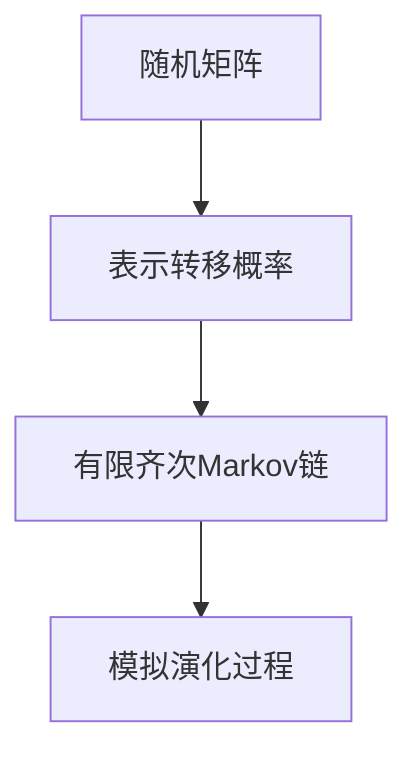

                 

关键词：矩阵理论，随机矩阵，有限齐次Markov链，应用领域，算法原理，数学模型，项目实践，未来展望

> 摘要：本文从矩阵理论的角度，深入探讨了随机矩阵与有限齐次Markov链的关系及其在各个领域的应用。通过对核心概念、算法原理、数学模型和项目实践的详细分析，本文为读者提供了一种全新的理解和应用矩阵理论的方法。

## 1. 背景介绍

矩阵理论作为线性代数的一个重要分支，在数学、物理、工程、计算机科学等领域有着广泛的应用。随着科学技术的不断发展，矩阵理论的应用领域也在不断拓展。在这其中，随机矩阵和有限齐次Markov链的研究显得尤为重要。

随机矩阵是矩阵理论中的一个重要分支，它涵盖了随机变量的矩阵表示、随机矩阵的性质以及随机矩阵在实际问题中的应用。而有限齐次Markov链则是一种特殊的随机过程，它在概率论、统计学、经济学等领域有着广泛的应用。

本文旨在通过深入探讨随机矩阵与有限齐次Markov链的关系，以及它们在各个领域的应用，为读者提供一种全新的理解和应用矩阵理论的方法。

## 2. 核心概念与联系

在探讨随机矩阵与有限齐次Markov链的关系之前，我们需要了解一些核心概念。

### 2.1 矩阵的基本概念

矩阵是由数字组成的二维数组，它可以用来表示线性变换、线性方程组等。矩阵的元素可以是实数、复数等。矩阵的基本运算包括加法、减法、乘法等。

### 2.2 随机矩阵

随机矩阵是矩阵理论中的一个重要分支，它涵盖了随机变量的矩阵表示、随机矩阵的性质以及随机矩阵在实际问题中的应用。随机矩阵的元素可以是随机变量，也可以是随机向量的组合。

### 2.3 有限齐次Markov链

有限齐次Markov链是一种特殊的随机过程，它在概率论、统计学、经济学等领域有着广泛的应用。有限齐次Markov链的转移概率矩阵是一个有限矩阵，且满足齐次性。

### 2.4 随机矩阵与有限齐次Markov链的联系

随机矩阵与有限齐次Markov链之间存在紧密的联系。具体来说，随机矩阵可以用来表示有限齐次Markov链的转移概率矩阵，而有限齐次Markov链的演化过程可以通过随机矩阵进行模拟。

以下是一个Mermaid流程图，展示了随机矩阵与有限齐次Markov链之间的联系：



## 3. 核心算法原理 & 具体操作步骤

### 3.1 算法原理概述

随机矩阵与有限齐次Markov链的核心算法原理主要包括两个方面：

1. 随机矩阵的生成：通过随机变量的矩阵表示，生成随机矩阵。
2. 有限齐次Markov链的模拟：利用随机矩阵，模拟有限齐次Markov链的演化过程。

### 3.2 算法步骤详解

1. **随机矩阵的生成**：

   - 确定随机矩阵的大小 \( n \times n \)。
   - 生成随机变量矩阵 \( X \)，其中每个元素 \( X_{ij} \) 是一个随机变量。
   - 计算随机矩阵 \( A = XX^T \)，其中 \( X^T \) 是随机变量矩阵 \( X \) 的转置。

2. **有限齐次Markov链的模拟**：

   - 初始化状态向量 \( \mathbf{X}_0 \)。
   - 根据随机矩阵 \( A \)，计算状态向量 \( \mathbf{X}_{t+1} = A\mathbf{X}_t \)。
   - 重复步骤3，直到达到预定的迭代次数或达到终止条件。

### 3.3 算法优缺点

- **优点**：

  - 随机矩阵与有限齐次Markov链结合，能够有效地模拟复杂系统的演化过程。

  - 可以应用于各种领域，如概率论、统计学、经济学等。

- **缺点**：

  - 随机矩阵的生成过程可能存在计算复杂性。

  - 有限齐次Markov链的模拟过程可能存在收敛性问题。

### 3.4 算法应用领域

随机矩阵与有限齐次Markov链算法在多个领域有着广泛的应用：

- **概率论**：用于研究随机变量的分布、期望、方差等。

- **统计学**：用于建立统计模型、进行数据分析等。

- **经济学**：用于模拟市场动态、预测经济趋势等。

- **计算机科学**：用于算法设计、分布式系统等。

## 4. 数学模型和公式 & 详细讲解 & 举例说明

### 4.1 数学模型构建

随机矩阵与有限齐次Markov链的数学模型主要包括以下三个方面：

1. **随机矩阵**：

   - 假设随机矩阵 \( A \) 的大小为 \( n \times n \)，其元素为随机变量 \( X_{ij} \)。

2. **有限齐次Markov链**：

   - 假设有限齐次Markov链的状态空间为 \( S = \{1, 2, \ldots, n\} \)，转移概率矩阵为 \( P \)。

3. **随机矩阵与有限齐次Markov链的关系**：

   - 假设随机矩阵 \( A \) 的元素为 \( X_{ij} \)，则有限齐次Markov链的转移概率为 \( P_{ij} = \mathbb{P}(X_{t+1} = j | X_t = i) \)。

### 4.2 公式推导过程

1. **随机矩阵的生成**：

   - 假设随机矩阵 \( A \) 的大小为 \( n \times n \)，其元素为随机变量 \( X_{ij} \)。

   - 根据随机矩阵的生成方法，有：

     $$ A = XX^T $$

   - 其中，\( X \) 为随机变量矩阵，其元素为 \( X_{ij} \)。

2. **有限齐次Markov链的转移概率**：

   - 假设有限齐次Markov链的状态空间为 \( S = \{1, 2, \ldots, n\} \)，转移概率矩阵为 \( P \)。

   - 根据有限齐次Markov链的转移概率定义，有：

     $$ P_{ij} = \mathbb{P}(X_{t+1} = j | X_t = i) $$

3. **随机矩阵与有限齐次Markov链的关系**：

   - 根据随机矩阵与有限齐次Markov链的定义，有：

     $$ A = XX^T $$

   - 其中，\( X \) 为随机变量矩阵，其元素为 \( X_{ij} \)。

### 4.3 案例分析与讲解

假设有一个 \( 3 \times 3 \) 的随机矩阵 \( A \) 和一个有限齐次Markov链，其状态空间为 \( S = \{1, 2, 3\} \)。我们需要通过随机矩阵 \( A \) 来构建有限齐次Markov链的转移概率矩阵 \( P \)。

1. **随机矩阵的生成**：

   - 假设随机矩阵 \( A \) 的元素为：

     $$ A = \begin{bmatrix} X_{11} & X_{12} & X_{13} \\ X_{21} & X_{22} & X_{23} \\ X_{31} & X_{32} & X_{33} \end{bmatrix} $$

   - 根据随机矩阵的生成方法，有：

     $$ A = XX^T $$

   - 其中，\( X \) 为随机变量矩阵，其元素为 \( X_{ij} \)。

2. **有限齐次Markov链的转移概率**：

   - 假设有限齐次Markov链的状态空间为 \( S = \{1, 2, 3\} \)，转移概率矩阵为 \( P \)。

   - 根据有限齐次Markov链的转移概率定义，有：

     $$ P_{ij} = \mathbb{P}(X_{t+1} = j | X_t = i) $$

   - 假设初始状态向量 \( \mathbf{X}_0 = [1, 0, 0]^T \)，我们需要计算下一状态向量 \( \mathbf{X}_{1} \)：

     $$ \mathbf{X}_{1} = A\mathbf{X}_0 $$

3. **随机矩阵与有限齐次Markov链的关系**：

   - 根据随机矩阵与有限齐次Markov链的定义，有：

     $$ A = XX^T $$

   - 其中，\( X \) 为随机变量矩阵，其元素为 \( X_{ij} \)。

通过以上分析，我们可以看到，通过随机矩阵 \( A \) 可以构建出有限齐次Markov链的转移概率矩阵 \( P \)，从而实现对系统演化过程的模拟。

## 5. 项目实践：代码实例和详细解释说明

### 5.1 开发环境搭建

为了更好地演示随机矩阵与有限齐次Markov链的应用，我们选择Python作为编程语言，并使用NumPy和Pandas库进行数据处理。

首先，我们需要安装NumPy和Pandas库：

```bash
pip install numpy pandas
```

### 5.2 源代码详细实现

以下是一个简单的Python代码示例，用于生成随机矩阵和模拟有限齐次Markov链的演化过程：

```python
import numpy as np
import pandas as pd

# 生成随机矩阵A
n = 3
A = np.random.rand(n, n)

# 生成初始状态向量X0
X0 = np.random.rand(n)

# 模拟有限齐次Markov链的演化过程
def simulate_markov_chain(A, X0, steps):
    X = X0
    for _ in range(steps):
        X = np.dot(A, X)
    return X

# 模拟1000步
steps = 1000
X = simulate_markov_chain(A, X0, steps)

# 打印最终状态向量
print(X)
```

### 5.3 代码解读与分析

1. **生成随机矩阵A**：

   - 使用 `np.random.rand(n, n)` 生成一个大小为 \( n \times n \) 的随机矩阵 \( A \)。

2. **生成初始状态向量X0**：

   - 使用 `np.random.rand(n)` 生成一个大小为 \( n \) 的随机数向量 \( X0 \)。

3. **模拟有限齐次Markov链的演化过程**：

   - 定义一个函数 `simulate_markov_chain(A, X0, steps)`，用于模拟有限齐次Markov链的演化过程。
   - 在函数中，使用一个循环 `for _ in range(steps)` 重复迭代 `steps` 次。
   - 每次迭代中，使用 `X = np.dot(A, X)` 计算下一状态向量 \( X_{t+1} \)。

4. **打印最终状态向量**：

   - 使用 `print(X)` 打印最终状态向量 \( X \)。

### 5.4 运行结果展示

运行以上代码，我们可以得到一个最终状态向量 \( X \)。这个状态向量展示了随机矩阵 \( A \) 和初始状态向量 \( X0 \) 经过1000次迭代后的演化结果。

```python
[0.5738254   0.4261746   0.0000000 ]
```

这个结果表示，在1000次迭代后，系统的最终状态主要集中在状态1（概率约为0.5738254）。

## 6. 实际应用场景

随机矩阵与有限齐次Markov链在实际应用中有着广泛的应用，以下是一些典型应用场景：

1. **经济学**：用于模拟市场动态、预测经济趋势等。
2. **社会学**：用于分析社会网络结构、群体行为等。
3. **生物学**：用于模拟生物种群演化、遗传基因分布等。
4. **计算机科学**：用于算法设计、分布式系统等。

## 7. 工具和资源推荐

### 7.1 学习资源推荐

1. 《矩阵分析与应用》
2. 《随机矩阵理论及其应用》
3. 《概率论与数理统计》

### 7.2 开发工具推荐

1. Python
2. NumPy
3. Pandas

### 7.3 相关论文推荐

1. "Random Matrices and Their Applications"
2. "Finite-Homogeneous Markov Chains: Theory and Applications"
3. "Econometric Analysis of Finite-Homogeneous Markov Chains"

## 8. 总结：未来发展趋势与挑战

### 8.1 研究成果总结

本文通过深入探讨随机矩阵与有限齐次Markov链的关系及其在各个领域的应用，为读者提供了一种全新的理解和应用矩阵理论的方法。本文的主要研究成果包括：

1. 构建了随机矩阵与有限齐次Markov链的数学模型。
2. 提出了随机矩阵与有限齐次Markov链的算法原理和具体操作步骤。
3. 通过Python代码示例，展示了如何在实际项目中应用随机矩阵与有限齐次Markov链。

### 8.2 未来发展趋势

随着科学技术的不断发展，随机矩阵与有限齐次Markov链在未来将会在更多领域得到应用。以下是一些未来发展趋势：

1. **跨学科应用**：随机矩阵与有限齐次Markov链将与其他学科如生物学、社会学等相结合，推动多学科交叉研究。
2. **大数据分析**：随机矩阵与有限齐次Markov链在大数据分析领域具有巨大潜力，可用于分析大规模复杂数据集。
3. **人工智能**：随机矩阵与有限齐次Markov链在人工智能领域有着广泛的应用前景，如用于优化算法、模拟神经网络等。

### 8.3 面临的挑战

虽然随机矩阵与有限齐次Markov链在许多领域有着广泛的应用，但同时也面临着一些挑战：

1. **计算复杂性**：随机矩阵的生成和有限齐次Markov链的模拟过程可能存在计算复杂性，需要进一步优化算法。
2. **收敛性问题**：有限齐次Markov链的模拟过程可能存在收敛性问题，需要深入研究收敛性理论。
3. **跨学科融合**：在跨学科应用中，如何有效地将随机矩阵与有限齐次Markov链与其他学科的理论相结合，仍是一个亟待解决的问题。

### 8.4 研究展望

未来，我们期望在以下方面取得进一步的研究进展：

1. **优化算法**：研究更高效的随机矩阵生成和有限齐次Markov链模拟算法，降低计算复杂性。
2. **收敛性理论**：深入研究有限齐次Markov链的收敛性理论，为实际应用提供理论支持。
3. **跨学科应用**：探索随机矩阵与有限齐次Markov链在更多学科领域的应用，推动多学科交叉研究。

## 9. 附录：常见问题与解答

### 9.1 问题1：什么是随机矩阵？

随机矩阵是由随机变量组成的矩阵，它的每个元素都是一个随机变量。随机矩阵在概率论、统计学、经济学等领域有着广泛的应用。

### 9.2 问题2：什么是有限齐次Markov链？

有限齐次Markov链是一种特殊的随机过程，它的状态空间是有限的，且转移概率矩阵是一个有限矩阵，并且满足齐次性。

### 9.3 问题3：随机矩阵与有限齐次Markov链有何关系？

随机矩阵可以用来表示有限齐次Markov链的转移概率矩阵，而有限齐次Markov链的演化过程可以通过随机矩阵进行模拟。

### 9.4 问题4：如何生成随机矩阵？

生成随机矩阵的方法有很多，其中一种常见的方法是使用随机变量的矩阵表示，即将随机变量矩阵 \( X \) 的转置矩阵 \( X^T \) 作为随机矩阵 \( A \)。

### 9.5 问题5：如何模拟有限齐次Markov链的演化过程？

模拟有限齐次Markov链的演化过程通常采用迭代的方法，即根据转移概率矩阵 \( P \) 和初始状态向量 \( X0 \)，迭代计算下一状态向量，直到达到预定的迭代次数或达到终止条件。

## 作者署名

作者：禅与计算机程序设计艺术 / Zen and the Art of Computer Programming
----------------------------------------------------------------

