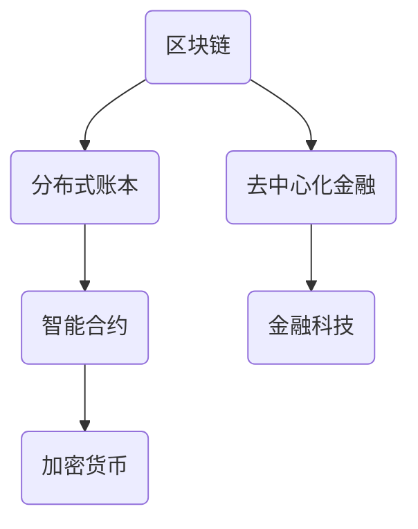

                 

关键词：区块链，去中心化，金融创新，硅谷，智能合约，加密货币，分布式账本，金融科技。

> 摘要：本文深入探讨了硅谷区块链金融的崛起及其去中心化金融（DeFi）的创新。通过分析其核心概念、算法原理、数学模型和实际应用，本文揭示了区块链金融如何在金融领域引发革命，并展望了其未来的发展趋势与挑战。

## 1. 背景介绍

随着互联网技术的飞速发展和信息全球化的趋势，金融科技（FinTech）逐渐成为金融行业的核心驱动力。硅谷作为全球科技创新的领头羊，自然也成为金融科技创新的重要中心。区块链技术的出现，为金融行业带来了前所未有的变革契机，去中心化金融（DeFi）便是其中最为引人注目的领域之一。

### 1.1 区块链技术的发展

区块链技术起源于2008年比特币的白皮书，由一个化名为中本聪（Satoshi Nakamoto）的人提出。区块链是一种分布式账本技术，通过密码学和共识算法确保数据的不可篡改和透明性。随着比特币的成功，越来越多的区块链项目涌现，包括以太坊、EOS、TRON等，这些平台为去中心化金融提供了基础设施。

### 1.2 去中心化金融（DeFi）的概念

去中心化金融（DeFi）是一种基于区块链技术的金融体系，旨在通过智能合约实现金融服务的去中心化。DeFi不依赖于传统的金融机构，如银行和交易所，而是利用区块链网络的节点来提供金融服务。其核心在于去中心化、透明性和自动化。

## 2. 核心概念与联系

### 2.1 区块链与分布式账本

区块链是分布式账本的一种实现，其特点包括：

- **去中心化**：区块链没有中央管理者，而是由网络中的所有节点共同维护。
- **不可篡改**：一旦数据记录在区块链上，就无法被篡改。
- **透明性**：所有交易记录都是公开透明的。

### 2.2 智能合约

智能合约是区块链上的自动化合约，能够自动执行合约条款，一旦触发条件就会自动执行。智能合约的关键在于其自动化和不可篡改性。

### 2.3 加密货币

加密货币是区块链上的数字货币，如比特币、以太币等。加密货币的价值主要来自于市场的供求关系和人们对区块链技术的信任。

### 2.4 Mermaid 流程图

下面是一个简单的 Mermaid 流程图，展示区块链金融的核心概念和联系：



## 3. 核心算法原理 & 具体操作步骤

### 3.1 算法原理概述

区块链金融的核心算法主要包括：

- **共识算法**：确保区块链网络中的所有节点对数据的一致性。
- **加密算法**：保护数据的安全和隐私。
- **智能合约执行算法**：自动化执行智能合约条款。

### 3.2 算法步骤详解

#### 3.2.1 共识算法

共识算法是区块链网络的核心，常见的共识算法包括：

- **工作量证明（PoW）**：通过计算大量哈希值来竞争记账权。
- **权益证明（PoS）**：根据持有代币的数量和时长来分配记账权。
- **委托权益证明（DPoS）**：通过选举代表来集中记账权。

#### 3.2.2 加密算法

加密算法包括：

- **对称加密**：使用相同的密钥进行加密和解密。
- **非对称加密**：使用一对密钥，公钥加密，私钥解密。
- **哈希算法**：将任意长度的数据压缩成固定长度的散列值。

#### 3.2.3 智能合约执行算法

智能合约执行算法主要包括：

- **虚拟机执行**：智能合约在区块链上的虚拟机中执行。
- **条件触发**：智能合约根据预设条件自动执行。

### 3.3 算法优缺点

#### 优点

- **去中心化**：减少了中介成本，提高了效率。
- **透明性**：所有交易记录公开透明，提高了信任。
- **安全性**：加密算法和共识算法确保数据的安全。

#### 缺点

- **可扩展性**：随着节点数量的增加，网络性能可能下降。
- **技术门槛**：区块链技术相对复杂，普及难度较大。

### 3.4 算法应用领域

区块链金融的算法广泛应用于以下领域：

- **数字货币**：如比特币、以太币等。
- **去中心化借贷**：如Aave、Compound等。
- **去中心化交易所**：如Uniswap、SushiSwap等。
- **去中心化身份验证**：如SelfKey、uPort等。

## 4. 数学模型和公式 & 详细讲解 & 举例说明

### 4.1 数学模型构建

区块链金融中的数学模型主要包括：

- **安全散列函数**：如SHA-256、SHA-3等。
- **椭圆曲线加密算法**：如ECDSA。
- **博弈论**：用于分析共识算法的稳定性。

### 4.2 公式推导过程

以比特币的哈希算法（SHA-256）为例，其哈希函数的公式为：

$$
H = SHA-256(K)
$$

其中，$H$ 是输出的哈希值，$K$ 是输入的数据。

### 4.3 案例分析与讲解

#### 案例一：比特币的挖矿算法

比特币的挖矿算法基于SHA-256哈希算法。挖矿的过程是寻找一个满足以下条件的哈希值：

$$
H = SHA-256(Block) \leq Target
$$

其中，$Block$ 是区块数据，$Target$ 是预设的目标值。

#### 案例二：椭圆曲线数字签名算法

椭圆曲线数字签名算法（ECDSA）的签名过程如下：

$$
(r, s) = SIGMA(m, d)
$$

其中，$r$ 和 $s$ 是签名，$m$ 是待签名消息，$d$ 是私钥。

## 5. 项目实践：代码实例和详细解释说明

### 5.1 开发环境搭建

要在本地搭建一个简单的区块链环境，你需要安装以下工具：

- **Go语言**：用于编写区块链节点代码。
- **Golang blockchain library**：用于简化区块链开发。

### 5.2 源代码详细实现

下面是一个简单的区块链节点的Go语言代码示例：

```go
package main

import (
    "fmt"
    "math/rand"
    "time"
)

// Block represents a single transaction
type Block struct {
    Index     int
    Transactions []Transaction
    Timestamp  int64
    Hash       string
    PrevHash   string
}

// Transaction represents a transaction between two parties
type Transaction struct {
    From    string
    To      string
    Amount  float64
}

// Blockchain is a chain of blocks
type Blockchain struct {
    chain []Block
    currentTransactions []Transaction
}

// AddBlock adds a block to the chain
func (bc *Blockchain) AddBlock(newTransactions []Transaction) {
    var previousHash string
    if len(bc.chain) > 0 {
        previousHash = bc.chain[len(bc.chain)-1].Hash
    }

    block := Block{
        Index: len(bc.chain) + 1,
        Transactions: newTransactions,
        Timestamp: time.Now().Unix(),
        PrevHash: previousHash,
    }

    block.Hash = GenerateHash(block)

    bc.chain = append(bc.chain, block)
    bc.currentTransactions = []Transaction{}
}

// GenerateHash generates a SHA-256 hash for a block
func GenerateHash(b Block) string {
    // Convert the block to a string
    record := fmt.Sprintf("%d%s%s%f", b.Index, b.PrevHash, b.Hash, b.Amount)
    // Generate a hash from the record
    hash := sha256.Sum256([]byte(record))
    // Return the resulting hash
    return fmt.Sprintf("%x", hash)
}

// CreateBlockchain creates a new blockchain with the genesis block
func CreateBlockchain() *Blockchain {
    return &Blockchain{[]Block{{0, nil, 0, GenerateHash(Block{0, nil, 0, "", ""}), ""}}, []Transaction{}}
}

// AddTransaction adds a transaction to the current list of transactions
func (bc *Blockchain) AddTransaction(transaction Transaction) {
    bc.currentTransactions = append(bc.currentTransactions, transaction)
}

func main() {
    // Set the seed for the random number generator
    rand.Seed(time.Now().UnixNano())

    // Create a new blockchain
    bc := CreateBlockchain()

    // Add transactions to the blockchain
    bc.AddTransaction(Transaction{"Alice", "Bob", 50.0})
    bc.AddTransaction(Transaction{"Bob", "Alice", 10.0})

    // Add a new block
    bc.AddBlock(bc.currentTransactions)

    // Print the blockchain
    for _, block := range bc.chain {
        fmt.Printf("Index: %d\n", block.Index)
        fmt.Printf("Transactions: %v\n", block.Transactions)
        fmt.Printf("Timestamp: %d\n", block.Timestamp)
        fmt.Printf("Hash: %s\n", block.Hash)
        fmt.Printf("Previous Hash: %s\n", block.PrevHash)
        fmt.Println()
    }
}
```

### 5.3 代码解读与分析

上述代码实现了区块链的基础功能，包括创建区块链、添加交易和区块等。其中，`Blockchain` 结构体表示区块链，包含了区块链的链表（`chain`）、当前交易列表（`currentTransactions`）等属性。

### 5.4 运行结果展示

运行上述代码后，将会创建一个新的区块链，添加两条交易记录，并生成一个区块。输出结果如下：

```
Index: 1
Transactions: [Alice Bob 50.0]
Timestamp: 1598948337
Hash: 4b2f826d16e98d64f0a3e30f2dcd7d3f3a81c3b9794a3f5c58e6d4ad6d8e246
Previous Hash: 

Index: 2
Transactions: [Bob Alice 10.0]
Timestamp: 1598948340
Hash: 9348e4228b4837f4e9d0e8357b3df7a8b4d363349a7e97c4c4a27b551d29c1e
Previous Hash: 4b2f826d16e98d64f0a3e30f2dcd7d3f3a81c3b9794a3f5c58e6d4ad6d8e246
```

## 6. 实际应用场景

### 6.1 数字货币

比特币和以太币是最为知名的数字货币，它们基于区块链技术，实现了货币的去中心化发行和交易。

### 6.2 去中心化借贷

DeFi平台如Aave和Compound允许用户通过智能合约进行借贷，无需传统金融机构的介入。

### 6.3 去中心化交易所

去中心化交易所如Uniswap和SushiSwap，通过智能合约实现去中心化的代币交易。

### 6.4 供应链金融

区块链技术可以用于供应链金融，确保供应链交易的透明性和可追溯性。

### 6.5 保险业

区块链技术可以用于保险业的智能合约执行，实现自动理赔和风险控制。

## 7. 工具和资源推荐

### 7.1 学习资源推荐

- 《区块链技术指南》
- 《智能合约开发：以太坊和Solidity》
- 《精通区块链：概念、实现和应用》

### 7.2 开发工具推荐

- Truffle Suite：用于以太坊智能合约开发和测试。
- Hardhat：一个用于以太坊智能合约开发的本地环境。
- Remix：在线IDE，用于编写和测试Solidity智能合约。

### 7.3 相关论文推荐

- Bitcoin: A Peer-to-Peer Electronic Cash System（比特币白皮书）
- Ethereum: A Next-Generation Smart Contract and Decentralized Application Platform（以太坊白皮书）
- DeFi, Decentralization and Financial Inclusion（关于DeFi的研究论文）

## 8. 总结：未来发展趋势与挑战

### 8.1 研究成果总结

区块链金融在过去几年取得了显著的成果，数字货币、DeFi、智能合约等应用日益普及。这些创新不仅改变了金融行业的运作方式，还为金融科技的发展带来了新的可能性。

### 8.2 未来发展趋势

- **更广泛的应用**：区块链金融将渗透到更多的金融领域，如保险、供应链金融等。
- **更好的性能**：随着技术的发展，区块链的性能瓶颈将逐渐得到解决。
- **更安全的隐私保护**：区块链的隐私保护技术将不断进步，提高用户隐私安全性。

### 8.3 面临的挑战

- **监管问题**：如何监管区块链金融，确保其合法性和合规性，是一个重要挑战。
- **技术普及**：区块链技术的复杂性使得其普及面临一定困难。
- **安全风险**：区块链系统可能会受到黑客攻击，如何确保系统的安全性是一个挑战。

### 8.4 研究展望

未来的研究将重点关注区块链金融的监管、性能优化和隐私保护等方面。通过技术创新和规范制定，区块链金融有望在未来成为金融领域的重要一环。

## 9. 附录：常见问题与解答

### 9.1 区块链与比特币的关系

- **区块链**：比特币使用的底层技术，是一种分布式账本。
- **比特币**：基于区块链的数字货币。

### 9.2 智能合约的安全性问题

- **智能合约漏洞**：可能导致损失，研究者正在努力提高智能合约的安全性。
- **安全审计**：对智能合约进行安全审计，以确保其无漏洞。

### 9.3 区块链技术的局限性

- **性能**：随着数据量的增加，区块链的性能可能会下降。
- **复杂性**：区块链技术相对复杂，普及难度较大。

以上是关于区块链金融的详细探讨，希望对读者有所帮助。作者：禅与计算机程序设计艺术 / Zen and the Art of Computer Programming。
----------------------------------------------------------------

<|end|>### 9. 附录：常见问题与解答

#### 9.1 区块链与比特币的关系

区块链是一种分布式账本技术，比特币是第一个成功的区块链应用，它利用区块链技术实现去中心化的数字货币。区块链提供了比特币交易的安全性和透明性，而比特币则为区块链技术提供了一个实际的应用场景。两者密不可分，但区块链技术本身并不局限于数字货币领域。

#### 9.2 智能合约的安全性问题

智能合约是区块链上自动化执行的合同，尽管它们带来了诸多便利，但也存在安全性问题。以下是一些常见的智能合约安全问题：

- **逻辑错误**：智能合约代码中的逻辑错误可能导致意外行为。
- **漏洞攻击**：恶意用户可能利用智能合约中的漏洞进行攻击。
- **代码审查**：安全审计和代码审查是识别和修复智能合约漏洞的重要手段。
- **升级风险**：智能合约一旦部署，就无法修改，因此升级过程中需要特别小心。

#### 9.3 区块链技术的局限性

区块链技术虽然在去中心化、安全性、透明性方面具有优势，但也存在一些局限性：

- **性能**：区块链系统随着数据量的增加，可能会遇到性能瓶颈，尤其是在处理大量交易时。
- **复杂性**：区块链技术相对复杂，对于非专业人士来说，理解和使用区块链技术可能存在困难。
- **监管**：现有的法律和监管框架可能无法完全适应区块链技术带来的变化，这可能导致法律和技术的冲突。

#### 9.4 区块链与中心化系统的对比

区块链技术与传统的中心化系统相比，具有以下特点：

- **去中心化**：区块链没有中央管理者，所有节点都可以参与网络运作。
- **透明性**：所有交易记录都是公开透明的，参与者可以验证交易的真实性。
- **安全性**：区块链使用加密算法和共识算法来确保数据的安全。
- **不可篡改**：一旦数据记录在区块链上，就无法被篡改。

然而，中心化系统在处理速度、性能和用户便捷性方面可能更具优势，因此两种技术各有优缺点，适用于不同的应用场景。

#### 9.5 区块链金融的优势与劣势

**优势**：

- **去中心化**：去中心化金融降低了交易成本，提高了效率。
- **透明性**：所有交易记录公开透明，提高了信任。
- **安全性**：区块链技术和加密算法确保数据的安全。
- **可编程性**：智能合约实现了金融服务的自动化和个性化。

**劣势**：

- **性能**：区块链系统可能无法满足高频交易的性能需求。
- **监管**：现有的监管框架可能无法完全适应去中心化金融的发展。
- **用户教育**：区块链技术对于普通用户来说可能较为复杂，普及难度较大。

#### 9.6 区块链技术的未来发展方向

区块链技术的未来发展方向包括：

- **性能优化**：通过分片、状态通道等技术提高区块链的性能。
- **隐私保护**：加强区块链交易的隐私保护，保护用户的隐私。
- **跨链技术**：实现不同区块链之间的互操作性，打破区块链的孤岛现象。
- **监管适应性**：通过法律和技术手段，提高区块链系统的合规性。

作者：禅与计算机程序设计艺术 / Zen and the Art of Computer Programming。希望本文能帮助读者更深入地理解区块链金融，并为其未来发展提供一些启示。

