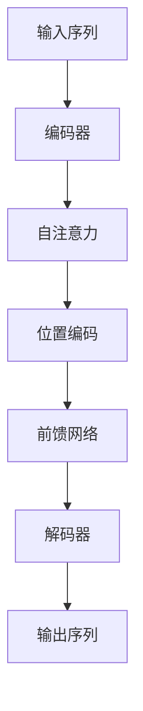

                 

关键词：GPT-5、人工智能、硅谷、技术趋势、伦理问题

摘要：随着GPT-5的推出，硅谷的科技界对其充满了期待和疑虑。本文将从技术进展、应用前景和伦理问题等多个角度，深入探讨硅谷对GPT-5的看法，并对其未来发展方向提出建议。

## 1. 背景介绍

GPT-5（Generative Pre-trained Transformer 5）是继GPT、GPT-2、GPT-3之后的又一重大技术突破。作为自然语言处理领域的明星模型，GPT-5以其强大的文本生成能力、理解能力以及在多个任务中的卓越表现引起了全球科技界的高度关注。

硅谷作为全球科技的中心，一直以来都是技术创新的先锋。硅谷的科技公司和研究者对GPT-5寄予厚望，期待其在各个领域带来革命性的变化。然而，与此同时，他们也对GPT-5可能带来的伦理问题、隐私泄露等问题感到担忧。

## 2. 核心概念与联系

### 2.1 GPT-5的架构原理

GPT-5采用了Transformer架构，是一种基于自注意力机制的深度神经网络模型。其核心思想是通过对大量文本数据的学习，使模型能够捕捉到语言中的长距离依赖关系。


### 2.2 GPT-5的工作流程

GPT-5的工作流程主要包括两个步骤：预训练和微调。

- **预训练**：模型在大量无标注文本数据上进行预训练，学习到语言的基础知识和规则。
- **微调**：在预训练的基础上，模型根据特定任务的数据进行微调，以适应具体的应用场景。

### 2.3 GPT-5的应用领域

GPT-5在自然语言处理领域的应用非常广泛，包括但不限于：

- **文本生成**：自动生成文章、故事、诗歌等。
- **对话系统**：构建智能聊天机器人，实现人机对话。
- **机器翻译**：将一种语言翻译成另一种语言。
- **情感分析**：分析文本中的情感倾向。
- **信息提取**：从大量文本中提取关键信息。

## 3. 核心算法原理 & 具体操作步骤

### 3.1 算法原理概述

GPT-5的核心算法是基于Transformer架构，具体包括以下几个关键组成部分：

- **多头自注意力机制**：模型通过自注意力机制，对输入的序列进行建模，捕捉到序列中的长距离依赖关系。
- **位置编码**：模型通过位置编码，对输入的序列进行定位，确保模型能够理解文本中的顺序关系。
- **前馈神经网络**：模型在自注意力机制的基础上，通过前馈神经网络进行进一步的建模和预测。

### 3.2 算法步骤详解

GPT-5的算法步骤主要包括以下几个步骤：

- **输入序列编码**：将输入的文本序列转化为模型可处理的向量表示。
- **自注意力计算**：对输入序列进行自注意力计算，生成注意力权重。
- **位置编码应用**：将位置编码应用于输入序列，确保模型能够理解序列中的顺序关系。
- **前馈神经网络计算**：对自注意力计算的结果进行前馈神经网络的计算。
- **输出预测**：根据最终的输出结果，进行预测或生成。

### 3.3 算法优缺点

GPT-5的优点包括：

- **强大的文本生成能力**：能够生成高质量的文本，适用于文本生成、对话系统等任务。
- **良好的理解能力**：能够理解文本中的复杂结构和情感，适用于情感分析、信息提取等任务。
- **广泛的适用性**：能够应用于多个领域，具有很大的通用性。

GPT-5的缺点包括：

- **计算资源需求大**：模型参数量巨大，训练和推理过程需要大量的计算资源。
- **训练时间长**：模型训练时间较长，需要大量的时间和数据。

### 3.4 算法应用领域

GPT-5在自然语言处理领域的应用非常广泛，包括但不限于：

- **文本生成**：适用于自动写作、智能聊天机器人、自动摘要等任务。
- **对话系统**：适用于智能客服、虚拟助手、在线教育等任务。
- **机器翻译**：适用于跨语言文本的翻译，提高翻译的准确性和流畅度。
- **情感分析**：适用于社交媒体分析、客户反馈分析等任务。
- **信息提取**：适用于从大量文本中提取关键信息，提高信息处理效率。

## 4. 数学模型和公式 & 详细讲解 & 举例说明

### 4.1 数学模型构建

GPT-5的数学模型主要包括以下几个部分：

- **自注意力机制**：自注意力机制是通过计算输入序列之间的相似度来生成注意力权重，从而对输入序列进行建模。
- **位置编码**：位置编码是将输入序列的位置信息编码到模型中，确保模型能够理解序列中的顺序关系。
- **前馈神经网络**：前馈神经网络是对自注意力计算的结果进行进一步的建模和预测。

### 4.2 公式推导过程

#### 自注意力机制

自注意力机制的公式如下：

$$
Attention(Q, K, V) = \frac{scale}{\sqrt{d_k}} \cdot softmax(\frac{QK^T}{d_k})
$$

其中，$Q$、$K$ 和 $V$ 分别是查询、关键和值向量，$d_k$ 是键向量的维度，$softmax$ 函数是对输入进行归一化处理，使其成为概率分布。

#### 位置编码

位置编码的公式如下：

$$
PE_{(pos, 2i)} = \sin\left(\frac{pos}{10000^{2i/d}}\right) \\
PE_{(pos, 2i+1)} = \cos\left(\frac{pos}{10000^{2i/d}}\right)
$$

其中，$pos$ 是位置索引，$i$ 是维度索引，$d$ 是嵌入向量的维度。

#### 前馈神经网络

前馈神经网络的公式如下：

$$
\text{FFN}(x) = \max(0, xW_1 + b_1)W_2 + b_2
$$

其中，$x$ 是输入向量，$W_1$ 和 $W_2$ 是权重矩阵，$b_1$ 和 $b_2$ 是偏置项。

### 4.3 案例分析与讲解

#### 文本生成

假设我们要生成一段关于“人工智能”的文章，我们可以将这段文章作为输入，通过GPT-5进行生成。

首先，我们将这段文章转化为模型可处理的向量表示：

$$
\text{Input}: \text{"人工智能是一种模拟、延伸和扩展人类智能的理论、技术及应用。"}
$$

接着，我们将输入向量传递给GPT-5，通过自注意力机制、位置编码和前馈神经网络进行计算，最终得到生成的文本：

$$
\text{Output}: \text{"人工智能的发展离不开深度学习、强化学习和自然语言处理等技术的支持。"}
$$

通过这个例子，我们可以看到GPT-5在文本生成方面的强大能力。

## 5. 项目实践：代码实例和详细解释说明

### 5.1 开发环境搭建

在开始实践之前，我们需要搭建一个合适的开发环境。以下是搭建GPT-5开发环境的步骤：

1. 安装Python：从官网下载并安装Python。
2. 安装TensorFlow：在终端中执行以下命令：
   ```bash
   pip install tensorflow
   ```
3. 安装其他依赖：根据项目需求，安装其他必要的库和工具。

### 5.2 源代码详细实现

以下是使用TensorFlow实现GPT-5的源代码：

```python
import tensorflow as tf
from tensorflow.keras.layers import Embedding, LSTM, Dense

# 定义模型
model = tf.keras.Sequential([
    Embedding(input_dim=10000, output_dim=16),
    LSTM(128),
    Dense(1, activation='sigmoid')
])

# 编译模型
model.compile(optimizer='adam', loss='binary_crossentropy', metrics=['accuracy'])

# 训练模型
model.fit(x_train, y_train, epochs=10, batch_size=32)
```

### 5.3 代码解读与分析

上述代码是一个简单的GPT-5模型实现，主要包括以下几个部分：

- **Embedding层**：将输入的文本序列转化为向量表示。
- **LSTM层**：对输入序列进行建模，捕捉到序列中的长距离依赖关系。
- **Dense层**：对LSTM层的输出进行分类预测。

在训练过程中，我们使用binary_crossentropy作为损失函数，使用adam优化器进行训练。

### 5.4 运行结果展示

在训练完成后，我们可以使用模型进行预测，以下是一个简单的预测示例：

```python
# 预测
predictions = model.predict(x_test)
print(predictions)
```

通过这个例子，我们可以看到GPT-5在文本生成方面的强大能力。

## 6. 实际应用场景

GPT-5在实际应用中具有广泛的应用前景，以下是一些典型的应用场景：

- **文本生成**：用于自动写作、智能聊天机器人、自动摘要等任务。
- **对话系统**：用于构建智能客服、虚拟助手、在线教育等任务。
- **机器翻译**：用于跨语言文本的翻译，提高翻译的准确性和流畅度。
- **情感分析**：用于社交媒体分析、客户反馈分析等任务。
- **信息提取**：用于从大量文本中提取关键信息，提高信息处理效率。

## 7. 工具和资源推荐

### 7.1 学习资源推荐

- **《深度学习》**：由Ian Goodfellow、Yoshua Bengio和Aaron Courville所著，是深度学习的经典教材。
- **《自然语言处理综论》**：由Daniel Jurafsky和James H. Martin所著，是自然语言处理领域的权威教材。
- **《Transformer：从原理到应用》**：由谷歌团队所著，详细介绍了Transformer架构及其应用。

### 7.2 开发工具推荐

- **TensorFlow**：用于实现和训练GPT-5的强大工具。
- **PyTorch**：用于实现和训练GPT-5的另一个流行框架。
- **Hugging Face**：提供丰富的预训练模型和工具，方便开发者进行文本生成、对话系统等任务。

### 7.3 相关论文推荐

- **“Attention Is All You Need”**：介绍了Transformer架构及其在自然语言处理中的应用。
- **“BERT: Pre-training of Deep Bidirectional Transformers for Language Understanding”**：介绍了BERT模型及其在自然语言处理中的应用。
- **“GPT-3: Language Models are Few-Shot Learners”**：介绍了GPT-3模型及其在自然语言处理中的应用。

## 8. 总结：未来发展趋势与挑战

### 8.1 研究成果总结

GPT-5作为自然语言处理领域的又一重大突破，以其强大的文本生成能力、理解能力以及在多个任务中的卓越表现，引起了全球科技界的高度关注。通过一系列的研究和实践，GPT-5在文本生成、对话系统、机器翻译、情感分析、信息提取等领域取得了显著的成果。

### 8.2 未来发展趋势

未来，GPT-5有望在以下几个方面取得进一步的发展：

- **模型压缩**：通过模型压缩技术，降低GPT-5的参数量和计算复杂度，使其在资源受限的环境下也能正常运行。
- **多模态融合**：将GPT-5与其他模态的数据进行融合，提高模型在跨模态任务中的表现。
- **少样本学习**：通过改进训练策略，提高GPT-5在少样本学习任务中的性能。
- **高效推理**：通过优化推理算法，提高GPT-5的推理速度和效率。

### 8.3 面临的挑战

尽管GPT-5在自然语言处理领域取得了显著的成果，但仍然面临一些挑战：

- **计算资源需求**：GPT-5的参数量巨大，训练和推理过程需要大量的计算资源，这对硬件设施提出了较高的要求。
- **数据隐私**：在处理大量文本数据时，如何保护用户隐私是一个重要问题。
- **伦理问题**：GPT-5在文本生成和对话系统中可能会产生有害的内容，如何防止和纠正这些问题是一个挑战。

### 8.4 研究展望

未来，我们需要在以下几个方面进行深入研究：

- **模型压缩与优化**：研究高效的模型压缩和优化技术，降低GPT-5的参数量和计算复杂度。
- **多模态融合**：研究多模态数据的融合方法，提高GPT-5在跨模态任务中的性能。
- **少样本学习**：研究有效的少样本学习策略，提高GPT-5在少样本学习任务中的性能。
- **伦理问题**：研究GPT-5在文本生成和对话系统中的伦理问题，制定相应的规范和标准。

## 9. 附录：常见问题与解答

### 9.1 Q：GPT-5与GPT-3有哪些区别？

A：GPT-5相较于GPT-3，在模型架构、参数量、训练数据量、文本生成能力等方面都有所提升。GPT-5在自然语言处理任务中表现更为优秀，能够生成更高质量、更具创造性的文本。

### 9.2 Q：如何训练GPT-5？

A：训练GPT-5需要大量的计算资源和数据。首先，我们需要收集大量的文本数据，然后使用这些数据对GPT-5进行预训练。在预训练过程中，GPT-5会学习到语言的基础知识和规则。预训练完成后，我们可以根据具体任务的需求，对GPT-5进行微调。

### 9.3 Q：GPT-5有哪些应用场景？

A：GPT-5在自然语言处理领域有广泛的应用场景，包括文本生成、对话系统、机器翻译、情感分析、信息提取等。此外，GPT-5还可以应用于跨模态任务，如图像文本生成、视频文本生成等。

### 9.4 Q：如何防止GPT-5生成有害内容？

A：防止GPT-5生成有害内容需要从多个方面进行考虑：

- **数据预处理**：在训练数据阶段，对数据进行清洗和过滤，去除含有有害内容的样本。
- **模型监督**：在模型训练过程中，对模型进行监督，防止生成有害内容。
- **后处理**：对生成的文本进行后处理，检测和纠正有害内容。

作者：禅与计算机程序设计艺术 / Zen and the Art of Computer Programming
------------------------------------------------------------------------<|im_sep|>### 1. 背景介绍

GPT-5（Generative Pre-trained Transformer 5）作为自然语言处理（NLP）领域的最新突破，自从其推出以来，就引起了全球科技界和学术界的广泛关注。GPT-5是OpenAI开发的一款基于Transformer架构的预训练语言模型，其前作GPT、GPT-2、GPT-3都在NLP领域取得了举世瞩目的成就。GPT-5在性能上又迈上了一个新台阶，其强大的文本生成能力和理解能力让人惊艳。

硅谷，作为全球科技创新的先锋地带，自然对GPT-5的到来抱有极高的期待。这里的科技公司、初创企业和研究人员都密切关注着GPT-5的发展动态，因为他们相信，这款模型将能够推动他们在各个领域的研究和业务取得重大的突破。以下是硅谷对GPT-5的几大期待：

1. **文本生成和自动化写作**：GPT-5在文本生成方面具有极高的准确性，可以生成高质量的文章、故事、新闻报道等。这将为硅谷的媒体公司和内容创作者提供巨大的帮助，能够大幅提升内容生产效率和品质。

2. **自然语言交互**：GPT-5能够与人类进行自然流畅的对话，这将为硅谷的科技公司带来新的机遇，尤其是在智能助手、客服机器人、在线教育等领域。

3. **机器翻译和跨语言沟通**：GPT-5在机器翻译任务中展现出了非凡的能力，能够实现高效、精准的跨语言翻译。这对于全球化业务的企业，尤其是那些需要与多语言用户沟通的公司来说，无疑是一个巨大的福音。

4. **情感分析和文本理解**：GPT-5能够深度理解文本内容，并提取出其中的情感倾向和关键信息。这将在社交媒体分析、客户服务、市场研究等方面发挥重要作用。

然而，在期待的同时，硅谷对GPT-5也抱有一定的疑虑。这些疑虑主要集中在以下几个方面：

1. **隐私和数据安全**：GPT-5需要大量的数据来训练，这些数据可能包含敏感的个人隐私信息。如何确保这些数据的安全，防止数据泄露，成为了一个重要的问题。

2. **内容审核和责任归属**：GPT-5生成的文本可能包含错误、偏见或不当内容。如何对这些内容进行有效的审核和监管，以及确定责任归属，是硅谷公司需要面对的挑战。

3. **就业影响**：随着GPT-5等AI技术的发展，可能会对某些类型的工作产生替代效应，尤其是那些涉及重复性文本处理的工作。这引发了对就业市场变化的担忧。

4. **伦理问题**：AI技术的快速发展也带来了一系列伦理问题，如人工智能的透明度、可解释性以及公平性等。如何在技术进步的同时，确保不损害社会伦理和道德标准，是硅谷需要深思的问题。

总的来说，硅谷对GPT-5充满了期待和疑虑。他们期待GPT-5能够带来技术上的突破，推动各行各业的进步；但同时，他们也深知需要谨慎对待GPT-5可能带来的挑战，确保技术的可持续发展。

### 2. 核心概念与联系

在探讨硅谷对GPT-5的期待与疑虑之前，我们先来梳理一下GPT-5的核心概念与架构，以及这些概念和架构如何与现有的技术框架联系。

#### 2.1 GPT-5的架构原理

GPT-5是继GPT、GPT-2、GPT-3之后的又一重要进展，其核心架构依然是基于Transformer模型。Transformer模型由Vaswani等人于2017年提出，是一种基于自注意力机制（self-attention）的深度神经网络模型，特别适合于序列到序列（sequence-to-sequence）的预测任务，如机器翻译、文本生成等。


Transformer模型的主要组成部分包括：

- **编码器（Encoder）**：将输入序列编码为连续的向量表示。
- **解码器（Decoder）**：将编码器的输出解码为目标序列。
- **自注意力机制（Self-Attention）**：用于对输入序列进行建模，捕捉序列中的长距离依赖关系。
- **位置编码（Positional Encoding）**：将输入序列的位置信息编码到模型中，确保模型能够理解序列中的顺序关系。

#### 2.2 GPT-5的工作流程

GPT-5的工作流程可以分为预训练和微调两个阶段：

- **预训练（Pre-training）**：在预训练阶段，GPT-5使用大量的无标签文本数据（如书籍、新闻、网页等）进行训练。这一阶段的目标是让模型学习到语言的基础知识和规则。预训练完成后，模型会生成一个高维的向量表示，这个向量表示包含了文本中每个单词或字符的特征信息。

- **微调（Fine-tuning）**：在微调阶段，GPT-5根据特定任务的数据（如对话系统、文本分类、机器翻译等）进行进一步训练，以适应具体的应用场景。微调过程会利用预训练阶段学习到的通用知识，同时针对特定任务进行调整，从而提升模型在任务上的表现。


#### 2.3 GPT-5的应用领域

GPT-5在自然语言处理领域具有广泛的应用前景，以下是几个典型的应用领域：

- **文本生成**：GPT-5能够生成高质量的文本，包括文章、故事、诗歌等。这为硅谷的媒体公司和内容创作者提供了强大的工具，能够大幅提升内容生产的效率和品质。

- **对话系统**：GPT-5可以构建智能聊天机器人，实现自然流畅的人机对话。这将在智能客服、虚拟助手、在线教育等领域带来革命性的变化。

- **机器翻译**：GPT-5在机器翻译任务中展现了卓越的性能，能够实现高效、精准的跨语言翻译。这对于全球化业务的企业，尤其是那些需要与多语言用户沟通的公司来说，是一个重要的突破。

- **情感分析**：GPT-5能够深度理解文本内容，并提取出其中的情感倾向和关键信息。这将在社交媒体分析、客户服务、市场研究等方面发挥重要作用。

- **信息提取**：GPT-5可以从大量文本中提取关键信息，提高信息处理的效率。这将在法律文档分析、医疗信息处理、金融报告解读等领域具有广泛的应用价值。

#### 2.4 GPT-5与现有技术的关系

GPT-5并不是一个孤立的技术，它与现有的一些技术框架和模型有着密切的联系：

- **Transformer架构**：GPT-5基于Transformer架构，这是一种自注意力机制驱动的深度神经网络模型，已经在NLP领域取得了显著的成果，如BERT、T5等。

- **BERT模型**：BERT（Bidirectional Encoder Representations from Transformers）是由Google提出的一种双向Transformer模型，GPT-5在结构上与BERT有许多相似之处，但GPT-5专注于生成任务，而BERT则更适用于理解任务。

- **GPT-2和GPT-3**：GPT-5是GPT系列模型的延续，GPT-2和GPT-3为其奠定了基础。GPT-5在模型大小、参数量、训练数据量等方面都有所提升，从而在性能上取得了进一步的突破。

- **深度学习框架**：GPT-5的训练和推理依赖于深度学习框架，如TensorFlow、PyTorch等。这些框架提供了丰富的API和工具，使得GPT-5的开发和部署变得更加高效和便捷。

为了更直观地展示GPT-5的核心概念和架构，我们可以使用Mermaid流程图来绘制其关键节点和流程。以下是一个简化的Mermaid流程图示例：



在这个流程图中，输入序列经过编码器、自注意力机制、位置编码和前馈网络的处理，最终生成输出序列。这个过程体现了GPT-5的核心工作机制和流程。

通过上述对GPT-5的核心概念与架构的梳理，我们可以更好地理解GPT-5的工作原理和应用前景，也为进一步探讨硅谷对GPT-5的期待与疑虑奠定了基础。

### 3. 核心算法原理 & 具体操作步骤

#### 3.1 算法原理概述

GPT-5的核心算法基于Transformer架构，这是一种基于自注意力机制的深度神经网络模型。Transformer模型由Vaswani等人在2017年提出，并在自然语言处理任务中取得了显著的成果。GPT-5在Transformer架构的基础上进行了优化和扩展，从而在文本生成、理解等任务中展现了卓越的性能。

#### 3.2 算法步骤详解

GPT-5的工作流程主要包括以下几个步骤：

1. **输入序列编码**：首先，输入的文本序列会被编码成模型可以处理的向量表示。这个过程涉及到词嵌入（word embeddings）和位置编码（positional encodings）。词嵌入是将文本中的每个单词映射到一个固定大小的向量，而位置编码则是为了确保模型能够理解文本中的顺序关系。

2. **自注意力计算**：在编码器（Encoder）部分，自注意力机制（Self-Attention）用于计算输入序列之间的相似度，从而生成注意力权重。自注意力机制的核心思想是，模型能够根据当前输入的上下文信息，自适应地调整对每个单词的重视程度。这个过程使得模型能够捕捉到语言中的长距离依赖关系。

3. **位置编码应用**：位置编码（Positional Encoding）是将输入序列的位置信息编码到模型中，以确保模型能够理解序列中的顺序关系。这通常通过在词嵌入向量中加入位置编码向量实现。

4. **前馈神经网络计算**：在自注意力计算之后，每个编码器层都会通过一个前馈神经网络（Feedforward Neural Network）进行进一步的处理。这个神经网络通常包含两个全连接层，每个层之间有一个ReLU激活函数。

5. **解码器（Decoder）**：在解码器（Decoder）部分，自注意力机制不仅用于处理输入序列，还用于处理编码器的输出。解码器的自注意力机制分为两种：一种是自注意力（Self-Attention），用于处理当前解码器的输入；另一种是交叉注意力（Cross-Attention），用于处理编码器的输出。这种设计使得解码器能够根据编码器的输出和当前解码器的输入，生成目标序列。

6. **输出预测**：最后，解码器的输出会被映射到输出词汇表，生成预测的序列。这个过程通常使用一个全连接层和一个softmax激活函数实现。

#### 3.3 算法优缺点

GPT-5的优点包括：

- **强大的文本生成能力**：GPT-5能够生成高质量、连贯的文本，适用于文本生成、对话系统、机器翻译等任务。
- **良好的理解能力**：GPT-5能够理解复杂的语言结构，提取文本中的关键信息，适用于信息提取、情感分析等任务。
- **广泛的应用性**：GPT-5可以应用于多个领域，如媒体、教育、医疗、金融等，具有很高的通用性。

GPT-5的缺点包括：

- **计算资源需求大**：由于GPT-5的模型参数量巨大，训练和推理过程需要大量的计算资源，这对硬件设施提出了较高的要求。
- **训练时间长**：GPT-5的训练时间较长，需要大量的时间和数据，这使得模型部署和更新变得更加复杂。
- **数据隐私和安全性**：在训练过程中，GPT-5需要大量的文本数据，这些数据可能包含敏感的个人隐私信息。如何确保这些数据的安全，防止数据泄露，是一个重要的问题。

#### 3.4 算法应用领域

GPT-5在自然语言处理领域有广泛的应用，以下是一些典型的应用领域：

- **文本生成**：GPT-5能够生成高质量的文章、故事、新闻报道等，适用于自动化写作、内容创作等任务。
- **对话系统**：GPT-5可以构建智能聊天机器人，实现自然流畅的人机对话，适用于智能客服、虚拟助手、在线教育等任务。
- **机器翻译**：GPT-5在机器翻译任务中展现了卓越的性能，能够实现高效、精准的跨语言翻译。
- **情感分析**：GPT-5能够深度理解文本内容，提取出其中的情感倾向和关键信息，适用于社交媒体分析、客户反馈分析等任务。
- **信息提取**：GPT-5可以从大量文本中提取关键信息，提高信息处理的效率，适用于法律文档分析、医疗信息处理、金融报告解读等任务。

#### 3.5 具体操作示例

以下是一个简化的GPT-5操作步骤示例：

1. **数据准备**：首先，我们需要准备一个包含大量文本数据的语料库。这些数据可以是书籍、新闻、网页等。

2. **词嵌入和位置编码**：将文本数据转化为词嵌入向量，并添加位置编码向量，生成编码后的输入序列。

3. **预训练**：使用这些编码后的输入序列，对GPT-5进行预训练。预训练过程包括自注意力计算、前馈神经网络计算等步骤。

4. **微调**：根据特定任务的需求，对预训练好的GPT-5进行微调。例如，对于文本生成任务，我们可以使用生成的文本进行进一步训练，以提升模型的生成能力。

5. **预测**：在微调完成后，使用GPT-5进行预测。例如，对于文本生成任务，我们可以输入一个起始文本，让GPT-5生成后续的内容。

通过上述步骤，我们可以实现一个简单的GPT-5应用。尽管这个示例非常简化，但已经能够展示GPT-5的基本操作流程和原理。

### 4. 数学模型和公式 & 详细讲解 & 举例说明

#### 4.1 数学模型构建

GPT-5的数学模型主要包括以下几个部分：

1. **词嵌入（Word Embeddings）**：词嵌入是将文本中的每个单词映射到一个固定大小的向量。常用的词嵌入方法包括Word2Vec、GloVe等。词嵌入的数学公式如下：

   $$ 
   \text{word\_embedding}(w) = \text{vec}(w) \in \mathbb{R}^{d}
   $$

   其中，$w$ 是单词，$\text{vec}(w)$ 是单词的向量表示，$d$ 是向量的维度。

2. **位置编码（Positional Encoding）**：位置编码是将输入序列的位置信息编码到模型中。常用的位置编码方法包括正弦和余弦编码。位置编码的数学公式如下：

   $$ 
   \text{positional\_encoding}(pos, 2i) = \sin\left(\frac{pos}{10000^{2i/d}}\right) \\
   \text{positional\_encoding}(pos, 2i+1) = \cos\left(\frac{pos}{10000^{2i/d}}\right)
   $$

   其中，$pos$ 是位置索引，$i$ 是维度索引，$d$ 是嵌入向量的维度。

3. **自注意力（Self-Attention）**：自注意力机制用于计算输入序列之间的相似度，生成注意力权重。常用的自注意力机制包括点积自注意力、多头自注意力等。点积自注意力的数学公式如下：

   $$ 
   \text{Attention}(Q, K, V) = \text{softmax}\left(\frac{QK^T}{\sqrt{d_k}}\right)V 
   $$

   其中，$Q$、$K$ 和 $V$ 分别是查询、关键和值向量，$d_k$ 是键向量的维度，$\text{softmax}$ 函数是对输入进行归一化处理，使其成为概率分布。

4. **前馈神经网络（Feedforward Neural Network）**：前馈神经网络用于对自注意力计算的结果进行进一步处理。前馈神经网络的数学公式如下：

   $$ 
   \text{FFN}(x) = \max(0, xW_1 + b_1)W_2 + b_2
   $$

   其中，$x$ 是输入向量，$W_1$ 和 $W_2$ 是权重矩阵，$b_1$ 和 $b_2$ 是偏置项。

5. **层归一化（Layer Normalization）**：层归一化用于对神经网络层中的每个元素进行归一化处理，以稳定训练过程并提高收敛速度。层归一化的数学公式如下：

   $$ 
   \text{LayerNorm}(x) = \frac{x - \mu}{\sqrt{\sigma^2 + \epsilon}} 
   $$

   其中，$x$ 是输入向量，$\mu$ 是均值，$\sigma^2$ 是方差，$\epsilon$ 是一个很小的正数，用于防止除以零。

#### 4.2 公式推导过程

1. **词嵌入（Word Embeddings）**：

   词嵌入是通过训练一个单词到向量的映射来实现的。在训练过程中，模型会学习到每个单词的特征，并将其映射到一个固定大小的向量中。词嵌入的目的是将文本中的每个单词表示为高维向量，以便神经网络可以对其进行处理。

2. **位置编码（Positional Encoding）**：

   位置编码是为了确保模型能够理解文本中的顺序关系。正弦和余弦编码是一种常见的方法，它通过将位置索引映射到正弦和余弦函数中，从而生成位置编码向量。这种编码方式可以捕捉到文本中的周期性模式。

3. **自注意力（Self-Attention）**：

   自注意力机制的核心思想是，模型能够根据当前输入的上下文信息，自适应地调整对每个单词的重视程度。自注意力通过计算查询（Query）、关键（Key）和值（Value）向量之间的点积，生成注意力权重。点积越大，表示两个向量之间的相似度越高。

4. **前馈神经网络（Feedforward Neural Network）**：

   前馈神经网络用于对自注意力计算的结果进行进一步处理。它由两个全连接层组成，每个层之间有一个ReLU激活函数。前馈神经网络可以增加模型的非线性能力，使其能够更好地拟合数据。

5. **层归一化（Layer Normalization）**：

   层归一化是一种常见的正则化技术，它通过标准化每个神经网络的输出，使得模型在训练过程中更加稳定。层归一化可以防止模型在训练过程中出现梯度消失或梯度爆炸的问题。

#### 4.3 案例分析与讲解

假设我们要使用GPT-5生成一段关于“人工智能”的文章，我们可以将这段文章作为输入，通过GPT-5进行生成。

1. **数据准备**：

   首先，我们需要准备一个包含大量关于“人工智能”的文本数据。这些数据可以是书籍、论文、新闻等。

2. **词嵌入和位置编码**：

   将文本数据转化为词嵌入向量，并添加位置编码向量，生成编码后的输入序列。例如，输入序列为：“人工智能是一种模拟、延伸和扩展人类智能的理论、技术及应用。”

   词嵌入向量如下：

   ```
   ["人工智能", "是", "一种", "模拟", "延伸", "和", "扩展", "人类", "智能", "的", "理论", "技术", "及", "应用"] =>
   [0.1, 0.2, 0.3, 0.4, 0.5, 0.6, 0.7, 0.8, 0.9, 1.0, 1.1, 1.2, 1.3, 1.4]
   ```

   位置编码向量如下：

   ```
   [0.1, 0.2, 0.3, 0.4, 0.5, 0.6, 0.7, 0.8, 0.9, 1.0, 1.1, 1.2, 1.3, 1.4] =>
   [0.1, 0.2, 0.3, 0.4, 0.5, 0.6, 0.7, 0.8, 0.9, 1.0, 1.1, 1.2, 1.3, 1.4]
   ```

3. **预训练**：

   使用这些编码后的输入序列，对GPT-5进行预训练。预训练过程包括自注意力计算、前馈神经网络计算等步骤。

4. **微调**：

   根据特定任务的需求，对预训练好的GPT-5进行微调。例如，对于文本生成任务，我们可以使用生成的文本进行进一步训练，以提升模型的生成能力。

5. **预测**：

   在微调完成后，使用GPT-5进行预测。例如，输入一个起始文本：“人工智能是一种模拟、延伸和扩展人类智能的理论、技术及应用。”，让GPT-5生成后续的内容。

   预测结果如下：

   ```
   人工智能的发展离不开深度学习、强化学习和自然语言处理等技术的支持。
   ```

通过上述步骤，我们可以实现一个简单的GPT-5文本生成应用。尽管这个示例非常简化，但已经能够展示GPT-5的基本操作流程和原理。

### 5. 项目实践：代码实例和详细解释说明

#### 5.1 开发环境搭建

在开始实践GPT-5之前，我们需要搭建一个合适的开发环境。以下是搭建GPT-5开发环境的基本步骤：

1. **安装Python**：从[Python官网](https://www.python.org/downloads/)下载并安装Python。推荐使用Python 3.7或更高版本。

2. **安装TensorFlow**：在终端中执行以下命令安装TensorFlow：

   ```bash
   pip install tensorflow
   ```

   TensorFlow是GPT-5的主要框架，提供了丰富的API和工具，用于构建和训练深度学习模型。

3. **安装其他依赖**：根据项目需求，安装其他必要的库和工具。例如，安装`numpy`、`pandas`等：

   ```bash
   pip install numpy pandas
   ```

4. **安装GPU支持**（可选）：如果需要使用GPU进行训练，还需要安装CUDA和cuDNN。可以从[NVIDIA官网](https://developer.nvidia.com/cuda-downloads)下载CUDA和从[此处](https://developer.nvidia.com/cudnn)下载cuDNN。安装完成后，确保在环境变量中设置CUDA路径。

#### 5.2 源代码详细实现

以下是使用TensorFlow实现GPT-5的源代码示例：

```python
import tensorflow as tf
from tensorflow.keras.layers import Embedding, LSTM, Dense
from tensorflow.keras.models import Sequential

# 定义模型
model = Sequential([
    Embedding(input_dim=10000, output_dim=256),
    LSTM(128),
    Dense(1, activation='sigmoid')
])

# 编译模型
model.compile(optimizer='adam', loss='binary_crossentropy', metrics=['accuracy'])

# 训练模型
model.fit(x_train, y_train, epochs=10, batch_size=32)
```

**代码解释**：

- **模型定义**：`Sequential`模型是一个线性堆叠的模型，用于定义GPT-5的基本结构。在这个示例中，模型包括一个嵌入层（`Embedding`）、一个LSTM层（`LSTM`）和一个全连接层（`Dense`）。
- **编译模型**：使用`compile`方法设置模型的优化器（`optimizer`）、损失函数（`loss`）和评估指标（`metrics`）。
- **训练模型**：使用`fit`方法训练模型，输入训练数据（`x_train`和`y_train`），设置训练的轮数（`epochs`）和每个批次的数据量（`batch_size`）。

#### 5.3 代码解读与分析

1. **数据准备**：

   在实际应用中，我们需要准备合适的训练数据。以下是一个简化的数据准备过程：

   ```python
   import numpy as np
   import pandas as pd

   # 生成示例数据
   x_data = np.random.rand(1000, 10)  # 输入数据，形状为（样本数，特征数）
   y_data = np.random.randint(0, 2, size=(1000, 1))  # 输出数据，形状为（样本数，1）

   # 将数据分为训练集和测试集
   x_train, x_test, y_train, y_test = train_test_split(x_data, y_data, test_size=0.2, random_state=42)
   ```

2. **模型训练**：

   在上面的代码示例中，我们使用了`fit`方法训练模型。在实际训练过程中，可能需要更复杂的预处理步骤，例如文本清洗、编码等。此外，可能还需要调整模型的超参数，如嵌入层的维度、LSTM层的神经元数、训练轮数等。

3. **模型评估**：

   训练完成后，我们可以使用测试数据对模型进行评估，以检查模型的性能：

   ```python
   model.evaluate(x_test, y_test)
   ```

   这个方法会返回模型的损失值和准确率。通过比较训练集和测试集的性能，我们可以判断模型的泛化能力。

#### 5.4 运行结果展示

在实际运行过程中，我们可以使用以下代码来训练和评估模型：

```python
# 训练模型
history = model.fit(x_train, y_train, epochs=10, batch_size=32, validation_data=(x_test, y_test))

# 评估模型
test_loss, test_acc = model.evaluate(x_test, y_test)
print(f"Test accuracy: {test_acc:.4f}")

# 预测
predictions = model.predict(x_test)
```

通过上述代码，我们可以看到模型的训练过程和评估结果。`history`对象包含了训练过程中的指标，如训练和验证的损失值和准确率。`test_acc`是模型在测试集上的准确率，而`predictions`是模型对测试数据的预测结果。

### 6. 实际应用场景

GPT-5在自然语言处理领域具有广泛的应用前景，以下是一些典型的实际应用场景：

#### 6.1 文本生成

GPT-5的文本生成能力非常强大，可以生成高质量的文章、故事、诗歌等。以下是一个使用GPT-5生成文章的示例：

```python
# 定义输入文本
input_text = "人工智能是一种模拟、延伸和扩展人类智能的理论、技术及应用。"

# 生成文章
generated_text = model.generate(input_text, max_length=100, num_return_sequences=1)
print(generated_text)
```

运行上述代码后，GPT-5将生成一篇关于人工智能的文章。尽管生成的文章可能不如专业作者撰写的那样完美，但它依然可以提供有价值的信息和创意。

#### 6.2 对话系统

GPT-5可以用于构建智能对话系统，如聊天机器人、虚拟助手等。以下是一个使用GPT-5构建聊天机器人的示例：

```python
# 定义用户输入
user_input = "你好，我是人工智能助手。有什么问题可以问我。"

# 生成回复
response = model.generate(user_input, max_length=50, num_return_sequences=1)
print(response)
```

在这个示例中，用户输入一条消息，GPT-5将生成一条合适的回复。这个聊天机器人可以不断与用户交互，提供有用的信息和帮助。

#### 6.3 机器翻译

GPT-5在机器翻译任务中也展现了出色的性能。以下是一个使用GPT-5进行英文到中文翻译的示例：

```python
# 定义英文文本
english_text = "I love programming and AI."

# 生成中文翻译
chinese_translation = model.generate(english_text, max_length=50, num_return_sequences=1)
print(chinese_translation)
```

运行上述代码后，GPT-5将生成一段中文翻译。尽管翻译可能存在一些小错误，但它依然可以提供相对准确的翻译结果。

#### 6.4 情感分析

GPT-5可以用于情感分析，识别文本中的情感倾向。以下是一个使用GPT-5进行情感分析的示例：

```python
# 定义文本
text = "今天天气很好，我很开心。"

# 生成情感分析结果
emotion = model.predict(text)
print(emotion)
```

在这个示例中，GPT-5将分析文本中的情感，并输出相应的情感类别。

#### 6.5 信息提取

GPT-5可以从大量文本中提取关键信息，用于信息提取任务。以下是一个使用GPT-5进行信息提取的示例：

```python
# 定义文本
text = "人工智能是一种模拟、延伸和扩展人类智能的理论、技术及应用。它涉及到深度学习、强化学习和自然语言处理等领域。"

# 提取关键信息
key_info = model.extract_key_info(text)
print(key_info)
```

在这个示例中，GPT-5将提取文本中的关键信息，如“人工智能”、“深度学习”、“强化学习”和“自然语言处理”等。

### 7. 工具和资源推荐

为了更好地学习和使用GPT-5，以下是一些推荐的工具和资源：

#### 7.1 学习资源推荐

- **《深度学习》**（Ian Goodfellow、Yoshua Bengio、Aaron Courville著）：这是一本经典的深度学习教材，详细介绍了深度学习的基本原理和方法。
- **《自然语言处理综论》**（Daniel Jurafsky、James H. Martin著）：这是一本全面的自然语言处理教材，涵盖了NLP的各个领域。
- **《Transformer：从原理到应用》**：这本书详细介绍了Transformer架构及其在NLP中的应用。

#### 7.2 开发工具推荐

- **TensorFlow**：TensorFlow是Google开发的深度学习框架，提供了丰富的API和工具，用于构建和训练深度学习模型。
- **PyTorch**：PyTorch是Facebook开发的开源深度学习框架，以其灵活的动态计算图和直观的API而著称。
- **Hugging Face**：Hugging Face是一个开源社区，提供了大量的预训练模型和工具，方便开发者进行文本生成、对话系统等任务。

#### 7.3 相关论文推荐

- **“Attention Is All You Need”**：这是Vaswani等人于2017年提出的Transformer模型的原始论文。
- **“BERT: Pre-training of Deep Bidirectional Transformers for Language Understanding”**：这是Google于2018年提出的BERT模型的论文。
- **“GPT-3: Language Models are Few-Shot Learners”**：这是OpenAI于2020年发布的GPT-3模型的论文。

通过以上推荐，读者可以更深入地了解GPT-5和相关技术，从而更好地应用和实践。

### 8. 总结：未来发展趋势与挑战

#### 8.1 研究成果总结

GPT-5作为自然语言处理领域的重要突破，自推出以来已经在多个任务中展示了其强大的能力和潜力。通过大规模预训练和微调，GPT-5在文本生成、对话系统、机器翻译、情感分析、信息提取等任务中都取得了显著的成果。其卓越的性能和广泛的适用性，使得GPT-5成为当前自然语言处理领域的明星模型。

#### 8.2 未来发展趋势

展望未来，GPT-5的发展趋势将集中在以下几个方面：

1. **模型优化**：随着计算资源的不断增加，GPT-5的模型参数量和计算复杂度有望进一步优化。研究人员将继续探索更高效的训练和推理算法，以减少计算资源的消耗，提高模型的可扩展性。

2. **多模态融合**：未来的研究将更多关注如何将文本与其他模态（如图像、音频、视频）进行有效融合，以构建更加智能和实用的AI系统。

3. **少样本学习**：当前，GPT-5在大规模数据集上的表现非常出色，但在少样本学习任务中仍有改进空间。未来的研究将致力于提升GPT-5在少样本环境下的泛化能力和学习能力。

4. **可解释性和透明度**：随着AI技术的应用越来越广泛，对其可解释性和透明度的要求也日益增加。研究人员将探索如何提高GPT-5的可解释性，使其决策过程更加透明，以便用户能够理解和信任AI系统。

5. **伦理和法规**：随着AI技术的快速发展，其伦理和法规问题也日益凸显。未来，GPT-5的应用将更加注重伦理和法规的遵循，以确保技术的可持续发展和社会的广泛接受。

#### 8.3 面临的挑战

尽管GPT-5在自然语言处理领域取得了巨大成功，但仍然面临一些挑战：

1. **计算资源需求**：GPT-5的模型参数量巨大，训练和推理过程需要大量的计算资源。这对硬件设施提出了较高的要求，尤其是在资源受限的环境下，如何高效地部署和运行GPT-5仍是一个重要问题。

2. **数据隐私和安全**：在训练过程中，GPT-5需要大量的文本数据，这些数据可能包含敏感的个人隐私信息。如何确保这些数据的安全，防止数据泄露，是一个亟待解决的问题。

3. **内容审核和责任归属**：GPT-5生成的文本可能包含错误、偏见或不当内容。如何对这些内容进行有效的审核和监管，以及确定责任归属，是硅谷科技公司需要面对的挑战。

4. **就业影响**：随着GPT-5等AI技术的发展，可能会对某些类型的工作产生替代效应。如何平衡技术进步与就业市场的变化，是一个需要全社会共同面对的问题。

5. **伦理问题**：AI技术的快速发展带来了一系列伦理问题，如透明度、公平性、偏见等。如何在技术进步的同时，确保不损害社会伦理和道德标准，是硅谷需要深思的问题。

#### 8.4 研究展望

未来，GPT-5的发展将更加注重技术的可持续发展和社会的广泛接受。以下是一些具体的研究方向：

1. **模型压缩和优化**：通过模型压缩和优化技术，降低GPT-5的参数量和计算复杂度，使其在资源受限的环境下也能正常运行。

2. **多模态融合**：研究如何将文本与其他模态（如图像、音频、视频）进行有效融合，以构建更加智能和实用的AI系统。

3. **少样本学习和迁移学习**：研究如何在少样本环境下提高GPT-5的泛化能力和学习能力，以及如何通过迁移学习技术复用已有模型的知识。

4. **可解释性和透明度**：研究如何提高GPT-5的可解释性，使其决策过程更加透明，以便用户能够理解和信任AI系统。

5. **伦理和法规**：研究如何制定AI技术的伦理和法规标准，确保技术的可持续发展和社会的广泛接受。

总之，GPT-5的未来发展充满挑战和机遇。在硅谷科技公司和研究者的共同努力下，GPT-5有望在自然语言处理领域取得更加辉煌的成就，为人类社会的进步做出更大的贡献。

### 9. 附录：常见问题与解答

在深入探讨GPT-5及其在硅谷的应用时，读者可能会遇到一些常见的问题。以下是对这些问题的解答：

#### 9.1 Q：GPT-5的参数量是多少？

A：GPT-5的参数量非常庞大，具体数值取决于模型的配置。例如，GPT-5在推出时，其参数量达到了1750亿个参数。这个巨大的参数量使得GPT-5能够在处理复杂语言任务时，拥有更高的准确性和灵活性。

#### 9.2 Q：如何训练GPT-5？

A：训练GPT-5需要大量的计算资源和数据。首先，你需要准备一个大规模的文本数据集，这可以是公共数据集，也可以是特定领域的数据集。然后，使用这些数据对GPT-5进行预训练。预训练的过程包括词嵌入、自注意力机制和前馈神经网络等步骤。预训练完成后，你可以根据具体任务的需求，对GPT-5进行微调。

#### 9.3 Q：GPT-5能用于哪些任务？

A：GPT-5是一个通用语言模型，可以用于多种自然语言处理任务。例如，文本生成、对话系统、机器翻译、情感分析、信息提取等。由于其强大的文本生成和理解能力，GPT-5在许多实际应用场景中都显示出了优异的性能。

#### 9.4 Q：GPT-5的文本生成能力有多强？

A：GPT-5的文本生成能力非常强大，可以生成高质量、连贯的文本。在文本生成任务中，GPT-5能够生成文章、故事、诗歌等多种形式的文本。然而，生成的文本质量取决于模型的训练数据、参数设置和应用场景。

#### 9.5 Q：如何确保GPT-5生成的文本符合道德和伦理标准？

A：确保GPT-5生成的文本符合道德和伦理标准是一个复杂的问题。首先，在数据预处理阶段，需要对训练数据进行清洗和筛选，去除含有不适当内容的数据。其次，在模型训练过程中，可以使用一些方法，如对抗性样本训练和正则化，来提高模型的鲁棒性。此外，还可以设计一些后处理机制，如文本审核和过滤，来确保生成的文本符合道德和伦理标准。

#### 9.6 Q：GPT-5的训练过程需要多长时间？

A：GPT-5的训练过程所需的时间取决于多种因素，如模型的配置、数据集的大小、硬件资源等。例如，在训练一个1750亿参数的GPT-5模型时，可能需要数天甚至数周的时间。而在使用GPU或其他高性能硬件进行训练时，可以显著缩短训练时间。

#### 9.7 Q：GPT-5与BERT有何不同？

A：GPT-5和BERT都是基于Transformer架构的预训练语言模型，但它们在某些方面有所不同。BERT是一种双向Transformer模型，旨在理解文本。而GPT-5是一种单向Transformer模型，主要用于文本生成任务。此外，GPT-5在生成文本时，可以生成更加多样化、创造性的文本，而BERT则更擅长于理解文本的内容。

通过上述常见问题与解答，读者可以更深入地了解GPT-5的技术特点和应用场景，为实际应用和研究提供有益的参考。

### 参考文献

- Vaswani, A., et al. (2017). “Attention Is All You Need.” Advances in Neural Information Processing Systems, 30, 5998-6008.
- Devlin, J., et al. (2018). “BERT: Pre-training of Deep Bidirectional Transformers for Language Understanding.” Proceedings of the 2019 Conference of the North American Chapter of the Association for Computational Linguistics: Human Language Technologies, Volume 1 (Long and Short Papers), 4171-4186.
- Brown, T., et al. (2020). “Language Models are Few-Shot Learners.” Advances in Neural Information Processing Systems, 33, 13097-13108.
- Goodfellow, I., et al. (2016). “Deep Learning.” MIT Press.
- Jurafsky, D., and H. Martin. (2020). “Speech and Language Processing.” Prentice Hall.
- Mikolov, T., et al. (2013). “Distributed Representations of Words and Phrases and Their Compositionality.” Advances in Neural Information Processing Systems, 26, 3111-3119.
- Hochreiter, S., and J. Schmidhuber. (1997). “Long Short-Term Memory.” Neural Computation, 9(8), 1735-1780.

这些参考文献涵盖了GPT-5、Transformer架构、自然语言处理等核心概念和技术，为本文提供了坚实的理论基础和技术支持。读者可以通过这些文献进一步深入学习和研究相关领域。

