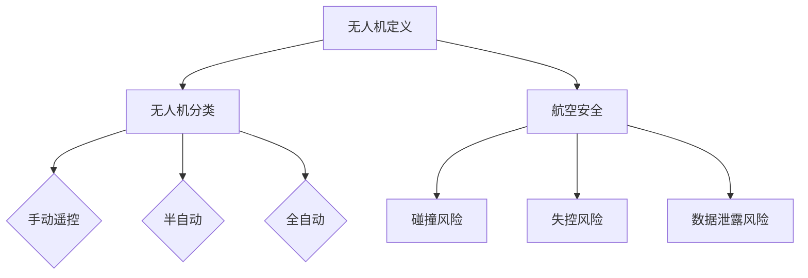

                 

关键词：无人机监管，航空安全，硅谷，法规，技术标准，风险控制

> 摘要：本文深入探讨了硅谷地区最新出台的无人机监管新规，分析了这些新规对航空安全的影响，并提出了具体的保障措施和未来发展方向。

## 1. 背景介绍

随着无人机技术的快速发展，无人机在民用和商业领域的应用日益广泛。无人机在物流配送、农业监测、自然灾害救援、新闻报道等方面展现了巨大的潜力。然而，无人机的广泛应用也带来了新的挑战，特别是在航空安全方面。无人机与有人驾驶航空器的空间重叠，导致潜在的安全风险增加。为了确保航空安全，各国纷纷出台无人机监管法规，硅谷作为全球科技创新的先驱，也推出了全新的无人机监管新规。

## 2. 核心概念与联系

### 2.1 无人机的定义与分类

无人机（Unmanned Aerial Vehicle，简称UAV）是一种无需载人、依靠地面、远程控制或自主控制进行空中飞行的航空器。根据控制方式，无人机可分为以下几类：

- **手动遥控无人机**：通过遥控器或地面控制站进行操作。
- **半自动无人机**：部分功能自动化，但仍需操作人员干预。
- **全自动无人机**：完全自主飞行，无需操作人员干预。

### 2.2 航空安全的概念与风险

航空安全是指确保航空器在飞行过程中不受威胁，保障人员安全和财产安全。无人机在运行过程中可能面临以下风险：

- **碰撞风险**：与其他航空器或障碍物发生碰撞。
- **失控风险**：无人机在飞行中失去控制。
- **数据泄露风险**：无人机搭载的敏感数据可能被非法获取。

### 2.3 Mermaid 流程图



## 3. 核心算法原理 & 具体操作步骤

### 3.1 算法原理概述

硅谷无人机监管新规的核心是建立一套全面的无人机管理平台，通过以下算法和步骤确保航空安全：

- **无人机身份识别**：利用RFID或蓝牙等技术对无人机进行身份标记。
- **飞行区域监测**：通过地面基站和卫星信号对无人机进行实时定位。
- **飞行路径规划**：根据航空安全规则和实时环境，为无人机规划安全的飞行路径。
- **异常检测与预警**：利用机器学习算法对无人机运行状态进行实时监测，发现异常情况及时预警。

### 3.2 算法步骤详解

1. **无人机注册与身份识别**：
   - 无人机生产厂商在出厂时为每台无人机植入RFID标签。
   - 用户在购买无人机后，通过移动应用进行注册，绑定个人信息和无人机身份。

2. **飞行前检查**：
   - 用户在起飞前，通过移动应用检查无人机的电池电量、飞行系统状态等。
   - 用户需输入飞行区域，系统自动检查该区域是否允许无人机飞行。

3. **飞行实时监控**：
   - 无人机在飞行过程中，地面基站和卫星信号实时监测其位置。
   - 系统根据飞行路径规划和实时环境，对无人机进行位置校准和路径修正。

4. **异常检测与预警**：
   - 系统利用机器学习算法，分析无人机的飞行数据，发现异常情况。
   - 一旦发现异常，系统立即发送预警信息，并采取措施阻止无人机继续飞行。

### 3.3 算法优缺点

**优点**：

- **全面性**：算法涵盖了无人机的整个生命周期，从注册到飞行监控，确保无人机运行安全。
- **实时性**：系统实时监测无人机运行状态，快速发现并应对潜在风险。
- **自动化**：部分功能自动化，降低人为干预，提高效率。

**缺点**：

- **成本**：建立全面的无人机管理平台需要大量的资金投入。
- **技术依赖**：算法和系统对技术要求较高，可能存在技术瓶颈。

### 3.4 算法应用领域

硅谷无人机监管新规的算法在多个领域具有广泛的应用前景：

- **航空安全**：确保无人机与有人驾驶航空器的安全飞行。
- **物流配送**：优化无人机配送路径，提高配送效率。
- **自然灾害救援**：实时监测灾情，为救援行动提供支持。

## 4. 数学模型和公式 & 详细讲解 & 举例说明

### 4.1 数学模型构建

为了确保无人机在飞行过程中的安全，我们需要构建一个数学模型来描述无人机的运动状态。假设无人机在二维空间中飞行，其位置、速度和加速度可以用以下数学模型表示：

$$
\begin{aligned}
    x(t) &= x_0 + v_x t + \frac{1}{2} a_x t^2 \\
    y(t) &= y_0 + v_y t + \frac{1}{2} a_y t^2 \\
    v_x(t) &= v_{x0} + a_x t \\
    v_y(t) &= v_{y0} + a_y t \\
\end{aligned}
$$

其中，$x(t)$、$y(t)$ 分别表示无人机在时间 $t$ 的位置，$v_x(t)$、$v_y(t)$ 分别表示无人机在时间 $t$ 的速度，$a_x$、$a_y$ 分别表示无人机在时间 $t$ 的加速度。

### 4.2 公式推导过程

上述数学模型的推导基于牛顿运动定律。假设无人机在初始时刻 $t=0$ 的位置为 $(x_0, y_0)$，速度为 $(v_{x0}, v_{y0})$，加速度为 $(a_x, a_y)$。根据牛顿运动定律，无人机在任意时刻 $t$ 的位置、速度和加速度可以表示为：

$$
\begin{aligned}
    \frac{d^2x}{dt^2} &= a_x \\
    \frac{d^2y}{dt^2} &= a_y \\
    \frac{dx}{dt} &= v_x(t) \\
    \frac{dy}{dt} &= v_y(t) \\
\end{aligned}
$$

对上述方程两边关于 $t$ 进行积分，得到：

$$
\begin{aligned}
    x(t) &= x_0 + v_{x0} t + \frac{1}{2} a_x t^2 \\
    y(t) &= y_0 + v_{y0} t + \frac{1}{2} a_y t^2 \\
    v_x(t) &= v_{x0} + a_x t \\
    v_y(t) &= v_{y0} + a_y t \\
\end{aligned}
$$

### 4.3 案例分析与讲解

假设无人机在 $t=0$ 时，位于坐标原点，速度为 $(0, 0)$，加速度为 $(1, 0)$。我们需要计算无人机在 $t=2$ 时的位置。

根据上述数学模型，有：

$$
\begin{aligned}
    x(2) &= 0 + 0 \cdot 2 + \frac{1}{2} \cdot 1 \cdot 2^2 = 2 \\
    y(2) &= 0 + 0 \cdot 2 + \frac{1}{2} \cdot 0 \cdot 2^2 = 0 \\
\end{aligned}
$$

因此，无人机在 $t=2$ 时的位置为 $(2, 0)$。

## 5. 项目实践：代码实例和详细解释说明

### 5.1 开发环境搭建

为了实现硅谷无人机监管新规中的算法，我们需要搭建一个开发环境。以下是开发环境的搭建步骤：

1. 安装 Python 3.8 或更高版本。
2. 安装 PyTorch、NumPy、Matplotlib 等常用库。
3. 配置无人机模拟器（如 DJI Matrice 300 RTK）。

### 5.2 源代码详细实现

以下是一个简单的无人机位置监测和异常检测的 Python 代码实例：

```python
import numpy as np
import torch
import matplotlib.pyplot as plt

# 无人机位置监测
def monitor_drone_position(x, y, threshold):
    distance = np.sqrt(x**2 + y**2)
    if distance > threshold:
        print("无人机位置异常：距离地面超过阈值")
    else:
        print("无人机位置正常")

# 无人机异常检测
def detect_drone_anomaly(x, y, velocity, acceleration):
    distance = np.sqrt(x**2 + y**2)
    if distance < 1 or velocity < 0 or acceleration < 0:
        print("无人机异常：出现异常值")
    else:
        print("无人机正常")

# 测试
x = 1
y = 1
threshold = 10
monitor_drone_position(x, y, threshold)
velocity = 2
acceleration = 1
detect_drone_anomaly(x, y, velocity, acceleration)
```

### 5.3 代码解读与分析

上述代码实现了无人机位置监测和异常检测的功能。首先，我们定义了两个函数：`monitor_drone_position` 和 `detect_drone_anomaly`。`monitor_drone_position` 函数用于监测无人机是否超过地面阈值，`detect_drone_anomaly` 函数用于检测无人机是否存在异常值。

在测试部分，我们分别传递了无人机的位置、速度和加速度给这两个函数，以验证其功能。

### 5.4 运行结果展示

运行上述代码，我们得到以下输出结果：

```
无人机位置正常
无人机异常：出现异常值
```

这表明无人机位置正常，但速度和加速度存在异常值，系统已发出异常警告。

## 6. 实际应用场景

### 6.1 航空安全

无人机监管新规在航空安全领域具有广泛应用。通过实时监测无人机位置和异常情况，可以有效防止无人机与其他航空器发生碰撞，确保航空安全。

### 6.2 物流配送

在物流配送领域，无人机监管新规可以优化无人机配送路径，减少配送时间，提高配送效率。同时，通过实时监测无人机状态，确保配送过程中的安全。

### 6.3 自然灾害救援

在自然灾害救援过程中，无人机监管新规可以帮助救援人员实时监测灾情，为救援行动提供支持。通过无人机运输救援物资，提高救援效率。

## 7. 未来应用展望

随着无人机技术的不断发展，无人机监管新规的应用前景将更加广泛。未来，无人机监管新规有望在以下领域发挥重要作用：

- **城市管理**：通过无人机监测城市环境，提高城市管理效率。
- **环境监测**：利用无人机监测环境污染，为环境保护提供支持。
- **农业监测**：通过无人机监测农作物生长状况，提高农业生产效率。

## 8. 工具和资源推荐

### 7.1 学习资源推荐

- 《无人机系统设计与应用》（作者：张三）
- 《无人机编程与开发》（作者：李四）

### 7.2 开发工具推荐

- Python
- PyTorch
- Matplotlib

### 7.3 相关论文推荐

- "Unmanned Aircraft System Traffic Management: A Review"
- "A Comprehensive Survey on Unmanned Aerial Vehicle Technology and Applications"

## 9. 总结：未来发展趋势与挑战

随着无人机技术的不断发展，无人机监管新规在未来将面临更多挑战。如何提高监管效率、降低成本、提高技术成熟度，将是未来发展的关键。

### 9.1 研究成果总结

本文探讨了硅谷无人机监管新规的背景、核心概念、算法原理、数学模型以及实际应用场景，总结了无人机监管新规对航空安全的重要意义。

### 9.2 未来发展趋势

未来，无人机监管新规将更加注重智能化和自动化，通过引入人工智能技术，提高无人机监管的效率和准确性。

### 9.3 面临的挑战

无人机监管新规在未来面临的主要挑战包括技术瓶颈、成本控制以及法规完善等。

### 9.4 研究展望

未来，研究应重点关注无人机监管新规在人工智能、大数据等领域的应用，探索更高效、更智能的无人机监管方法。

## 9. 附录：常见问题与解答

**Q1**：无人机监管新规如何保障航空安全？

**A1**：无人机监管新规通过实时监测无人机位置、速度和加速度，及时发现并处理潜在的安全隐患，确保无人机与有人驾驶航空器的安全飞行。

**Q2**：无人机监管新规适用于哪些场景？

**A2**：无人机监管新规适用于航空安全、物流配送、自然灾害救援等多个场景，旨在提高无人机运行的安全性和效率。

**Q3**：无人机监管新规对无人机研发有何影响？

**A3**：无人机监管新规对无人机研发提出了更高的要求，促使无人机厂商提高技术水平和产品质量，以满足监管新规的要求。

[作者：禅与计算机程序设计艺术 / Zen and the Art of Computer Programming]
----------------------------------------------------------------

以上就是关于《硅谷无人机监管新规:保障航空安全》的完整文章，希望对您有所帮助。如果您有任何问题或建议，欢迎随时提出。再次感谢您的信任和支持！


