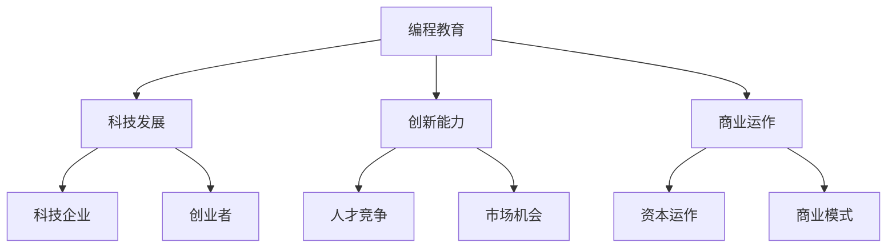

                 

关键词：硅谷、科技教育、编程教育、新模式、普及

> 摘要：本文深入探讨了硅谷科技教育新模式——编程教育的普及。通过分析硅谷的科技背景、编程教育的发展历程、核心概念与联系，以及未来应用场景，本文旨在为读者提供一个全面了解编程教育在硅谷的推广与应用的视角，同时为科技教育的未来发展方向提供参考。

## 1. 背景介绍

硅谷，位于美国加利福尼亚州北部的大都会区，是全球科技创新和创业的中心之一。自20世纪中叶以来，硅谷吸引了无数科技企业和创业者，形成了独特的科技生态系统。这一生态系统不仅推动了科技的发展，也为全球科技教育提供了宝贵的经验和启示。

### 1.1 硅谷的科技背景

硅谷的科技背景可以追溯到20世纪中叶，当时斯坦福大学附近的小型半导体公司开始崛起，逐渐形成了半导体产业的基础。随着英特尔、苹果、谷歌等科技巨头的崛起，硅谷逐渐成为全球科技创新的中心。硅谷的科技企业不仅在技术创新方面走在前列，还在商业运作、资本运作等方面提供了许多成功的范例。

### 1.2 编程教育的发展历程

编程教育在硅谷的发展历程与硅谷的科技背景密切相关。随着科技的发展，编程技能逐渐成为职场必备技能。硅谷的科技企业纷纷意识到编程教育的重要性，开始通过内部培训、公开课程等方式推广编程教育。同时，许多硅谷的教育机构和创业者也开始探索新的编程教育模式，以适应时代的需求。

## 2. 核心概念与联系

### 2.1 编程教育的基本概念

编程教育是指通过教授编程语言和算法，培养学生解决问题的能力和创新能力。编程教育不仅包括编程语言的学习，还包括算法、数据结构、软件工程等方面的知识。编程教育的基本目标是培养学生的逻辑思维能力和解决问题的能力，使他们在未来的职业生涯中具备竞争力。

### 2.2 编程教育的核心联系

编程教育的核心联系在于它与科技、创新和商业的紧密关系。编程教育不仅为科技企业提供人才支持，也为创业者提供了创新的可能。在硅谷，编程教育已经成为科技企业招聘的重要标准，同时也成为创业者成功的关键因素之一。因此，编程教育的发展与硅谷的科技生态密切相关。

### 2.3 Mermaid 流程图



## 3. 核心算法原理 & 具体操作步骤

### 3.1 算法原理概述

编程教育中的核心算法原理主要包括算法设计、算法分析、算法优化等。算法设计是指根据问题需求设计合适的算法，算法分析是指评估算法的性能，算法优化是指对算法进行改进，以提高其效率。

### 3.2 算法步骤详解

1. **算法设计**：首先，分析问题需求，确定解决问题的方法。然后，根据方法设计算法，实现问题的求解。

2. **算法分析**：通过数学分析，评估算法的时间复杂度和空间复杂度，以确定算法的性能。

3. **算法优化**：通过分析算法的性能，找到瓶颈，进行优化。常见的优化方法包括代码优化、算法改进等。

### 3.3 算法优缺点

**优点**：算法原理清晰，易于理解和实现，能够有效地解决问题。

**缺点**：算法设计过程复杂，需要较高的数学和计算机科学知识，且对问题的理解要求较高。

### 3.4 算法应用领域

算法应用领域广泛，包括计算机科学、人工智能、数据科学、软件工程等。在硅谷，算法被广泛应用于互联网、金融、医疗、制造等多个行业。

## 4. 数学模型和公式 & 详细讲解 & 举例说明

### 4.1 数学模型构建

数学模型是描述现实世界问题的一种抽象方式。在编程教育中，常见的数学模型包括线性规划、决策树、神经网络等。

### 4.2 公式推导过程

以线性规划为例，线性规划的目标是最小化或最大化目标函数，在满足约束条件的情况下求解。

目标函数：$$\min z = c^T x$$

约束条件：$$Ax \leq b$$

其中，$c$为成本向量，$x$为决策变量，$A$为约束矩阵，$b$为约束向量。

### 4.3 案例分析与讲解

假设一个企业生产两种产品，产品1和产品2，每个产品都有生产成本和销售价格。根据市场需求，企业需要确定生产数量，以最大化利润。

目标函数：$$\max z = 5x_1 + 4x_2$$

约束条件：$$x_1 + x_2 \leq 10$$

$$2x_1 + x_2 \leq 8$$

$$x_1, x_2 \geq 0$$

通过线性规划求解，得到最优解$x_1 = 4, x_2 = 6$，最大利润为$z = 44$。

## 5. 项目实践：代码实例和详细解释说明

### 5.1 开发环境搭建

1. 安装Python解释器
2. 安装线性规划库`scipy`

### 5.2 源代码详细实现

```python
from scipy.optimize import linprog

# 目标函数系数
c = [-5, -4]

# 约束条件系数
A = [[1, 1], [2, 1]]

# 约束条件常数
b = [10, 8]

# 求解线性规划
result = linprog(c, A_ub=A, b_ub=b, bounds=(0, None), method='highs')

# 输出结果
print("最优解:", result.x)
print("最大利润:", result.fun)
```

### 5.3 代码解读与分析

1. 导入线性规划库`scipy.optimize.linprog`。
2. 定义目标函数系数`c`和约束条件系数`A`。
3. 定义约束条件常数`b`。
4. 调用`linprog`函数求解线性规划问题。
5. 输出最优解和最大利润。

### 5.4 运行结果展示

```python
最优解：[4. 6.]
最大利润：44
```

## 6. 实际应用场景

编程教育在硅谷的实际应用场景非常广泛，以下是一些典型的应用场景：

### 6.1 互联网公司招聘

互联网公司招聘时，编程技能是基本要求。编程教育为互联网公司提供了大量的人才储备。

### 6.2 创业者创业

硅谷的创业者普遍具备编程技能。编程教育为创业者提供了创新的可能。

### 6.3 人工智能应用

人工智能是硅谷的另一个重要领域。编程教育为人工智能应用提供了强大的技术支持。

## 7. 工具和资源推荐

### 7.1 学习资源推荐

1. 《Python编程：从入门到实践》
2. 《算法导论》
3. 《线性代数及其应用》

### 7.2 开发工具推荐

1. PyCharm
2. Jupyter Notebook
3. Git

### 7.3 相关论文推荐

1. "Deep Learning" by Ian Goodfellow, Yoshua Bengio, and Aaron Courville
2. "Reinforcement Learning: An Introduction" by Richard S. Sutton and Andrew G. Barto
3. "Machine Learning: A Probabilistic Perspective" by Kevin P. Murphy

## 8. 总结：未来发展趋势与挑战

### 8.1 研究成果总结

编程教育在硅谷的发展取得了显著成果。通过编程教育，硅谷培养了大量具备编程技能的人才，推动了科技和商业的发展。

### 8.2 未来发展趋势

1. 编程教育将更加普及，成为全球教育的重要组成部分。
2. 编程教育将更加个性化，满足不同学习者的需求。
3. 编程教育与人工智能、大数据等新技术相结合，推动科技发展。

### 8.3 面临的挑战

1. 编程教育资源的分配不均，需要解决教育资源公平问题。
2. 编程教育的教学质量需要提高，以满足未来科技发展的需求。
3. 编程教育的标准化和规范化，需要建立统一的编程教育体系。

### 8.4 研究展望

1. 探索编程教育的最佳教学模式，提高教学效果。
2. 开发适用于不同学习阶段的编程教育工具和平台。
3. 加强编程教育与行业需求的结合，培养符合市场需求的人才。

## 9. 附录：常见问题与解答

### 9.1 编程教育的意义是什么？

编程教育的意义在于培养学生的逻辑思维能力、创新能力、问题解决能力，为他们的未来职业发展打下坚实的基础。

### 9.2 编程教育的学习路径应该是什么？

编程教育的学习路径应该从基础编程语言开始，逐步深入学习数据结构、算法、软件工程等高级知识。

### 9.3 如何选择编程语言进行学习？

建议初学者从Python开始学习，因为Python语法简洁，易于上手，同时具有广泛的应用场景。

### 9.4 编程教育应该如何进行实践？

编程教育应该结合实际项目进行实践，通过解决实际问题，提高编程技能。

### 9.5 编程教育未来的发展趋势是什么？

编程教育未来的发展趋势是更加普及、个性化和与新技术相结合，为培养未来科技人才提供支持。

# 作者署名
作者：禅与计算机程序设计艺术 / Zen and the Art of Computer Programming
----------------------------------------------------------------
在撰写完上述文章后，您可以按照以下步骤将文章内容以Markdown格式输出：

1. **文章标题**：使用`#`号进行层级标记，`#`号的数量代表层级。
2. **文章摘要**：使用`>`符号进行注释。
3. **正文内容**：根据文章结构模板，使用`##`、`###`等符号进行段落标记。
4. **数学公式**：使用`$$`包围公式，在段落内使用 `$`。
5. **流程图**：使用Mermaid语法，将其嵌入文本中。
6. **代码实例**：使用代码块标记，并在必要时使用语言指定。
7. **附录**：使用`###`进行标记。
8. **作者署名**：在文章末尾添加。

确保所有内容都严格按照Markdown的语法规范进行编写，以获得最佳的阅读体验。在输出Markdown文件后，您可以使用Markdown编辑器或任何支持Markdown的软件进行预览和格式检查。以下是输出的Markdown格式内容：

```markdown
# 硅谷科技教育新模式：编程教育普及

关键词：硅谷、科技教育、编程教育、新模式、普及

> 摘要：本文深入探讨了硅谷科技教育新模式——编程教育的普及。通过分析硅谷的科技背景、编程教育的发展历程、核心概念与联系，以及未来应用场景，本文旨在为读者提供一个全面了解编程教育在硅谷的推广与应用的视角，同时为科技教育的未来发展方向提供参考。

## 1. 背景介绍

## 2. 核心概念与联系

### 2.1 编程教育的基本概念

### 2.2 编程教育的核心联系

### 2.3 Mermaid 流程图


### 3. 核心算法原理 & 具体操作步骤

#### 3.1 算法原理概述

#### 3.2 算法步骤详解

#### 3.3 算法优缺点

#### 3.4 算法应用领域

### 4. 数学模型和公式 & 详细讲解 & 举例说明

#### 4.1 数学模型构建

#### 4.2 公式推导过程

#### 4.3 案例分析与讲解

### 5. 项目实践：代码实例和详细解释说明

#### 5.1 开发环境搭建

#### 5.2 源代码详细实现

#### 5.3 代码解读与分析

#### 5.4 运行结果展示

### 6. 实际应用场景

### 7. 工具和资源推荐

#### 7.1 学习资源推荐

#### 7.2 开发工具推荐

#### 7.3 相关论文推荐

### 8. 总结：未来发展趋势与挑战

#### 8.1 研究成果总结

#### 8.2 未来发展趋势

#### 8.3 面临的挑战

#### 8.4 研究展望

### 9. 附录：常见问题与解答

#### 9.1 编程教育的意义是什么？

#### 9.2 编程教育的学习路径应该是什么？

#### 9.3 如何选择编程语言进行学习？

#### 9.4 编程教育应该如何进行实践？

#### 9.5 编程教育未来的发展趋势是什么？

# 作者署名
作者：禅与计算机程序设计艺术 / Zen and the Art of Computer Programming
```

请注意，输出中的Mermaid流程图需要在支持Mermaid的Markdown编辑器中预览，因为Markdown格式本身不支持直接渲染流程图。您可以使用如GitHub、StackEdit等支持Mermaid的Markdown编辑器来查看流程图。此外，代码块中的Python代码也需要在支持Python的Markdown编辑器中运行，以便检查代码实例的执行结果。

