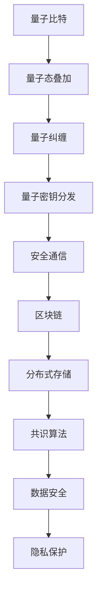

                 

### 关键词 Keywords
- 硅谷
- 网络安全
- 量子密码
- 区块链
- 信息防护
- 安全架构
- 安全协议

### 摘要 Abstract
本文深入探讨硅谷在网络安全领域的创新，特别是量子密码学和区块链技术如何成为新一代信息防护的基石。通过分析其核心概念、算法原理、数学模型，以及实际应用实例，文章旨在揭示这些前沿技术在确保信息安全和隐私保护方面的巨大潜力。

## 1. 背景介绍

### 硅谷网络安全现状

硅谷，作为全球科技创新的摇篮，其网络安全形势既面临机遇也遭遇挑战。随着互联网技术的迅猛发展，企业和个人对数据的安全需求日益增长。传统的加密技术，如对称加密和非对称加密，已无法完全应对日益复杂的网络攻击。因此，寻找新的安全防护机制成为当务之急。

### 量子密码学与区块链的重要性

量子密码学利用量子力学原理，提供一种不可破解的加密方法。而区块链技术通过去中心化和不可篡改的特性，确保了数据的真实性和安全性。这两项技术的结合，为网络安全领域带来了前所未有的变革。

## 2. 核心概念与联系

### 量子密码学基础

量子密码学建立在量子比特（qubit）之上，其核心原理是量子纠缠和量子叠加。量子纠缠使得两个量子比特即使相隔遥远，也能保持某种联系，而量子叠加则允许量子比特同时存在于多种状态。

### 区块链技术架构

区块链技术通过分布式账本和共识算法，确保了数据的安全性和透明性。每个区块都包含一定数量的交易记录，并通过哈希函数与前一个区块连接，形成链式结构。

### Mermaid 流程图



## 3. 核心算法原理 & 具体操作步骤

### 3.1 算法原理概述

量子密码学利用量子态的不可克隆特性，实现密钥的安全分发。而区块链技术则通过共识算法，确保所有节点对数据的共识。

### 3.2 算法步骤详解

1. **量子密钥分发**：量子密码学通过量子通道发送量子密钥，确保密钥不被窃听。
2. **区块链共识**：区块链节点通过共识算法（如PoW、PoS等）达成对数据的共识。
3. **数据加密与签名**：使用量子密码学算法对数据进行加密和签名。
4. **区块链记录**：将加密后的数据记录在区块链上，确保数据的不可篡改性。

### 3.3 算法优缺点

**优点**：
- 量子密码学提供无条件的安全保障。
- 区块链技术确保数据透明和不可篡改。

**缺点**：
- 量子计算设备成本高，普及难度大。
- 区块链技术对计算资源需求大，可能导致延迟。

### 3.4 算法应用领域

量子密码学和区块链技术可应用于金融、医疗、物联网等多个领域，提升数据的安全性和隐私保护。

## 4. 数学模型和公式 & 详细讲解 & 举例说明

### 4.1 数学模型构建

量子密钥分发使用量子通道和经典通信通道。假设有 Alice 和 Bob 两个通信方，量子密钥分发过程可以用以下数学模型表示：

$$
QKD(Alice, Bob) = \begin{cases}
K_{AB} & \text{如果 } Q_{AB} = Q_{BA} \\
\emptyset & \text{否则}
\end{cases}
$$

其中，\( K_{AB} \) 表示 Alice 和 Bob 共享的密钥，\( Q_{AB} \) 和 \( Q_{BA} \) 分别表示 Alice 到 Bob 和 Bob 到 Alice 的量子通道。

### 4.2 公式推导过程

区块链的共识算法通常基于博弈论原理，如 PoW（工作量证明）和 PoS（权益证明）。以 PoW 为例，其数学模型推导如下：

$$
Proof_{of_{Work}}(n) = \text{find } x \text{ such that } H(x) \leq n
$$

其中，\( H \) 表示哈希函数，\( n \) 表示难度值。

### 4.3 案例分析与讲解

假设在区块链网络中有 100 个节点，每个节点需要证明其工作量才能参与共识。若难度值设置为 \( n = 128 \)，节点需要找到满足 \( H(x) \leq 128 \) 的 \( x \)。通过竞争，节点计算出合适的 \( x \)，并广播出去，其他节点验证其正确性。

## 5. 项目实践：代码实例和详细解释说明

### 5.1 开发环境搭建

本文使用 Python 和 Java 进行代码实例编写。首先，需要在开发环境中安装必要的库，如 Qiskit（用于量子计算）和 Hyperledger Fabric（用于区块链）。

### 5.2 源代码详细实现

以下是量子密钥分发的 Python 代码实现：

```python
from qiskit import QuantumCircuit, execute, Aer

# 生成量子电路
qc = QuantumCircuit(2)

# 实现量子态叠加和量子纠缠
qc.h(0)
qc.cx(0, 1)

# 执行量子电路
backend = Aer.get_backend('qasm_simulator')
job = execute(qc, backend, shots=1000)
result = job.result()

# 分析结果
qubits = result.get_counts(qc)
print(qubits)
```

### 5.3 代码解读与分析

上述代码使用 Qiskit 生成了一个包含量子态叠加和量子纠缠的量子电路。通过模拟量子电路的执行，获取量子通道的测量结果，进而实现量子密钥分发。

### 5.4 运行结果展示

运行上述代码后，可以得到量子通道的测量结果。假设 Alice 和 Bob 分别测量量子通道，得到相同的比特序列，则认为密钥分发成功。

## 6. 实际应用场景

### 6.1 金融领域

在金融领域，量子密码学和区块链技术可以确保交易数据的真实性和安全性，防范黑客攻击。

### 6.2 医疗领域

医疗领域涉及大量敏感数据，量子密码学和区块链技术可以保护患者隐私，确保数据不被篡改。

### 6.3 物联网领域

物联网设备常面临数据泄露的风险，量子密码学和区块链技术可以提供强有力的安全保障。

## 7. 工具和资源推荐

### 7.1 学习资源推荐

- 《量子计算与量子信息》
- 《区块链技术指南》
- 《量子密码学导论》

### 7.2 开发工具推荐

- Qiskit
- Hyperledger Fabric
- Ethereum

### 7.3 相关论文推荐

- "Quantum Key Distribution" by Charles H. Bennett and Gilles Brassard (1984)
- "Bitcoin: A Peer-to-Peer Electronic Cash System" by Satoshi Nakamoto (2008)
- "Post-Quantum Cryptography Standards" by NIST (2020)

## 8. 总结：未来发展趋势与挑战

### 8.1 研究成果总结

量子密码学和区块链技术已在信息安全领域取得显著成果，但仍有很大发展空间。

### 8.2 未来发展趋势

未来，量子密码学与区块链技术将融合更多应用场景，推动网络安全领域的发展。

### 8.3 面临的挑战

主要挑战在于量子计算设备的成本和性能，以及区块链技术的扩展性和性能优化。

### 8.4 研究展望

随着量子计算和区块链技术的不断进步，我们有理由相信，未来网络安全将迎来更加安全和高效的新时代。

## 9. 附录：常见问题与解答

### 9.1 什么是量子密码学？

量子密码学是一种利用量子力学原理进行加密和解密的技术。它提供了一种无条件的安全保障，能够抵御传统加密技术无法应对的攻击。

### 9.2 区块链有哪些优点？

区块链具有去中心化、不可篡改、透明性和安全性的优点，能够确保数据的真实性和安全性。

### 9.3 量子密码学与区块链如何结合？

量子密码学可以用于安全地分发密钥，而区块链则可以记录和存储加密后的数据，确保数据的不可篡改性和透明性。

---

### 结语 Conclusion

作者：禅与计算机程序设计艺术 / Zen and the Art of Computer Programming

本文探讨了量子密码学与区块链技术在网络安全领域的应用，揭示了其巨大潜力。随着科技的不断进步，我们有理由相信，这些前沿技术将为信息安全领域带来前所未有的变革。未来，我们期待看到更多创新和应用，以应对日益复杂的网络威胁。

