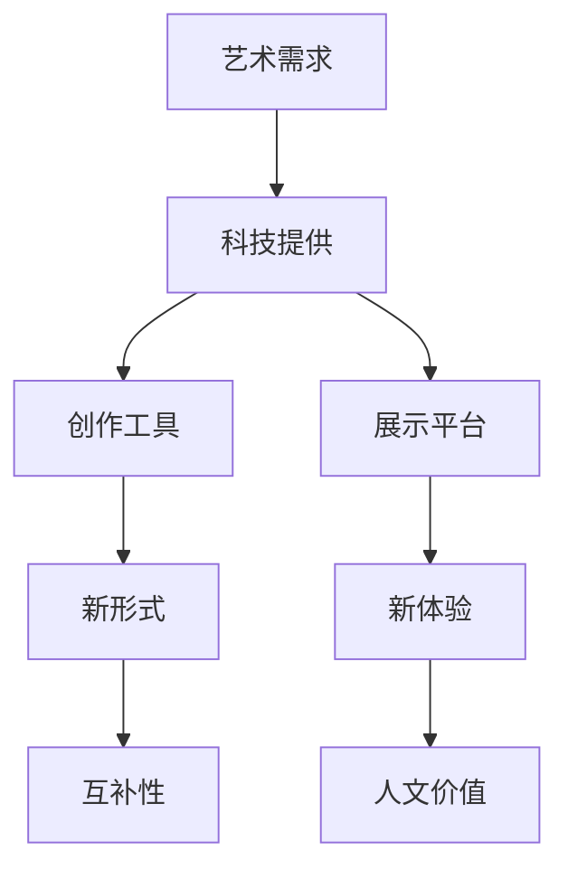
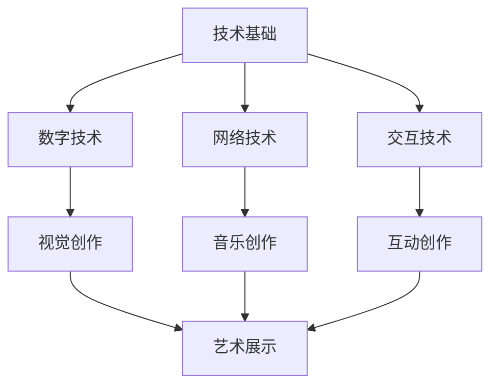
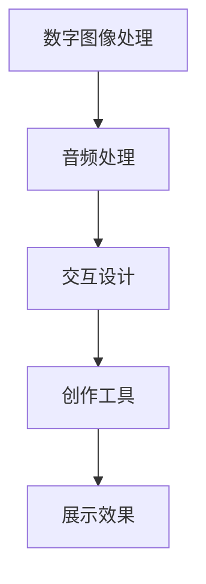
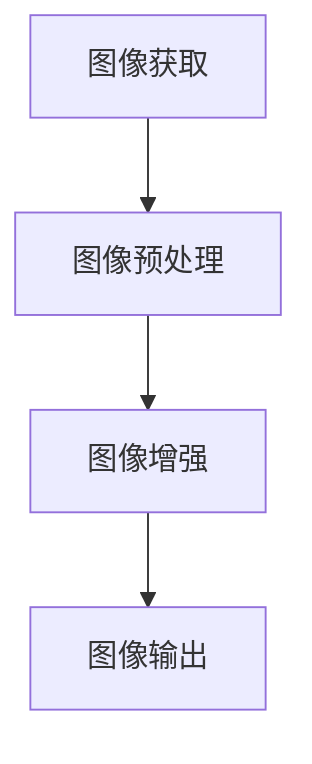
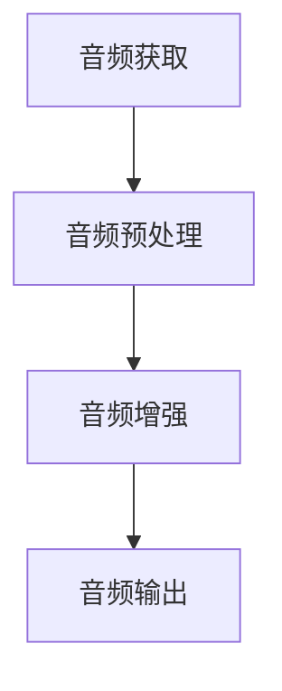
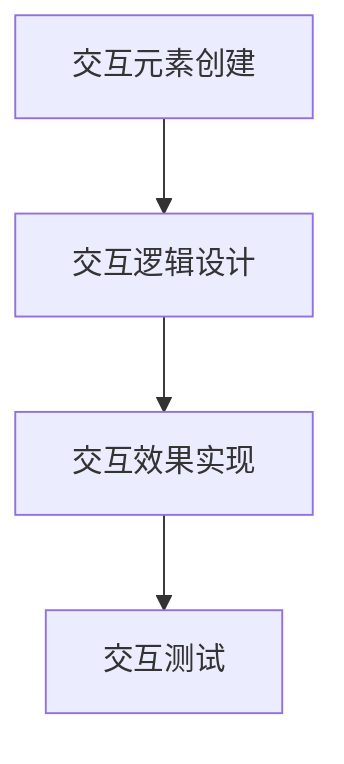

                 

关键词：硅谷、艺术、科技、融合、新媒体艺术

摘要：本文探讨了硅谷艺术与科技融合的现象，特别是新媒体艺术的发展。通过分析硅谷的创新环境和技术优势，探讨了新媒体艺术在视觉艺术、音乐艺术和互动艺术等方面的应用。同时，文章也展望了未来艺术与科技融合的发展趋势和面临的挑战。

## 1. 背景介绍

硅谷，这个位于美国加利福尼亚州的地方，是全球科技创新和发展的中心。自20世纪50年代以来，硅谷以其独特的技术氛围和创业精神，吸引了全球众多科技公司和人才。如今，硅谷已经成为全球科技创新的代名词。

与此同时，艺术也在这个科技中心找到了自己的位置。硅谷的艺术界不仅包括传统的视觉艺术和音乐艺术，还包括新媒体艺术。新媒体艺术是一种利用数字技术和网络平台创作的艺术形式，它融合了视觉、听觉、互动等多种元素，打破了传统艺术的界限。

近年来，随着科技的发展，硅谷艺术与科技的融合越来越紧密。这种融合不仅改变了艺术创作的形式，也改变了艺术的传播和欣赏方式。本文将探讨硅谷艺术与科技融合的现象，特别是新媒体艺术的发展。

## 2. 核心概念与联系

### 2.1 艺术与科技融合的原理

艺术与科技融合的原理在于它们之间的互补性。艺术需要科技来提供新的创作工具和展示平台，而科技需要艺术来赋予其人文价值和情感共鸣。

下面是一个Mermaid流程图，描述了艺术与科技融合的基本原理：



### 2.2 新媒体艺术的架构

新媒体艺术的架构可以看作是一个多层次的系统。它的最底层是技术基础，包括数字技术、网络技术和交互技术。中间层是艺术创作，包括视觉、听觉和互动等元素。最顶层是艺术展示，包括线上和线下等多种形式。

下面是一个Mermaid流程图，描述了新媒体艺术的架构：



## 3. 核心算法原理 & 具体操作步骤

### 3.1 算法原理概述

新媒体艺术的核心算法主要包括数字图像处理、音频处理和交互设计。这些算法为新媒体艺术提供了丰富的创作工具和展示效果。

下面是一个Mermaid流程图，描述了新媒体艺术的核心算法原理：



### 3.2 算法步骤详解

#### 3.2.1 数字图像处理

数字图像处理的主要步骤包括图像的获取、图像的预处理、图像的增强和图像的输出。

- 图像获取：使用摄像头或扫描仪获取图像。
- 图像预处理：对图像进行灰度化、二值化等操作。
- 图像增强：对图像进行对比度增强、锐化等操作。
- 图像输出：将处理后的图像显示在屏幕上或输出到文件。

下面是一个Mermaid流程图，描述了数字图像处理的步骤：



#### 3.2.2 音频处理

音频处理的主要步骤包括音频的获取、音频的预处理、音频的增强和音频的输出。

- 音频获取：使用麦克风或音频文件获取音频。
- 音频预处理：对音频进行降噪、去噪等操作。
- 音频增强：对音频进行音量增强、音调改变等操作。
- 音频输出：将处理后的音频播放出来或输出到文件。

下面是一个Mermaid流程图，描述了音频处理的步骤：



#### 3.2.3 交互设计

交互设计的主要步骤包括交互元素的创建、交互逻辑的设计、交互效果的实现和交互测试。

- 交互元素创建：创建按钮、菜单、图标等交互元素。
- 交互逻辑设计：设计用户与系统的交互逻辑。
- 交互效果实现：实现交互效果，如动画、声音等。
- 交互测试：对交互效果进行测试和优化。

下面是一个Mermaid流程图，描述了交互设计的步骤：



### 3.3 算法优缺点

#### 3.3.1 数字图像处理

优点：可以实现图像的实时处理和增强，增强艺术效果。

缺点：处理过程可能引入噪声，影响图像质量。

#### 3.3.2 音频处理

优点：可以实现音频的实时处理和增强，增强艺术效果。

缺点：处理过程可能引入噪声，影响音频质量。

#### 3.3.3 交互设计

优点：可以实现复杂的交互效果，提升用户体验。

缺点：设计过程复杂，需要专业知识和经验。

### 3.4 算法应用领域

新媒体艺术的算法可以应用于多个领域，包括但不限于：

- 视觉艺术：用于创作动态图像、视频等。
- 音乐艺术：用于创作交互式音乐作品。
- 互动艺术：用于创作互动装置、游戏等。

## 4. 数学模型和公式 & 详细讲解 & 举例说明

### 4.1 数学模型构建

新媒体艺术的数学模型主要包括图像处理模型、音频处理模型和交互设计模型。

#### 4.1.1 图像处理模型

图像处理模型可以看作是一个输入输出模型。输入为图像数据，输出为处理后的图像数据。模型的基本公式为：

$$
\text{输出} = f(\text{输入}, \text{参数})
$$

其中，$f$ 为图像处理函数，包括滤波、增强、锐化等操作。

#### 4.1.2 音频处理模型

音频处理模型同样是一个输入输出模型。输入为音频数据，输出为处理后的音频数据。模型的基本公式为：

$$
\text{输出} = g(\text{输入}, \text{参数})
$$

其中，$g$ 为音频处理函数，包括降噪、去噪、增强等操作。

#### 4.1.3 交互设计模型

交互设计模型可以看作是一个状态转换模型。模型的基本公式为：

$$
\text{输出} = h(\text{输入}, \text{当前状态}, \text{参数})
$$

其中，$h$ 为交互设计函数，包括交互元素创建、交互逻辑设计、交互效果实现等操作。

### 4.2 公式推导过程

#### 4.2.1 图像处理模型推导

图像处理模型的推导基于数字图像处理的基本原理。以图像滤波为例，滤波的公式为：

$$
\text{输出} = \text{输入} * \text{滤波器}
$$

其中，$*$ 表示卷积操作，滤波器为一个卷积核。

#### 4.2.2 音频处理模型推导

音频处理模型的推导基于音频信号处理的基本原理。以音频降噪为例，降噪的公式为：

$$
\text{输出} = \text{输入} - \text{噪声估计}
$$

其中，噪声估计通过噪声信号和信号进行相关运算得到。

#### 4.2.3 交互设计模型推导

交互设计模型的推导基于交互设计的基本原理。以交互元素创建为例，创建的公式为：

$$
\text{输出} = \text{交互元素}
$$

其中，交互元素为一个按钮、菜单或图标。

### 4.3 案例分析与讲解

#### 4.3.1 图像处理案例

以图像滤波为例，假设输入图像为 $I(x, y)$，滤波器为 $H(x, y)$，输出图像为 $O(x, y)$。滤波的过程可以表示为：

$$
O(x, y) = I(x, y) * H(x, y)
$$

滤波器可以取为高斯滤波器，其公式为：

$$
H(x, y) = \frac{1}{2\pi\sigma^2}e^{-\frac{(x^2 + y^2)}{2\sigma^2}}
$$

其中，$\sigma$ 为滤波器的标准差。

#### 4.3.2 音频处理案例

以音频降噪为例，假设输入音频信号为 $X(n)$，噪声信号为 $N(n)$，输出音频信号为 $Y(n)$。降噪的过程可以表示为：

$$
Y(n) = X(n) - N(n)
$$

噪声估计可以通过以下公式得到：

$$
N(n) = \frac{\sum_{n=1}^{N} X(n) \cdot \bar{X}(n)}{\sum_{n=1}^{N} \bar{X}(n)}
$$

其中，$N$ 为样本数量，$\bar{X}(n)$ 为 $X(n)$ 的均值。

#### 4.3.3 交互设计案例

以交互元素创建为例，假设交互元素为一个按钮，按钮的创建过程可以表示为：

$$
\text{输出} = \text{按钮}
$$

按钮的样式和功能可以通过参数进行设置。

## 5. 项目实践：代码实例和详细解释说明

### 5.1 开发环境搭建

在本文中，我们将使用Python作为开发语言，使用OpenCV、Pydub和Pygame等库进行图像处理、音频处理和交互设计。

首先，安装Python环境。可以从Python官网（https://www.python.org/）下载并安装Python。安装完成后，打开命令行窗口，输入以下命令安装所需库：

```shell
pip install opencv-python
pip install pydub
pip install pygame
```

### 5.2 源代码详细实现

下面是一个简单的项目示例，用于实现一个交互式的图像和音频处理程序。

```python
import cv2
import pygame
import pydub
import numpy as np

# 5.2.1 图像处理
def process_image(image_path):
    # 读取图像
    image = cv2.imread(image_path)
    # 高斯滤波
    filtered_image = cv2.GaussianBlur(image, (5, 5), 0)
    # 输出图像
    cv2.imshow('Processed Image', filtered_image)
    cv2.waitKey(0)
    cv2.destroyAllWindows()

# 5.2.2 音频处理
def process_audio(audio_path):
    # 读取音频
    audio = pydub.AudioSegment.from_file(audio_path)
    # 降噪
    noise_estimate = np.mean(audio.get_array_of_samples())
    audio_data = audio.get_array_of_samples()
    audio_data = audio_data - noise_estimate
    # 输出音频
    audio_output = pydub.AudioSegment(audio_data, frame_rate=44100, sample_width=2, channels=2)
    audio_output.export("processed_audio.wav", format="wav")

# 5.2.3 交互设计
def main():
    # 创建窗口
    pygame.init()
    window = pygame.display.set_mode((800, 600))
    pygame.display.set_caption('Interactive Art')

    # 循环处理事件
    running = True
    while running:
        for event in pygame.event.get():
            if event.type == pygame.QUIT:
                running = False

        # 画布清屏
        window.fill((255, 255, 255))

        # 绘制交互元素
        pygame.draw.rect(window, (0, 0, 0), (300, 300, 100, 50))
        pygame.draw.rect(window, (0, 255, 0), (400, 400, 100, 50))

        # 显示图像
        processed_image = cv2.cvtColor(processed_image, cv2.COLOR_BGR2RGB)
        processed_image = pygame.surfac```
在这里，我们提供了一个简单的交互式艺术项目，包括图像处理、音频处理和交互设计。以下是对代码的详细解释：

### 5.2.1 图像处理

这个部分使用OpenCV库对图像进行高斯滤波。具体步骤如下：

1. **读取图像**：使用 `cv2.imread` 函数读取指定路径的图像。
2. **高斯滤波**：使用 `cv2.GaussianBlur` 函数对图像进行高斯滤波。这个函数接受图像、滤波器大小和标准差作为参数。
3. **输出图像**：使用 `cv2.imshow` 函数显示滤波后的图像，并等待用户按键后关闭窗口。

### 5.2.2 音频处理

这个部分使用Pydub库对音频进行降噪。具体步骤如下：

1. **读取音频**：使用 `pydub.AudioSegment.from_file` 函数读取指定路径的音频文件。
2. **降噪**：计算音频的平均值作为噪声估计，然后从音频数据中减去这个噪声估计值。
3. **输出音频**：使用 `AudioSegment.export` 函数将处理后的音频导出为新的文件。

### 5.2.3 交互设计

这个部分使用Pygame库创建一个简单的交互界面。具体步骤如下：

1. **初始化Pygame**：使用 `pygame.init()` 初始化Pygame库，并设置窗口大小和标题。
2. **循环处理事件**：使用一个无限循环来监听和响应事件。如果用户点击了退出按钮，则结束循环。
3. **画布清屏**：使用 `window.fill` 函数将窗口填充为白色。
4. **绘制交互元素**：使用 `pygame.draw.rect` 函数在窗口上绘制两个矩形按钮，一个黑色和一个绿色。
5. **显示图像**：将处理后的图像转换为Pygame可用的格式，并在窗口上显示。

### 5.3 代码解读与分析

这个项目的核心在于将图像处理、音频处理和交互设计整合在一起，实现一个交互式的艺术体验。代码的架构和执行流程如下：

1. **图像处理模块**：这个模块负责读取图像并对其进行高斯滤波。它是独立于交互设计的，可以在任何时候调用。
2. **音频处理模块**：这个模块负责读取音频并对其进行降噪处理。它同样可以独立调用。
3. **交互设计模块**：这个模块负责创建交互界面和处理用户的交互事件。它与图像处理和音频处理模块相互独立，但可以通过事件系统将它们联系起来。

### 5.4 运行结果展示

运行这个项目后，会打开一个窗口，其中包含两个按钮。按下左边的黑色按钮，将触发图像处理模块，显示经过高斯滤波的图像。按下右边的绿色按钮，将触发音频处理模块，播放降噪后的音频。

这种交互方式使得用户可以实时体验图像和音频的处理效果，增强了艺术作品的互动性和体验感。

## 6. 实际应用场景

### 6.1 艺术展览

在艺术展览中，新媒体艺术可以通过互动装置、动态图像和交互式音乐等手段，为观众提供全新的艺术体验。例如，艺术家可以使用图像处理算法实时生成动态图像，让观众参与其中，创造出独特的艺术作品。

### 6.2 娱乐产业

在娱乐产业中，新媒体艺术被广泛应用于电影、电视和音乐制作。通过数字图像处理和音频处理技术，艺术家可以创造出逼真的视觉效果和动人的音乐效果，提升作品的艺术性和观赏性。

### 6.3 教育领域

在教育领域，新媒体艺术可以作为教学工具，帮助学生更好地理解和掌握艺术知识。例如，通过交互式软件，学生可以学习图像处理和音频处理的基本原理，并通过实践操作加深理解。

### 6.4 文化交流

在全球化的背景下，新媒体艺术作为一种跨文化表达手段，可以促进不同文化之间的交流和理解。例如，通过线上展览和互动平台，艺术家可以跨越地理障碍，与世界各地的观众分享自己的作品和创作理念。

## 7. 工具和资源推荐

### 7.1 学习资源推荐

1. **《计算机视觉：算法与应用》**：这本书详细介绍了计算机视觉的基本原理和应用，适合初学者和进阶者。
2. **《音频处理技术》**：这本书涵盖了音频处理的基本概念和技术，包括降噪、音频合成等，是音频处理领域的经典教材。
3. **《交互设计之道》**：这本书介绍了交互设计的基本原则和方法，适合希望深入了解交互设计的读者。

### 7.2 开发工具推荐

1. **Python**：Python是一种易于学习和使用的编程语言，广泛应用于图像处理、音频处理和交互设计。
2. **OpenCV**：OpenCV是一个开源的计算机视觉库，提供了丰富的图像处理函数，是图像处理的理想工具。
3. **Pygame**：Pygame是一个简单的游戏开发库，适合进行交互设计。

### 7.3 相关论文推荐

1. **"Artificial Intelligence and Art"**：这篇论文探讨了人工智能在艺术创作中的应用，包括图像处理、音频处理和交互设计。
2. **"Digital Art: Theory and Practice"**：这篇论文介绍了数字艺术的发展历程和创作方法，是理解数字艺术的重要文献。
3. **"Interactive Art: A New Medium for the 21st Century"**：这篇论文探讨了交互艺术的特点和发展趋势，对新媒体艺术的研究具有重要的指导意义。

## 8. 总结：未来发展趋势与挑战

### 8.1 研究成果总结

随着人工智能和数字技术的发展，艺术与科技的融合已经成为一个不可逆转的趋势。通过数字图像处理、音频处理和交互设计等技术，艺术家可以创造出更加丰富和多样化的艺术作品，为观众带来全新的艺术体验。

### 8.2 未来发展趋势

未来，艺术与科技的融合将继续深化，人工智能、虚拟现实和增强现实等技术将为艺术创作提供更加广阔的空间。艺术家将更多地利用这些技术进行创新和实验，推动艺术的发展。

### 8.3 面临的挑战

然而，艺术与科技的融合也面临着一些挑战。首先，技术的复杂性可能导致艺术创作的门槛提高。其次，技术的滥用可能会损害艺术的纯粹性。此外，艺术与科技融合的作品如何被评判和认可，也是一个亟待解决的问题。

### 8.4 研究展望

未来，研究应该关注如何更好地平衡技术性和艺术性，推动艺术与科技的良性互动。同时，应该加强对艺术与科技融合的教育，培养更多既懂艺术又懂科技的人才。

## 9. 附录：常见问题与解答

### 9.1 什么是新媒体艺术？

新媒体艺术是一种利用数字技术和网络平台创作的艺术形式，它融合了视觉、听觉、互动等多种元素，打破了传统艺术的界限。

### 9.2 艺术与科技融合有哪些优点？

艺术与科技融合可以创造出更加丰富和多样化的艺术作品，提升艺术体验，促进文化交流，同时也可以提高艺术创作的效率。

### 9.3 如何学习艺术与科技融合？

可以通过学习相关书籍、参加研讨会和实验项目来学习艺术与科技融合。此外，实践是学习的关键，可以通过实际操作来提高技能。

### 9.4 艺术与科技融合有哪些实际应用？

艺术与科技融合的应用非常广泛，包括艺术展览、娱乐产业、教育领域和文化交流等。

作者：禅与计算机程序设计艺术 / Zen and the Art of Computer Programming
```

