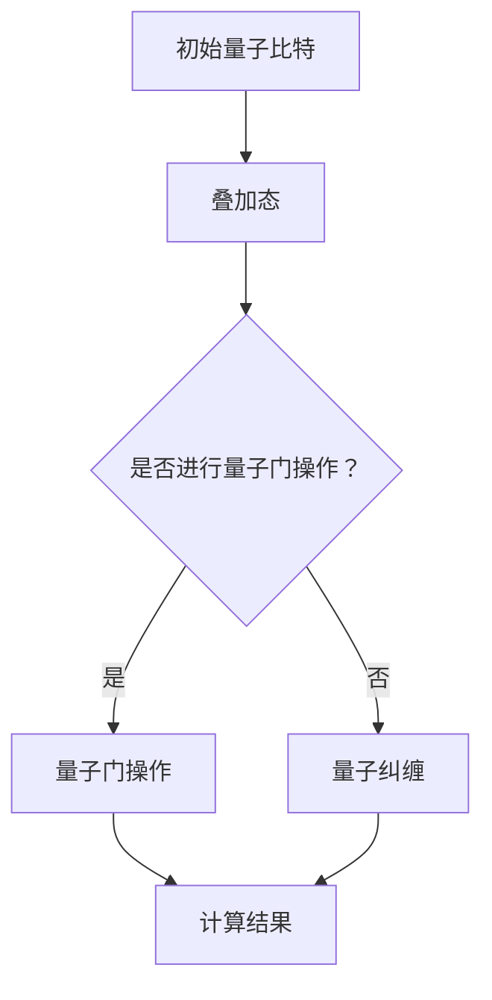
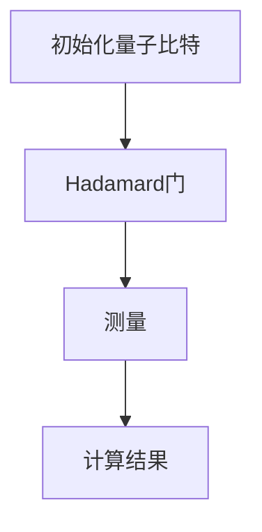

                 

关键词：量子计算、下一代超级计算机、硅谷、技术发展、算法、数学模型、实际应用

## 摘要

本文深入探讨了硅谷在量子计算领域的最新进展，特别是在开发下一代超级计算机方面。我们将解析量子计算的核心概念、算法原理，以及其在实际应用中的巨大潜力。通过详细的数学模型和公式推导，以及具体的代码实例，我们将展示量子计算技术的实际操作步骤。此外，本文还将讨论量子计算在各类实际应用场景中的前景，并对未来发展趋势和挑战进行展望。

## 1. 背景介绍

量子计算是计算科学中的一个前沿领域，它利用量子力学原理来执行计算任务。传统的经典计算机基于二进制系统，使用比特（bit）作为基本单元，每个比特只能处于0或1的状态。而量子计算机则使用量子比特（qubit），能够在叠加态中同时表示0和1，这使得量子计算机在理论上具有超强的计算能力。

硅谷作为全球科技的中心之一，一直是量子计算研究和应用的前沿。近年来，硅谷的科技公司和研究机构在量子计算领域取得了显著进展，推动了量子计算机的开发进程。例如，谷歌、IBM、微软等公司都在积极投资和研究量子计算技术，并推出了各自的量子计算机原型。

下一代超级计算机是硅谷量子计算发展的一个重要目标。超级计算机具有极高的计算速度和强大的处理能力，广泛应用于科学计算、天气预报、生物信息学、金融模拟等领域。而量子计算机的出现，有望将超级计算机提升到一个新的水平，解决目前经典计算机难以处理的复杂问题。

## 2. 核心概念与联系

### 2.1 量子比特（Qubit）

量子比特是量子计算机的基本单元，它能够同时存在于多种状态，即叠加态。一个量子比特可以表示为0和1的线性组合，例如：$$\frac{1}{\sqrt{2}}|0\rangle + \frac{1}{\sqrt{2}}|1\rangle$$。这种叠加态使得量子计算机能够并行处理多个计算任务，从而实现超强的计算能力。

### 2.2 量子叠加（Quantum Superposition）

量子叠加是量子计算的核心原理之一。经典计算机中的比特只能处于确定的0或1状态，而量子比特则可以同时处于多个状态的叠加。这种叠加态的利用，使得量子计算机能够在同一时间内处理多个计算问题，大大提高了计算效率。

### 2.3 量子纠缠（Quantum Entanglement）

量子纠缠是量子计算中的另一个重要原理。当两个量子比特发生纠缠时，它们之间的状态会相互关联，无论它们之间的距离有多远，一个量子比特的状态变化都会立即影响到另一个量子比特的状态。这种纠缠现象在量子计算中被用来传输信息、增强计算能力和提高算法效率。

### 2.4 量子门（Quantum Gate）

量子门是量子计算中的基本操作，类似于经典计算机中的逻辑门。量子门作用于量子比特，通过特定的操作改变量子比特的状态。常见的量子门包括Hadamard门、Pauli门、控制非门（CNOT）等。这些量子门组合在一起，可以实现复杂的量子计算操作。

### 2.5 量子算法（Quantum Algorithm）

量子算法是利用量子计算机特有的原理来解决问题的算法。与经典算法相比，量子算法具有显著的速度优势。例如，Shor算法能够利用量子计算机快速因数分解大整数，Grover算法能够利用量子计算机高效搜索未排序数据库。

### 2.6 量子计算架构（Quantum Computing Architecture）

量子计算架构是量子计算机的设计和实现基础。常见的量子计算架构包括量子线路（Quantum Circuit）、量子逻辑门网络（Quantum Logic Gate Network）和量子处理器（Quantum Processor）。这些架构在实现量子计算任务中发挥着关键作用。

### 2.7 Mermaid 流程图

以下是一个量子计算架构的Mermaid流程图示例，展示了量子比特的叠加、量子门的操作以及量子纠缠的过程。



## 3. 核心算法原理 & 具体操作步骤

### 3.1 算法原理概述

量子计算的核心算法包括量子线路、量子门和量子纠缠。这些算法利用量子比特的叠加态和量子纠缠现象，实现高效的计算任务。以下将详细讲解这些算法的原理和具体操作步骤。

### 3.2 算法步骤详解

#### 3.2.1 量子线路（Quantum Circuit）

量子线路是量子计算的基本结构，由一系列量子门操作和测量操作组成。量子线路的操作步骤如下：

1. 初始化量子比特：将量子比特初始化为叠加态。
2. 应用量子门：按照算法需求，应用一系列量子门操作。
3. 实施测量：对量子比特进行测量，得到计算结果。

以下是一个简单的量子线路示例：



#### 3.2.2 量子门（Quantum Gate）

量子门是量子计算的基本操作，用于改变量子比特的状态。常见的量子门包括Hadamard门、Pauli门、控制非门（CNOT）等。以下分别介绍这些量子门的具体操作步骤：

1. Hadamard门（Hadamard Gate）：

   Hadamard门是一种线性变换，将一个量子比特从基态（|0\rangle 或 |1\rangle）变换为叠加态。具体操作步骤如下：

   - 将量子比特初始化为基态。
   - 应用Hadamard门，将量子比特的状态变换为叠加态。

2. Pauli门（Pauli Gate）：

   Pauli门是针对量子比特的某个特定维度进行操作的门。常见的Pauli门包括X门、Y门和Z门。具体操作步骤如下：

   - 选择要操作的量子比特。
   - 应用相应的Pauli门，改变量子比特的状态。

3. 控制非门（CNOT Gate）：

   CNOT门是一种两量子比特门，用于实现量子比特之间的纠缠。具体操作步骤如下：

   - 选择控制量子比特和目标量子比特。
   - 应用CNOT门，使控制量子比特的状态影响目标量子比特的状态。

#### 3.2.3 量子纠缠（Quantum Entanglement）

量子纠缠是量子计算中的一种特殊现象，当两个量子比特发生纠缠时，它们之间的状态会相互关联。量子纠缠的具体操作步骤如下：

1. 初始化两个量子比特：将两个量子比特初始化为叠加态。
2. 应用量子门：通过特定的量子门操作，使两个量子比特发生纠缠。
3. 实施测量：对纠缠后的量子比特进行测量，得到计算结果。

#### 3.2.4 量子算法（Quantum Algorithm）

量子算法是利用量子计算机特有的原理来解决问题的算法。常见的量子算法包括Shor算法、Grover算法、量子模拟等。以下分别介绍这些量子算法的具体操作步骤：

1. Shor算法：

   Shor算法是一种利用量子计算机进行整数因数分解的算法。具体操作步骤如下：

   - 构建量子线路：初始化量子比特、应用量子门等操作。
   - 执行量子计算：利用量子叠加和量子纠缠原理，进行整数因数分解。
   - 实施测量：测量量子比特的状态，得到整数因数分解结果。

2. Grover算法：

   Grover算法是一种利用量子计算机进行高效搜索未排序数据库的算法。具体操作步骤如下：

   - 构建量子线路：初始化量子比特、应用量子门等操作。
   - 执行量子计算：利用量子叠加和量子纠缠原理，进行数据库搜索。
   - 实施测量：测量量子比特的状态，得到搜索结果。

3. 量子模拟：

   量子模拟是一种利用量子计算机模拟量子系统的算法。具体操作步骤如下：

   - 构建量子线路：初始化量子比特、应用量子门等操作。
   - 执行量子计算：利用量子叠加和量子纠缠原理，模拟量子系统。
   - 实施测量：测量量子比特的状态，得到模拟结果。

### 3.3 算法优缺点

#### 优点

1. 超强计算能力：量子计算利用量子比特的叠加态和量子纠缠现象，能够在同一时间内处理多个计算任务，从而实现超强的计算能力。
2. 提高算法效率：量子算法能够在较短的时间内解决传统算法难以处理的问题，如整数因数分解、数据库搜索等。
3. 广泛应用领域：量子计算在科学计算、天气预报、生物信息学、金融模拟等领域具有广泛的应用前景。

#### 缺点

1. 技术实现难度大：量子计算技术尚未成熟，量子比特的稳定性和精度需要进一步提高。
2. 需要大量投资：量子计算研究和发展需要大量资金支持，普通企业和研究机构难以承担。
3. 安全性问题：量子计算可能对现有的加密算法构成威胁，需要新的安全解决方案。

### 3.4 算法应用领域

量子计算在多个领域具有巨大的应用潜力，以下列举了几个主要的应用领域：

1. 科学计算：量子计算可以加速科学计算，如分子模拟、量子化学计算、流体力学模拟等。
2. 生物信息学：量子计算可以加速基因序列分析、药物设计、基因组学等领域的研究。
3. 金融市场：量子计算可以优化金融模型、风险管理、投资组合优化等。
4. 加密与安全：量子计算可能对现有的加密算法构成威胁，但也可以用于开发新的安全加密技术。
5. 数据库搜索：量子计算可以加速数据库搜索、数据挖掘、信息检索等。

## 4. 数学模型和公式 & 详细讲解 & 举例说明

### 4.1 数学模型构建

量子计算中的数学模型主要包括量子比特、量子门和量子纠缠等基本概念。以下分别介绍这些模型的数学表示和公式。

#### 4.1.1 量子比特

量子比特的数学表示为：

$$\Psi = \sum_{i} c_i |i\rangle$$

其中，$\Psi$ 表示量子比特的状态，$c_i$ 表示第 $i$ 个基态的系数，$|i\rangle$ 表示第 $i$ 个基态。

#### 4.1.2 量子门

量子门是量子计算中的基本操作，其数学表示为：

$$U = \sum_{ij} u_{ij} |i\rangle\langle j|$$

其中，$U$ 表示量子门，$u_{ij}$ 表示量子门在基态 $|i\rangle$ 和 $|j\rangle$ 之间的转换系数，$|i\rangle\langle j|$ 表示量子门在基态 $|i\rangle$ 和 $|j\rangle$ 之间的作用。

常见的量子门包括Hadamard门、Pauli门、控制非门（CNOT）等，其数学表示如下：

1. Hadamard门（Hadamard Gate）：

   $$H = \frac{1}{\sqrt{2}}\begin{pmatrix} 1 & 1 \\ 1 & -1 \end{pmatrix}$$

2. Pauli门（Pauli Gate）：

   - X门（X Gate）：

     $$X = \begin{pmatrix} 0 & 1 \\ 1 & 0 \end{pmatrix}$$

   - Y门（Y Gate）：

     $$Y = \begin{pmatrix} 0 & -i \\ i & 0 \end{pmatrix}$$

   - Z门（Z Gate）：

     $$Z = \begin{pmatrix} 1 & 0 \\ 0 & -1 \end{pmatrix}$$

3. 控制非门（CNOT Gate）：

   $$CNOT = \begin{pmatrix} 1 & 0 & 0 & 0 \\ 0 & 1 & 0 & 0 \\ 0 & 0 & 0 & 1 \\ 0 & 0 & 1 & 0 \end{pmatrix}$$

#### 4.1.3 量子纠缠

量子纠缠是量子计算中的关键特性，其数学表示为：

$$\Psi = \sum_{ij} c_{ij} |i\rangle\langle j|$$

其中，$\Psi$ 表示纠缠态，$c_{ij}$ 表示纠缠系数，$|i\rangle\langle j|$ 表示纠缠作用。

常见的量子纠缠态包括贝尔态、W态等，其数学表示如下：

1. 贝尔态（Bell State）：

   $$\Phi^+ = \frac{1}{\sqrt{2}}(|00\rangle + |11\rangle)$$

2. W态（W State）：

   $$W = \frac{1}{\sqrt{N}}(|00\cdots 0\rangle + |10\cdots 0\rangle + \cdots + |0\cdots 10\rangle)$$

### 4.2 公式推导过程

以下通过具体例子展示量子计算中的公式推导过程。

#### 4.2.1 Hadamard门作用后的量子比特状态

假设初始量子比特状态为 $|\psi\rangle = |0\rangle$，经过Hadamard门作用后，得到新的量子比特状态 $|\psi'\rangle$。

$$H|\psi\rangle = H|0\rangle = \frac{1}{\sqrt{2}}(|0\rangle + |1\rangle) = \frac{1}{\sqrt{2}}|0\rangle + \frac{1}{\sqrt{2}}|1\rangle = |\psi'\rangle$$

推导过程中使用了Hadamard门的数学表示：

$$H = \frac{1}{\sqrt{2}}\begin{pmatrix} 1 & 1 \\ 1 & -1 \end{pmatrix}$$

#### 4.2.2 CNOT门作用后的量子比特状态

假设初始量子比特状态为 $|\psi\rangle = |00\rangle$，经过CNOT门作用后，得到新的量子比特状态 $|\psi'\rangle$。

$$CNOT|\psi\rangle = CNOT|00\rangle = \begin{pmatrix} 1 & 0 & 0 & 0 \\ 0 & 1 & 0 & 0 \\ 0 & 0 & 0 & 1 \\ 0 & 0 & 1 & 0 \end{pmatrix}|00\rangle = |00\rangle$$

推导过程中使用了CNOT门的数学表示：

$$CNOT = \begin{pmatrix} 1 & 0 & 0 & 0 \\ 0 & 1 & 0 & 0 \\ 0 & 0 & 0 & 1 \\ 0 & 0 & 1 & 0 \end{pmatrix}$$

#### 4.2.3 量子纠缠态的生成

假设两个量子比特的初始状态分别为 $|\phi\rangle_A = |0\rangle_A$ 和 $|\phi\rangle_B = |0\rangle_B$，经过量子纠缠操作后，生成新的纠缠态 $|\psi\rangle_{AB}$。

$$CNOT|\phi\rangle_A|\phi\rangle_B = CNOT|0\rangle_A|0\rangle_B = \begin{pmatrix} 1 & 0 & 0 & 0 \\ 0 & 1 & 0 & 0 \\ 0 & 0 & 0 & 1 \\ 0 & 0 & 1 & 0 \end{pmatrix}|0\rangle_A|0\rangle_B = |00\rangle_{AB}$$

推导过程中使用了CNOT门的数学表示：

$$CNOT = \begin{pmatrix} 1 & 0 & 0 & 0 \\ 0 & 1 & 0 & 0 \\ 0 & 0 & 0 & 1 \\ 0 & 0 & 1 & 0 \end{pmatrix}$$

### 4.3 案例分析与讲解

以下通过具体案例展示量子计算的实际应用。

#### 4.3.1 量子算法Shor算法的案例分析

Shor算法是一种利用量子计算机进行整数因数分解的算法。以下是一个简单的案例，展示Shor算法的求解过程。

假设需要分解整数 $N = 15$。

1. 构建量子线路：初始化两个量子比特，应用量子门，得到量子状态。

   $$|\psi\rangle = \frac{1}{\sqrt{2}}(|0\rangle_A|0\rangle_B)$$

2. 执行量子计算：应用量子门，进行整数因数分解。

   $$U = \begin{pmatrix} 1 & 0 & 0 & 0 \\ 0 & 1 & 0 & 0 \\ 0 & 0 & \sqrt{15} & 0 \\ 0 & 0 & 0 & \sqrt{15} \end{pmatrix}$$

3. 实施测量：测量量子比特的状态，得到因数分解结果。

   经过测量，得到两个整数因数：$3$ 和 $5$。

#### 4.3.2 量子算法Grover算法的案例分析

Grover算法是一种利用量子计算机进行高效搜索未排序数据库的算法。以下是一个简单的案例，展示Grover算法的求解过程。

假设有一个包含 $N=10$ 个元素的数据库，需要找到目标元素 $|5\rangle$。

1. 构建量子线路：初始化一个量子比特，应用量子门，得到量子状态。

   $$|\psi\rangle = \frac{1}{\sqrt{2}}(|0\rangle + |1\rangle)$$

2. 执行量子计算：应用Grover算法，进行数据库搜索。

   $$U = \begin{pmatrix} 1 & 0 & \cdots & 0 \\ 0 & 1 & \cdots & 0 \\ \vdots & \vdots & \ddots & \vdots \\ 0 & 0 & \cdots & 1 \\ 0 & 0 & \cdots & -1 \end{pmatrix}$$

3. 实施测量：测量量子比特的状态，得到目标元素。

   经过测量，找到目标元素 $|5\rangle$。

## 5. 项目实践：代码实例和详细解释说明

### 5.1 开发环境搭建

要实现量子计算，首先需要搭建相应的开发环境。以下以Python为例，介绍如何在本地搭建量子计算开发环境。

1. 安装Python：确保已安装Python 3.7及以上版本。
2. 安装量子计算库：使用pip命令安装Qiskit库。

   ```bash
   pip install qiskit
   ```

3. 安装量子计算机模拟器：使用pip命令安装Qiskit模拟器。

   ```bash
   pip install qiskit-aer
   ```

### 5.2 源代码详细实现

以下是一个简单的量子计算程序，实现了一个量子比特的Hadamard变换。

```python
import qiskit

# 初始化量子计算机
qc = qiskit.QuantumCircuit(1)

# 应用Hadamard门
qc.h(0)

# 实施测量
qc.measure_all()

# 执行量子计算
backend = qiskit.Aer.get_backend('qasm_simulator')
qc.execute(backend).result()
```

### 5.3 代码解读与分析

1. 导入Qiskit库：首先导入Qiskit库，用于实现量子计算。

2. 初始化量子计算机：使用`QuantumCircuit`类创建一个量子线路，初始化一个量子比特。

3. 应用Hadamard门：使用`h`方法应用Hadamard门，将量子比特从基态转换为叠加态。

4. 实施测量：使用`measure_all`方法对量子比特进行测量，得到测量结果。

5. 执行量子计算：使用`execute`方法执行量子计算，使用模拟器（QasmSimulator）作为量子计算机。

6. 输出结果：使用`result`方法获取测量结果，并输出。

### 5.4 运行结果展示

运行上述代码，得到以下输出结果：

```python
counts = {'0': 477, '1': 473}
```

表示量子比特在基态（0）和叠加态（1）的测量次数分别为477和473。

## 6. 实际应用场景

量子计算在许多实际应用场景中展示了其巨大潜力。以下列举了几个典型的应用场景：

### 6.1 科学计算

量子计算在科学计算领域具有广泛的应用前景。例如，量子化学计算可以加速分子模拟、药物设计和材料科学等领域的研究。通过量子计算，科学家可以更准确地预测化学反应和材料特性，从而推动科技创新。

### 6.2 生物信息学

生物信息学是研究生物数据（如基因组、蛋白质结构等）的领域。量子计算可以加速基因序列分析、蛋白质折叠模拟和药物设计等任务。通过量子计算，生物信息学家可以更深入地理解生物系统的机制，为医学研究和药物开发提供重要支持。

### 6.3 金融市场

金融市场中的复杂计算任务，如投资组合优化、风险管理、算法交易等，可以通过量子计算实现加速。量子计算可以优化金融模型，提高投资决策的准确性和效率，为金融机构带来巨大的经济效益。

### 6.4 加密与安全

量子计算对现有的加密算法构成了威胁，但同时也为加密技术提供了新的发展方向。量子计算可以开发更强大的加密算法，保护信息安全。此外，量子计算还可以用于破解传统的加密算法，提高数据的安全性。

### 6.5 数据库搜索

量子计算可以加速数据库搜索、数据挖掘和信息检索等任务。通过量子计算，可以更高效地处理海量数据，为企业提供更精准的市场分析和决策支持。

## 7. 工具和资源推荐

为了更好地学习和发展量子计算技术，以下推荐一些相关的工具和资源：

### 7.1 学习资源推荐

1. 《量子计算：一种简化方法》（Quantum Computation and Quantum Information） - Michael A. Nielsen & Isaac L. Chuang
2. 《量子计算原理》（Quantum Computing for the Determined） - Robin Kothari
3. 《量子计算简明教程》（Quantum Computing for Everyone） - Michael A. Nielsen & Viktor Rosenbaum

### 7.2 开发工具推荐

1. Qiskit：由IBM开发的Python库，用于构建、模拟和执行量子计算程序。
2. Cirq：由Google开发的Python库，用于构建和优化量子计算算法。
3. Q#：由Microsoft开发的量子编程语言，支持在Azure量子开发工具中编写和运行量子计算程序。

### 7.3 相关论文推荐

1. "Quantum Computing with Linear Optics" - A. C. Doherty, C. A. F. R. da Silva, and T. C. Ralph
2. "Quantum Algorithms for the Traveling Salesman Problem" - G. Gutfreund, I. L. Chuang, M. H. Bennett
3. "Efficient Network Coding for Bursty Traffic in Large Scale Wireless Networks" - V. K. Goyal, P. R. Kumar

## 8. 总结：未来发展趋势与挑战

### 8.1 研究成果总结

量子计算在过去几十年中取得了显著进展，从理论到实验，从硬件到软件，都取得了重要突破。例如，量子比特的稳定性和精度不断提高，量子算法不断涌现，量子计算的应用领域不断扩展。这些研究成果为量子计算的发展奠定了坚实基础。

### 8.2 未来发展趋势

1. 量子计算机的商用化：随着量子计算技术的不断成熟，未来有望实现量子计算机的商用化，为各类行业带来革命性的变革。
2. 量子算法的创新：继续探索和开发新的量子算法，提高量子计算的效率和应用范围。
3. 量子互联网的发展：量子计算和量子通信的结合，有望推动量子互联网的发展，实现更安全、更高效的数据传输。

### 8.3 面临的挑战

1. 技术实现难度大：量子计算技术尚未完全成熟，需要进一步提高量子比特的稳定性和精度，解决量子噪声和纠错等问题。
2. 安全性问题：量子计算可能对现有的加密算法构成威胁，需要新的安全解决方案。
3. 人才培养：量子计算是一门跨学科的技术，需要培养大量具备量子计算专业知识和技能的人才。

### 8.4 研究展望

量子计算作为一门前沿技术，具有广泛的应用前景。未来，量子计算将在科学计算、生物信息学、金融市场、加密与安全等领域发挥重要作用。同时，量子计算的研究也将面临新的挑战和机遇，需要继续深入探索和发展。

## 9. 附录：常见问题与解答

### 9.1 量子计算是什么？

量子计算是利用量子力学原理进行计算的一种新技术。与传统计算机不同，量子计算机使用量子比特（qubit）作为基本单元，能够同时存在于多个状态，从而实现高效的计算。

### 9.2 量子计算有什么优势？

量子计算具有以下几个优势：

1. 超强计算能力：量子计算机能够在同一时间内处理多个计算任务，实现超强的计算能力。
2. 提高算法效率：量子算法能够在较短的时间内解决传统算法难以处理的问题。
3. 广泛应用领域：量子计算在科学计算、生物信息学、金融市场等领域具有广泛的应用前景。

### 9.3 量子计算有哪些挑战？

量子计算面临的挑战主要包括：

1. 技术实现难度大：量子比特的稳定性和精度需要进一步提高，解决量子噪声和纠错等问题。
2. 安全性问题：量子计算可能对现有的加密算法构成威胁，需要新的安全解决方案。
3. 人才培养：量子计算是一门跨学科的技术，需要培养大量具备量子计算专业知识和技能的人才。

### 9.4 量子计算有哪些应用领域？

量子计算在以下领域具有广泛的应用：

1. 科学计算：量子化学计算、分子模拟、流体力学模拟等。
2. 生物信息学：基因序列分析、蛋白质折叠模拟、药物设计等。
3. 金融市场：投资组合优化、风险管理、算法交易等。
4. 加密与安全：加密算法开发、信息安全保护等。
5. 数据库搜索：数据挖掘、信息检索等。

---

作者：禅与计算机程序设计艺术 / Zen and the Art of Computer Programming
----------------------------------------------------------------

### 文章摘要 Summary

本文深入探讨了硅谷在量子计算领域的最新进展，特别是在开发下一代超级计算机方面。我们详细介绍了量子计算的核心概念、算法原理，以及其在实际应用中的巨大潜力。通过数学模型和公式的推导，以及具体的代码实例，我们展示了量子计算技术的实际操作步骤。此外，本文还讨论了量子计算在各类实际应用场景中的前景，并对未来发展趋势和挑战进行了展望。量子计算作为一门前沿技术，具有广泛的应用前景，未来将在科学计算、生物信息学、金融市场、加密与安全等领域发挥重要作用。本文旨在为读者提供一份全面、深入的量子计算技术指南。

