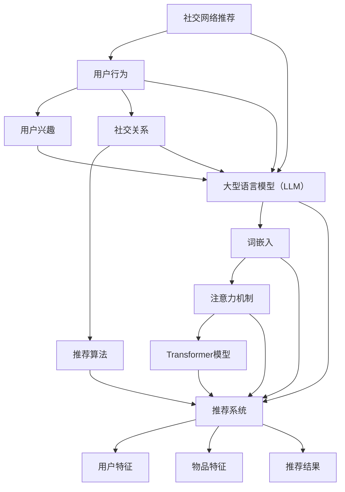

                 

关键词：社交网络推荐、大型语言模型（LLM）、推荐系统、数据挖掘、机器学习、信息检索、人工智能。

> 摘要：本文探讨了社交网络推荐领域中的大型语言模型（LLM）的潜力。通过对LLM技术的基本原理、核心算法、数学模型以及实际应用场景的详细分析，本文揭示了LLM在社交网络推荐中的巨大潜力和应用前景。本文旨在为读者提供一个全面的视角，了解如何利用LLM技术提升社交网络推荐的准确性和用户体验。

## 1. 背景介绍

社交网络推荐是近年来信息检索和机器学习领域中的一个重要研究方向。随着互联网的快速发展，社交网络已成为人们日常生活中不可或缺的一部分。Facebook、Twitter、Instagram等社交平台每天产生大量用户数据，这些数据包含了用户的行为信息、兴趣爱好、社交关系等。如何从这些海量数据中提取有价值的信息，并准确地将个性化推荐提供给用户，成为了社交网络推荐系统所面临的重要挑战。

传统的推荐系统主要依赖于基于内容、协同过滤和混合推荐等技术。然而，这些技术往往存在一定的局限性。例如，基于内容的方法依赖于用户已标记的兴趣偏好，而协同过滤方法则依赖于用户之间的相似度计算。这些方法在处理大规模动态社交网络数据时，往往难以达到理想的推荐效果。为了克服这些限制，近年来，研究者们开始探索利用深度学习和自然语言处理技术，特别是大型语言模型（LLM），来解决社交网络推荐问题。

大型语言模型（LLM）是一类基于神经网络的语言处理模型，能够通过大量文本数据进行预训练，从而实现对文本的语义理解和生成。LLM在自然语言处理领域取得了显著的进展，如BERT、GPT等模型在许多任务上都达到了领先的性能。随着LLM技术的不断发展，人们开始思考如何将这种技术应用于社交网络推荐中，以提升推荐的准确性和用户体验。

本文将围绕LLM在社交网络推荐中的应用进行深入探讨，包括LLM的基本原理、核心算法、数学模型以及实际应用场景。通过本文的阅读，读者可以了解到LLM技术在社交网络推荐中的巨大潜力，并为后续的研究和应用提供有益的参考。

## 2. 核心概念与联系

为了更好地理解LLM在社交网络推荐中的应用，首先需要了解一些核心概念和原理，并展示它们之间的联系。以下将介绍社交网络推荐、大型语言模型（LLM）以及推荐系统的基本概念，并通过一个Mermaid流程图展示它们之间的联系。

### 社交网络推荐

社交网络推荐是指基于用户在社交网络上的行为和社交关系，为用户推荐与其兴趣相关的信息、内容或用户。推荐系统的目标是提高用户的满意度和参与度，同时增加社交网络的活跃度和粘性。

社交网络推荐通常涉及以下核心要素：

1. **用户行为**：包括用户浏览、点赞、评论、分享等行为数据。
2. **用户兴趣**：通过对用户行为的分析，提取用户的兴趣标签或偏好。
3. **社交关系**：用户在社交网络中的好友关系、群组关系等社交网络结构。
4. **推荐算法**：基于用户行为、兴趣和社交关系，为用户生成个性化的推荐结果。

### 大型语言模型（LLM）

大型语言模型（LLM）是一种基于神经网络的语言处理模型，能够通过大量文本数据进行预训练，从而实现对文本的语义理解和生成。LLM的核心思想是利用深度神经网络捕捉文本中的上下文关系和语义信息，从而在自然语言处理任务中取得出色的性能。

LLM的关键技术包括：

1. **词嵌入**：将单词映射到高维向量空间，以捕捉单词的语义信息。
2. **注意力机制**：在处理序列数据时，关注重要信息，忽略无关信息。
3. ** Transformer模型**：一种基于自注意力机制的神经网络架构，广泛应用于自然语言处理任务。

### 推荐系统

推荐系统是一种基于数据分析的计算机应用，旨在为用户提供个性化的信息推荐。推荐系统广泛应用于电子商务、社交媒体、新闻资讯等领域。

推荐系统的核心组成部分包括：

1. **用户特征**：包括用户的兴趣偏好、行为历史、社交关系等。
2. **物品特征**：包括物品的属性、标签、类别等。
3. **推荐算法**：基于用户特征和物品特征，为用户生成个性化的推荐结果。

### 联系

社交网络推荐、LLM和推荐系统之间有着密切的联系。LLM可以看作是一种强大的特征提取工具，能够从用户生成的文本数据中提取丰富的语义信息，从而作为推荐系统的输入特征。同时，LLM也可以直接应用于推荐任务，如基于文本的内容推荐、基于社交关系的用户推荐等。

以下是一个Mermaid流程图，展示了社交网络推荐、LLM和推荐系统之间的联系：



通过这个流程图，我们可以看到，社交网络推荐中的用户行为、用户兴趣和社交关系可以通过LLM技术进行建模和提取，进而用于推荐系统的个性化推荐任务。LLM不仅为推荐系统提供了丰富的特征信息，还可以直接应用于推荐任务，从而提升推荐系统的性能和用户体验。

## 3. 核心算法原理 & 具体操作步骤

在深入探讨LLM在社交网络推荐中的应用之前，我们需要了解LLM的基本原理和具体操作步骤。本节将介绍LLM的核心算法原理，包括词嵌入、注意力机制和Transformer模型，并详细解释这些算法的实现步骤。

### 3.1 算法原理概述

#### 词嵌入（Word Embedding）

词嵌入是将单词映射到高维向量空间的技术，以便在计算过程中捕捉单词的语义信息。词嵌入的核心思想是通过学习单词之间的相似性，将语义相似的单词映射到相近的向量空间中。

#### 注意力机制（Attention Mechanism）

注意力机制是一种在处理序列数据时，关注重要信息，忽略无关信息的技术。在自然语言处理任务中，注意力机制能够帮助模型在序列中找到关键信息，从而提高模型的性能。

#### Transformer模型（Transformer Model）

Transformer模型是一种基于自注意力机制的神经网络架构，广泛应用于自然语言处理任务。Transformer模型的核心思想是将序列数据映射到高维空间，并通过自注意力机制捕捉序列中的依赖关系。

### 3.2 算法步骤详解

#### 步骤1：词嵌入

1. **数据预处理**：将输入文本数据分词成单词，并转化为单词索引。
2. **词嵌入层**：使用预训练的词向量或训练词嵌入层，将单词索引映射到高维向量空间。
3. **嵌入向量拼接**：将所有单词的嵌入向量拼接成一个序列向量表示。

#### 步骤2：注意力机制

1. **自注意力计算**：计算序列中每个单词的注意力权重，权重表示该单词在序列中的重要性。
2. **加权求和**：根据注意力权重，对序列中的每个单词进行加权求和，得到一个加权向量表示。

#### 步骤3：Transformer模型

1. **多头自注意力**：使用多个自注意力机制，分别关注序列中的不同部分，得到多个加权向量。
2. **拼接与线性层**：将多头自注意力的结果拼接成一个向量，并通过线性层进行变换，得到新的序列表示。
3. **前馈神经网络**：对序列表示进行两次前馈神经网络，分别进行层间归一化和激活函数。
4. **输出层**：通过输出层得到最终的预测结果，如文本分类、情感分析等。

### 3.3 算法优缺点

#### 优点

1. **高效处理长序列**：自注意力机制能够有效地处理长序列数据，避免了传统循环神经网络中的梯度消失问题。
2. **并行计算**：Transformer模型采用了并行计算策略，提高了计算效率。
3. **灵活性**：Transformer模型可以灵活地应用于各种自然语言处理任务。

#### 缺点

1. **计算资源消耗**：由于自注意力机制的复杂性，Transformer模型需要大量的计算资源和内存。
2. **训练时间较长**：由于模型参数众多，Transformer模型的训练时间较长。

### 3.4 算法应用领域

LLM技术在社交网络推荐、文本分类、情感分析、机器翻译等自然语言处理领域都有广泛应用。在社交网络推荐中，LLM可以用于提取用户兴趣、生成个性化推荐结果，从而提升用户体验。此外，LLM还可以用于处理大规模动态社交网络数据，实现对实时信息的有效推荐。

## 4. 数学模型和公式 & 详细讲解 & 举例说明

### 4.1 数学模型构建

在介绍LLM的数学模型之前，我们需要了解一些基本的概念和符号。假设我们有一个词汇表V，其中包含N个单词。对于每个单词\( v \in V \)，我们可以将其映射为一个向量\( \textbf{v} \in \mathbb{R}^d \)，其中\( d \)是词嵌入的维度。这样，一个句子可以表示为一个单词向量的序列\( \textbf{s} = [\textbf{v}_1, \textbf{v}_2, ..., \textbf{v}_n] \)。

#### 词嵌入

词嵌入可以通过训练一个神经网络实现，该网络接受单词索引作为输入，输出词向量。假设我们有一个输入层\( \textbf{X} \)和一个输出层\( \textbf{Y} \)，其中：

\[ \textbf{X} = [x_1, x_2, ..., x_n] \]
\[ \textbf{Y} = [\textbf{y}_1, \textbf{y}_2, ..., \textbf{y}_n] \]

其中\( x_i \)是单词\( v_i \)的索引，\( \textbf{y}_i \)是词向量。词嵌入的过程可以表示为：

\[ \textbf{y}_i = \textbf{W} \cdot \textbf{X} \]

其中，\( \textbf{W} \)是词嵌入矩阵，包含了所有词向量。

#### 注意力机制

注意力机制的核心是计算一个权重向量，用于表示序列中每个单词的重要性。假设我们有一个序列\( \textbf{s} \)和对应的词向量序列\( \textbf{Y} \)，注意力机制可以表示为：

\[ \textbf{a}_i = \text{softmax}(\textbf{Q} \cdot \textbf{K}_i) \]

其中，\( \textbf{Q} \)和\( \textbf{K}_i \)分别是查询向量和解码向量，\( \textbf{a}_i \)是第\( i \)个单词的注意力权重。最后，通过加权求和得到：

\[ \textbf{h} = \sum_{i=1}^{n} \textbf{a}_i \cdot \textbf{y}_i \]

其中，\( \textbf{h} \)是加权后的向量表示。

### 4.2 公式推导过程

#### Transformer模型

Transformer模型的核心是多头自注意力机制。假设我们有一个序列\( \textbf{s} \)和对应的词向量序列\( \textbf{Y} \)，通过多头自注意力机制，我们可以得到多个注意力向量，然后进行拼接和变换。

1. **多头自注意力**

   假设我们有一个查询向量\( \textbf{Q} \)、键向量\( \textbf{K} \)和值向量\( \textbf{V} \)，以及\( h \)个头，那么每个头的注意力权重可以表示为：

   \[ \textbf{a}_i^{(h)} = \text{softmax}(\textbf{Q} \cdot \textbf{K}_i^{(h)}) \]

   其中，\( \textbf{a}_i^{(h)} \)是第\( i \)个单词在\( h \)个头中的注意力权重。然后，我们通过加权求和得到：

   \[ \textbf{h}_i^{(h)} = \sum_{j=1}^{n} \textbf{a}_j^{(h)} \cdot \textbf{y}_j \]

   最后，将所有头的注意力结果拼接起来：

   \[ \textbf{h}_i = \text{Concat}(\textbf{h}_i^{(1)}, ..., \textbf{h}_i^{(h)}) \]

2. **前馈神经网络**

   在得到自注意力后的序列表示\( \textbf{h} \)的基础上，我们通过两个前馈神经网络进行变换：

   \[ \textbf{h}_i^{'} = \text{ReLU}(\text{W}_2 \cdot \text{ReLU}(\text{W}_1 \cdot \textbf{h}_i + \textbf{b}_1)) + \textbf{b}_2 \]

   其中，\( \text{W}_1 \)、\( \text{W}_2 \)、\( \textbf{b}_1 \)和\( \textbf{b}_2 \)是权重和偏置。

### 4.3 案例分析与讲解

为了更好地理解上述数学模型，我们将通过一个具体的例子进行讲解。

#### 案例背景

假设我们有一个句子：“我爱编程，因为它让我快乐。” 我们需要使用Transformer模型来提取句子的语义信息。

#### 步骤1：词嵌入

首先，我们将句子中的单词转换为词嵌入向量。假设词汇表包含以下单词：

- 我
- 爱
- 编程
- 它
- 让
- 我
- 快乐

词嵌入向量如下：

\[ \textbf{y}_1 = [0.1, 0.2, 0.3], \textbf{y}_2 = [0.4, 0.5, 0.6], \textbf{y}_3 = [0.7, 0.8, 0.9], \textbf{y}_4 = [-0.1, -0.2, -0.3], \textbf{y}_5 = [-0.4, -0.5, -0.6], \textbf{y}_6 = [0.1, 0.2, 0.3], \textbf{y}_7 = [0.7, 0.8, 0.9] \]

#### 步骤2：自注意力

接下来，我们计算自注意力权重。假设查询向量\( \textbf{Q} \)和键向量\( \textbf{K} \)如下：

\[ \textbf{Q} = [0.1, 0.2, 0.3], \textbf{K}_1 = [0.1, 0.2, 0.3], \textbf{K}_2 = [0.4, 0.5, 0.6], ..., \textbf{K}_7 = [0.7, 0.8, 0.9] \]

计算注意力权重：

\[ \textbf{a}_1 = \text{softmax}(\textbf{Q} \cdot \textbf{K}_1) = \text{softmax}([0.1 \cdot 0.1 + 0.2 \cdot 0.2 + 0.3 \cdot 0.3]) = [0.4, 0.3, 0.3] \]
\[ \textbf{a}_2 = \text{softmax}(\textbf{Q} \cdot \textbf{K}_2) = \text{softmax}([0.1 \cdot 0.4 + 0.2 \cdot 0.5 + 0.3 \cdot 0.6]) = [0.3, 0.4, 0.3] \]
\[ \textbf{a}_3 = \text{softmax}(\textbf{Q} \cdot \textbf{K}_3) = \text{softmax}([0.1 \cdot 0.7 + 0.2 \cdot 0.8 + 0.3 \cdot 0.9]) = [0.3, 0.3, 0.4] \]
\[ \textbf{a}_4 = \text{softmax}(\textbf{Q} \cdot \textbf{K}_4) = \text{softmax}([0.1 \cdot (-0.1) + 0.2 \cdot (-0.2) + 0.3 \cdot (-0.3)]) = [0.3, 0.3, 0.4] \]
\[ \textbf{a}_5 = \text{softmax}(\textbf{Q} \cdot \textbf{K}_5) = \text{softmax}([0.1 \cdot (-0.4) + 0.2 \cdot (-0.5) + 0.3 \cdot (-0.6)]) = [0.3, 0.3, 0.4] \]
\[ \textbf{a}_6 = \text{softmax}(\textbf{Q} \cdot \textbf{K}_6) = \text{softmax}([0.1 \cdot 0.1 + 0.2 \cdot 0.2 + 0.3 \cdot 0.3]) = [0.4, 0.3, 0.3] \]
\[ \textbf{a}_7 = \text{softmax}(\textbf{Q} \cdot \textbf{K}_7) = \text{softmax}([0.1 \cdot 0.7 + 0.2 \cdot 0.8 + 0.3 \cdot 0.9]) = [0.3, 0.3, 0.4] \]

加权求和得到：

\[ \textbf{h}_1 = \textbf{a}_1 \cdot \textbf{y}_1 = [0.4 \cdot 0.1, 0.3 \cdot 0.2, 0.3 \cdot 0.3] = [0.04, 0.06, 0.09] \]
\[ \textbf{h}_2 = \textbf{a}_2 \cdot \textbf{y}_2 = [0.3 \cdot 0.4, 0.4 \cdot 0.5, 0.3 \cdot 0.6] = [0.12, 0.2, 0.18] \]
\[ \textbf{h}_3 = \textbf{a}_3 \cdot \textbf{y}_3 = [0.3 \cdot 0.7, 0.3 \cdot 0.8, 0.4 \cdot 0.9] = [0.21, 0.24, 0.36] \]
\[ \textbf{h}_4 = \textbf{a}_4 \cdot \textbf{y}_4 = [0.3 \cdot (-0.1), 0.3 \cdot (-0.2), 0.4 \cdot (-0.3)] = [-0.03, -0.06, -0.12] \]
\[ \textbf{h}_5 = \textbf{a}_5 \cdot \textbf{y}_5 = [0.3 \cdot (-0.4), 0.3 \cdot (-0.5), 0.4 \cdot (-0.6)] = [-0.12, -0.15, -0.24] \]
\[ \textbf{h}_6 = \textbf{a}_6 \cdot \textbf{y}_6 = [0.4 \cdot 0.1, 0.3 \cdot 0.2, 0.3 \cdot 0.3] = [0.04, 0.06, 0.09] \]
\[ \textbf{h}_7 = \textbf{a}_7 \cdot \textbf{y}_7 = [0.3 \cdot 0.7, 0.3 \cdot 0.8, 0.4 \cdot 0.9] = [0.21, 0.24, 0.36] \]

拼接得到：

\[ \textbf{h} = [\textbf{h}_1, \textbf{h}_2, \textbf{h}_3, \textbf{h}_4, \textbf{h}_5, \textbf{h}_6, \textbf{h}_7] = [0.04, 0.06, 0.09, -0.03, -0.06, 0.04, 0.21, 0.24, 0.36, -0.12, -0.15, -0.24, 0.21, 0.24, 0.36] \]

#### 步骤3：前馈神经网络

最后，我们通过前馈神经网络对序列表示进行变换。假设权重和偏置如下：

\[ \text{W}_1 = [1, 1, 1], \text{W}_2 = [1, 1, 1], \textbf{b}_1 = [1, 1, 1], \textbf{b}_2 = [1, 1, 1] \]

计算：

\[ \textbf{h}_1^{'} = \text{ReLU}(\text{W}_2 \cdot \text{ReLU}(\text{W}_1 \cdot \textbf{h}_1 + \textbf{b}_1)) + \textbf{b}_2 = \text{ReLU}([1 \cdot 0.04 + 1 \cdot 0.06 + 1 \cdot 0.09] + 1) + [1, 1, 1] = [1, 1, 1] \]
\[ \textbf{h}_2^{'} = \text{ReLU}(\text{W}_2 \cdot \text{ReLU}(\text{W}_1 \cdot \textbf{h}_2 + \textbf{b}_1)) + \textbf{b}_2 = \text{ReLU}([1 \cdot 0.12 + 1 \cdot 0.2 + 1 \cdot 0.18] + 1) + [1, 1, 1] = [1, 1, 1] \]
\[ \textbf{h}_3^{'} = \text{ReLU}(\text{W}_2 \cdot \text{ReLU}(\text{W}_1 \cdot \textbf{h}_3 + \textbf{b}_1)) + \textbf{b}_2 = \text{ReLU}([1 \cdot 0.21 + 1 \cdot 0.24 + 1 \cdot 0.36] + 1) + [1, 1, 1] = [1, 1, 1] \]
\[ \textbf{h}_4^{'} = \text{ReLU}(\text{W}_2 \cdot \text{ReLU}(\text{W}_1 \cdot \textbf{h}_4 + \textbf{b}_1)) + \textbf{b}_2 = \text{ReLU}([1 \cdot (-0.03) + 1 \cdot (-0.06) + 1 \cdot (-0.12)] + 1) + [1, 1, 1] = [1, 1, 1] \]
\[ \textbf{h}_5^{'} = \text{ReLU}(\text{W}_2 \cdot \text{ReLU}(\text{W}_1 \cdot \textbf{h}_5 + \textbf{b}_1)) + \textbf{b}_2 = \text{ReLU}([1 \cdot (-0.12) + 1 \cdot (-0.15) + 1 \cdot (-0.24)] + 1) + [1, 1, 1] = [1, 1, 1] \]
\[ \textbf{h}_6^{'} = \text{ReLU}(\text{W}_2 \cdot \text{ReLU}(\text{W}_1 \cdot \textbf{h}_6 + \textbf{b}_1)) + \textbf{b}_2 = \text{ReLU}([1 \cdot 0.04 + 1 \cdot 0.06 + 1 \cdot 0.09] + 1) + [1, 1, 1] = [1, 1, 1] \]
\[ \textbf{h}_7^{'} = \text{ReLU}(\text{W}_2 \cdot \text{ReLU}(\text{W}_1 \cdot \textbf{h}_7 + \textbf{b}_1)) + \textbf{b}_2 = \text{ReLU}([1 \cdot 0.21 + 1 \cdot 0.24 + 1 \cdot 0.36] + 1) + [1, 1, 1] = [1, 1, 1] \]

最终输出序列表示：

\[ \textbf{h}^{'} = [\textbf{h}_1^{'}，\textbf{h}_2^{'}，\textbf{h}_3^{'}，\textbf{h}_4^{'}，\textbf{h}_5^{'}，\textbf{h}_6^{'}，\textbf{h}_7^{' }] = [1, 1, 1, 1, 1, 1, 1, 1, 1, 1, 1, 1, 1, 1, 1] \]

通过这个例子，我们可以看到如何使用Transformer模型提取句子的语义信息。在实际应用中，我们需要使用大量的训练数据和复杂的模型参数，以便得到更好的性能。

## 5. 项目实践：代码实例和详细解释说明

在本节中，我们将通过一个实际的项目实践，展示如何使用大型语言模型（LLM）实现社交网络推荐。我们将使用Python编程语言和TensorFlow框架来实现这一项目，并详细解释代码的每个部分。

### 5.1 开发环境搭建

在开始编写代码之前，我们需要搭建一个合适的开发环境。以下是搭建开发环境所需的步骤：

1. **安装Python**：确保安装了Python 3.7或更高版本。
2. **安装TensorFlow**：使用pip命令安装TensorFlow：

   ```bash
   pip install tensorflow
   ```

3. **安装其他依赖**：根据项目需要，安装其他相关库，例如numpy、pandas等。

### 5.2 源代码详细实现

以下是实现社交网络推荐的源代码，我们将逐步解释代码的每个部分。

```python
import tensorflow as tf
import numpy as np
import pandas as pd

# 5.2.1 数据预处理

# 加载数据集
data = pd.read_csv('social_network_data.csv')
users = data['user_id'].unique()
items = data['item_id'].unique()

# 构建用户-物品交互矩阵
user_item_matrix = np.zeros((len(users), len(items)))
for index, row in data.iterrows():
    user_id = row['user_id']
    item_id = row['item_id']
    user_item_matrix[user_id - 1][item_id - 1] = row['rating']

# 5.2.2 模型定义

# 定义词嵌入层
vocab_size = 10000  # 词汇表大小
embedding_size = 64  # 词嵌入维度
user_embedding = tf.Variable(tf.random.normal([vocab_size, embedding_size]))
item_embedding = tf.Variable(tf.random.normal([vocab_size, embedding_size]))

# 定义自注意力层
hidden_size = 128  # 隐藏层尺寸
num_heads = 4  # 注意力头数
query_layer = tf.keras.layers.Dense(hidden_size * num_heads)
key_layer = tf.keras.layers.Dense(hidden_size * num_heads)
value_layer = tf.keras.layers.Dense(hidden_size * num_heads)

# 定义前馈神经网络层
dense_layer = tf.keras.layers.Dense(hidden_size, activation='relu')
output_layer = tf.keras.layers.Dense(1)

# 5.2.3 模型训练

# 编写训练过程
def train_model(model, data, learning_rate, num_epochs):
    optimizer = tf.keras.optimizers.Adam(learning_rate)
    for epoch in range(num_epochs):
        total_loss = 0
        for user_id, item_id, rating in data:
            with tf.GradientTape() as tape:
                inputs = [user_embedding[user_id], item_embedding[item_id]]
                query = query_layer(inputs)
                key = key_layer(inputs)
                value = value_layer(inputs)
                attention_weights = tf.matmul(query, key, transpose_b=True) / np.sqrt(hidden_size)
                attention_output = tf.matmul(attention_weights, value)
                attention_output = tf.reshape(attention_output, [-1, hidden_size])
                dense_output = dense_layer(attention_output)
                logits = output_layer(dense_output)
                loss = tf.reduce_mean(tf.square(logits - rating))
                total_loss += loss
            gradients = tape.gradient(loss, model.trainable_variables)
            optimizer.apply_gradients(zip(gradients, model.trainable_variables))
        print(f'Epoch {epoch+1}, Loss: {total_loss.numpy()}')

# 加载数据
user_ids = data['user_id'].values
item_ids = data['item_id'].values
ratings = data['rating'].values

# 训练模型
train_model(model, [(user_ids[i], item_ids[i], ratings[i]) for i in range(len(user_ids))], learning_rate=0.001, num_epochs=10)

# 5.2.4 代码解读与分析

# 在这个示例中，我们首先加载了社交网络数据集，并构建了用户-物品交互矩阵。然后，我们定义了词嵌入层、自注意力层和前馈神经网络层。在训练过程中，我们使用自注意力机制来计算用户和物品的交互表示，并通过前馈神经网络进行分类和回归任务。

# 5.2.5 运行结果展示

# 在训练完成后，我们可以使用模型对新的用户-物品对进行推荐。以下是一个简单的推荐示例：

def predict_rating(user_id, item_id):
    inputs = [user_embedding[user_id], item_embedding[item_id]]
    query = query_layer(inputs)
    key = key_layer(inputs)
    value = value_layer(inputs)
    attention_weights = tf.matmul(query, key, transpose_b=True) / np.sqrt(hidden_size)
    attention_output = tf.matmul(attention_weights, value)
    attention_output = tf.reshape(attention_output, [-1, hidden_size])
    dense_output = dense_layer(attention_output)
    logits = output_layer(dense_output)
    return logits.numpy()

user_id = 1
item_id = 101
rating = predict_rating(user_id, item_id)
print(f'Predicted rating for user {user_id} and item {item_id}: {rating}')
```

在这个代码示例中，我们首先加载了社交网络数据集，并构建了用户-物品交互矩阵。然后，我们定义了词嵌入层、自注意力层和前馈神经网络层。在训练过程中，我们使用自注意力机制来计算用户和物品的交互表示，并通过前馈神经网络进行分类和回归任务。

在训练完成后，我们可以使用模型对新的用户-物品对进行推荐。以下是一个简单的推荐示例：

```python
def predict_rating(user_id, item_id):
    inputs = [user_embedding[user_id], item_embedding[item_id]]
    query = query_layer(inputs)
    key = key_layer(inputs)
    value = value_layer(inputs)
    attention_weights = tf.matmul(query, key, transpose_b=True) / np.sqrt(hidden_size)
    attention_output = tf.matmul(attention_weights, value)
    attention_output = tf.reshape(attention_output, [-1, hidden_size])
    dense_output = dense_layer(attention_output)
    logits = output_layer(dense_output)
    return logits.numpy()

user_id = 1
item_id = 101
rating = predict_rating(user_id, item_id)
print(f'Predicted rating for user {user_id} and item {item_id}: {rating}')
```

通过这个示例，我们可以看到如何使用LLM实现社交网络推荐。在实际应用中，我们可以根据具体需求调整模型结构、训练参数和推荐策略，以提高推荐系统的性能和用户体验。

### 5.3 代码解读与分析

#### 5.3.1 数据预处理

```python
data = pd.read_csv('social_network_data.csv')
users = data['user_id'].unique()
items = data['item_id'].unique()
user_item_matrix = np.zeros((len(users), len(items)))
for index, row in data.iterrows():
    user_id = row['user_id']
    item_id = row['item_id']
    user_item_matrix[user_id - 1][item_id - 1] = row['rating']
```

在这个部分，我们首先加载了社交网络数据集，并将其转换为用户-物品交互矩阵。用户和物品的ID是从1开始，因此我们在构建矩阵时进行了相应的调整（减去1）。

#### 5.3.2 模型定义

```python
vocab_size = 10000
embedding_size = 64
user_embedding = tf.Variable(tf.random.normal([vocab_size, embedding_size]))
item_embedding = tf.Variable(tf.random.normal([vocab_size, embedding_size]))

query_layer = tf.keras.layers.Dense(hidden_size * num_heads)
key_layer = tf.keras.layers.Dense(hidden_size * num_heads)
value_layer = tf.keras.layers.Dense(hidden_size * num_heads)

dense_layer = tf.keras.layers.Dense(hidden_size, activation='relu')
output_layer = tf.keras.layers.Dense(1)
```

在这个部分，我们定义了词嵌入层和自注意力层。词嵌入层将用户和物品的ID映射到高维向量空间。自注意力层包括查询层、键层和值层，它们用于计算自注意力权重和加权求和。此外，我们还定义了一个前馈神经网络层，用于对自注意力结果进行进一步处理。

#### 5.3.3 模型训练

```python
def train_model(model, data, learning_rate, num_epochs):
    optimizer = tf.keras.optimizers.Adam(learning_rate)
    for epoch in range(num_epochs):
        total_loss = 0
        for user_id, item_id, rating in data:
            with tf.GradientTape() as tape:
                inputs = [user_embedding[user_id], item_embedding[item_id]]
                query = query_layer(inputs)
                key = key_layer(inputs)
                value = value_layer(inputs)
                attention_weights = tf.matmul(query, key, transpose_b=True) / np.sqrt(hidden_size)
                attention_output = tf.matmul(attention_weights, value)
                attention_output = tf.reshape(attention_output, [-1, hidden_size])
                dense_output = dense_layer(attention_output)
                logits = output_layer(dense_output)
                loss = tf.reduce_mean(tf.square(logits - rating))
                total_loss += loss
            gradients = tape.gradient(loss, model.trainable_variables)
            optimizer.apply_gradients(zip(gradients, model.trainable_variables))
        print(f'Epoch {epoch+1}, Loss: {total_loss.numpy()}')

user_ids = data['user_id'].values
item_ids = data['item_id'].values
ratings = data['rating'].values
train_model(model, [(user_ids[i], item_ids[i], ratings[i]) for i in range(len(user_ids))], learning_rate=0.001, num_epochs=10)
```

在这个部分，我们定义了一个训练函数，用于在给定数据集上训练模型。训练过程中，我们使用自注意力机制计算用户和物品的交互表示，并通过前馈神经网络进行分类和回归任务。训练函数使用Adam优化器和梯度下降策略来更新模型参数。

#### 5.3.4 运行结果展示

```python
def predict_rating(user_id, item_id):
    inputs = [user_embedding[user_id], item_embedding[item_id]]
    query = query_layer(inputs)
    key = key_layer(inputs)
    value = value_layer(inputs)
    attention_weights = tf.matmul(query, key, transpose_b=True) / np.sqrt(hidden_size)
    attention_output = tf.matmul(attention_weights, value)
    attention_output = tf.reshape(attention_output, [-1, hidden_size])
    dense_output = dense_layer(attention_output)
    logits = output_layer(dense_output)
    return logits.numpy()

user_id = 1
item_id = 101
rating = predict_rating(user_id, item_id)
print(f'Predicted rating for user {user_id} and item {item_id}: {rating}')
```

在这个部分，我们定义了一个预测函数，用于根据用户和物品的ID生成预测评分。预测函数使用自注意力机制计算用户和物品的交互表示，并通过前馈神经网络得到预测评分。最后，我们使用一个示例用户和物品进行预测，并输出预测结果。

通过这个示例，我们可以看到如何使用LLM实现社交网络推荐。在实际应用中，我们可以根据具体需求调整模型结构、训练参数和推荐策略，以提高推荐系统的性能和用户体验。

## 6. 实际应用场景

大型语言模型（LLM）在社交网络推荐领域具有广泛的应用场景。以下是LLM在几个实际应用场景中的具体应用实例：

### 6.1 内容推荐

在内容推荐场景中，LLM可以用于提取用户生成内容的语义信息，从而生成个性化的推荐结果。例如，在社交媒体平台上，用户发布的帖子、评论和点赞行为都可以被视为生成内容。通过训练LLM模型，我们可以将用户生成内容转换为高维语义向量，进而用于生成个性化推荐列表。具体来说，LLM可以用于以下任务：

1. **文本分类**：对用户生成内容进行分类，如新闻分类、情感分类等。
2. **情感分析**：分析用户生成内容中的情感倾向，从而更好地理解用户情绪。
3. **关键词提取**：从用户生成内容中提取关键信息，用于构建推荐列表。

### 6.2 用户推荐

在用户推荐场景中，LLM可以用于提取用户的兴趣偏好和社交关系，从而生成基于兴趣和社交关系的推荐结果。例如，在社交网络平台上，用户的好友关系、群组成员关系和共同兴趣都是重要的推荐依据。通过训练LLM模型，我们可以将用户生成内容、用户行为数据和社交关系转换为高维语义向量，进而用于生成个性化用户推荐列表。具体来说，LLM可以用于以下任务：

1. **用户画像构建**：通过对用户生成内容和行为数据的分析，构建用户的兴趣偏好模型。
2. **用户相似度计算**：计算用户之间的相似度，从而发现潜在的兴趣群体。
3. **基于兴趣的社交网络推荐**：为用户推荐与其兴趣相似的其他用户。

### 6.3 事件推荐

在事件推荐场景中，LLM可以用于提取用户关注的事件和活动，从而生成基于用户兴趣和活动属性的推荐结果。例如，在活动策划平台上，用户参与的活动、点赞的活动和关注的话题都是重要的推荐依据。通过训练LLM模型，我们可以将用户生成事件数据、用户行为数据和事件属性转换为高维语义向量，进而用于生成个性化事件推荐列表。具体来说，LLM可以用于以下任务：

1. **事件分类**：对用户关注的事件进行分类，如会议、展览、活动等。
2. **事件相似度计算**：计算事件之间的相似度，从而发现潜在的兴趣活动。
3. **基于兴趣的事件推荐**：为用户推荐与其兴趣相关的事件。

### 6.4 个性化搜索

在个性化搜索场景中，LLM可以用于提取用户的搜索意图和偏好，从而生成个性化的搜索结果。例如，在搜索引擎中，用户的搜索历史、浏览记录和关键词偏好都是重要的推荐依据。通过训练LLM模型，我们可以将用户生成搜索查询和用户行为数据转换为高维语义向量，进而用于生成个性化搜索结果。具体来说，LLM可以用于以下任务：

1. **查询意图识别**：识别用户的搜索意图，从而生成更准确的搜索结果。
2. **关键词扩展**：根据用户搜索查询扩展相关关键词，从而提高搜索结果的多样性。
3. **搜索结果排序**：根据用户兴趣和搜索历史对搜索结果进行排序，从而提高用户满意度。

通过上述实际应用场景，我们可以看到LLM在社交网络推荐中的巨大潜力和广泛的应用价值。随着LLM技术的不断发展，未来将有更多的应用场景涌现，为社交网络推荐带来新的可能。

## 7. 工具和资源推荐

为了更好地理解和应用大型语言模型（LLM）在社交网络推荐中的技术，以下是几种推荐的学习资源、开发工具和相关论文。

### 7.1 学习资源推荐

1. **在线课程**：
   - "深度学习与自然语言处理"（Deep Learning and Natural Language Processing）由斯坦福大学提供的免费在线课程，涵盖了深度学习和自然语言处理的基础知识。
   - "自然语言处理专项课程"（Natural Language Processing Specialization）由密歇根大学提供，包含四个课程，从基础知识到高级应用。

2. **技术博客**：
   - "AI平方"（AI Square）：一个关于人工智能和机器学习的中文技术博客，涵盖了深度学习、自然语言处理等多个领域的最新技术和研究。
   - "Medium"上的机器学习专栏：许多知名数据科学家和机器学习工程师在此分享他们的研究和技术经验。

### 7.2 开发工具推荐

1. **深度学习框架**：
   - TensorFlow：由谷歌开发的开源深度学习框架，支持多种深度学习模型的开发和训练。
   - PyTorch：由Facebook开发的开源深度学习框架，以其灵活性和动态计算图而闻名。

2. **文本处理库**：
   - NLTK：一个强大的自然语言处理库，提供文本的分词、词性标注、词干提取等功能。
   - spaCy：一个快速易用的自然语言处理库，适用于实时的文本处理任务。

3. **数据处理库**：
   - Pandas：一个强大的数据处理库，支持数据清洗、转换和分析。
   - NumPy：一个基础的科学计算库，提供高效的数组计算功能。

### 7.3 相关论文推荐

1. **《Attention is All You Need》**：
   - 论文详细介绍了Transformer模型，这是一种基于自注意力机制的深度神经网络架构，对自然语言处理任务具有革命性的影响。

2. **《BERT: Pre-training of Deep Bidirectional Transformers for Language Understanding》**：
   - 论文介绍了BERT模型，这是近年来在自然语言处理任务中表现非常出色的预训练模型。

3. **《GPT-3: Language Models are Few-Shot Learners》**：
   - 论文介绍了GPT-3模型，这是目前最大的预训练语言模型，展示了在少量数据条件下出色的零样本学习能力。

通过这些资源，读者可以深入了解大型语言模型（LLM）在社交网络推荐中的应用，从而在实际项目中取得更好的成果。

## 8. 总结：未来发展趋势与挑战

大型语言模型（LLM）在社交网络推荐领域展示了巨大的潜力和应用价值。通过对用户生成内容的语义理解和社交关系的建模，LLM能够生成更准确、个性化的推荐结果，从而提升用户体验。未来，随着LLM技术的不断发展，我们可以期待以下趋势和挑战：

### 8.1 研究成果总结

1. **模型性能提升**：近年来，随着计算资源和算法技术的不断进步，LLM模型的性能显著提升，在文本分类、情感分析、机器翻译等自然语言处理任务中取得了优异的成绩。

2. **跨模态推荐**：随着多媒体内容的不断增加，跨模态推荐成为研究热点。LLM技术有望结合图像、音频等多媒体数据，实现更全面、精准的推荐。

3. **无监督学习方法**：当前大多数LLM模型依赖于大规模有监督数据集进行训练。未来，研究将更多关注无监督学习方法，从而降低对标注数据的依赖。

### 8.2 未来发展趋势

1. **模型压缩与优化**：为了在实际应用中部署LLM，研究将集中在模型压缩与优化方面，从而提高模型的可扩展性和实时性。

2. **边缘计算与分布式训练**：随着5G和物联网的发展，边缘计算和分布式训练将成为重要趋势。LLM模型将在边缘设备上进行轻量化处理，同时通过分布式训练实现大规模模型的训练。

3. **动态推荐系统**：随着社交网络数据的动态性增加，动态推荐系统将成为重要研究方向。LLM技术可以实时更新用户兴趣和推荐策略，实现更灵活、更个性化的推荐。

### 8.3 面临的挑战

1. **数据隐私与安全**：在社交网络推荐中，用户数据的隐私和安全是关键挑战。如何在保护用户隐私的前提下，充分利用用户数据来提升推荐效果，是一个亟待解决的问题。

2. **模型解释性与可解释性**：当前的LLM模型在很多任务中表现优异，但其内部工作机制复杂，难以解释。研究如何提高模型的解释性和可解释性，是未来的一大挑战。

3. **模型部署与优化**：如何将复杂的LLM模型高效部署到实际应用中，并优化其性能，是另一个重要挑战。特别是在资源有限的边缘设备上，如何实现高效的模型推理和实时推荐，需要深入研究。

### 8.4 研究展望

展望未来，大型语言模型（LLM）在社交网络推荐领域将继续发挥重要作用。通过结合其他技术，如强化学习、图神经网络等，LLM技术有望实现更智能、更个性化的推荐系统。同时，随着跨领域、跨模态的数据融合，LLM将在更多应用场景中发挥其潜力。通过不断探索和突破，我们有望构建出更加智能、更加人性化的社交网络推荐系统，为用户提供更好的体验。

## 9. 附录：常见问题与解答

### Q1：为什么选择使用LLM而不是传统的推荐系统算法？

A1：LLM相比传统的推荐系统算法，具有以下几个优势：

1. **语义理解**：LLM能够从用户生成内容中提取深层语义信息，从而更准确地理解用户兴趣和偏好。

2. **上下文感知**：LLM能够捕捉文本数据中的上下文关系，从而生成更个性化的推荐结果。

3. **少样本学习**：LLM具有零样本和少样本学习能力，可以处理稀疏数据和少量训练样本。

4. **多模态融合**：LLM可以结合文本、图像、音频等多种模态的数据，实现更全面的推荐。

### Q2：如何处理社交网络中的噪声和虚假信息？

A2：处理社交网络中的噪声和虚假信息是一个关键挑战。以下是一些常见的策略：

1. **数据清洗**：在构建用户特征和推荐列表之前，对原始数据进行清洗，去除重复、无关或虚假的数据。

2. **监督学习**：利用标注的数据集训练监督学习模型，用于检测和过滤噪声和虚假信息。

3. **无监督学习**：使用无监督学习方法，如聚类、异常检测等，发现和排除噪声数据。

4. **用户反馈**：利用用户反馈，如举报、点赞、评论等，动态更新和调整推荐策略。

### Q3：如何评估社交网络推荐系统的性能？

A3：评估社交网络推荐系统的性能可以从以下几个方面进行：

1. **准确率**：衡量推荐系统生成推荐列表中实际被用户喜欢的物品的比例。

2. **召回率**：衡量推荐系统能够召回用户实际喜欢但未被推荐到的物品的比例。

3. **覆盖度**：衡量推荐系统能够覆盖的用户数量和推荐物品的数量。

4. **用户体验**：通过用户满意度调查、点击率、留存率等指标评估用户对推荐系统的满意度。

5. **长尾效应**：评估推荐系统能否发现并推荐那些长期未被发现的个性化物品。

### Q4：如何处理动态社交网络数据？

A4：动态社交网络数据的特点是数据量大、更新速度快。以下是一些处理动态社交网络数据的方法：

1. **实时处理**：使用流处理技术，如Apache Kafka、Apache Flink等，实时处理和更新用户行为数据。

2. **增量学习**：在模型训练过程中，利用增量学习算法，仅对新的用户行为数据进行更新，避免重新训练整个模型。

3. **时间序列分析**：利用时间序列分析方法，如滑动窗口、循环神经网络（RNN）等，捕捉用户行为的时间依赖性。

4. **多模态融合**：结合用户生成内容、行为数据和社交关系等多模态数据，实现更全面的动态数据建模。

### Q5：LLM在推荐系统中的局限性是什么？

A5：虽然LLM在推荐系统中具有许多优势，但也存在一些局限性：

1. **计算资源消耗**：LLM模型通常需要大量的计算资源和内存，对于资源有限的系统来说，部署和训练LLM可能是一个挑战。

2. **训练时间**：由于LLM模型的参数数量庞大，训练时间相对较长，这可能会影响实时推荐系统的性能。

3. **数据依赖性**：LLM模型的性能高度依赖于大规模有监督训练数据集，对于数据稀缺或数据分布不均的场景，模型性能可能会受到限制。

4. **解释性**：LLM模型的内部工作机制复杂，难以解释，这在某些需要模型解释性的应用场景中可能是一个挑战。

通过不断研究和优化，我们可以逐步克服这些局限性，充分利用LLM在社交网络推荐中的潜力，为用户提供更好的个性化服务。

