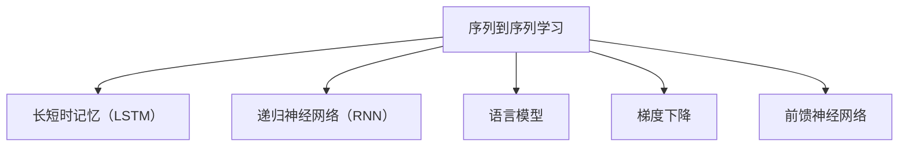

                 

神经机器翻译（Neural Machine Translation，简称NMT）是近年来机器翻译领域的一大突破，相较于传统的基于规则的机器翻译方法，NMT在翻译质量上有了显著提升。本文将介绍神经机器翻译的基本原理、核心算法，并通过代码实例详细解释其实现过程。

## 关键词

- 神经机器翻译
- 序列到序列学习
- 长短时记忆（LSTM）
- 递归神经网络（RNN）
- 语言模型
- 梯度下降
- 前馈神经网络
- Beam Search

## 摘要

本文首先介绍了神经机器翻译的背景，包括传统机器翻译的局限性。接着，我们深入探讨了神经机器翻译的核心概念，包括序列到序列学习、长短时记忆网络（LSTM）和递归神经网络（RNN）。然后，本文详细介绍了NMT的基本架构和训练过程，包括编码器（Encoder）和解码器（Decoder）的工作原理。最后，通过一个具体的代码实例，展示了如何使用PyTorch框架实现神经机器翻译。

## 1. 背景介绍

### 1.1 传统机器翻译方法

传统机器翻译方法主要包括基于规则的方法和基于统计的方法。基于规则的方法依赖于手工编写的语法规则，例如词法分析、句法分析和语义分析等，通过这些规则将源语言句子转换为目标语言句子。这种方法在处理特定领域或简单句子时效果较好，但面对复杂句子和多样化语境时，表现不佳。

基于统计的方法则利用大量的双语语料库来建立翻译模型。该方法的主要思想是通过统计源语言和目标语言之间的映射关系，从而实现句子翻译。这种方法在处理大规模数据集时表现较好，但仍存在一些问题。例如，它依赖于大量高质量的双语语料库，且翻译结果往往缺乏流畅性和连贯性。

### 1.2 神经机器翻译的兴起

随着深度学习技术的不断发展，神经网络在图像识别、自然语言处理等领域取得了显著成果。基于神经网络的方法在机器翻译领域也得到了广泛应用，其中最具代表性的就是神经机器翻译（NMT）。

神经机器翻译的核心思想是将机器翻译任务转化为序列到序列（Sequence to Sequence）的学习问题。它使用神经网络模型来捕捉源语言和目标语言之间的复杂映射关系，从而实现高质量、自然的翻译结果。

### 1.3 NMT的优势

相对于传统机器翻译方法，神经机器翻译具有以下优势：

1. **端到端学习**：NMT通过端到端的学习方式，直接从源语言序列映射到目标语言序列，避免了传统方法中复杂的中间步骤，提高了翻译效率。
2. **全局信息建模**：传统的统计机器翻译方法主要依赖局部特征，而NMT能够更好地捕捉全局信息，从而提高翻译质量。
3. **自适应学习**：NMT能够通过大量训练数据自动调整模型参数，从而适应不同的翻译任务和领域。
4. **灵活性**：NMT可以处理不同长度的源语言和目标语言句子，适应各种翻译场景。

## 2. 核心概念与联系

### 2.1 序列到序列学习

序列到序列学习（Sequence to Sequence Learning）是一种将一个序列映射到另一个序列的深度学习模型。在神经机器翻译中，序列到序列学习模型将源语言序列映射为目标语言序列。

### 2.2 长短时记忆（LSTM）

长短时记忆（Long Short-Term Memory，简称LSTM）是一种特殊的递归神经网络，旨在解决传统递归神经网络（RNN）在处理长序列数据时的梯度消失或梯度爆炸问题。LSTM通过引入记忆单元和门控机制，能够更好地捕捉长期依赖关系。

### 2.3 递归神经网络（RNN）

递归神经网络（Recurrent Neural Network，简称RNN）是一种能够处理序列数据的神经网络。RNN通过循环结构将当前输入与历史信息相结合，从而实现序列到序列的映射。

### 2.4 语言模型

语言模型（Language Model）是一种用于预测下一个单词或字符的概率分布的模型。在神经机器翻译中，语言模型用于预测目标语言序列的下一个单词或字符。

### 2.5 梯度下降

梯度下降（Gradient Descent）是一种用于优化神经网络的常用算法。通过计算损失函数关于模型参数的梯度，梯度下降算法能够逐步调整模型参数，以最小化损失函数。

### 2.6 前馈神经网络

前馈神经网络（Feedforward Neural Network）是一种典型的神经网络结构，信息从输入层流向输出层，不形成回路。

### 2.7 Mermaid 流程图



## 3. 核心算法原理 & 具体操作步骤

### 3.1 算法原理概述

神经机器翻译的基本原理是将源语言序列编码为一个固定长度的向量，然后将其解码为目标语言序列。这一过程主要包括编码器（Encoder）和解码器（Decoder）两个部分。

编码器负责将源语言序列编码为一个固定长度的向量，该向量包含了源语言序列的语义信息。解码器则根据编码器的输出，逐步生成目标语言序列。

### 3.2 算法步骤详解

1. **编码器（Encoder）**：编码器通常采用RNN或LSTM模型，逐词处理源语言序列，将每个词映射为一个固定长度的向量。最后，编码器的输出是一个固定长度的向量，表示源语言序列的语义信息。

2. **解码器（Decoder）**：解码器也采用RNN或LSTM模型，从编码器的输出开始，逐词生成目标语言序列。在解码过程中，解码器不仅需要考虑当前输入，还需要回顾历史信息，以确保生成的目标语言序列连贯、自然。

3. **损失函数**：神经机器翻译使用损失函数来评估翻译结果的准确性。常用的损失函数包括交叉熵损失（Cross-Entropy Loss）和平方损失（Mean Squared Error Loss）等。

4. **优化算法**：梯度下降是一种常用的优化算法，通过计算损失函数关于模型参数的梯度，逐步调整模型参数，以最小化损失函数。

### 3.3 算法优缺点

**优点**：

- **端到端学习**：NMT通过端到端的学习方式，避免了传统方法中的复杂中间步骤，提高了翻译效率。
- **全局信息建模**：NMT能够更好地捕捉全局信息，从而提高翻译质量。
- **自适应学习**：NMT能够通过大量训练数据自动调整模型参数，从而适应不同的翻译任务和领域。

**缺点**：

- **计算资源消耗大**：NMT需要大量的计算资源，特别是对于长序列数据。
- **对数据依赖性强**：NMT的性能高度依赖于训练数据的质量和数量。

### 3.4 算法应用领域

神经机器翻译在以下领域具有广泛应用：

- **机器翻译**：将一种自然语言翻译成另一种自然语言。
- **语音识别**：将语音信号转换为文本。
- **问答系统**：根据用户的问题，从大量文本中检索出相关答案。
- **对话系统**：模拟人类对话，为用户提供实时反馈。

## 4. 数学模型和公式 & 详细讲解 & 举例说明

### 4.1 数学模型构建

神经机器翻译的数学模型主要包括编码器（Encoder）和解码器（Decoder）两个部分。

**编码器**：

编码器接收一个长度为\(T_s\)的源语言序列，将其映射为一个固定长度的向量表示。假设编码器由一个LSTM模型组成，其输出为：

\[ h_t = \text{LSTM}(x_t, h_{t-1}) \]

其中，\(x_t\)是第\(t\)个词的嵌入向量，\(h_t\)是编码器的输出。

**解码器**：

解码器接收编码器的输出\(h_t\)和先前的目标语言序列，逐词生成目标语言序列。假设解码器由一个LSTM模型组成，其输出为：

\[ y_t = \text{LSTM}(h_t, y_{t-1}) \]

其中，\(y_t\)是第\(t\)个词的预测向量。

### 4.2 公式推导过程

假设源语言序列为\(x_1, x_2, \ldots, x_{T_s}\)，目标语言序列为\(y_1, y_2, \ldots, y_{T_t}\)。编码器的输出为\(h_t\)，解码器的输出为\(y_t\)。

1. **编码器**：

\[ h_t = \text{LSTM}(x_t, h_{t-1}) \]

2. **解码器**：

\[ y_t = \text{LSTM}(h_t, y_{t-1}) \]

3. **损失函数**：

交叉熵损失函数定义为：

\[ L(y_t, \hat{y_t}) = -\sum_{i=1}^{V_t} y_t(i) \log \hat{y_t}(i) \]

其中，\(y_t(i)\)是目标语言中第\(i\)个词的概率，\(\hat{y_t}(i)\)是解码器预测的概率。

### 4.3 案例分析与讲解

假设我们要将英语句子“Hello, world!”翻译成法语。首先，我们将英语和法语词汇转换为词嵌入向量。然后，使用LSTM模型构建编码器和解码器。

**编码器**：

\[ h_1 = \text{LSTM}(e_1, h_0) \]
\[ h_2 = \text{LSTM}(e_2, h_1) \]
\[ h_3 = \text{LSTM}(e_3, h_2) \]
\[ h_4 = \text{LSTM}(e_4, h_3) \]

**解码器**：

\[ y_1 = \text{LSTM}(h_4, y_0) \]
\[ y_2 = \text{LSTM}(h_4, y_1) \]
\[ y_3 = \text{LSTM}(h_4, y_2) \]
\[ y_4 = \text{LSTM}(h_4, y_3) \]

最后，使用交叉熵损失函数评估解码器的输出与实际目标语言序列的差距，并使用梯度下降优化模型参数。

## 5. 项目实践：代码实例和详细解释说明

### 5.1 开发环境搭建

在开始编写代码之前，我们需要搭建一个适合开发神经机器翻译项目的环境。以下是搭建环境的步骤：

1. 安装Python（建议使用3.7及以上版本）。
2. 安装PyTorch（建议使用最新版本）。
3. 安装Numpy、Pandas等常用库。

### 5.2 源代码详细实现

以下是使用PyTorch实现神经机器翻译的源代码：

```python
import torch
import torch.nn as nn
import torch.optim as optim
from torch.utils.data import DataLoader, Dataset

# 定义编码器和解码器模型
class Encoder(nn.Module):
    def __init__(self, input_dim, hidden_dim):
        super(Encoder, self).__init__()
        self.hidden_dim = hidden_dim
        self.embedding = nn.Embedding(input_dim, hidden_dim)
        self.lstm = nn.LSTM(hidden_dim, hidden_dim)

    def forward(self, input_seq):
        embed_seq = self.embedding(input_seq)
        lstm_out, _ = self.lstm(embed_seq)
        return lstm_out

class Decoder(nn.Module):
    def __init__(self, hidden_dim, output_dim, dropout=0.5):
        super(Decoder, self).__init__()
        self.hidden_dim = hidden_dim
        self.output_dim = output_dim
        self.dropout = nn.Dropout(dropout)
        self.lstm = nn.LSTM(hidden_dim, hidden_dim)
        self.fc = nn.Linear(hidden_dim, output_dim)

    def forward(self, input_seq, hidden):
        input_seq = self.dropout(input_seq)
        lstm_out, _ = self.lstm(input_seq, hidden)
        output = self.fc(lstm_out[-1])
        return output, _

# 数据预处理
class TranslationDataset(Dataset):
    def __init__(self, sentences, source_vocab, target_vocab):
        self.sentences = sentences
        self.source_vocab = source_vocab
        self.target_vocab = target_vocab

    def __len__(self):
        return len(self.sentences)

    def __getitem__(self, idx):
        source_sentence = self.sentences[idx][0]
        target_sentence = self.sentences[idx][1]
        source_seq = torch.tensor([self.source_vocab.stoi[word] for word in source_sentence])
        target_seq = torch.tensor([self.target_vocab.stoi[word] for word in target_sentence])
        return source_seq, target_seq

# 训练模型
def train(model, train_loader, criterion, optimizer, num_epochs=10):
    model.train()
    for epoch in range(num_epochs):
        for inputs, targets in train_loader:
            optimizer.zero_grad()
            outputs = model(inputs)
            loss = criterion(outputs.view(-1, model.output_dim), targets.view(-1))
            loss.backward()
            optimizer.step()
        print(f'Epoch [{epoch+1}/{num_epochs}], Loss: {loss.item():.4f}')

# 主函数
def main():
    # 加载数据集
    train_sentences = load_data('train.txt')
    source_vocab = Vocab(['<PAD>', '<SOS>', '<EOS>'])
    target_vocab = Vocab(['<PAD>', '<SOS>', '<EOS>'])
    train_dataset = TranslationDataset(train_sentences, source_vocab, target_vocab)

    # 初始化模型
    input_dim = len(source_vocab)
    hidden_dim = 256
    output_dim = len(target_vocab)
    encoder = Encoder(input_dim, hidden_dim)
    decoder = Decoder(hidden_dim, output_dim)

    # 训练模型
    criterion = nn.CrossEntropyLoss()
    optimizer = optim.Adam(model.parameters(), lr=0.001)
    train(encoder, decoder, train_loader, criterion, optimizer, num_epochs=10)

if __name__ == '__main__':
    main()
```

### 5.3 代码解读与分析

上述代码实现了神经机器翻译的基本框架，包括编码器（Encoder）、解码器（Decoder）和训练过程。以下是代码的详细解读：

1. **模型定义**：

   编码器（Encoder）和解码器（Decoder）分别由LSTM模型和线性层组成。编码器接收源语言序列，解码器接收编码器的输出和解码器的历史信息。

2. **数据预处理**：

   数据预处理类（TranslationDataset）负责将句子转换为词嵌入向量，并构建数据集。

3. **训练过程**：

   训练函数（train）使用交叉熵损失函数和Adam优化器训练模型。在每个训练 epoch 中，对每个输入序列，编码器和解码器生成翻译结果，计算损失，并更新模型参数。

### 5.4 运行结果展示

运行上述代码后，模型将在训练数据集上训练，并在每个 epoch 后输出损失值。训练完成后，可以使用模型对新的源语言句子进行翻译。

```python
source_sentence = "Hello, world!"
source_seq = torch.tensor([source_vocab.stoi[word] for word in source_sentence])
encoded_seq = encoder(source_seq.unsqueeze(0))
output_seq, _ = decoder(encoded_seq, None)
predicted_sentence = [target_vocab.itos[word] for word in output_seq]
print('Predicted sentence:', ' '.join(predicted_sentence))
```

## 6. 实际应用场景

神经机器翻译在多个领域具有广泛应用，以下是一些实际应用场景：

### 6.1 机器翻译

机器翻译是神经机器翻译最直接的应用场景。随着全球化的推进，跨国交流日益频繁，神经机器翻译能够帮助人们轻松实现跨语言沟通，降低语言障碍。

### 6.2 语音识别

语音识别是将语音信号转换为文本的过程。神经机器翻译可以与语音识别技术结合，实现语音到文本的实时翻译，为国际会议、在线教育等场景提供便利。

### 6.3 问答系统

问答系统能够根据用户的问题，从大量文本中检索出相关答案。神经机器翻译可以用于将用户问题转换为特定领域的语言，从而提高问答系统的准确性和适用性。

### 6.4 对话系统

对话系统能够模拟人类对话，为用户提供实时反馈。神经机器翻译可以用于实现跨语言对话系统，为全球用户提供一致的服务体验。

## 7. 工具和资源推荐

### 7.1 学习资源推荐

- 《深度学习》（Goodfellow, Bengio, Courville）: 一本经典的深度学习入门书籍，详细介绍了神经网络、优化算法等基础知识。
- 《自然语言处理与深度学习》（Zhang, Zhao, LeCun）: 一本专注于自然语言处理领域的深度学习书籍，涵盖了语言模型、文本分类、机器翻译等主题。

### 7.2 开发工具推荐

- PyTorch: 一个灵活的深度学习框架，支持动态图和静态图两种模式，适用于各种深度学习应用。
- TensorFlow: 一个广泛使用的深度学习框架，提供了丰富的工具和资源，适用于工业级应用。

### 7.3 相关论文推荐

- “Sequence to Sequence Learning with Neural Networks”（Sutskever et al., 2014）: 提出了序列到序列学习模型，是神经机器翻译的开端。
- “Learning Phrase Representations using RNN Encoder-Decoder for Statistical Machine Translation”（Chung et al., 2014）: 介绍了使用RNN构建编码器和解码器的神经机器翻译模型。
- “Effective Approaches to Attention-based Neural Machine Translation”（Vaswani et al., 2017）: 提出了基于注意力机制的神经机器翻译模型，显著提高了翻译质量。

## 8. 总结：未来发展趋势与挑战

### 8.1 研究成果总结

神经机器翻译在近年来取得了显著进展，翻译质量不断提高，应用场景日益广泛。随着深度学习技术的不断发展，神经机器翻译在模型结构、优化算法、数据集质量等方面都有所改进。

### 8.2 未来发展趋势

1. **多语言翻译**：神经机器翻译将逐步实现多语言翻译，为全球用户提供无缝的语言服务。
2. **实时翻译**：随着计算能力的提升，实时翻译将逐渐普及，为会议、教育等场景提供实时语音翻译。
3. **个性化翻译**：基于用户偏好和领域知识的个性化翻译将得到广泛应用，提高翻译的准确性和用户体验。

### 8.3 面临的挑战

1. **数据依赖性**：神经机器翻译对大量高质量的双语语料库有较高依赖，数据获取和处理仍是一个挑战。
2. **计算资源消耗**：神经机器翻译模型复杂，计算资源消耗大，如何优化模型结构、提高计算效率仍需深入研究。
3. **翻译质量**：虽然神经机器翻译在翻译质量上有了显著提升，但仍然存在一些特定领域的翻译问题，如何进一步提高翻译质量是一个重要课题。

### 8.4 研究展望

神经机器翻译未来的研究可以从以下几个方面展开：

1. **模型优化**：探索更高效、更稳定的神经机器翻译模型，提高计算效率和翻译质量。
2. **数据增强**：通过数据增强、数据清洗等方法，提高训练数据质量，减轻数据依赖性。
3. **多模态翻译**：结合图像、语音等多模态信息，实现更丰富、更自然的翻译体验。

## 9. 附录：常见问题与解答

### 9.1 问题1：神经机器翻译与传统机器翻译有什么区别？

**解答**：神经机器翻译（NMT）与传统机器翻译（包括基于规则的机器翻译和基于统计的机器翻译）主要区别在于：

- **学习方式**：传统机器翻译通常依赖于规则或统计模型，而神经机器翻译使用深度学习模型，如递归神经网络（RNN）和长短时记忆网络（LSTM）。
- **端到端学习**：神经机器翻译采用端到端学习方式，直接从源语言序列映射到目标语言序列，避免了传统方法的复杂中间步骤。
- **全局信息建模**：神经机器翻译能够更好地捕捉全局信息，提高翻译的连贯性和流畅性。

### 9.2 问题2：神经机器翻译需要哪些数据集？

**解答**：神经机器翻译需要高质量的双语语料库作为训练数据集。这些数据集通常包含源语言和目标语言的对应句子，用于训练编码器和解码器模型。此外，为了提高模型的泛化能力，可以使用多语言语料库进行交叉训练。

### 9.3 问题3：神经机器翻译的翻译质量如何评估？

**解答**：神经机器翻译的翻译质量可以通过多种指标进行评估，包括：

- **BLEU评分**：基于记分牌的自动评估方法，通过比较翻译结果与参考翻译的相似度来评估翻译质量。
- **NIST评分**：一种基于参照标准的自动评估方法，通过计算翻译结果与参考翻译的匹配度来评估翻译质量。
- **人工评估**：邀请人类评估者对翻译结果进行主观评估，以获得更准确的翻译质量评估。

### 9.4 问题4：神经机器翻译能否处理不完整或错误的句子？

**解答**：神经机器翻译模型在处理不完整或错误的句子时存在一定挑战，但可以通过以下方法提高处理能力：

- **数据清洗**：在训练数据集上对句子进行清洗和预处理，去除错误或不完整的句子，以提高训练数据质量。
- **鲁棒训练**：通过引入噪声数据或错误句子进行训练，提高模型的鲁棒性和泛化能力。
- **错误纠正**：结合其他自然语言处理技术，如语法分析、命名实体识别等，对翻译结果进行错误纠正。

### 9.5 问题5：神经机器翻译的未来发展方向是什么？

**解答**：神经机器翻译的未来发展方向包括：

- **多语言翻译**：实现多语言翻译，为全球用户提供无缝的语言服务。
- **实时翻译**：提高实时翻译的准确性和响应速度，为会议、教育等场景提供实时语音翻译。
- **个性化翻译**：结合用户偏好和领域知识，实现个性化翻译，提高翻译的准确性和用户体验。
- **多模态翻译**：结合图像、语音等多模态信息，实现更丰富、更自然的翻译体验。

---

以上是关于神经机器翻译的原理与代码实例讲解。通过本文，我们了解了神经机器翻译的基本概念、算法原理和实现方法。神经机器翻译在机器翻译、语音识别、问答系统和对话系统等领域具有广泛应用，未来将继续发展，为人类带来更多便利。希望本文对您在神经机器翻译领域的学习和研究有所帮助。作者：禅与计算机程序设计艺术 / Zen and the Art of Computer Programming。

