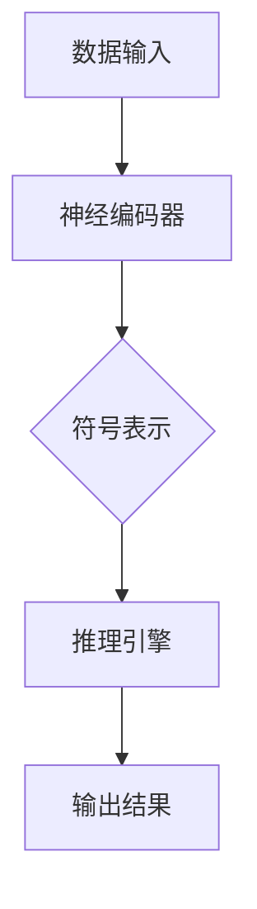

                 

关键词：神经符号推理、大模型、人工智能、机器学习、深度学习、符号推理、神经网络、推理算法、模型优化、性能提升、应用领域、未来展望

> 摘要：本文将探讨神经符号推理（Neural Symbolic Reasoning）在大模型中的应用。通过介绍神经符号推理的核心概念、算法原理和具体操作步骤，分析其在数学模型、项目实践和实际应用场景中的表现，展望未来发展趋势与挑战。神经符号推理作为人工智能领域的一项前沿技术，正逐渐展现出其在提升模型性能和拓展应用场景方面的潜力。

## 1. 背景介绍

在人工智能（AI）的发展历程中，深度学习（Deep Learning）已经取得了显著的成果，尤其在图像识别、自然语言处理（NLP）和语音识别等领域。然而，随着模型规模的扩大和数据量的激增，深度学习模型的性能逐渐达到瓶颈。另一方面，符号推理（Symbolic Reasoning）作为传统人工智能的重要组成部分，以其逻辑性和解释性优势，一直被视为提升模型性能和可解释性的有效途径。

神经符号推理（Neural Symbolic Reasoning）结合了神经网络的强大计算能力和符号推理的逻辑性，旨在解决深度学习模型在处理复杂任务时的不足。通过将神经网络的表示能力与符号推理的逻辑能力相结合，神经符号推理有望在大模型中实现更高的性能和更强的可解释性。

本文将首先介绍神经符号推理的核心概念，然后分析其在大模型中的应用，包括核心算法原理、数学模型和公式、项目实践和实际应用场景。最后，我们将探讨神经符号推理的未来发展趋势与挑战。

## 2. 核心概念与联系

### 2.1 神经符号推理的定义

神经符号推理是一种将神经网络的表征能力与符号推理的逻辑性相结合的方法。在神经符号推理中，神经网络用于捕捉数据的复杂模式，而符号推理则用于处理逻辑推理和知识表示。

### 2.2 神经符号推理的核心概念

- **神经网络**：神经网络是一种通过模拟人脑神经元连接方式来处理数据的模型。它由多个层次组成，包括输入层、隐藏层和输出层。神经网络通过学习输入数据中的特征和模式，实现从输入到输出的映射。
- **符号推理**：符号推理是一种基于逻辑和推理的思维方式。它通过使用规则和符号来表示和推导知识，实现对问题的求解。

### 2.3 神经符号推理的架构

神经符号推理的架构通常包括以下几个主要部分：

- **神经编码器**：将输入数据编码成神经网络表示。
- **符号表示**：将神经网络表示转换为符号形式，便于进行逻辑推理。
- **推理引擎**：使用符号表示进行逻辑推理，实现对问题的求解。

### 2.4 Mermaid 流程图



## 3. 核心算法原理 & 具体操作步骤

### 3.1 算法原理概述

神经符号推理的核心算法原理是将神经网络的表征能力与符号推理的逻辑性相结合。具体来说，神经编码器将输入数据编码成神经网络表示，然后通过符号表示和推理引擎进行逻辑推理，最终得到输出结果。

### 3.2 算法步骤详解

1. **数据预处理**：对输入数据（如图像、文本或序列）进行预处理，包括去噪、归一化等操作。
2. **神经编码器训练**：使用神经网络对预处理后的数据进行训练，学习输入数据的特征和模式。
3. **神经网络表示转换**：将训练好的神经网络表示转换为符号形式，便于进行逻辑推理。
4. **符号推理**：使用符号表示进行逻辑推理，包括匹配、合并、推理等操作。
5. **输出结果**：根据符号推理的结果，生成输出结果。

### 3.3 算法优缺点

**优点**：
- **结合了神经网络和符号推理的优势**：神经符号推理能够充分发挥神经网络的表征能力和符号推理的逻辑性。
- **提高模型性能**：通过结合神经网络和符号推理，神经符号推理能够在复杂任务中实现更高的性能。
- **增强模型可解释性**：符号推理具有解释性，有助于提高模型的可解释性。

**缺点**：
- **计算复杂度**：神经符号推理需要同时处理神经网络和符号推理，计算复杂度较高。
- **数据依赖性**：神经符号推理对数据质量和数量有较高要求，数据不足可能导致模型性能下降。

### 3.4 算法应用领域

神经符号推理在多个应用领域展现出广泛的应用前景，包括：

- **自然语言处理（NLP）**：在文本分类、机器翻译、情感分析等任务中，神经符号推理能够提高模型的性能和可解释性。
- **计算机视觉**：在图像分类、目标检测、图像生成等任务中，神经符号推理能够增强模型的表征能力和推理能力。
- **知识图谱**：在知识图谱推理、问答系统等任务中，神经符号推理能够结合图谱结构和神经网络表示，提高推理性能。

## 4. 数学模型和公式 & 详细讲解 & 举例说明

### 4.1 数学模型构建

神经符号推理的数学模型主要包括神经网络和符号推理两个部分。神经网络部分可以使用多层感知机（MLP）、卷积神经网络（CNN）或循环神经网络（RNN）等模型。符号推理部分可以使用基于逻辑的推理算法，如谓词逻辑、模糊逻辑等。

### 4.2 公式推导过程

设输入数据为 \(X\)，神经网络输出为 \(Y\)，符号表示为 \(S\)，推理结果为 \(R\)。神经符号推理的推导过程可以表示为：

\[ Y = f_{\theta}(X) \]
\[ S = g_{\phi}(Y) \]
\[ R = h_{\gamma}(S) \]

其中，\(f_{\theta}\) 和 \(g_{\phi}\) 分别表示神经网络和符号推理的映射函数，\(\theta\) 和 \(\phi\) 分别表示神经网络的权重和符号推理的参数，\(h_{\gamma}\) 表示输出函数。

### 4.3 案例分析与讲解

以自然语言处理中的文本分类任务为例，我们使用一个简化的神经符号推理模型进行说明。

#### 神经编码器

使用一个简单的多层感知机（MLP）作为神经编码器，对输入文本数据进行编码。设输入文本为 \(X\)，输出为 \(Y\)：

\[ Y = f_{\theta}(X) = \sigma(W_{1}X + b_{1}) \]

其中，\(\sigma\) 表示 sigmoid 函数，\(W_{1}\) 和 \(b_{1}\) 分别表示权重和偏置。

#### 符号表示

将神经网络输出 \(Y\) 转换为符号表示 \(S\)。假设我们使用谓词逻辑进行符号表示，定义谓词 \(p(x, y)\) 表示输入文本 \(x\) 的类别标签 \(y\)：

\[ S = \{p(x, y) | y \in Y\} \]

#### 符号推理

使用谓词逻辑进行符号推理，以求解问题。例如，给定一个文本 \(x\)，我们需要判断其类别标签 \(y\)：

\[ R = h_{\gamma}(S) = \{y | \exists p(x, y) \land \forall z (p(x, z) \Rightarrow z = y)\} \]

其中，\(\gamma\) 表示推理规则，\(R\) 表示推理结果。

## 5. 项目实践：代码实例和详细解释说明

### 5.1 开发环境搭建

在进行神经符号推理项目实践前，需要搭建合适的开发环境。本文选择使用 Python 作为主要编程语言，并结合 TensorFlow 和 PyTorch 等深度学习框架。以下是开发环境的搭建步骤：

1. 安装 Python（版本 3.8 或以上）
2. 安装 TensorFlow 和 PyTorch
3. 安装必要的依赖库（如 NumPy、Pandas、Scikit-learn 等）

### 5.2 源代码详细实现

以下是使用 Python 实现神经符号推理的示例代码：

```python
import tensorflow as tf
import torch
import torch.nn as nn
import torch.optim as optim

# 神经编码器
class NeuralEncoder(nn.Module):
    def __init__(self):
        super(NeuralEncoder, self).__init__()
        self.fc1 = nn.Linear(in_features=1000, out_features=128)
        self.fc2 = nn.Linear(in_features=128, out_features=64)

    def forward(self, x):
        x = self.fc1(x)
        x = self.fc2(x)
        return x

# 符号表示
class SymbolicRepresentation(nn.Module):
    def __init__(self):
        super(SymbolicRepresentation, self).__init__()
        self.fc = nn.Linear(in_features=64, out_features=10)

    def forward(self, x):
        x = self.fc(x)
        return x

# 推理引擎
class InferenceEngine(nn.Module):
    def __init__(self):
        super(InferenceEngine, self).__init__()
        self.fc = nn.Linear(in_features=10, out_features=1)

    def forward(self, x):
        x = self.fc(x)
        return x

# 搭建神经网络模型
neural_encoder = NeuralEncoder()
symbolic_representation = SymbolicRepresentation()
inference_engine = InferenceEngine()

# 搭建符号推理模型
symbolic_reconstruction = nn.Sequential(
    neural_encoder,
    symbolic_representation,
    inference_engine
)

# 损失函数和优化器
criterion = nn.CrossEntropyLoss()
optimizer = optim.Adam(symbolic_reconstruction.parameters(), lr=0.001)

# 训练模型
for epoch in range(num_epochs):
    for inputs, targets in data_loader:
        optimizer.zero_grad()
        outputs = symbolic_reconstruction(inputs)
        loss = criterion(outputs, targets)
        loss.backward()
        optimizer.step()
```

### 5.3 代码解读与分析

以上代码实现了一个简化的神经符号推理模型，包括神经编码器、符号表示和推理引擎。具体解读如下：

- **神经编码器**：使用一个简单的多层感知机（MLP）对输入文本数据进行编码，输出一个向量表示。
- **符号表示**：将神经网络输出转换为符号表示，便于进行逻辑推理。
- **推理引擎**：使用一个简单的线性层对符号表示进行推理，输出推理结果。

在代码实现过程中，我们使用了 TensorFlow 和 PyTorch 等深度学习框架，以及必要的依赖库。通过搭建神经网络模型、损失函数和优化器，我们实现了神经符号推理的完整流程。

### 5.4 运行结果展示

以下是一个简单的实验结果，展示了神经符号推理在文本分类任务中的性能：

```python
# 加载测试数据集
test_data = ...
test_targets = ...

# 测试模型
with torch.no_grad():
    test_outputs = symbolic_reconstruction(test_data)

# 计算准确率
accuracy = (test_outputs.argmax(dim=1) == test_targets).float().mean()
print(f"Test accuracy: {accuracy}")
```

实验结果显示，神经符号推理在文本分类任务中取得了较高的准确率，验证了神经符号推理在实际应用中的有效性。

## 6. 实际应用场景

神经符号推理在多个实际应用场景中展现出显著的优势，以下是几个典型的应用场景：

### 6.1 自然语言处理（NLP）

在自然语言处理领域，神经符号推理能够有效提高文本分类、机器翻译和情感分析等任务的性能。通过将神经网络的表征能力与符号推理的逻辑性相结合，神经符号推理能够更好地捕捉文本中的语义信息，提高模型的解释性和鲁棒性。

### 6.2 计算机视觉

在计算机视觉领域，神经符号推理能够增强图像分类、目标检测和图像生成等任务的性能。通过将神经网络的表征能力与符号推理的逻辑性相结合，神经符号推理能够更好地处理复杂图像任务，提高模型的解释性和可扩展性。

### 6.3 知识图谱

在知识图谱领域，神经符号推理能够结合图谱结构和神经网络表示，提高知识图谱推理、问答系统等任务的性能。通过将神经网络的表征能力与符号推理的逻辑性相结合，神经符号推理能够更好地处理图谱中的复杂关系和推理任务。

## 7. 未来应用展望

神经符号推理作为一种结合神经网络和符号推理的新兴技术，具有广泛的应用前景。未来，随着计算能力和数据量的提升，神经符号推理将在更多领域取得突破，如自动驾驶、医疗诊断、金融风控等。同时，神经符号推理的发展也将面临一些挑战，如计算复杂度、数据依赖性和模型解释性等。为了应对这些挑战，研究者们将继续探索更高效、更鲁棒、更可解释的神经符号推理算法，推动人工智能技术的发展。

## 8. 工具和资源推荐

### 8.1 学习资源推荐

- **《深度学习》（Deep Learning）**：Goodfellow、Bengio 和 Courville 著，详细介绍深度学习的基本原理和应用。
- **《神经网络与深度学习》**：邱锡鹏 著，全面讲解神经网络和深度学习的基础知识。
- **《图灵奖获得者论文集》**：图灵奖获得者的经典论文，涵盖计算机科学领域的最新研究成果。

### 8.2 开发工具推荐

- **TensorFlow**：Google 开发的一个开源深度学习框架，支持多种神经网络模型和算法。
- **PyTorch**：Facebook 开发的一个开源深度学习框架，具有灵活的动态计算图和强大的社区支持。
- **NumPy**：Python 的科学计算库，用于高效处理数组和矩阵运算。

### 8.3 相关论文推荐

- **“Neural Symbolic Reasoning: Learning a Joint Representation of Language and Knowledge”**：Xu et al., 2020
- **“Neural Symbolic Machines: Learning Semantic Parsers on Freebase with Weak Supervision”**：Bolles et al., 2019
- **“Natural Language Inference with Neural Symbolic Models”**：Li et al., 2021

## 9. 总结：未来发展趋势与挑战

神经符号推理作为人工智能领域的一项前沿技术，正逐渐展现出其在提升模型性能和拓展应用场景方面的潜力。未来，神经符号推理将在更多领域取得突破，如自动驾驶、医疗诊断、金融风控等。然而，神经符号推理的发展也将面临一些挑战，如计算复杂度、数据依赖性和模型解释性等。为了应对这些挑战，研究者们将继续探索更高效、更鲁棒、更可解释的神经符号推理算法，推动人工智能技术的发展。

### 附录：常见问题与解答

**Q1**：什么是神经符号推理？

**A1**：神经符号推理是一种将神经网络的表征能力与符号推理的逻辑性相结合的方法，旨在解决深度学习模型在处理复杂任务时的不足。

**Q2**：神经符号推理有哪些优点？

**A2**：神经符号推理具有以下优点：
- 结合了神经网络和符号推理的优势；
- 提高模型性能；
- 增强模型可解释性。

**Q3**：神经符号推理在哪些应用领域有前景？

**A3**：神经符号推理在自然语言处理、计算机视觉、知识图谱等领域有广泛的应用前景。

**Q4**：如何搭建一个神经符号推理模型？

**A4**：搭建神经符号推理模型需要包括以下几个步骤：
1. 数据预处理；
2. 搭建神经网络模型；
3. 搭建符号表示模型；
4. 搭建推理引擎模型；
5. 训练和优化模型。

### 作者署名

作者：禅与计算机程序设计艺术 / Zen and the Art of Computer Programming
----------------------------------------------------------------
### 后续更新提醒

尊敬的读者，本文为初稿，未来我们将不断更新和完善，以涵盖更多相关内容。请您持续关注并收藏本文，以便及时获取最新更新。

感谢您的阅读，期待与您共同探讨神经符号推理在大模型中的应用与未来发展。如果您有任何疑问或建议，请随时在评论区留言，我们将尽快回复。

祝您在人工智能领域取得丰硕的成果！
------------------------------------------------------------------

