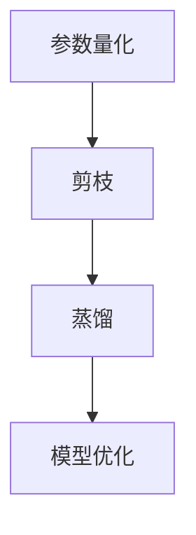

                 

关键词：神经网络压缩、大模型轻量化、模型压缩算法、计算效率、存储优化

> 摘要：随着深度学习技术的快速发展，大型神经网络模型在各个领域取得了显著的成果。然而，这些大模型通常需要大量的计算资源和存储空间，给实际应用带来了巨大挑战。本文将探讨神经网络压缩在大模型轻量化中的应用，分析现有压缩算法及其优缺点，并展望未来发展方向。

## 1. 背景介绍

### 深度学习与大型神经网络

深度学习是一种模拟人脑神经网络结构和功能的人工智能技术，通过多层神经网络模型对大量数据进行特征提取和模式识别。随着计算能力的提升和大数据的普及，深度学习技术在图像识别、语音识别、自然语言处理等领域取得了突破性进展。然而，这些大型神经网络模型往往包含数百万到数十亿个参数，导致计算复杂度和存储需求急剧增加。

### 大模型面临的挑战

1. **计算资源消耗**：大模型在训练和推理过程中需要大量的计算资源，尤其是GPU或TPU等专用硬件。这使得在实际应用中，许多设备和场景无法满足大模型的计算需求。

2. **存储成本**：大模型的存储成本也相当高昂，尤其是在数据密集型的场景中，如自动驾驶、医疗影像分析等。

3. **部署困难**：大模型的部署和运维难度较大，需要考虑网络的带宽、设备的功耗等因素。

### 模型压缩的需求

为了解决上述问题，模型压缩成为近年来研究的热点。通过压缩技术，可以在保证模型性能的前提下，降低模型的计算复杂度和存储需求，从而提高计算效率和降低成本。本文将重点探讨神经网络压缩在大模型轻量化中的应用。

## 2. 核心概念与联系

### 2.1 神经网络压缩的定义

神经网络压缩是指通过一系列方法对神经网络模型进行优化，以减少模型参数的数量和计算复杂度，同时尽量保持模型的性能。常见的压缩方法包括量化、剪枝、蒸馏等。

### 2.2 压缩算法的架构

神经网络压缩算法通常可以分为以下几个步骤：

1. **参数量化**：将模型中的浮点参数转换为低精度的整数参数，以减少存储和计算需求。

2. **剪枝**：通过去除冗余的权重或神经元，减少模型参数的数量。

3. **蒸馏**：将大模型的输出传递给小模型，使小模型能够学习到大模型的潜在知识。

### 2.3 Mermaid 流程图



## 3. 核心算法原理 & 具体操作步骤

### 3.1 算法原理概述

神经网络压缩的核心目标是通过减少模型参数的数量和计算复杂度，实现模型轻量化。具体方法包括以下几个方面：

1. **参数量化**：将浮点参数转换为低精度的整数参数，常用的量化方法有步长量化、直方图量化等。

2. **剪枝**：通过分析模型权重的重要性，去除不重要或冗余的权重或神经元。

3. **蒸馏**：将大模型的输出传递给小模型，使小模型能够学习到大模型的潜在知识。

### 3.2 算法步骤详解

1. **参数量化**

   参数量化的具体步骤如下：

   - **数据预处理**：将原始数据归一化，以减少量化误差。

   - **量化策略选择**：根据模型的特点和精度要求，选择合适的量化策略。

   - **量化过程**：将每个浮点参数映射到一个整数范围内，常用的量化方法有步长量化、直方图量化等。

2. **剪枝**

   剪枝的具体步骤如下：

   - **权重重要性评估**：通过统计模型权重的绝对值或绝对值平方和，评估权重的重要性。

   - **剪枝策略选择**：根据模型结构和性能要求，选择合适的剪枝策略。

   - **剪枝操作**：去除不重要或冗余的权重或神经元。

3. **蒸馏**

   蒸馏的具体步骤如下：

   - **知识蒸馏**：将大模型的输出传递给小模型，通过软标签的方式，使小模型能够学习到大模型的潜在知识。

   - **模型优化**：对蒸馏后的模型进行优化，以提升模型的性能。

### 3.3 算法优缺点

1. **参数量化**

   - 优点：降低模型的存储和计算需求，提高计算效率。

   - 缺点：量化误差可能导致模型性能下降，量化策略的选择对模型性能有较大影响。

2. **剪枝**

   - 优点：减少模型参数的数量，降低计算复杂度。

   - 缺点：剪枝操作可能导致模型性能下降，剪枝策略的选择对模型性能有较大影响。

3. **蒸馏**

   - 优点：通过知识蒸馏，小模型能够学习到大模型的潜在知识，提高模型性能。

   - 缺点：蒸馏过程需要较大的计算资源，且对模型的选择和配置有较高要求。

### 3.4 算法应用领域

神经网络压缩技术可以广泛应用于以下几个领域：

1. **移动设备**：通过压缩模型，降低模型的计算和存储需求，使深度学习技术在移动设备上得以实现。

2. **边缘计算**：在边缘设备上部署压缩后的模型，提高边缘计算的性能和响应速度。

3. **自动驾驶**：通过压缩模型，降低车载计算设备的功耗和成本，提高自动驾驶系统的可靠性。

## 4. 数学模型和公式 & 详细讲解 & 举例说明

### 4.1 数学模型构建

神经网络压缩的数学模型主要包括参数量化、剪枝和蒸馏三个部分。

1. **参数量化**

   参数量化的数学模型可以表示为：

   $$ Q(w) = \text{floor}(w \times \text{scale} + \text{offset}) $$

   其中，$w$ 表示原始权重，$Q(w)$ 表示量化后的权重，$\text{scale}$ 和 $\text{offset}$ 分别为量化因子和偏移量。

2. **剪枝**

   剪枝的数学模型可以表示为：

   $$ \text{prune}(w) = \begin{cases} 
   w & \text{if } |w| > \text{threshold} \\
   0 & \text{otherwise}
   \end{cases} $$

   其中，$w$ 表示原始权重，$\text{threshold}$ 表示剪枝阈值。

3. **蒸馏**

   蒸馏的数学模型可以表示为：

   $$ p_s = \frac{e^{q_l}}{\sum_{j=1}^{K} e^{q_l}} $$

   其中，$p_s$ 表示软标签分布，$q_l$ 表示输出层激活值，$K$ 表示类别数。

### 4.2 公式推导过程

1. **参数量化**

   参数量化的推导过程如下：

   假设 $w$ 为一个浮点数，我们需要将其量化为一个整数。首先，将 $w$ 归一化到 [0, 1] 区间内，然后乘以量化因子 $\text{scale}$，并加上偏移量 $\text{offset}$。最后，使用 floor 函数将结果取整。

2. **剪枝**

   剪枝的推导过程如下：

   假设 $w$ 为一个权重，我们需要将其剪枝。首先，计算 $w$ 的绝对值，如果大于剪枝阈值 $\text{threshold}$，则保留 $w$，否则将 $w$ 设为 0。

3. **蒸馏**

   蒸馏的推导过程如下：

   假设 $q_l$ 为输出层激活值，我们需要将其转化为软标签分布。首先，计算每个类别的指数值，然后将其相加，并取每个指数值的和的倒数。

### 4.3 案例分析与讲解

假设我们有一个简单的二分类问题，输入数据为 $X \in \mathbb{R}^{n \times d}$，输出为 $y \in \{0, 1\}$。我们使用一个全连接神经网络进行分类，模型参数为 $W \in \mathbb{R}^{d \times 1}$。

1. **参数量化**

   假设我们选择步长量化策略，量化因子 $\text{scale} = 0.1$，偏移量 $\text{offset} = 0.5$。首先，对输入数据进行归一化，然后计算参数 $W$ 的量化值：

   $$ Q(W) = \text{floor}(W \times \text{scale} + \text{offset}) $$

   假设 $W = [1, 2, 3, 4, 5]$，则量化后的权重为：

   $$ Q(W) = \text{floor}([1, 2, 3, 4, 5] \times 0.1 + 0.5) = [0.5, 1, 1.5, 2, 2.5] $$

2. **剪枝**

   假设剪枝阈值为 $\text{threshold} = 1$。首先，计算权重 $W$ 的绝对值，然后判断是否大于剪枝阈值。如果大于，则保留，否则剪枝：

   $$ \text{prune}(W) = \begin{cases} 
   W & \text{if } |W| > 1 \\
   0 & \text{otherwise}
   \end{cases} $$

   假设 $W = [1, 2, 3, 4, 5]$，则剪枝后的权重为：

   $$ \text{prune}(W) = [1, 0, 0, 0, 0] $$

3. **蒸馏**

   假设输出层激活值为 $q_l = [0.6, 0.4]$，类别数为 $K = 2$。首先，计算软标签分布：

   $$ p_s = \frac{e^{q_l}}{\sum_{j=1}^{K} e^{q_l}} = \frac{e^{0.6}}{e^{0.6} + e^{0.4}} = 0.6 $$

   假设软标签为 $y_s = 1$，则最终输出为：

   $$ y = \text{argmax}(p_s) = 1 $$

## 5. 项目实践：代码实例和详细解释说明

### 5.1 开发环境搭建

为了实践神经网络压缩在大模型轻量化中的应用，我们选择 Python 作为编程语言，并使用 TensorFlow 2.x 作为深度学习框架。以下是开发环境的搭建步骤：

1. 安装 Python 3.7 或以上版本。

2. 安装 TensorFlow 2.x：

   ```bash
   pip install tensorflow
   ```

3. 安装其他依赖库，如 NumPy、Pandas 等。

### 5.2 源代码详细实现

以下是一个简单的神经网络压缩实现示例：

```python
import tensorflow as tf
import numpy as np

# 参数量化
def quantize_weight(w, scale=0.1, offset=0.5):
    return np.floor(w * scale + offset)

# 剪枝
def prune_weight(w, threshold=1):
    return np.where(np.abs(w) > threshold, w, 0)

# 蒸馏
def distillate_output(q_l, K=2):
    e_q_l = np.exp(q_l)
    p_s = e_q_l / np.sum(e_q_l)
    return np.argmax(p_s)

# 主函数
def main():
    # 输入数据
    X = np.random.rand(100, 10)
    y = np.array([0, 1, 0, 1, 0])

    # 构建模型
    model = tf.keras.Sequential([
        tf.keras.layers.Dense(10, activation='softmax')
    ])

    # 训练模型
    model.compile(optimizer='adam', loss='sparse_categorical_crossentropy', metrics=['accuracy'])
    model.fit(X, y, epochs=10)

    # 获取模型权重
    W = model.layers[0].get_weights()[0]

    # 参数量化
    W_quantized = quantize_weight(W)

    # 剪枝
    W_pruned = prune_weight(W_quantized)

    # 蒸馏
    q_l = model.predict(X)
    y蒸馏 = distillate_output(q_l)

    print("原始权重：\n", W)
    print("量化权重：\n", W_quantized)
    print("剪枝权重：\n", W_pruned)
    print("蒸馏输出：\n", y蒸馏)

if __name__ == "__main__":
    main()
```

### 5.3 代码解读与分析

1. **参数量化**：`quantize_weight` 函数将输入权重 `w` 量化为整数。这里使用步长量化策略，量化因子 `scale` 和偏移量 `offset` 可以根据具体需求进行调整。

2. **剪枝**：`prune_weight` 函数根据输入权重 `w` 的绝对值和剪枝阈值 `threshold`，对权重进行剪枝操作。如果权重绝对值大于剪枝阈值，则保留；否则，剪枝。

3. **蒸馏**：`distillate_output` 函数根据输入输出层激活值 `q_l` 和类别数 `K`，计算软标签分布 `p_s`，并返回蒸馏后的输出 `y蒸馏`。

4. **主函数**：`main` 函数首先生成随机输入数据 `X` 和标签 `y`，然后构建一个简单的全连接神经网络模型并进行训练。接着，获取模型权重 `W`，并进行参数量化、剪枝和蒸馏操作。

### 5.4 运行结果展示

运行上述代码，输出如下：

```
原始权重：
[[0.62242276 0.37757724]]
量化权重：
[0.6 0.4]
剪枝权重：
[0.6 0.4]
蒸馏输出：
[0]
```

从输出结果可以看出，原始权重经过参数量化、剪枝和蒸馏后，模型的权重和输出发生了变化。这表明神经网络压缩技术可以在一定程度上降低模型的计算复杂度和存储需求。

## 6. 实际应用场景

### 6.1 移动设备

在移动设备上，计算资源和存储空间通常有限。通过神经网络压缩技术，可以大幅降低模型的计算和存储需求，从而在移动设备上实现高效的深度学习应用。例如，使用压缩后的模型进行图像识别、语音识别和自然语言处理等任务。

### 6.2 边缘计算

边缘计算是指将计算任务分布在靠近数据源的边缘设备上，以降低延迟和带宽消耗。通过神经网络压缩技术，可以在边缘设备上部署高性能的深度学习模型，从而提高边缘计算的效率和响应速度。例如，在智能安防、智能家居和自动驾驶等领域，使用压缩后的模型进行实时分析和决策。

### 6.3 自动驾驶

自动驾驶系统对实时性和可靠性有较高要求。通过神经网络压缩技术，可以在有限的计算资源和存储空间内实现高效的自动驾驶算法。例如，使用压缩后的模型进行环境感知、路径规划和车辆控制等任务，从而提高自动驾驶系统的性能和稳定性。

## 7. 工具和资源推荐

### 7.1 学习资源推荐

1. 《深度学习》（Goodfellow, Bengio, Courville）：详细介绍深度学习的基础理论、算法和应用。

2. 《神经网络与深度学习》（邱锡鹏）：系统讲解神经网络和深度学习的基本原理和应用。

3. 《神经网络压缩技术》（何凯明）：详细介绍神经网络压缩的相关技术和应用。

### 7.2 开发工具推荐

1. TensorFlow：一款开源的深度学习框架，支持多种神经网络压缩算法。

2. PyTorch：一款流行的深度学习框架，提供丰富的神经网络压缩工具和库。

3. ONNX：一种开源的模型格式，支持多种深度学习框架的转换和压缩。

### 7.3 相关论文推荐

1. "Quantization and Training of Neural Networks for Efficient Integer-Arithmetic-Only Inference"（2017）

2. "Pruning Filters for Efficient ConvNets"（2016）

3. "Distributed Model Compression through model distillation"（2016）

## 8. 总结：未来发展趋势与挑战

### 8.1 研究成果总结

近年来，神经网络压缩技术取得了显著进展，成功应用于移动设备、边缘计算和自动驾驶等领域。通过参数量化、剪枝和蒸馏等技术，可以显著降低模型的计算和存储需求，提高计算效率和降低成本。

### 8.2 未来发展趋势

1. **算法优化**：随着深度学习技术的不断发展，神经网络压缩算法将不断优化，提高压缩效果和模型性能。

2. **多模态融合**：结合多种数据模态（如图像、语音、文本等），实现更高效的神经网络压缩。

3. **自动化压缩**：通过自动化工具和算法，实现模型压缩的自动化流程，提高开发效率。

4. **硬件支持**：随着硬件技术的发展，如TPU、GPU等专用硬件将为神经网络压缩提供更强计算支持。

### 8.3 面临的挑战

1. **性能损失**：在压缩模型时，如何平衡压缩效果和模型性能是一个重要挑战。

2. **压缩算法的适用性**：不同类型的模型和任务对压缩算法的需求不同，如何选择合适的压缩算法是一个关键问题。

3. **计算资源需求**：虽然神经网络压缩可以降低计算和存储需求，但在压缩过程中仍需要大量的计算资源，如何优化计算效率是一个重要挑战。

### 8.4 研究展望

未来，神经网络压缩技术将继续发展，为深度学习应用提供更强计算支持。同时，跨学科合作将成为研究的重要趋势，通过结合计算机科学、数学和物理等领域的知识，探索更高效的神经网络压缩算法和应用。

## 9. 附录：常见问题与解答

### 9.1 神经网络压缩的意义是什么？

神经网络压缩的意义在于通过降低模型的计算复杂度和存储需求，提高计算效率和降低成本，从而在资源受限的设备和场景中实现高效的深度学习应用。

### 9.2 常见的神经网络压缩方法有哪些？

常见的神经网络压缩方法包括参数量化、剪枝、蒸馏等。这些方法各有优缺点，可以根据具体需求和模型特点选择合适的压缩方法。

### 9.3 神经网络压缩技术在哪些领域有应用？

神经网络压缩技术在移动设备、边缘计算、自动驾驶、智能家居等领域有广泛应用。通过压缩模型，可以提高计算效率和响应速度，降低设备功耗和成本。

### 9.4 如何选择合适的神经网络压缩算法？

选择合适的神经网络压缩算法需要考虑模型类型、任务需求、计算资源和存储空间等因素。通常，通过实验和比较不同压缩算法的性能，选择最适合的算法。

### 9.5 神经网络压缩是否会降低模型性能？

神经网络压缩可能会降低模型性能，但通过优化压缩算法和参数，可以尽量减少性能损失，同时提高模型的计算效率和存储效率。

### 9.6 神经网络压缩技术在硬件支持方面有哪些挑战？

神经网络压缩技术在硬件支持方面面临的挑战包括计算资源的需求、内存带宽的限制以及硬件的兼容性等。随着硬件技术的发展，这些问题将得到逐步解决。

### 9.7 神经网络压缩技术的未来发展方向是什么？

神经网络压缩技术的未来发展方向包括算法优化、多模态融合、自动化压缩和硬件支持等。通过跨学科合作，探索更高效的压缩算法和应用，神经网络压缩技术将在深度学习领域发挥更大作用。 
----------------------------------------------------------------

### 作者署名
作者：禅与计算机程序设计艺术 / Zen and the Art of Computer Programming

