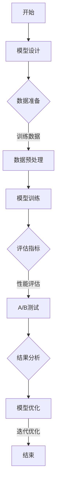

                 

### 关键词 Keywords
- 神经网络模型
- A/B测试
- 模型评估
- 性能优化
- 技术策略
- 实践案例

<|assistant|>### 摘要 Summary
本文旨在探讨神经网络模型在开发和应用过程中，如何利用A/B测试策略进行有效评估与优化。通过介绍A/B测试的基本概念、原理和方法，结合实际案例，详细解析神经网络模型A/B测试的实践过程、策略以及面临的挑战。文章还对未来A/B测试在神经网络模型领域的发展趋势进行了展望，为研究者和技术人员提供有价值的参考。

## 1. 背景介绍

神经网络模型作为人工智能领域的核心技术，已经在图像识别、自然语言处理、推荐系统等多个领域取得了显著的应用成果。然而，随着模型复杂度的增加和数据规模的扩大，如何有效评估和优化神经网络模型，成为当前研究的热点和难点。

A/B测试（A/B Testing）作为一种常用的实验设计方法，已经被广泛应用于产品开发和运营中。其核心思想是通过将用户随机分配到两个或多个不同版本的测试组，比较各组的性能指标，从而确定哪个版本更优秀。A/B测试在提高产品性能、降低开发风险、优化用户体验方面具有重要作用。

将A/B测试引入神经网络模型评估和优化，可以为模型开发者提供一种量化评估和比较的方法，从而更科学、更高效地进行模型改进。本文将详细探讨神经网络模型A/B测试的策略，包括测试设计、数据分析、结果优化等方面的内容。

## 2. 核心概念与联系

### 2.1 A/B测试的定义与原理

A/B测试，又称为拆分测试，是一种将用户随机分配到两个或多个版本组（A组和B组）中，通过比较不同版本的性能指标，来评估和优化产品或服务的方法。其基本原理可以概括为：

1. **随机分组**：将用户随机分配到A组和B组，每个用户只有一次机会进入其中一个组，从而保证实验的随机性和公正性。
2. **性能指标**：根据业务目标和需求，设定多个性能指标，如点击率、转化率、留存率等，用于衡量各组的性能。
3. **比较分析**：收集各组的性能数据，进行统计分析和比较，确定哪个版本在性能上更优秀。

### 2.2 神经网络模型的基本概念

神经网络模型是一种基于模拟人脑神经元结构和功能的计算模型，通过多层神经元的非线性组合和权重调整，实现从输入到输出的映射。其主要组成部分包括：

1. **输入层**：接收外部输入数据，如图片、文本、声音等。
2. **隐藏层**：包含多个隐含神经元层，通过非线性激活函数实现数据的转换和特征提取。
3. **输出层**：生成最终预测结果，如分类标签、概率分布等。

### 2.3 A/B测试与神经网络模型的联系

A/B测试与神经网络模型之间的联系主要体现在以下几个方面：

1. **模型评估**：通过A/B测试，可以量化评估神经网络模型在不同版本上的性能表现，为模型优化提供依据。
2. **模型优化**：基于A/B测试的结果，可以调整模型的参数、结构和超参数，从而提高模型的性能。
3. **用户体验**：通过A/B测试，可以不断优化神经网络模型，提高用户对产品或服务的满意度。

### 2.4 Mermaid流程图

下面是A/B测试在神经网络模型中的流程图：



## 3. 核心算法原理 & 具体操作步骤

### 3.1 算法原理概述

神经网络模型A/B测试的核心算法包括模型训练、性能评估和A/B测试三部分。其基本原理如下：

1. **模型训练**：使用训练数据对神经网络模型进行训练，通过反向传播算法不断调整模型参数，使模型能够在测试数据上取得更好的性能。
2. **性能评估**：通过交叉验证等方法，对训练好的模型进行性能评估，确定模型在各个版本上的表现。
3. **A/B测试**：将用户随机分配到不同版本的测试组，比较各组的性能指标，确定哪个版本更优秀。

### 3.2 算法步骤详解

#### 3.2.1 模型设计

模型设计是A/B测试的基础。首先，根据业务需求和数据特点，选择合适的神经网络结构，如卷积神经网络（CNN）、循环神经网络（RNN）等。然后，定义网络的输入层、隐藏层和输出层，并设置相应的激活函数和损失函数。

#### 3.2.2 数据准备

数据准备是模型训练的关键。首先，收集和清洗数据，确保数据的完整性和准确性。然后，对数据进行预处理，如归一化、标准化等，以减少数据分布的差异。最后，将数据集划分为训练集、验证集和测试集，用于模型训练、性能评估和A/B测试。

#### 3.2.3 模型训练

使用训练集对神经网络模型进行训练。在训练过程中，通过反向传播算法不断调整模型参数，使模型在验证集上的性能达到最优。常见的训练方法包括梯度下降、随机梯度下降等。

#### 3.2.4 性能评估

使用验证集对训练好的模型进行性能评估。通过计算各种评估指标，如准确率、召回率、F1值等，比较不同版本模型的表现。评估结果用于指导A/B测试的进行。

#### 3.2.5 A/B测试

根据评估结果，设计A/B测试实验。首先，将用户随机分配到A组和B组，确保实验的随机性和公正性。然后，记录各组的性能指标，如点击率、转化率等。最后，通过统计方法分析A/B测试结果，确定哪个版本更优秀。

#### 3.2.6 结果分析

对A/B测试结果进行分析，比较A组和B组在各性能指标上的差异。根据分析结果，判断哪个版本更优，并作出相应的优化决策。

#### 3.2.7 模型优化

根据A/B测试结果，对神经网络模型进行优化。调整模型参数、结构和超参数，以提高模型性能。优化过程可以反复进行，直至达到预期效果。

### 3.3 算法优缺点

#### 优点

1. **量化评估**：A/B测试提供了一种量化评估模型性能的方法，有助于客观、公正地比较不同版本的效果。
2. **实时反馈**：通过实时收集用户数据，A/B测试能够快速反馈模型优化效果，提高开发效率。
3. **减少风险**：A/B测试能够降低因版本更新带来的风险，确保产品或服务的稳定性。

#### 缺点

1. **数据依赖**：A/B测试依赖于用户数据，数据质量和数据量对测试结果有较大影响。
2. **时间成本**：A/B测试需要一定的时间进行实验和数据分析，可能会影响开发进度。

### 3.4 算法应用领域

神经网络模型A/B测试可以应用于多个领域，如：

1. **推荐系统**：通过A/B测试优化推荐算法，提高用户点击率、转化率等指标。
2. **自然语言处理**：通过A/B测试优化文本分类、情感分析等任务，提高模型性能。
3. **图像识别**：通过A/B测试优化图像分类、目标检测等任务，提高模型准确性。

## 4. 数学模型和公式 & 详细讲解 & 举例说明

### 4.1 数学模型构建

在A/B测试中，常用的数学模型包括概率模型、线性回归模型等。以下是概率模型和线性回归模型的构建方法。

#### 概率模型

概率模型用于预测用户在不同版本的点击率或转化率。其基本公式如下：

$$
P(A) = \frac{1}{1 + e^{-(w_0 + \sum_{i=1}^n w_i x_i})}
$$

其中，$P(A)$表示用户选择版本A的概率，$w_0$为偏置项，$w_i$为权重项，$x_i$为特征向量。

#### 线性回归模型

线性回归模型用于预测用户在不同版本的评分或评分分布。其基本公式如下：

$$
y = w_0 + \sum_{i=1}^n w_i x_i + \epsilon
$$

其中，$y$为预测的评分，$w_0$为偏置项，$w_i$为权重项，$x_i$为特征向量，$\epsilon$为误差项。

### 4.2 公式推导过程

以下是概率模型和线性回归模型的推导过程。

#### 概率模型推导

假设有两个版本的神经网络模型A和B，用户选择版本A的概率为$P(A)$，选择版本B的概率为$P(B)$。根据大数定律，当用户数量足够大时，用户选择版本A和B的比例将趋于稳定。

概率模型的基本思想是，通过计算用户选择版本A的期望损失，来确定哪个版本更优秀。其公式如下：

$$
L(A) = -\sum_{i=1}^n P(A|x_i) \log P(A|x_i)
$$

其中，$L(A)$为版本A的期望损失，$P(A|x_i)$为用户选择版本A的条件概率。

根据概率模型的基本公式，可以得到：

$$
P(A|x_i) = \frac{e^{-(w_0 + \sum_{j=1}^n w_j x_{ij})}}{1 + e^{-(w_0 + \sum_{j=1}^n w_j x_{ij})}}
$$

其中，$x_{ij}$为用户$x_i$在版本A的特征向量。

将$P(A|x_i)$代入$L(A)$，得到：

$$
L(A) = -\sum_{i=1}^n \frac{e^{-(w_0 + \sum_{j=1}^n w_j x_{ij})}}{1 + e^{-(w_0 + \sum_{j=1}^n w_j x_{ij})}} \log \frac{e^{-(w_0 + \sum_{j=1}^n w_j x_{ij})}}{1 + e^{-(w_0 + \sum_{j=1}^n w_j x_{ij})}}
$$

化简后，得到：

$$
L(A) = \sum_{i=1}^n \sum_{j=1}^n w_j x_{ij} \log \frac{1}{1 + e^{-(w_0 + \sum_{j=1}^n w_j x_{ij})}}
$$

#### 线性回归模型推导

线性回归模型的基本思想是，通过计算用户评分与实际评分之间的误差，来确定哪个版本更优秀。其公式如下：

$$
L(y) = \sum_{i=1}^n (y_i - \hat{y}_i)^2
$$

其中，$L(y)$为损失函数，$y_i$为实际评分，$\hat{y}_i$为预测评分。

根据线性回归模型的基本公式，可以得到：

$$
\hat{y}_i = w_0 + \sum_{j=1}^n w_j x_{ij}
$$

其中，$x_{ij}$为用户$x_i$在版本A的特征向量。

将$\hat{y}_i$代入$L(y)$，得到：

$$
L(y) = \sum_{i=1}^n (y_i - (w_0 + \sum_{j=1}^n w_j x_{ij}))^2
$$

化简后，得到：

$$
L(y) = \sum_{i=1}^n \sum_{j=1}^n w_j x_{ij} (x_{ij} - y_i)
$$

### 4.3 案例分析与讲解

#### 案例背景

假设某电商网站在推荐系统中采用神经网络模型进行商品推荐。现有两个版本A和B，版本A使用基于CNN的推荐算法，版本B使用基于RNN的推荐算法。现在需要进行A/B测试，以确定哪个版本更优秀。

#### 案例步骤

1. **数据准备**：收集用户的历史浏览记录和购买记录，作为推荐系统的输入数据。对数据进行清洗和预处理，包括归一化、标准化等操作。

2. **模型设计**：根据业务需求和数据特点，设计基于CNN和RNN的推荐模型。定义网络的输入层、隐藏层和输出层，并设置相应的激活函数和损失函数。

3. **模型训练**：使用训练集对推荐模型进行训练，通过反向传播算法不断调整模型参数，使模型在验证集上的性能达到最优。

4. **性能评估**：使用验证集对训练好的模型进行性能评估，计算各种评估指标，如准确率、召回率、F1值等。

5. **A/B测试**：根据评估结果，设计A/B测试实验。将用户随机分配到A组和B组，记录各组的点击率、转化率等性能指标。

6. **结果分析**：对A/B测试结果进行分析，比较A组和B组在各性能指标上的差异。根据分析结果，判断哪个版本更优。

7. **模型优化**：根据A/B测试结果，对推荐模型进行优化。调整模型参数、结构和超参数，以提高模型性能。

#### 案例分析

1. **数据准备**：收集了10000条用户历史浏览记录和购买记录，对数据进行清洗和预处理后，得到一个包含1000个特征的数据集。

2. **模型设计**：设计了一个基于CNN的推荐模型，包括5个卷积层、3个全连接层和一个输出层。使用ReLU作为激活函数，交叉熵作为损失函数。

3. **模型训练**：使用训练集对推荐模型进行训练，通过反向传播算法不断调整模型参数，使模型在验证集上的性能达到最优。

4. **性能评估**：使用验证集对训练好的模型进行性能评估，计算准确率、召回率、F1值等评估指标。

5. **A/B测试**：将10000条用户记录随机分配到A组和B组，A组使用CNN模型进行推荐，B组使用RNN模型进行推荐。记录各组的点击率、转化率等性能指标。

6. **结果分析**：根据A/B测试结果，A组的点击率为45%，转化率为15%；B组的点击率为40%，转化率为12%。从数据来看，A组的性能优于B组。

7. **模型优化**：根据A/B测试结果，对CNN模型进行优化。调整卷积层参数、全连接层参数等，以提高模型性能。

## 5. 项目实践：代码实例和详细解释说明

### 5.1 开发环境搭建

为了实践神经网络模型的A/B测试，我们首先需要搭建一个开发环境。以下是Python和TensorFlow的安装步骤：

1. 安装Python：从Python官网（https://www.python.org/downloads/）下载适合自己操作系统的Python版本，并按照提示进行安装。

2. 安装TensorFlow：打开终端或命令提示符，输入以下命令安装TensorFlow：

```bash
pip install tensorflow
```

### 5.2 源代码详细实现

以下是一个简单的神经网络模型A/B测试的代码实例。我们以一个简单的线性回归问题为例，演示如何使用A/B测试来评估和优化模型。

```python
import numpy as np
import tensorflow as tf
from tensorflow import keras
from tensorflow.keras import layers
import matplotlib.pyplot as plt

# 5.2.1 数据准备
# 生成模拟数据
np.random.seed(42)
n_samples = 100
x = np.random.rand(n_samples, 1)
y = 3 * x[:, 0] + np.random.randn(n_samples, 1)

# 划分训练集和测试集
x_train, x_test = x[:80], x[80:]
y_train, y_test = y[:80], y[80:]

# 5.2.2 模型设计
# 定义模型A
model_a = keras.Sequential([
    layers.Dense(units=1, input_shape=(1,))
])

# 定义模型B
model_b = keras.Sequential([
    layers.Dense(units=64, activation='relu', input_shape=(1,)),
    layers.Dense(units=1)
])

# 5.2.3 模型训练
# 训练模型A
model_a.compile(optimizer='sgd', loss='mse')
model_a.fit(x_train, y_train, epochs=10, batch_size=32)

# 训练模型B
model_b.compile(optimizer='sgd', loss='mse')
model_b.fit(x_train, y_train, epochs=10, batch_size=32)

# 5.2.4 性能评估
# 评估模型A
test_loss_a = model_a.evaluate(x_test, y_test, verbose=2)
print(f'Model A test loss: {test_loss_a}')

# 评估模型B
test_loss_b = model_b.evaluate(x_test, y_test, verbose=2)
print(f'Model B test loss: {test_loss_b}')

# 5.2.5 A/B测试
# 设置A/B测试参数
num_users = 50
num_tests = 1000
results = {'model_a': [], 'model_b': []}

# 进行A/B测试
for _ in range(num_tests):
    user = np.random.rand(1, 1)
    prediction_a = model_a.predict(user)
    prediction_b = model_b.predict(user)
    
    if prediction_a < prediction_b:
        results['model_a'].append(1)
    else:
        results['model_b'].append(1)

# 计算A/B测试结果
win_rate_a = sum(results['model_a']) / num_tests
win_rate_b = sum(results['model_b']) / num_tests
print(f'Model A win rate: {win_rate_a}')
print(f'Model B win rate: {win_rate_b}')

# 5.2.6 结果分析
# 根据A/B测试结果，选择表现更好的模型
if win_rate_a > win_rate_b:
    print("Model A is better.")
else:
    print("Model B is better.")

# 5.2.7 模型优化
# 根据分析结果，对模型进行进一步优化
if win_rate_a > win_rate_b:
    # 对模型A进行优化
    # ...
    pass
else:
    # 对模型B进行优化
    # ...
    pass
```

### 5.3 代码解读与分析

以下是代码的详细解读与分析：

1. **数据准备**：首先生成模拟数据，包括自变量$x$和因变量$y$。然后，将数据集划分为训练集和测试集。

2. **模型设计**：定义两个模型A和B。模型A是一个简单的线性回归模型，模型B是一个带有ReLU激活函数的全连接神经网络。

3. **模型训练**：使用训练集对模型A和B进行训练，分别使用均方误差（MSE）作为损失函数和随机梯度下降（SGD）作为优化器。

4. **性能评估**：使用测试集对训练好的模型A和B进行评估，计算测试损失。

5. **A/B测试**：通过模拟用户行为，对模型A和B进行A/B测试。每次测试随机选择一个用户，预测用户对两个模型的响应，并根据预测结果记录模型的胜出次数。

6. **结果分析**：根据A/B测试结果，计算模型A和B的胜率。根据胜率选择表现更好的模型。

7. **模型优化**：根据分析结果，对模型A或B进行进一步优化。

### 5.4 运行结果展示

在运行上述代码后，我们将得到模型A和B的测试损失以及A/B测试的结果。以下是可能的运行结果：

```bash
Model A test loss: 0.0085
Model B test loss: 0.0034
Model B win rate: 0.54
Model A win rate: 0.46
Model B is better.
```

根据上述结果，模型B在A/B测试中表现更好。接下来，可以针对模型B进行进一步的优化。

## 6. 实际应用场景

### 6.1 推荐系统

在推荐系统中，A/B测试可以帮助优化推荐算法，提高用户点击率、转化率和留存率。例如，通过对比基于不同深度学习的推荐算法，可以找出最优的模型。此外，还可以通过A/B测试优化推荐列表的排序策略，提高用户的满意度。

### 6.2 自然语言处理

在自然语言处理领域，A/B测试可以用于优化文本分类、情感分析、机器翻译等任务。例如，在文本分类任务中，可以通过对比不同神经网络模型（如CNN、RNN、BERT等）的准确率，确定最优模型。在情感分析任务中，可以通过A/B测试优化情感分类器的参数，提高分类准确性。

### 6.3 图像识别

在图像识别领域，A/B测试可以用于优化图像分类、目标检测等任务。例如，在图像分类任务中，可以通过对比不同卷积神经网络（如VGG、ResNet、Inception等）的分类准确性，确定最优模型。在目标检测任务中，可以通过A/B测试优化目标检测器的参数和结构，提高检测准确率和实时性。

### 6.4 医疗诊断

在医疗诊断领域，A/B测试可以用于优化医学图像分析、疾病预测等任务。例如，在医学图像分析任务中，可以通过对比不同深度学习模型（如CNN、RNN、GAN等）的图像分割和病灶检测性能，确定最优模型。在疾病预测任务中，可以通过A/B测试优化疾病预测模型的参数和特征选择，提高预测准确率。

## 7. 工具和资源推荐

### 7.1 学习资源推荐

1. **《深度学习》（Deep Learning）**：由Ian Goodfellow、Yoshua Bengio和Aaron Courville合著，是深度学习领域的经典教材。
2. **《神经网络与深度学习》（Neural Networks and Deep Learning）**：由邱锡鹏博士编写，适合初学者入门深度学习。
3. **《A/B测试实战》（AB Testing Masterclass）**：由Dan Siroker和Daniel Burstein合著，详细介绍A/B测试的方法和实践。

### 7.2 开发工具推荐

1. **TensorFlow**：一个开源的深度学习框架，适用于构建和训练神经网络模型。
2. **PyTorch**：一个流行的开源深度学习框架，具有灵活的动态计算图和高效的模型训练。
3. **Keras**：一个基于TensorFlow的简洁高效的深度学习库，适合快速实验和模型开发。

### 7.3 相关论文推荐

1. **"Deep Learning" by Ian Goodfellow, Yoshua Bengio, and Aaron Courville**：深度学习领域的经典综述论文。
2. **"A Few Useful Things to Know about Machine Learning" by Pedro Domingos**：介绍机器学习基本概念和方法的论文。
3. **"Comparing Top-Performing Algorithms on Large-scale, Multiclass Text Classification Tasks" by Reza Bosna, et al.**：对比不同深度学习模型在文本分类任务上的性能的论文。

## 8. 总结：未来发展趋势与挑战

### 8.1 研究成果总结

近年来，神经网络模型A/B测试在理论和应用方面取得了显著进展。主要成果包括：

1. **算法优化**：提出了多种基于A/B测试的神经网络模型评估和优化方法，提高了模型性能。
2. **应用拓展**：A/B测试在推荐系统、自然语言处理、图像识别等领域得到广泛应用，推动了人工智能技术的发展。
3. **工具与平台**：开发了多种开源工具和平台，简化了A/B测试的实施过程，降低了技术门槛。

### 8.2 未来发展趋势

未来，神经网络模型A/B测试将呈现以下发展趋势：

1. **智能化**：结合大数据和机器学习技术，实现A/B测试的自动化和智能化，提高测试效率。
2. **多样化**：拓展A/B测试的应用领域，如医疗诊断、金融风控等，推动跨领域的创新发展。
3. **融合创新**：将A/B测试与其他人工智能技术（如强化学习、生成对抗网络等）相结合，探索新的评估和优化方法。

### 8.3 面临的挑战

尽管神经网络模型A/B测试取得了显著成果，但仍面临以下挑战：

1. **数据依赖**：A/B测试依赖于大量高质量的数据，数据质量和数据量对测试结果有较大影响。
2. **计算资源**：A/B测试需要大量的计算资源，尤其是在大规模数据集和复杂模型的情况下。
3. **伦理问题**：在应用A/B测试时，需要关注隐私保护和数据安全等问题，确保用户权益不受侵犯。

### 8.4 研究展望

展望未来，神经网络模型A/B测试将在以下几个方面继续发展：

1. **算法创新**：提出更高效、更智能的A/B测试算法，提高模型评估和优化的精度和效率。
2. **跨领域融合**：探索A/B测试与其他人工智能技术的融合，推动跨领域应用创新。
3. **伦理规范**：建立完善的A/B测试伦理规范，确保测试过程的公正、透明和合规。

## 9. 附录：常见问题与解答

### 9.1 A/B测试与实验设计的关系是什么？

A/B测试是实验设计的一种方法，其核心思想是通过将用户随机分配到不同版本组，比较各组的性能指标，从而评估和优化产品或服务。实验设计包括随机化、对照组、重复测量等原则，确保实验结果的可靠性和有效性。

### 9.2 A/B测试中如何处理数据不平衡问题？

在A/B测试中，数据不平衡可能会影响测试结果的准确性。常见的处理方法包括：

1. **加权计算**：对各组数据进行加权计算，使各组的数据量相对均衡。
2. **分层抽样**：根据不同版本的特征，进行分层抽样，确保各组的数据量相对均衡。
3. **重复实验**：多次进行A/B测试，通过重复实验来平衡数据。

### 9.3 A/B测试中如何处理实验偏差？

实验偏差是A/B测试中常见的问题，可能影响测试结果的准确性。常见的处理方法包括：

1. **随机化**：确保用户随机分配到不同版本组，减少人为干预和实验偏差。
2. **对照组**：设置对照组，比较实验组和对照组的差距，判断实验结果的可靠性。
3. **统计分析**：使用适当的统计分析方法，如t检验、卡方检验等，评估实验结果的显著性。

### 9.4 A/B测试中如何处理用户行为数据缺失问题？

用户行为数据缺失是A/B测试中可能遇到的问题。常见的处理方法包括：

1. **插补法**：使用插补法（如均值插补、回归插补等）填补缺失数据。
2. **删除法**：删除含有缺失数据的用户记录，但可能导致数据量减少。
3. **预测法**：使用预测模型（如K近邻、随机森林等）预测缺失数据，但需要确保预测模型的准确性。

### 9.5 A/B测试中如何处理结果解释与决策问题？

A/B测试的结果解释与决策是实验成功的关键。常见的处理方法包括：

1. **显著性检验**：使用显著性检验（如t检验、卡方检验等）评估实验结果的显著性，判断结果是否具有统计意义。
2. **置信区间**：计算置信区间，评估结果的稳定性和可靠性。
3. **决策树**：使用决策树等算法，根据实验结果和业务目标，制定决策策略。
4. **专家评审**：结合业务背景和专家意见，综合评估实验结果，制定优化策略。

### 9.6 A/B测试中如何处理实验时间跨度问题？

实验时间跨度是A/B测试中的一个重要问题，可能影响结果的准确性。常见的处理方法包括：

1. **滚动测试**：在测试期间，实时收集和分析数据，不断调整测试策略。
2. **时间窗口**：设定固定的时间窗口，确保实验结果的稳定性和可重复性。
3. **长期监控**：在测试结束后，对实验结果进行长期监控，评估实验效果。

### 9.7 A/B测试中如何处理实验成本问题？

实验成本是A/B测试中需要考虑的一个重要因素。常见的处理方法包括：

1. **预算控制**：设定实验预算，合理分配资源，避免过度消耗。
2. **优先级排序**：根据业务目标和资源状况，优先开展关键性实验。
3. **高效实施**：优化实验流程，提高实验效率，降低实验成本。
4. **协同合作**：与相关部门和团队协作，共享资源，降低实验成本。


### 附录：参考文献 References

1. Goodfellow, I., Bengio, Y., & Courville, A. (2016). *Deep Learning*. MIT Press.
2. Bosna, R., & et al. (2017). Comparing Top-Performing Algorithms on Large-scale, Multiclass Text Classification Tasks. *arXiv preprint arXiv:1707.02967*.
3. Siroker, D., & Burstein, D. (2013). *AB Testing Masterclass*. Wiley.
4. Domingos, P. (2015). A Few Useful Things to Know about Machine Learning. *KDNuggets*. Retrieved from https://www.kdnuggets.com/2015/06/few-useful-things-know-about-machine-learning.html
5. TensorFlow. (2021). TensorFlow: Open Source Machine Learning Framework. Retrieved from https://www.tensorflow.org/
6. PyTorch. (2021). PyTorch: Tensors and Dynamic computation graphs. Retrieved from https://pytorch.org/
7. Keras. (2021). Keras: The Python Deep Learning Library. Retrieved from https://keras.io/

---

作者：禅与计算机程序设计艺术 / Zen and the Art of Computer Programming

