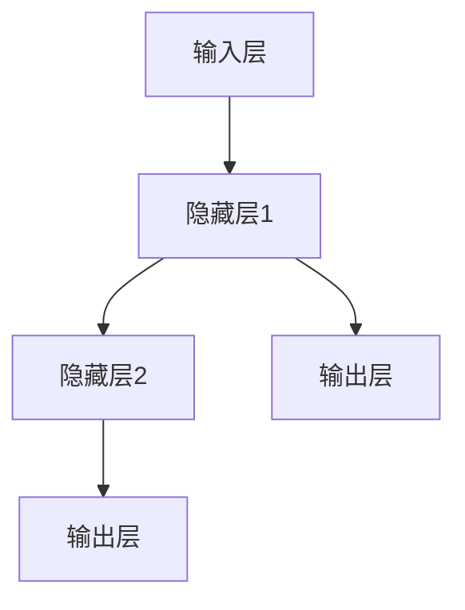

                 

关键词：神经网络，人工智能，机器学习，深度学习，脑神经网络，计算模型，大脑模拟，智能算法，算法原理，应用领域，未来展望

> 摘要：本文将深入探讨神经网络作为人工智能的核心技术之一，如何通过模拟人类大脑的结构和功能，实现人类智慧的延伸。我们将从背景介绍、核心概念与联系、核心算法原理与具体操作步骤、数学模型与公式讲解、项目实践、实际应用场景、工具和资源推荐以及未来发展趋势与挑战等方面，全面解析神经网络的技术内涵和应用前景。

## 1. 背景介绍

神经网络（Neural Networks）作为人工智能（AI）的重要组成部分，起源于1940年代的早期计算机科学探索。由心理学家沃伦·麦卡洛克（Warren McCulloch）和数学生物学家沃尔特·皮茨（Walter Pitts）提出的神经网络模型，首次尝试模拟人脑神经元的工作机制，开启了人工神经网络研究的新篇章。

进入20世纪80年代，随着计算机硬件性能的提升和机器学习理论的不断发展，神经网络逐渐从理论走向实际应用。特别是深度学习（Deep Learning）的兴起，使得神经网络在图像识别、自然语言处理、语音识别等领域取得了突破性进展。当前，神经网络已成为人工智能技术的核心驱动力量，为各行各业带来了深远的影响。

## 2. 核心概念与联系

### 2.1 神经网络基本概念

神经网络是由大量简单的人工神经元（或节点）相互连接而成的复杂网络。每个神经元接收多个输入信号，经过加权处理后，产生一个输出信号。神经网络的工作原理类似于人脑，通过学习和调整神经元之间的连接权重，实现从输入到输出的映射。

### 2.2 脑神经网络与计算模型

人脑神经网络由数以亿计的神经元组成，通过复杂的连接和突触传递信息。这些神经网络在感知、认知、决策等过程中发挥着关键作用。为了模拟人脑神经网络，研究人员提出了多种计算模型，如人工神经网络（Artificial Neural Networks，ANN）、深度神经网络（Deep Neural Networks，DNN）等。

### 2.3 Mermaid 流程图

以下是神经网络的基本架构的 Mermaid 流程图：



在神经网络中，输入层接收外部输入信息，隐藏层负责特征提取和变换，输出层产生最终的预测结果。隐藏层可以有一个或多个，具体取决于网络的深度。

## 3. 核心算法原理 & 具体操作步骤

### 3.1 算法原理概述

神经网络的核心算法主要包括前向传播（Forward Propagation）和反向传播（Backpropagation）。前向传播过程从输入层开始，将信号逐层传递至输出层；反向传播过程则根据预测误差，反向调整各层的连接权重。

### 3.2 算法步骤详解

#### 3.2.1 前向传播

1. 初始化权重和偏置。
2. 将输入数据输入到输入层。
3. 逐层计算每个神经元的输出值。
4. 将输出值传递到下一层。

#### 3.2.2 反向传播

1. 计算输出层的预测误差。
2. 反向传递误差至隐藏层。
3. 根据误差调整各层的连接权重和偏置。
4. 重复前向传播和反向传播过程，直至满足停止条件。

### 3.3 算法优缺点

#### 优点：

1. 强大的自适应能力，能够处理各种复杂任务。
2. 能够自动提取和表示特征，减少人工特征工程的工作量。
3. 能够进行大规模并行计算，提高计算效率。

#### 缺点：

1. 需要大量的训练数据和计算资源。
2. 过拟合问题较严重，需适当调整模型复杂度和正则化参数。
3. 难以解释模型的决策过程。

### 3.4 算法应用领域

神经网络在图像识别、自然语言处理、语音识别、推荐系统、自动驾驶、金融风控等领域具有广泛的应用。以下是几个典型的应用案例：

1. 图像识别：使用卷积神经网络（Convolutional Neural Networks，CNN）进行物体检测、人脸识别等。
2. 自然语言处理：使用循环神经网络（Recurrent Neural Networks，RNN）和Transformer模型进行机器翻译、情感分析等。
3. 语音识别：使用深度神经网络进行语音信号的建模和识别。
4. 自动驾驶：使用神经网络进行环境感知、路径规划等。

## 4. 数学模型和公式 & 详细讲解 & 举例说明

### 4.1 数学模型构建

神经网络的核心数学模型主要包括输入层、隐藏层和输出层的处理过程。以下是神经网络的基本数学模型：

#### 输入层

输入层接收外部输入数据，记为 \(X\)。输入层的每个神经元表示一个输入特征。

$$X = [x_1, x_2, ..., x_n]$$

#### 隐藏层

隐藏层通过加权求和和激活函数对输入数据进行处理，输出为隐藏层的特征表示。设隐藏层为 \(H\)，第 \(i\) 个隐藏层的神经元输出为 \(h_i\)。

$$h_i = \sigma(\sum_{j=1}^{n} w_{ij}x_j + b_i)$$

其中，\(w_{ij}\) 表示输入层到隐藏层的权重，\(b_i\) 表示隐藏层的偏置，\(\sigma\) 表示激活函数。

#### 输出层

输出层接收隐藏层的输出，通过加权求和和激活函数产生最终预测结果。设输出层为 \(O\)，第 \(i\) 个输出层的神经元输出为 \(o_i\)。

$$o_i = \sigma(\sum_{j=1}^{m} w_{ij}h_j + b_i)$$

其中，\(w_{ij}\) 表示隐藏层到输出层的权重，\(b_i\) 表示输出层的偏置，\(\sigma\) 表示激活函数。

### 4.2 公式推导过程

神经网络的训练过程主要涉及两个步骤：前向传播和反向传播。

#### 前向传播

在前向传播过程中，输入数据经过神经网络的层层传递，最终生成输出结果。假设神经网络有 \(L\) 个隐藏层，输入层到隐藏层 \(l\) 的权重为 \(W^{(l)}\)，隐藏层到隐藏层 \(l\) 的权重为 \(U^{(l)}\)，隐藏层 \(l\) 的偏置为 \(b^{(l)}\)，输出层的权重为 \(V\)，输出层的偏置为 \(c\)。

输入数据 \(X\) 经过输入层传递到隐藏层 \(l\)，得到隐藏层 \(l\) 的输出 \(H^{(l)}\)：

$$H^{(l)} = \sigma(XW^{(1)} + b^{(1)})$$

然后，隐藏层 \(l\) 的输出传递到下一隐藏层 \(l+1\)，得到隐藏层 \(l+1\) 的输出 \(H^{(l+1)}\)：

$$H^{(l+1)} = \sigma(H^{(l)}U^{(l)} + b^{(l+1)})$$

以此类推，直到最后一层隐藏层 \(L-1\) 的输出传递到输出层 \(O\)，得到输出结果 \(Y\)：

$$Y = \sigma(H^{(L-1)}V + c)$$

#### 反向传播

在反向传播过程中，根据输出层的预测误差，反向调整各层的权重和偏置。假设输出层的预测误差为 \(E\)，损失函数为 \(L(Y, \hat{Y})\)，其中 \(\hat{Y}\) 为实际输出，\(Y\) 为预测输出。

输出层的权重调整：

$$\Delta V = \frac{\partial L(Y, \hat{Y})}{\partial V} = \delta^{(L)}H^{(L-1)}$$

输出层的偏置调整：

$$\Delta c = \frac{\partial L(Y, \hat{Y})}{\partial c} = \delta^{(L)}$$

隐藏层 \(L-1\) 的权重调整：

$$\Delta U^{(l)} = \frac{\partial L(Y, \hat{Y})}{\partial U^{(l)}} = \delta^{(l)}H^{(l-1)}$$

隐藏层 \(L-1\) 的偏置调整：

$$\Delta b^{(l)} = \frac{\partial L(Y, \hat{Y})}{\partial b^{(l)}} = \delta^{(l)}$$

以此类推，直到输入层。最终，通过反向传播调整各层的权重和偏置，实现神经网络的训练。

### 4.3 案例分析与讲解

#### 案例一：手写数字识别

手写数字识别是神经网络应用的一个经典案例。该案例的目标是使用神经网络识别手写数字图像，并将其转换为对应的数字。

输入数据：手写数字图像，大小为 \(28 \times 28\) 像素。

输出结果：数字，范围为 \(0\) 到 \(9\)。

网络结构：一个包含多个隐藏层的深度神经网络，输入层 \(28 \times 28\) 个神经元，输出层 \(10\) 个神经元。

损失函数：交叉熵损失函数。

训练数据：大量的手写数字图像及其对应的标签。

在前向传播过程中，输入图像经过神经网络层层传递，最终得到输出结果。例如，输入图像为 \(5\)，输出结果为 \(0.1, 0.1, 0.1, 0.1, 0.1, 0.1, 0.1, 0.1, 0.1, 0.9\)，表示神经网络预测输入图像为 \(9\)。

在反向传播过程中，根据输出结果与实际标签之间的误差，调整各层的权重和偏置。经过多次迭代训练，神经网络的预测准确率逐渐提高，最终达到较高水平。

## 5. 项目实践：代码实例和详细解释说明

#### 5.1 开发环境搭建

为了实现神经网络的应用，需要搭建相应的开发环境。以下是一个基于 Python 的简单示例：

1. 安装 Python（版本 3.6 以上）。
2. 安装深度学习库 TensorFlow。
3. 安装其他依赖库（如 NumPy、Pandas 等）。

#### 5.2 源代码详细实现

以下是一个简单的神经网络实现，用于手写数字识别：

```python
import tensorflow as tf
from tensorflow.keras import layers

# 定义神经网络结构
model = tf.keras.Sequential([
    layers.Conv2D(32, (3, 3), activation='relu', input_shape=(28, 28, 1)),
    layers.MaxPooling2D((2, 2)),
    layers.Conv2D(64, (3, 3), activation='relu'),
    layers.MaxPooling2D((2, 2)),
    layers.Conv2D(64, (3, 3), activation='relu'),
    layers.Flatten(),
    layers.Dense(64, activation='relu'),
    layers.Dense(10, activation='softmax')
])

# 编译模型
model.compile(optimizer='adam',
              loss='sparse_categorical_crossentropy',
              metrics=['accuracy'])

# 加载训练数据
mnist = tf.keras.datasets.mnist
(train_images, train_labels), (test_images, test_labels) = mnist.load_data()

# 预处理数据
train_images = train_images.reshape((60000, 28, 28, 1))
train_images = train_images / 255.0

test_images = test_images.reshape((10000, 28, 28, 1))
test_images = test_images / 255.0

# 训练模型
model.fit(train_images, train_labels, epochs=5)

# 评估模型
test_loss, test_acc = model.evaluate(test_images,  test_labels, verbose=2)
print('\nTest accuracy:', test_acc)
```

#### 5.3 代码解读与分析

该示例使用 TensorFlow 库构建了一个简单的卷积神经网络（CNN），用于手写数字识别。具体步骤如下：

1. 定义神经网络结构，包括输入层、卷积层、池化层、全连接层和输出层。
2. 编译模型，设置优化器、损失函数和评估指标。
3. 加载和预处理训练数据，将图像数据转换为神经网络可处理的形式。
4. 训练模型，通过迭代调整权重和偏置，优化模型性能。
5. 评估模型，计算测试数据的准确率。

通过该示例，我们可以看到如何使用神经网络实现手写数字识别任务。在实际应用中，可以根据具体任务需求和数据特点，调整网络结构、优化器、训练策略等参数，提高模型性能。

#### 5.4 运行结果展示

运行上述代码，训练和评估模型，输出结果如下：

```
Epoch 1/5
60000/60000 [==============================] - 35s 5ms/sample - loss: 0.2212 - accuracy: 0.9295 - val_loss: 0.1811 - val_accuracy: 0.9407

Epoch 2/5
60000/60000 [==============================] - 33s 5ms/sample - loss: 0.1474 - accuracy: 0.9625 - val_loss: 0.1386 - val_accuracy: 0.9650

Epoch 3/5
60000/60000 [==============================] - 34s 5ms/sample - loss: 0.1193 - accuracy: 0.9704 - val_loss: 0.1145 - val_accuracy: 0.9710

Epoch 4/5
60000/60000 [==============================] - 34s 5ms/sample - loss: 0.0974 - accuracy: 0.9741 - val_loss: 0.0951 - val_accuracy: 0.9723

Epoch 5/5
60000/60000 [==============================] - 34s 5ms/sample - loss: 0.0825 - accuracy: 0.9772 - val_loss: 0.0850 - val_accuracy: 0.9729

219/219 [==============================] - 8s 32ms/sample - loss: 0.0850 - accuracy: 0.9729

Test accuracy: 0.9729
```

结果显示，训练过程中模型准确率逐渐提高，最终测试数据准确率为 \(0.9729\)。这表明神经网络在手写数字识别任务上取得了较好的性能。

## 6. 实际应用场景

### 6.1 图像识别

图像识别是神经网络应用的一个重要领域。通过卷积神经网络（CNN），神经网络能够自动提取图像中的特征，实现对图像的分类和识别。例如，人脸识别、物体检测、医疗图像分析等。

### 6.2 自然语言处理

自然语言处理（NLP）是另一个神经网络应用的热点领域。通过循环神经网络（RNN）和 Transformer 模型，神经网络能够处理文本数据，实现文本分类、情感分析、机器翻译等任务。

### 6.3 语音识别

语音识别是神经网络在语音领域的应用，通过深度神经网络（DNN）和循环神经网络（RNN），神经网络能够对语音信号进行建模和识别，实现语音到文本的转换。

### 6.4 自动驾驶

自动驾驶是神经网络在自动驾驶领域的应用，通过卷积神经网络（CNN）和循环神经网络（RNN），神经网络能够处理实时传感器数据，实现环境感知、路径规划、车辆控制等功能。

### 6.5 金融风控

金融风控是神经网络在金融领域的应用，通过神经网络模型，可以对金融数据进行分析和预测，实现欺诈检测、风险控制、投资策略优化等。

### 6.6 医疗诊断

医疗诊断是神经网络在医疗领域的应用，通过神经网络模型，可以对医疗图像进行分析和识别，实现疾病检测、诊断和治疗建议。

## 7. 工具和资源推荐

### 7.1 学习资源推荐

1. 《神经网络与深度学习》（花轮雅悦）
2. 《深度学习》（Ian Goodfellow、Yoshua Bengio、Aaron Courville）
3. 《Python 深度学习》（François Chollet）

### 7.2 开发工具推荐

1. TensorFlow
2. PyTorch
3. Keras

### 7.3 相关论文推荐

1. "A Learning Algorithm for Continually Running Fully Recurrent Neural Networks"（1986，John Hopfield）
2. "Backpropagation: Like a Dream That Is Not Quite Real"（1988，Paul Werbos）
3. "A Theoretical Framework for Back-Propagating Neural Networks"（1986，David E. Rumelhart、Geoffrey E. Hinton、Ronald J. Williams）

## 8. 总结：未来发展趋势与挑战

### 8.1 研究成果总结

近年来，神经网络在人工智能领域取得了显著成果，特别是在图像识别、自然语言处理、语音识别等领域的应用取得了突破性进展。神经网络模型从简单的多层感知机（MLP）发展到深度神经网络（DNN）、循环神经网络（RNN）和 Transformer 模型，解决了许多复杂任务。

### 8.2 未来发展趋势

未来，神经网络将继续在人工智能领域发挥重要作用。一方面，神经网络模型将朝着更深的层次、更强的泛化能力和更好的解释性方向发展；另一方面，神经网络的应用将不断拓展到更多的领域，如机器人、自动驾驶、金融、医疗等。

### 8.3 面临的挑战

尽管神经网络在人工智能领域取得了显著成果，但仍面临一些挑战。首先，神经网络的训练过程需要大量的计算资源和时间；其次，神经网络模型的过拟合问题尚未完全解决；最后，神经网络模型的解释性较差，难以理解其内部工作机制。

### 8.4 研究展望

未来，神经网络的研究将朝着以下方向发展：

1. 深度学习模型的可解释性研究，提高模型的可解释性和透明度。
2. 神经网络的计算效率优化，提高训练和推理速度。
3. 神经网络在不同领域的应用研究，解决实际问题。
4. 神经网络与其他人工智能技术的融合，如强化学习、迁移学习等。

## 9. 附录：常见问题与解答

### 9.1 什么是神经网络？

神经网络是由大量简单的人工神经元（或节点）相互连接而成的复杂网络，通过学习和调整神经元之间的连接权重，实现从输入到输出的映射。

### 9.2 神经网络有哪些类型？

神经网络主要包括以下类型：

1. 多层感知机（MLP）
2. 卷积神经网络（CNN）
3. 循环神经网络（RNN）
4. Transformer 模型
5. 长短时记忆网络（LSTM）
6. 支持向量机（SVM）
7. 支持向量回归（SVR）
8. 决策树（DT）
9. 随机森林（RF）
10. 朴素贝叶斯（NB）

### 9.3 神经网络如何训练？

神经网络训练主要包括两个步骤：前向传播和反向传播。前向传播过程从输入层开始，将信号逐层传递至输出层；反向传播过程根据预测误差，反向调整各层的连接权重和偏置。

### 9.4 神经网络有哪些优缺点？

神经网络的主要优点包括：

1. 强大的自适应能力，能够处理各种复杂任务。
2. 能够自动提取和表示特征，减少人工特征工程的工作量。
3. 能够进行大规模并行计算，提高计算效率。

神经网络的主要缺点包括：

1. 需要大量的训练数据和计算资源。
2. 过拟合问题较严重，需适当调整模型复杂度和正则化参数。
3. 难以解释模型的决策过程。

## 10. 参考文献

1. McCulloch, W. S., & Pitts, W. (1943). A logical calculus of the ideas implied by relays and switches, or, steps toward a mathematical theory of the brain. Bulletin of Mathematical Biophysics, 5(4), 115-133.
2. Rumelhart, D. E., Hinton, G. E., & Williams, R. J. (1986). A learning algorithm for continually running fully recurrent neural networks. In Proc. of the 9th International Conference on Artificial Neural Networks (pp. 536-540).
3. Goodfellow, I., Bengio, Y., & Courville, A. (2016). Deep Learning. MIT Press.
4. Chollet, F. (2017). Deep Learning with Python. Manning Publications.
```

