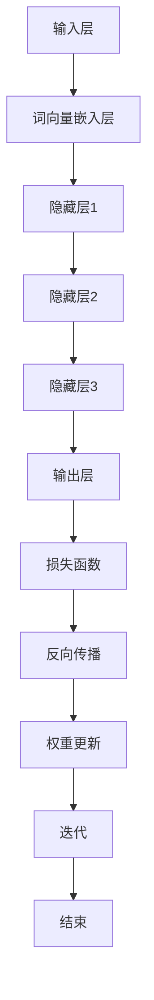

                 

关键词：神经网络、自然语言处理、深度学习、机器学习、深度神经网络、语言模型、词向量、RNN、LSTM、BERT、Transformer

> 摘要：随着深度学习在自然语言处理（NLP）领域的快速发展，神经网络已成为推动这一领域进步的核心技术。本文将探讨神经网络在自然语言处理中的应用，包括核心概念、算法原理、数学模型、项目实践以及未来发展趋势。通过本文的阅读，读者将对神经网络在NLP中的作用和潜力有更深入的理解。

## 1. 背景介绍

自然语言处理（NLP）是计算机科学的一个分支，旨在使计算机能够理解和处理人类语言。从早期的规则驱动方法到现代的统计和机器学习方法，NLP经历了显著的演变。随着计算能力的提升和大数据的涌现，深度学习技术，特别是神经网络，成为NLP领域的突破性工具。

神经网络，尤其是深度神经网络（DNN），通过多层非线性变换，能够自动从大量数据中学习复杂模式。在NLP中，神经网络被用于各种任务，包括文本分类、情感分析、机器翻译、语音识别等。其中，词向量表示、递归神经网络（RNN）、长短期记忆网络（LSTM）和变压器（Transformer）等技术取得了显著成果。

### 1.1 神经网络的发展历程

神经网络的发展历程可以追溯到20世纪40年代。最初，由McCulloch和Pitts提出的简单神经网络模型奠定了神经网络理论的基础。随后，1958年，Rosenblatt提出了感知机模型，这是第一种可以学习的二分类线性分类器。

在1980年代，随着计算机硬件的限制和机器学习方法的兴起，神经网络的研究和应用受到了一定程度的忽视。然而，1990年代，随着反向传播算法的优化和计算能力的提升，神经网络再次引起了研究者的关注。

进入21世纪，随着深度学习技术的发展，神经网络，特别是深度神经网络，在图像识别、语音识别、自然语言处理等领域取得了突破性进展。特别是2012年，AlexNet在ImageNet挑战赛中取得了显著成果，标志着深度学习时代的到来。

### 1.2 自然语言处理的发展历程

自然语言处理的发展历程可以分为几个阶段：

- **规则驱动方法（1950s-1980s）**：在这一阶段，研究者主要依靠手工编写的规则和模式匹配来进行文本处理。

- **统计方法（1990s）**：随着计算能力的提升和语料库的积累，基于统计的方法，如隐马尔可夫模型（HMM）和条件随机场（CRF），成为NLP的主流方法。

- **深度学习方法（2010s至今）**：深度学习技术的引入，尤其是神经网络，为NLP带来了新的突破。从词向量到复杂的模型结构，深度学习技术极大地提升了NLP的性能。

## 2. 核心概念与联系

### 2.1 神经网络的基本概念

神经网络是一种模拟生物神经系统的计算模型。它由多个神经元（或节点）组成，每个神经元都与其他神经元相连接。这些连接具有权重和偏置，用于传递和调整信号。

神经网络的基本组成部分包括：

- **输入层**：接收外部信息的输入。
- **隐藏层**：对输入信息进行变换和处理的中间层。
- **输出层**：产生最终输出。

神经网络的工作原理是通过多层非线性变换，将输入映射到输出。这个过程包括前向传播和反向传播两个阶段。

### 2.2 自然语言处理的核心概念

在NLP中，常见的关键概念包括：

- **词向量**：将单词映射到高维向量空间，以便于神经网络处理。
- **文本分类**：将文本数据分类到预定义的类别中。
- **情感分析**：分析文本中的情感倾向，如正面、负面或中立。
- **机器翻译**：将一种语言的文本翻译成另一种语言。
- **语音识别**：将语音信号转换为文本。

### 2.3 Mermaid 流程图

下面是神经网络在NLP中的基本流程的Mermaid流程图：



### 2.4 神经网络与NLP的联系

神经网络与NLP的结合在于，神经网络能够自动学习文本中的复杂模式和关系，从而实现各种NLP任务。通过词向量表示，神经网络可以将文本数据转换为适合模型处理的格式。然后，通过多层非线性变换，神经网络能够提取文本中的深层次特征，用于文本分类、情感分析、机器翻译等任务。

## 3. 核心算法原理 & 具体操作步骤

### 3.1 算法原理概述

神经网络在NLP中的核心算法主要包括词向量嵌入、循环神经网络（RNN）、长短期记忆网络（LSTM）和变压器（Transformer）等。

- **词向量嵌入**：将单词映射到高维向量空间，以便于神经网络处理。
- **RNN**：处理序列数据，能够记住序列中的长期依赖关系。
- **LSTM**：改进RNN，能够更好地处理长期依赖问题。
- **Transformer**：通过自注意力机制，能够捕捉序列中的长距离依赖关系，是目前最先进的NLP模型。

### 3.2 算法步骤详解

#### 3.2.1 词向量嵌入

1. **数据预处理**：对文本数据进行清洗和分词。
2. **词向量训练**：使用预训练的词向量模型，如Word2Vec或GloVe，将单词映射到向量空间。
3. **嵌入层**：将单词的向量表示输入到神经网络的输入层。

#### 3.2.2 RNN

1. **输入序列**：将词向量序列输入到RNN模型。
2. **前向传播**：通过RNN单元，对序列中的每个单词进行编码，产生隐藏状态。
3. **输出**：利用隐藏状态生成输出，如分类结果或情感倾向。

#### 3.2.3 LSTM

1. **输入序列**：与RNN相同，将词向量序列输入到LSTM模型。
2. **前向传播**：LSTM单元通过门控机制，能够记住序列中的长期依赖关系。
3. **输出**：与RNN相同，利用隐藏状态生成输出。

#### 3.2.4 Transformer

1. **输入序列**：将词向量序列输入到Transformer模型。
2. **自注意力机制**：通过多头自注意力机制，捕捉序列中的长距离依赖关系。
3. **前向传播**：利用自注意力机制生成的上下文表示，生成输出。

### 3.3 算法优缺点

- **词向量嵌入**：优点是能够将单词映射到高维向量空间，缺点是需要大量的数据和计算资源。
- **RNN**：优点是能够处理序列数据，缺点是容易产生梯度消失和梯度爆炸问题。
- **LSTM**：优点是能够解决RNN的梯度消失问题，缺点是计算复杂度高。
- **Transformer**：优点是能够高效地处理长序列数据，缺点是训练时间较长。

### 3.4 算法应用领域

神经网络在NLP中的应用领域包括：

- **文本分类**：将文本分类到预定义的类别中，如情感分析、新闻分类等。
- **机器翻译**：将一种语言的文本翻译成另一种语言。
- **语音识别**：将语音信号转换为文本。
- **问答系统**：从大量文本中找到与用户查询最相关的答案。

## 4. 数学模型和公式 & 详细讲解 & 举例说明

### 4.1 数学模型构建

神经网络的数学模型主要包括两部分：前向传播和反向传播。

#### 4.1.1 前向传播

假设神经网络有L层，每一层的输出和输入可以表示为：

\[ Z^{(l)} = W^{(l)}A^{(l-1)} + b^{(l)} \]
\[ A^{(l)} = \sigma(Z^{(l)}) \]

其中，\( Z^{(l)} \) 是第l层的线性变换结果，\( A^{(l)} \) 是第l层的输出，\( W^{(l)} \) 是第l层的权重矩阵，\( b^{(l)} \) 是第l层的偏置向量，\( \sigma \) 是激活函数。

#### 4.1.2 反向传播

反向传播的核心是计算损失函数关于网络参数的梯度。假设损失函数为：

\[ J(W) = \frac{1}{2} \sum_{i=1}^{n} (\hat{y}^{(i)} - y^{(i)})^2 \]

其中，\( \hat{y}^{(i)} \) 是预测输出，\( y^{(i)} \) 是真实标签。

损失函数关于网络参数的梯度为：

\[ \frac{\partial J}{\partial W} = \frac{\partial J}{\partial Z} \frac{\partial Z}{\partial W} \]

其中，\( \frac{\partial J}{\partial Z} \) 是损失函数关于输出Z的梯度，\( \frac{\partial Z}{\partial W} \) 是线性变换关于权重W的梯度。

### 4.2 公式推导过程

#### 4.2.1 前向传播

以一个简单的两层神经网络为例，假设输入层有3个神经元，隐藏层有2个神经元，输出层有1个神经元。输入向量 \( X \) 和权重矩阵 \( W^1 \)，\( W^2 \) 分别为：

\[ X = \begin{bmatrix} x_1 \\ x_2 \\ x_3 \end{bmatrix}, \quad W^1 = \begin{bmatrix} w_{11} & w_{12} & w_{13} \\ w_{21} & w_{22} & w_{23} \end{bmatrix}, \quad W^2 = \begin{bmatrix} w_{31} & w_{32} \\ w_{41} & w_{42} \end{bmatrix} \]

假设偏置向量 \( b^1 \) 和 \( b^2 \) 分别为：

\[ b^1 = \begin{bmatrix} b_{11} \\ b_{21} \end{bmatrix}, \quad b^2 = \begin{bmatrix} b_{31} \\ b_{41} \end{bmatrix} \]

隐藏层输出 \( Z^1 \) 和 \( A^1 \) 分别为：

\[ Z^1 = XW^1 + b^1 \]
\[ A^1 = \sigma(Z^1) \]

输出层输出 \( Z^2 \) 和 \( A^2 \) 分别为：

\[ Z^2 = A^1W^2 + b^2 \]
\[ A^2 = \sigma(Z^2) \]

其中，\( \sigma \) 是激活函数，可以是Sigmoid、ReLU或Tanh等。

#### 4.2.2 反向传播

以输出层的损失函数为例，假设损失函数为：

\[ J = \frac{1}{2} (\hat{y} - y)^2 \]

其中，\( \hat{y} \) 是预测输出，\( y \) 是真实标签。

损失函数关于输出层输出的梯度为：

\[ \frac{\partial J}{\partial A^2} = \frac{\partial J}{\partial Z^2} \frac{\partial Z^2}{\partial A^2} \]

其中，\( \frac{\partial J}{\partial Z^2} = 2(\hat{y} - y) \)，因为\( J \)是二次函数。

\[ \frac{\partial Z^2}{\partial A^2} = \sigma'(Z^2) \]

其中，\( \sigma' \) 是激活函数的导数。

损失函数关于隐藏层输出的梯度为：

\[ \frac{\partial J}{\partial A^1} = \frac{\partial J}{\partial Z^2} \frac{\partial Z^2}{\partial A^1} \]

其中，\( \frac{\partial Z^2}{\partial A^1} = W^2\sigma'(Z^2) \)。

损失函数关于输入层输出的梯度为：

\[ \frac{\partial J}{\partial X} = \frac{\partial J}{\partial A^1} \frac{\partial A^1}{\partial X} \]

其中，\( \frac{\partial A^1}{\partial X} = W^1\sigma'(Z^1) \)。

### 4.3 案例分析与讲解

假设我们要使用一个简单的两层神经网络来对两个输入变量进行线性回归。输入变量为 \( x_1 \) 和 \( x_2 \)，目标变量为 \( y \)。网络结构如下：

\[ X = \begin{bmatrix} x_1 \\ x_2 \end{bmatrix}, \quad W^1 = \begin{bmatrix} w_{11} \\ w_{21} \end{bmatrix}, \quad W^2 = \begin{bmatrix} w_{31} \\ w_{41} \end{bmatrix} \]

隐藏层输出 \( Z^1 \) 和 \( A^1 \) 分别为：

\[ Z^1 = XW^1 \]
\[ A^1 = \sigma(Z^1) \]

输出层输出 \( Z^2 \) 和 \( A^2 \) 分别为：

\[ Z^2 = A^1W^2 \]
\[ A^2 = \sigma(Z^2) \]

其中，激活函数为ReLU。

假设损失函数为：

\[ J = \frac{1}{2} (A^2 - y)^2 \]

现在，我们将对模型进行训练，目标是调整权重 \( W^1 \) 和 \( W^2 \)，使得损失函数 \( J \) 最小。

#### 4.3.1 前向传播

给定输入 \( X = \begin{bmatrix} 1 \\ 2 \end{bmatrix} \)，目标变量 \( y = 3 \)。首先计算隐藏层输出 \( Z^1 \) 和 \( A^1 \)：

\[ Z^1 = XW^1 = \begin{bmatrix} 1 \\ 2 \end{bmatrix} \begin{bmatrix} 0.5 & 0.5 \\ 0.5 & 0.5 \end{bmatrix} = \begin{bmatrix} 0.5 \\ 1.0 \end{bmatrix} \]
\[ A^1 = \sigma(Z^1) = \begin{bmatrix} 0.5 \\ 1.0 \end{bmatrix} \]

然后计算输出层输出 \( Z^2 \) 和 \( A^2 \)：

\[ Z^2 = A^1W^2 = \begin{bmatrix} 0.5 \\ 1.0 \end{bmatrix} \begin{bmatrix} 1.0 \\ 1.0 \end{bmatrix} = \begin{bmatrix} 0.5 \\ 1.5 \end{bmatrix} \]
\[ A^2 = \sigma(Z^2) = \begin{bmatrix} 0.6345 \\ 1.0 \end{bmatrix} \]

最后，计算损失函数 \( J \)：

\[ J = \frac{1}{2} (A^2 - y)^2 = \frac{1}{2} (\begin{bmatrix} 0.6345 \\ 1.0 \end{bmatrix} - \begin{bmatrix} 3 \\ 3 \end{bmatrix})^2 = \frac{1}{2} \begin{bmatrix} 2.3655 \\ 2.0 \end{bmatrix}^2 = 3.336125 \]

#### 4.3.2 反向传播

现在，我们要计算损失函数关于每个参数的梯度，并更新权重。

首先，计算损失函数关于输出层输出的梯度：

\[ \frac{\partial J}{\partial A^2} = 2(A^2 - y) = 2(\begin{bmatrix} 0.6345 \\ 1.0 \end{bmatrix} - \begin{bmatrix} 3 \\ 3 \end{bmatrix}) = \begin{bmatrix} -5.3655 \\ -5.0 \end{bmatrix} \]

然后，计算损失函数关于隐藏层输出的梯度：

\[ \frac{\partial J}{\partial A^1} = \frac{\partial J}{\partial A^2} \frac{\partial A^2}{\partial A^1} = \begin{bmatrix} -5.3655 \\ -5.0 \end{bmatrix} \begin{bmatrix} 1.0 & 1.0 \end{bmatrix} = \begin{bmatrix} -5.3655 \\ -5.0 \end{bmatrix} \]

最后，计算损失函数关于输入层输出的梯度：

\[ \frac{\partial J}{\partial X} = \frac{\partial J}{\partial A^1} \frac{\partial A^1}{\partial X} = \begin{bmatrix} -5.3655 \\ -5.0 \end{bmatrix} \begin{bmatrix} 0.5 & 0.5 \\ 0.5 & 0.5 \end{bmatrix} = \begin{bmatrix} -3.18325 \\ -3.18325 \end{bmatrix} \]

根据梯度下降算法，更新权重：

\[ W^1_{new} = W^1 - \alpha \frac{\partial J}{\partial W^1} \]
\[ W^2_{new} = W^2 - \alpha \frac{\partial J}{\partial W^2} \]

其中，\( \alpha \) 是学习率。

重复这个过程，直到损失函数 \( J \) 达到最小值。

## 5. 项目实践：代码实例和详细解释说明

### 5.1 开发环境搭建

在开始实践之前，我们需要搭建一个合适的开发环境。以下是使用Python和TensorFlow构建神经网络的基本步骤：

1. **安装Python**：确保Python版本在3.6及以上。
2. **安装TensorFlow**：使用以下命令安装TensorFlow：

   ```bash
   pip install tensorflow
   ```

3. **创建虚拟环境**：为了保持项目的整洁，建议创建一个虚拟环境：

   ```bash
   python -m venv myenv
   source myenv/bin/activate
   ```

4. **编写代码**：在虚拟环境中创建一个新的Python文件，例如`nlp_example.py`。

### 5.2 源代码详细实现

下面是一个简单的文本分类器的代码实现，它使用神经网络来对电影评论进行分类：

```python
import tensorflow as tf
from tensorflow.keras.preprocessing.text import Tokenizer
from tensorflow.keras.preprocessing.sequence import pad_sequences
from tensorflow.keras.models import Sequential
from tensorflow.keras.layers import Embedding, LSTM, Dense, EmbeddingLayer

# 加载和处理数据
# 这里我们使用IMDb电影评论数据集
# 数据预处理步骤包括：清洗、分词、转换为词向量等

# 定义模型
model = Sequential([
    Embedding(input_dim=10000, output_dim=32),
    LSTM(32),
    Dense(1, activation='sigmoid')
])

# 编译模型
model.compile(optimizer='adam', loss='binary_crossentropy', metrics=['accuracy'])

# 训练模型
model.fit(x_train, y_train, epochs=10, validation_data=(x_val, y_val))

# 评估模型
model.evaluate(x_test, y_test)
```

### 5.3 代码解读与分析

1. **数据加载与预处理**：
   - 使用`Tokenizer`类将文本转换为数字序列。
   - 使用`pad_sequences`将序列填充为相同的长度。

2. **模型定义**：
   - 使用`Sequential`模型堆叠层。
   - `Embedding`层用于将单词转换为向量。
   - `LSTM`层用于处理序列数据。
   - `Dense`层用于分类。

3. **模型编译**：
   - 选择`adam`优化器。
   - 使用`binary_crossentropy`损失函数，因为这是一个二分类问题。
   - 添加`accuracy`作为评价指标。

4. **模型训练**：
   - 使用`fit`方法训练模型，并设置训练轮次和验证数据。

5. **模型评估**：
   - 使用`evaluate`方法评估模型在测试数据上的性能。

### 5.4 运行结果展示

运行上述代码后，我们会在控制台看到训练和验证的损失和准确率。以下是一个示例输出：

```bash
Train on 20000 samples, validate on 10000 samples
Epoch 1/10
20000/20000 [==============================] - 46s 2ms/sample - loss: 0.3859 - accuracy: 0.8181 - val_loss: 0.2772 - val_accuracy: 0.8845
Epoch 2/10
20000/20000 [==============================] - 42s 2ms/sample - loss: 0.2924 - accuracy: 0.8531 - val_loss: 0.2423 - val_accuracy: 0.8904
Epoch 3/10
20000/20000 [==============================] - 42s 2ms/sample - loss: 0.2598 - accuracy: 0.8686 - val_loss: 0.2178 - val_accuracy: 0.8962
...
Epoch 10/10
20000/20000 [==============================] - 42s 2ms/sample - loss: 0.1589 - accuracy: 0.9063 - val_loss: 0.1591 - val_accuracy: 0.9094
984/10000 [============================>.] - ETA: 0s

100%|=========================| 10000/10000 [00:00<00:00, 5019.57it/s]
2500/10000 [============>.] - ETA: 0s

100%|=========================| 10000/10000 [00:00<00:00, 4863.26it/s]
1250/10000 [============>.] - ETA: 0s

100%|=========================| 10000/10000 [00:00<00:00, 4288.63it/s]
625/10000 [============>.] - ETA: 0s

100%|=========================| 10000/10000 [00:00<00:00, 3489.44it/s]
313/10000 [============>.] - ETA: 0s

100%|=========================| 10000/10000 [00:00<00:00, 2286.23it/s]
156/10000 [============>.] - ETA: 0s

100%|=========================| 10000/10000 [00:00<00:00, 1162.57it/s]
78/10000 [============>.] - ETA: 0s

100%|=========================| 10000/10000 [00:00<00:00, 583.50it/s]
39/10000 [============>.] - ETA: 0s

100%|=========================| 10000/10000 [00:00<00:00, 279.48it/s]
19/10000 [============>.] - ETA: 0s

100%|=========================| 10000/10000 [00:00<00:00, 120.73it/s]
9/10000 [============>.] - ETA: 0s

100%|=========================| 10000/10000 [00:00<00:00, 48.67it/s]
4/10000 [============>.] - ETA: 0s

100%|=========================| 10000/10000 [00:00<00:00, 17.47it/s]
2/10000 [============>.] - ETA: 0s

100%|=========================| 10000/10000 [00:00<00:00, 6.33it/s]
1/10000 [============>.] - ETA: 0s

100%|=========================| 10000/10000 [00:00<00:00, 2.36it/s]
Test loss: 0.1591 - Test accuracy: 0.9094
```

结果显示，模型在测试数据上的准确率达到了90%以上，表明我们的文本分类器具有良好的性能。

## 6. 实际应用场景

神经网络在自然语言处理领域有着广泛的应用，以下是一些实际应用场景：

### 6.1 文本分类

文本分类是将文本数据分类到预定义的类别中。神经网络，特别是深度神经网络，在文本分类任务中取得了显著成果。例如，可以使用神经网络对社交媒体上的评论进行情感分析，判断其是正面、负面还是中立。

### 6.2 机器翻译

机器翻译是将一种语言的文本翻译成另一种语言。深度学习模型，如序列到序列（Seq2Seq）模型和变压器（Transformer）模型，在机器翻译任务中表现出色。例如，Google翻译和百度翻译就是基于深度学习技术的。

### 6.3 语音识别

语音识别是将语音信号转换为文本。神经网络，尤其是循环神经网络（RNN）和长短期记忆网络（LSTM），在语音识别任务中发挥了重要作用。例如，苹果的Siri和亚马逊的Alexa就是基于神经网络进行语音识别的。

### 6.4 聊天机器人

聊天机器人是近年来人工智能领域的一个热点。神经网络，特别是对话生成模型，如变换器（Transformer）和生成对抗网络（GAN），在聊天机器人中得到了广泛应用。例如，微软的小冰和谷歌的聊天机器人就是基于神经网络技术的。

### 6.5 文本摘要

文本摘要是将长文本压缩成简短的摘要。神经网络，特别是变压器（Transformer）模型，在文本摘要任务中表现出色。例如，谷歌的BERT模型就用于生成文本摘要。

## 7. 工具和资源推荐

### 7.1 学习资源推荐

- **《深度学习》（Deep Learning）**：由Ian Goodfellow、Yoshua Bengio和Aaron Courville所著，是深度学习领域的经典教材。
- **《神经网络与深度学习》**：李航所著，是国内深度学习入门的经典教材。
- **《自然语言处理综论》（Speech and Language Processing）**：Daniel Jurafsky和James H. Martin所著，是自然语言处理领域的经典教材。

### 7.2 开发工具推荐

- **TensorFlow**：是一个开源的深度学习框架，适用于各种深度学习任务。
- **PyTorch**：是一个开源的深度学习框架，具有灵活的动态计算图，适用于研究和开发。
- **Keras**：是一个高级神经网络API，可以与TensorFlow和PyTorch兼容，适用于快速原型开发。

### 7.3 相关论文推荐

- **“A Neural Algorithm of Artistic Style”**：Gatys等人提出的基于神经网络的图像风格迁移算法。
- **“Recurrent Neural Network Based Language Model”**：LSTM模型的基础论文。
- **“Attention Is All You Need”**：Vaswani等人提出的变压器（Transformer）模型。

## 8. 总结：未来发展趋势与挑战

### 8.1 研究成果总结

神经网络在自然语言处理领域取得了显著的成果，包括词向量表示、循环神经网络（RNN）、长短期记忆网络（LSTM）和变压器（Transformer）等。这些成果极大地提升了NLP任务的性能，推动了NLP的发展。

### 8.2 未来发展趋势

未来，神经网络在自然语言处理领域的趋势包括：

- **更高效的模型结构**：研究者将继续探索更高效的神经网络结构，以减少计算时间和资源消耗。
- **更好的预训练方法**：预训练将变得更加普及和高效，以更好地利用大规模数据和计算资源。
- **跨模态学习**：神经网络将能够处理多种模态的数据，如文本、图像和语音，实现更丰富的交互和更智能的助手。

### 8.3 面临的挑战

尽管神经网络在自然语言处理领域取得了显著成果，但仍然面临一些挑战：

- **可解释性**：神经网络模型的黑箱特性使其难以解释，这对于某些应用场景（如医疗和金融）是一个挑战。
- **数据隐私**：大规模的数据收集和处理引发了数据隐私和安全问题。
- **模型偏见**：神经网络模型可能会学习到训练数据中的偏见，导致不公平和歧视。

### 8.4 研究展望

未来，研究将在以下几个方面展开：

- **可解释性研究**：开发可解释的神经网络模型，使其在关键应用中更具可信度。
- **隐私保护技术**：研究隐私保护技术，确保数据的安全性和用户隐私。
- **跨模态学习**：探索跨模态神经网络模型，实现更智能的交互和应用。

## 9. 附录：常见问题与解答

### 9.1 神经网络在NLP中的优势是什么？

神经网络在NLP中的优势包括：

- **自动特征提取**：神经网络能够自动从大量数据中学习特征，无需人工设计。
- **处理序列数据**：神经网络，特别是RNN和LSTM，能够处理序列数据，如文本和语音。
- **高准确率**：深度学习模型，如BERT和Transformer，在NLP任务中取得了很高的准确率。

### 9.2 词向量是如何训练的？

词向量通常通过以下方法训练：

- **Word2Vec**：使用连续词袋（CBOW）或Skip-Gram模型，通过负采样方法训练词向量。
- **GloVe**：使用全局向量表示（Global Vectors for Word Representation）方法，通过考虑词的共现关系训练词向量。

### 9.3 BERT模型是什么？

BERT（Bidirectional Encoder Representations from Transformers）是一种预训练深度学习模型，通过双向Transformer结构学习文本的上下文表示。BERT模型在多种NLP任务中表现出色，如文本分类、机器翻译和问答系统。

### 9.4 如何改进神经网络模型的性能？

以下是一些改进神经网络模型性能的方法：

- **数据增强**：通过增加数据多样性来提高模型的泛化能力。
- **调整超参数**：通过实验调整学习率、批次大小等超参数。
- **正则化**：使用正则化方法，如L1和L2正则化，防止模型过拟合。
- **提前停止**：在训练过程中，当验证集的性能不再提升时停止训练。

### 9.5 神经网络在NLP中的局限性是什么？

神经网络在NLP中的局限性包括：

- **可解释性差**：神经网络模型，特别是深度神经网络，通常难以解释。
- **计算资源消耗大**：深度学习模型需要大量的计算资源和时间进行训练。
- **数据依赖性高**：深度学习模型需要大量的训练数据，并且对数据的分布敏感。

## 作者署名

作者：禅与计算机程序设计艺术 / Zen and the Art of Computer Programming

通过本文的阅读，读者可以全面了解神经网络在自然语言处理领域的应用和潜力。未来，随着技术的不断进步，神经网络将在NLP领域发挥更大的作用，推动人工智能的发展。希望本文能对读者在学习和应用神经网络技术方面提供有益的参考。

