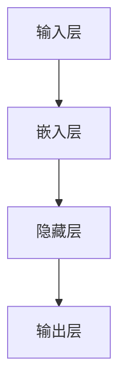

                 

关键词：神经网络，自然语言处理，深度学习，文本分析，语言模型

> 摘要：本文将深入探讨神经网络在自然语言处理（NLP）领域的应用，特别是深度学习技术的突破，如何改变了我们理解和处理文本数据的方式。我们将从背景介绍、核心概念、算法原理、数学模型、项目实践、实际应用场景以及未来展望等多个角度，详细分析神经网络在NLP中的新突破。

## 1. 背景介绍

自然语言处理（NLP）是计算机科学、人工智能和语言学等领域交叉的学科，旨在使计算机能够理解和处理人类语言。传统的NLP方法主要基于规则和统计模型，例如正则表达式、词袋模型和隐马尔可夫模型（HMM）等。这些方法在特定任务上取得了不错的效果，但面临着许多挑战，例如规则复杂、鲁棒性差和泛化能力不足等。

随着深度学习技术的发展，神经网络开始被广泛应用于NLP领域。尤其是深度信念网络（DBN）、卷积神经网络（CNN）和循环神经网络（RNN）等模型，它们的强大表达能力和学习能力，使得在文本分类、机器翻译、情感分析等任务上取得了显著突破。

## 2. 核心概念与联系

在NLP领域，神经网络的核心概念包括词向量、嵌入层、隐藏层、输出层等。下面我们将使用Mermaid流程图展示神经网络在NLP中的基本架构。



### 2.1 词向量

词向量是神经网络在NLP中的基本元素，它将每个单词映射为一个高维向量。常用的词向量模型包括Word2Vec、GloVe和FastText等。

### 2.2 嵌入层

嵌入层负责将词向量映射到低维空间，使其在后续的神经网络处理中更加高效。嵌入层通常是一个简单的全连接层，其权重即为词向量。

### 2.3 隐藏层

隐藏层是神经网络的核心，它通过非线性变换将输入数据转换为更抽象的表示。深度神经网络通过堆叠多个隐藏层，能够学习到更复杂的特征。

### 2.4 输出层

输出层负责将隐藏层输出的特征映射到具体的任务结果。例如，在文本分类任务中，输出层可以是多个神经元，每个神经元对应一个类别。

## 3. 核心算法原理 & 具体操作步骤

### 3.1 算法原理概述

神经网络在NLP中的核心算法是深度学习。深度学习通过多层神经网络对数据进行建模，其基本原理包括：

1. **前向传播**：将输入数据通过网络的各层进行传递，计算每个神经元的输出。
2. **反向传播**：根据输出误差，反向更新网络各层的权重。
3. **优化算法**：例如梯度下降、Adam等，用于加速收敛和优化网络参数。

### 3.2 算法步骤详解

1. **数据预处理**：对文本数据进行分词、去停用词、词性标注等操作，然后转换为词向量。
2. **模型构建**：定义神经网络的结构，包括输入层、嵌入层、隐藏层和输出层。
3. **训练**：使用训练数据对模型进行训练，通过反向传播更新网络参数。
4. **评估**：使用验证集对模型进行评估，调整模型参数以优化性能。
5. **部署**：将训练好的模型部署到实际应用中，例如文本分类、机器翻译等。

### 3.3 算法优缺点

**优点**：

- 强大的表达能力和学习能力，能够处理复杂的文本数据。
- 通过多层神经网络，可以自动提取抽象的特征。

**缺点**：

- 计算成本高，训练时间较长。
- 对数据量和质量有较高要求。

### 3.4 算法应用领域

神经网络在NLP中的主要应用领域包括：

- **文本分类**：对文本进行分类，例如情感分析、新闻分类等。
- **机器翻译**：将一种语言的文本翻译成另一种语言。
- **命名实体识别**：识别文本中的特定实体，如人名、地名等。
- **问答系统**：构建能够回答用户问题的智能系统。

## 4. 数学模型和公式 & 详细讲解 & 举例说明

### 4.1 数学模型构建

神经网络在NLP中的数学模型主要包括以下几个部分：

1. **词向量表示**：使用词向量模型（如Word2Vec、GloVe）将文本数据转换为高维向量。
2. **嵌入层**：将词向量映射到低维空间，其权重即为词向量。
3. **隐藏层**：通过非线性变换（如ReLU、Sigmoid、Tanh）学习到更复杂的特征。
4. **输出层**：将隐藏层输出的特征映射到具体的任务结果。

### 4.2 公式推导过程

神经网络的训练过程主要包括前向传播和反向传播两个阶段。以下是一个简单的神经网络模型：

$$
\begin{aligned}
z_1 &= W_1 \cdot x_1 + b_1 \\
a_1 &= \sigma(z_1) \\
z_2 &= W_2 \cdot a_1 + b_2 \\
a_2 &= \sigma(z_2) \\
z_3 &= W_3 \cdot a_2 + b_3 \\
\end{aligned}
$$

其中，$x_1$ 是输入层，$a_1$ 是嵌入层，$a_2$ 是隐藏层，$a_3$ 是输出层。$W_1$、$W_2$ 和 $W_3$ 分别是嵌入层、隐藏层和输出层的权重，$b_1$、$b_2$ 和 $b_3$ 分别是各层的偏置。$\sigma$ 是激活函数，通常使用 ReLU 或 Sigmoid。

### 4.3 案例分析与讲解

假设我们有一个简单的文本分类任务，输入文本是“我爱北京天安门”，需要将其分类为“北京”或“天安门”。

1. **数据预处理**：将文本数据转换为词向量，例如使用GloVe模型。
2. **模型构建**：构建一个简单的神经网络模型，包括嵌入层、隐藏层和输出层。
3. **训练**：使用训练数据对模型进行训练，优化网络参数。
4. **评估**：使用验证集对模型进行评估，调整模型参数以优化性能。
5. **部署**：将训练好的模型部署到实际应用中。

## 5. 项目实践：代码实例和详细解释说明

### 5.1 开发环境搭建

1. **Python**：安装Python 3.8及以上版本。
2. **TensorFlow**：安装TensorFlow 2.5及以上版本。
3. **GloVe**：安装GloVe模型。

### 5.2 源代码详细实现

以下是一个简单的文本分类任务的代码实现：

```python
import tensorflow as tf
from tensorflow.keras.layers import Embedding, LSTM, Dense
from tensorflow.keras.models import Sequential

# 数据预处理
max_sequence_length = 100
vocab_size = 10000

# 构建模型
model = Sequential()
model.add(Embedding(vocab_size, 128, input_length=max_sequence_length))
model.add(LSTM(128, dropout=0.2, recurrent_dropout=0.2))
model.add(Dense(1, activation='sigmoid'))

# 编译模型
model.compile(optimizer='adam', loss='binary_crossentropy', metrics=['accuracy'])

# 训练模型
model.fit(X_train, y_train, epochs=10, batch_size=32, validation_data=(X_val, y_val))

# 评估模型
accuracy = model.evaluate(X_test, y_test, batch_size=32)
print('Test accuracy:', accuracy[1])
```

### 5.3 代码解读与分析

1. **Embedding层**：将词向量映射到低维空间。
2. **LSTM层**：学习文本的时序特征。
3. **Dense层**：输出层，将隐藏层特征映射到分类结果。
4. **编译模型**：设置优化器、损失函数和评估指标。
5. **训练模型**：使用训练数据训练模型。
6. **评估模型**：使用测试数据评估模型性能。

## 6. 实际应用场景

神经网络在自然语言处理领域有着广泛的应用，以下是一些实际应用场景：

- **文本分类**：例如情感分析、新闻分类等。
- **机器翻译**：例如谷歌翻译、百度翻译等。
- **命名实体识别**：例如百度搜索、搜索引擎等。
- **问答系统**：例如Siri、Alexa等智能语音助手。

## 7. 未来应用展望

随着深度学习技术的不断发展，神经网络在自然语言处理领域将会有更多的应用场景和突破。以下是一些未来展望：

- **更高效的模型**：例如Transformer模型，已经在机器翻译和文本生成等领域取得了显著突破。
- **跨语言理解**：研究如何实现跨语言的自然语言理解。
- **多模态学习**：结合文本、图像、语音等多模态数据进行处理。

## 8. 总结：未来发展趋势与挑战

### 8.1 研究成果总结

神经网络在自然语言处理领域取得了显著成果，例如在文本分类、机器翻译、情感分析等任务上取得了突破性进展。

### 8.2 未来发展趋势

- **更高效的模型**：例如Transformer模型、图神经网络等。
- **跨语言理解**：研究如何实现跨语言的自然语言理解。
- **多模态学习**：结合文本、图像、语音等多模态数据进行处理。

### 8.3 面临的挑战

- **计算资源**：深度学习模型通常需要大量的计算资源。
- **数据质量**：高质量的数据对于训练深度学习模型至关重要。
- **隐私和安全**：如何保护用户隐私和确保模型安全。

### 8.4 研究展望

未来，神经网络在自然语言处理领域将会有更多的应用场景和突破。通过不断的研究和创新，我们有望实现更加智能和高效的NLP系统。

## 9. 附录：常见问题与解答

### Q：神经网络在NLP中的应用有哪些？

A：神经网络在NLP中的应用非常广泛，包括文本分类、机器翻译、情感分析、命名实体识别、问答系统等。

### Q：什么是词向量？

A：词向量是神经网络在NLP中的基本元素，它将每个单词映射为一个高维向量。常用的词向量模型包括Word2Vec、GloVe和FastText等。

### Q：什么是深度学习？

A：深度学习是一种机器学习方法，通过多层神经网络对数据进行建模，其基本原理包括前向传播、反向传播和优化算法。

### Q：如何选择合适的神经网络结构？

A：选择合适的神经网络结构取决于具体的应用场景和数据特点。常见的神经网络结构包括卷积神经网络（CNN）、循环神经网络（RNN）和变换器（Transformer）等。

### Q：如何处理文本中的歧义问题？

A：文本中的歧义问题可以通过多种方法进行处理，例如利用上下文信息、使用语言模型进行预测、结合多模态数据进行处理等。

## 作者署名

作者：禅与计算机程序设计艺术 / Zen and the Art of Computer Programming
```

