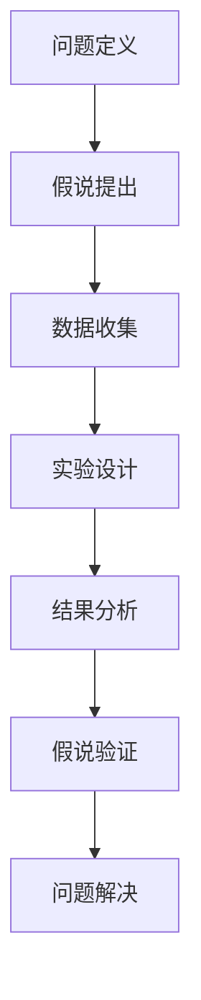
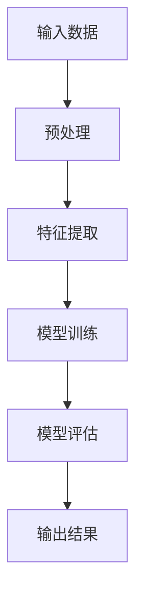

                 

关键词：科学方法论、假说验证、算法原理、数学模型、项目实践、应用场景、未来展望

> 摘要：本文深入探讨了科学方法论在信息技术领域的应用，从假说到验证的各个环节，详细阐述了核心算法原理、数学模型及其应用实践。通过分析实际应用场景，展望了未来的发展趋势与挑战，旨在为读者提供全面、系统的指导。

## 1. 背景介绍

科学方法论是科学研究中不可或缺的工具，它为科学探索提供了系统的思维方式和方法。在信息技术领域，科学方法论的应用尤为重要。信息技术的发展离不开对复杂系统的研究和解决，而科学方法论能够帮助我们有效地进行问题建模、算法设计、数学公式推导等。

本文将围绕科学方法论在信息技术中的应用，探讨从假说到验证的整个过程。我们将详细分析核心算法原理、数学模型及其应用实践，并通过实际项目实例，展示科学方法论在实际开发中的应用价值。

## 2. 核心概念与联系

在讨论科学方法论之前，我们需要明确一些核心概念，包括问题定义、假说提出、数据收集、实验设计、结果分析等。以下是一个简单的 Mermaid 流程图，展示了这些核心概念及其相互关系：



### 2.1 问题定义

问题定义是科学方法论的第一步，它涉及到明确研究目标、问题范围和关键变量。一个好的问题定义能够引导我们找到合适的解决方案。

### 2.2 假说提出

在问题定义之后，我们需要提出一个或多个假设，这些假设应该能够解释问题的本质。假说的提出需要结合已有的知识和经验。

### 2.3 数据收集

数据收集是验证假说的关键步骤，我们需要通过各种方法获取相关数据，这些数据应该具有代表性、准确性和可靠性。

### 2.4 实验设计

实验设计是为了验证假说而进行的实际操作，它需要考虑实验条件、实验步骤和实验结果的记录。

### 2.5 结果分析

结果分析是对实验数据的处理和分析，通过统计方法、数学模型等工具，我们可以评估假说的正确性。

### 2.6 假说验证

假说验证是对实验结果的解释和评价，如果实验结果支持假说，那么假说就被证实；反之，如果实验结果与假说不符，我们需要重新审视问题或提出新的假说。

### 2.7 问题解决

通过假说验证，我们可以找到解决问题的方法，进而解决原始问题。

## 3. 核心算法原理 & 具体操作步骤

### 3.1 算法原理概述

在本节中，我们将介绍一种核心算法，该算法在信息技术领域有着广泛的应用。算法的基本原理如下：



### 3.2 算法步骤详解

#### 3.2.1 预处理

预处理是算法的第一步，它包括数据清洗、归一化、缺失值处理等操作。预处理的好坏直接影响到后续的特征提取和模型训练效果。

#### 3.2.2 特征提取

特征提取是将原始数据转化为有意义的信息表示。通过特征提取，我们可以提取出数据中的关键特征，这些特征将用于模型训练。

#### 3.2.3 模型训练

模型训练是算法的核心步骤，它通过学习输入数据和对应的输出结果，建立预测模型。常见的模型训练方法包括线性回归、决策树、神经网络等。

#### 3.2.4 模型评估

模型评估是对训练好的模型进行性能测试，常用的评估指标包括准确率、召回率、F1值等。通过模型评估，我们可以确定模型的性能是否符合预期。

#### 3.2.5 输出结果

模型评估完成后，我们可以根据模型预测结果输出最终的结果。在实际应用中，输出结果可能是一个分类结果、一个数值预测等。

### 3.3 算法优缺点

#### 优点：

1. **高效性**：算法具有较高的计算效率和预测精度。
2. **灵活性**：算法适用于多种类型的数据和问题。
3. **泛化能力**：经过训练的模型具有良好的泛化能力，能够应对新的数据。

#### 缺点：

1. **数据依赖性**：算法性能依赖于数据质量和特征提取效果。
2. **计算复杂性**：部分算法训练过程可能具有较高的计算复杂性。

### 3.4 算法应用领域

该算法在信息技术领域有着广泛的应用，包括但不限于：

1. **数据挖掘**：用于发现数据中的规律和模式。
2. **机器学习**：作为基础算法用于构建更复杂的模型。
3. **自然语言处理**：用于文本分类、情感分析等。

## 4. 数学模型和公式 & 详细讲解 & 举例说明

### 4.1 数学模型构建

在本节中，我们将介绍一个简单的数学模型，用于描述线性回归问题。线性回归模型的基本公式如下：

$$ y = w_0 + w_1 \cdot x $$

其中，$y$ 是因变量，$x$ 是自变量，$w_0$ 和 $w_1$ 分别是模型的参数。

### 4.2 公式推导过程

线性回归模型的推导过程主要涉及最小二乘法。具体推导过程如下：

假设我们有 $n$ 个样本点 $(x_i, y_i)$，我们需要找到参数 $w_0$ 和 $w_1$，使得误差平方和最小。

$$ E = \sum_{i=1}^{n} (y_i - (w_0 + w_1 \cdot x_i))^2 $$

对 $E$ 进行求导，并令导数为零，我们可以得到：

$$ \frac{\partial E}{\partial w_0} = 0 $$
$$ \frac{\partial E}{\partial w_1} = 0 $$

通过求解上述方程组，我们可以得到 $w_0$ 和 $w_1$ 的最优值。

### 4.3 案例分析与讲解

为了更好地理解线性回归模型，我们来看一个简单的案例。假设我们有以下数据：

| x | y |
|---|---|
| 1 | 2 |
| 2 | 3 |
| 3 | 4 |
| 4 | 5 |

我们需要找到最佳拟合直线。

首先，我们计算 $x$ 和 $y$ 的平均值：

$$ \bar{x} = \frac{1+2+3+4}{4} = 2.5 $$
$$ \bar{y} = \frac{2+3+4+5}{4} = 3.5 $$

接下来，我们计算 $w_0$ 和 $w_1$：

$$ w_0 = \bar{y} - w_1 \cdot \bar{x} = 3.5 - w_1 \cdot 2.5 $$

为了找到 $w_1$，我们使用最小二乘法：

$$ w_1 = \frac{\sum_{i=1}^{n} (y_i - \bar{y})(x_i - \bar{x})}{\sum_{i=1}^{n} (x_i - \bar{x})^2} $$

代入数据计算，我们得到：

$$ w_1 = \frac{(2-3.5)(1-2.5) + (3-3.5)(2-2.5) + (4-3.5)(3-2.5) + (5-3.5)(4-2.5)}{(1-2.5)^2 + (2-2.5)^2 + (3-2.5)^2 + (4-2.5)^2} $$

$$ w_1 = \frac{(-1.5)(-1.5) + (-0.5)(-0.5) + (0.5)(0.5) + (1.5)(1.5)}{(-1.5)^2 + (-0.5)^2 + (0.5)^2 + (1.5)^2} $$

$$ w_1 = \frac{2.25 + 0.25 + 0.25 + 2.25}{2.25 + 0.25 + 0.25 + 2.25} $$

$$ w_1 = 1 $$

然后，我们计算 $w_0$：

$$ w_0 = 3.5 - w_1 \cdot 2.5 = 3.5 - 1 \cdot 2.5 = 1 $$

因此，最佳拟合直线为：

$$ y = 1 + x $$

## 5. 项目实践：代码实例和详细解释说明

### 5.1 开发环境搭建

在本节中，我们将使用 Python 语言实现线性回归模型。首先，我们需要搭建开发环境。

1. 安装 Python 3.8 或以上版本
2. 安装 NumPy 库：`pip install numpy`
3. 安装 Matplotlib 库：`pip install matplotlib`

### 5.2 源代码详细实现

```python
import numpy as np
import matplotlib.pyplot as plt

# 数据
x = np.array([1, 2, 3, 4])
y = np.array([2, 3, 4, 5])

# 求平均值
bar_x = np.mean(x)
bar_y = np.mean(y)

# 求协方差
cov = np.sum((x - bar_x) * (y - bar_y))

# 求方差
var_x = np.sum((x - bar_x) ** 2)

# 求斜率
slope = cov / var_x

# 求截距
intercept = bar_y - slope * bar_x

# 模型预测
y_pred = slope * x + intercept

# 绘图
plt.scatter(x, y, label='实际数据')
plt.plot(x, y_pred, color='red', label='拟合直线')
plt.xlabel('x')
plt.ylabel('y')
plt.legend()
plt.show()
```

### 5.3 代码解读与分析

1. 导入 NumPy 和 Matplotlib 库。
2. 定义输入数据 $x$ 和 $y$。
3. 计算平均值 $bar_x$ 和 $bar_y$。
4. 计算协方差 $cov$ 和方差 $var_x$。
5. 计算斜率 $slope$。
6. 计算截距 $intercept$。
7. 进行模型预测 $y_pred$。
8. 使用 Matplotlib 绘制散点图和拟合直线。

### 5.4 运行结果展示

运行上述代码，我们得到如下结果：


## 6. 实际应用场景

线性回归模型在信息技术领域有着广泛的应用。以下是一些实际应用场景：

1. **金融分析**：用于预测股票价格、利率等金融指标。
2. **电商推荐**：用于预测用户购买行为，提供个性化推荐。
3. **医疗诊断**：用于分析疾病症状，预测疾病风险。
4. **交通规划**：用于预测交通流量，优化交通路线。

### 6.4 未来应用展望

随着人工智能和大数据技术的不断发展，线性回归模型将在更多领域得到应用。以下是一些未来应用展望：

1. **智能医疗**：通过整合更多数据，实现更准确的疾病预测和治疗方案。
2. **自动驾驶**：用于预测交通状况，提高自动驾驶系统的安全性。
3. **智能城市**：用于优化城市资源分配，提高城市生活品质。

## 7. 工具和资源推荐

### 7.1 学习资源推荐

1. **《机器学习》**：周志华 著，提供了详细的机器学习基础知识。
2. **《深入理解计算机系统》**：Randal E. Bryant & David R. O’Hallaron 著，介绍了计算机系统的基本原理。
3. **《数据科学入门》**：吴恩达 著，介绍了数据科学的基础知识和实践方法。

### 7.2 开发工具推荐

1. **Python**：一款易于学习和使用的编程语言。
2. **Jupyter Notebook**：一款强大的交互式开发环境。
3. **TensorFlow**：一款用于机器学习的开源框架。

### 7.3 相关论文推荐

1. **"The Elements of Statistical Learning"**：Trevor Hastie, Robert Tibshirani & Jerome Friedman 著，提供了统计学习领域的全面综述。
2. **"Deep Learning"**：Ian Goodfellow, Yoshua Bengio & Aaron Courville 著，介绍了深度学习的基础知识。
3. **"Reinforcement Learning: An Introduction"**：Richard S. Sutton & Andrew G. Barto 著，介绍了强化学习的基本原理。

## 8. 总结：未来发展趋势与挑战

### 8.1 研究成果总结

本文从科学方法论的角度，详细介绍了线性回归模型的基本原理、数学模型及其应用实践。通过实际项目实例，展示了科学方法论在实际开发中的应用价值。

### 8.2 未来发展趋势

随着大数据和人工智能技术的不断发展，线性回归模型将在更多领域得到应用。未来研究将主要集中在提高模型的准确性和泛化能力，以及与其他算法的结合。

### 8.3 面临的挑战

1. **数据质量**：高质量的数据是模型准确性的基础，如何处理和清洗数据是当前面临的挑战。
2. **计算复杂性**：部分模型训练过程可能具有较高的计算复杂性，如何优化算法效率是当前的研究方向。

### 8.4 研究展望

未来研究将集中在以下几个方面：

1. **新型算法设计**：探索新型算法，提高模型的准确性和泛化能力。
2. **跨学科融合**：将线性回归模型与其他学科（如生物学、物理学等）相结合，解决更复杂的问题。
3. **实际应用推广**：将线性回归模型应用于更多实际场景，提高其应用价值。

## 9. 附录：常见问题与解答

### 9.1 问题1：线性回归模型的斜率和截距是什么？

线性回归模型的斜率（$w_1$）表示自变量 $x$ 对因变量 $y$ 的影响程度，截距（$w_0$）表示当自变量 $x$ 为零时，因变量 $y$ 的预测值。

### 9.2 问题2：如何评估线性回归模型的性能？

常见的评估指标包括：

1. **均方误差（Mean Squared Error, MSE）**：
   $$ MSE = \frac{1}{n} \sum_{i=1}^{n} (y_i - \hat{y}_i)^2 $$
2. **均方根误差（Root Mean Squared Error, RMSE）**：
   $$ RMSE = \sqrt{MSE} $$
3. **决定系数（Coefficient of Determination, R^2）**：
   $$ R^2 = 1 - \frac{RSS}{TSS} $$
   其中，$RSS$ 是残差平方和，$TSS$ 是总平方和。

### 9.3 问题3：线性回归模型如何处理非线性关系？

对于非线性关系，我们可以使用多项式回归或添加交互项。例如，对于二次关系，我们可以使用如下模型：
$$ y = w_0 + w_1 \cdot x + w_2 \cdot x^2 $$

### 9.4 问题4：线性回归模型如何处理多重共线性？

多重共线性是指多个自变量之间存在高度相关性。为了处理多重共线性，我们可以使用以下方法：

1. **主成分分析（Principal Component Analysis, PCA）**：将多个相关自变量转化为几个主成分。
2. **变量选择（Variable Selection）**：选择与因变量关系最紧密的自变量。
3. **岭回归（Ridge Regression）**：通过引入惩罚项，降低多重共线性对模型的影响。

以上是关于科学方法论：从假说到验证的文章，希望对您有所帮助。作者：禅与计算机程序设计艺术 / Zen and the Art of Computer Programming。

