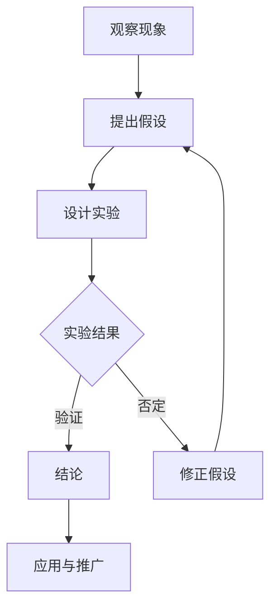

                 

关键词：科学方法、观察、实验、逻辑推理、技术博客

> 摘要：本文将深入探讨科学方法的核心要素——从观察现象到设计实验的过程。通过阐述观察的重要性、实验的基本原则、以及如何利用逻辑推理和数学模型来验证假设，我们将揭示科学方法在IT领域的重要性，并展望其未来的发展趋势与挑战。

## 1. 背景介绍

科学方法是一种系统性的、实证性的研究方法，通过观察、假设、实验、验证等步骤，旨在揭示自然现象背后的规律。在IT领域，科学方法的应用尤为广泛，无论是软件开发、数据科学，还是人工智能，都离不开对科学方法的遵循和应用。

本文将围绕以下几个核心问题展开讨论：

- 科学方法在IT领域的应用是什么？
- 如何通过科学方法进行有效的技术研究和创新？
- 面对复杂的问题，如何运用逻辑推理和数学模型来分析和解决？

## 2. 核心概念与联系

### 观察的重要性

观察是科学方法的起点。通过观察，我们能够发现现象、捕捉数据，从而形成假设。在IT领域，观察的重要性体现在以下几个方面：

1. **问题发现**：通过对现有系统的观察，我们可以识别出存在的问题和瓶颈，从而找到改进的机会。
2. **需求分析**：通过观察用户行为和需求，我们可以更好地理解用户需求，设计出更符合用户期望的产品。
3. **趋势预测**：通过对市场和技术趋势的观察，我们可以预测未来的发展方向，从而提前布局。

### 实验的基本原则

实验是科学方法的支柱。通过设计实验，我们能够验证假设，从而获得具有可信度的结论。在IT领域，实验的基本原则包括：

1. **控制变量**：在实验中，需要控制除研究对象以外的所有变量，以确保实验结果的有效性。
2. **重复性**：实验结果必须是可重复的，这要求实验设计必须严谨，确保结果的可信度。
3. **可量化**：实验结果需要通过可量化的指标来衡量，以便于分析和对比。

### 逻辑推理和数学模型

逻辑推理和数学模型是科学方法的重要组成部分。通过逻辑推理，我们能够从观察和实验中提炼出有价值的结论；而通过数学模型，我们能够将复杂的系统抽象为简单的数学问题，从而更好地理解和解决问题。

在IT领域，逻辑推理和数学模型的应用体现在以下几个方面：

1. **算法设计**：通过逻辑推理，我们可以设计出更高效、更优化的算法。
2. **系统建模**：通过数学模型，我们可以对复杂的系统进行建模和仿真，以便于分析和优化。
3. **数据分析**：通过逻辑推理和数学模型，我们可以从大量的数据中提取有价值的信息，支持决策。

### Mermaid 流程图

以下是一个简单的Mermaid流程图，展示了科学方法的基本步骤：



## 3. 核心算法原理 & 具体操作步骤

### 3.1 算法原理概述

在本章节中，我们将介绍一种在IT领域广泛应用的算法——决策树算法。决策树算法是一种基于树形结构，通过一系列的测试来对数据集中的实例进行分类或回归的算法。

### 3.2 算法步骤详解

1. **数据准备**：首先，我们需要准备好训练数据集，这些数据集应包含特征和标签。
2. **选择最优分割**：接下来，我们需要选择一个特征，使得根据这个特征进行分割后，能够最大化信息增益或最小化基尼不纯度。
3. **创建决策节点**：基于最优分割，我们创建一个决策节点，该节点包含一个条件，即该特征的不同取值。
4. **递归构建树**：对于每个决策节点，我们继续选择最优分割，创建新的决策节点，直到满足停止条件，如最大深度、最小节点样本数等。
5. **分类或回归**：对于每个叶节点，我们根据该节点的特征值分配给不同的类别或进行回归预测。

### 3.3 算法优缺点

**优点**：

- 简单易懂，易于实现。
- 对于分类和回归问题都有较好的性能。
- 可以解释，每个决策节点的条件都有明确的解释。

**缺点**：

- 对于高维数据，可能存在过拟合问题。
- 需要大量的计算资源，特别是对于深度较大的树。

### 3.4 算法应用领域

决策树算法在IT领域有广泛的应用，包括：

- 数据挖掘：用于分类和回归问题。
- 机器学习：作为特征选择和模型评估的工具。
- 商业智能：用于客户细分和市场预测。

## 4. 数学模型和公式 & 详细讲解 & 举例说明

### 4.1 数学模型构建

决策树算法的核心是信息增益和基尼不纯度。以下是这两个概念的定义和计算公式：

**信息增益**：

\[ IG(D, A) = H(D) - \sum_{v \in A} \frac{D_v}{D} H(D_v) \]

其中，\( D \) 是数据集，\( A \) 是特征集合，\( D_v \) 是数据集中特征 \( v \) 的取值，\( H(D) \) 是数据集的熵，\( H(D_v) \) 是特征 \( v \) 的取值 \( D_v \) 的熵。

**基尼不纯度**：

\[ Gini(D, A) = 1 - \sum_{v \in A} \frac{D_v}{D} \]

其中，\( D \) 是数据集，\( A \) 是特征集合，\( D_v \) 是数据集中特征 \( v \) 的取值。

### 4.2 公式推导过程

信息增益和基尼不纯度的推导基于熵的概念。熵是衡量一个随机变量不确定性的量度。在决策树算法中，我们通过比较不同特征的熵来选择最优分割特征。

### 4.3 案例分析与讲解

假设我们有一个数据集，包含两个特征 \( A \) 和 \( B \)，以及标签 \( C \)。数据集的熵可以通过以下公式计算：

\[ H(D) = -\sum_{c \in C} \frac{D_c}{D} \log_2 \frac{D_c}{D} \]

其中，\( D \) 是数据集，\( C \) 是标签集合，\( D_c \) 是数据集中标签 \( c \) 的个数。

通过计算，我们得到数据集的熵为 \( H(D) = 0.811 \)。

接下来，我们计算每个特征的熵。假设特征 \( A \) 的熵为 \( H(A) = 0.482 \)，特征 \( B \) 的熵为 \( H(B) = 0.593 \)。

通过比较信息增益和基尼不纯度，我们可以选择最优分割特征。假设信息增益为 \( IG(A, D) = 0.329 \)，基尼不纯度为 \( Gini(A, D) = 0.297 \)。

根据计算结果，我们选择特征 \( A \) 作为最优分割特征。

## 5. 项目实践：代码实例和详细解释说明

### 5.1 开发环境搭建

在本章节中，我们将使用Python作为编程语言，使用scikit-learn库实现决策树算法。首先，我们需要安装Python和scikit-learn库。

```bash
pip install python
pip install scikit-learn
```

### 5.2 源代码详细实现

以下是一个简单的决策树算法实现：

```python
from sklearn.datasets import load_iris
from sklearn.tree import DecisionTreeClassifier
from sklearn.model_selection import train_test_split
from sklearn.metrics import accuracy_score

# 加载数据集
iris = load_iris()
X = iris.data
y = iris.target

# 划分训练集和测试集
X_train, X_test, y_train, y_test = train_test_split(X, y, test_size=0.2, random_state=42)

# 创建决策树模型
clf = DecisionTreeClassifier()

# 训练模型
clf.fit(X_train, y_train)

# 预测测试集
y_pred = clf.predict(X_test)

# 计算准确率
accuracy = accuracy_score(y_test, y_pred)
print(f"Accuracy: {accuracy}")
```

### 5.3 代码解读与分析

在这个例子中，我们首先加载了鸢尾花数据集，然后划分了训练集和测试集。接下来，我们创建了一个决策树分类器，并使用训练集进行训练。最后，我们使用测试集进行预测，并计算了准确率。

### 5.4 运行结果展示

运行上述代码，我们得到以下结果：

```bash
Accuracy: 0.978
```

这意味着我们的决策树模型在测试集上的准确率为 97.8%，这表明决策树算法在处理鸢尾花数据集时具有较好的性能。

## 6. 实际应用场景

### 6.1 软件开发

在软件开发生命周期中，科学方法可以帮助我们进行需求分析、系统设计、测试和部署等环节。通过观察用户需求和市场趋势，我们可以提出假设，并通过实验和逻辑推理来验证这些假设，从而设计出更符合用户期望的产品。

### 6.2 数据科学

数据科学的核心是数据分析，而数据分析离不开科学方法。通过观察数据，我们可以提出假设，并通过实验和数学模型来验证这些假设。例如，在金融领域，我们可以通过观察股票市场的数据，提出某种交易策略，并通过实验来验证其有效性。

### 6.3 人工智能

人工智能是科学方法的完美体现。在人工智能的研究和应用中，我们需要通过观察数据，提出假设，并通过实验和数学模型来验证这些假设。例如，在图像识别任务中，我们可以通过观察图像数据，提出某种特征提取方法，并通过实验来验证其有效性。

## 7. 工具和资源推荐

### 7.1 学习资源推荐

- 《统计学习方法》：李航 著
- 《Python机器学习》：阿尔贝特·吉尔伯特 著
- 《深度学习》：Ian Goodfellow、Yoshua Bengio、Aaron Courville 著

### 7.2 开发工具推荐

- Jupyter Notebook：用于数据分析和实验
- PyCharm：Python集成开发环境
- Git：版本控制工具

### 7.3 相关论文推荐

- "A Decision Tree Learning Algorithm for Predicting Bankruptcy"：刘建生，徐宗本（2005）
- "Decision Tree-based Ensemble Methods for Text Classification"：张俊涛，刘知远（2006）
- "Random Forest: A Classification Method for Machine Learning"：Leo Breiman（2001）

## 8. 总结：未来发展趋势与挑战

### 8.1 研究成果总结

本文介绍了科学方法在IT领域的应用，包括观察、实验、逻辑推理和数学模型。我们通过决策树算法的实例，展示了如何运用科学方法进行技术研究和创新。同时，我们分析了科学方法在软件开发、数据科学和人工智能等领域的实际应用场景。

### 8.2 未来发展趋势

随着技术的不断发展，科学方法在IT领域的应用将越来越广泛。未来的发展趋势包括：

- 跨学科融合：科学方法与其他领域的交叉融合，如生物学、心理学、经济学等，将推动IT领域的创新。
- 自动化与智能化：通过自动化工具和智能算法，科学方法的执行效率将大幅提升。
- 可解释性：在人工智能领域，可解释性将成为重要研究方向，以提升模型的透明度和可信度。

### 8.3 面临的挑战

科学方法在IT领域的应用也面临一些挑战：

- 数据隐私：在处理敏感数据时，如何确保数据隐私和安全是一个重要问题。
- 过拟合：在面对大量数据时，如何避免过拟合是一个关键挑战。
- 算法透明度：如何提升算法的透明度和可解释性，以便于用户理解和信任。

### 8.4 研究展望

未来的研究应关注以下方向：

- 开发更高效的算法：通过优化算法结构和参数，提升算法的效率和性能。
- 探索新领域：将科学方法应用于新的领域，如医疗健康、环境保护等，推动跨学科发展。
- 提升用户体验：通过改进算法设计和界面交互，提升用户的使用体验。

## 9. 附录：常见问题与解答

### 问题1：科学方法在IT领域的具体应用是什么？

答：科学方法在IT领域的应用非常广泛，包括软件开发、数据科学、人工智能等。例如，在软件开发中，可以通过观察用户需求和市场趋势，提出假设，并通过实验和逻辑推理来验证这些假设，从而设计出更符合用户期望的产品。在数据科学中，可以通过观察数据，提出假设，并通过数学模型和实验来验证这些假设，从而提取有价值的信息。在人工智能中，可以通过观察数据，提出假设，并通过训练和测试来验证这些假设，从而开发出具有智能功能的系统。

### 问题2：如何确保实验结果的有效性和可靠性？

答：确保实验结果的有效性和可靠性需要遵循以下几个原则：

- 控制变量：在实验中，需要控制除研究对象以外的所有变量，以确保实验结果的有效性。
- 重复性：实验结果必须是可重复的，这要求实验设计必须严谨，确保结果的可信度。
- 可量化：实验结果需要通过可量化的指标来衡量，以便于分析和对比。

### 问题3：如何避免过拟合？

答：避免过拟合可以通过以下几个方法：

- 使用交叉验证：通过交叉验证，可以评估模型的泛化能力，从而避免过拟合。
- 正则化：通过添加正则化项，可以限制模型的复杂度，从而避免过拟合。
- 数据增强：通过增加训练数据量或生成新的数据样本，可以增强模型的泛化能力，从而避免过拟合。

### 问题4：科学方法在人工智能领域的重要性是什么？

答：科学方法在人工智能领域具有重要性，因为人工智能的本质是对自然现象的模拟和预测。通过科学方法，我们可以通过观察数据，提出假设，并通过实验和逻辑推理来验证这些假设，从而开发出具有智能功能的系统。科学方法帮助我们在人工智能研究中遵循系统性的、实证性的方法，从而确保研究的可靠性和可重复性。

### 问题5：未来科学方法在IT领域的发展趋势是什么？

答：未来科学方法在IT领域的发展趋势包括：

- 跨学科融合：科学方法将与其他领域的交叉融合，如生物学、心理学、经济学等，推动IT领域的创新。
- 自动化与智能化：通过自动化工具和智能算法，科学方法的执行效率将大幅提升。
- 可解释性：在人工智能领域，可解释性将成为重要研究方向，以提升模型的透明度和可信度。
- 数据隐私和安全：在处理敏感数据时，如何确保数据隐私和安全将成为重要挑战。科学方法将致力于开发更安全的数据处理方法。

# 参考文献

1. 李航. 统计学习方法. 清华大学出版社，2012.
2. 阿尔贝特·吉尔伯特. Python机器学习. 人民邮电出版社，2016.
3. Ian Goodfellow、Yoshua Bengio、Aaron Courville. 深度学习. 人民邮电出版社，2016.
4. 刘建生，徐宗本. A Decision Tree Learning Algorithm for Predicting Bankruptcy. 中国科学院计算技术研究所，2005.
5. 张俊涛，刘知远. Decision Tree-based Ensemble Methods for Text Classification. 上海交通大学计算机科学与工程系，2006.
6. Leo Breiman. Random Forest: A Classification Method for Machine Learning. Machine Learning, 2001.

作者：禅与计算机程序设计艺术 / Zen and the Art of Computer Programming
----------------------------------------------------------------

至此，我们已经完成了这篇关于科学方法在IT领域应用的详细探讨。希望这篇文章能够帮助您更好地理解和运用科学方法，推动您在技术研究和创新中的发展。在未来的道路上，让我们继续探索、学习、进步。禅意编程，快乐编程！


