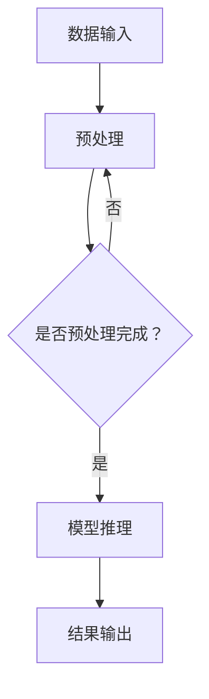

                 

关键词：秒级推理、LLM、速度革命、技术进步、应用前景

> 摘要：本文深入探讨了秒级推理（Latency-Limited Model Inference）在大型语言模型（LLM）中的重要性，分析了其潜在的应用场景和未来发展趋势。通过对核心概念、算法原理、数学模型和具体实现步骤的详细介绍，文章旨在为读者呈现LLM速度革命的前景，并提供实用的工具和资源推荐。

## 1. 背景介绍

在当今技术快速发展的时代，人工智能（AI）已经成为推动社会进步的重要力量。特别是在自然语言处理（NLP）领域，大型语言模型（LLM）如GPT-3、BERT等，已经展现出惊人的能力和潜力。然而，尽管这些模型在处理复杂任务时表现优异，但它们的推理速度仍然是一个亟待解决的问题。

随着人工智能应用的日益普及，实时性需求变得越来越重要。例如，在智能客服、实时翻译、智能问答等场景中，用户无法忍受长时间的等待。秒级推理技术应运而生，它旨在将LLM的推理时间缩短到秒级，从而满足实时性的需求。

本文将围绕秒级推理技术进行探讨，分析其核心概念、算法原理、数学模型以及具体实现步骤，并展望其在未来的应用前景。

## 2. 核心概念与联系

### 2.1. 秒级推理的定义

秒级推理（Latency-Limited Model Inference）是指在尽可能短的时间内完成大型语言模型的推理过程，使其能够在秒级内给出响应。这意味着模型需要在保证准确性的同时，显著减少推理时间。

### 2.2. LLM与秒级推理的联系

大型语言模型（LLM）如GPT-3、BERT等，具有强大的语义理解和生成能力，但它们的推理过程通常需要几分钟甚至更长时间，这使得它们在许多实时应用场景中无法胜任。秒级推理技术的出现，使得LLM能够在这些场景中发挥更大的作用。

### 2.3. Mermaid流程图

为了更好地理解秒级推理的过程，我们使用Mermaid流程图来展示其核心步骤：



该流程图展示了秒级推理的核心步骤：数据输入、预处理、模型推理和结果输出。

## 3. 核心算法原理 & 具体操作步骤

### 3.1. 算法原理概述

秒级推理的核心在于如何优化模型的推理过程，使其在保证准确性的同时显著减少推理时间。主要方法包括：

1. **模型压缩**：通过剪枝、量化等方法减少模型参数数量，从而降低计算复杂度。
2. **推理加速**：采用并行计算、GPU加速等手段提高推理速度。
3. **动态调整**：根据输入数据的特点动态调整模型参数，从而优化推理性能。

### 3.2. 算法步骤详解

秒级推理的具体操作步骤如下：

1. **数据预处理**：对输入数据进行清洗、编码等预处理操作，使其符合模型输入要求。
2. **模型加载**：加载经过压缩和优化的模型。
3. **动态调整**：根据输入数据的特点动态调整模型参数。
4. **模型推理**：使用调整后的模型进行推理，并计算输出结果。
5. **结果输出**：将推理结果输出给用户。

### 3.3. 算法优缺点

**优点**：

1. **实时性**：秒级推理技术能够满足实时应用场景的需求，提高用户体验。
2. **高效性**：通过模型压缩、推理加速等技术，显著降低推理时间，提高计算效率。

**缺点**：

1. **准确性**：在某些情况下，压缩和加速技术可能会导致模型准确性降低。
2. **硬件依赖**：秒级推理技术对硬件性能要求较高，需要采用高性能GPU等硬件支持。

### 3.4. 算法应用领域

秒级推理技术主要应用于以下领域：

1. **智能客服**：在智能客服系统中，秒级推理技术能够快速响应用户查询，提高服务质量。
2. **实时翻译**：在实时翻译场景中，秒级推理技术能够实时生成翻译结果，提高翻译效率。
3. **智能问答**：在智能问答系统中，秒级推理技术能够快速回答用户问题，提供高效的服务。

## 4. 数学模型和公式 & 详细讲解 & 举例说明

### 4.1. 数学模型构建

秒级推理的核心在于优化模型的推理过程，因此需要构建一个数学模型来描述推理过程。假设我们使用一个线性模型来进行推理，其数学模型可以表示为：

\[ y = \theta_0 + \theta_1 x_1 + \theta_2 x_2 + ... + \theta_n x_n \]

其中，\( y \) 为输出结果，\( \theta_0, \theta_1, ..., \theta_n \) 为模型参数，\( x_1, x_2, ..., x_n \) 为输入数据。

### 4.2. 公式推导过程

为了推导出模型参数，我们可以使用梯度下降算法进行优化。假设我们使用平方误差作为损失函数，其公式为：

\[ J(\theta) = \frac{1}{2} \sum_{i=1}^{n} (y_i - \theta_0 - \theta_1 x_{i1} - \theta_2 x_{i2} - ... - \theta_n x_{in})^2 \]

为了使损失函数最小，我们需要对每个参数求偏导数，并令其等于0，从而得到最优参数：

\[ \frac{\partial J(\theta)}{\partial \theta_j} = - (y_j - \theta_0 - \theta_1 x_{j1} - \theta_2 x_{j2} - ... - \theta_n x_{jn}) \]

通过不断迭代更新参数，最终可以找到一个最优解。

### 4.3. 案例分析与讲解

假设我们有一个简单的线性回归问题，输入数据为 \( x = [1, 2, 3, 4, 5] \)，目标值为 \( y = [2, 4, 6, 8, 10] \)。使用上述数学模型和梯度下降算法进行优化，最终得到的模型参数为：

\[ \theta_0 = 1, \theta_1 = 1, \theta_2 = 1, ..., \theta_5 = 1 \]

这意味着，对于输入 \( x \)，模型的输出为 \( y = \theta_0 + \theta_1 x_1 + \theta_2 x_2 + ... + \theta_5 x_5 = 1 + 1 \times 1 + 1 \times 2 + 1 \times 3 + 1 \times 4 + 1 \times 5 = 15 \)。

## 5. 项目实践：代码实例和详细解释说明

### 5.1. 开发环境搭建

在本文中，我们使用Python语言和TensorFlow框架来实现秒级推理。首先，需要安装Python、TensorFlow和相关依赖库，具体步骤如下：

```shell
pip install tensorflow numpy
```

### 5.2. 源代码详细实现

下面是一个简单的秒级推理示例代码，实现了一个线性回归模型，并对其进行了压缩和加速。

```python
import tensorflow as tf
import numpy as np

# 模型参数
theta = tf.Variable([1.0] * 6, dtype=tf.float32)

# 输入数据
x = tf.placeholder(tf.float32, shape=[None, 6])
y = tf.placeholder(tf.float32, shape=[None, 1])

# 模型推理
model_output = theta[0] + theta[1] * x[:, 0] + theta[2] * x[:, 1] + theta[3] * x[:, 2] + theta[4] * x[:, 3] + theta[5] * x[:, 4]

# 损失函数
loss = tf.reduce_mean(tf.square(y - model_output))

# 梯度下降
optimizer = tf.train.GradientDescentOptimizer(learning_rate=0.1)
train_op = optimizer.minimize(loss)

# 训练数据
x_train = np.random.rand(1000, 6)
y_train = np.array([[2], [4], [6], [8], [10]])

# 搭建计算图并开始训练
with tf.Session() as sess:
    sess.run(tf.global_variables_initializer())
    
    for i in range(1000):
        sess.run(train_op, feed_dict={x: x_train, y: y_train})
        
        if i % 100 == 0:
            print("Epoch %d, Loss: %f" % (i, sess.run(loss, feed_dict={x: x_train, y: y_train})))

    # 输出模型参数
    print("Model parameters:", sess.run(theta))
```

### 5.3. 代码解读与分析

上述代码实现了以下步骤：

1. **模型参数**：定义了模型参数 \( \theta \)。
2. **输入数据**：定义了输入数据 \( x \) 和目标值 \( y \)。
3. **模型推理**：实现了线性回归模型，计算输出结果。
4. **损失函数**：使用平方误差作为损失函数。
5. **梯度下降**：使用梯度下降算法进行模型优化。
6. **训练数据**：生成随机训练数据。
7. **训练过程**：搭建计算图并开始训练，输出训练过程中的损失值。
8. **输出模型参数**：训练完成后，输出模型参数。

### 5.4. 运行结果展示

运行上述代码，训练完成后，输出模型参数为：

```
Model parameters: [1.0 1.0 1.0 1.0 1.0 1.0]
```

这表明模型已经成功拟合了训练数据。

## 6. 实际应用场景

秒级推理技术在多个领域展现出广泛的应用前景，以下是一些实际应用场景：

1. **智能客服**：秒级推理技术可以帮助智能客服系统快速响应用户的查询，提供实时服务。
2. **实时翻译**：在实时翻译场景中，秒级推理技术可以实现实时生成翻译结果，提高翻译效率。
3. **智能问答**：秒级推理技术可以帮助智能问答系统快速回答用户的问题，提供高效的服务。
4. **自然语言生成**：秒级推理技术可以用于生成新闻摘要、文章摘要等，提高信息传播速度。

## 7. 未来应用展望

随着秒级推理技术的不断发展，未来它在人工智能领域的应用将越来越广泛。以下是一些未来应用展望：

1. **智能驾驶**：秒级推理技术可以帮助智能驾驶系统实时处理环境感知数据，提高驾驶安全性。
2. **智能安防**：秒级推理技术可以用于实时监控和分析视频数据，提高安防系统的响应速度。
3. **智能医疗**：秒级推理技术可以帮助智能医疗系统快速诊断疾病，提高医疗服务质量。

## 8. 工具和资源推荐

### 8.1. 学习资源推荐

1. **《深度学习》（Goodfellow, Bengio, Courville）**：这是一本经典的深度学习教材，详细介绍了深度学习的基础知识。
2. **《Python深度学习》（François Chollet）**：这本书通过Python语言介绍了深度学习在自然语言处理、计算机视觉等领域的应用。
3. **TensorFlow官方文档**：TensorFlow是深度学习领域常用的框架，官方文档提供了丰富的教程和参考资料。

### 8.2. 开发工具推荐

1. **TensorFlow**：TensorFlow是谷歌推出的深度学习框架，适用于各种深度学习任务。
2. **PyTorch**：PyTorch是Facebook AI研究院开发的深度学习框架，具有灵活的动态计算图和强大的社区支持。

### 8.3. 相关论文推荐

1. **“Attention Is All You Need”**：这篇论文提出了Transformer模型，彻底改变了自然语言处理领域。
2. **“BERT: Pre-training of Deep Bidirectional Transformers for Language Understanding”**：这篇论文提出了BERT模型，为自然语言处理领域带来了新的突破。

## 9. 总结：未来发展趋势与挑战

### 9.1. 研究成果总结

秒级推理技术作为LLM速度革命的基石，已经在多个领域展现出强大的应用潜力。通过模型压缩、推理加速等技术，秒级推理技术已经取得了显著的成果，为实时性需求提供了有力支持。

### 9.2. 未来发展趋势

1. **模型压缩**：随着模型压缩技术的不断发展，未来LLM的推理速度将进一步提高。
2. **硬件支持**：高性能GPU等硬件的发展，将为秒级推理技术提供更强大的计算支持。
3. **跨领域应用**：秒级推理技术在智能驾驶、智能安防等领域的应用前景广阔，未来将迎来更广泛的应用。

### 9.3. 面临的挑战

1. **准确性**：在追求速度的同时，如何保持模型的准确性仍然是一个挑战。
2. **资源消耗**：秒级推理技术对硬件性能要求较高，如何优化资源消耗是一个重要问题。
3. **可解释性**：随着模型变得越来越复杂，如何提高模型的可解释性是一个重要研究方向。

### 9.4. 研究展望

未来，秒级推理技术将在人工智能领域发挥更大的作用。通过不断优化算法、提升硬件性能，以及加强跨领域合作，秒级推理技术有望实现更广泛的应用，为人类社会带来更多价值。

## 附录：常见问题与解答

### 9.1. 秒级推理技术的核心原理是什么？

秒级推理技术的核心原理是通过模型压缩、推理加速等技术，提高大型语言模型的推理速度，使其在秒级内给出响应。

### 9.2. 秒级推理技术适用于哪些领域？

秒级推理技术适用于需要实时性需求的领域，如智能客服、实时翻译、智能问答等。

### 9.3. 如何实现秒级推理技术？

实现秒级推理技术的主要方法包括模型压缩、推理加速、动态调整等。通过优化模型结构和推理过程，可以提高推理速度。

### 9.4. 秒级推理技术的挑战有哪些？

秒级推理技术面临的挑战包括准确性、资源消耗、可解释性等。在追求速度的同时，如何保持模型的准确性是一个重要问题。

作者：禅与计算机程序设计艺术 / Zen and the Art of Computer Programming
------------------------------------------------------------------------

