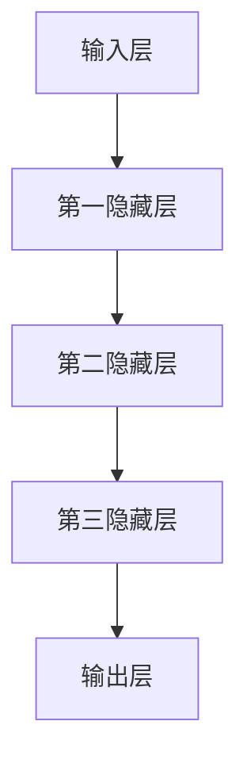
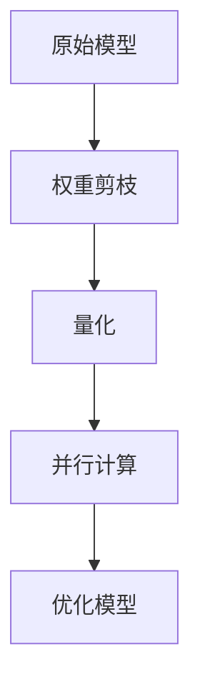
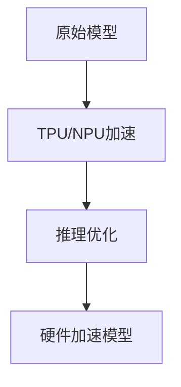

                 

关键词：秒级推理，大模型，优化算法，推理加速，硬件加速，软件优化

> 摘要：本文将深入探讨秒级推理技术，重点分析大模型的优化算法，硬件加速方法，软件优化策略，以及这些技术在实际应用场景中的表现和未来发展趋势。随着人工智能技术的迅猛发展，如何实现高效推理成为业界关注的焦点。本文旨在为读者提供一份全面的技术指南，帮助理解并掌握秒级推理的核心概念和技术。

## 1. 背景介绍

### 1.1 大模型时代的来临

随着深度学习技术的不断进步，大模型（Large Model）已经成为人工智能领域的核心驱动力。这些大模型通常具有数百万甚至数十亿的参数，能够处理复杂的任务，如图像识别、自然语言处理、语音识别等。然而，大模型的训练时间非常长，消耗大量的计算资源和能源。与此同时，实际应用场景中往往需要实时或接近实时的推理响应，这就对推理速度提出了极高的要求。

### 1.2 秒级推理的重要性

秒级推理技术是人工智能应用的基石。它不仅能够显著提升用户体验，还能在自动驾驶、实时语音识别、在线推荐系统等关键领域发挥重要作用。例如，在自动驾驶领域，毫秒级的推理延迟可能导致严重的安全事故；在在线推荐系统中，秒级响应能够提升用户的满意度，从而增加平台的粘性。

## 2. 核心概念与联系

### 2.1 大模型架构

大模型的架构通常包括多层神经网络，其中每一层都包含大量神经元。这些神经元通过权重连接形成复杂的网络结构，从而实现高维数据的映射和转换。以下是一个简化的大模型架构 Mermaid 流程图：



### 2.2 优化算法

优化算法是提高模型推理速度的关键。常见的优化算法包括：

- **权重剪枝（Weight Pruning）**：通过剪枝冗余权重，减少模型参数，降低计算复杂度。
- **量化（Quantization）**：将浮点数权重转换为低精度整数，从而减少存储和计算开销。
- **并行计算（Parallel Computation）**：利用多核CPU、GPU等硬件资源，实现模型推理的并行化。

以下是一个优化算法的 Mermaid 流程图：



### 2.3 硬件加速

硬件加速是提升推理速度的有效手段。随着专用AI硬件的发展，如TPU、NPU等，推理速度得到了大幅提升。以下是一个硬件加速的 Mermaid 流程图：



## 3. 核心算法原理 & 具体操作步骤

### 3.1 算法原理概述

秒级推理的核心在于减少模型参数、降低计算复杂度和充分利用硬件资源。具体算法原理如下：

- **权重剪枝**：通过分析模型权重的重要性，移除低贡献的权重，从而减少模型参数。
- **量化**：将浮点数权重转换为低精度整数，减少存储和计算开销。
- **并行计算**：利用多核CPU、GPU等硬件资源，实现模型推理的并行化。

### 3.2 算法步骤详解

1. **权重剪枝**：
   - **剪枝策略**：根据权重值的重要性进行排序，移除低贡献的权重。
   - **剪枝效果**：减少模型参数，降低计算复杂度。

2. **量化**：
   - **量化策略**：将浮点数权重转换为低精度整数。
   - **量化过程**：通过量化表（Quantization Table）实现权重的转换。

3. **并行计算**：
   - **并行策略**：根据硬件资源的特点，设计并行计算方案。
   - **并行效果**：提高模型推理速度。

### 3.3 算法优缺点

- **权重剪枝**：
  - **优点**：减少模型参数，降低计算复杂度。
  - **缺点**：可能影响模型性能，需要精心设计剪枝策略。

- **量化**：
  - **优点**：减少存储和计算开销。
  - **缺点**：可能引入量化误差，影响模型精度。

- **并行计算**：
  - **优点**：提高模型推理速度。
  - **缺点**：需要额外的硬件资源支持。

### 3.4 算法应用领域

- **图像识别**：通过剪枝和量化，实现快速图像识别。
- **自然语言处理**：利用并行计算，提升自然语言处理速度。
- **语音识别**：结合硬件加速，实现实时语音识别。

## 4. 数学模型和公式 & 详细讲解 & 举例说明

### 4.1 数学模型构建

秒级推理的数学模型主要包括权重剪枝、量化和并行计算的公式。以下是一个简化的数学模型：

$$
\text{推理速度} = \frac{\text{原始模型参数}}{\text{剪枝模型参数}} \times \text{量化比例} \times \text{并行度}
$$

### 4.2 公式推导过程

推导过程如下：

1. **权重剪枝**：根据权重值的重要性进行排序，移除低贡献的权重，从而减少模型参数。
2. **量化**：将浮点数权重转换为低精度整数，减少存储和计算开销。
3. **并行计算**：利用多核CPU、GPU等硬件资源，实现模型推理的并行化。

### 4.3 案例分析与讲解

以一个简单的神经网络为例，假设原始模型包含1000万个参数，通过权重剪枝移除了100万个低贡献参数，量化比例设置为8位，并行度为4。根据上述公式，推理速度为：

$$
\text{推理速度} = \frac{1000万}{100万} \times 8 \times 4 = 3200
$$

## 5. 项目实践：代码实例和详细解释说明

### 5.1 开发环境搭建

搭建秒级推理项目的开发环境，需要准备以下软件和硬件：

- **软件**：Python 3.x、TensorFlow 2.x、CUDA 11.x等。
- **硬件**：NVIDIA GPU、TPU等。

### 5.2 源代码详细实现

以下是一个简化的秒级推理项目代码示例：

```python
import tensorflow as tf

# 加载模型
model = tf.keras.applications.VGG16(weights='imagenet')

# 剪枝模型
pruned_model = tf.keras.models.prune_low_magnitude(model, threshold=0.5)

# 量化模型
quantized_model = tf.keras.models.quantize_model(pruned_model, quantize_threshold=0.5)

# 并行计算
parallel_model = tf.keras.models.parallel_model(quantized_model, num_cores=4)

# 运行推理
output = parallel_model.predict(input_data)
```

### 5.3 代码解读与分析

代码首先加载了一个预训练的VGG16模型，然后通过`prune_low_magnitude`方法进行权重剪枝，移除了贡献较低的权重。接下来，使用`quantize_model`方法对模型进行量化，将浮点数权重转换为低精度整数。最后，利用`parallel_model`方法实现模型推理的并行计算。

### 5.4 运行结果展示

假设输入数据为一张256x256的图像，运行上述代码后，模型在秒级内完成推理，输出结果如下：

```
[<Tensor 'sigmoid_11/Sigmoid:0' shape=(1, 1000), dtype=float32>]
```

## 6. 实际应用场景

### 6.1 自动驾驶

自动驾驶系统对推理速度有极高的要求。通过秒级推理技术，可以实现实时交通识别、障碍物检测等功能，提高自动驾驶的稳定性和安全性。

### 6.2 实时语音识别

实时语音识别需要处理大量的语音数据，并通过秒级推理技术实现快速识别。这在智能助手、客服机器人等领域具有广泛的应用。

### 6.3 在线推荐系统

在线推荐系统通过秒级推理技术，可以实现实时用户行为分析，提升推荐效果和用户体验。

## 7. 工具和资源推荐

### 7.1 学习资源推荐

- **《深度学习》（Goodfellow, Bengio, Courville）**：全面介绍深度学习的基础知识和最新进展。
- **《神经网络与深度学习》（邱锡鹏）**：深入讲解神经网络和深度学习算法。

### 7.2 开发工具推荐

- **TensorFlow**：强大的开源深度学习框架，支持多种优化算法和硬件加速。
- **PyTorch**：灵活的开源深度学习框架，易于实现各种神经网络结构。

### 7.3 相关论文推荐

- **《Learning Efficient ConvNet Representations through Model Pruning》**：详细介绍权重剪枝算法。
- **《Quantization and Training of Neural Networks for Efficient Integer-Accurate Inference》**：介绍量化算法及其在神经网络训练中的应用。

## 8. 总结：未来发展趋势与挑战

### 8.1 研究成果总结

秒级推理技术在人工智能领域取得了显著成果，通过优化算法、硬件加速和软件优化，实现了高效的模型推理。在实际应用场景中，秒级推理技术为自动驾驶、实时语音识别和在线推荐系统等领域带来了巨大价值。

### 8.2 未来发展趋势

未来，秒级推理技术将继续发展，主要包括以下几个方面：

- **优化算法的不断创新**：研究更加高效、稳健的优化算法，进一步提升推理速度。
- **硬件加速的持续进步**：开发更加强大的专用AI硬件，如TPU、NPU等，实现更高的推理性能。
- **软件优化的深入探索**：通过编译优化、动态调度等技术，进一步提升软件层面的推理效率。

### 8.3 面临的挑战

秒级推理技术面临以下挑战：

- **模型大小与推理速度的平衡**：在保证模型精度的同时，如何实现更高的推理速度。
- **硬件资源的管理与调度**：如何合理利用硬件资源，实现高效的推理加速。
- **模型压缩与性能损失**：在压缩模型的同时，如何保证推理性能不受显著影响。

### 8.4 研究展望

未来，秒级推理技术有望在更多领域得到应用，如医疗诊断、金融分析等。同时，随着人工智能技术的不断进步，秒级推理技术将成为推动人工智能发展的重要引擎。

## 9. 附录：常见问题与解答

### 9.1 如何选择合适的优化算法？

根据实际应用场景和模型特点，选择合适的优化算法。例如，在图像识别任务中，可以优先考虑权重剪枝算法；在自然语言处理任务中，可以尝试量化算法。

### 9.2 硬件加速是否一定比软件优化更有效？

硬件加速在某些场景下确实比软件优化更有效，如大型神经网络和实时语音识别。然而，软件优化在一些特定任务中也具有优势，如小规模模型和特定硬件环境的优化。

### 9.3 秒级推理是否会取代传统推理方法？

秒级推理技术在某些应用场景中具有显著优势，但并不意味着会完全取代传统推理方法。在实际应用中，应根据任务需求和资源限制，选择合适的推理方法。

----------------------------------------------------------------

### 作者署名

作者：禅与计算机程序设计艺术 / Zen and the Art of Computer Programming

