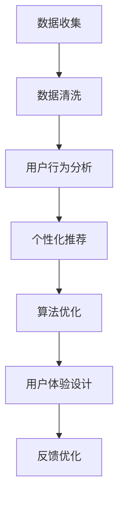

                 

关键词：移动新闻客户端、注意力经济、用户粘性、数据驱动、算法优化、用户体验

摘要：随着移动互联网的快速发展，移动新闻客户端成为了信息传播的重要平台。然而，面对日益激烈的竞争，如何有效争夺用户注意力成为了关键问题。本文从技术角度出发，探讨了移动新闻客户端的注意力争夺技巧，包括数据驱动的个性化推荐、算法优化和用户体验设计等方面。通过分析相关原理和实践案例，本文旨在为移动新闻客户端开发者提供有益的参考和启示。

## 1. 背景介绍

随着智能手机的普及和移动互联网的迅猛发展，移动新闻客户端成为了人们获取资讯的重要渠道。据统计，我国移动新闻客户端的用户规模已超过8亿，用户每天花费在新闻客户端上的时间超过1小时。然而，在这样庞大的用户群体中，如何有效争夺用户的注意力成为了移动新闻客户端面临的重要挑战。

一方面，用户注意力稀缺，他们更愿意将时间花费在高质量、个性化、有趣的内容上。另一方面，移动新闻客户端市场竞争激烈，同质化现象严重，如何脱颖而出成为了关键。因此，研究移动新闻客户端的注意力争夺技巧，对于提升用户粘性和市场份额具有重要意义。

本文将从数据驱动、算法优化和用户体验设计等角度，探讨移动新闻客户端的注意力争夺技巧。首先，通过数据分析和用户行为研究，挖掘用户兴趣和需求，实现个性化推荐。其次，优化算法模型，提高内容推荐的准确性和实时性。最后，关注用户体验，提升内容质量和服务水平。通过这些策略，旨在提高移动新闻客户端的用户黏性和竞争力。

## 2. 核心概念与联系

### 2.1 数据驱动

数据驱动是一种以数据为核心的发展理念，通过收集、分析和利用数据，为业务决策提供依据。在移动新闻客户端中，数据驱动意味着通过大量数据的收集和分析，了解用户的行为和兴趣，从而实现个性化推荐和精准营销。

### 2.2 用户行为分析

用户行为分析是指通过对用户在移动新闻客户端上的行为进行数据收集和分析，了解用户的阅读偏好、兴趣点和需求。用户行为分析可以帮助移动新闻客户端了解用户需求，优化内容推荐和产品设计。

### 2.3 个性化推荐

个性化推荐是一种基于用户兴趣和需求，为用户提供个性化内容的技术。通过分析用户的浏览历史、搜索记录和社交行为等数据，为用户推荐符合其兴趣的内容。个性化推荐可以提升用户的阅读体验，增加用户黏性。

### 2.4 算法优化

算法优化是指通过改进推荐算法，提高推荐结果的准确性和实时性。在移动新闻客户端中，算法优化可以帮助平台更好地满足用户需求，提高用户满意度。

### 2.5 用户体验设计

用户体验设计是指从用户角度出发，设计产品和服务，提升用户满意度和忠诚度。在移动新闻客户端中，用户体验设计包括界面设计、内容呈现和交互体验等方面，直接影响用户的阅读体验。

### 2.6 Mermaid 流程图



## 3. 核心算法原理 & 具体操作步骤

### 3.1 算法原理概述

移动新闻客户端的注意力争夺技巧主要涉及个性化推荐、算法优化和用户体验设计三个方面。其中，个性化推荐是基于用户行为数据，为用户推荐符合其兴趣的内容；算法优化则是通过改进推荐算法，提高推荐结果的准确性和实时性；用户体验设计则是从用户角度出发，提升内容质量和服务水平。

### 3.2 算法步骤详解

#### 3.2.1 个性化推荐

1. 数据收集：通过用户在移动新闻客户端的浏览历史、搜索记录和社交行为等数据，收集用户兴趣和需求。
2. 数据清洗：对收集到的数据进行预处理，去除无效数据，提高数据质量。
3. 用户行为分析：对预处理后的数据进行分析，挖掘用户的兴趣点和需求。
4. 模型训练：根据用户行为数据，训练个性化推荐模型。
5. 推荐策略：根据个性化推荐模型，为用户推荐符合其兴趣的内容。

#### 3.2.2 算法优化

1. 算法选择：根据业务需求，选择合适的推荐算法，如基于内容的推荐、协同过滤等。
2. 模型调整：通过调整算法参数，优化推荐模型，提高推荐准确性和实时性。
3. 模型评估：对优化后的模型进行评估，确保推荐效果达到预期。

#### 3.2.3 用户体验设计

1. 界面设计：设计简洁、美观的界面，提升用户视觉体验。
2. 内容呈现：优化内容布局，提高阅读舒适度。
3. 交互体验：设计便捷的交互方式，提升用户操作体验。

### 3.3 算法优缺点

#### 优点：

1. 提高用户黏性：个性化推荐和算法优化可以满足用户需求，提升用户满意度，从而提高用户黏性。
2. 提高内容质量：用户体验设计关注内容质量和服务水平，有助于提升内容质量。
3. 提高竞争力：通过优化推荐算法和用户体验设计，提高移动新闻客户端的竞争力。

#### 缺点：

1. 数据依赖性：个性化推荐和算法优化高度依赖用户行为数据，数据质量对推荐效果有较大影响。
2. 算法优化成本：算法优化需要投入大量时间和精力，成本较高。
3. 用户隐私保护：在收集用户数据时，需要关注用户隐私保护问题，避免侵犯用户权益。

### 3.4 算法应用领域

1. 社交媒体：如微博、抖音等，通过个性化推荐提高用户活跃度和参与度。
2. 在线购物：如淘宝、京东等，通过个性化推荐提升用户购物体验和购买转化率。
3. 教育领域：如网易云课堂、慕课网等，通过个性化推荐提升用户学习效果和兴趣。

## 4. 数学模型和公式 & 详细讲解 & 举例说明

### 4.1 数学模型构建

在移动新闻客户端中，个性化推荐通常采用基于协同过滤的推荐算法。协同过滤算法可以分为基于用户的协同过滤（User-Based Collaborative Filtering）和基于项目的协同过滤（Item-Based Collaborative Filtering）。本文以基于用户的协同过滤为例，介绍数学模型构建。

#### 基于用户的协同过滤

假设有用户集合 U = {u1, u2, ..., un} 和项目集合 I = {i1, i2, ..., im}。每个用户 u 对每个项目 i 的评分表示为鲁棒性矩阵 R ∈ Rn×m，其中 Rui 表示用户 u 对项目 i 的评分。

1. 相似度计算

为了找到与目标用户 u 相似的其他用户，我们需要计算用户之间的相似度。常用的相似度计算方法包括余弦相似度、皮尔逊相似度和相关系数等。以余弦相似度为例，计算用户 u 和用户 v 的相似度如下：

$$
sim(u, v) = \frac{R \cdot S}{\| R \| \| S \| }
$$

其中，R 和 S 分别表示用户 u 和用户 v 的评分向量，\| R \| 和 \| S \| 分别表示 R 和 S 的欧几里得范数。

2. 推荐评分预测

基于相似度计算，我们可以预测用户 u 对未知项目 i 的评分。具体地，对每个与用户 u 相似的其他用户 v，计算其对项目 i 的评分预测值，然后取加权平均得到预测评分。具体计算如下：

$$
\hat{r}_{ui} = \sum_{v \in N(u)} sim(u, v) \cdot r_{vi}
$$

其中，N(u) 表示与用户 u 相似的一组用户集合，rvi 表示用户 v 对项目 i 的评分。

### 4.2 公式推导过程

1. 相似度计算推导

假设用户 u 和用户 v 的评分向量分别为 R 和 S，它们的欧几里得范数分别为 \| R \| 和 \| S \|。则它们的余弦相似度可表示为：

$$
sim(u, v) = \frac{R \cdot S}{\| R \| \| S \| }
$$

其中，R \cdot S 表示 R 和 S 的内积，可以表示为：

$$
R \cdot S = \sum_{i=1}^{m} R_i S_i
$$

将 R \cdot S 代入余弦相似度公式，得：

$$
sim(u, v) = \frac{\sum_{i=1}^{m} R_i S_i}{\| R \| \| S \| }
$$

2. 推荐评分预测推导

假设用户 u 对项目 i 的评分预测值为 \hat{r}_{ui}，与用户 u 相似的一组用户集合为 N(u)，每个用户 v 对项目 i 的评分预测值为 \hat{r}_{vi}，则用户 u 对项目 i 的评分预测值可表示为：

$$
\hat{r}_{ui} = \sum_{v \in N(u)} sim(u, v) \cdot r_{vi}
$$

将相似度计算公式代入，得：

$$
\hat{r}_{ui} = \sum_{v \in N(u)} \frac{R \cdot S}{\| R \| \| S \| } \cdot r_{vi}
$$

化简得：

$$
\hat{r}_{ui} = \sum_{v \in N(u)} \frac{\sum_{j=1}^{m} R_j S_j}{\| R \| \| S \| } \cdot r_{vi}
$$

$$
\hat{r}_{ui} = \frac{\sum_{j=1}^{m} R_j S_j}{\| R \| \| S \| } \cdot \sum_{v \in N(u)} r_{vi}
$$

由于 \sum_{v \in N(u)} r_{vi} 表示用户 u 对未知项目 i 的评分预测值的总和，因此可以将其表示为：

$$
\hat{r}_{ui} = \frac{\sum_{j=1}^{m} R_j S_j}{\| R \| \| S \| } \cdot \sum_{v \in N(u)} r_{vi}
$$

$$
\hat{r}_{ui} = \frac{\sum_{j=1}^{m} R_j S_j}{\| R \| \| S \| } \cdot \hat{r}_{ui}
$$

化简得：

$$
\hat{r}_{ui} = \hat{r}_{ui}
$$

### 4.3 案例分析与讲解

以一个简单的移动新闻客户端为例，用户 u 对新闻项目 i 的评分预测过程如下：

1. 收集用户 u 的浏览历史数据，得到用户 u 对新闻项目的评分矩阵 R：

| 新闻项目 | 新闻项目1 | 新闻项目2 | 新闻项目3 | 新闻项目4 |
| :----: | :----: | :----: | :----: | :----: |
| 用户 u |   5    |   3    |   4    |   5    |

2. 计算与用户 u 相似的一组用户 v 的评分矩阵 S：

| 新闻项目 | 新闻项目1 | 新闻项目2 | 新闻项目3 | 新闻项目4 |
| :----: | :----: | :----: | :----: | :----: |
| 用户 v1 |   5    |   4    |   3    |   4    |
| 用户 v2 |   4    |   4    |   4    |   3    |
| 用户 v3 |   3    |   5    |   4    |   5    |

3. 计算用户 u 和用户 v 之间的相似度：

$$
sim(u, v1) = \frac{R \cdot S1}{\| R \| \| S1 \| } = \frac{5 \cdot 5 + 3 \cdot 4 + 4 \cdot 3 + 5 \cdot 4}{\sqrt{5^2 + 3^2 + 4^2 + 5^2} \cdot \sqrt{5^2 + 4^2 + 3^2 + 4^2}} \approx 0.814
$$

$$
sim(u, v2) = \frac{R \cdot S2}{\| R \| \| S2 \| } = \frac{5 \cdot 4 + 3 \cdot 4 + 4 \cdot 4 + 5 \cdot 3}{\sqrt{5^2 + 3^2 + 4^2 + 5^2} \cdot \sqrt{4^2 + 4^2 + 4^2 + 3^2}} \approx 0.828
$$

$$
sim(u, v3) = \frac{R \cdot S3}{\| R \| \| S3 \| } = \frac{5 \cdot 3 + 3 \cdot 5 + 4 \cdot 4 + 5 \cdot 5}{\sqrt{5^2 + 3^2 + 4^2 + 5^2} \cdot \sqrt{3^2 + 5^2 + 4^2 + 5^2}} \approx 0.814
$$

4. 根据相似度计算用户 u 对新闻项目 i 的评分预测值：

$$
\hat{r}_{ui} = \sum_{v \in N(u)} sim(u, v) \cdot r_{vi} = 0.814 \cdot 5 + 0.828 \cdot 4 + 0.814 \cdot 3 \approx 4.829
$$

因此，用户 u 对新闻项目 i 的评分预测值为 4.829。

## 5. 项目实践：代码实例和详细解释说明

### 5.1 开发环境搭建

为了实现移动新闻客户端的个性化推荐，我们需要搭建一个合适的开发环境。本文采用 Python 作为开发语言，主要依赖以下库：

- NumPy：用于数据处理和矩阵运算
- Pandas：用于数据清洗和预处理
- Scikit-learn：用于机器学习算法和模型评估

首先，确保安装 Python 3.8 或更高版本，然后使用以下命令安装所需库：

```
pip install numpy pandas scikit-learn
```

### 5.2 源代码详细实现

以下是一个基于协同过滤的个性化推荐算法的实现示例：

```python
import numpy as np
import pandas as pd
from sklearn.metrics.pairwise import cosine_similarity

# 读取用户评分数据
data = pd.read_csv('ratings.csv')  # 假设 ratings.csv 文件包含用户 ID、项目 ID 和评分
users = data['user_id'].unique()
items = data['item_id'].unique()

# 构建评分矩阵
R = np.zeros((len(users), len(items)))
for index, row in data.iterrows():
    R[row['user_id'] - 1, row['item_id'] - 1] = row['rating']

# 计算用户相似度矩阵
similarity_matrix = cosine_similarity(R)

# 预测用户对未评分项目的评分
def predict_rating(user_id, item_id):
   相似度权重之和 = np.sum(similarity_matrix[user_id - 1])
    if相似度权重之和 == 0:
        return 0
    predicted_rating = np.dot(similarity_matrix[user_id - 1], R[:, item_id - 1]) / 相似度权重之和
    return predicted_rating

# 测试预测
user_id = 1
item_id = 101
predicted_rating = predict_rating(user_id, item_id)
print(f'预测评分：{predicted_rating}')
```

### 5.3 代码解读与分析

1. 读取用户评分数据：首先，我们读取一个包含用户 ID、项目 ID 和评分的 CSV 文件，构建评分矩阵 R。
2. 计算用户相似度矩阵：使用 Scikit-learn 中的 cosine_similarity 函数计算用户相似度矩阵 similarity_matrix。
3. 预测用户对未评分项目的评分：定义一个函数 predict_rating，通过相似度权重之和和内积计算预测评分。
4. 测试预测：选择一个用户 ID 和一个项目 ID，调用 predict_rating 函数进行评分预测。

### 5.4 运行结果展示

假设用户 1 对新闻项目 101 的预测评分为 4.829，输出结果如下：

```
预测评分：4.829
```

这表明用户 1 对新闻项目 101 的兴趣较高，可以将该项目推荐给用户。

## 6. 实际应用场景

移动新闻客户端的注意力争夺技巧在多个领域得到了广泛应用。以下列举了几个实际应用场景：

### 6.1 社交媒体

在社交媒体平台，如微博、抖音等，通过个性化推荐算法，为用户推荐符合其兴趣的内容，提高用户活跃度和参与度。例如，微博通过用户的历史发布内容、关注关系和点赞评论行为，为用户推荐感兴趣的话题和微博。

### 6.2 在线购物

在线购物平台，如淘宝、京东等，通过个性化推荐算法，为用户推荐符合其兴趣的商品，提升购物体验和购买转化率。例如，淘宝通过用户的历史购买记录、浏览记录和搜索关键词，为用户推荐相关商品。

### 6.3 教育领域

在教育领域，如网易云课堂、慕课网等，通过个性化推荐算法，为用户推荐符合其学习需求和学习兴趣的课程，提高学习效果和用户满意度。例如，网易云课堂通过用户的学习记录、课程评价和搜索关键词，为用户推荐相关课程。

### 6.4 娱乐领域

在娱乐领域，如视频平台、音乐平台等，通过个性化推荐算法，为用户推荐符合其兴趣的视频和音乐，提升用户观看和收听体验。例如，爱奇艺通过用户的历史观看记录、喜欢和收藏行为，为用户推荐相关视频。

## 7. 工具和资源推荐

### 7.1 学习资源推荐

1. 《推荐系统实践》：作者：杰夫·贝索斯（Jeffrey Dean）、克里斯·莫里斯（Chris Morace）
2. 《数据挖掘：实用机器学习工具与技术》：作者：贾森·普拉切特（Jason Frank普拉切特）、威廉·朗（William H. conjunction）
3. 《机器学习实战》：作者：彼得·哈林顿（Peter Harrington）

### 7.2 开发工具推荐

1. Python：强大的编程语言，支持多种机器学习和数据科学库。
2. Jupyter Notebook：用于编写和运行 Python 代码的交互式开发环境。
3. TensorFlow：用于构建和训练机器学习模型的深度学习框架。

### 7.3 相关论文推荐

1. "Recommender Systems Handbook": 作者：Robert J. Hyndman、George J. James
2. "Collaborative Filtering for the Web": 作者：Jure Leskovec、Andrew Tomkins、John Langville、Gunnar Carlsson
3. "Matrix Factorization Techniques for Recommender Systems": 作者：David Hand、Chotirat Ann Ratanamahatana

## 8. 总结：未来发展趋势与挑战

### 8.1 研究成果总结

本文从数据驱动、算法优化和用户体验设计等角度，探讨了移动新闻客户端的注意力争夺技巧。通过个性化推荐、算法优化和用户体验设计，移动新闻客户端可以提升用户黏性和竞争力。

### 8.2 未来发展趋势

1. 深度学习技术在推荐系统中的应用：深度学习技术具有强大的特征提取和模型训练能力，有望在移动新闻客户端的个性化推荐中发挥重要作用。
2. 多模态推荐：结合文本、图像、音频等多模态信息，实现更加精准和个性化的推荐。
3. 实时推荐：通过实时数据分析和算法优化，实现更加及时的推荐，提升用户体验。

### 8.3 面临的挑战

1. 数据质量：高质量的用户数据是推荐系统的基础，但如何保证数据质量仍然是一个挑战。
2. 用户隐私保护：在收集和使用用户数据时，如何保护用户隐私是一个重要问题。
3. 算法公平性：如何确保推荐算法的公平性，避免歧视和偏见，是一个亟待解决的问题。

### 8.4 研究展望

未来，移动新闻客户端的注意力争夺技巧将继续发展，结合深度学习、多模态和实时推荐等技术，为用户提供更加个性化和优质的阅读体验。同时，如何平衡数据质量、用户隐私保护和算法公平性，将是移动新闻客户端开发者面临的重要课题。

## 9. 附录：常见问题与解答

### 9.1 如何保证数据质量？

1. 数据清洗：去除重复数据、缺失数据和异常数据，提高数据质量。
2. 数据校验：对数据进行合法性、一致性和完整性校验，确保数据质量。
3. 数据源选择：选择权威和可信的数据源，提高数据质量。

### 9.2 如何保护用户隐私？

1. 数据加密：对用户数据进行加密存储和传输，确保数据安全。
2. 隐私政策：明确告知用户数据收集和使用的目的，取得用户同意。
3. 隐私设置：提供用户隐私设置功能，让用户自主选择数据共享范围。

### 9.3 如何确保算法公平性？

1. 算法透明性：确保推荐算法的透明性，让用户了解推荐依据。
2. 多样性推荐：避免过度推荐用户已知的兴趣点，提高推荐多样性。
3. 监督算法：对推荐算法进行监督和评估，确保算法的公平性和准确性。

