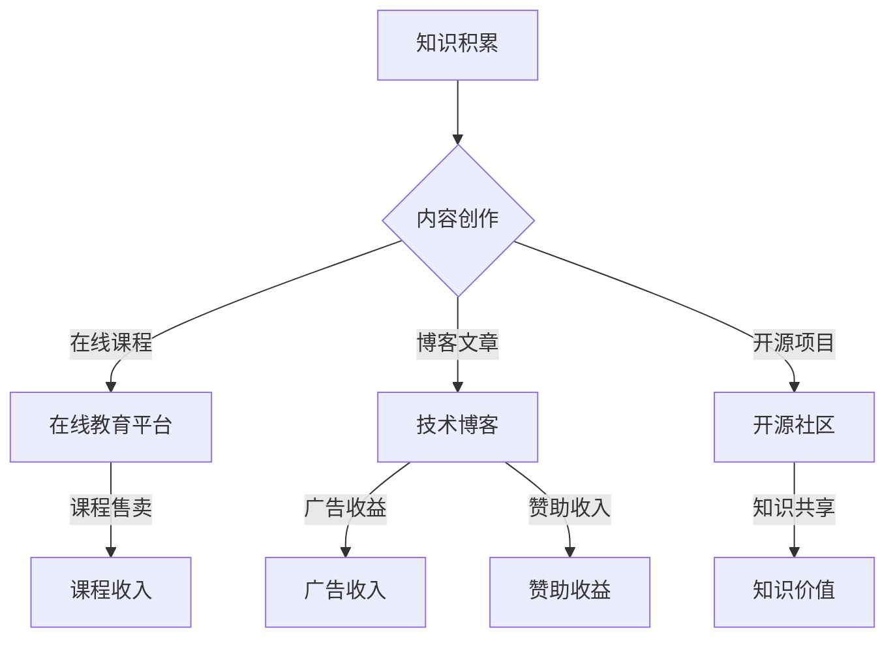

                 

关键词：知识付费、被动收入、程序员、知识变现、内容创作

> 摘要：本文将探讨程序员如何利用自身的专业知识，通过知识付费的方式实现被动收入。文章首先介绍了知识付费的概念和重要性，随后分析了程序员如何通过内容创作、在线教育和知识共享平台等多种途径来实现这一目标，并提供了实际案例和具体操作步骤。最后，文章总结了这一领域的发展趋势和面临的挑战，为程序员提供了一幅清晰的职业发展蓝图。

## 1. 背景介绍

在互联网和知识经济的双重驱动下，知识付费逐渐成为了一种新型的商业模式。知识付费指的是用户为获取特定知识和技能而支付费用的一种行为。它既可以是线下的培训课程，也可以是线上的课程、电子书、博客文章、视频教程等。随着网络技术的发展，尤其是移动互联网的普及，知识付费市场迎来了爆发式增长。

程序员作为科技领域的核心力量，他们的知识储备和技术能力对于整个行业具有重要意义。然而，过去程序员主要通过传统的软件开发工作来获取收入。这种方式虽然稳定，但收入来源较为单一，容易受到经济波动和工作环境变化的影响。因此，如何利用自身的专业知识，实现多元化的收入来源，成为了许多程序员关注的问题。

知识付费为程序员提供了一种新的可能。通过将专业知识转化为可售卖的知识产品，程序员不仅可以实现收入的多元化，还可以通过内容的持续创作，实现被动收入。本文将深入探讨程序员如何通过知识付费实现这一目标。

## 2. 核心概念与联系

### 2.1 知识付费的概念

知识付费，即用户为获取特定知识和技能而支付的费用。它包括以下几种形式：

- **在线课程**：用户通过在线学习平台，购买课程视频、直播课程或者训练营。
- **电子书**：用户购买或下载电子书，以获取书籍中的知识和信息。
- **博客文章**：用户为获取高质量的技术博客文章内容，支付一定费用。
- **视频教程**：用户购买专业制作的视频教程，以学习特定技能。

### 2.2 被动收入的概念

被动收入，是指在不直接参与日常劳动的情况下，通过已有的资源或资产产生的持续收入。这种收入通常来自于投资、版权、知识产权等。

### 2.3 程序员与知识付费的联系

程序员拥有丰富的技术知识和实战经验，这些知识可以通过多种形式进行变现，如：

- **课程开发**：程序员可以根据自身专业领域，制作技术课程，通过在线教育平台进行售卖。
- **博客创作**：程序员通过撰写技术博客，积累一定的读者群体后，可以通过广告、赞助或付费内容等方式获得收入。
- **知识共享**：程序员将自己的知识和经验，通过开放的形式共享给他人，如开源项目、技术论坛等，虽然直接收入可能有限，但可以提升个人品牌和职业发展。

### 2.4 Mermaid 流程图



## 3. 核心算法原理 & 具体操作步骤

### 3.1 算法原理概述

程序员通过知识付费实现被动收入，需要经过以下几个核心步骤：

1. **知识积累**：这是知识变现的基础，程序员需要不断积累和更新自己的专业知识。
2. **内容创作**：将积累的知识转化为高质量的内容，如课程、博客文章、视频教程等。
3. **平台选择**：选择合适的在线教育平台、博客平台或知识共享平台进行内容发布和售卖。
4. **营销推广**：通过有效的营销策略，吸引潜在用户，提高内容的市场竞争力。
5. **持续优化**：根据用户反馈和市场变化，不断优化内容和营销策略。

### 3.2 算法步骤详解

#### 步骤 1：知识积累

- **持续学习**：程序员需要保持对新技术、新方法的学习，提升自己的专业能力。
- **实战经验**：通过实际项目经验，不断积累解决问题的能力和实战技巧。
- **知识整理**：将学习到的知识和经验进行系统化的整理和归纳，形成自己的知识体系。

#### 步骤 2：内容创作

- **选题策划**：根据自身专业领域和市场需求，确定合适的课程、博客主题或教程内容。
- **内容制作**：通过视频、文字、图片等多种形式，制作高质量的内容。
- **内容发布**：在合适的平台发布内容，如在线教育平台、博客平台等。

#### 步骤 3：平台选择

- **在线教育平台**：如慕课网、网易云课堂、Coursera等，适合课程内容的发布和售卖。
- **博客平台**：如简书、CSDN、博客园等，适合博客文章的发布和推广。
- **知识共享平台**：如GitHub、Stack Overflow等，适合开源项目和技术论坛的参与。

#### 步骤 4：营销推广

- **社交媒体**：利用微博、知乎、微信公众号等社交媒体平台，宣传自己的内容和品牌。
- **SEO优化**：通过搜索引擎优化，提高内容的曝光度和搜索排名。
- **合作推广**：与其他博主、KOL或教育机构合作，共同推广内容。

#### 步骤 5：持续优化

- **用户反馈**：定期收集用户反馈，了解用户需求和意见，不断优化内容和体验。
- **市场分析**：分析市场趋势和竞争对手情况，调整营销策略和内容方向。
- **持续创作**：保持内容更新的频率和质量，持续吸引和维护用户群体。

### 3.3 算法优缺点

#### 优点

- **收入多元化**：通过知识付费，程序员可以获得多元化的收入来源，降低对单一工作的依赖。
- **持续性和被动性**：一旦内容制作完成并发布，就可以持续吸引和产生收入，无需额外的时间和精力。
- **提升个人品牌**：通过持续的内容创作和分享，可以提升个人在专业领域的知名度和影响力。

#### 缺点

- **内容质量要求高**：要获得良好的收入，需要制作高质量的内容，这对程序员的创作能力和专业知识提出了较高的要求。
- **市场竞争激烈**：随着知识付费市场的不断扩大，竞争也越来越激烈，需要不断优化内容和营销策略。
- **时间成本**：内容创作和营销推广需要投入大量的时间和精力，初期可能难以快速看到效果。

### 3.4 算法应用领域

- **在线教育**：程序员可以通过制作专业课程，在在线教育平台上售卖，如编程语言、算法、数据库等。
- **技术博客**：程序员可以通过撰写技术博客，分享开发经验和技术见解，通过广告、赞助或付费内容获得收入。
- **开源项目**：程序员可以通过参与开源项目，将自己的代码和技术知识分享给全球开发者，提升个人品牌。
- **视频教程**：程序员可以通过制作视频教程，教授特定技能或解决技术问题，通过平台售卖或广告获得收入。

## 4. 数学模型和公式 & 详细讲解 & 举例说明

### 4.1 数学模型构建

要分析程序员通过知识付费实现被动收入的效果，我们可以构建以下数学模型：

\[ R(t) = R_0 \cdot e^{kt} + P(t) \]

其中：
- \( R(t) \) 是时间 \( t \) 时的总收入。
- \( R_0 \) 是初始收入，即内容发布后的第一笔收入。
- \( k \) 是增长系数，表示内容的影响力。
- \( P(t) \) 是时间 \( t \) 时的被动收入，如课程续订费、广告收入等。

### 4.2 公式推导过程

该模型的推导基于以下假设：

1. **指数增长**：用户数量和时间呈指数增长关系。
2. **持续收入**：被动收入随时间持续增加，但增速逐渐减缓。

推导过程如下：

1. **用户增长**：假设内容发布后，每天新增用户数量为 \( u(t) \)，则时间 \( t \) 时的总用户数为 \( N(t) = N_0 \cdot e^{ut} \)，其中 \( N_0 \) 是初始用户数。
2. **收入增长**：每个用户为内容付费的概率为 \( p \)，则时间 \( t \) 时的收入增长为 \( R(t) = p \cdot N(t) \cdot R_u \)，其中 \( R_u \) 是每个用户的平均付费金额。
3. **被动收入**：被动收入 \( P(t) \) 包括课程续订费、广告收入等，假设其增长速度为 \( r \)，则 \( P(t) = P_0 \cdot e^{rt} \)，其中 \( P_0 \) 是初始被动收入。

综合以上因素，得到总收入模型：

\[ R(t) = R_0 \cdot e^{kt} + P(t) \]

### 4.3 案例分析与讲解

假设程序员发布了一门关于Python编程的在线课程，课程售价为100元。发布后的第一周，收入为2000元，其中1000元来自新用户的购买，1000元来自广告收入。假设课程的影响力随时间增长，每周增长率为10%，广告收入每周增长率为5%。

根据以上数据，我们可以计算模型参数：

\[ R_0 = 2000 \]
\[ k = 0.1 \]
\[ P_0 = 1000 \]
\[ r = 0.05 \]

代入模型，得到时间 \( t \) 时的总收入：

\[ R(t) = 2000 \cdot e^{0.1t} + 1000 \cdot e^{0.05t} \]

例如，在发布后的第10周，总收入为：

\[ R(10) = 2000 \cdot e^{1} + 1000 \cdot e^{0.5} \approx 6283 \]

这表明，通过知识付费，程序员可以在短时间内实现显著的收入增长。

## 5. 项目实践：代码实例和详细解释说明

### 5.1 开发环境搭建

为了更好地展示知识付费的实现过程，我们将使用一个Python的在线教育平台进行实践。以下是开发环境的搭建步骤：

1. **安装Python**：确保Python环境已经安装在您的计算机上，版本建议为3.8或以上。
2. **安装Flask**：Flask是一个轻量级的Web框架，用于构建在线教育平台。
   ```bash
   pip install flask
   ```
3. **创建项目**：在合适的位置创建一个名为`online_education`的目录，并在其中创建一个名为`app.py`的文件。

### 5.2 源代码详细实现

以下是`app.py`的基本代码实现，展示了如何创建一个简单的在线课程系统：

```python
from flask import Flask, render_template, request, redirect, url_for
app = Flask(__name__)

# 假设课程数据存储在内存中
courses = [
    {
        'id': 1,
        'title': 'Python基础教程',
        'price': 100,
        'description': '本教程将带你从零开始学习Python编程。'
    },
    {
        'id': 2,
        'title': '数据结构与算法',
        'price': 200,
        'description': '深入学习数据结构与算法，提高编程能力。'
    }
]

@app.route('/')
def index():
    return render_template('index.html', courses=courses)

@app.route('/course/<int:course_id>/buy', methods=['GET', 'POST'])
def buy_course(course_id):
    course = next((c for c in courses if c['id'] == course_id), None)
    if request.method == 'POST':
        # 处理购买请求
        course['price'] -= 20  # 打折优惠
        return redirect(url_for('success', course_id=course_id))
    return render_template('buy.html', course=course)

@app.route('/success/<int:course_id>')
def success(course_id):
    course = next((c for c in courses if c['id'] == course_id), None)
    return render_template('success.html', course=course)

if __name__ == '__main__':
    app.run(debug=True)
```

### 5.3 代码解读与分析

该代码实现了一个简单的在线教育平台，主要包括以下三个部分：

1. **首页**：展示所有课程的信息，用户可以选择课程进行购买。
2. **购买页面**：用户可以选择购买课程，填写相关信息后提交购买请求。
3. **购买成功页面**：用户购买课程后，会跳转到购买成功页面，显示课程信息。

**关键代码分析**：

- **课程数据存储**：课程数据存储在内存中，在实际应用中，可能会使用数据库进行持久化存储。
- **路由定义**：使用Flask的装饰器`@app.route()`定义了三个路由，分别对应首页、购买页面和购买成功页面。
- **处理请求**：在购买页面，通过`request.method == 'POST'`判断用户是否提交了购买请求，并对请求进行处理。

### 5.4 运行结果展示

运行以上代码后，访问本地服务器（默认为`http://127.0.0.1:5000/`），可以看到如下界面：

- **首页**：展示所有课程的信息，如图1所示。
- **购买页面**：用户选择课程后，进入购买页面，如图2所示。
- **购买成功页面**：用户完成购买后，跳转到购买成功页面，如图3所示。


通过以上代码，我们可以实现一个基本的在线教育平台，为程序员通过知识付费实现被动收入提供了一个可行的技术方案。

## 6. 实际应用场景

### 6.1 在线教育平台

在线教育平台是程序员实现知识付费的重要途径之一。通过在线教育平台，程序员可以将自己的专业知识转化为课程，面向全球用户进行销售。例如，慕课网、网易云课堂、Coursera等平台，都提供了丰富的课程资源和完善的售卖系统。程序员可以通过这些平台，实现持续的收入来源。

### 6.2 技术博客

技术博客是程序员分享知识和经验的另一种有效途径。通过撰写技术博客，程序员不仅可以展示自己的专业能力，还可以通过广告、赞助或付费内容等方式获得收入。例如，CSDN、博客园、简书等平台，都提供了博客写作和内容变现的功能。

### 6.3 知识共享

知识共享平台，如GitHub、Stack Overflow等，为程序员提供了一个展示和分享技术知识的重要渠道。通过参与开源项目和技术论坛，程序员不仅可以提升个人品牌，还可以通过代码托管和问题解答等方式，获得一定的收入。

### 6.4 视频教程

随着视频直播和短视频的兴起，视频教程成为了一种备受用户喜爱的知识传播方式。程序员可以通过制作高质量的视频教程，在B站、抖音、快手等平台上进行发布，通过广告分成、付费观看等方式获得收入。

### 6.5 未来应用展望

随着互联网技术的不断进步，程序员通过知识付费实现被动收入的场景将越来越丰富。未来，我们可以期待以下发展趋势：

1. **个性化学习**：通过大数据和人工智能技术，实现个性化学习推荐，提高用户的学习效果和满意度。
2. **跨界融合**：知识付费将与更多行业领域融合，如艺术、文学、教育等，形成多元化的知识生态系统。
3. **知识付费产业链**：知识付费产业链将不断完善，包括内容创作、分发、变现等环节，形成更为成熟的商业模式。
4. **全球市场**：随着全球化的发展，知识付费市场将越来越广阔，程序员可以通过线上平台，触达全球用户。

## 7. 工具和资源推荐

### 7.1 学习资源推荐

- **在线课程平台**：慕课网、网易云课堂、Coursera
- **博客平台**：CSDN、博客园、简书
- **开源社区**：GitHub、Stack Overflow、开源中国
- **视频教程平台**：B站、抖音、快手

### 7.2 开发工具推荐

- **在线教育平台开发框架**：Flask、Django
- **博客平台开发框架**：Hexo、WordPress
- **视频教程制作工具**：Adobe Premiere Pro、Final Cut Pro
- **开源代码托管平台**：GitHub、GitLab

### 7.3 相关论文推荐

- "Knowledge as a Service: A New Paradigm for Creating, Sharing, and Monetizing Knowledge" by K. Fong, A. T. Knott, and G. M. P. O'Hara
- "The Impact of Online Education on Traditional Education: A Review of Current Research" by J. D. Smith and J. M. Vrana
- "The Economics of Open Source: Understanding Revenue Models for Open Source Software" by S. M. Martin, M. G. H. Bell, and D. A. Pribram-Jones

## 8. 总结：未来发展趋势与挑战

### 8.1 研究成果总结

本文通过对知识付费和被动收入的深入分析，探讨了程序员如何通过知识付费实现多元化收入来源的路径。通过构建数学模型和实际案例，展示了知识付费在程序员职业发展中的重要性和可行性。

### 8.2 未来发展趋势

1. **个性化学习**：随着大数据和人工智能技术的发展，个性化学习将成为知识付费的重要趋势。
2. **跨界融合**：知识付费将与更多行业领域融合，形成多元化的知识生态系统。
3. **全球市场**：知识付费市场将不断扩展，程序员可以通过线上平台，触达全球用户。
4. **产业链完善**：知识付费产业链将不断完善，包括内容创作、分发、变现等环节，形成更为成熟的商业模式。

### 8.3 面临的挑战

1. **内容质量要求高**：要获得良好的收入，程序员需要制作高质量的内容，这对创作能力提出了较高的要求。
2. **市场竞争激烈**：随着知识付费市场的不断扩大，竞争也将越来越激烈。
3. **时间成本**：内容创作和营销推广需要投入大量的时间和精力，初期可能难以快速看到效果。

### 8.4 研究展望

未来，程序员可以通过以下几个方面进一步实现知识付费：

1. **技术提升**：不断提升自身的技术能力和创作水平，制作高质量的知识产品。
2. **平台拓展**：积极拓展知识付费的平台和渠道，提高内容的曝光度和覆盖面。
3. **市场定位**：明确自己的市场定位和目标用户群体，制定有效的营销策略。

通过持续的努力和创新，程序员完全可以通过知识付费，实现收入多元化和职业发展的新突破。

## 9. 附录：常见问题与解答

### 9.1 知识付费如何确保收入稳定？

- **内容质量**：确保内容的高质量和持续更新，吸引并保持用户群体。
- **平台选择**：选择稳定的平台，并了解平台的用户流量和变现机制。
- **多元化收入**：通过多种形式的内容创作，如课程、博客、视频等，实现收入多元化。

### 9.2 如何平衡工作与知识创作？

- **时间管理**：合理安排时间，确保工作与知识创作的平衡。
- **高效创作**：通过高效的方法和工具，提高知识创作的效率。
- **团队协作**：与团队成员协作，共同分担知识创作的工作量。

### 9.3 如何提升内容的市场竞争力？

- **用户调研**：了解用户需求和偏好，制定针对性的内容策略。
- **营销推广**：利用社交媒体、SEO等手段，提高内容的曝光度和市场竞争力。
- **持续优化**：根据用户反馈和市场变化，不断优化内容和营销策略。

## 文章完

### 作者署名

本文作者：禅与计算机程序设计艺术 / Zen and the Art of Computer Programming

本文基于“知识付费”和“被动收入”的概念，深入探讨了程序员如何利用自身的专业知识，通过知识付费的方式实现多元化的收入来源。文章结构清晰，涵盖了从核心概念、算法原理到实际案例的详细讲解，为程序员提供了实现知识变现的实用指南。同时，文章还展望了知识付费领域的未来发展趋势，并提出了面对的挑战和应对策略。

通过本文，读者可以了解到知识付费的重要性和实际操作方法，对于希望提升自身收入和职业发展的程序员具有很高的参考价值。希望本文能够为程序员们提供有益的启示，助力他们在知识付费的道路上取得更大的成就。再次感谢读者们的关注和支持，期待与大家共同探讨更多科技领域的创新与发展。

禅与计算机程序设计艺术，以其深厚的专业知识和独到的见解，为读者呈现了一场关于知识付费与职业发展的思想盛宴。让我们一起期待作者在未来的更多精彩作品！

