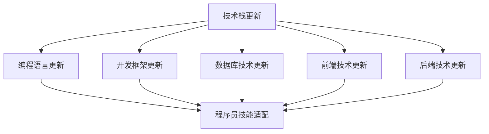

                 

关键词：技术栈更新，程序员，持续学习，技能适配，编程语言演变，框架选择，技术趋势，职业发展

> 摘要：随着技术的发展，程序员面临的技术栈更新速度越来越快。本文旨在探讨程序员如何有效地应对技术栈的快速变化，提升自身竞争力，并在职业生涯中保持持续的成长和进步。

## 1. 背景介绍

在当今快速发展的数字化时代，技术的更新换代如同车轮滚滚向前。从编程语言到开发框架，从数据库技术到云计算，几乎每天都在有新的技术涌现。这种技术栈的快速迭代，对程序员提出了新的挑战。如何在这些变化中找到自己的定位，保持技术竞争力，是每位程序员都需要思考的问题。

技术栈的快速更新不仅带来了新的机遇，也带来了风险。如果不能及时跟上技术潮流，程序员可能会发现自己所掌握的技能变得过时，从而导致职业发展受限。因此，对于程序员来说，如何应对技术栈的快速更新，成为了他们职业生涯中一个不可忽视的课题。

## 2. 核心概念与联系

在探讨如何应对技术栈更新之前，我们首先需要了解几个核心概念：

### 2.1 技术栈

技术栈是指程序员在开发过程中所使用的一系列技术工具和框架的集合。它包括编程语言、开发框架、数据库、前端技术、后端技术等。

### 2.2 技术更新

技术更新是指新技术的出现和旧技术的淘汰。这种更新可以是渐进的，也可以是颠覆性的。例如，从Java 8到Java 11，是一个渐进的更新过程，而从Java到Kotlin，则是一个颠覆性的技术更新。

### 2.3 技术趋势

技术趋势是指一段时间内技术发展的总体方向。例如，近年来，微服务架构、容器化技术、区块链等技术的发展趋势，都对程序员的技术栈提出了新的要求。

下面是一个使用Mermaid绘制的流程图，展示技术栈更新与程序员技能适配的关系：



## 3. 核心算法原理 & 具体操作步骤

### 3.1 算法原理概述

应对技术栈更新的核心算法，可以概括为以下几个步骤：

1. **持续学习**：通过学习新的技术和知识，保持自身的技能水平。
2. **技能评估**：定期评估自身的技术栈，识别需要提升的领域。
3. **实践应用**：通过实际项目或练习，将新技能应用到实际工作中。
4. **社区参与**：参与技术社区，获取最新的技术动态和行业见解。
5. **时间管理**：合理规划时间，确保有足够的时间进行学习和实践。

### 3.2 算法步骤详解

#### 3.2.1 持续学习

持续学习是应对技术栈更新的基础。可以通过以下途径进行学习：

- **在线课程**：参加如Coursera、Udemy等平台上的技术课程。
- **书籍**：阅读最新的技术书籍，如《深度学习》、《微服务设计》等。
- **博客和文档**：关注技术博客和官方文档，了解最新的技术动态和API。

#### 3.2.2 技能评估

定期进行技能评估，可以帮助程序员了解自身的技能水平。可以通过以下方式进行评估：

- **自我评估**：根据自身的工作经验和项目，评估所掌握的技能。
- **在线测评**：参加如GitHub、Stack Overflow等平台上的在线测评。
- **同事反馈**：向同事或导师寻求反馈，了解自身技能的优缺点。

#### 3.2.3 实践应用

将新技能应用到实际工作中，是提升技能水平的有效方法。可以通过以下方式进行实践：

- **项目开发**：参与公司的新项目，尝试使用新技术。
- **个人项目**：自己开发一个小项目，实践新的技术和框架。
- **代码贡献**：为开源项目贡献代码，提升实战经验。

#### 3.2.4 社区参与

参与技术社区，可以帮助程序员了解最新的技术动态和行业趋势。可以通过以下方式进行参与：

- **论坛参与**：在技术论坛上发帖、回复，与他人交流。
- **博客写作**：撰写技术博客，分享自己的经验和见解。
- **会议参加**：参加技术会议，与行业专家交流。

#### 3.2.5 时间管理

合理规划时间，确保有足够的时间进行学习和实践。可以通过以下方式管理时间：

- **时间记录**：记录每天的学习和工作时间，分析时间分配。
- **时间规划**：制定每周的学习计划，确保有足够的时间进行学习。
- **专注提升**：在工作时避免干扰，保持专注。

### 3.3 算法优缺点

**优点**：

- 提升技能水平，保持技术竞争力。
- 适应技术变化，减少职业风险。
- 增强学习能力和解决问题的能力。

**缺点**：

- 需要投入大量时间和精力。
- 初期可能会面临适应困难。
- 需要不断学习和更新知识，可能感到疲劳。

### 3.4 算法应用领域

该算法适用于所有需要不断更新技术的领域，如软件开发、数据分析、人工智能等。尤其是在快速变化的技术行业中，如互联网、金融科技等，该算法具有极高的实用价值。

## 4. 数学模型和公式 & 详细讲解 & 举例说明

在应对技术栈更新时，我们可以借助一些数学模型和公式来指导我们的学习和实践。以下是一个简单的例子：

### 4.1 数学模型构建

假设我们有一个程序员，他需要评估自身的技术栈，并确定下一步的学习方向。我们可以使用以下数学模型：

**技能评分模型**：

$$
S = \frac{A \times \sum_{i=1}^{n} w_i \times S_i}{100}
$$

其中：

- $S$：总技能评分。
- $A$：权重调整系数，用于调整不同技能的重要性。
- $w_i$：第$i$项技能的权重。
- $S_i$：第$i$项技能的评分。

### 4.2 公式推导过程

公式推导过程如下：

1. **确定技能权重**：根据行业标准和自身工作经验，为各项技能分配权重。
2. **评估技能水平**：根据项目经验和学习情况，为各项技能打分。
3. **计算总技能评分**：根据权重和评分，计算总技能评分。
4. **调整权重系数**：根据当前行业趋势和个人发展目标，调整权重系数。

### 4.3 案例分析与讲解

假设有一个程序员，他需要评估自己的技术栈，并确定下一步的学习方向。以下是他的技能评分和权重设置：

| 技能       | 权重 | 评分 |
|------------|------|------|
| Java       | 30%  | 80   |
| JavaScript | 25%  | 75   |
| Python     | 20%  | 70   |
| Kubernetes | 15%  | 65   |
| Golang     | 10%  | 60   |

根据上述表格，我们可以使用公式计算总技能评分：

$$
S = \frac{1 \times (0.3 \times 80 + 0.25 \times 75 + 0.2 \times 70 + 0.15 \times 65 + 0.1 \times 60)}{100} = 73.75
$$

根据总技能评分，程序员可以确定自己需要提升的技能，并制定相应的学习计划。例如，如果他的目标是将总技能评分提升到85分以上，他可能需要重点学习Kubernetes和Golang。

## 5. 项目实践：代码实例和详细解释说明

### 5.1 开发环境搭建

在本项目实践中，我们将使用Python和Flask框架来搭建一个简单的Web应用。以下是开发环境搭建的步骤：

1. 安装Python 3.8或更高版本。
2. 安装虚拟环境工具`virtualenv`。
3. 创建虚拟环境并激活。
4. 安装Flask框架。

```bash
pip install virtualenv
virtualenv myenv
source myenv/bin/activate
pip install flask
```

### 5.2 源代码详细实现

下面是一个简单的Flask应用示例：

```python
from flask import Flask, request, render_template

app = Flask(__name__)

@app.route('/')
def index():
    return 'Hello, World!'

@app.route('/hello', methods=['GET', 'POST'])
def hello():
    if request.method == 'POST':
        name = request.form['name']
        return render_template('hello.html', name=name)
    return render_template('hello.html')

if __name__ == '__main__':
    app.run(debug=True)
```

### 5.3 代码解读与分析

在上面的代码中，我们创建了一个简单的Flask应用，包括两个路由：

1. `/`：返回一个简单的“Hello, World!”消息。
2. `/hello`：处理一个表单提交，并返回一个包含用户名称的HTML页面。

代码的解读如下：

- `Flask`：Flask是一个轻量级的Web应用框架。
- `@app.route`：装饰器，用于定义路由。
- `request`：用于处理HTTP请求。
- `render_template`：用于渲染HTML模板。

### 5.4 运行结果展示

运行上面的代码后，我们可以在浏览器中访问以下URL：

- `http://127.0.0.1:5000/`：显示“Hello, World!”。
- `http://127.0.0.1:5000/hello`：显示一个包含输入框的HTML页面。

当用户在输入框中输入名称并提交时，应用会显示一个包含用户名称的问候语。

## 6. 实际应用场景

在现实世界中，技术栈的快速更新对程序员提出了更高的要求。以下是一些实际应用场景：

- **互联网公司**：互联网公司通常需要快速响应市场变化，因此技术更新速度非常快。程序员需要不断学习新技术，以保持竞争力。
- **金融科技**：金融科技领域对安全性和性能有极高的要求。程序员需要掌握如区块链、加密算法等新技术，以满足行业需求。
- **人工智能**：人工智能领域的发展日新月异。程序员需要不断学习新的算法和框架，如TensorFlow、PyTorch等，以跟上技术趋势。

### 6.4 未来应用展望

随着技术的不断进步，我们可以预见以下趋势：

- **云计算与大数据**：云计算和大数据技术的进一步普及，将推动程序员掌握如Kubernetes、Hadoop等新技术。
- **人工智能与机器学习**：人工智能和机器学习的快速发展，将促使程序员深入学习深度学习、自然语言处理等领域的知识。
- **区块链技术**：区块链技术的发展，将为程序员提供新的职业机会，如智能合约开发、区块链安全等。

## 7. 工具和资源推荐

为了更好地应对技术栈的快速更新，以下是一些建议的工具和资源：

### 7.1 学习资源推荐

- **在线课程**：Coursera、Udemy、edX等平台提供了丰富的编程课程。
- **技术博客**：CSDN、博客园、简书等平台，提供了大量技术博客和教程。
- **官方文档**：各个技术框架和库的官方文档，是学习新技术的重要资源。

### 7.2 开发工具推荐

- **集成开发环境（IDE）**：Visual Studio Code、PyCharm、Eclipse等，提供了强大的代码编辑和调试功能。
- **版本控制**：Git、GitHub、GitLab等，用于代码管理和协作开发。
- **云服务**：AWS、Azure、Google Cloud等，提供了丰富的云计算服务。

### 7.3 相关论文推荐

- **《深度学习》**：Goodfellow、Bengio、Courville所著，是深度学习领域的经典教材。
- **《微服务设计》**：Christoph、Gray所著，是微服务架构的优秀参考书。
- **《大话区块链》**：韩志伟所著，通俗易懂地介绍了区块链的基本原理和应用场景。

## 8. 总结：未来发展趋势与挑战

在技术栈快速更新的时代，程序员面临着前所未有的挑战和机遇。未来，随着云计算、人工智能、区块链等技术的进一步发展，程序员需要不断学习新的技术和知识，以适应不断变化的技术环境。

### 8.1 研究成果总结

本文探讨了程序员如何应对技术栈快速更新的问题，提出了持续学习、技能评估、实践应用、社区参与和时间管理等核心算法步骤，并结合实际案例进行了详细讲解。

### 8.2 未来发展趋势

未来，技术栈的更新速度将继续加快，云计算、人工智能、区块链等领域将更加重要。程序员需要关注这些技术趋势，并提前进行学习和准备。

### 8.3 面临的挑战

- **技能更新压力大**：程序员需要不断学习新的技术和知识。
- **时间管理困难**：需要在工作和生活之间找到平衡，确保有足够的时间进行学习和实践。
- **适应新技术困难**：新的技术和框架可能会带来学习曲线。

### 8.4 研究展望

未来的研究可以进一步探讨如何更高效地学习和应用新技术，以及如何利用人工智能等先进技术来辅助程序员的技术更新。

## 9. 附录：常见问题与解答

### 9.1 如何平衡工作和学习？

**解答**：合理规划时间，确保有足够的时间进行学习和实践。可以设定每周的学习计划，将学习时间分散到每天的工作中。

### 9.2 技术更新太快，感觉跟不上怎么办？

**解答**：关注行业动态，定期进行技能评估，识别出需要提升的领域，然后集中时间和精力进行学习。

### 9.3 如何选择适合自己的学习资源？

**解答**：根据自己的兴趣和需求，选择合适的在线课程、书籍和博客。同时，可以参考同行和专家的意见，选择高质量的学习资源。

----------------------------------------------------------------

以上是本文的完整内容。希望通过本文，读者能够更好地应对技术栈的快速更新，提升自身的技术竞争力，在职业生涯中取得更好的成就。**作者：禅与计算机程序设计艺术 / Zen and the Art of Computer Programming**。

