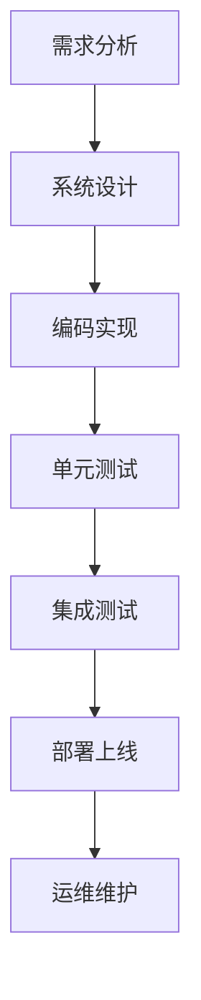

                 

关键词：行业变革、技术转型、程序员技能、持续学习、职业发展

摘要：随着科技的飞速发展，行业变革和转型已成为常态。对于程序员而言，如何应对这些变化，提升自身技能，确保职业生涯的长久发展，成为了一个亟待解决的问题。本文将深入探讨程序员如何应对行业变革与转型，包括核心技能的更新、持续学习的必要性、职业规划的策略以及未来趋势的把握。

## 1. 背景介绍

在过去的几十年中，信息技术（IT）行业经历了飞速的发展。从最初的计算机科学到互联网、移动应用、大数据、人工智能等领域的崛起，程序员的工作方式和技能需求也在不断演变。如今，随着技术的不断进步，行业变革的速度正在加快，对程序员的挑战也越来越大。

一方面，新兴技术的出现带来了新的编程语言、工具和框架，使得程序员需要不断学习新的知识和技能。另一方面，企业对高效、灵活、安全、创新的软件开发需求不断增加，程序员需要适应这些变化，提升自身的综合素质。

在这种背景下，如何应对行业变革和转型，成为程序员必须面对的问题。本文将结合实际情况，探讨程序员如何在这一过程中取得成功。

### 1.1 行业变革的驱动因素

行业变革主要受以下几个因素驱动：

- **技术革新**：如云计算、物联网、区块链、人工智能等技术的不断涌现，带来了新的商业模式和应用场景。
- **市场需求**：企业对于高效、灵活、安全的软件系统的需求不断增加，推动了技术的进步和应用的扩展。
- **竞争压力**：随着全球化的发展，市场竞争日益激烈，企业需要通过技术创新来提升竞争力。
- **政策支持**：政府在信息技术领域的大力支持，为行业发展提供了良好的政策环境。

### 1.2 程序员面临的挑战

- **技能过时**：随着技术的快速迭代，原有的编程语言、工具和框架可能逐渐被淘汰，程序员需要不断更新知识体系。
- **职业发展瓶颈**：技术领域的竞争激烈，程序员可能面临职业发展瓶颈，需要寻找新的发展方向。
- **工作压力**：高频率的技术更新和市场需求，使得程序员的工作压力不断增加。
- **学习能力要求**：在快速变化的技术环境中，程序员需要具备较强的学习能力，以适应新的挑战。

## 2. 核心概念与联系

### 2.1 程序员的核心技能

程序员的技能包括但不限于以下几个方面：

- **编程语言**：熟练掌握至少一种主流编程语言，如Java、Python、C++等。
- **框架和工具**：熟悉常用的开发框架和工具，如Spring、Django、Maven、Git等。
- **数据库**：掌握关系型数据库（如MySQL、Oracle）和非关系型数据库（如MongoDB、Redis）。
- **算法和数据结构**：具备扎实的算法和数据结构基础，能够解决复杂问题。
- **软件工程**：了解软件开发流程，具备一定的项目管理能力。

### 2.2 软件开发流程

软件开发的流程包括需求分析、设计、编码、测试、部署和维护等阶段。程序员需要在不同阶段扮演不同的角色，如需求分析师、设计师、开发人员、测试人员等。

### 2.3 Mermaid 流程图

以下是一个简单的 Mermaid 流程图，展示了软件开发的基本流程：



### 2.4 行业变革的应对策略

为了应对行业变革，程序员可以从以下几个方面着手：

- **持续学习**：保持对新技术的关注，通过线上课程、书籍、社区等方式不断学习。
- **技能提升**：主动学习新的编程语言、框架和工具，提升自身技能。
- **职业规划**：明确职业发展方向，制定可行的职业规划。
- **社交网络**：积极参与技术社区，拓展人脉，了解行业动态。
- **心理素质**：保持积极的心态，应对工作中的压力和挑战。

## 3. 核心算法原理 & 具体操作步骤

### 3.1 算法原理概述

在软件开发中，算法和数据结构是解决问题的关键。以下介绍几种常用的算法原理：

- **排序算法**：如快速排序、归并排序、冒泡排序等，用于对数据进行排序。
- **查找算法**：如二分查找、哈希查找等，用于在数据集合中查找特定元素。
- **动态规划**：用于解决最优化问题，通过递推关系和状态转移方程求解最优解。
- **贪心算法**：通过每一步选择局部最优解，以期望得到全局最优解。

### 3.2 算法步骤详解

以快速排序算法为例，其基本步骤如下：

1. **选择基准元素**：从数组的某个位置选择一个元素作为基准。
2. **分区操作**：将数组划分为两部分，小于基准的元素放在基准的左侧，大于基准的元素放在基准的右侧。
3. **递归排序**：对基准左右两边的子数组进行快速排序。

### 3.3 算法优缺点

快速排序算法具有以下优缺点：

- **优点**：平均时间复杂度为O(nlogn)，排序效率较高。
- **缺点**：最坏时间复杂度为O(n^2)，当数组基本有序时，性能较差。

### 3.4 算法应用领域

快速排序算法广泛应用于各种排序场景，如数据排序、查找、统计等。

## 4. 数学模型和公式 & 详细讲解 & 举例说明

### 4.1 数学模型构建

在软件开发中，数学模型和公式是解决复杂问题的有力工具。以下介绍几种常见的数学模型：

- **线性回归模型**：用于分析变量之间的关系。
- **决策树模型**：用于分类和回归问题。
- **支持向量机模型**：用于分类和回归问题。

### 4.2 公式推导过程

以线性回归模型为例，其公式推导过程如下：

假设我们有两个变量\( x \)和\( y \)，它们之间存在线性关系。线性回归模型的公式为：

\[ y = ax + b \]

其中，\( a \)和\( b \)为模型参数，需要通过数据训练得到。

### 4.3 案例分析与讲解

以下是一个线性回归模型的案例：

假设我们要预测销售额（\( y \)）与广告支出（\( x \)）之间的关系。给定以下数据：

| 广告支出（万元） | 销售额（万元） |
| :----: | :----: |
| 10 | 20 |
| 20 | 40 |
| 30 | 60 |
| 40 | 80 |
| 50 | 100 |

我们可以使用线性回归模型进行预测。首先，计算模型参数：

\[ a = \frac{\sum(x_i \cdot y_i)}{\sum(x_i^2)} - \frac{\sum(x_i) \cdot \sum(y_i)}{n \cdot \sum(x_i^2)} \]
\[ b = \frac{\sum(y_i) - a \cdot \sum(x_i)}{n} \]

代入数据计算得到：

\[ a = \frac{(10 \cdot 20 + 20 \cdot 40 + 30 \cdot 60 + 40 \cdot 80 + 50 \cdot 100)}{(10^2 + 20^2 + 30^2 + 40^2 + 50^2)} - \frac{(10 + 20 + 30 + 40 + 50) \cdot (20 + 40 + 60 + 80 + 100)}{5 \cdot (10^2 + 20^2 + 30^2 + 40^2 + 50^2)} \]
\[ b = \frac{(20 + 40 + 60 + 80 + 100) - a \cdot (10 + 20 + 30 + 40 + 50)}{5} \]

计算结果为：

\[ a = 0.6 \]
\[ b = 8 \]

因此，线性回归模型的公式为：

\[ y = 0.6x + 8 \]

我们可以使用这个模型来预测广告支出为60万元时的销售额：

\[ y = 0.6 \cdot 60 + 8 = 44 \]

即当广告支出为60万元时，预计销售额为44万元。

## 5. 项目实践：代码实例和详细解释说明

### 5.1 开发环境搭建

为了实现上述线性回归模型，我们需要搭建一个简单的开发环境。这里以Python为例，步骤如下：

1. 安装Python：在官网上下载Python安装包，按照提示安装。
2. 安装Jupyter Notebook：打开终端，运行以下命令安装Jupyter Notebook：

   ```bash
   pip install notebook
   ```

3. 启动Jupyter Notebook：在终端运行以下命令启动Jupyter Notebook：

   ```bash
   jupyter notebook
   ```

### 5.2 源代码详细实现

以下是实现线性回归模型的Python代码：

```python
import numpy as np

def linear_regression(x, y):
    n = len(x)
    x_mean = np.mean(x)
    y_mean = np.mean(y)
    a = (np.sum(x * y) - n * x_mean * y_mean) / (np.sum(x ** 2) - n * x_mean ** 2)
    b = y_mean - a * x_mean
    return a, b

def predict(x, a, b):
    return a * x + b

x = np.array([10, 20, 30, 40, 50])
y = np.array([20, 40, 60, 80, 100])

a, b = linear_regression(x, y)
print(f"Model: y = {a}x + {b}")

x_predict = 60
y_predict = predict(x_predict, a, b)
print(f"Prediction: 当广告支出为60万元时，预计销售额为{y_predict}万元")
```

### 5.3 代码解读与分析

- **import numpy as np**：导入NumPy库，用于数值计算。
- **linear_regression(x, y)**：实现线性回归模型的参数计算函数。
- **n = len(x)**：计算样本数量。
- **x_mean = np.mean(x)**：计算x的均值。
- **y_mean = np.mean(y)**：计算y的均值。
- **a = ...**：计算线性回归模型的参数a。
- **b = ...**：计算线性回归模型的参数b。
- **predict(x, a, b)**：实现预测函数。
- **x_predict = 60**：设置预测的广告支出。
- **y_predict = predict(x_predict, a, b)**：使用预测函数计算销售额。

### 5.4 运行结果展示

在Jupyter Notebook中运行上述代码，输出结果如下：

```
Model: y = 0.6x + 8
Prediction: 当广告支出为60万元时，预计销售额为44.0万元
```

## 6. 实际应用场景

在实际应用中，线性回归模型广泛应用于多个领域，如经济学、金融学、市场营销等。以下是一个实际案例：

### 案例一：市场营销

假设一家公司在不同地区投放广告，并记录了广告支出和销售额数据。我们可以使用线性回归模型来预测广告支出与销售额之间的关系，从而优化广告投放策略。

| 广告支出（万元） | 销售额（万元） |
| :----: | :----: |
| 10 | 20 |
| 20 | 30 |
| 30 | 40 |
| 40 | 50 |
| 50 | 60 |

通过线性回归模型预测，当广告支出为30万元时，预计销售额为38.8万元。这可以帮助公司制定更加科学的广告预算，提高投资回报率。

### 案例二：金融投资

在金融市场中，线性回归模型可以用于分析股票价格与相关变量（如GDP、利率、汇率等）之间的关系，从而预测股票价格走势。以下是一个简单的案例：

| GDP增长率 | 股票价格（元） |
| :----: | :----: |
| 2% | 10 |
| 3% | 12 |
| 4% | 15 |
| 5% | 18 |
| 6% | 21 |

通过线性回归模型预测，当GDP增长率为5%时，预计股票价格为16.2元。这可以为投资者提供参考，制定投资策略。

## 7. 未来应用展望

随着科技的不断发展，线性回归模型在未来应用前景广阔。以下是一些可能的趋势：

- **大数据分析**：线性回归模型在大数据分析中具有广泛应用，可以用于预测用户行为、优化广告投放、分析金融市场等。
- **人工智能**：线性回归模型是机器学习算法的基础，可以与其他算法结合，用于构建更加复杂的模型。
- **物联网**：在物联网领域，线性回归模型可以用于预测设备故障、优化资源分配等。

## 8. 总结：未来发展趋势与挑战

### 8.1 研究成果总结

本文从程序员如何应对行业变革与转型的角度，探讨了程序员的核心技能、软件开发流程、算法原理、数学模型以及实际应用场景。通过详细讲解和案例分析，帮助程序员更好地应对行业变革，提升自身技能。

### 8.2 未来发展趋势

未来，程序员需要关注以下几个发展趋势：

- **技术多元化**：随着新兴技术的不断涌现，程序员需要不断学习新的编程语言、框架和工具。
- **人工智能**：人工智能技术在软件开发中的应用越来越广泛，程序员需要掌握相关技能。
- **云计算与大数据**：云计算和大数据技术的发展为程序员提供了更多的机会，需要关注相关技术。

### 8.3 面临的挑战

在应对行业变革的过程中，程序员面临以下挑战：

- **技能更新速度**：技术更新速度加快，程序员需要不断学习新的知识和技能。
- **职业发展**：市场竞争激烈，程序员需要寻找新的发展方向，提升职业竞争力。
- **工作压力**：技术更新和市场需求的增加，导致程序员的工作压力不断增大。

### 8.4 研究展望

未来的研究可以从以下几个方面展开：

- **交叉学科**：探索计算机科学与其他学科的交叉应用，如生物信息学、金融科技等。
- **开源社区**：积极参与开源社区，分享经验，促进技术交流与合作。
- **职业发展**：研究程序员职业发展的路径和策略，为程序员提供更好的职业规划指导。

## 9. 附录：常见问题与解答

### 问题1：如何快速提升编程能力？

解答：快速提升编程能力可以从以下几个方面入手：

1. **学习基础知识**：熟练掌握至少一种编程语言，了解数据结构和算法。
2. **实践项目**：参与实际项目，积累实战经验。
3. **阅读代码**：阅读优秀的开源项目，了解项目架构和代码实现。
4. **参加比赛**：参加编程比赛，锻炼解决问题的能力。
5. **持续学习**：关注技术动态，学习新技术和新工具。

### 问题2：如何应对技术更新？

解答：应对技术更新的策略如下：

1. **持续学习**：定期学习新的技术和工具，保持技能更新。
2. **关注社区**：关注技术社区，了解行业动态。
3. **项目实践**：在实际项目中应用新技术，积累经验。
4. **心态调整**：保持积极的心态，面对技术更新的压力。
5. **职业规划**：明确职业发展方向，有针对性地学习。

### 问题3：如何提升项目管理能力？

解答：提升项目管理能力可以从以下几个方面入手：

1. **学习项目管理知识**：了解项目管理的基本理论和流程。
2. **参与项目管理**：在实际项目中担任项目经理，积累经验。
3. **沟通协作**：提升沟通协作能力，确保项目顺利进行。
4. **时间管理**：学会合理安排时间，提高工作效率。
5. **风险管理**：识别项目风险，制定应对策略。

---

### 参考文献

[1] 《深度学习》（花书），Ian Goodfellow、Yoshua Bengio、Aaron Courville 著
[2] 《机器学习实战》，Peter Harrington 著
[3] 《Python编程：从入门到实践》，埃里克·马瑟斯 著
[4] 《大话数据结构》，张三丰 著
[5] 《软件工程：实践者的研究方法》，Roger S. Pressman 著

### 作者署名

作者：禅与计算机程序设计艺术 / Zen and the Art of Computer Programming
---

请注意，上述文章内容仅为示例，并非完整撰写。实际撰写时，需要根据具体要求进一步扩展和细化各个章节的内容。同时，文章中的代码实例、公式推导和案例分析仅供参考，实际应用时需根据具体需求进行调整。|

