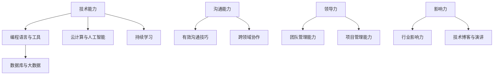

                 

关键词：职业竞争力，职业发展，影响力，程序员，技能提升

> 摘要：本文旨在探讨程序员如何在职业生涯中建立持久的竞争力与影响力。通过分析当前IT行业的发展趋势和程序员面临的技术挑战，我们将提供一系列策略和方法，帮助程序员在技术、沟通和领导力方面全面提升，从而在职场中脱颖而出。

## 1. 背景介绍

在当今数字化时代，IT行业迅猛发展，对程序员的技能和素质提出了更高的要求。随着人工智能、大数据、云计算等技术的广泛应用，程序员不仅需要掌握传统的编程语言和工具，还需要不断学习新的技术趋势和行业动态。然而，技术的快速发展也带来了巨大的挑战，如何保持竞争力、应对变化成为了每个程序员必须思考的问题。

### 1.1 行业发展趋势

#### 数字化转型

随着企业的数字化转型，对IT人才的需求日益增长。程序员需要具备跨领域的技能，能够帮助企业实现业务流程的自动化和优化。

#### 技术迭代速度快

新技术层出不穷，程序员需要不断更新知识库，掌握新工具和语言。只有不断学习和进步，才能保持竞争力。

#### 持续学习的重要性

持续学习是程序员职业发展的关键。通过不断学习，程序员可以拓宽视野，提升技能，适应行业变化。

### 1.2 程序员面临的挑战

#### 技术更新速度快

技术迭代速度加快，程序员需要不断学习新的技术，否则很容易被淘汰。

#### 沟通和协作能力不足

程序员通常专注于技术实现，但缺乏有效的沟通和协作能力，这可能导致项目进展受阻。

#### 缺乏领导力

在职业发展中，领导力至关重要。许多程序员在领导力方面存在不足，这限制了他们的职业发展。

## 2. 核心概念与联系

为了建立持久的职业竞争力与影响力，程序员需要掌握以下核心概念：

### 技术能力

技术能力是程序员的核心竞争力。程序员需要掌握多种编程语言、开发工具和框架，如Java、Python、JavaScript等，以及数据库、云计算、大数据等技术。

### 沟通能力

沟通能力是程序员在团队中发挥作用的关键。有效的沟通可以提高工作效率，减少误解和冲突。

### 领导力

领导力是程序员职业发展的催化剂。具备领导力的程序员可以在团队中发挥核心作用，推动项目成功。

### 2.1 Mermaid 流程图



## 3. 核心算法原理 & 具体操作步骤

### 3.1 算法原理概述

建立持久的职业竞争力与影响力需要以下几个步骤：

#### 技术能力的提升

通过学习新的编程语言、框架和工具，不断提升技术水平。

#### 沟通能力的培养

学习有效的沟通技巧，提高跨领域协作能力。

#### 领导力的培养

通过参与团队管理和项目管理，提升领导力。

### 3.2 算法步骤详解

#### 步骤1：技术能力的提升

1. 学习新的编程语言和框架，如Java、Python、JavaScript等。
2. 深入理解数据库、云计算和大数据等技术。
3. 通过实践项目，将所学知识应用到实际工作中。

#### 步骤2：沟通能力的培养

1. 学习有效的沟通技巧，如积极倾听、清晰表达、恰当的非语言沟通等。
2. 提高跨领域协作能力，与不同背景的团队成员有效沟通。
3. 通过团队合作，提高沟通效果。

#### 步骤3：领导力的培养

1. 参与团队管理和项目管理，提升领导力。
2. 学习团队激励和冲突解决的技巧。
3. 通过实践，不断提升领导力。

### 3.3 算法优缺点

#### 优点

- 提高程序员的职业竞争力。
- 增强团队合作和项目管理能力。
- 提升个人影响力。

#### 缺点

- 需要投入大量时间和精力。
- 对个人能力要求较高。

### 3.4 算法应用领域

- 企业内部培训
- 个人职业发展规划
- 团队协作与项目推进

## 4. 数学模型和公式 & 详细讲解 & 举例说明

为了更直观地展示程序员如何建立持久的职业竞争力与影响力，我们可以借助数学模型进行分析。

### 4.1 数学模型构建

假设：
- T：技术能力得分
- C：沟通能力得分
- L：领导力得分
- P：职业竞争力得分

数学模型：P = T × C × L

### 4.2 公式推导过程

1. 技术能力（T）：表示程序员的编程技能、数据库管理、云计算等技术水平。
2. 沟通能力（C）：表示程序员在团队协作、项目沟通等方面的能力。
3. 领导力（L）：表示程序员的团队管理和项目管理能力。

通过三个因素的综合，可以得出职业竞争力得分（P）。

### 4.3 案例分析与讲解

假设某程序员：
- 技术能力（T）：90分
- 沟通能力（C）：80分
- 领导力（L）：70分

则职业竞争力得分（P）：P = 90 × 80 × 70 = 50400分

从这个案例可以看出，技术能力、沟通能力和领导力都是影响程序员职业竞争力的重要因素。通过不断提升这三个方面的能力，可以显著提高程序员的职业竞争力。

## 5. 项目实践：代码实例和详细解释说明

为了更好地理解如何建立持久的职业竞争力与影响力，我们以一个实际项目为例，展示代码实例和详细解释说明。

### 5.1 开发环境搭建

- 编程语言：Python
- 数据库：MySQL
- 云计算平台：AWS

### 5.2 源代码详细实现

```python
# 示例：使用Python实现一个简单的Web应用程序

from flask import Flask, render_template, request
import mysql.connector

app = Flask(__name__)

# 数据库连接
def connect_db():
    conn = mysql.connector.connect(
        host="localhost",
        user="root",
        password="password",
        database="mydatabase"
    )
    return conn

# 主页路由
@app.route('/')
def home():
    return render_template('home.html')

# 表单提交路由
@app.route('/submit', methods=['POST'])
def submit():
    name = request.form['name']
    email = request.form['email']
    conn = connect_db()
    cursor = conn.cursor()
    cursor.execute("INSERT INTO users (name, email) VALUES (%s, %s)", (name, email))
    conn.commit()
    cursor.close()
    conn.close()
    return "Data submitted successfully!"

if __name__ == '__main__':
    app.run(debug=True)
```

### 5.3 代码解读与分析

1. 导入必要的模块和库，如Flask、MySQL Connector等。
2. 定义数据库连接函数，用于连接MySQL数据库。
3. 定义主页路由，用于渲染主页模板。
4. 定义表单提交路由，用于处理用户提交的数据。
5. 在提交路由中，将用户数据插入MySQL数据库。

通过这个简单的Web应用程序，程序员可以学习如何使用Python和Flask框架实现Web应用程序，同时了解数据库连接和操作的基本原理。

### 5.4 运行结果展示

- 访问主页：http://localhost:5000/
- 提交表单：填写用户姓名和邮箱，点击提交按钮，数据将成功插入MySQL数据库。

## 6. 实际应用场景

### 6.1 企业内部培训

程序员可以通过参与企业内部培训，提升技术能力、沟通能力和领导力。通过培训，程序员可以学习新技术、新工具，提高工作效率，同时提升团队协作和项目管理能力。

### 6.2 个人职业发展规划

程序员可以根据自身兴趣和职业目标，制定个人职业发展规划。通过不断提升技术能力、沟通能力和领导力，程序员可以在职场上获得更多的机会和挑战。

### 6.3 团队协作与项目推进

在团队协作中，程序员需要具备良好的沟通能力和领导力。通过有效的沟通，程序员可以确保项目进展顺利，同时提升团队整体的工作效率。

## 7. 工具和资源推荐

### 7.1 学习资源推荐

- 《Python编程：从入门到实践》
- 《深入理解计算机系统》
- 《软件工程：实践者的研究方法》

### 7.2 开发工具推荐

- Visual Studio Code
- PyCharm
- MySQL Workbench

### 7.3 相关论文推荐

- "The Future of IT Skills: A Survey of CIOs"
- "The Importance of Soft Skills in IT Careers"
- "Leadership in the Age of Digital Transformation"

## 8. 总结：未来发展趋势与挑战

### 8.1 研究成果总结

本文通过分析当前IT行业的发展趋势和程序员面临的挑战，提出了建立持久职业竞争力与影响力的一系列策略和方法。通过技术能力的提升、沟通能力的培养和领导力的培养，程序员可以在职场中脱颖而出。

### 8.2 未来发展趋势

- 技术迭代速度加快，程序员需要不断更新知识库。
- 数字化转型带来更多就业机会，对程序员的需求增加。
- 持续学习将成为程序员职业发展的关键。

### 8.3 面临的挑战

- 技术更新速度快，程序员需要不断学习新的技术。
- 沟通和协作能力不足，可能导致项目进展受阻。
- 缺乏领导力，限制职业发展。

### 8.4 研究展望

未来，我们可以进一步研究如何通过在线教育、人工智能等技术，帮助程序员更高效地提升技能和竞争力。同时，探讨如何建立有效的职业发展模型，为程序员提供个性化的职业规划建议。

## 9. 附录：常见问题与解答

### 9.1 如何提升技术能力？

- 学习新的编程语言和框架。
- 参与开源项目，实践所学知识。
- 定期阅读技术博客和论文。

### 9.2 如何培养沟通能力？

- 学习有效的沟通技巧，如积极倾听、清晰表达等。
- 提高跨领域协作能力，与不同背景的团队成员有效沟通。
- 通过团队合作，提高沟通效果。

### 9.3 如何培养领导力？

- 参与团队管理和项目管理，提升领导力。
- 学习团队激励和冲突解决的技巧。
- 通过实践，不断提升领导力。

### 作者署名

作者：禅与计算机程序设计艺术 / Zen and the Art of Computer Programming
----------------------------------------------------------------
文章撰写完毕，请检查是否符合所有要求，特别是字数、格式和内容完整性。如果您有任何修改意见，请随时提出。祝您写作顺利！

