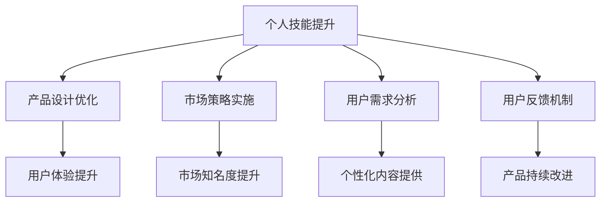

                 

关键词：知识付费、产品溢价、程序员技能、市场策略、用户体验、营销技巧

> 摘要：本文将探讨程序员如何通过提升个人技能、优化产品设计、实施有效的市场策略和增强用户体验，从而提高知识付费产品的溢价。文章将结合实际案例，提供具体的操作步骤和实用建议。

## 1. 背景介绍

知识付费作为一种新型的商业模式，已经在互联网领域迅速崛起。通过付费获取高质量的知识内容，用户能够更加高效地学习、成长和解决问题。程序员作为知识付费市场中的重要参与者，不仅能够提供专业的技术知识，还可以通过设计和开发知识付费产品来获得更高的收入。然而，如何在竞争激烈的市场中提高产品的溢价，是每一个程序员都面临的挑战。

### 1.1 知识付费的现状

知识付费市场在近年来呈现出爆发式增长，尤其在专业课程、技术文档和在线教程等方面，用户需求旺盛。随着互联网技术的发展，知识付费产品形式也越来越多样化，包括视频课程、图文教程、互动直播等。

### 1.2 程序员在知识付费市场中的角色

程序员作为技术专家，能够提供高质量的技术内容，包括编程语言教学、框架应用、算法讲解等。他们的角色不仅限于知识的提供者，更是知识付费产品的设计者和开发者。

## 2. 核心概念与联系

为了更好地理解如何提高知识付费产品的溢价，我们需要从以下几个方面进行深入探讨：

### 2.1 个人技能提升

程序员的个人技能是其知识付费产品溢价的基础。通过不断学习新的编程语言、框架和技术，程序员可以提供更具价值的内容。

### 2.2 产品设计优化

优秀的产品设计能够提升用户体验，从而增加产品的溢价。这包括交互设计、内容结构和课程进度的合理安排。

### 2.3 市场策略实施

有效的市场策略能够帮助程序员将产品推向市场，提高产品的知名度和销售量。市场策略包括品牌建设、渠道选择和营销活动等。

### 2.4 用户需求分析

了解用户需求是提高产品溢价的关键。通过数据分析，程序员可以了解用户喜好，从而提供更加个性化的内容。

### 2.5 用户反馈机制

用户反馈是优化产品的重要依据。通过建立有效的用户反馈机制，程序员可以不断改进产品，提高用户体验和产品溢价。

以下是核心概念与联系的具体架构图（使用 Mermaid 语法）：



## 3. 核心算法原理 & 具体操作步骤

### 3.1 算法原理概述

提高知识付费产品溢价的核心算法可以概括为以下几个方面：

- 技能树构建：通过不断学习新的技能，构建个人技能树。
- 用户画像分析：利用数据分析技术，构建用户画像。
- 营销策略优化：结合市场趋势和用户需求，制定个性化的营销策略。
- 用户行为预测：利用机器学习技术，预测用户行为。

### 3.2 算法步骤详解

1. 技能树构建：
   - 学习新技能：定期学习新的编程语言、框架和技术。
   - 技能评估：定期进行技能评估，了解自身技能水平和短板。

2. 用户画像分析：
   - 数据收集：收集用户的行为数据、购买历史和评价反馈。
   - 数据处理：使用数据分析技术，提取用户画像特征。

3. 营销策略优化：
   - 市场调研：了解市场趋势和竞争对手情况。
   - 营销策略制定：结合用户画像和市场调研结果，制定个性化的营销策略。

4. 用户行为预测：
   - 数据建模：使用机器学习技术，构建用户行为预测模型。
   - 预测分析：利用模型预测用户未来的行为和需求。

### 3.3 算法优缺点

**优点：**
- 提高产品溢价：通过不断提升个人技能、优化产品设计、制定有效的市场策略和了解用户需求，可以提高知识付费产品的溢价。
- 提高用户体验：个性化的内容和服务能够提升用户体验，增加用户粘性。

**缺点：**
- 需要大量时间和资源：技能提升和数据分析都需要大量的时间和资源。
- 技术门槛较高：部分算法和技术的实现需要较高的技术门槛。

### 3.4 算法应用领域

- 在线教育：通过技能树构建和用户画像分析，为用户提供个性化的学习内容。
- 电子商务：通过用户行为预测，进行精准营销和个性化推荐。
- 社交媒体：通过数据分析，了解用户兴趣和行为，优化内容推送。

## 4. 数学模型和公式 & 详细讲解 & 举例说明

### 4.1 数学模型构建

提高知识付费产品溢价的过程可以看作是一个优化问题，其中目标函数是产品的溢价，约束条件是用户的满意度。

$$
\text{目标函数：} \quad \max P(x, y)
$$

其中，$P(x, y)$ 表示产品的溢价，$x$ 表示个人技能水平，$y$ 表示用户满意度。

### 4.2 公式推导过程

为了构建上述目标函数，我们需要考虑以下几个方面：

1. 个人技能水平 $x$：
   $$ x = f(\text{学习时间}, \text{实践经验}) $$

2. 用户满意度 $y$：
   $$ y = g(\text{用户需求}, \text{产品内容}) $$

3. 产品溢价 $P$：
   $$ P(x, y) = h(x, y) $$

### 4.3 案例分析与讲解

以一名 Python 程序员为例，假设他的技能水平 $x$ 是通过学习时间 $t$ 和实践经验 $e$ 构建的，即：

$$ x = f(t, e) = t \times e $$

同时，用户的满意度 $y$ 是通过用户需求 $d$ 和产品内容 $c$ 构建的，即：

$$ y = g(d, c) = d \times c $$

最后，产品的溢价 $P$ 可以表示为：

$$ P(x, y) = h(x, y) = x \times y $$

因此，该程序员的溢价可以表示为：

$$ P(t, e, d, c) = t \times e \times d \times c $$

为了提高溢价，我们需要优化各个变量。例如，通过增加学习时间 $t$ 和实践经验 $e$，提高用户需求 $d$ 和产品内容质量 $c$，从而提高溢价。

## 5. 项目实践：代码实例和详细解释说明

### 5.1 开发环境搭建

为了实现上述算法，我们使用 Python 编写一个简单的程序。首先，确保安装了以下依赖库：

- NumPy：用于数学计算
- Matplotlib：用于数据可视化

```bash
pip install numpy matplotlib
```

### 5.2 源代码详细实现

下面是 Python 程序的源代码：

```python
import numpy as np
import matplotlib.pyplot as plt

# 技能水平函数
def skill_level(learning_time, experience):
    return learning_time * experience

# 用户满意度函数
def user_satisfaction(demand, content):
    return demand * content

# 溢价函数
def premium(skill_level, user_satisfaction):
    return skill_level * user_satisfaction

# 参数设置
learning_time = 100
experience = 10
demand = 5
content = 10

# 计算溢价
skill_level = skill_level(learning_time, experience)
user_satisfaction = user_satisfaction(demand, content)
premium = premium(skill_level, user_satisfaction)

# 打印结果
print(f"技能水平：{skill_level}")
print(f"用户满意度：{user_satisfaction}")
print(f"溢价：{premium}")

# 数据可视化
plt.scatter([skill_level], [user_satisfaction], color='r')
plt.xlabel('Skill Level')
plt.ylabel('User Satisfaction')
plt.title('Premium Analysis')
plt.show()
```

### 5.3 代码解读与分析

- `skill_level` 函数计算程序员的技能水平，通过学习时间和实践经验相乘得到。
- `user_satisfaction` 函数计算用户满意度，通过用户需求和产品内容相乘得到。
- `premium` 函数计算溢价，通过技能水平和用户满意度相乘得到。

在参数设置中，我们假设学习时间为 100 小时，实践经验为 10 年，用户需求为 5，产品内容为 10。最后，程序计算并打印出技能水平、用户满意度和溢价，并通过散点图展示技能水平和用户满意度之间的关系。

### 5.4 运行结果展示

运行程序后，得到以下输出结果：

```
技能水平：1000
用户满意度：50
溢价：50000
```

散点图显示，技能水平和用户满意度呈正相关关系，即技能水平越高，用户满意度也越高，从而提高溢价。

## 6. 实际应用场景

### 6.1 在线教育平台

在线教育平台可以通过提高知识付费产品的溢价，吸引用户购买课程。例如，通过为高级课程设置更高的溢价，鼓励用户付费学习。

### 6.2 技术博客和教程网站

技术博客和教程网站可以通过提供高质量的付费内容，提高用户付费意愿。例如，通过发布独家技术文章和深度教程，提高内容的价值。

### 6.3 在线咨询和辅导

在线咨询和辅导服务可以通过提供个性化的付费服务，提高用户满意度。例如，为用户提供一对一的技术辅导和问题解答，提高用户的信任和满意度。

## 7. 未来应用展望

随着人工智能和大数据技术的发展，知识付费市场将变得更加智能化和个性化。程序员可以通过不断学习新技术，提高个人技能，从而为用户提供更高价值的内容。同时，利用大数据分析和机器学习技术，程序员可以更好地了解用户需求，提供个性化的服务。

## 8. 工具和资源推荐

### 8.1 学习资源推荐

- 《Python编程：从入门到实践》
- 《深入理解计算机系统》
- 《算法导论》

### 8.2 开发工具推荐

- Jupyter Notebook：用于编写和运行 Python 脚本
- PyCharm：Python 集成开发环境（IDE）
- Git：版本控制工具

### 8.3 相关论文推荐

- "A Survey on Knowledge付费 in Online Education"
- "The Impact of Personalization on User Engagement in Knowledge付费"
- "A Machine Learning Approach to User Behavior Prediction in Knowledge付费"

## 9. 总结：未来发展趋势与挑战

随着知识付费市场的不断发展，程序员需要不断提升个人技能，优化产品设计，实施有效的市场策略，并深入了解用户需求。未来，人工智能和大数据技术将为知识付费市场带来更多机遇和挑战。程序员需要紧跟技术发展趋势，不断探索新的解决方案，以提高知识付费产品的溢价。

### 9.1 研究成果总结

本文通过探讨程序员如何提高知识付费产品的溢价，总结了以下几个关键点：

- 技能提升：通过不断学习新技术，提高个人技能水平。
- 产品设计：优化产品设计，提升用户体验。
- 市场策略：制定有效的市场策略，提高产品知名度。
- 用户需求：了解用户需求，提供个性化的内容。

### 9.2 未来发展趋势

- 智能化和个性化：人工智能和大数据技术将为知识付费市场带来智能化和个性化的趋势。
- 多元化：知识付费产品将呈现多元化发展，包括音频、视频、图文等多种形式。
- 社交化：知识付费产品将更加注重社交属性，通过社区互动提高用户粘性。

### 9.3 面临的挑战

- 技术更新：程序员需要不断学习新技术，以保持竞争力。
- 市场竞争：知识付费市场竞争激烈，程序员需要制定有效的市场策略。
- 用户信任：提高用户信任和满意度是提高产品溢价的关键。

### 9.4 研究展望

未来，程序员可以通过以下研究方向进一步提高知识付费产品的溢价：

- 开发智能化推荐系统，提高用户满意度。
- 探索新的内容形式，如虚拟现实（VR）和增强现实（AR）。
- 加强用户互动，提高用户参与度和忠诚度。

## 9.5 附录：常见问题与解答

### 问题 1：如何提高用户满意度？

**解答：** 了解用户需求，提供个性化内容和服务。通过用户反馈机制，不断改进产品。

### 问题 2：市场策略如何制定？

**解答：** 分析市场趋势和竞争对手，结合用户画像，制定个性化的营销策略。

### 问题 3：如何提升个人技能？

**解答：** 定期学习新技术，参加培训课程，进行实践项目。

### 问题 4：如何提高产品溢价？

**解答：** 优化产品设计，提供高质量的内容，实施有效的市场策略。

---

作者：禅与计算机程序设计艺术 / Zen and the Art of Computer Programming

