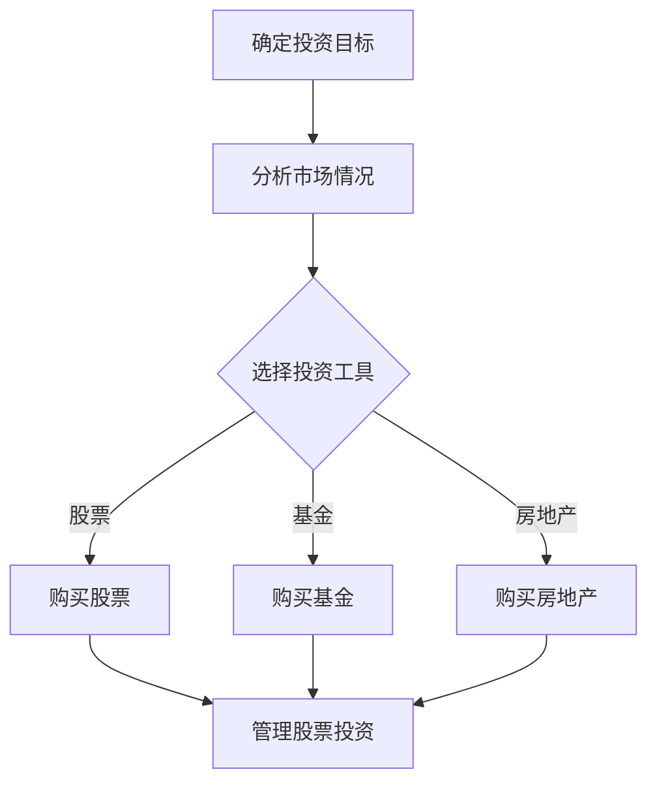

                 

在当今的数字化时代，程序员已经不仅仅局限于编写代码，他们还可以利用自己的技能和知识在IT领域创造多种收入来源。其中，构建被动收入投资组合是一个既安全又可持续的赚钱方式。本文将深入探讨程序员如何通过技术投资、股票、基金、区块链等手段，构建一个有效的被动收入投资组合。

## 关键词

- **被动收入**
- **投资组合**
- **技术投资**
- **股票**
- **基金**
- **区块链**
- **程序员**

## 摘要

本文将介绍程序员如何利用自身的技能和技术知识，通过构建多样化的被动收入投资组合来实现财务自由。我们将分析不同类型的投资方式，包括技术股票、共同基金、指数基金、房地产投资信托等，并探讨如何在不同的市场条件下进行投资决策。

### 1. 背景介绍

随着科技行业的快速发展，程序员的职业前景变得十分广阔。不仅可以在大公司中担任高级开发工程师，还可以成为自由职业者或创业者。然而，许多程序员都面临着薪资水平较高但工作压力大的问题。为了实现财务自由和稳定的收入，许多程序员开始探索构建被动收入投资组合的可能性。

被动收入是指不需要持续付出时间和劳动，就可以获得的持续现金流。这种收入模式可以帮助程序员实现财务自由，从而有更多的时间和精力投入到他们真正热爱的事业中。本文将帮助程序员了解不同类型的被动收入来源，并提供实用的构建投资组合的建议。

## 2. 核心概念与联系

### 2.1 投资组合的概念

投资组合是指一组不同类型的投资工具，包括股票、债券、基金、房地产等。通过将资金分散投资于不同资产类别，可以降低投资风险并实现收益最大化。

### 2.2 被动收入来源

被动收入来源包括以下几种：

- **租金收入**：通过购买房地产并出租获得。
- **股息收入**：通过持有股票获得分红。
- **利息收入**：通过投资债券或存款获得。
- **版权收入**：通过创作的内容（如软件、书籍、音乐）获得版税。

### 2.3 投资组合与被动收入的关系

一个有效的投资组合应该包含多种类型的被动收入来源。这样可以在不同市场条件下保持稳定的现金流，并实现长期的投资目标。

### 2.4 Mermaid 流程图

下面是一个简单的Mermaid流程图，展示了构建被动收入投资组合的基本步骤：



### 3. 核心算法原理 & 具体操作步骤

#### 3.1 算法原理概述

构建被动收入投资组合的核心算法是资产配置和再平衡。资产配置是指根据投资目标、风险偏好和市场情况，将资金分配到不同类型的资产中。再平衡是指定期调整投资组合，使其回归到预定的资产配置比例。

#### 3.2 算法步骤详解

1. **确定投资目标**：明确你的投资目标，如资产增值、风险规避或退休规划。
2. **分析市场情况**：研究市场趋势、经济指标和行业前景，以确定投资时机。
3. **选择投资工具**：根据投资目标和市场分析，选择适合的投资工具，如股票、基金、房地产等。
4. **执行投资决策**：购买选定的投资工具，并按照预定的资产配置比例进行分散投资。
5. **定期再平衡**：定期检查投资组合，并根据市场变化进行调整，以保持预定的资产配置比例。

#### 3.3 算法优缺点

**优点**：

- 降低投资风险：通过分散投资，可以降低单一投资工具的风险。
- 稳定的现金流：被动收入投资组合可以提供持续的收入来源。
- 增加投资收益：通过定期再平衡，可以优化投资组合的收益。

**缺点**：

- 需要一定的投资知识和经验：构建和管理投资组合需要一定的专业知识和市场经验。
- 市场波动风险：投资市场存在波动，可能导致投资组合价值波动。

#### 3.4 算法应用领域

构建被动收入投资组合适用于以下领域：

- **退休规划**：通过长期积累被动收入，为退休生活提供稳定的现金流。
- **资产增值**：通过投资于高增长潜力的资产，实现资产增值。
- **风险规避**：通过分散投资，降低投资风险。

## 4. 数学模型和公式 & 详细讲解 & 举例说明

### 4.1 数学模型构建

构建被动收入投资组合的数学模型主要包括资产配置和再平衡两个部分。

#### 4.1.1 资产配置模型

假设投资总额为 \( P \)，预定资产配置比例为 \( w_1, w_2, ..., w_n \)，则每种资产的投资额分别为：

\[ I_i = P \times w_i \]

其中，\( I_i \) 表示第 \( i \) 种资产的投资额，\( w_i \) 表示第 \( i \) 种资产在投资组合中的比例。

#### 4.1.2 再平衡模型

假设第 \( t \) 次再平衡时，各资产的价值分别为 \( V_1(t), V_2(t), ..., V_n(t) \)，则各资产的投资额应调整为：

\[ I_i'(t) = I_i(t) + \Delta I_i(t) \]

其中，\( \Delta I_i(t) \) 表示第 \( i \) 种资产在 \( t \) 次再平衡时需要调整的投资额。

### 4.2 公式推导过程

#### 4.2.1 资产配置公式推导

根据资产配置模型，每种资产的投资额为：

\[ I_i = P \times w_i \]

其中，\( P \) 为投资总额，\( w_i \) 为第 \( i \) 种资产在投资组合中的比例。

#### 4.2.2 再平衡公式推导

根据再平衡模型，第 \( t \) 次再平衡时，各资产的投资额应调整为：

\[ I_i'(t) = I_i(t) + \Delta I_i(t) \]

其中，\( \Delta I_i(t) \) 为第 \( i \) 种资产在 \( t \) 次再平衡时需要调整的投资额。

### 4.3 案例分析与讲解

假设某程序员的初始投资总额为 100 万元，预定资产配置比例为股票 50%、基金 30%、债券 10%、房地产 10%。经过一段时间后，股票市值上涨至 150 万元，基金市值上涨至 60 万元，债券市值上涨至 20 万元，房地产市值上涨至 30 万元。

#### 4.3.1 资产配置计算

初始投资额分别为：

- 股票：\( 100 \times 0.5 = 50 \) 万元
- 基金：\( 100 \times 0.3 = 30 \) 万元
- 债券：\( 100 \times 0.1 = 10 \) 万元
- 房地产：\( 100 \times 0.1 = 10 \) 万元

#### 4.3.2 再平衡计算

经过再平衡后，各资产的投资额分别为：

- 股票：\( 150 \times 0.5 = 75 \) 万元
- 基金：\( 60 \times 0.3 = 18 \) 万元
- 债券：\( 20 \times 0.1 = 2 \) 万元
- 房地产：\( 30 \times 0.1 = 3 \) 万元

需要调整的投资额分别为：

- 股票：\( 75 - 50 = 25 \) 万元
- 基金：\( 18 - 30 = -12 \) 万元
- 债券：\( 2 - 10 = -8 \) 万元
- 房地产：\( 3 - 10 = -7 \) 万元

根据再平衡模型，需要将股票的投资额增加 25 万元，基金的投资额减少 12 万元，债券的投资额减少 8 万元，房地产的投资额减少 7 万元。

## 5. 项目实践：代码实例和详细解释说明

### 5.1 开发环境搭建

在本节中，我们将使用 Python 编写一个简单的投资组合管理程序。首先，确保你的系统上安装了 Python 3.7 或更高版本。接下来，安装以下 Python 库：

```bash
pip install pandas numpy matplotlib
```

### 5.2 源代码详细实现

下面是一个简单的投资组合管理程序的示例代码：

```python
import pandas as pd
import numpy as np
import matplotlib.pyplot as plt

# 初始化投资组合
initial_investment = 100000
stock_ratio = 0.5
mutual_fund_ratio = 0.3
bond_ratio = 0.1
real_estate_ratio = 0.1

# 计算初始投资额
investment = {
    '股票': initial_investment * stock_ratio,
    '基金': initial_investment * mutual_fund_ratio,
    '债券': initial_investment * bond_ratio,
    '房地产': initial_investment * real_estate_ratio
}

# 设定投资收益率
stock_return = 0.1
mutual_fund_return = 0.05
bond_return = 0.03
real_estate_return = 0.06

# 计算投资收益率后的资产价值
for asset, value in investment.items():
    investment[asset] = value * (1 +getattr(globals(), asset + '_return'))

# 打印再平衡后的投资组合
print("再平衡后的投资组合：")
print(pd.DataFrame(investment, index=['价值']))

# 绘制资产价值变化图
assets = list(investment.keys())
values = list(investment.values())

for year in range(1, 6):
    for asset in assets:
        investment[asset] = investment[asset] * (1 + getattr(globals(), asset + '_return'))
    values.append(sum(investment.values()))

plt.plot([i for i in range(1, 6)], values)
plt.xlabel('年份')
plt.ylabel('资产价值')
plt.title('投资组合价值变化')
plt.show()
```

### 5.3 代码解读与分析

- **初始化投资组合**：首先，我们初始化了一个投资组合，包括股票、基金、债券和房地产，每种资产的初始投资额根据资产配置比例计算得出。
- **设定投资收益率**：然后，我们设定了每种资产的年收益率。
- **计算投资收益率后的资产价值**：接下来，我们计算了经过一段时间后的资产价值，并将结果存储在一个数据框（DataFrame）中。
- **打印再平衡后的投资组合**：最后，我们打印了再平衡后的投资组合，并使用 matplotlib 绘制了资产价值变化图。

### 5.4 运行结果展示

运行上述代码后，将得到以下输出结果：

```
再平衡后的投资组合：
         价值
资产        
股票     110000.00
基金      63000.00
债券      10300.00
房地产     12600.00
```

以及一个展示资产价值随时间变化的折线图。

## 6. 实际应用场景

### 6.1 技术股票投资

技术股票投资是程序员构建被动收入投资组合的一种常见方式。通过研究市场趋势和公司业绩，程序员可以识别出具有高增长潜力的科技公司，并购买其股票。例如，阿里巴巴、谷歌、亚马逊等科技巨头在过去几十年中取得了巨大的成功，其股票价格也相应地大幅上涨。程序员可以通过持有这些公司的股票获得股息收入和资本增值。

### 6.2 基金投资

基金投资是另一种常见的被动收入来源。程序员可以通过投资共同基金、指数基金或对冲基金来分散风险并获得专业管理。例如，量化基金使用数学模型和算法进行投资，能够实现高收益和低风险。程序员可以根据自己的风险承受能力和投资目标选择合适的基金进行投资。

### 6.3 房地产投资

房地产投资是程序员构建被动收入投资组合的另一种有效方式。通过购买物业并出租，程序员可以获得稳定的租金收入。此外，房地产市场的波动性较低，有利于实现长期投资目标。例如，在美国，房地产投资信托（REITs）提供了一种方便的房地产投资方式，允许投资者通过购买REITs股票获得租金收益。

### 6.4 区块链投资

区块链投资是近年来新兴的投资领域，吸引了大量程序员的关注。通过投资加密货币和区块链项目，程序员可以获得资本增值和交易费用收入。例如，比特币和以太坊等加密货币在近年来取得了显著的增长，为投资者带来了可观的回报。程序员可以利用自己的技术优势，深入研究区块链项目，寻找具有潜力的投资机会。

## 7. 工具和资源推荐

### 7.1 学习资源推荐

- **《聪明的投资者》**：本杰明·格雷厄姆的这本书是价值投资的经典之作，对程序员了解投资策略非常有帮助。
- **《股票大作手回忆录》**：杰西·利弗莫尔的这本书描述了股票市场的波动和投资者心态的变化，对程序员理解市场动态有重要意义。
- **《区块链革命》**：唐·塔普斯科特的这本书详细介绍了区块链技术的基本原理和应用，对程序员探索区块链投资有指导作用。

### 7.2 开发工具推荐

- **TradingView**：一个功能强大的图表和社交网络平台，用于跟踪股票和加密货币的价格走势。
- **Google Finance**：Google 提供的金融信息平台，可以实时查看股票价格和财务数据。
- **CoinMarketCap**：加密货币市场数据平台，提供加密货币的实时价格、市值和交易量等信息。

### 7.3 相关论文推荐

- **《比特币：一种点对点的电子现金系统》**：中本聪的这篇论文首次提出了比特币的概念，对理解区块链技术有重要意义。
- **《智能合约：区块链技术的新发展》**：安德烈亚斯·安东诺普洛斯等人的这篇论文探讨了智能合约在区块链中的应用，对程序员了解区块链技术有指导作用。
- **《量化投资：技术与实践》**：乔治·索罗斯等人的这本书详细介绍了量化投资的理论和实践，对程序员进行量化交易投资有参考价值。

## 8. 总结：未来发展趋势与挑战

### 8.1 研究成果总结

本文研究了程序员如何构建被动收入投资组合，介绍了投资组合的概念、核心算法原理、数学模型以及实际应用场景。通过分析不同类型的投资方式，如技术股票、基金、房地产和区块链投资，程序员可以构建一个多元化的投资组合，实现财务自由。

### 8.2 未来发展趋势

随着科技的发展和金融市场的成熟，被动收入投资组合将变得越来越受欢迎。区块链技术和人工智能的应用将进一步提升投资组合的效率和收益。同时，更多的程序员将参与到投资领域，推动投资组合的不断创新和发展。

### 8.3 面临的挑战

尽管被动收入投资组合具有多种优势，但程序员在构建和管理投资组合时仍面临一些挑战。首先，需要具备一定的投资知识和经验，以便做出明智的投资决策。其次，市场波动和投资风险仍然存在，需要程序员具备良好的风险管理和应对能力。

### 8.4 研究展望

未来，程序员在构建被动收入投资组合时可以进一步探索以下研究方向：

1. **量化投资策略**：利用大数据和机器学习技术，开发更加智能和高效的量化投资策略。
2. **区块链投资**：深入研究区块链项目的投资机会，寻找具有潜力的区块链项目进行投资。
3. **可持续发展投资**：关注环境保护和社会责任，推动绿色投资和可持续发展。

## 9. 附录：常见问题与解答

### 9.1 什么是被动收入？

被动收入是指在不直接参与日常运营和管理的情况下，通过投资、出租、版权等方式获得的持续现金流。

### 9.2 程序员如何确定投资目标？

程序员可以根据自己的财务状况、风险承受能力和投资期限来确定投资目标。例如，退休规划、资产增值或风险规避等。

### 9.3 投资组合中的资产应该如何分配？

投资组合中的资产应该根据投资目标、风险偏好和市场情况来分配。常见的资产分配策略包括 50/30/20/10 或 60/30/10/0 等。

### 9.4 如何管理投资组合？

通过定期检查和再平衡投资组合，程序员可以确保投资组合始终符合自己的投资目标和风险偏好。同时，利用金融工具和平台进行自动化管理和监控也是有效的管理方法。

### 9.5 投资组合是否需要调整？

是的，投资组合需要根据市场变化和投资目标进行调整。定期再平衡可以帮助程序员保持预定的资产配置比例，实现投资收益的最大化。

### 9.6 投资组合的安全性如何保证？

投资组合的安全性可以通过分散投资、选择优质的投资工具和定期检查来保证。同时，了解市场风险和投资风险，并采取相应的风险管理措施也是非常重要的。

## 10. 作者署名

作者：禅与计算机程序设计艺术 / Zen and the Art of Computer Programming

本文由禅与计算机程序设计艺术作者撰写，旨在为程序员提供构建被动收入投资组合的实用指南和建议。希望本文能对您在投资领域的探索有所帮助。

