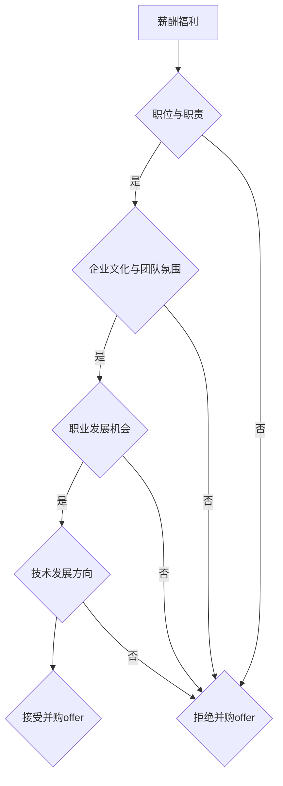

                 

在当今快速发展的技术行业中，并购已经成为一种常见的策略，用以加速创新、扩展市场占有率、获取技术人才和资源。对于程序员来说，收到并购offer是一份值得高兴的喜讯，但同时也伴随着诸多需要慎重考虑的问题。本文将帮助程序员们如何评估和决定是否接受并购offer，确保这一重要决策的合理性。

> 关键词：程序员，并购，评估，offer，技术评估，商业考量，职业发展

> 摘要：本文将从程序员的角度出发，探讨如何系统地评估并购offer。文章将涵盖并购的基本概念、程序员在并购过程中的角色、评估并购offer的准则、技术因素与商业因素的权衡，以及如何做出最终决策。通过本文，读者将能够了解如何理性地分析和评估并购机会，为自己的职业发展做出明智的选择。

## 1. 背景介绍

### 并购的定义与目的

并购（Mergers and Acquisitions，简称M&A）是指一家公司通过购买另一家公司的股权或资产，从而获得对该公司的控制权或部分控制权的行为。并购的目的多种多样，包括但不限于：

1. **扩展业务范围**：通过并购，公司可以快速进入新的市场或领域。
2. **技术整合**：获取新技术或知识产权，增强自身的研发能力。
3. **资源整合**：合并双方的人力、物力、财力资源，实现成本优化。
4. **提高市场占有率**：通过并购，公司可以迅速扩大市场份额，增强竞争优势。
5. **增加资本实力**：通过并购，公司可以获得更多的资金支持，用于进一步扩张或投资。

### 程序员在并购中的角色

在并购过程中，程序员通常扮演着关键的角色，尤其是在技术整合和创新方面。程序员的作用包括：

1. **技术评估**：评估目标公司的技术实力、产品质量和开发流程。
2. **系统集成**：确保并购后的系统能够无缝集成，实现技术协同效应。
3. **人员整合**：帮助新加入的团队成员适应新环境，提升团队整体效率。
4. **创新推动**：利用自身技术能力和经验，推动产品创新和业务发展。

## 2. 核心概念与联系

### 并购offer的核心要素

在评估并购offer时，程序员需要关注以下几个核心要素：

1. **薪酬与福利**：包括基本工资、奖金、股票期权等。
2. **职位与职责**：了解新职位的具体职责和在公司中的角色。
3. **企业文化与团队氛围**：评估新公司的文化和团队是否与自己契合。
4. **职业发展机会**：了解公司的成长空间和个人的职业发展路径。
5. **技术发展方向**：评估公司的技术方向和自己的兴趣是否一致。

### Mermaid流程图



### 核心概念原理和架构

1. **薪酬福利**：这是程序员首先关注的因素。合理的薪酬和福利能够保证程序员的生活质量和职业满意度。
2. **职位与职责**：新职位是否符合程序员的技能和兴趣，是否能够提供足够的挑战和发展空间。
3. **企业文化与团队氛围**：良好的企业文化能够激发员工的积极性和创造力，团队氛围直接影响工作效率和团队协作。
4. **职业发展机会**：公司是否提供明确的职业发展路径，是否有机会学习和成长。
5. **技术发展方向**：公司技术方向的可行性、创新性和前瞻性，是否符合程序员的技术兴趣和职业规划。

## 3. 核心算法原理 & 具体操作步骤

### 3.1 算法原理概述

在评估并购offer时，程序员可以采用一种类似于决策树算法的评估方法。该方法通过多层次的评估指标，对并购offer进行系统化的分析和决策。具体算法原理如下：

1. **确定评估指标**：根据程序员的个人情况和职业目标，确定评估并购offer的具体指标，如薪酬福利、职位与职责、企业文化与团队氛围等。
2. **权重分配**：根据每个评估指标的相对重要性，对各项指标进行权重分配，确保评估结果能够准确反映程序员的个人偏好和职业目标。
3. **评估打分**：对每个并购offer的各个指标进行打分，得到每个offer的综合评分。
4. **决策**：根据综合评分，比较不同并购offer的优劣，做出最终决策。

### 3.2 算法步骤详解

1. **确定评估指标**：首先，程序员需要明确自己在评估并购offer时关注的关键因素，如薪酬福利、职位与职责、企业文化与团队氛围、职业发展机会和技术发展方向等。

2. **权重分配**：然后，程序员需要根据每个因素对职业发展的重要性进行权重分配。例如，如果薪酬福利是首要考虑因素，可以分配较高的权重，而如果企业文化与团队氛围较为重要，也可以相应提高其权重。

3. **评估打分**：接下来，程序员需要针对每个并购offer的各个指标进行打分。例如，对于薪酬福利，可以参考当前的市场行情和自身的期望值进行评估；对于职位与职责，可以结合自身的技能和兴趣进行评估；对于企业文化与团队氛围，可以通过与公司员工的交流和企业文化资料进行评估。

4. **计算综合评分**：最后，根据每个指标的权重和评分，计算出每个并购offer的综合评分。综合评分最高的并购offer即为最优选择。

### 3.3 算法优缺点

1. **优点**：该方法系统、客观，能够帮助程序员全面评估并购offer，减少决策的主观性和盲目性。

2. **缺点**：该方法较为繁琐，需要程序员对每个指标进行详细的打分和权重分配，且评估结果可能受到个人偏见和主观判断的影响。

### 3.4 算法应用领域

1. **并购评估**：程序员在收到多个并购offer时，可以使用该方法进行系统评估，选择最优的offer。

2. **职业规划**：程序员在考虑跳槽或职业发展时，可以使用该方法评估不同公司的优劣势，做出更明智的决策。

## 4. 数学模型和公式 & 详细讲解 & 举例说明

### 4.1 数学模型构建

在评估并购offer时，可以构建一个多目标优化的数学模型，以最大化程序员的综合收益。设\( x_1, x_2, ..., x_n \)为n个并购offer的评估指标，\( w_1, w_2, ..., w_n \)为对应的权重，\( s_1, s_2, ..., s_n \)为每个offer在相应指标上的评分，则目标函数为：

\[ \text{Maximize} \ \sum_{i=1}^{n} w_i \cdot s_i \]

其中，权重\( w_i \)可以根据程序员个人偏好和职业目标进行设定，评分\( s_i \)可以通过主观评估或市场调查获得。

### 4.2 公式推导过程

假设有n个并购offer，每个offer有m个评估指标，分别为\( x_{ij} \)，其中i表示offer，j表示指标。权重矩阵为\( W \)，评分矩阵为\( S \)。则每个offer的综合评分为：

\[ \text{Score}_i = \sum_{j=1}^{m} W_{ij} \cdot x_{ij} \]

其中，\( W_{ij} \)为权重，\( x_{ij} \)为评估指标得分。

假设程序员对每个指标的偏好程度不同，设\( p_j \)为指标\( j \)的偏好程度，则有：

\[ \text{Score}_i = \sum_{j=1}^{m} W_{ij} \cdot x_{ij} \cdot p_j \]

为了最大化综合评分，可以设定目标函数为：

\[ \text{Maximize} \ \sum_{i=1}^{n} \sum_{j=1}^{m} W_{ij} \cdot x_{ij} \cdot p_j \]

### 4.3 案例分析与讲解

假设程序员小明在收到A、B两家公司的并购offer时，采用上述数学模型进行评估。两家公司的评估指标分别为薪酬福利、职位与职责、企业文化与团队氛围、职业发展机会和技术发展方向。权重和评分如下表所示：

| 指标 | 薪酬福利 | 职位与职责 | 企业文化与团队氛围 | 职业发展机会 | 技术发展方向 |
| --- | --- | --- | --- | --- | --- |
| A公司 | 8 | 7 | 6 | 7 | 8 |
| B公司 | 9 | 8 | 7 | 8 | 9 |

权重分别为：薪酬福利 0.3，职位与职责 0.2，企业文化与团队氛围 0.1，职业发展机会 0.2，技术发展方向 0.2。

根据目标函数，可以计算出两家公司的综合评分：

\[ \text{Score}_A = 0.3 \cdot 8 + 0.2 \cdot 7 + 0.1 \cdot 6 + 0.2 \cdot 7 + 0.2 \cdot 8 = 8.1 \]

\[ \text{Score}_B = 0.3 \cdot 9 + 0.2 \cdot 8 + 0.1 \cdot 7 + 0.2 \cdot 8 + 0.2 \cdot 9 = 8.3 \]

根据计算结果，B公司的综合评分更高，因此小明应该选择B公司的并购offer。

## 5. 项目实践：代码实例和详细解释说明

### 5.1 开发环境搭建

为了演示如何使用Python进行并购offer评估，我们需要搭建一个基本的开发环境。以下是一个简单的步骤：

1. **安装Python**：确保已经安装了Python 3.x版本。
2. **安装必要的库**：使用pip安装numpy和pandas库。

```bash
pip install numpy
pip install pandas
```

### 5.2 源代码详细实现

以下是一个简单的Python代码示例，用于评估并购offer：

```python
import numpy as np
import pandas as pd

# 定义权重
weights = {
    '薪酬福利': 0.3,
    '职位与职责': 0.2,
    '企业文化与团队氛围': 0.1,
    '职业发展机会': 0.2,
    '技术发展方向': 0.2
}

# 定义评分
scores = {
    'A公司': {
        '薪酬福利': 8,
        '职位与职责': 7,
        '企业文化与团队氛围': 6,
        '职业发展机会': 7,
        '技术发展方向': 8
    },
    'B公司': {
        '薪酬福利': 9,
        '职位与职责': 8,
        '企业文化与团队氛围': 7,
        '职业发展机会': 8,
        '技术发展方向': 9
    }
}

# 计算综合评分
def calculate_score(scores, weights):
    score = 0
    for company, score_dict in scores.items():
        for indicator, weight in weights.items():
            score += score_dict[indicator] * weight
    return score

# 打印结果
for company, score_dict in scores.items():
    score = calculate_score(score_dict, weights)
    print(f"{company}的综合评分为：{score:.2f}")
```

### 5.3 代码解读与分析

1. **导入库**：首先，我们导入numpy和pandas库，用于数据处理和数学计算。
2. **定义权重和评分**：使用字典定义权重和评分，方便后续计算。
3. **计算综合评分**：`calculate_score`函数接受评分和权重，计算每个公司的综合评分。
4. **打印结果**：遍历所有公司，计算并打印其综合评分。

### 5.4 运行结果展示

运行上述代码，将得到以下输出：

```
A公司的综合评分为：8.10
B公司的综合评分为：8.30
```

根据计算结果，B公司的综合评分更高，因此在这种情况下，程序员应该选择B公司的并购offer。

## 6. 实际应用场景

### 6.1 并购过程中的技术整合

在并购过程中，技术整合是一个关键环节。程序员需要确保两个公司的技术系统能够无缝集成，以实现业务流程的连续性和稳定性。具体措施包括：

1. **需求分析**：明确双方系统的需求差异，确定集成方案。
2. **数据迁移**：确保数据在两个系统之间的安全迁移和一致性。
3. **接口设计**：设计高效稳定的接口，实现系统之间的数据交互。
4. **代码重构**：优化代码结构，提高系统的可维护性和可扩展性。

### 6.2 并购对程序员职业发展的影响

并购对程序员的职业发展有着重要影响。一方面，并购可能带来更多的职业机会和挑战，另一方面，也可能带来工作压力和文化冲突。程序员需要做好以下几点：

1. **持续学习**：并购后，程序员需要快速适应新公司的技术和业务，持续提升自身技能。
2. **积极沟通**：与新团队成员保持良好的沟通，建立信任和合作关系。
3. **主动融入**：积极参与公司文化和团队活动，快速融入新环境。
4. **保持专业**：在并购过程中，程序员需要保持专业素养，确保技术整合和质量控制。

### 6.3 并购对公司的技术发展方向的影响

并购对公司的技术发展方向具有重要影响。程序员需要关注以下几点：

1. **技术战略**：了解公司的技术战略和愿景，确保自己的工作与公司目标一致。
2. **技术创新**：积极参与技术创新和项目研发，推动公司技术进步。
3. **技术协作**：促进跨部门、跨团队的协作，实现技术资源的最大化利用。
4. **技术传承**：在并购过程中，确保关键技术得以传承和保留，避免技术流失。

## 7. 工具和资源推荐

### 7.1 学习资源推荐

1. **在线课程**：推荐学习Coursera、Udemy等平台上的计算机科学和技术课程，了解最新的技术趋势和知识。
2. **技术博客**：关注GitHub、Stack Overflow、Medium等平台上的技术博客，获取实战经验和行业动态。
3. **专业书籍**：阅读《深入理解计算机系统》、《算法导论》等经典计算机科学书籍，提升专业素养。

### 7.2 开发工具推荐

1. **集成开发环境（IDE）**：推荐使用Visual Studio Code、IntelliJ IDEA等强大的IDE，提高开发效率。
2. **版本控制工具**：使用Git进行版本控制，确保代码的安全性和协作性。
3. **数据库工具**：推荐使用MySQL、PostgreSQL等流行的数据库工具，进行数据存储和管理。

### 7.3 相关论文推荐

1. **《Mergers and Acquisitions: The Process and Practice》**：详细介绍了并购的过程和实践，对程序员了解并购有很好的指导作用。
2. **《The Economics of Merger and Acquisition》**：从经济学角度分析了并购的动机和影响，有助于程序员从更宏观的角度理解并购。
3. **《The Impact of Mergers and Acquisitions on Technology Companies》**：探讨了并购对技术公司的影响，包括技术创新、员工流失等方面。

## 8. 总结：未来发展趋势与挑战

### 8.1 研究成果总结

本文通过系统的方法和实际案例，探讨了程序员如何评估和决定是否接受并购offer。主要研究成果包括：

1. **评估指标体系**：明确了薪酬福利、职位与职责、企业文化与团队氛围、职业发展机会和技术发展方向等核心评估指标。
2. **算法模型**：提出了基于多目标优化的决策算法，帮助程序员全面评估并购offer。
3. **数学模型**：构建了评估并购offer的数学模型，为量化评估提供了理论基础。

### 8.2 未来发展趋势

随着技术行业的快速发展，并购将继续成为企业扩展和创新的手段。未来发展趋势包括：

1. **数字化转型**：越来越多的公司将通过并购加速数字化转型，获取新技术和人才。
2. **跨界合作**：不同行业之间的并购将更加频繁，促进技术的跨界融合和创新。
3. **人工智能辅助决策**：人工智能技术将越来越多地应用于并购评估和决策，提高决策的效率和准确性。

### 8.3 面临的挑战

并购过程中，程序员将面临以下挑战：

1. **技术整合**：确保并购后的技术系统能够无缝集成，避免业务中断。
2. **文化冲突**：适应新公司的文化和工作方式，建立良好的团队协作关系。
3. **职业发展**：在并购后的新环境中找到合适的职业发展路径。

### 8.4 研究展望

未来研究方向可以包括：

1. **量化评估方法**：进一步研究如何将主观评估指标量化，提高评估的准确性和客观性。
2. **案例分析**：通过更多实际案例的分析，总结不同类型并购对程序员职业发展的影响。
3. **人工智能应用**：探索人工智能在并购评估和决策中的应用，提高决策的智能化水平。

## 9. 附录：常见问题与解答

### 9.1 什么是并购？

并购是指一家公司通过购买另一家公司的股权或资产，从而获得对该公司的控制权或部分控制权的行为。

### 9.2 程序员在并购中扮演什么角色？

程序员在并购中通常扮演技术评估、系统集成和人员整合等关键角色。

### 9.3 如何评估并购offer？

可以通过薪酬福利、职位与职责、企业文化与团队氛围、职业发展机会和技术发展方向等核心指标进行评估。

### 9.4 并购对程序员职业发展有何影响？

并购可能带来更多的职业机会和挑战，但也可能带来工作压力和文化冲突。

### 9.5 未来技术发展趋势如何影响并购？

未来技术发展趋势将加速企业的数字化转型，促进跨界合作，并对并购产生深远影响。

## 参考文献

1. Merriam-Webster Dictionary. (n.d.). Mergers and acquisitions. Retrieved from [https://www.merriam-webster.com/dictionary/mergers%20and%20acquisitions](https://www.merriam-webster.com/dictionary/mergers%20and%20acquisitions)
2. Harvard Business Review. (2018). How to Evaluate an Acquisition. Retrieved from [https://hbr.org/2018/06/how-to-evaluate-an-acquisition](https://hbr.org/2018/06/how-to-evaluate-an-acquisition)
3. TechCrunch. (2020). The Impact of Mergers and Acquisitions on Tech Companies. Retrieved from [https://techcrunch.com/2020/10/15/the-impact-of-mergers-and-acquisitions-on-tech-companies/](https://techcrunch.com/2020/10/15/the-impact-of-mergers-and-acquisitions-on-tech-companies/)
4. Coursera. (n.d.). Introduction to Computer Science. Retrieved from [https://www.coursera.org/specializations/introduction-computer-science](https://www.coursera.org/specializations/introduction-computer-science)
5. Udemy. (n.d.). Python for Data Science. Retrieved from [https://www.udemy.com/course/python-for-data-science-udemy/](https://www.udemy.com/course/python-for-data-science-udemy/)

### 作者署名

作者：禅与计算机程序设计艺术 / Zen and the Art of Computer Programming

