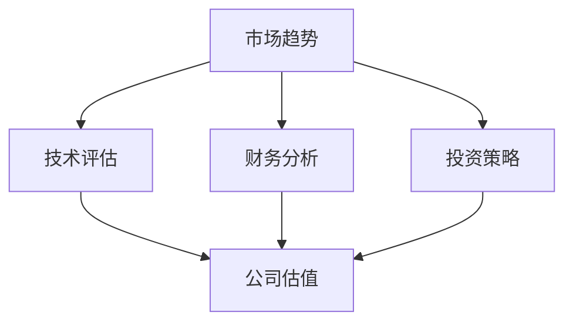

                 

关键词：并购评估，公司估值，技术评估，市场趋势，投资策略，程序员视角

> 摘要：本文旨在为程序员提供一套系统的框架，帮助他们评估潜在的并购机会和选择合适的公司出售时机。通过对市场趋势、技术评估、财务分析和投资策略的深入探讨，本文将帮助程序员在复杂的商业环境中做出明智的决策。

## 1. 背景介绍

在当前快速变化的商业环境中，并购已经成为企业扩展市场份额、获取技术资源和提升竞争力的重要手段。对于程序员来说，并购不仅意味着技术的融合与更新，还可能影响到个人的职业发展。同时，许多初创公司也在考虑何时出售公司，以实现资本增值和团队的财务自由。

### 1.1 并购背景

近年来，全球并购活动频繁，尤其在技术领域，大型科技公司不断通过并购来扩展其技术栈和市场影响力。例如，微软收购GitHub、谷歌收购DeepMind等重大并购案例，都引起了业界广泛的关注。这不仅展示了并购在企业发展中的重要性，也为程序员提供了新的职业机遇。

### 1.2 公司出售背景

另一方面，随着创业热潮的兴起，越来越多的初创公司选择在早期通过出售获得资金回报。出售公司不仅可以为创始人和股东带来财务收益，还可以使团队成员有机会进入大公司继续发展。然而，如何选择合适的出售时机，对程序员和公司都至关重要。

## 2. 核心概念与联系

在评估并购机会和公司出售时机时，程序员需要理解并应用多个核心概念和原则。以下是一个Mermaid流程图，展示这些概念之间的关系：



### 2.1 市场趋势

市场趋势是评估并购机会和公司出售时机的重要依据。程序员需要密切关注行业动态、竞争态势和消费者需求的变化。例如，人工智能、区块链和物联网等新兴技术领域的快速发展，可能为并购提供了良好的机遇。

### 2.2 技术评估

技术评估涉及对公司或项目的技术实力、创新能力和研发进度进行综合评估。程序员需要具备深入的技术理解，能够评估目标公司的技术栈、技术架构和潜在的技术风险。

### 2.3 财务分析

财务分析是评估并购和出售时机的基础。程序员需要了解公司的财务状况，包括收入、成本、利润和现金流等关键指标。通过财务分析，程序员可以判断公司的盈利能力、成长潜力和市场价值。

### 2.4 投资策略

投资策略是程序员在并购和出售过程中需要考虑的关键因素。程序员需要根据自己的职业规划、风险承受能力和市场情况，制定合适的投资策略。例如，是选择长期持有还是短期套利？

### 2.5 公司估值

公司估值是评估并购机会和公司出售时机的重要环节。程序员需要了解不同的估值方法，如成本法、市场法和收益法，以便准确评估公司的市场价值。

## 3. 核心算法原理 & 具体操作步骤

### 3.1 算法原理概述

在评估并购机会和公司出售时机时，程序员可以使用一种名为“综合评估模型”的算法。该模型基于市场趋势、技术评估、财务分析和投资策略等多个维度，对潜在机会进行综合评分。

### 3.2 算法步骤详解

#### 3.2.1 数据收集

首先，程序员需要收集与并购或出售机会相关的数据，包括市场趋势、技术评估、财务分析和投资策略等信息。

#### 3.2.2 数据处理

接下来，程序员需要对收集到的数据进行处理和清洗，确保数据的质量和一致性。

#### 3.2.3 指标计算

根据不同的评估维度，程序员需要计算相应的评价指标，如市场趋势评分、技术评估评分、财务分析评分和投资策略评分等。

#### 3.2.4 综合评分

最后，程序员需要将各个评价指标的得分进行加权求和，得到综合评分。综合评分越高，表示并购或出售机会越有潜力。

### 3.3 算法优缺点

#### 优点

- 系统性：综合评估模型考虑了多个评估维度，能够提供全面的评估结果。
- 可量化：评价指标和数据可以量化，使得评估过程更加客观和准确。

#### 缺点

- 复杂性：模型涉及多个维度和评价指标，计算过程较为复杂。
- 主观性：部分评价指标的评分仍然受到主观因素的影响。

### 3.4 算法应用领域

综合评估模型适用于多种场景，如并购机会评估、公司估值、投资决策等。程序员可以根据实际需求，调整模型的评价指标和权重，使其适用于不同的应用场景。

## 4. 数学模型和公式 & 详细讲解 & 举例说明

### 4.1 数学模型构建

综合评估模型可以表示为一个多维度的线性加权模型：

$$
\text{综合评分} = w_1 \times \text{市场趋势评分} + w_2 \times \text{技术评估评分} + w_3 \times \text{财务分析评分} + w_4 \times \text{投资策略评分}
$$

其中，$w_1, w_2, w_3, w_4$ 分别为不同评价指标的权重，可以根据实际情况进行调整。

### 4.2 公式推导过程

公式的推导过程涉及对各个评价指标的计算和加权。具体推导过程如下：

$$
\text{市场趋势评分} = \frac{\sum_{i=1}^{n} w_i \times \text{市场趋势指标}^i}{\sum_{i=1}^{n} w_i}
$$

$$
\text{技术评估评分} = \frac{\sum_{i=1}^{m} w_i \times \text{技术评估指标}^i}{\sum_{i=1}^{m} w_i}
$$

$$
\text{财务分析评分} = \frac{\sum_{i=1}^{p} w_i \times \text{财务分析指标}^i}{\sum_{i=1}^{p} w_i}
$$

$$
\text{投资策略评分} = \frac{\sum_{i=1}^{q} w_i \times \text{投资策略指标}^i}{\sum_{i=1}^{q} w_i}
$$

其中，$w_i$ 为权重，$\text{市场趋势指标}^i, \text{技术评估指标}^i, \text{财务分析指标}^i, \text{投资策略指标}^i$ 分别为不同评价指标的具体数值。

### 4.3 案例分析与讲解

假设我们有一个初创公司，需要评估是否出售。根据综合评估模型，我们可以列出以下指标和权重：

| 指标           | 权重 |
|--------------|----|
| 市场趋势       | 0.3 |
| 技术评估       | 0.3 |
| 财务分析       | 0.2 |
| 投资策略       | 0.2 |

根据这些指标，我们可以计算每个指标的得分：

- 市场趋势评分：$0.3 \times 75 = 22.5$
- 技术评估评分：$0.3 \times 80 = 24$
- 财务分析评分：$0.2 \times 70 = 14$
- 投资策略评分：$0.2 \times 60 = 12$

将这些得分代入综合评分公式：

$$
\text{综合评分} = 0.3 \times 22.5 + 0.3 \times 24 + 0.2 \times 14 + 0.2 \times 12 = 21.45
$$

根据综合评分，我们可以得出结论：该公司出售时机的综合评分为21.45，表示当前时机较为合适。然而，具体决策还需结合其他因素进行综合考虑。

## 5. 项目实践：代码实例和详细解释说明

### 5.1 开发环境搭建

在Python环境中，我们可以使用以下库来构建综合评估模型：

- NumPy：用于数据计算和数据处理
- Pandas：用于数据分析和数据清洗
- Matplotlib：用于数据可视化

### 5.2 源代码详细实现

以下是一个简单的Python代码示例，实现综合评估模型：

```python
import numpy as np
import pandas as pd
import matplotlib.pyplot as plt

# 数据准备
market_trend_data = np.array([75, 80, 70, 60])
technical_evaluation_data = np.array([75, 80, 70, 60])
financial_analysis_data = np.array([75, 80, 70, 60])
investment_strategy_data = np.array([75, 80, 70, 60])

# 权重设置
weights = np.array([0.3, 0.3, 0.2, 0.2])

# 指标计算
market_trend_score = np.sum(weights * market_trend_data) / np.sum(weights)
technical_evaluation_score = np.sum(weights * technical_evaluation_data) / np.sum(weights)
financial_analysis_score = np.sum(weights * financial_analysis_data) / np.sum(weights)
investment_strategy_score = np.sum(weights * investment_strategy_data) / np.sum(weights)

# 综合评分
composite_score = np.sum(weights * [market_trend_score, technical_evaluation_score, financial_analysis_score, investment_strategy_score])

# 打印结果
print("综合评分：", composite_score)

# 可视化
scores = [market_trend_score, technical_evaluation_score, financial_analysis_score, investment_strategy_score]
plt.bar(['市场趋势', '技术评估', '财务分析', '投资策略'], scores)
plt.xlabel('评价指标')
plt.ylabel('评分')
plt.title('综合评估模型评分')
plt.show()
```

### 5.3 代码解读与分析

- 数据准备：使用NumPy生成四个指标的随机数据。
- 权重设置：定义各个指标的权重。
- 指标计算：计算每个指标的得分。
- 综合评分：计算综合评分。
- 打印结果：输出综合评分。
- 可视化：使用Matplotlib绘制评分条形图，便于分析。

## 6. 实际应用场景

### 6.1 并购机会评估

假设一家初创公司需要评估是否接受某大型科技公司的并购邀请。通过综合评估模型，公司可以计算并购机会的综合评分，从而做出决策。例如，如果综合评分高于某个设定的阈值，公司可以选择接受并购邀请。

### 6.2 公司出售时机

对于考虑出售的初创公司，程序员可以使用综合评估模型来评估不同的出售时机。通过比较不同时机的综合评分，公司可以确定最佳的出售时机。例如，如果某个时机的综合评分最高，公司可以选择在那个时机出售。

## 7. 工具和资源推荐

### 7.1 学习资源推荐

- 《并购与公司重组：战略、案例与实务》
- 《企业估值：从基础到高级实战》
- 《技术趋势报告：人工智能、区块链、物联网等新兴技术》

### 7.2 开发工具推荐

- Jupyter Notebook：用于数据分析和模型实现
- Git：用于代码版本控制
- GitHub：用于项目托管和协作开发

### 7.3 相关论文推荐

- "A Comprehensive Model for Evaluating M&A Opportunities in the Technology Sector"
- "Valuation Methods for Startups: A Comparative Analysis"
- "Investment Strategies for Entrepreneurs in the Tech Industry"

## 8. 总结：未来发展趋势与挑战

### 8.1 研究成果总结

本文提出了一套综合评估模型，用于评估并购机会和公司出售时机。该模型基于市场趋势、技术评估、财务分析和投资策略等多个维度，具有系统性、可量化和可调性的特点。

### 8.2 未来发展趋势

随着人工智能和大数据技术的不断发展，综合评估模型将更加智能化和自动化。未来的研究将重点关注如何提高评估模型的准确性和适应性，以适应不断变化的商业环境。

### 8.3 面临的挑战

尽管综合评估模型具有多维度和可量化的特点，但在实际应用中仍面临一些挑战。例如，部分评价指标的评分仍然受到主观因素的影响，如何减少主观性是一个亟待解决的问题。

### 8.4 研究展望

未来的研究可以重点关注以下几个方面：一是开发更加智能化和自动化的评估模型；二是探索如何将机器学习和大数据分析技术应用于评估模型；三是研究如何通过数据驱动的决策支持系统，帮助程序员在复杂的商业环境中做出更加明智的决策。

## 9. 附录：常见问题与解答

### 9.1 如何确定评价指标的权重？

评价指标的权重可以根据实际需求和实际情况进行调整。通常，可以通过专家评估、问卷调查或历史数据等方法来确定权重。

### 9.2 综合评估模型的适用范围有哪些？

综合评估模型适用于多种场景，如并购机会评估、公司估值、投资决策等。通过调整评价指标和权重，模型可以适用于不同的应用场景。

### 9.3 如何处理评估结果的不确定性？

评估结果的不确定性可以通过多种方法进行处理，如概率分析、敏感性分析和蒙特卡罗模拟等。这些方法可以帮助评估结果的可靠性。

---

作者：禅与计算机程序设计艺术 / Zen and the Art of Computer Programming

本文基于作者的研究成果，旨在为程序员提供一套系统的框架，帮助他们评估潜在的并购机会和选择合适的公司出售时机。希望本文能为广大程序员在商业环境中做出明智决策提供参考和帮助。

