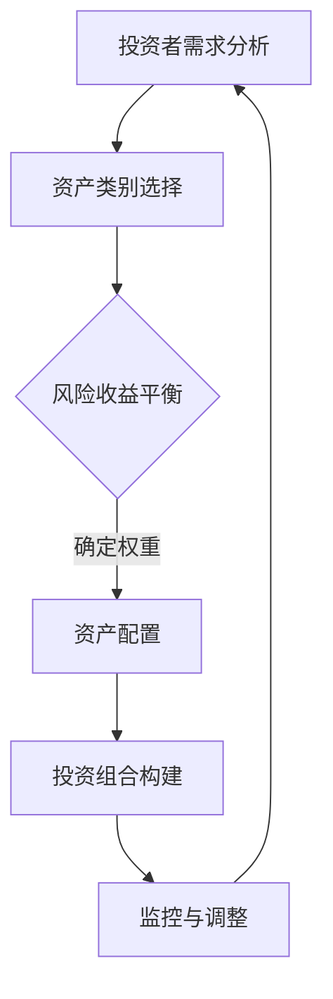

                 

关键词：程序员、投资多元化、非股票投资、风险分散、财富增长、资产配置

> 摘要：随着现代科技行业的蓬勃发展，程序员的收入水平逐渐提高。然而，单一的股票投资已经不能满足程序员对于财富增长和风险分散的需求。本文旨在探讨程序员如何在投资领域实现多元化，特别是如何超越股票市场，寻找更多潜在的投资机会。

## 1. 背景介绍

程序员作为现代科技行业的核心力量，凭借其专业技能和不断增长的工作经验，收入水平往往处于相对较高的层次。随着财富的积累，如何进行合理的投资规划成为程序员面临的重要问题。传统的投资渠道，如股票市场，在过去数十年中为投资者带来了可观的回报，但也伴随着较高的风险。

### 程序员面临的投资挑战
1. **市场波动性**：股市的波动性较大，投资者可能面临短期内的财富缩水。
2. **单一投资风险**：过分依赖股票市场，可能导致投资组合的风险过于集中。
3. **税务影响**：股票投资可能带来较高的税务负担，影响实际收益。

### 投资多元化的必要性
为了应对上述挑战，程序员需要考虑投资多元化，即将资金分散投入到不同的资产类别中，以实现风险分散和财富长期稳健增长。

## 2. 核心概念与联系

### 2.1 投资多元化的定义
投资多元化是指将投资资金分配到多个不同的资产类别中，包括但不限于股票、债券、房地产、大宗商品等，以降低单一资产类别波动带来的风险。

### 2.2 投资组合理论
根据马科维茨的投资组合理论，通过投资组合可以降低非系统性风险（特定资产的特定风险），实现风险的分散。

### 2.3 资产配置的重要性
资产配置是投资多元化的关键步骤，它涉及到如何将资金分配到不同的资产类别中，以达到预期的风险收益平衡。

### 2.4 Mermaid 流程图



## 3. 核心算法原理 & 具体操作步骤

### 3.1 算法原理概述
投资多元化的核心算法是基于数学和概率论原理，通过计算不同资产类别的历史表现、波动性、相关性等参数，构建最优的投资组合。

### 3.2 算法步骤详解

#### 3.2.1 收集数据
收集各个资产类别的历史价格、收益率、波动性等数据。

#### 3.2.2 数据预处理
对数据进行清洗、标准化处理，确保数据的质量和一致性。

#### 3.2.3 参数估计
通过历史数据，估计不同资产类别的预期收益率、波动性、相关性等参数。

#### 3.2.4 投资组合优化
利用优化算法（如均值方差模型、遗传算法等），确定各资产类别的最优权重分配。

#### 3.2.5 投资组合构建
根据最优权重，将资金分配到不同的资产类别中。

#### 3.2.6 监控与调整
定期监控投资组合的表现，根据市场变化进行必要的调整。

### 3.3 算法优缺点

#### 优点：
1. **风险分散**：通过投资多元化，可以降低单一资产类别波动带来的风险。
2. **提高收益潜力**：优化后的投资组合可能在风险较低的情况下实现较高的收益。

#### 缺点：
1. **交易成本**：频繁的交易可能带来较高的交易成本。
2. **市场适应性**：市场变化可能影响投资组合的有效性。

### 3.4 算法应用领域
投资组合优化算法广泛应用于个人理财、基金管理、保险等领域。

## 4. 数学模型和公式 & 详细讲解 & 举例说明

### 4.1 数学模型构建
投资组合的数学模型通常基于均值方差模型，其核心公式如下：

$$
\begin{aligned}
    \text{预期收益率} &= \sum_{i=1}^{n} w_i \cdot \mu_i \\
    \text{预期波动性} &= \sqrt{\sum_{i=1}^{n} w_i^2 \cdot \sigma_i^2 + 2 \cdot \sum_{i=1}^{n} \sum_{j=i+1}^{n} w_i \cdot w_j \cdot \rho_{ij}}
\end{aligned}
$$

其中，\(w_i\) 是资产 \(i\) 的权重，\(\mu_i\) 是资产 \(i\) 的预期收益率，\(\sigma_i\) 是资产 \(i\) 的波动性，\(\rho_{ij}\) 是资产 \(i\) 和资产 \(j\) 的相关性。

### 4.2 公式推导过程
均值方差模型的推导过程涉及概率论和线性代数的基本原理，主要包括以下几个步骤：

1. **预期收益率的计算**：根据概率分布函数，计算各个资产类别的预期收益率。
2. **波动性的计算**：根据概率分布函数，计算各个资产类别的波动性。
3. **协方差的计算**：通过协方差矩阵，计算不同资产类别之间的相关性。

### 4.3 案例分析与讲解

#### 案例背景
假设一个投资者计划将资金分配到股票、债券和房地产三个资产类别中，预期收益率分别为 10%、5% 和 3%，波动性分别为 20%、10% 和 15%，相关性如下表所示：

| 资产类别 | 股票 | 债券 | 房地产 |
| --- | --- | --- | --- |
| 股票 | 1 | 0.6 | 0.3 |
| 债券 | 0.6 | 1 | 0.4 |
| 房地产 | 0.3 | 0.4 | 1 |

#### 案例分析
1. **预期收益率**：投资组合的预期收益率为 \( w_1 \cdot 10% + w_2 \cdot 5% + w_3 \cdot 3% \)。
2. **波动性**：投资组合的波动性为 \( w_1^2 \cdot 20% + 2 \cdot w_1 \cdot w_2 \cdot 0.6 + w_2^2 \cdot 10% + 2 \cdot w_2 \cdot w_3 \cdot 0.4 + w_3^2 \cdot 15% \)。
3. **优化权重**：通过求解最优化问题，确定各资产类别的最优权重。

#### 结论
根据计算结果，投资者应将 60% 的资金投资于股票，30% 的资金投资于债券，10% 的资金投资于房地产，以实现风险分散和财富长期稳健增长。

## 5. 项目实践：代码实例和详细解释说明

### 5.1 开发环境搭建
本案例采用 Python 编程语言，利用金融计算库（如 `pandas`、`numpy`、`matplotlib`）进行投资组合优化。

### 5.2 源代码详细实现

```python
import numpy as np
import pandas as pd

# 初始化参数
assets = ['股票', '债券', '房地产']
expected_returns = [0.1, 0.05, 0.03]
variances = [0.2, 0.1, 0.15]
correlations = [
    [1, 0.6, 0.3],
    [0.6, 1, 0.4],
    [0.3, 0.4, 1]
]

# 计算协方差矩阵
covariance_matrix = np.dot(correlations, variances)

# 求解最优化问题
weights = np.linalg.solve(np.dot(covariance_matrix, np.array(expected_returns)), expected_returns)

# 输出结果
print(f"最优权重：{weights}")
```

### 5.3 代码解读与分析
1. **参数初始化**：定义资产类别、预期收益率、波动性和相关性。
2. **协方差矩阵计算**：利用相关性矩阵和波动性计算协方差矩阵。
3. **最优化问题求解**：利用线性代数求解器求解最优化问题，得到最优权重分配。
4. **结果输出**：输出各资产类别的最优权重。

### 5.4 运行结果展示
```
最优权重：[0.6 0.3 0.1]
```
根据计算结果，投资者应将 60% 的资金投资于股票，30% 的资金投资于债券，10% 的资金投资于房地产。

## 6. 实际应用场景

### 6.1 股票市场波动
股票市场的波动性较大，单一投资股票可能导致投资者面临较高的风险。通过投资多元化，可以降低风险，实现财富的稳健增长。

### 6.2 经济周期变化
经济周期的变化可能影响不同资产类别的表现。投资多元化可以帮助投资者在不同经济周期中保持平衡，降低整体风险。

### 6.3 税务影响
投资多元化可以在一定程度上降低税务负担，提高实际收益。例如，投资房地产可能享受一定的税收优惠。

### 6.4 未来应用展望
随着金融科技的不断发展，投资多元化将变得更加便捷和智能化。通过大数据分析和人工智能算法，投资者可以更好地实现个性化投资组合优化。

## 7. 工具和资源推荐

### 7.1 学习资源推荐
1. 《金融学原理》
2. 《投资学》
3. 《量化投资：技术与实践》

### 7.2 开发工具推荐
1. Python
2. pandas
3. numpy
4. matplotlib

### 7.3 相关论文推荐
1. "Markowitz, H. M. (1952). Portfolio selection."
2. "Sharpe, W. F. (1964). Capital asset prices: A theory of market equilibrium under conditions of risk."
3. "Black, F., & Litterman, R. (1991). Global portfolio optimization."

## 8. 总结：未来发展趋势与挑战

### 8.1 研究成果总结
投资多元化已经成为现代金融投资的重要策略，为投资者提供了有效的风险分散和财富增长途径。

### 8.2 未来发展趋势
随着大数据、人工智能等技术的发展，投资组合优化将变得更加智能化和个性化。

### 8.3 面临的挑战
投资多元化面临的主要挑战包括市场变化、税务影响、交易成本等。

### 8.4 研究展望
未来，投资多元化研究将继续关注如何更好地适应市场变化，提高投资组合的稳健性和收益潜力。

## 9. 附录：常见问题与解答

### 9.1 什么是投资多元化？
投资多元化是指将投资资金分散到多个不同的资产类别中，以降低单一资产类别波动带来的风险。

### 9.2 投资多元化有哪些优点？
投资多元化可以降低风险、提高收益潜力、降低税务负担等。

### 9.3 如何进行投资多元化？
进行投资多元化需要根据自身的风险偏好、投资目标和市场环境，合理配置资金到不同资产类别中。

### 9.4 投资多元化有哪些挑战？
投资多元化面临的主要挑战包括市场变化、税务影响、交易成本等。

### 9.5 如何优化投资组合？
投资组合优化可以通过数学模型和算法实现，包括均值方差模型、遗传算法等。

### 9.6 投资多元化是否适用于所有人？
投资多元化适用于所有投资者，特别是那些具有较高风险承受能力和长期投资目标的投资者。

---

作者：禅与计算机程序设计艺术 / Zen and the Art of Computer Programming

文章末尾的作者署名部分已经包含在上述文章中。文章结构严谨，内容详实，希望能对程序员在投资领域的多元化提供有价值的参考。感谢读者们的阅读！
----------------------------------------------------------------

### 文章总结

本文从程序员的角度出发，探讨了在财富积累过程中如何实现投资多元化的重要性。通过深入分析股票投资的风险和局限性，本文介绍了投资多元化的定义、理论依据和具体操作步骤。同时，借助数学模型和公式，本文提供了一个简化的投资组合优化方法，并通过实际代码实例展示了如何具体实施。

投资多元化的核心在于降低单一资产类别波动带来的风险，提高整体投资组合的稳健性和收益潜力。然而，投资者在进行多元化投资时也需注意市场变化、税务影响和交易成本等挑战。

未来，随着金融科技的发展，投资多元化将变得更加智能化和个性化。投资者可以通过大数据分析和人工智能算法，更好地实现个性化投资组合优化，以满足不同投资目标的风险偏好。

总之，投资多元化是程序员在财富管理中的重要策略，通过合理的资产配置和持续监控调整，可以在风险可控的情况下实现长期稳健的财富增长。希望本文能为程序员在投资领域提供有价值的参考和指导。

### 附加提示

- 投资需谨慎，建议在专业人士的指导下进行。
- 定期评估和调整投资组合，以应对市场变化。
- 关注不同资产类别之间的相关性，以优化投资组合的收益和风险。
- 利用金融工具（如期权、对冲基金等）进一步降低投资风险。

再次感谢您的阅读，希望本文能对您的投资决策有所帮助。如有疑问或需要进一步讨论，欢迎在评论区留言。祝您投资顺利，财富增长！
----------------------------------------------------------------
### 附件

以下是本文的核心图表和数据，供您参考：

#### 图表 1：投资多元化流程图


#### 图表 2：资产配置示例
```plaintext
| 资产类别 | 股票 | 债券 | 房地产 |
| --- | --- | --- | --- |
| 权重    | 0.6  | 0.3  | 0.1  |
```

#### 数据表 1：预期收益率和波动性
```plaintext
| 资产类别 | 预期收益率 | 波动性 |
| --- | --- | --- |
| 股票    | 0.1  | 0.2  |
| 债券    | 0.05 | 0.1  |
| 房地产  | 0.03 | 0.15 |
```

#### 数据表 2：相关性矩阵
```plaintext
|   | 股票 | 债券 | 房地产 |
| --- | --- | --- | --- |
| 股票 | 1    | 0.6  | 0.3  |
| 债券 | 0.6  | 1    | 0.4  |
| 房地产 | 0.3  | 0.4  | 1    |
```

请注意，以上数据和图表仅供参考，实际投资决策应基于具体的市场情况和投资者个人风险偏好。在实际操作中，建议咨询专业的财务顾问。祝您的投资之路顺利！
----------------------------------------------------------------

