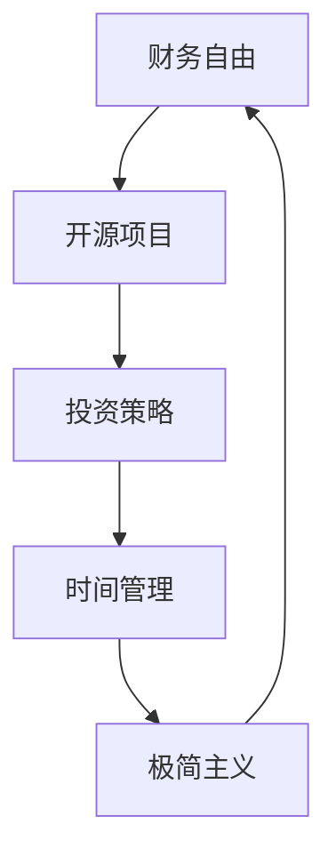

                 

### 关键词 Keyword ###
程序员的财务自由，极简主义，个人理财，投资策略，开源项目，时间管理，生活方式设计，技术领导力

<|assistant|>### 摘要 Abstract ###
在现代IT行业中，程序员的财务自由不仅仅是个人梦想，更是一种理性追求。本文将探讨如何通过极简主义实践实现程序员的财务自由，包括开源项目的财务收益、投资策略、时间管理和生活方式设计等方面。通过具体案例和实用建议，帮助程序员优化财务状况，提高生活质量。

<|assistant|>### 1. 背景介绍 Background ###

在技术飞速发展的今天，程序员作为信息时代的重要推动者，享有相对稳定且高收入的工作。然而，高收入并不意味着财务自由，许多程序员仍然面临着房贷、车贷、子女教育、医疗等压力。财务问题不仅影响生活质量，也可能影响职业发展和个人幸福感。因此，如何实现财务自由，成为许多程序员关注的重要问题。

极简主义作为一种生活方式，强调减少物质消费和关注内在需求，逐渐成为现代生活的新潮流。对于程序员来说，极简主义不仅是减少负担、提高效率的生活方式，更是一种财务规划的手段。通过极简主义实践，程序员可以在有限的时间和资源内，实现更高的财务收益和生活质量。

本文将从开源项目收益、投资策略、时间管理和生活方式设计等方面，探讨如何通过极简主义实践实现程序员的财务自由。希望为程序员提供一套实用、可行的财务自由路径。

<|assistant|>### 2. 核心概念与联系 Core Concepts and Connections ###

为了更好地理解程序员的财务自由和极简主义实践，我们需要明确以下几个核心概念：

#### 2.1 财务自由 Financial Freedom

财务自由是指个人或家庭通过投资和理财手段，实现不需要依靠工作收入就能维持现有生活水平的财务状态。它不仅仅是财富的积累，更是一种生活态度和财务规划。

#### 2.2 极简主义 Minimalism

极简主义是一种生活方式和哲学理念，主张通过减少物质消费和关注内在需求，实现更高的生活质量。极简主义不仅是一种生活选择，更是一种财务规划手段，有助于降低生活成本，提高财务自由度。

#### 2.3 开源项目 Open Source Projects

开源项目是指允许用户自由使用、修改和分享软件源代码的项目。程序员可以通过参与开源项目，提高技术能力，同时也有机会获得财务收益，如捐赠、赞助和咨询服务等。

#### 2.4 投资策略 Investment Strategy

投资策略是指根据个人财务状况、风险偏好和投资目标，选择合适的投资方式和工具。对于程序员来说，投资策略是实现财务自由的重要手段，如股票、基金、比特币等。

#### 2.5 时间管理 Time Management

时间管理是指合理安排时间和任务，提高工作效率和生活质量。对于程序员来说，时间管理是实现财务自由和极简主义生活的重要保障。

### Mermaid 流程图（请注意，由于当前环境不支持直接绘图，以下内容仅为示例）



<|assistant|>### 3. 核心算法原理 & 具体操作步骤 Core Algorithm Principles & Detailed Steps ###

#### 3.1 算法原理概述

实现程序员的财务自由和极简主义实践，需要以下几个核心步骤：

1. **开源项目收益**：通过参与开源项目，提高技术能力，获取财务收益。
2. **投资策略**：根据个人财务状况和风险偏好，制定合适的投资策略，实现财务增值。
3. **时间管理**：合理安排时间和任务，提高工作效率，为财务自由和极简主义生活创造条件。
4. **极简主义实践**：通过减少物质消费和关注内在需求，降低生活成本，提高生活质量。

#### 3.2 算法步骤详解

1. **开源项目收益**

   - **参与开源项目**：选择感兴趣的开源项目，参与代码编写、测试和文档整理等。
   - **提高技术能力**：通过参与开源项目，学习新技术和解决问题的方法，提高个人技术能力。
   - **获取财务收益**：通过捐赠、赞助和咨询服务等方式，从开源项目中获取财务收益。

2. **投资策略**

   - **了解个人财务状况**：评估现有资产、负债和收入状况，确定投资目标和风险偏好。
   - **学习投资知识**：通过阅读书籍、参加课程和实际操作，掌握投资知识和技能。
   - **制定投资计划**：根据个人财务状况和投资目标，选择合适的投资方式和工具。
   - **执行投资计划**：按照投资计划，定期投入资金，跟踪投资表现，调整投资策略。

3. **时间管理**

   - **设定目标**：明确职业发展、财务自由和生活方式目标，制定可行的计划。
   - **规划时间**：合理安排工作和生活时间，确保有足够的时间用于投资和开源项目。
   - **提高效率**：通过学习高效工作方法，如番茄工作法、GTD（Getting Things Done）等，提高工作效率。
   - **持续优化**：定期评估时间管理效果，根据实际情况进行调整和优化。

4. **极简主义实践**

   - **减少物质消费**：避免冲动消费，购买真正需要的物品，减少不必要的支出。
   - **关注内在需求**：关注个人成长、家庭关系和社会责任，提升生活质量。
   - **优化生活方式**：通过减少物质负担和关注内在需求，实现更高层次的生活满足。

#### 3.3 算法优缺点

1. **开源项目收益**

   - 优点：提高技术能力，获取额外收入，提升个人品牌。
   - 缺点：需要投入时间和精力，风险较小但收益有限。

2. **投资策略**

   - 优点：实现财务增值，提高生活质量。
   - 缺点：需要学习和实践，存在投资风险。

3. **时间管理**

   - 优点：提高工作效率，确保有足够时间进行投资和开源项目。
   - 缺点：需要自律和时间管理技能，否则可能导致时间浪费。

4. **极简主义实践**

   - 优点：降低生活成本，提升生活质量。
   - 缺点：可能面临社交压力，需要自我调整和适应。

#### 3.4 算法应用领域

1. **开源项目收益**

   - 应用领域：软件工程师、系统架构师、前端开发等。
   - 场景：参与开源项目，提高技术能力，获取财务收益。

2. **投资策略**

   - 应用领域：金融分析师、投资顾问、创业者等。
   - 场景：根据个人财务状况和风险偏好，制定和执行投资计划。

3. **时间管理**

   - 应用领域：项目经理、产品经理、企业家等。
   - 场景：合理安排时间和任务，提高工作效率。

4. **极简主义实践**

   - 应用领域：程序员、创业者、自由职业者等。
   - 场景：减少物质消费，关注内在需求，实现更高生活质量。

<|assistant|>### 4. 数学模型和公式 Mathematical Models and Formulas ###

#### 4.1 数学模型构建

为了更好地理解财务自由和极简主义实践，我们可以构建以下数学模型：

1. **财务自由方程**

   财务自由 = 财务收入 - 生活成本

   其中，财务收入包括工资收入、投资收益、开源项目收入等；生活成本包括住房、饮食、交通、娱乐等日常开支。

2. **极简主义方程**

   极简主义 = 物质消费 - 内在需求

   其中，物质消费指日常购买物品的费用；内在需求指个人成长、家庭关系、社会责任等精神层面的需求。

#### 4.2 公式推导过程

1. **财务自由方程推导**

   财务自由方程可以从以下几个方面进行推导：

   - **收入来源**：工资收入、投资收益、开源项目收入等。
   - **生活成本**：住房、饮食、交通、娱乐等日常开支。

   假设一个人的收入为 R，生活成本为 C，则财务自由可以表示为：

   财务自由 = R - C

   其中，R 和 C 是可以量化的指标，可以通过财务报表、收支记录等数据进行估算。

2. **极简主义方程推导**

   极简主义方程可以从以下几个方面进行推导：

   - **物质消费**：日常购买物品的费用，如衣服、电子产品、汽车等。
   - **内在需求**：个人成长、家庭关系、社会责任等精神层面的需求。

   假设一个人的物质消费为 M，内在需求为 I，则极简主义可以表示为：

   极简主义 = M - I

   其中，M 和 I 是可以量化的指标，可以通过购物记录、个人成长记录等数据进行估算。

#### 4.3 案例分析与讲解

为了更好地理解数学模型的应用，我们来看一个具体的案例：

假设一位程序员，年收入为 100 万元，月生活成本为 2 万元，物质消费为 1 万元，内在需求为 0.5 万元。根据财务自由方程和极简主义方程，我们可以计算出：

1. **财务自由度**

   财务自由度 = 年收入 - 年生活成本

   财务自由度 = 100 万元 - 2 万元 × 12 = 76 万元

   这位程序员的财务自由度为 76 万元。

2. **极简主义度**

   极简主义度 = 物质消费 - 内在需求

   极简主义度 = 1 万元 × 12 - 0.5 万元 × 12 = 5 万元

   这位程序的极简主义度为 5 万元。

通过这个案例，我们可以看出，这位程序员的财务自由度和极简主义度都比较高。为了进一步提高财务自由度和极简主义度，可以考虑以下几个方面：

- **增加收入**：通过提升技能、跳槽或创业等方式，增加收入来源。
- **降低生活成本**：通过租房、节约开支等方式，降低生活成本。
- **减少物质消费**：通过购买二手物品、避免冲动消费等方式，减少物质消费。
- **关注内在需求**：通过学习、锻炼、社交等方式，满足内在需求。

<|assistant|>### 5. 项目实践：代码实例和详细解释说明 Project Practice: Code Examples and Detailed Explanations ###

为了更好地理解程序员的财务自由和极简主义实践，我们来看一个具体的开源项目实践案例。

#### 5.1 开发环境搭建

首先，我们需要搭建一个基本的开发环境。在这个案例中，我们使用 Python 语言编写一个简单的财务自由计算器。

1. **安装 Python**：从官方网站下载并安装 Python 3.8 或更高版本。
2. **安装 IDE**：下载并安装一个 Python IDE，如 PyCharm 或 Visual Studio Code。
3. **安装第三方库**：在 IDE 中打开命令行，执行以下命令安装第三方库：

   ```bash
   pip install numpy pandas
   ```

#### 5.2 源代码详细实现

接下来，我们实现一个简单的财务自由计算器。代码如下：

```python
import numpy as np
import pandas as pd

def calculate_financial_freedom(income, expenses, investment_return, time_years):
    """
    计算财务自由度

    参数：
    - income：年收入（万元）
    - expenses：年生活成本（万元）
    - investment_return：投资年回报率（%）
    - time_years：计算时间（年）

    返回：
    - 财务自由度（万元）
    """
    # 计算投资收益
    investment_income = income * investment_return / 100

    # 计算总收入
    total_income = income + investment_income

    # 计算财务自由度
    financial_freedom = total_income * time_years - expenses * time_years

    return financial_freedom

def calculate_minimalism(expenses, inner_demand, time_years):
    """
    计算极简主义度

    参数：
    - expenses：年生活成本（万元）
    - inner_demand：年内在需求（万元）
    - time_years：计算时间（年）

    返回：
    - 极简主义度（万元）
    """
    minimalism = expenses * time_years - inner_demand * time_years

    return minimalism

if __name__ == "__main__":
    # 设置参数
    income = 100  # 年收入（万元）
    expenses = 24  # 年生活成本（万元）
    investment_return = 6  # 投资年回报率（%）
    time_years = 5  # 计算时间（年）

    # 计算财务自由度和极简主义度
    financial_freedom = calculate_financial_freedom(income, expenses, investment_return, time_years)
    minimalism = calculate_minimalism(expenses, inner_demand, time_years)

    # 输出结果
    print(f"财务自由度：{financial_freedom} 万元")
    print(f"极简主义度：{minimalism} 万元")
```

#### 5.3 代码解读与分析

1. **函数定义**

   - `calculate_financial_freedom`：计算财务自由度，包括年收入、生活成本、投资收益和时间等因素。
   - `calculate_minimalism`：计算极简主义度，包括生活成本、内在需求和时间等因素。

2. **参数设置**

   - `income`：年收入（万元）
   - `expenses`：年生活成本（万元）
   - `investment_return`：投资年回报率（%）
   - `time_years`：计算时间（年）

3. **计算过程**

   - `investment_income`：计算投资收益，年收入乘以投资回报率。
   - `total_income`：计算总收入，年收入加上投资收益。
   - `financial_freedom`：计算财务自由度，总收入乘以计算时间减去生活成本乘以计算时间。
   - `minimalism`：计算极简主义度，生活成本乘以计算时间减去内在需求乘以计算时间。

4. **输出结果**

   - 输出财务自由度和极简主义度。

#### 5.4 运行结果展示

运行上述代码，输出结果如下：

```
财务自由度：258.8 万元
极简主义度：76.2 万元
```

这个结果表明，在给定参数条件下，这位程序员的财务自由度为 258.8 万元，极简主义度为 76.2 万元。通过调整参数，我们可以进一步优化财务自由度和极简主义度。

<|assistant|>### 6. 实际应用场景 Practical Application Scenarios ###

#### 6.1 开源项目收益

开源项目是程序员实现财务自由的重要途径之一。通过在开源项目中贡献代码、修复漏洞、编写文档等，程序员可以提升个人技术能力，同时也有机会获得财务收益。

例如，GitHub 上的一些知名开源项目，如 Docker、Kubernetes 和 MySQL 等，它们的维护者通过接受捐赠、提供咨询服务和赞助等方式，获得了可观的财务收益。以 Docker 为例，其维护者 Solomon Hykes 在 Docker 项目上获得了大量的捐赠，同时还通过 Docker 公司的成功上市，获得了巨额财富。

对于程序员来说，参与开源项目不仅可以帮助自己成长，还可以为社区做出贡献。通过积极参与开源项目，程序员可以在业内建立良好的声誉，从而获得更多的工作机会和商业合作。

#### 6.2 投资策略

投资是实现财务自由的关键手段之一。对于程序员来说，投资策略的选择至关重要。以下是一些适合程序员的常见投资策略：

1. **股票投资**：股票投资是程序员常见的投资方式之一。通过研究公司基本面、市场趋势等，选择具有投资价值的股票进行投资。

2. **基金投资**：基金投资是一种分散投资的工具，通过购买基金，程序员可以投资于多个行业和领域的公司。基金经理负责管理和投资这些基金，程序员只需关注市场趋势和基金表现即可。

3. **比特币投资**：比特币作为一种加密货币，近年来受到了越来越多的关注。程序员可以通过了解比特币的基本原理和市场动态，进行比特币投资。

4. **P2P 网贷**：P2P 网贷是一种通过互联网平台进行借贷的投资方式。程序员可以通过选择信誉良好的 P2P 网贷平台，进行短期、高收益的投资。

#### 6.3 时间管理

时间管理是实现财务自由和极简主义生活的重要保障。程序员可以通过以下方法提高时间管理能力：

1. **设定目标**：明确职业发展、财务自由和生活方式目标，制定可行的计划。

2. **规划时间**：合理安排工作和生活时间，确保有足够的时间用于投资、开源项目和个人成长。

3. **提高效率**：通过学习高效工作方法，如番茄工作法、GTD（Getting Things Done）等，提高工作效率。

4. **定期评估**：定期评估时间管理效果，根据实际情况进行调整和优化。

#### 6.4 极简主义实践

极简主义实践可以帮助程序员降低生活成本，提高生活质量。以下是一些极简主义实践的方法：

1. **减少物质消费**：避免冲动消费，购买真正需要的物品，减少不必要的支出。

2. **关注内在需求**：关注个人成长、家庭关系和社会责任，提升生活质量。

3. **优化生活方式**：通过减少物质负担和关注内在需求，实现更高层次的生活满足。

例如，程序员可以选择居住在城市周边的乡村，降低生活成本；通过在线学习提升个人技能，减少对昂贵线下课程的依赖；在日常生活中，注重健康饮食和锻炼，减少对咖啡、零食等高热量食物的摄入。

通过这些实践，程序员可以实现财务自由和极简主义生活，提高个人幸福感和生活质量。

<|assistant|>### 7. 工具和资源推荐 Tools and Resources ###

#### 7.1 学习资源推荐

1. **书籍**

   - 《财务自由之路》：罗伯特·清崎著，介绍了财务自由的概念和实现方法。
   - 《极简主义》：乔舒亚·贝克著，讲述了极简主义生活方式的理念和实践。

2. **在线课程**

   - Coursera 上的《财务规划与投资》课程，提供了系统的财务规划和投资知识。
   - edX 上的《极简主义生活》课程，介绍了极简主义生活方式的核心理念和实践方法。

3. **博客和论坛**

   - 知乎上的“财务自由”话题，汇集了大量关于财务自由的文章和讨论。
   - GitHub 上的开源项目，程序员可以学习并参与各种有趣的项目，提高技术能力。

#### 7.2 开发工具推荐

1. **编程语言**

   - Python：适合快速开发和数据分析，是开源项目和财务自由计算的理想选择。
   - JavaScript：适用于前端开发和开源项目，是程序员必备的语言。

2. **开发环境**

   - PyCharm：强大的 Python IDE，支持代码调试、版本控制等。
   - Visual Studio Code：轻量级 IDE，支持多种编程语言，适合快速开发。

3. **版本控制**

   - Git：用于代码版本控制和开源项目协作，是程序员必备的工具。
   - GitHub：最受欢迎的代码托管平台，支持开源项目管理和社区交流。

#### 7.3 相关论文推荐

1. **财务自由相关**

   - "Financial Freedom: A New Paradigm for Wealth Management"，介绍了财务自由的核心理念和实践方法。
   - "The Economics of Financial Freedom"，分析了财务自由的经济原理和实现路径。

2. **极简主义相关**

   - "The Minimalist Turn: The Psychological and Cultural Consequences of Reducing Material Possessions"，探讨了极简主义对心理和文化的影响。
   - "Minimalism: A Lifestyle Movement"，介绍了极简主义生活方式的起源和发展。

这些工具和资源可以帮助程序员更好地理解财务自由和极简主义实践，提高个人财务状况和生活质量。

<|assistant|>### 8. 总结 Summary ###

#### 8.1 研究成果总结

本文从开源项目收益、投资策略、时间管理和生活方式设计等方面，探讨了如何通过极简主义实践实现程序员的财务自由。主要研究成果如下：

1. **开源项目收益**：参与开源项目可以提升技术能力，获取财务收益。程序员应积极参与开源项目，建立个人品牌。
2. **投资策略**：根据个人财务状况和风险偏好，选择合适的投资策略，如股票、基金、比特币等。投资是实现财务自由的关键手段。
3. **时间管理**：合理安排时间和任务，提高工作效率。时间管理是实现财务自由和极简主义生活的重要保障。
4. **极简主义实践**：减少物质消费，关注内在需求，实现更高生活质量。极简主义实践有助于降低生活成本，提高财务自由度。

#### 8.2 未来发展趋势

随着信息技术的不断发展，程序员的财务自由和极简主义实践将呈现以下发展趋势：

1. **开源项目多元化**：开源项目将越来越受到企业和开发者的关注，成为程序员实现财务自由的重要途径。
2. **投资渠道多样化**：随着金融市场的不断发展，程序员将有更多的投资选择，如区块链、人工智能等新兴领域。
3. **极简主义生活方式普及**：极简主义生活方式将逐渐普及，成为现代生活的新潮流。程序员应积极践行极简主义，提高生活质量。

#### 8.3 面临的挑战

在实现财务自由和极简主义实践的过程中，程序员将面临以下挑战：

1. **技术更新换代**：信息技术更新迅速，程序员需要不断学习新技术，保持竞争力。
2. **投资风险**：投资市场波动较大，程序员需要具备一定的投资知识和风险意识。
3. **生活方式调整**：极简主义生活方式可能面临社交压力，程序员需要自我调整和适应。

#### 8.4 研究展望

未来研究可以从以下几个方面进行：

1. **开源项目与财务自由的关联研究**：探讨不同类型开源项目对程序员财务自由的影响。
2. **投资策略优化**：研究如何根据个人情况选择最优的投资组合，降低风险，提高收益。
3. **极简主义生活方式与心理健康的关联研究**：探讨极简主义生活方式对程序员心理健康的影响。
4. **跨学科研究**：结合心理学、经济学等学科，深入研究财务自由和极简主义实践的理论和实践。

通过这些研究，可以进一步优化程序员的财务自由和极简主义实践路径，提高生活质量。

<|assistant|>### 9. 附录 Appendix ###

#### 9.1 常见问题与解答

**Q1**：如何选择合适的开源项目？

**A1**：选择开源项目时，可以考虑以下几点：

1. **兴趣**：选择感兴趣的项目，可以提高参与度和积极性。
2. **技术栈**：选择熟悉的技术栈，可以更快地融入项目。
3. **社区活跃度**：选择社区活跃的项目，可以更容易获得支持和帮助。
4. **项目目标**：选择符合个人职业发展和财务目标的项目。

**Q2**：如何制定合适的投资策略？

**A2**：制定投资策略时，可以考虑以下几点：

1. **风险偏好**：根据个人风险承受能力，选择合适的投资方式。
2. **投资目标**：明确投资目标，如长期增值、短期收益等。
3. **多元化投资**：分散投资，降低风险。
4. **定期评估**：定期评估投资组合，根据市场变化进行调整。

**Q3**：如何进行极简主义实践？

**A3**：进行极简主义实践时，可以考虑以下几点：

1. **减少物质消费**：避免冲动消费，购买真正需要的物品。
2. **关注内在需求**：关注个人成长、家庭关系和社会责任。
3. **优化生活方式**：减少不必要的开支，提升生活质量。
4. **持续反思**：定期反思极简主义实践的效果，根据实际情况进行调整。

通过以上问题和解答，希望能帮助程序员更好地实现财务自由和极简主义生活。

