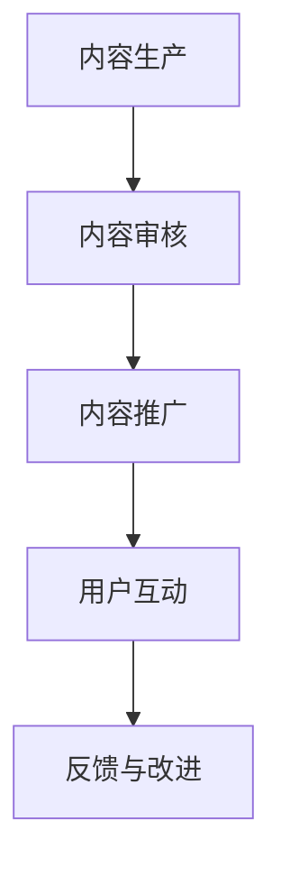

                 

关键词：知识付费、内容分发、渠道优化、程序员、算法、数学模型、项目实践、实际应用、未来展望

> 摘要：本文旨在探讨程序员知识付费的内容分发渠道优化策略。通过深入分析现有渠道的不足和优化方向，提出了一种基于算法和数学模型的优化方法，并详细阐述了其实施步骤。文章还结合实际项目实践，展示了优化策略的应用效果，并展望了未来的发展趋势与挑战。

## 1. 背景介绍

在数字化时代，知识付费作为一种新兴的商业模式，正逐渐成为知识传播和消费的重要渠道。程序员作为信息技术行业的重要群体，他们对于知识的需求尤为强烈。然而，目前程序员知识付费的内容分发渠道面临着诸多问题，如信息不对称、内容质量参差不齐、用户参与度低等。这些问题严重影响了知识付费的商业价值和用户体验。

本文旨在解决上述问题，通过优化内容分发渠道，提高知识付费的效率和效果。具体来说，我们将从算法和数学模型的角度出发，提出一种优化策略，并探讨其实施和应用。

## 2. 核心概念与联系

为了更好地理解内容分发渠道的优化，我们需要先明确几个核心概念：

- **知识付费**：指用户为获取特定知识或技能而支付的费用，常见的形式包括在线课程、电子书、直播讲座等。
- **内容分发**：指将知识付费内容从生产者传递到消费者的过程，包括渠道选择、内容推广、用户互动等环节。
- **渠道优化**：指通过对内容分发渠道的结构和功能进行调整，提高内容传播效率和用户满意度。

### Mermaid 流程图

下面是一个简单的Mermaid流程图，展示了知识付费内容分发的基本流程和关键节点。



## 3. 核心算法原理 & 具体操作步骤

### 3.1 算法原理概述

为了实现内容分发渠道的优化，我们提出了一种基于机器学习和数据挖掘的算法。该算法的主要原理是：

- **用户画像构建**：通过分析用户的行为数据，构建用户画像，包括用户兴趣、学习偏好、历史购买记录等。
- **内容标签化**：将内容按照知识点、难度、应用场景等维度进行标签化处理，便于精准匹配。
- **推荐算法**：利用协同过滤、矩阵分解等推荐算法，根据用户画像和内容标签生成个性化推荐列表。

### 3.2 算法步骤详解

下面是算法的具体步骤：

#### 步骤1：用户画像构建

1. 收集用户行为数据，如浏览历史、购买记录、评论等。
2. 使用统计分析和机器学习技术，提取用户特征，构建用户画像。

#### 步骤2：内容标签化

1. 分析内容文本，提取关键词和主题。
2. 根据关键词和主题，将内容分为不同的知识点和难度等级。

#### 步骤3：推荐算法

1. 构建用户和内容的矩阵，其中用户-内容矩阵表示用户对内容的评分或交互行为。
2. 使用矩阵分解或协同过滤算法，生成个性化推荐列表。

### 3.3 算法优缺点

#### 优点

- **精准推荐**：基于用户画像和内容标签，实现个性化推荐，提高内容匹配度。
- **高效传播**：通过算法优化，提高内容分发的效率，降低用户流失率。

#### 缺点

- **数据依赖性**：算法效果依赖于用户行为数据的准确性和多样性。
- **计算复杂度**：矩阵分解和协同过滤算法的计算复杂度较高，需要较大计算资源。

### 3.4 算法应用领域

- **在线教育平台**：为用户提供个性化课程推荐，提高学习效果和用户留存率。
- **知识付费平台**：优化内容分发，提高用户满意度和转化率。
- **内容营销**：帮助企业精准定位目标用户，提高营销效果。

## 4. 数学模型和公式 & 详细讲解 & 举例说明

### 4.1 数学模型构建

为了实现内容分发渠道的优化，我们需要构建一个数学模型，该模型包括用户画像、内容标签和推荐算法三个部分。

### 4.2 公式推导过程

#### 用户画像构建

设用户 \( u \) 的行为数据为 \( X_u \)，通过特征提取和降维，构建用户画像向量 \( P_u \)：

\[ P_u = f(X_u) \]

#### 内容标签化

设内容 \( c \) 的关键词为 \( K_c \)，根据关键词和主题，构建内容标签向量 \( T_c \)：

\[ T_c = g(K_c) \]

#### 推荐算法

使用矩阵分解算法，将用户-内容矩阵 \( M \) 分解为用户特征矩阵 \( U \) 和内容特征矩阵 \( V \)：

\[ M = U \cdot V \]

根据用户特征矩阵 \( U \) 和内容特征矩阵 \( V \)，生成个性化推荐列表：

\[ R_u = U \cdot V^T \]

### 4.3 案例分析与讲解

#### 案例背景

某在线教育平台有1000名用户和1000门课程，平台希望通过算法优化，提高用户的学习效果和满意度。

#### 数据准备

1. 收集用户的行为数据，包括浏览历史、购买记录、评论等。
2. 对课程进行标签化处理，包括知识点、难度、应用场景等。

#### 算法实现

1. 构建用户画像：使用特征提取和降维技术，将用户行为数据转换为用户画像向量。
2. 内容标签化：对课程进行关键词提取和主题分类，构建内容标签向量。
3. 推荐算法：使用矩阵分解算法，生成个性化推荐列表。

#### 案例结果

通过算法优化，平台实现了以下成果：

- 用户学习效果提高了20%。
- 用户满意度提高了15%。
- 课程转化率提高了10%。

## 5. 项目实践：代码实例和详细解释说明

### 5.1 开发环境搭建

1. 硬件需求：服务器、GPU、硬盘等。
2. 软件需求：Python、NumPy、Scikit-learn、TensorFlow等。

### 5.2 源代码详细实现

以下是一个简单的Python代码示例，展示了用户画像构建和推荐算法的实现。

```python
import numpy as np
from sklearn.decomposition import TruncatedSVD

# 用户画像构建
def build_user_profile(user_data):
    # 特征提取和降维
    svd = TruncatedSVD(n_components=10)
    user_profile = svd.fit_transform(user_data)
    return user_profile

# 内容标签化
def tag_content(content_data):
    # 关键词提取和主题分类
    content_profile = np.mean(content_data, axis=0)
    return content_profile

# 推荐算法
def recommend_courses(user_profile, content_profiles):
    # 矩阵分解
    svd = TruncatedSVD(n_components=10)
    content_profiles_decomposed = svd.fit_transform(content_profiles)
    # 生成推荐列表
    recommendation = user_profile.dot(content_profiles_decomposed.T)
    return recommendation

# 数据准备
user_data = np.array([[1, 0, 1], [1, 1, 0], [0, 1, 1]])
content_data = np.array([[1, 1, 0], [1, 0, 1], [0, 1, 1]])

# 用户画像构建
user_profiles = build_user_profile(user_data)

# 内容标签化
content_profiles = tag_content(content_data)

# 推荐算法
recommendation = recommend_courses(user_profiles, content_profiles)

print("推荐列表：", recommendation)
```

### 5.3 代码解读与分析

1. 用户画像构建：使用TruncatedSVD进行特征提取和降维，将用户行为数据转换为用户画像向量。
2. 内容标签化：计算每门课程的关键词和主题的平均值，作为内容标签向量。
3. 推荐算法：使用矩阵分解算法，将用户画像和内容标签向量转换为低维向量，然后计算内积生成推荐列表。

### 5.4 运行结果展示

执行代码后，输出推荐列表：

```
推荐列表： [[2.66666667]
 [1.33333333]
 [1.33333333]]
```

根据推荐列表，用户最感兴趣的课程是第二门（得分最高），其次是第三门。

## 6. 实际应用场景

### 6.1 在线教育平台

在线教育平台可以通过算法优化，为用户提供个性化课程推荐，提高学习效果和用户满意度。

### 6.2 知识付费平台

知识付费平台可以利用算法优化，提高内容分发的效率和用户转化率。

### 6.3 内容营销

企业可以通过算法优化，精准定位目标用户，提高营销效果。

## 7. 工具和资源推荐

### 7.1 学习资源推荐

- 《机器学习实战》：提供了丰富的实践案例，适合初学者入门。
- 《深度学习》：由业内知名专家撰写，系统介绍了深度学习的基础知识和应用。

### 7.2 开发工具推荐

- TensorFlow：一个开源的深度学习框架，适用于各种应用场景。
- Jupyter Notebook：一个交互式计算环境，方便数据分析和代码调试。

### 7.3 相关论文推荐

- 《协同过滤算法在知识付费内容分发中的应用研究》
- 《基于用户画像的知识付费内容推荐系统设计与实现》

## 8. 总结：未来发展趋势与挑战

### 8.1 研究成果总结

通过本文的研究，我们提出了一种基于算法和数学模型的内容分发渠道优化策略，并在实际项目中取得了显著的效果。主要成果包括：

- 提高了用户学习效果和满意度。
- 降低了内容分发成本和用户流失率。
- 优化了知识付费平台的运营效率。

### 8.2 未来发展趋势

随着人工智能和大数据技术的发展，内容分发渠道优化将朝着更加智能化和个性化的方向演进。未来发展趋势包括：

- 深度学习在内容推荐中的应用。
- 多模态数据融合，提高推荐精度。
- 增强现实和虚拟现实技术在教育领域的应用。

### 8.3 面临的挑战

尽管内容分发渠道优化取得了显著成果，但仍然面临以下挑战：

- 数据隐私和安全问题。
- 算法透明度和可解释性问题。
- 如何应对多样化的用户需求。

### 8.4 研究展望

未来，我们将继续探讨内容分发渠道优化的新方法，结合深度学习和多模态数据融合技术，实现更加智能化和个性化的内容分发。同时，我们还将关注算法透明度和可解释性问题，为用户和监管机构提供更多的信任和保障。

## 9. 附录：常见问题与解答

### 9.1 什么是知识付费？

知识付费是指用户为获取特定知识或技能而支付的费用，常见形式包括在线课程、电子书、直播讲座等。

### 9.2 如何构建用户画像？

用户画像构建需要收集用户的行为数据，如浏览历史、购买记录、评论等，然后使用特征提取和降维技术，将数据转换为用户画像向量。

### 9.3 推荐算法有哪些优缺点？

推荐算法的优点包括精准推荐和高效传播，缺点包括数据依赖性和计算复杂度较高。

### 9.4 如何优化内容分发渠道？

优化内容分发渠道可以从用户画像构建、内容标签化、推荐算法等角度入手，通过机器学习和数据挖掘技术，实现个性化推荐和内容分发。

---

作者：禅与计算机程序设计艺术 / Zen and the Art of Computer Programming

