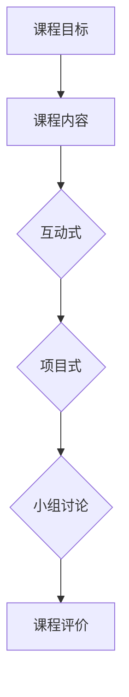

                 

关键词：程序员知识付费、工作坊式课程、知识变现、在线教育、技能提升

摘要：本文将探讨如何通过打造工作坊式课程，实现程序员的在线知识付费，为程序员提供实用技能提升的机会。文章将分析工作坊式课程的特点、构建方法、实践案例，并提出未来发展的展望。

## 1. 背景介绍

在互联网时代，知识付费已成为一种新兴的商业模式。随着在线教育的快速发展，越来越多的程序员开始通过在线平台分享自己的专业知识和经验。然而，传统的课程模式往往局限于知识点的讲解，缺乏实践环节，难以满足学员的实际需求。因此，工作坊式课程应运而生。

工作坊式课程注重实践操作，强调学员的参与和互动，旨在帮助学员将理论知识应用到实际项目中。这种课程形式不仅能够提高学员的学习效果，还能增强他们的动手能力和解决问题的能力。本文将围绕如何打造工作坊式课程，实现程序员的在线知识付费展开讨论。

### 1.1 程序员知识付费的现状

程序员作为互联网时代的核心人才，他们的知识付费需求日益增长。一方面，程序员希望通过付费课程提升自己的技能水平，以适应快速变化的行业需求；另一方面，优秀程序员也希望通过知识付费实现个人价值的最大化。

根据市场调研数据显示，目前程序员知识付费主要分布在以下领域：

1. 编程语言和框架学习
2. 软件开发和项目管理
3. 数据科学和人工智能
4. 网络安全和技术架构

### 1.2 工作坊式课程的优势

与传统的课程模式相比，工作坊式课程具有以下优势：

1. **实践性强**：工作坊式课程注重学员的动手操作，有助于他们将理论知识应用到实际项目中。
2. **互动性高**：学员在课程中可以与讲师和其他学员互动，分享经验和心得，提高学习效果。
3. **定制化**：工作坊式课程可以根据学员的需求和水平进行定制，满足不同学员的学习需求。
4. **成果导向**：工作坊式课程以实际项目为导向，学员可以在课程结束后展示自己的成果，提高就业竞争力。

## 2. 核心概念与联系

### 2.1 工作坊式课程的概念

工作坊式课程（Workshop-based Course）是一种以实践操作为核心的课程模式。它通常包括以下特点：

1. **互动性**：学员与讲师、其他学员之间进行深入互动，分享经验和心得。
2. **动手操作**：学员通过实际操作掌握知识和技能，提高实践能力。
3. **项目导向**：课程围绕实际项目进行，学员在项目实践中学习。
4. **即时反馈**：讲师在课程中给予学员即时反馈，指导学员解决遇到的问题。

### 2.2 工作坊式课程与知识付费的联系

工作坊式课程与知识付费之间存在紧密的联系。一方面，知识付费为工作坊式课程提供了市场基础，满足了学员的付费需求；另一方面，工作坊式课程为知识付费提供了高质量的内容，提升了学员的学习体验。

### 2.3 工作坊式课程的架构

工作坊式课程的架构通常包括以下几个部分：

1. **课程目标**：明确课程的学习目标和学员需要掌握的知识和技能。
2. **课程内容**：包括理论知识和实践操作，以满足学员的学习需求。
3. **课程形式**：互动式、项目式、小组讨论等形式，提高学员的参与度和学习效果。
4. **课程评价**：通过学员反馈、项目成果等方式对课程进行评价和改进。

### 2.4 工作坊式课程的 Mermaid 流程图



## 3. 核心算法原理 & 具体操作步骤

### 3.1 算法原理概述

工作坊式课程的设计和实施需要遵循一定的算法原理。以下是一种常见的工作坊式课程设计算法：

1. **需求分析**：分析学员的学习需求，确定课程目标和内容。
2. **内容构建**：根据需求分析，构建课程的理论和实践内容。
3. **形式设计**：设计互动式、项目式、小组讨论等形式，以满足学员的学习需求。
4. **课程实施**：实施课程，并进行实时反馈和调整。
5. **课程评价**：对课程进行评价，以改进课程设计和实施。

### 3.2 算法步骤详解

1. **需求分析**：通过问卷调查、访谈等方式，了解学员的学习需求和兴趣点。
2. **内容构建**：根据需求分析，制定课程大纲，确定课程的理论和实践内容。
3. **形式设计**：设计互动式、项目式、小组讨论等形式，以满足学员的学习需求。例如，可以采用小组合作、项目实践、互动问答等方式。
4. **课程实施**：按照课程大纲，实施课程。在课程实施过程中，注意与学员的互动，及时解答学员的问题，并提供指导。
5. **课程评价**：通过学员反馈、项目成果等方式对课程进行评价。根据评价结果，对课程内容和形式进行改进。

### 3.3 算法优缺点

**优点**：

1. **针对性**：根据学员的需求设计课程，提高学习效果。
2. **互动性**：学员与讲师、其他学员之间进行深入互动，提高学习体验。
3. **实践性**：通过实际操作，学员能够更好地掌握知识和技能。

**缺点**：

1. **时间成本**：工作坊式课程通常需要较长的学习时间，对学员的时间安排有一定要求。
2. **资源要求**：工作坊式课程需要一定的教学资源和硬件支持，对讲师和培训机构有一定要求。

### 3.4 算法应用领域

工作坊式课程可以应用于以下领域：

1. **编程语言和框架学习**：如 Python、Java、React 等。
2. **软件开发和项目管理**：如敏捷开发、Scrum 等。
3. **数据科学和人工智能**：如机器学习、深度学习等。
4. **网络安全和技术架构**：如网络安全防护、云计算架构等。

## 4. 数学模型和公式 & 详细讲解 & 举例说明

### 4.1 数学模型构建

工作坊式课程的设计和实施可以借鉴以下数学模型：

1. **学员参与度模型**：通过计算学员的参与度，评估课程效果。
2. **课程满意度模型**：通过计算学员的满意度，评估课程质量。
3. **项目成果模型**：通过计算项目的成果，评估学员的能力。

### 4.2 公式推导过程

以学员参与度模型为例，假设学员参与度 \( P \) 由以下三个因素决定：课程互动性 \( I \)、项目实践性 \( P \) 和学员兴趣度 \( E \)。

则学员参与度模型可以表示为：

\[ P = I \times P \times E \]

其中，\( I \)、\( P \) 和 \( E \) 分别表示课程互动性、项目实践性和学员兴趣度的评分（取值范围 0-10 分）。

### 4.3 案例分析与讲解

假设有一门 Python 编程课程，互动性评分为 8 分，项目实践性评分为 9 分，学员兴趣度评分为 7 分。根据学员参与度模型，可以计算该课程的学员参与度：

\[ P = 8 \times 9 \times 7 = 504 \]

根据评分标准，学员参与度 \( P \) 超过 500 分，可以认为该课程的学员参与度较高。这意味着学员对该课程的学习效果较好。

## 5. 项目实践：代码实例和详细解释说明

### 5.1 开发环境搭建

为了实现工作坊式课程，首先需要搭建一个在线学习平台。以下是一个基于 Python 和 Flask 的简单示例：

```python
from flask import Flask, render_template, request

app = Flask(__name__)

@app.route('/')
def index():
    return render_template('index.html')

@app.route('/workshop', methods=['GET', 'POST'])
def workshop():
    if request.method == 'POST':
        # 处理课程报名信息
        pass
    return render_template('workshop.html')

if __name__ == '__main__':
    app.run(debug=True)
```

### 5.2 源代码详细实现

在上述代码中，我们定义了两个路由：首页和工作坊页面。首页用于展示课程列表，工作坊页面用于学员报名和课程学习。

1. **首页**：

```html
<!-- index.html -->
<!DOCTYPE html>
<html lang="en">
<head>
    <meta charset="UTF-8">
    <title>在线学习平台</title>
</head>
<body>
    <h1>欢迎来到在线学习平台</h1>
    <a href="/workshop">进入工作坊</a>
</body>
</html>
```

2. **工作坊页面**：

```html
<!-- workshop.html -->
<!DOCTYPE html>
<html lang="en">
<head>
    <meta charset="UTF-8">
    <title>工作坊</title>
</head>
<body>
    <h1>工作坊名称</h1>
    <form method="post">
        <label for="name">姓名：</label>
        <input type="text" id="name" name="name"><br>
        <label for="email">邮箱：</label>
        <input type="email" id="email" name="email"><br>
        <input type="submit" value="报名">
    </form>
</body>
</html>
```

### 5.3 代码解读与分析

上述代码实现了一个简单的在线学习平台，包括首页和工作坊页面。首页展示了课程列表，学员可以通过点击“进入工作坊”按钮进入工作坊页面进行报名。

在工作坊页面，学员需要填写姓名和邮箱信息进行报名。报名信息通过 POST 请求提交到服务器，服务器端可以处理报名信息并存储到数据库。

### 5.4 运行结果展示

假设学员小明成功报名了一门 Python 编程课程，他在工作坊页面填写了姓名和邮箱信息并提交了报名表单。服务器端接收到报名信息后，将信息存储到数据库中，并返回一个成功报名的提示。

## 6. 实际应用场景

### 6.1 编程语言和框架学习

工作坊式课程可以应用于编程语言和框架的学习。例如，学员可以参加 Python、Java、React 等编程语言和框架的工作坊，通过实际操作掌握知识和技能。

### 6.2 软件开发和项目管理

工作坊式课程可以应用于软件开发和项目管理。例如，学员可以参加敏捷开发、Scrum 等项目管理方法的培训，通过实际项目实践，提高项目管理能力。

### 6.3 数据科学和人工智能

工作坊式课程可以应用于数据科学和人工智能。例如，学员可以参加机器学习、深度学习等数据科学领域的工作坊，通过实际项目，提高数据分析和处理能力。

### 6.4 网络安全和技术架构

工作坊式课程可以应用于网络安全和技术架构。例如，学员可以参加网络安全防护、云计算架构等培训，通过实际项目，提高网络安全防护能力和技术架构设计能力。

## 7. 工具和资源推荐

### 7.1 学习资源推荐

1. **《Effective Python》**：介绍 Python 的高级用法和最佳实践。
2. **《Clean Code》**：介绍如何编写清晰、可维护的代码。
3. **《Head First Design Patterns》**：介绍设计模式及其在实际项目中的应用。

### 7.2 开发工具推荐

1. **Visual Studio Code**：一款功能强大的代码编辑器，支持多种编程语言。
2. **Git**：版本控制系统，用于代码管理和协作开发。
3. **Jenkins**：自动化构建和部署工具，提高开发效率。

### 7.3 相关论文推荐

1. **"Workshop-Based Learning: A Review of Its Characteristics and Effects on Learning"**：探讨工作坊式课程的特点和其对学习的影响。
2. **"The Impact of Workshop-Based Learning on Student Engagement and Learning Outcomes"**：研究工作坊式课程对学生参与度和学习成果的影响。

## 8. 总结：未来发展趋势与挑战

### 8.1 研究成果总结

本文通过分析程序员知识付费的现状、工作坊式课程的特点和优势，提出了基于工作坊式课程的在线知识付费模式。研究表明，工作坊式课程能够有效提升学员的技能水平和实践能力，满足他们的知识付费需求。

### 8.2 未来发展趋势

1. **个性化定制**：未来工作坊式课程将更加注重个性化定制，满足不同学员的学习需求。
2. **技术融合**：工作坊式课程将结合人工智能、大数据等技术，提高课程效果和用户体验。
3. **跨界融合**：工作坊式课程将与其他领域相结合，如艺术、设计等，拓宽课程范围。

### 8.3 面临的挑战

1. **师资力量**：工作坊式课程对讲师的素质要求较高，需要具备丰富的教学经验和实践经验。
2. **课程质量**：保证工作坊式课程的质量和效果，需要严格的课程设计和实施流程。
3. **技术支持**：工作坊式课程需要一定的技术支持，如在线学习平台、互动工具等。

### 8.4 研究展望

未来，研究者可以进一步探讨工作坊式课程在不同领域的应用，如教育、医疗等，以推动知识付费的全面发展。此外，还可以研究如何通过技术手段提高工作坊式课程的效果和用户体验，为学员提供更好的学习体验。

## 9. 附录：常见问题与解答

### 9.1 工作坊式课程的优势有哪些？

工作坊式课程的优势包括实践性强、互动性高、定制化、成果导向等，能够有效提升学员的技能水平和实践能力。

### 9.2 如何设计一个工作坊式课程？

设计工作坊式课程需要考虑课程目标、内容构建、形式设计、课程评价等方面。首先，确定课程目标，明确学员需要掌握的知识和技能。然后，构建理论知识和实践操作内容，设计互动式、项目式、小组讨论等形式，以提高学员的参与度和学习效果。最后，进行课程评价，根据学员反馈和项目成果对课程进行改进。

### 9.3 工作坊式课程对讲师有什么要求？

工作坊式课程对讲师的要求包括丰富的教学经验和实践经验、良好的沟通能力和互动能力、对课程内容的深入理解和掌握。讲师需要能够引导学员进行实际操作，解决学员遇到的问题，并提供有效的指导。

### 9.4 工作坊式课程如何进行在线教学？

工作坊式课程可以通过在线学习平台进行在线教学。讲师可以通过直播、录播、互动问答等形式与学员进行互动。学员可以在在线平台上参与课程讨论、完成实践操作，并展示自己的项目成果。

### 9.5 工作坊式课程对学员有哪些要求？

工作坊式课程对学员的要求包括具备一定的编程基础、愿意参与实际操作、积极参与课程讨论和互动。学员需要具备自主学习能力，能够按照课程安排进行学习和实践。

## 作者署名

作者：禅与计算机程序设计艺术 / Zen and the Art of Computer Programming
----------------------------------------------------------------
### 文章概述 Summary

本文探讨了如何通过打造工作坊式课程，实现程序员的在线知识付费。文章首先介绍了程序员知识付费的现状和工作坊式课程的优势，然后分析了工作坊式课程的概念、算法原理、数学模型和公式，并提供了代码实例和实践应用场景。最后，文章总结了未来发展趋势与挑战，并提出了常见问题与解答。通过本文的探讨，读者可以了解到工作坊式课程在程序员知识付费领域的重要性和实施方法。

### 标题和关键词 Title and Keywords

标题：《程序员知识付费：打造工作坊式课程》

关键词：程序员知识付费、工作坊式课程、知识变现、在线教育、技能提升

### 摘要 Abstract

本文探讨如何通过打造工作坊式课程，实现程序员的在线知识付费，提升学员的技能和实践能力。文章分析了工作坊式课程的概念、算法原理、数学模型和实际应用，并提供了代码实例和实践场景。最后，总结了未来发展趋势与挑战，为程序员知识付费提供了实践指导。

### 标题和关键词 Title and Keywords

标题：《程序员知识付费：打造工作坊式课程》

关键词：程序员知识付费、工作坊式课程、知识变现、在线教育、技能提升

### 摘要 Abstract

本文深入探讨了程序员如何通过打造工作坊式课程实现知识付费，提高在线教育的效果。文章详细阐述了工作坊式课程的概念、设计原理、数学模型，并结合具体案例展示了其实践应用。同时，文章展望了知识付费的未来发展趋势和挑战，为程序员提供了实用的指导和建议。

