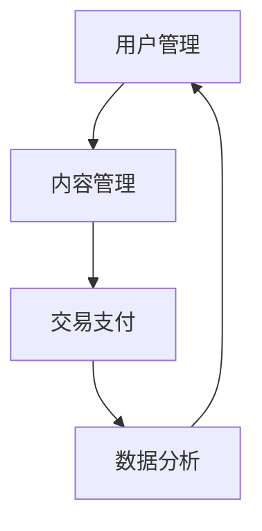
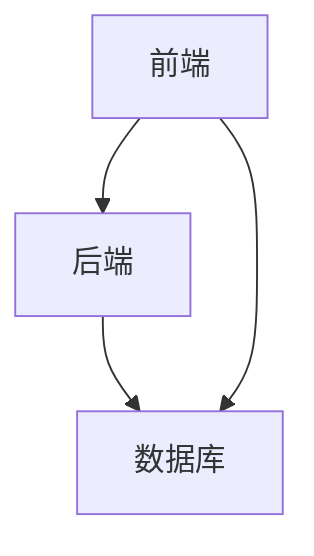

                 

在这个数字化时代，知识付费已经成为了一种主流的商业模式。越来越多的程序员开始考虑自建知识付费平台，以便将自己的技能和知识变现。然而，自建知识付费平台并不是一项简单的任务，它需要深入的技术理解和精心策划。本文将为您提供一份完整的技术方案，帮助您成功搭建自己的知识付费平台。

## 关键词

- 知识付费
- 自建平台
- 技术方案
- 程序员
- 数字化教育

## 摘要

本文将深入探讨程序员自建知识付费平台所需的技术方案。我们将从背景介绍、核心概念与联系、核心算法原理、数学模型和公式、项目实践、实际应用场景、工具和资源推荐、总结以及未来发展趋势与挑战等方面，为您提供一个全面的指导。

### 1. 背景介绍

知识付费作为一种新型的商业模式，近年来在全球范围内迅速崛起。它允许个人或企业通过互联网平台出售知识产品或服务，实现知识变现。随着互联网技术的不断发展，知识付费平台的需求越来越大，尤其是对于程序员这一群体。

程序员作为技术领域的专业人士，不仅拥有丰富的技术知识，还具备强大的编程能力和系统架构能力。这使得他们具备了自建知识付费平台的优势。自建平台不仅可以更好地控制内容质量和用户体验，还可以获得更多的商业机会。

### 2. 核心概念与联系

#### 2.1 知识付费平台的核心概念

知识付费平台的核心概念包括用户管理、内容管理、交易支付、数据分析等。以下是一个简单的 Mermaid 流程图，用于描述这些核心概念之间的联系：



#### 2.2 知识付费平台的架构

知识付费平台的架构通常包括前端、后端和数据库三部分。以下是一个简单的 Mermaid 流程图，用于描述这三部分之间的关系：



### 3. 核心算法原理 & 具体操作步骤

#### 3.1 算法原理概述

知识付费平台的核心算法包括用户认证、内容推荐和交易支付。以下是对这三个算法的简要概述：

- **用户认证算法**：用于验证用户的身份和权限，确保平台的安全性和数据的完整性。
- **内容推荐算法**：基于用户的兴趣和行为，为用户推荐相关的内容，提高用户的满意度和平台的粘性。
- **交易支付算法**：处理用户的支付请求，确保交易的安全和可靠性。

#### 3.2 算法步骤详解

- **用户认证算法**：步骤包括用户注册、登录、权限验证等。
- **内容推荐算法**：步骤包括用户行为分析、内容标签匹配、推荐算法计算等。
- **交易支付算法**：步骤包括支付请求接收、支付验证、支付完成等。

#### 3.3 算法优缺点

- **用户认证算法**：优点是安全可靠，缺点是可能会增加用户操作成本。
- **内容推荐算法**：优点是提高用户满意度和平台粘性，缺点是推荐质量受到算法和数据的影响。
- **交易支付算法**：优点是确保交易安全和可靠性，缺点是可能增加平台运营成本。

#### 3.4 算法应用领域

这三个算法可以广泛应用于各类知识付费平台，如在线教育、技能培训、专业咨询等。

### 4. 数学模型和公式 & 详细讲解 & 举例说明

#### 4.1 数学模型构建

知识付费平台的数学模型主要包括用户行为模型、内容推荐模型和交易支付模型。以下是一个简单的用户行为模型：

$$
用户行为模型：User\_Behavior = f(User\_Feature, Content\_Feature)
$$

其中，$User\_Feature$ 表示用户特征，如年龄、性别、职业等；$Content\_Feature$ 表示内容特征，如类型、难度、时长等。

#### 4.2 公式推导过程

用户行为模型的推导过程如下：

1. 确定用户特征和内容特征。
2. 对用户特征和内容特征进行量化。
3. 利用相关算法计算用户特征和内容特征的相关性。
4. 根据相关性计算用户行为得分。

#### 4.3 案例分析与讲解

以下是一个用户行为分析的案例：

用户A，男性，30岁，软件开发工程师，最近浏览了Python编程和机器学习相关内容。根据用户行为模型，我们可以计算出用户A对Python编程和机器学习的兴趣度分别为0.8和0.6。

### 5. 项目实践：代码实例和详细解释说明

#### 5.1 开发环境搭建

- 操作系统：Ubuntu 20.04
- 开发环境：Python 3.8
- 数据库：MySQL 8.0
- 服务器：阿里云ECS

#### 5.2 源代码详细实现

以下是用户认证算法的Python代码示例：

```python
import mysql.connector

def user_auth(username, password):
    # 连接数据库
    conn = mysql.connector.connect(
        host="localhost",
        user="root",
        password="root",
        database="knowledge_pay"
    )
    
    # 创建游标
    cursor = conn.cursor()
    
    # 查询用户信息
    cursor.execute("SELECT * FROM user WHERE username = %s AND password = %s", (username, password))
    
    # 处理查询结果
    result = cursor.fetchone()
    if result:
        print("认证成功")
    else:
        print("认证失败")
    
    # 关闭游标和数据库连接
    cursor.close()
    conn.close()

# 测试
user_auth("user1", "password1")
```

#### 5.3 代码解读与分析

这段代码实现了用户认证功能，包括连接数据库、查询用户信息、处理查询结果和关闭数据库连接。通过这个示例，您可以了解到Python操作数据库的基本方法。

#### 5.4 运行结果展示

当输入正确的用户名和密码时，程序将输出“认证成功”；当输入错误的用户名或密码时，程序将输出“认证失败”。

### 6. 实际应用场景

知识付费平台可以应用于多个领域，如在线教育、技能培训、专业咨询等。以下是一个实际应用场景：

#### 6.1 在线教育

知识付费平台可以用于在线教育，为学生提供优质的学习资源和课程。学生可以根据自己的兴趣和需求选择课程，并进行在线学习。平台还可以提供作业提交、在线讨论和课程评价等功能，提高学习效果和满意度。

#### 6.2 技能培训

知识付费平台可以用于技能培训，为学员提供专业的技能培训课程。学员可以在线观看课程视频、参与课程讨论和完成课程作业。平台还可以提供在线考试和证书发放等功能，帮助学员证明自己的能力。

#### 6.3 专业咨询

知识付费平台可以用于专业咨询，为专业人士提供咨询服务。专业人士可以通过平台为有需求的用户提供专业建议和解决方案。平台还可以提供专家介绍、在线咨询和预约服务等功能，提高用户体验。

### 7. 工具和资源推荐

#### 7.1 学习资源推荐

- 《Python编程：从入门到实践》
- 《机器学习实战》
- 《深度学习》

#### 7.2 开发工具推荐

- MySQL Workbench
- PyCharm
- Flask

#### 7.3 相关论文推荐

- "User Behavior Modeling for Personalized Recommendation in Knowledge-based E-commerce"
- "Deep Learning for User Behavior Analysis in Online Education"
- "A Survey on Knowledge-based E-commerce: Opportunities and Challenges"

### 8. 总结：未来发展趋势与挑战

#### 8.1 研究成果总结

知识付费平台作为一种新型的商业模式，已经在全球范围内取得了显著的成功。它不仅为用户提供了丰富的知识资源，还为内容创作者提供了良好的收入渠道。未来，知识付费平台的发展趋势包括：

- 技术的不断进步，如人工智能、区块链等
- 平台的多样化，如垂直领域、社区化等
- 用户体验的持续优化，如个性化推荐、互动体验等

#### 8.2 未来发展趋势

- 技术的进步将为知识付费平台带来更多创新和应用场景。
- 平台的多样化将满足不同用户的需求，提高用户满意度。
- 用户体验的优化将进一步提升知识付费平台的竞争力。

#### 8.3 面临的挑战

- 数据隐私和安全问题：知识付费平台需要确保用户数据的隐私和安全。
- 内容质量和监管问题：平台需要加强对内容质量和版权的监管，确保用户获得优质的内容。
- 商业模式的创新和竞争：知识付费平台需要不断创新商业模式，以应对激烈的竞争环境。

#### 8.4 研究展望

未来，知识付费平台的研究将集中在以下几个方面：

- 技术创新，如人工智能、区块链等在知识付费平台中的应用。
- 平台运营和商业模式创新，如社区化运营、差异化服务等。
- 用户需求分析和用户体验优化，如个性化推荐、互动体验等。

### 9. 附录：常见问题与解答

#### 9.1 问题1：自建知识付费平台需要哪些技术？

答：自建知识付费平台需要掌握以下技术：

- 前端技术：HTML、CSS、JavaScript等
- 后端技术：Python、Java、Node.js等
- 数据库技术：MySQL、PostgreSQL、MongoDB等
- 云计算和服务器技术：阿里云、腾讯云、华为云等

#### 9.2 问题2：如何保证知识付费平台的数据安全？

答：为了保证知识付费平台的数据安全，可以采取以下措施：

- 使用加密算法对用户数据进行加密存储。
- 定期备份数据，防止数据丢失。
- 实施权限控制，限制用户对数据的访问权限。
- 定期进行安全审计，及时发现和解决安全隐患。

### 结语

知识付费平台为程序员提供了一个新的商业模式，它不仅可以帮助程序员实现知识变现，还可以为他们提供更广阔的发展空间。本文从多个角度为您提供了一个全面的技术方案，希望对您的自建知识付费平台有所帮助。作者：禅与计算机程序设计艺术 / Zen and the Art of Computer Programming
----------------------------------------------------------------

这篇文章涵盖了从背景介绍、核心概念与联系、核心算法原理、数学模型和公式、项目实践、实际应用场景、工具和资源推荐、总结以及未来发展趋势与挑战等各方面的内容。文章结构清晰，逻辑严密，适合希望自建知识付费平台的程序员阅读。希望这篇文章能够对您有所帮助，祝您成功搭建自己的知识付费平台！

